# SpringBoot 2 & Spring 5 笔记

* [1.Maven](#1maven)
  * [1.1.为什么要学习maven](#11为什么要学习maven)
    * [从『构建』角度看](#从构建角度看)
      * [个人开发流程](#个人开发流程)
      * [团队开发流程](#团队开发流程)
    * [从『依赖』角度看](#从依赖角度看)
      * [jar包的规模](#jar包的规模)
      * [jar包的来源](#jar包的来源)
      * [jar包之间的依赖关系](#jar包之间的依赖关系)
  * [1.2.什么是Maven](#12什么是maven)
    * [构建](#构建)
    * [依赖](#依赖)
    * [Maven的工作机制](#maven的工作机制)
  * [1.3.Maven核心程序解压与配置](#13maven核心程序解压与配置)
    * [解压Maven核心程序](#解压maven核心程序)
    * [指定本地仓库](#指定本地仓库)
    * [配置阿里云提供的镜像仓库](#配置阿里云提供的镜像仓库)
    * [配置Maven工程的基础JDK版本](#配置maven工程的基础jdk版本)
    * [配置环境变量](#配置环境变量)
      * [检查JAVA_HOME配置是否正确](#检查java_home配置是否正确)
      * [配置MAVEN_HOME](#配置maven_home)
      * [配置PATH](#配置path)
      * [验证](#验证)
  * [1.4.Maven核心概念01：坐标](#14maven核心概念01坐标)
    * [数学中的坐标](#数学中的坐标)
    * [Maven中的坐标](#maven中的坐标)
      * [向量说明](#向量说明)
      * [三个向量的取值方式](#三个向量的取值方式)
    * [坐标和仓库中jar包的存储路径之间的对应关系](#坐标和仓库中jar包的存储路径之间的对应关系)
  * [1.5.Maven核心概念02：POM](#15maven核心概念02pom)
    * [含义](#含义)
    * [思想](#思想)
    * [对应的配置文件](#对应的配置文件)
  * [1.6.Maven核心概念03：约定的目录结构](#16maven核心概念03约定的目录结构)
    * [各个目录的作用](#各个目录的作用)
    * [约定目录结构意义](#约定目录结构意义)
    * [约定大于配置](#约定大于配置)
  * [1.7.Maven核心概念04：生命周期](#17maven核心概念04生命周期)
    * [作用](#作用)
    * [三个生命周期](#三个生命周期)
    * [特点](#特点)
  * [1.8.Maven核心概念05：插件和目标](#18maven核心概念05插件和目标)
    * [插件](#插件)
    * [目标](#目标)
  * [1.9.Maven核心概念06：依赖](#19maven核心概念06依赖)
    * [依赖基本配置方式](#依赖基本配置方式)
    * [依赖的范围](#依赖的范围)
    * [依赖的传递性](#依赖的传递性)
    * [依赖的排除](#依赖的排除)
  * [1.10.Maven核心概念07：继承](#110maven核心概念07继承)
    * [概念](#概念)
    * [作用](#作用-1)
    * [举例](#举例)
    * [操作](#操作)
    * [实际意义](#实际意义)
  * [1.11.Maven核心概念08：聚合](#111maven核心概念08聚合)
    * [聚合本身的含义](#聚合本身的含义)
    * [Maven中的聚合](#maven中的聚合)
    * [好处](#好处)
    * [聚合的配置](#聚合的配置)
    * [依赖循环问题](#依赖循环问题)
  * [1.12.Maven核心概念09：仓库](#112maven核心概念09仓库)
  * [1.13.使用Maven（CMD）](#113使用mavencmd)
    * [实验一：根据坐标创建Maven工程](#实验一根据坐标创建maven工程)
    * [实验二：在Maven工程中编写代码](#实验二在maven工程中编写代码)
    * [实验三：执行Maven的构建命令](#实验三执行maven的构建命令)
    * [实验四：创建Maven版的Web工程](#实验四创建maven版的web工程)
    * [实验五：让Web工程依赖Java工程](#实验五让web工程依赖java工程)
    * [实验六：测试依赖的范围](#实验六测试依赖的范围)
    * [实验七：测试依赖的传递性](#实验七测试依赖的传递性)
    * [实验八：测试依赖的排除](#实验八测试依赖的排除)
    * [实验九：继承](#实验九继承)
  * [1.14.使用Maven（IDEA）](#114使用mavenidea)
    * [用Maven创建Java工程](#用maven创建java工程)
    * [用Maven创建Java Module工程](#用maven创建java-module工程)
    * [用Maven创建Java Web工程](#用maven创建java-web工程)
    * [如何修改maven中的默认Plugins版本（插件）](#如何修改maven中的默认plugins版本插件)
  * [1.15.jar包下载失败的情况总汇](#115jar包下载失败的情况总汇)
    * [第一种情况](#第一种情况)
    * [第二种情况](#第二种情况)
* [2.Mybatis](#2mybatis)
  * [2.1.前言](#21前言)
    * [总体技术体系](#总体技术体系)
    * [框架的概念](#框架的概念)
    * [Mybatis历史](#mybatis历史)
    * [Mybatis下载地址](#mybatis下载地址)
    * [Mybatis特性](#mybatis特性)
    * [和其它持久化层技术对比](#和其它持久化层技术对比)
  * [2.2.代码示例(HelloWorld)](#22代码示例helloworld)
    * [物理建模](#物理建模)
    * [逻辑建模](#逻辑建模)
    * [搭建框架开发环境](#搭建框架开发环境)
    * [junit测试代码](#junit测试代码)
    * [修正一个误区](#修正一个误区)
  * [2.3.代码示例(HelloWorld)强化](#23代码示例helloworld强化)
    * [加入日志](#加入日志)
    * [关联外部属性文件](#关联外部属性文件)
      * [用上Mapper接口](#用上mapper接口)
    * [增删改操作](#增删改操作)
    * [所有代码示例](#所有代码示例)
  * [2.4.给SQL语句传参](#24给sql语句传参)
    * [#{}方式](#方式)
    * [${}方式](#方式-1)
  * [2.5.数据输入](#25数据输入)
    * [Mybatis总体机制概括](#mybatis总体机制概括)
    * [概念说明](#概念说明)
    * [单个简单类型参数](#单个简单类型参数)
    * [实体类类型参数](#实体类类型参数)
    * [零散的简单类型数据](#零散的简单类型数据)
    * [Map类型参数](#map类型参数)
  * [2.6.数据输出](#26数据输出)
    * [返回单个简单类型数据](#返回单个简单类型数据)
    * [返回实体类对象](#返回实体类对象)
    * [返回Map类型](#返回map类型)
    * [返回List类型](#返回list类型)
    * [返回自增主键](#返回自增主键)
    * [数据库表字段和实体类属性对应关系](#数据库表字段和实体类属性对应关系)
  * [2.7.关联关系](#27关联关系)
    * [概念](#概念-1)
    * [对一示例](#对一示例)
    * [对多示例](#对多示例)
    * [分步查询示例](#分步查询示例)
    * [延迟加载](#延迟加载)
    * [关键词总结](#关键词总结)
    * [多对多关联关系需要只用中间表](#多对多关联关系需要只用中间表)
  * [2.8.动态SQL](#28动态sql)
    * [简介](#简介)
    * [where和if标签](#where和if标签)
    * [set和if标签](#set和if标签)
    * [trim和if标签](#trim和if标签)
    * [choose/when/otherwise标签](#choosewhenotherwise标签)
    * [foreach标签](#foreach标签)
    * [sql标签](#sql标签)
  * [2.9.缓存机制](#29缓存机制)
    * [简介](#简介-1)
    * [一级缓存](#一级缓存)
    * [二级缓存](#二级缓存)
    * [整合EHCache](#整合ehcache)
    * [缓存的基本原理](#缓存的基本原理)
  * [2.10.逆向工程（MGB）](#210逆向工程mgb)
    * [概念与机制](#概念与机制)
    * [操作](#操作-1)
    * [QBC查询](#qbc查询)
  * [2.11.其他注意点](#211其他注意点)
    * [实体类类型别名](#实体类类型别名)
    * [类型处理器](#类型处理器)
    * [Mapper映射](#mapper映射)
    * [插件机制](#插件机制)
    * [Mybatis底层的JDBC封装](#mybatis底层的jdbc封装)
  * [2.12.大纲总结](#212大纲总结)
* [3.Spring](#3spring)
  * [3.1.Spring简介](#31spring简介)
    * [一家公司](#一家公司)
    * [Spring旗下的众多项目](#spring旗下的众多项目)
    * [Spring Framework](#spring-framework)
  * [3.2.IOC容器概念](#32ioc容器概念)
    * [普通容器](#普通容器)
    * [复杂容器](#复杂容器)
    * [IOC思想](#ioc思想)
    * [IOC容器在Spring中的实现](#ioc容器在spring中的实现)
  * [3.3.基于XML管理bean](#33基于xml管理bean)
    * [实验一 [重要]创建bean](#实验一-重要创建bean)
    * [实验二 [重要]获取bean](#实验二-重要获取bean)
    * [实验三 [重要]给bean的属性赋值：setter注入](#实验三-重要给bean的属性赋值setter注入)
    * [实验四 [重要]给bean的属性赋值：引用外部已声明的bean（手动装配）](#实验四-重要给bean的属性赋值引用外部已声明的bean手动装配)
    * [实验五 [重要]给bean的属性赋值：内部bean](#实验五-重要给bean的属性赋值内部bean)
    * [实验六 [重要]给bean的属性赋值：引入外部属性文件](#实验六-重要给bean的属性赋值引入外部属性文件)
    * [实验七 给bean的属性赋值：级联属性赋值](#实验七-给bean的属性赋值级联属性赋值)
    * [实验八 给bean的属性赋值：构造器注入](#实验八-给bean的属性赋值构造器注入)
    * [实验九 给bean的属性赋值：特殊值处理](#实验九-给bean的属性赋值特殊值处理)
    * [实验十 给bean的属性赋值：使用p名称空间](#实验十-给bean的属性赋值使用p名称空间)
    * [实验十一 给bean的属性赋值：集合属性](#实验十一-给bean的属性赋值集合属性)
    * [实验十二 自动装配](#实验十二-自动装配)
    * [实验十三 集合类型的bean](#实验十三-集合类型的bean)
    * [实验十四 FactoryBean机制](#实验十四-factorybean机制)
    * [实验十五 bean的作用域](#实验十五-bean的作用域)
    * [实验十六 bean的生命周期](#实验十六-bean的生命周期)
    * [实验代码总结](#实验代码总结)
  * [3.4.基于注解管理bean](#34基于注解管理bean)
    * [实验一 [重要]标记与扫描](#实验一-重要标记与扫描)
    * [实验二 [重要]自动装配](#实验二-重要自动装配)
    * [实验三 完全注解开发](#实验三-完全注解开发)
    * [实验四 整合junit4](#实验四-整合junit4)
  * [3.5.AOP面向切面编程](#35aop面向切面编程)
    * [情景设定](#情景设定)
    * [代理模式](#代理模式)
      * [概念](#概念-2)
      * [静态代理](#静态代理)
      * [动态代理](#动态代理)
    * [核心套路](#核心套路)
    * [AOP术语](#aop术语)
      * [横切关注点](#横切关注点)
      * [通知[记住]](#通知记住)
      * [切面[记住]](#切面记住)
      * [目标](#目标-1)
      * [代理](#代理)
      * [连接点](#连接点)
      * [切入点[记住]](#切入点记住)
    * [基于注解的AOP](#基于注解的aop)
      * [AOP概念介绍](#aop概念介绍)
      * [基于注解的AOP用到的技术](#基于注解的aop用到的技术)
      * [初步实现](#初步实现)
      * [各个通知获取细节信息](#各个通知获取细节信息)
      * [重用切入点表达式](#重用切入点表达式)
      * [切入点表达式语法](#切入点表达式语法)
      * [环绕通知](#环绕通知)
      * [切面的优先级](#切面的优先级)
      * [没有接口的情况](#没有接口的情况)
      * [小结](#小结)
    * [基于XML的AOP[了解]](#基于xml的aop了解)
    * [AOP对获取bean的影响](#aop对获取bean的影响)
      * [根据类型获取bean](#根据类型获取bean)
      * [自动装配](#自动装配)
      * [总结](#总结)
  * [3.6.声明式事务](#36声明式事务)
    * [JdbcTemplate](#jdbctemplate)
      * [简介](#简介-2)
      * [准备工作](#准备工作)
      * [基本用法](#基本用法)
    * [声明式事务概念](#声明式事务概念)
      * [编程式事务](#编程式事务)
      * [声明式事务](#声明式事务)
      * [事务管理器](#事务管理器)
    * [基于注解的声明式事务](#基于注解的声明式事务)
      * [实验一 准备工作](#实验一-准备工作)
      * [实验二 应用最基本的事务控制](#实验二-应用最基本的事务控制)
      * [实验三 事务属性：只读readOnly](#实验三-事务属性只读readonly)
      * [实验四 事务属性：超时timeout](#实验四-事务属性超时timeout)
      * [实验五 事务属性：需要回滚和不需要回滚的异常](#实验五-事务属性需要回滚和不需要回滚的异常)
      * [实验六 事务属性：事务隔离级别isolation](#实验六-事务属性事务隔离级别isolation)
      * [实验七 事务属性：事务传播行为propagation](#实验七-事务属性事务传播行为propagation)
    * [基于XML的声明式事务](#基于xml的声明式事务)
  * [3.7.Spring5新特性](#37spring5新特性)
    * [JSR305标准相关注解](#jsr305标准相关注解)
      * [从JSR说起](#从jsr说起)
      * [JSR 305](#jsr-305)
      * [相关注解](#相关注解)
    * [整合junit5](#整合junit5)
      * [导入依赖](#导入依赖)
      * [创建测试类](#创建测试类)
      * [使用复合注解](#使用复合注解)
  * [3.8.大纲总结](#38大纲总结)
* [4.SpringMVC](#4springmvc)
  * [4.1.SpringMVC概述](#41springmvc概述)
    * [SpringMVC 优势](#springmvc-优势)
    * [表述层框架要解决的基本问题](#表述层框架要解决的基本问题)
    * [SpringMVC 代码对比](#springmvc-代码对比)
      * [基于原生 Servlet API 开发代码片段](#基于原生-servlet-api-开发代码片段)
      * [基于 SpringMVC 开发代码片段](#基于-springmvc-开发代码片段)
  * [4.2.HelloWorld](#42helloworld)
    * [功能需求](#功能需求)
    * [搭建环境](#搭建环境)
    * [代码实现](#代码实现)
  * [4.3.@RequestMapping注解](#43requestmapping注解)
    * [匹配方式说明](#匹配方式说明)
    * [在类级别标记](#在类级别标记)
    * [附加请求方式要求](#附加请求方式要求)
    * [Ambiguous mapping异常](#ambiguous-mapping异常)
  * [4.4.获取请求参数](#44获取请求参数)
    * [一名一值](#一名一值)
    * [一名多值](#一名多值)
    * [表单对应模型](#表单对应模型)
    * [表单对应实体类包含级联属性](#表单对应实体类包含级联属性)
    * [要发送的数据是实体类 List](#要发送的数据是实体类-list)
  * [4.5.@RequestHeader注解](#45requestheader注解)
    * [作用](#作用-2)
    * [用法](#用法)
  * [4.6.@CookieValue注解](#46cookievalue注解)
    * [作用](#作用-3)
    * [用法](#用法-1)
  * [4.7.获取原生Servlet API对象](#47获取原生servlet-api对象)
    * [原生 Servlet API](#原生-servlet-api)
    * [可以直接拿到的对象](#可以直接拿到的对象)
    * [获取ServletContext](#获取servletcontext)
    * [原生对象和 IOC 容器关系](#原生对象和-ioc-容器关系)
  * [4.8.属性域](#48属性域)
    * [在整个应用中属性域的重要作用](#在整个应用中属性域的重要作用)
    * [请求域操作方式（model）](#请求域操作方式model)
    * [模型的本质](#模型的本质)
    * [框架底层将模型存入请求域](#框架底层将模型存入请求域)
    * [会话域（原生HttpSession）](#会话域原生httpsession)
    * [应用域（原生ServletContext）](#应用域原生servletcontext)
  * [4.9.静态资源访问](#49静态资源访问)
    * [静态资源的概念](#静态资源的概念)
    * [SpringMVC 环境下静态资源问题](#springmvc-环境下静态资源问题)
  * [4.10.mvc:view-controller](#410mvcview-controller)
    * [需求情景](#需求情景)
    * [具体操作](#具体操作)
  * [4.11.表单标签](#411表单标签)
    * [回显简单标签](#回显简单标签)
    * [回显带选择功能的标签](#回显带选择功能的标签)
  * [4.12.SpringMVC基础案例](#412springmvc基础案例)
    * [准备工作](#准备工作-1)
    * [搭建环境](#搭建环境-1)
    * [功能清单](#功能清单)
      * [显示首页](#显示首页)
      * [显示全部数据](#显示全部数据)
      * [删除](#删除)
      * [添加的表单](#添加的表单)
      * [执行保存](#执行保存)
      * [更新的表单](#更新的表单)
      * [执行更新](#执行更新)
  * [4.13.RESTFul风格交互方式](#413restful风格交互方式)
    * [RESTFul概述](#restful概述)
      * [REST 概念](#rest-概念)
      * [挑战与应对](#挑战与应对)
      * [REST 规范的内涵](#rest-规范的内涵)
      * [REST 规范具体要求](#rest-规范具体要求)
      * [REST 风格的好处](#rest-风格的好处)
    * [四种请求方式映射](#四种请求方式映射)
      * [HiddenHttpMethodFilter 与装饰模式](#hiddenhttpmethodfilter-与装饰模式)
      * [PUT 请求](#put-请求)
      * [DELETE 请求](#delete-请求)
    * [@PathVariable注解](#pathvariable注解)
      * [REST 风格路径参数](#rest-风格路径参数)
      * [操作](#操作-2)
    * [REST基础案例](#rest基础案例)
      * [准备工作](#准备工作-2)
      * [功能清单](#功能清单-1)
      * [访问首页](#访问首页)
      * [查询全部数据](#查询全部数据)
      * [删除](#删除-1)
      * [跳转到添加数据的表单](#跳转到添加数据的表单)
      * [执行保存](#执行保存-1)
      * [跳转到更新数据的表单](#跳转到更新数据的表单)
      * [执行更新](#执行更新-1)
  * [4.14.特定功能单元](#414特定功能单元)
    * [Ajax](#ajax)
      * [实验一](#实验一)
      * [实验二](#实验二)
      * [实验三](#实验三)
      * [实验四](#实验四)
      * [@RestController](#restcontroller)
      * [SpringMVC 4 版本响应体字符集设置](#springmvc-4-版本响应体字符集设置)
    * [拦截器](#拦截器)
      * [概念](#概念-3)
      * [使用](#使用)
      * [案例](#案例)
    * [类型转换](#类型转换)
      * [自动类型转换](#自动类型转换)
      * [日期和数值类型](#日期和数值类型)
      * [转换失败后处理方式](#转换失败后处理方式)
      * [自定义类型转换器](#自定义类型转换器)
    * [数据校验](#数据校验)
      * [校验概述](#校验概述)
      * [操作演示](#操作演示)
    * [异常映射](#异常映射)
      * [概念](#概念-4)
      * [异常映射的好处](#异常映射的好处)
      * [基于 XML 的异常映射](#基于-xml-的异常映射)
      * [基于注解的异常映射](#基于注解的异常映射)
      * [区分请求类型](#区分请求类型)
    * [文件上传](#文件上传)
      * [表单](#表单)
      * [SpringMVC 环境要求](#springmvc-环境要求)
      * [handler 方法接收数据](#handler-方法接收数据)
      * [MultipartFile 接口](#multipartfile-接口)
      * [文件转存](#文件转存)
        * [(1)实现方式](#1实现方式)
        * [(2)缺陷](#2缺陷)
      * [文件服务器（采纳）](#文件服务器采纳)
        * [(1)总体机制](#1总体机制)
        * [(2)好处](#2好处)
        * [(3)文件服务器类型](#3文件服务器类型)
      * [上传到其他模块](#上传到其他模块)
    * [文件下载](#文件下载)
      * [初始形态](#初始形态)
      * [明确要求浏览器提示下载](#明确要求浏览器提示下载)
      * [典型应用场景举例](#典型应用场景举例)
    * [其他不重要内容](#其他不重要内容)
      * [SpringMVC 配置文件的默认位置](#springmvc-配置文件的默认位置)
      * [请求映射其他方式](#请求映射其他方式)
      * [@ModelAttribute 注解](#modelattribute-注解)
  * [4.15.SpringMVC运行原理](#415springmvc运行原理)
    * [启动过程](#启动过程)
      * [Servlet 生命周期回顾](#servlet-生命周期回顾)
      * [初始化操作调用路线图](#初始化操作调用路线图)
      * [IOC容器创建](#ioc容器创建)
      * [将 IOC 容器对象存入应用域](#将-ioc-容器对象存入应用域)
      * [请求映射初始化](#请求映射初始化)
      * [小结](#小结-1)
    * [请求处理过程](#请求处理过程)
      * [总体阶段](#总体阶段)
      * [调用前阶段](#调用前阶段)
      * [调用后阶段](#调用后阶段)
      * [所有断点总结](#所有断点总结)
    * [ContextLoaderListener](#contextloaderlistener)
      * [提出问题](#提出问题)
      * [配置 ContextLoaderListener](#配置-contextloaderlistener)
      * [探讨两个IOC容器之间的关系](#探讨两个ioc容器之间的关系)
      * [探讨两个 IOC 容器之间 bean 的互相访问](#探讨两个-ioc-容器之间-bean-的互相访问)
      * [有可能重复创建对象](#有可能重复创建对象)
      * [小结](#小结-2)
* [5.SSM整合](#5ssm整合)
  * [5.1.Spring和Mybatis整合](#51spring和mybatis整合)
    * [思路](#思路)
    * [Mybatis-Spring技术](#mybatis-spring技术)
    * [==总体 SSM 整合所需依赖==](#总体-ssm-整合所需依赖)
    * [配置数据源](#配置数据源)
      * [==创建 jdbc.properties==](#创建-jdbcproperties)
      * [==加入日志配置文件==](#加入日志配置文件)
      * [==创建 Spring 配置文件同时引入jdbc文件==](#创建-spring-配置文件同时引入jdbc文件)
      * [==创建 junit 测试类==](#创建-junit-测试类)
    * [配置 SqlSessionFactoryBean](#配置-sqlsessionfactorybean)
      * [创建 Mybatis 全局配置文件](#创建-mybatis-全局配置文件)
      * [==创建模型==](#创建模型)
      * [==创建Mapper接口==](#创建mapper接口)
      * [==创建Mapper配置文件==](#创建mapper配置文件)
      * [==配置 SqlSessionFactoryBean==](#配置-sqlsessionfactorybean-1)
      * [配置 Mapper 接口扫描器](#配置-mapper-接口扫描器)
      * [测试](#测试)
    * [加入声明式事务](#加入声明式事务)
      * [==配置事务管理器==](#配置事务管理器)
      * [测试](#测试-1)
  * [5.2.Spring 和 SpringMVC 整合](#52spring-和-springmvc-整合)
    * [本质](#本质)
    * [web.xml配置](#webxml配置)
    * [SpringMVC 配置](#springmvc-配置)
    * [创建组件](#创建组件)
    * [页面操作](#页面操作)
      * [首页超链接](#首页超链接)
      * [显示数据的页面](#显示数据的页面)
  * [5.3.分页](#53分页)
    * [提出问题](#提出问题-1)
    * [分页的概念](#分页的概念)
      * [分页本身的概念](#分页本身的概念)
      * [分页的细节](#分页的细节)
    * [实现分页的基本逻辑](#实现分页的基本逻辑)
      * [物理分页](#物理分页)
      * [逻辑分页](#逻辑分页)
      * [分页执行流程](#分页执行流程)
    * [Mybatis 的分页插件](#mybatis-的分页插件)
      * [依赖](#依赖-1)
      * [配置](#配置)
    * [实现分页功能](#实现分页功能)
      * [首页超链接](#首页超链接-1)
      * [handler 方法](#handler-方法)
      * [service 方法](#service-方法)
      * [页面展示](#页面展示)
      * [打印的 SQL 语句](#打印的-sql-语句)
    * [为什么是 PageInfo 而不是 Page](#为什么是-pageinfo-而不是-page)
      * [List接口的具体实现](#list接口的具体实现)
      * [提出问题](#提出问题-2)
      * [PageHelper 非侵入式的体现](#pagehelper-非侵入式的体现)
  * [5.4.增删查改操作](#54增删查改操作)
    * [设计 URL 地址](#设计-url-地址)
    * [删除操作](#删除操作)
      * [创建超链接](#创建超链接)
      * [handler 方法](#handler-方法-1)
      * [service 方法](#service-方法-1)
      * [mapper 方法](#mapper-方法)
      * [SQL 语句](#sql-语句)
    * [保存操作：前往表单页面](#保存操作前往表单页面)
      * [创建超链接](#创建超链接-1)
      * [创建 view-controller](#创建-view-controller)
      * [创建视图页面](#创建视图页面)
    * [保存操作：提交表单](#保存操作提交表单)
      * [handler 方法](#handler-方法-2)
      * [service 方法](#service-方法-2)
      * [mapper 方法](#mapper-方法-1)
      * [SQL 语句](#sql-语句-1)
    * [更新操作：前往表单页面](#更新操作前往表单页面)
      * [创建超链接](#创建超链接-2)
      * [handler 方法](#handler-方法-3)
      * [service 方法](#service-方法-3)
      * [mapper 方法](#mapper-方法-2)
      * [SQL 语句](#sql-语句-2)
      * [创建页面视图](#创建页面视图)
    * [更新操作：提交表单](#更新操作提交表单)
      * [handler 方法](#handler-方法-4)
      * [service 方法](#service-方法-4)
      * [mapper 方法](#mapper-方法-3)
      * [SQL 语句](#sql-语句-3)
* [6.SSM总结](#6ssm总结)
  * [6.1.思维导图](#61思维导图)
  * [6.2.常用注解](#62常用注解)
    * [6.2.1.核心注解](#621核心注解)
      * [@Required](#required)
      * [@Autowired](#autowired)
      * [@Qualifier](#qualifier)
      * [@Configuration](#configuration)
    * [6.2.2.Spring MVC和REST注解](#622spring-mvc和rest注解)
      * [@Controller](#controller)
      * [@RequestMapping](#requestmapping)
      * [@CookieValue](#cookievalue)
      * [@CrossOrigin](#crossorigin)
      * [@ExceptionHandler](#exceptionhandler)
      * [@InitBinder](#initbinder)
      * [@MatrixVariable](#matrixvariable)
      * [@PathVariable](#pathvariable)
      * [@RequestBody](#requestbody)
      * [@RequestHeader](#requestheader)
      * [@RequestParam](#requestparam)
      * [@RequestPart](#requestpart)
      * [@ResponseBody](#responsebody)
      * [@ResponseStatus](#responsestatus)
      * [@ControllerAdvice](#controlleradvice)
      * [@RestController](#restcontroller-1)
      * [@RestControllerAdvice](#restcontrolleradvice)
      * [@SessionAttribute](#sessionattribute)
      * [@SessionAttributes](#sessionattributes)
      * [@Bean](#bean)
    * [6.2.3.SpringBoot注解](#623springboot注解)
      * [@EnableAutoConfiguration](#enableautoconfiguration)
      * [@SpringBootApplication](#springbootapplication)
    * [6.2.4.Stereotype注解](#624stereotype注解)
      * [@Component](#component)
      * [@Controller](#controller-1)
      * [@Service](#service)
      * [@Repository](#repository)
    * [6.2.5.数据访问注解](#625数据访问注解)
      * [@Transactional](#transactional)
    * [6.2.6.任务执行、调度注解](#626任务执行调度注解)
      * [@Scheduled](#scheduled)
      * [@Async](#async)
    * [6.2.7.测试注解](#627测试注解)
      * [@ContextConfiguration](#contextconfiguration)
* [7.SpringBoot](#7springboot)
  * [7.1.概述](#71概述)
    * [7.1.1.由来](#711由来)
    * [7.1.2.特征](#712特征)
  * [7.2.入门程序](#72入门程序)
    * [7.2.1.SpringBoot文档入门程序](#721springboot文档入门程序)
    * [7.2.2.用IDEA创建SpringBoot程序](#722用idea创建springboot程序)
  * [7.3.核心配置文件](#73核心配置文件)
    * [7.3.1.yml格式配置文件](#731yml格式配置文件)
    * [7.3.2.多配置切换](#732多配置切换)
    * [7.3.3.自动配置](#733自动配置)
      * [7.3.3.1.@Value注入](#7331value注入)
      * [7.3.3.2.@ConfigurationProperties注入](#7332configurationproperties注入)
  * [7.4.==整合SpringMVC==](#74整合springmvc)
    * [7.4.1.简单介绍lombok](#741简单介绍lombok)
    * [7.4.2.整合MVC](#742整合mvc)
  * [7.5.访问静态资源](#75访问静态资源)
  * [7.6.配置拦截器](#76配置拦截器)
    * [7.6.1.简短介绍](#761简短介绍)
    * [7.6.2.拦截器使用](#762拦截器使用)
  * [7.7.==整合JDBC==](#77整合jdbc)
  * [7.8.==整合Mybatis==](#78整合mybatis)
  * [7.9.整合Redis](#79整合redis)
  * [7.10.上线CentOS](#710上线centos)
* [8.Dubbo+Zookeeper（Apache版本）](#8dubbozookeeperapache版本)
  * [8.1.系统架构](#81系统架构)
    * [8.1.1.单体式架构](#811单体式架构)
    * [8.1.2.垂直式架构](#812垂直式架构)
    * [8.1.3.SOA架构](#813soa架构)
    * [8.1.4.微服务架构](#814微服务架构)
  * [8.2.Dubbo与Zookeeper](#82dubbo与zookeeper)
    * [8.2.1.RPC概述](#821rpc概述)
    * [8.2.2.Dubbo概述](#822dubbo概述)
    * [8.2.3.Dubbo原理](#823dubbo原理)
    * [8.2.4.Zookeeper注册中心](#824zookeeper注册中心)
      * [8.2.4.1.注册中心介绍](#8241注册中心介绍)
      * [8.2.4.2.Zookeeper的目录结构](#8242zookeeper的目录结构)
    * [8.2.5.Zookeeper的安装与启动](#825zookeeper的安装与启动)
    * [8.2.6.初次实现分布式](#826初次实现分布式)
    * [8.2.7.实现分布式](#827实现分布式)
      * [8.2.7.1.通用工程](#8271通用工程)
      * [8.2.7.2.dubbo远程工程](#8272dubbo远程工程)
      * [8.2.7.3.测试代码](#8273测试代码)
  * [8.3.注意点](#83注意点)
    * [8.3.1.启动检查](#831启动检查)
    * [8.3.2.负载均衡](#832负载均衡)
      * [8.3.2.1.简介](#8321简介)
      * [8.3.2.2.配置](#8322配置)
* [9.RabbitMQ](#9rabbitmq)
  * [9.1.消息中间件](#91消息中间件)
    * [9.1.1.优点](#911优点)
    * [9.1.2.缺点](#912缺点)
    * [9.2.3.常见的消息中间件产品](#923常见的消息中间件产品)
  * [9.2.RabbitMQ概述](#92rabbitmq概述)
  * [9.3.RabbitMQ原理图](#93rabbitmq原理图)
  * [9.4.RabbitMQ安装与启动](#94rabbitmq安装与启动)
  * [9.5.RabbitMQ图形化界面配置](#95rabbitmq图形化界面配置)
  * [9.6.RabbitMQ主要工作模式](#96rabbitmq主要工作模式)
    * [9.6.1.概述](#961概述)
    * [9.6.2.Simple模式](#962simple模式)
    * [9.6.3.WorkQueues模式](#963workqueues模式)
    * [抽取MQ工具类](#抽取mq工具类)
    * [9.6.4.publish/subscribe模式](#964publishsubscribe模式)
    * [9.6.5.routing模式](#965routing模式)
    * [9.6.6.topics模式](#966topics模式)
  * [9.7.SpringBoot整合RabbitMQ](#97springboot整合rabbitmq)
  * [9.8.保证消息的可靠性](#98保证消息的可靠性)
    * [9.8.1.第一阶段](#981第一阶段)
    * [9.8.2.第二阶段](#982第二阶段)
    * [9.8.3.第三阶段](#983第三阶段)
  * [9.9.保障消息的幂等性](#99保障消息的幂等性)
  * [9.10.消费端限制消费信息数](#910消费端限制消费信息数)
  * [9.11.设置消息过期时间](#911设置消息过期时间)
  * [9.12.死信交换机和死信队列](#912死信交换机和死信队列)
  * [9.13.延时队列](#913延时队列)
  * [9.14.RabbitMQ集群搭建](#914rabbitmq集群搭建)
    * [9.14.1.利用虚拟机搭建](#9141利用虚拟机搭建)
    * [9.14.2.镜像集群配置](#9142镜像集群配置)
    * [9.14.3.HAProxy实现负载均衡](#9143haproxy实现负载均衡)
* [10.SpringCloud（Netflix版本）](#10springcloudnetflix版本)
  * [10.1.概述](#101概述)
    * [10.1.1.SpringBoot和SpringCloud的关系](#1011springboot和springcloud的关系)
    * [10.1.2.Dubbo和Spring Cloud有什么区别](#1012dubbo和spring-cloud有什么区别)
  * [10.2.Spring Cloud 全家桶](#102spring-cloud-全家桶)
  * [10.3.Eureka服务注册中心](#103eureka服务注册中心)
    * [10.3.1.HTTP REST远程调用](#1031http-rest远程调用)
    * [10.3.2.Eureka概述](#1032eureka概述)
    * [10.3.3.单机实现Eureka](#1033单机实现eureka)
    * [10.3.4.Eureka集群搭建](#1034eureka集群搭建)
    * [10.3.5.Eureka相关配置](#1035eureka相关配置)
      * [getHost()返回值问题](#gethost返回值问题)
      * [心跳机制问题（提供者）](#心跳机制问题提供者)
      * [服务列表抓取问题（消费者）](#服务列表抓取问题消费者)
      * [注册中心配置](#注册中心配置)
  * [10.4.Ribbon负载均衡](#104ribbon负载均衡)
    * [10.4.1.概述](#1041概述)
    * [10.4.2.多服务实例测试](#1042多服务实例测试)
    * [10.4.3.其他配置（了解）](#1043其他配置了解)
  * [10.5.Feign调用工具](#105feign调用工具)
    * [10.5.1.概述](#1051概述)
    * [10.5.2.代码实现](#1052代码实现)
    * [10.5.3.其他配置](#1053其他配置)
  * [10.6.Hystri熔断器](#106hystri熔断器)
    * [10.6.1.雪崩效应](#1061雪崩效应)
    * [10.6.2.Hystrix概述](#1062hystrix概述)
    * [10.6.3.Hystrix降级](#1063hystrix降级)
      * [概述](#概述)
      * [Hystrix结合RestTemplate实现降级](#hystrix结合resttemplate实现降级)
      * [Hystrix结合Feign实现降级](#hystrix结合feign实现降级)
    * [10.6.4.Hystrix监控面板](#1064hystrix监控面板)
      * [整合turbine](#整合turbine)
    * [10.6.5.Hystrix熔断](#1065hystrix熔断)
      * [熔断原理](#熔断原理)
      * [熔断相关配置](#熔断相关配置)
    * [10.6.6.Hystrix资源隔离](#1066hystrix资源隔离)
      * [隔离策略](#隔离策略)
      * [策略对比](#策略对比)
      * [配置](#配置-1)
  * [10.7.Gateway网关](#107gateway网关)
    * [10.7.1.网关概述](#1071网关概述)
    * [10.7.2.Spring Cloud Gateway](#1072spring-cloud-gateway)
    * [10.7.3.路由测试](#1073路由测试)
    * [10.7.4.网关的常用断言（predicates）](#1074网关的常用断言predicates)
      * [After断言](#after断言)
      * [Before断言](#before断言)
      * [Between断言](#between断言)
      * [Cookie断言](#cookie断言)
      * [Header断言](#header断言)
      * [Host断言](#host断言)
      * [Method断言](#method断言)
      * [Path断言](#path断言)
      * [Query断言](#query断言)
      * [RemoteAddr断言](#remoteaddr断言)
      * [Weight断言](#weight断言)
      * [断言使用实例](#断言使用实例)
    * [10.7.5.网关结合Ribbon](#1075网关结合ribbon)
    * [10.7.6.过滤器](#1076过滤器)
      * [内置的GatewayFilter使用](#内置的gatewayfilter使用)
      * [自定义过滤器使用](#自定义过滤器使用)
      * [自定义全局过滤器使用](#自定义全局过滤器使用)
  * [10.8.Stream消息队列](#108stream消息队列)
    * [10.8.1.概述](#1081概述)
    * [10.8.2.Spring Cloud Stream Producer](#1082spring-cloud-stream-producer)
    * [10.8.3.Spring Cloud Stream Consumer](#1083spring-cloud-stream-consumer)
    * [10.8.4.自定义通道](#1084自定义通道)
    * [10.8.5.Stream YAML相关配置属性](#1085stream-yaml相关配置属性)
    * [10.8.6.消息分组](#1086消息分组)
    * [10.8.7.消息分区](#1087消息分区)
  * [10.9.Config配置](#109config配置)
    * [2.9.1.概述](#291概述)
    * [2.9.2.上传配置文件至git](#292上传配置文件至git)
    * [2.9.3.Spring Cloud Config Server](#293spring-cloud-config-server)
    * [2.9.4.Spring Cloud Config client](#294spring-cloud-config-client)
  * [10.10.Bus消息总线](#1010bus消息总线)
    * [10.10.1.概述](#10101概述)
    * [10.10.2.Config Client配置](#10102config-client配置)
    * [10.10.3.Config Server配置](#10103config-server配置)
* [11.ElasticSearch](#11elasticsearch)
  * [11.1.概述](#111概述)
  * [11.2.安装与启动](#112安装与启动)
    * [11.2.1.安装](#1121安装)
    * [11.2.2.启动](#1122启动)
      * [启动前的问题](#启动前的问题)
      * [解决方案](#解决方案)
    * [11.2.3.优化访问](#1123优化访问)
  * [11.3.Kibana可视化界面](#113kibana可视化界面)
    * [11.3.1.概述](#1131概述)
    * [11.3.2.安装与启动](#1132安装与启动)
  * [11.4.ES基本概念](#114es基本概念)
    * [11.4.1.Document(文档)](#1141document文档)
      * [特征](#特征)
      * [元数据](#元数据)
    * [11.4.2.Index(索引)](#1142index索引)
    * [11.4.3.Type(类型)](#1143type类型)
    * [11.4.4.Mapping(映射)](#1144mapping映射)
    * [11.4.5.概念类比](#1145概念类比)
  * [11.5.ES中增删查改](#115es中增删查改)
    * [11.5.1.增加文档](#1151增加文档)
      * [方式一：Type（PUT、POST）](#方式一typeputpost)
      * [方式二：Create（PUT）](#方式二createput)
    * [11.5.2.查询文档](#1152查询文档)
      * [方式一：Type（GET）](#方式一typeget)
      * [方式二：search（GET）](#方式二searchget)
    * [11.5.3.更新文档](#1153更新文档)
      * [方式一：doc（POST）](#方式一docpost)
      * [方式二：script脚本（POST）](#方式二script脚本post)
    * [11.5.4.删除文档或者索引](#1154删除文档或者索引)
      * [删文档（DELETE）](#删文档delete)
      * [删索引（DELETE）](#删索引delete)
    * [11.5.5批量操作](#1155批量操作)
      * [批量增删改](#批量增删改)
      * [批量查询](#批量查询)
  * [11.6.分词与查询](#116分词与查询)
    * [11.6.1.概述](#1161概述)
    * [11.6.2.ES内置分词器](#1162es内置分词器)
    * [11.6.3.ES Search查询](#1163es-search查询)
      * [方式一：uri查询（GET）](#方式一uri查询get)
      * [方式二：JSON查询（POST）](#方式二json查询post)
    * [11.6.4.IK中文分词器](#1164ik中文分词器)
      * [下载和安装](#下载和安装)
      * [测试IK分词器分词](#测试ik分词器分词)
      * [搭配IK分词器搜索](#搭配ik分词器搜索)
      * [自定义词典和停用词](#自定义词典和停用词)
        * [流程](#流程)
        * [测试](#测试-2)
  * [11.7.ES集群搭建](#117es集群搭建)
    * [11.7.1.分片(shards)与副本(replicas)](#1171分片shards与副本replicas)
    * [11.7.2.配置并启动三台ES节点](#1172配置并启动三台es节点)
    * [11.7.3.集群整合cerebro](#1173集群整合cerebro)
    * [11.7.4.集群整合Kibana](#1174集群整合kibana)
      * [集群搭建](#集群搭建)
      * [创建分片&副本](#创建分片副本)
  * [11.8.ES复杂查询](#118es复杂查询)
    * [11.8.1.多字段查询](#1181多字段查询)
    * [11.8.2.多条件组合查询](#1182多条件组合查询)
  * [11.9.logstash数据采集](#119logstash数据采集)
    * [11.9.1.概述](#1191概述)
    * [11.9.2.安装与测试](#1192安装与测试)
    * [11.9.3.将MySQL中的数据导入ES中](#1193将mysql中的数据导入es中)
      * [准备配置文件](#准备配置文件)
      * [创建目录和上传/编辑文件](#创建目录和上传编辑文件)
      * [运行logstash](#运行logstash)
      * [验证数据](#验证数据)
  * [11.10.ES整合SpringBoot](#1110es整合springboot)
    * [11.10.1.SpringData概述](#11101springdata概述)
    * [11.10.2.整合过程&文档的增删改](#11102整合过程文档的增删改)
    * [11.10.3.基本查询](#11103基本查询)
    * [11.10.4.模板方法查询](#11104模板方法查询)
    * [11.10.5.分页查询](#11105分页查询)
    * [11.10.6.原始查询](#11106原始查询)
    * [11.10.7.高亮查询](#11107高亮查询)
      * [Kibana高亮查询](#kibana高亮查询)
      * [SpringData高亮查询](#springdata高亮查询)
* [12.Docker](#12docker)
  * [12.1.概述](#121概述)
  * [12.2.Docker架构](#122docker架构)
  * [12.3.Docker和VM](#123docker和vm)
    * [12.3.1.VM架构](#1231vm架构)
    * [12.3.2.Docker架构](#1232docker架构)
    * [12.3.3.对比](#1233对比)
  * [12.4.安装与启动Docker](#124安装与启动docker)
  * [12.5.配置阿里云镜像仓库](#125配置阿里云镜像仓库)
  * [12.6.docker命令](#126docker命令)
    * [12.6.1.基本命令](#1261基本命令)
    * [12.6.2.镜像命令](#1262镜像命令)
    * [12.6.3.容器命令](#1263容器命令)
    * [12.6.4.容器的导入导出](#1264容器的导入导出)
    * [12.6.5.宿主机和容器的文件拷贝](#1265宿主机和容器的文件拷贝)
    * [12.6.6.目录挂载](#1266目录挂载)
  * [12.7.docker常用环境部署](#127docker常用环境部署)
    * [12.7.1.docker部署JDK](#1271docker部署jdk)
    * [12.7.2.docker部署Tomcat（8080）](#1272docker部署tomcat8080)
    * [12.7.3.docker部署MySQL（3306）](#1273docker部署mysql3306)
    * [12.7.4.docker部署Redis（6379）](#1274docker部署redis6379)
    * [12.7.5.docker部署RabbitMQ（5672/15672）](#1275docker部署rabbitmq567215672)
    * [12.7.6.docker部署Elasticsearch（9200/9300）](#1276docker部署elasticsearch92009300)
    * [12.7.7.docker部署Kibana（5601）](#1277docker部署kibana5601)
    * [12.7.8.docker部署logstash(9600)](#1278docker部署logstash9600)
  * [1.下载镜像](#1下载镜像)
  * [2.新建挂载文件](#2新建挂载文件)
  * [3.赋权](#3赋权)
  * [4.挂载配置文件](#4挂载配置文件)
    * [1.挂载配置文件](#1挂载配置文件)
    * [2.挂载日志收集文件](#2挂载日志收集文件)
    * [3.log_to_es.conf 配置](#3log_to_esconf-配置)
  * [5.启动](#5启动)
  * [12.8.Docker File定制镜像](#128docker-file定制镜像)
* [13.MyBatis-Plus](#13mybatis-plus)
  * [13.1.简介](#131简介)
    * [13.1.2.特性](#1312特性)
    * [13.1.3.支持数据库](#1313支持数据库)
    * [13.1.4.接口框架](#1314接口框架)
    * [13.1.5.代码及文档地址](#1315代码及文档地址)
  * [13.2.入门案例](#132入门案例)
    * [13.2.1.创建数据库及表](#1321创建数据库及表)
    * [13.2.2.创建SpringBoot工程](#1322创建springboot工程)
    * [13.2.3.编写代码](#1323编写代码)
  * [13.3.基本CRUD](#133基本crud)
    * [13.3.1.增加](#1331增加)
    * [13.3.2.修改](#1332修改)
    * [13.3.3.查询](#1333查询)
    * [13.3.4.删除](#1334删除)
    * [13.3.5.增删查改总结](#1335增删查改总结)
    * [13.3.6.通用Service](#1336通用service)
      * [IService](#iservice)
      * [创建Service接口和实现类](#创建service接口和实现类)
  * [13.4.常用注解](#134常用注解)
    * [13.4.1.@TableName](#1341tablename)
    * [13.4.2.@TableId](#1342tableid)
    * [13.4.3.@TableField](#1343tablefield)
    * [13.4.4.@TableLogic](#1344tablelogic)
  * [13.5.条件构造器和常用接口](#135条件构造器和常用接口)
    * [13.5.1.wrapper介绍](#1351wrapper介绍)
    * [13.5.2.QueryWrapper](#1352querywrapper)
      * [组装查询条件](#组装查询条件)
      * [组装排序条件](#组装排序条件)
      * [组装删除条件](#组装删除条件)
      * [条件的优先级](#条件的优先级)
      * [组装查询子句](#组装查询子句)
      * [实现子查询](#实现子查询)
    * [13.5.3.UpdateWrapper](#1353updatewrapper)
    * [13.5.4.condition](#1354condition)
      * [思路一](#思路一)
      * [思路二](#思路二)
    * [13.5.5.LambdaQueryWrapper](#1355lambdaquerywrapper)
    * [13.5.6.LambdaUpdateWrapper](#1356lambdaupdatewrapper)
  * [13.6.插件](#136插件)
    * [13.6.1.分页插件](#1361分页插件)
    * [13.6.2.xml自定义分页](#1362xml自定义分页)
    * [13.6.3.乐观锁](#1363乐观锁)
  * [13.7.通用枚举](#137通用枚举)
  * [13.8.代码生成器](#138代码生成器)
  * [13.9.多数据源](#139多数据源)
    * [13.9.1.准备工作](#1391准备工作)
    * [13.9.2.引入依赖](#1392引入依赖)
    * [13.9.3.配置多数据源](#1393配置多数据源)
    * [13.9.4.@DS注解](#1394ds注解)

# 1.Maven

## 1.1.为什么要学习maven

### 从『构建』角度看

#### 个人开发流程


#### 团队开发流程


> 引申：更大范围内的团队协作
>
> 

### 从『依赖』角度看

#### jar包的规模

随着我们使用越来越多的框架，或者框架封装程度越来越高，项目中使用的jar包也越来越多。项目中，一个模块里面用到上百个jar包是非常正常的。


#### jar包的来源

- 这个jar包所属技术的官网。官网通常是英文界面，网站的结构又不尽相同，甚至找到下载链接还发现需要通过特殊的工具下载。

- 第三方网站提供下载。问题是不规范，在使用过程中会出现各种问题。

  - jar包的名称
  - jar包的版本
  - jar包内的具体细节

#### jar包之间的依赖关系

框架中使用的jar包，不仅数量庞大，而且彼此之间存在错综复杂的依赖关系。依赖关系的复杂程度，已经上升到了完全不能靠人力手动解决的程度。另外，jar包之间有可能产生冲突。进一步增加了我们在jar包使用过程中的难度。

到目前为止，我们熟悉的jar包之间依赖关系有下面这些例子：

- junit-4.12依赖hamcrest-core-1.3
- thymeleaf-3.0.12.RELEASE依赖ognl-3.1.26
  - ognl-3.1.26依赖javassist-3.20.0-GA
- thymeleaf-3.0.12.RELEASE依赖attoparser-2.0.5.RELEASE
- thymeleaf-3.0.12.RELEASE依赖unbescape-1.1.6.RELEASE
- thymeleaf-3.0.12.RELEASE依赖slf4j-api-1.7.26

而实际上jar包之间的依赖关系是普遍存在的，如果要由程序员手动梳理无疑会增加极高的学习成本，而这些工作又对实现业务功能毫无帮助。

## 1.2.什么是Maven

Maven是Apache软件基金会组织维护的一款专门为Java项目提供<span style="color:blue;font-weight:bold;">构建</span>和<span style="color:blue;font-weight:bold;">依赖</span>管理支持的工具。


### 构建

Java项目开发过程中，构建指的是使用<span style="color:blue;font-weight:bold;">『原材料生产产品』</span>的过程。

- 原材料

  - Java源代码

  - 基于HTML的Thymeleaf文件

  - 图片

  - 配置文件

  - ###### ……

- 产品

  - 一个可以在服务器上运行的项目

构建过程包含的主要的环节：

- 清理：删除上一次构建的结果，为下一次构建做好准备
- 编译：Java源程序编译成*.class字节码文件
- 测试：运行提前准备好的测试程序
- 报告：针对刚才测试的结果生成一个全面的信息
- 打包
  - Java工程：jar包
  - Web工程：war包
- 安装：把一个Maven工程安装到Maven仓库
- 部署：将准备好的jar包或war包部署到服务器上运行

### 依赖

如果A工程里面用到了B工程的类、接口、配置文件等等这样的资源，那么我们就可以说A依赖B。例如：

- junit-4.12依赖hamcrest-core-1.3
- thymeleaf-3.0.12.RELEASE依赖ognl-3.1.26
  - ognl-3.1.26依赖javassist-3.20.0-GA
- thymeleaf-3.0.12.RELEASE依赖attoparser-2.0.5.RELEASE
- thymeleaf-3.0.12.RELEASE依赖unbescape-1.1.6.RELEASE
- thymeleaf-3.0.12.RELEASE依赖slf4j-api-1.7.26

依赖管理中要解决的具体问题：

- jar包的下载：使用Maven之后，jar包会从规范的远程仓库下载到本地
- jar包之间的依赖：通过依赖的传递性自动完成
- jar包之间的冲突：通过对依赖的配置进行调整，让某些jar包不会被导入

### Maven的工作机制


## 1.3.Maven核心程序解压与配置

### 解压Maven核心程序

核心程序压缩包：apache-maven-3.5.4-bin.zip，解压到<span style="color:blue;font-weight:bold;">非中文、没有空格</span>的目录。例如：


在解压目录中，我们需要着重关注Maven的核心配置文件：conf/settings.xml

### 指定本地仓库

本地仓库默认值：用户家目录/.m2/repository。由于本地仓库的默认位置是在用户的家目录下，而家目录往往是在C盘，也就是系统盘。将来Maven仓库中jar包越来越多，仓库体积越来越大，可能会拖慢C盘运行速度，影响系统性能。所以建议将Maven的本地仓库放在其他盘符下。配置方式如下：

==不同项目的 Jar 包尽量分开放，所以工作中在变更 maven 工程时需要时刻修改本地仓库；==

```xml
<!-- localRepository
| The path to the local repository maven will use to store artifacts.
|
| Default: ${user.home}/.m2/repository
<localRepository>/path/to/local/repo</localRepository>
-->
<localRepository>D:\maven-rep1026</localRepository>
```

本地仓库这个目录，我们手动创建一个空的目录即可。

<span style="color:blue;font-weight:bold;">记住</span>：一定要把localRepository标签<span style="color:blue;font-weight:bold;">从注释中拿出来</span>。

<span style="color:blue;font-weight:bold;">注意</span>：本地仓库本身也需要使用一个<span style="color:blue;font-weight:bold;">非中文、没有空格</span>的目录。

### 配置阿里云提供的镜像仓库

Maven下载jar包默认访问境外的中央仓库，速度很慢。改成阿里云提供的镜像仓库，访问国内网站，可以让Maven下载jar包的时候速度更快。配置的方式是：将下面mirror标签整体复制到mirrors标签的内部。

```xml
<mirrors>
	<mirror>
      	<id>aliyunmaven</id>
      	<mirrorOf>*</mirrorOf>
      	<name>阿里云公共仓库</name>
      	<url>https://maven.aliyun.com/repository/public</url>
    </mirror>
</mirrors>
```

### 配置Maven工程的基础JDK版本

如果按照默认配置运行，Java工程使用的JDK版本是1.5。配置的方式是：将profile标签整个复制到profiles标签内。

==高版本可以向下兼容，所以这里配置为1.8可以搭配Java17使用；==

```xml
<profiles>
	<profile>
	  <id>jdk-1.8</id>
	  <activation>
		<activeByDefault>true</activeByDefault>
		<jdk>1.8</jdk>
	  </activation>
	  <properties>
        <project.build.sourceEncoding>UTF-8</project.build.sourceEncoding>
		<maven.compiler.source>1.8</maven.compiler.source>
		<maven.compiler.target>1.8</maven.compiler.target>
		<maven.compiler.compilerVersion>1.8</maven.compiler.compilerVersion>
	  </properties>
	</profile>
</profiles>
```

### 配置环境变量

#### 检查JAVA_HOME配置是否正确

Maven是一个用Java语言开发的程序，它必须基于JDK来运行，需要通过JAVA_HOME来找到JDK的安装位置。


可以使用下面的命令验证：

```bash
C:\Users\Administrator>echo %JAVA_HOME%
D:\Java

C:\Users\Administrator>java -version
java version "17.0.3.1" 2022-04-22 LTS
Java(TM) SE Runtime Environment (build 17.0.3.1+2-LTS-6)
Java HotSpot(TM) 64-Bit Server VM (build 17.0.3.1+2-LTS-6, mixed mode, sharing)
```

#### 配置MAVEN_HOME


> 配置环境变量的规律：
>
> XXX_HOME指向的是bin目录的上一级
>
> PATH指向的是bin目录

#### 配置PATH


#### 验证

```bash
C:\Users\Administrator>mvn -v
Apache Maven 3.8.6 (84538c9988a25aec085021c365c560670ad80f63)
Maven home: D:\JavaSoft\Maven\apache-maven-3.8.6
Java version: 17.0.3.1, vendor: Oracle Corporation, runtime: D:\Java
Default locale: zh_CN, platform encoding: GBK
OS name: "windows 11", version: "10.0", arch: "amd64", family: "windows"
```

## 1.4.Maven核心概念01：坐标

### 数学中的坐标


使用x、y、z三个“向量”作为空间的坐标系，可以在空间中唯一的定位到一个点。

### Maven中的坐标

#### 向量说明

使用三个向量在Maven的仓库中唯一的定位到一个jar包。

- <span style="color:blue;font-weight:bold;">groupId</span>：公司或组织的id
- <span style="color:blue;font-weight:bold;">artifactId</span>：一个项目或者是项目中的一个模块的id
- <span style="color:blue;font-weight:bold;">version</span>：版本号

#### 三个向量的取值方式

- groupId：公司或组织域名的倒序，通常也会加上项目名称
  - 例如：top.sharehome.proName
- artifactId：模块的名称，将来作为Maven工程的工程名
- version：模块的版本号，根据自己的需要设定
  - 常见词：SNAPSHOT表示快照版本，正在迭代过程中，不稳定的版本
  - 常见词：RELEASE表示正式版本

举例：

- groupId：com.sharehome.maven
- artifactId：pro01-sharehome-maven
- version：1.0-SNAPSHOT

### 坐标和仓库中jar包的存储路径之间的对应关系

坐标：

```xml
  <groupId>javax.servlet</groupId>
  <artifactId>servlet-api</artifactId>
  <version>2.5</version>
```

上面坐标对应的jar包在Maven本地仓库中的位置：

```text
Maven本地仓库根目录\javax\servlet\servlet-api\2.5\servlet-api-2.5.jar
```

一定要学会根据坐标到本地仓库中找到对应的jar包。

## 1.5.Maven核心概念02：POM

### 含义

POM：<span style="color:blue;font-weight:bold;">P</span>roject <span style="color:blue;font-weight:bold;">O</span>bject <span style="color:blue;font-weight:bold;">M</span>odel，项目对象模型。和POM类似的是：DOM：Document Object Model，文档对象模型。

### 思想

POM表示将工程抽象为一个模型，再用程序中的对象来描述这个模型。这样我们就可以用程序来管理项目了。我们在开发过程中，最基本的做法就是将现实生活中的事物抽象为模型，然后封装模型相关的数据作为一个对象，这样就可以在程序中计算与现实事物相关的数据。

### 对应的配置文件

POM理念集中体现在Maven工程根目录下<span style="color:blue;font-weight:bold;">pom.xml</span>这个配置文件中。所以这个pom.xml配置文件就是Maven工程的核心配置文件。其实学习Maven就是学这个文件怎么配置，各个配置有什么用。

## 1.6.Maven核心概念03：约定的目录结构

### 各个目录的作用


另外还有一个target目录专门存放构建操作输出的结果。

### 约定目录结构意义

Maven为了让构建过程能够尽可能自动化完成，所以必须约定目录结构的作用。例如：Maven执行编译操作，必须先去Java源程序目录读取Java源代码，然后执行编译，最后把编译结果存放在target目录。

### 约定大于配置

Maven对于目录结构这个问题，没有采用配置的方式，而是基于约定。这样会让我们在开发过程中非常方便。如果每次创建Maven工程后，还需要针对各个目录的位置进行详细的配置，那肯定非常麻烦。

目前开发领域的技术发展趋势就是：约定大于配置，配置大于编码。

## 1.7.Maven核心概念04：生命周期

### 作用

为了让构建过程自动化完成，Maven设定了三个生命周期，生命周期中的每一个环节对应构建过程中的一个操作；

### 三个生命周期

| 生命周期名称    | 作用         | 大概环节                                                     |
| --------------- | ------------ | ------------------------------------------------------------ |
| Clean生命周期   | 清理相关操作 | pre-clean<br />clean<br />post-clean                         |
| Site生命周期    | 生成站点相关 | pre-site<br />site<br />post-site<br />deploy-site           |
| Default生命周期 | 主要构建过程 | validate<br />……<br />process-resources复制并处理资源文件至目标目录准备打包<br />compile编译项目源代码<br />……<br />process-test-resources复制并处理资源文件至目标测试目录<br />test-compile编译测试源代码<br />……<br />test使用合适的单元测试框架运行测试，这些不会被打包或部署<br />……<br />package接受编译好的代码，打包成可发布的格式<br />……<br />install将包安装至本地仓库，以让其他项目依赖<br />deploy将最终的包复制到远程仓库，和其他开发人员共享项目或者部署到服务器上 |

### 特点

- 三个生命周期彼此是独立的
- 在任何一个生命周期内部，执行任何一个具体环节的操作，都是从本周期最初的位置开始执行，直到指定的地方

Maven之所以这么设计是为了提高构建过程的自动化程度，让使用者只关心最重要干的事情即可，过程各关节都是自动执行的；

## 1.8.Maven核心概念05：插件和目标

### 插件

Maven的核心程序仅仅负责宏观调度，不做具体工作，具体工作都是Maven插件完成的，例如：编译就是有maven-compiler-pligin-3.1.jar插件来执行的；

### 目标

一个插件可以对应多个目标，而每一个目标都和生命周期中的某一个环节对应；

Default生命周期中有compile和test-compile两个编译相关的环节，这两个环节对印度个compile和test-compile两个目标，而这两个目标都是由maven-compiler-pligin-3.1.jar插件来执行的；

## 1.9.Maven核心概念06：依赖

### 依赖基本配置方式

核心：使用坐标依赖需要的 jar 包；

配置方式：在dependencies标签内根据坐标和scope依赖范围来配置dependency

```xml
<dependencies>
	<dependency>
    	<groupId>top.sharehome.maven</groupId>
    	<artifactId>pro01-maven-java</artifactId>
    	<version>1.0-SNAPSHOT</version>
		<scope>compile</scope>
	</dependency>
</dependencies>
```

这里需要注意：我们自己开发的工程需要安装到本地仓库才能依赖上；


### 依赖的范围

标签的位置：dependencies/dependency/<span style="color:blue;font-weight:bold;">scope</span>

标签的可选值：compile/test/provided

- compile和test对比

|         | main目录（空间） | test目录（空间） | 开发过程（时间） | 部署到服务器（时间） |
| ------- | ---------------- | ---------------- | ---------------- | -------------------- |
| compile | 有效             | 有效             | 有效             | 有效                 |
| test    | 无效             | 有效             | 有效             | 无效                 |

- compile和provided对比

|          | main目录（空间） | test目录（空间） | 开发过程（时间） | 部署到服务器（时间） |
| -------- | ---------------- | ---------------- | ---------------- | -------------------- |
| compile  | 有效             | 有效             | 有效             | 有效                 |
| provided | 有效             | 有效             | 有效             | 无效                 |

- 结论

  ==compile是scope标签的默认值==

  compile：用于==主体功能==，通常使用的第三方框架的jar包这样在项目实际运行时真正要用到的jar包都是以compile范围进行依赖的。比如SSM框架所需jar包。<br/>

  test：用于==测试功能==，测试过程中使用的jar包，以test范围依赖进来。比如junit。<br/>

  provided：==在开发过程中使用服务器上的jar包==，需要用到的“服务器上的jar包”通常以provided范围依赖进来。比如servlet-api、jsp-api。而这个范围的jar包之所以不参与部署、不放进war包，就是避免和服务器上已有的同类jar包产生冲突，同时减轻服务器的负担。说白了就是：“服务器上已经有了，你就别带啦！”<br/>

### 依赖的传递性

**概念：**

A依赖B，B依赖C，那么在A没有配置对C的依赖的情况下，A里面能不能直接使用C？

**传递的原则：**

在A依赖B，B依赖C的前提下，C是否能够传递到A，取决于B依赖C时使用的依赖范围。

- B依赖C时使用compile范围：可以传递

- B依赖C时使用test或provided范围：不能传递，所以需要这样的jar包时，就必须在需要的地方明确配置依赖才可以

### 依赖的排除

**概念：**

当A依赖B，B依赖C而且C可以传递到A的时候，但是A不想要C，需要在A里面把C排除掉。而往往这种情况都是为了避免jar包之间的冲突。


所以配置依赖的排除其实就是阻止某些jar包的传递。因为这样的jar包传递过来会和其他jar包冲突。

**配置方式：**

```xml
<dependency>
	<groupId>com.atguigu.maven</groupId>
	<artifactId>pro01-maven-java</artifactId>
	<version>1.0-SNAPSHOT</version>
	<scope>compile</scope>
	<!-- 使用excludes标签配置依赖的排除	-->
	<exclusions>
		<!-- 在exclude标签中配置一个具体的排除 -->
		<exclusion>
			<!-- 指定要排除的依赖的坐标（不需要写version） -->
			<groupId>commons-logging</groupId>
			<artifactId>commons-logging</artifactId>
		</exclusion>
	</exclusions>
</dependency>
```

## 1.10.Maven核心概念07：继承

### 概念

Maven工程之间，A工程继承B工程

- B工程：父工程
- A工程：子工程

本质上是A工程的pom.xml中的配置继承了B工程中pom.xml的配置

### 作用

在父工程中统一管理项目中的依赖信息，具体来说是管理依赖信息的版本；

### 举例

在一个工程中依赖多个Spring的jar包

> [INFO] +- org.springframework:spring-core:jar:4.0.0.RELEASE:compile
> [INFO] |  \- commons-logging:commons-logging:jar:1.1.1:compile
> [INFO] +- org.springframework:spring-beans:jar:4.0.0.RELEASE:compile
> [INFO] +- org.springframework:spring-context:jar:4.0.0.RELEASE:compile
> [INFO] +- org.springframework:spring-expression:jar:4.0.0.RELEASE:compile
> [INFO] +- org.springframework:spring-aop:jar:4.0.0.RELEASE:compile
> [INFO] |  \- aopalliance:aopalliance:jar:1.0:compile

使用Spring时要求所有Spring自己的jar包版本必须一致。为了能够对这些jar包的版本进行统一管理，我们使用继承这个机制，将所有版本信息统一在父工程中进行管理。

### 操作

**1.创建父工程**

创建的过程和前面创建pro01-maven-java一样。

工程名称：pro03-maven-parent

工程创建好之后，要修改它的打包方式：

```xml
  <groupId>com.atguigu.maven</groupId>
  <artifactId>pro03-maven-parent</artifactId>
  <version>1.0-SNAPSHOT</version>
  <packaging>pom</packaging>
```

只有打包方式为pom的Maven工程能够管理其他Maven工程。

**2.创建模块工程**

模块工程类似于IDEA中的module，所以需要<span style="color:blue;font-weight:bold;">进入pro03-maven-parent工程的根目录</span>，然后运行mvn archetype:generate命令来创建模块工程。

假设，我们创建三个模块工程：

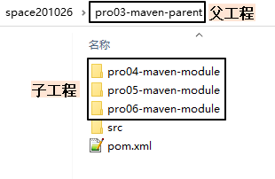

**3.查看被添加新内容的父工程pom.xml**

下面modules和module标签是聚合功能的配置

```xml
<modules>  
	<module>pro04-maven-module</module>
	<module>pro05-maven-module</module>
	<module>pro06-maven-module</module>
</modules>
```

**4.解读子工程的pom.xml**

```xml
<!-- 使用parent标签指定当前工程的父工程 -->
<parent>
	<!-- 父工程的坐标 -->
	<groupId>com.atguigu.maven</groupId>
	<artifactId>pro03-maven-parent</artifactId>
	<version>1.0-SNAPSHOT</version>
</parent>

<!-- 子工程的坐标 -->
<!-- 如果子工程坐标中的groupId和version与父工程一致，那么可以省略 -->
<!-- <groupId>com.atguigu.maven</groupId> -->
<artifactId>pro04-maven-module</artifactId>
<!-- <version>1.0-SNAPSHOT</version> -->
```

**5.在父工程中配置依赖的统一管理**

```xml
<!-- 使用dependencyManagement标签配置对依赖的管理 -->
<!-- 被管理的依赖并没有真正被引入到工程 -->
<dependencyManagement>
	<dependencies>
		<dependency>
			<groupId>org.springframework</groupId>
			<artifactId>spring-core</artifactId>
			<version>4.0.0.RELEASE</version>
		</dependency>
		<dependency>
			<groupId>org.springframework</groupId>
			<artifactId>spring-beans</artifactId>
			<version>4.0.0.RELEASE</version>
		</dependency>
		<dependency>
			<groupId>org.springframework</groupId>
			<artifactId>spring-context</artifactId>
			<version>4.0.0.RELEASE</version>
		</dependency>
		<dependency>
			<groupId>org.springframework</groupId>
			<artifactId>spring-expression</artifactId>
			<version>4.0.0.RELEASE</version>
		</dependency>
		<dependency>
			<groupId>org.springframework</groupId>
			<artifactId>spring-aop</artifactId>
			<version>4.0.0.RELEASE</version>
		</dependency>
	</dependencies>
</dependencyManagement>
```

**6.子工程中引用那些被父工程管理的依赖**

关键点：省略版本号

```xml
<!-- 子工程引用父工程中的依赖信息时，可以把版本号去掉。	-->
<!-- 把版本号去掉就表示子工程中这个依赖的版本由父工程决定。 -->
<!-- 具体来说是由父工程的dependencyManagement来决定。 -->
<dependencies>
	<dependency>
		<groupId>org.springframework</groupId>
		<artifactId>spring-core</artifactId>
	</dependency>
	<dependency>
		<groupId>org.springframework</groupId>
		<artifactId>spring-beans</artifactId>
	</dependency>
	<dependency>
		<groupId>org.springframework</groupId>
		<artifactId>spring-context</artifactId>
	</dependency>
	<dependency>
		<groupId>org.springframework</groupId>
		<artifactId>spring-expression</artifactId>
	</dependency>
	<dependency>
		<groupId>org.springframework</groupId>
		<artifactId>spring-aop</artifactId>
	</dependency>
</dependencies>
```

**7.在父工程中升级依赖信息的版本**

```xml
……
			<dependency>
				<groupId>org.springframework</groupId>
				<artifactId>spring-beans</artifactId>
				<version>4.1.4.RELEASE</version>
			</dependency>
……
```

然后在子工程中运行mvn dependency:list，效果如下：

> [INFO]    org.springframework:spring-aop:jar:4.1.4.RELEASE:compile
> [INFO]    org.springframework:spring-core:jar:4.1.4.RELEASE:compile
> [INFO]    org.springframework:spring-context:jar:4.1.4.RELEASE:compile
> [INFO]    org.springframework:spring-beans:jar:4.1.4.RELEASE:compile
> [INFO]    org.springframework:spring-expression:jar:4.1.4.RELEASE:compile

**8.在父工程中声明自定义属性**

```xml
<!-- 通过自定义属性，统一指定Spring的版本 -->
<properties>
	<project.build.sourceEncoding>UTF-8</project.build.sourceEncoding>
	
	<!-- 自定义标签，维护Spring版本数据 -->
	<atguigu.spring.version>4.3.6.RELEASE</atguigu.spring.version>
</properties>
```

在需要的地方使用${}的形式来引用自定义的属性名：

```xml
			<dependency>
				<groupId>org.springframework</groupId>
				<artifactId>spring-core</artifactId>
				<version>${atguigu.spring.version}</version>
			</dependency>
```

真正实现“一处修改，处处生效”。

### 实际意义


编写一套符合要求、开发各种功能都能正常工作的依赖组合并不容易。如果公司里已经有人总结了成熟的组合方案，那么再开发新项目时，如果不使用原有的积累，而是重新摸索，会浪费大量的时间。为了提高效率，我们可以使用工程继承的机制，让成熟的依赖组合方案能够保留下来。

如上图所示，公司级的父工程中管理的就是成熟的依赖组合方案，各个新项目、子系统各取所需即可。

实际开发时，子工程引用父工程中管理的依赖信息并不是直接把父工程管理的依赖全部拿过来，而是用到什么依赖就拿来什么依赖；

==Maven中继承和Java中继承一样，都是单继承；==

==继承之后，依赖版本号是可以做到不一致的，这就需要子工程中设置依赖时将需要做到不一致的依赖打上对应版本的version标签，类似于子类重写父类的方法，会将父工程中管理的版本进行覆盖；==

## 1.11.Maven核心概念08：聚合

### 聚合本身的含义

部分组成整体


动画片《战神金刚》中的经典台词：“我来组成头部！我来组成手臂！”就是聚合关系最生动的体现。

### Maven中的聚合

使用一个“总工程”将各个“模块工程”汇集起来，作为一个整体对应完整的项目。

- 项目：整体
- 模块：部分

> 概念的对应关系：
>
> 从继承关系角度来看：
>
> - 父工程
> - 子工程

> 从聚合关系角度来看：
>
> - 总工程
> - 模块工程

### 好处

- 一键执行Maven命令：很多构建命令都可以在“总工程”中一键执行。

  以mvn install命令为例：==Maven要求有父工程时先安装父工程；有依赖的工程时，先安装依赖的工程。==我们自己考虑这些规则会很麻烦。但是工程聚合之后，在总工程执行mvn install可以一键完成安装，而且会自动按照正确的顺序执行。

- 配置聚合之后，各个模块工程会在总工程中展示一个列表，让项目中的各个模块一目了然。

### 聚合的配置

在总工程中配置modules即可：

```xml
	<modules>  
		<module>pro04-maven-module</module>
		<module>pro05-maven-module</module>
		<module>pro06-maven-module</module>
	</modules>
```

### 依赖循环问题

如果A工程依赖B工程，B工程依赖C工程，C工程又反过来依赖A工程，那么在执行构建操作时会报下面的错误：

> [ERROR] [ERROR] The projects in the reactor contain a cyclic reference:

这个错误的含义是：循环引用。

## 1.12.Maven核心概念09：仓库

- 本地仓库：在当前电脑上，为电脑上所有工程服务；
- 远程仓库：需要联网；
  - 局域网：我们自己搭建的Maven私服，例如使用Nexus技术；
  - Internet：
    - 中央仓库
    - 镜像仓库：内容和中央仓库保持一致，但是能够分担中央仓库的负载，同时让用户能够就近访问提高下载速度，例如：Nexus aliyun

建议：不要中央仓库和阿里云镜像混用，以免发生冲突等问题；

专门搜索Maven依赖信息的网站：https://mvnrepository.com/

## 1.13.使用Maven（CMD）

### 实验一：根据坐标创建Maven工程

**创建目录作为后面操作的工作空间**

例如：D:\JavaSoft\Maven\maven-workspace\spaceCommon

**在工作空间目录下打开命令行窗口**


**使用命令生成Maven工程**

运行<span style="color:blue;font-weight:bold;">mvn archetype:generate</span>命令

下面根据提示操作：

> Choose a number or apply filter (format: [groupId:]artifactId, case sensitive contains): 7:【直接回车，使用默认值】
>
> 
>
> Define value for property 'groupId': com.atguigu.maven
>
> Define value for property 'artifactId': pro01-maven-java
>
> Define value for property 'version' 1.0-SNAPSHOT: :【直接回车，使用默认值】
>
> Define value for property 'package' com.atguigu.maven: :【直接回车，使用默认值】
>
> 
>
> Confirm properties configuration:
> groupId: com.atguigu.maven
> artifactId: pro01-maven-java
> version: 1.0-SNAPSHOT
> package: com.atguigu.maven
> Y: :【直接回车，表示确认】

**调整**

Maven默认==在操作空间中==生成的工程，对junit依赖的是较低的3.8.1版本，我们可以改成4.12版本。

自动生成的App.java和AppTest.java可以删除。

```xml
<!-- 依赖信息配置 -->
<!-- dependencies复数标签：里面包含dependency单数标签 -->
<dependencies>
	<!-- dependency单数标签：配置一个具体的依赖 -->
	<dependency>
		<!-- 通过坐标来依赖其他jar包 -->
		<groupId>junit</groupId>
		<artifactId>junit</artifactId>
		<version>4.12</version>
		
		<!-- 依赖的范围 -->
		<scope>test</scope>
	</dependency>
</dependencies>
```

### 实验二：在Maven工程中编写代码

**主体程序**

- 自动生成的pom.xml解读：

```xml
  <!-- 当前Maven工程的坐标 -->
  <groupId>com.atguigu.maven</groupId>
  <artifactId>pro01-maven-java</artifactId>
  <version>1.0-SNAPSHOT</version>
  
  <!-- 当前Maven工程的打包方式，可选值有下面三种： -->
  <!-- jar：表示这个工程是一个Java工程  -->
  <!-- war：表示这个工程是一个Web工程 -->
  <!-- pom：表示这个工程是“管理其他工程”的工程 -->
  <packaging>jar</packaging>

  <name>pro01-maven-java</name>
  <url>http://maven.apache.org</url>

  <properties>
	<!-- 工程构建过程中读取源码时使用的字符集 -->
    <project.build.sourceEncoding>UTF-8</project.build.sourceEncoding>
  </properties>

  <!-- 当前工程所依赖的jar包 -->
  <dependencies>
	<!-- 使用dependency配置一个具体的依赖 -->
    <dependency>
	
	  <!-- 在dependency标签内使用具体的坐标依赖我们需要的一个jar包 -->
      <groupId>junit</groupId>
      <artifactId>junit</artifactId>
      <version>4.12</version>
	  
	  <!-- scope标签配置依赖的范围 -->
      <scope>test</scope>
    </dependency>
  </dependencies>
```

- 编写主体程序：


主体程序指的是被测试的程序，同时也是将来在项目中真正要使用的程序。

```java
package com.atguigu.maven;
	
public class Calculator {
	
	public int sum(int i, int j){
		return i + j;
	}
}
```

**测试程序**

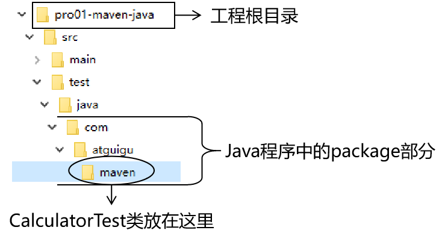

```java
package com.atguigu.maven;
	
import org.junit.Test;
import com.atguigu.maven.Calculator;
	
// 静态导入的效果是将Assert类中的静态资源导入当前类
// 这样一来，在当前类中就可以直接使用Assert类中的静态资源，不需要写类名
import static org.junit.Assert.*;
	
public class CalculatorTest{
	
	@Test
	public void testSum(){
		
		// 1.创建Calculator对象
		Calculator calculator = new Calculator();
		
		// 2.调用Calculator对象的方法，获取到程序运行实际的结果
		int actualResult = calculator.sum(5, 3);
		
		// 3.声明一个变量，表示程序运行期待的结果
		int expectedResult = 8;
		
		// 4.使用断言来判断实际结果和期待结果是否一致
		// 如果一致：测试通过，不会抛出异常
		// 如果不一致：抛出异常，测试失败
		assertEquals(expectedResult, actualResult);
		
	}
}
```

### 实验三：执行Maven的构建命令

**1、要求**

运行Maven中和构建操作相关的命令时，必须进入到pom.xml所在的目录。如果没有在pom.xml所在的目录运行Maven的构建命令，那么会看到下面的错误信息：

```java
The goal you specified requires a project to execute but there is no POM in this directory
```

> mvn -v命令和构建操作无关，只要正确配置了PATH，在任何目录下执行都可以。

**2、清理操作**

mvn clean

效果：删除target目录

**3、编译操作**

主程序编译：mvn compile

测试程序编译：mvn test-compile

主体程序编译结果存放的目录：target/classes

测试程序编译结果存放的目录：target/test-classes

**4、测试操作**

mvn test

测试的报告会存放在target/surefire-reports目录下

**5、打包操作**

mvn package

打包的结果会存放在target目录下

**6、安装操作**

mvn install

```log
[INFO] Installing D:\maven-workspace\space201026\pro01-maven-java\target\pro01-maven-java-1.0-SNAPSHOT.jar to D:\maven-rep1026\com\atguigu\maven\pro01-maven-java\1.0-SNAPSHOT\pro01-maven-java-1.0-SNAPSHOT.jar
[INFO] Installing D:\maven-workspace\space201026\pro01-maven-java\pom.xml to D:\maven-rep1026\com\atguigu\maven\pro01-maven-java\1.0-SNAPSHOT\pro01-maven-java-1.0-SNAPSHOT.pom
```

安装的效果是将本地构建过程中生成的jar包存入Maven本地仓库。这个jar包在Maven仓库中的路径是根据它的坐标生成的。

坐标信息如下：

```xml
  <groupId>com.atguigu.maven</groupId>
  <artifactId>pro01-maven-java</artifactId>
  <version>1.0-SNAPSHOT</version>
```

在Maven仓库中生成的路径如下：

```log
D:\maven-rep1026\com\atguigu\maven\pro01-maven-java\1.0-SNAPSHOT\pro01-maven-java-1.0-SNAPSHOT.jar
```

另外，安装操作还会将pom.xml文件转换为XXX.pom文件一起存入本地仓库。所以我们在Maven的本地仓库中想看一个jar包原始的pom.xml文件时，查看对应XXX.pom文件即可，它们是名字发生了改变，本质上是同一个文件。

### 实验四：创建Maven版的Web工程

**1.说明**

使用mvn archetype:generate命令生成Web工程时，需要使用一个专门的archetype。这个专门生成Web工程骨架的archetype可以参照官网看到它的用法：


参数archetypeGroupId、archetypeArtifactId、archetypeVersion用来指定现在使用的maven-archetype-webapp的坐标。

**2.操作**

==注意：如果在上一个工程的目录下执行mvn archetype:generate命令，那么Maven会报错：不能在一个非pom的工程下再创建其他工程。所以不要再刚才创建的工程里再创建新的工程，<span style="color:blue;font-weight:bold;">请回到工作空间根目录</span>来操作。==

然后运行生成工程的命令：

```log
mvn archetype:generate -DarchetypeGroupId=org.apache.maven.archetypes -DarchetypeArtifactId=maven-archetype-webapp -DarchetypeVersion=1.4
```

下面的操作按照提示执行：

> Define value for property 'groupId': com.atguigu.maven
> Define value for property 'artifactId': pro02-maven-web
> Define value for property 'version' 1.0-SNAPSHOT: :【直接回车，使用默认值】
>
> Define value for property 'package' com.atguigu.maven: :【直接回车，使用默认值】
> Confirm properties configuration:
> groupId: com.atguigu.maven
> artifactId: pro02-maven-web
> version: 1.0-SNAPSHOT
> package: com.atguigu.maven
> Y: :【直接回车，表示确认】

**3.生成的pom.xml**

确认打包的方式是war包形式

```xml
<packaging>war</packaging>
```

**4.生成的Web工程的目录结构**

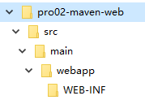

webapp目录下有index.jsp

WEB-INF目录下有web.xml

**5.创建Servlet**

- 在main目录下创建java目录


- 在java目录下创建Servlet类所在的包的目录


- 在包下创建Servlet类

```java
package top.sharehome.maven;
	
import javax.servlet.http.HttpServlet;
import javax.servlet.http.HttpServletRequest;
import javax.servlet.http.HttpServletResponse;
import javax.servlet.ServletException;
import java.io.IOException;
	
public class HelloServlet extends HttpServlet{
	
	protected void doGet(HttpServletRequest request, HttpServletResponse response) throws ServletException, IOException {
		
		response.getWriter().write("hello maven web");
		
	}
	
}
```

- 在web.xml中注册Servlet

```xml
  <servlet>
	<servlet-name>helloServlet</servlet-name>
	<servlet-class>top.sharehome.maven.HelloServlet</servlet-class>
  </servlet>
  <servlet-mapping>
	<servlet-name>helloServlet</servlet-name>
	<url-pattern>/helloServlet</url-pattern>
  </servlet-mapping>
```

**6.在index.jsp页面编写超链接**

```html
<html>
<body>
<h2>Hello World!</h2>
<a href="helloServlet">Access Servlet</a>
</body>
</html>
```

> JSP全称是Java Server Page，和Thymeleaf一样，是服务器端页面渲染技术。这里我们不必关心JSP语法细节，编写一个简单的超链接HTML标签即可。

**7.编译**

执行mvn compile命令出错：

> 程序包javax.servlet.http不存在
>
> 程序包javax.servlet不存在
>
> 找不到符号
>
> 符号: 类 HttpServlet
>
> ……

上面的错误信息说明：我们的Web工程用到了HttpServlet这个类，而HttpServlet这个类属于servlet-api.jar这个jar包。此时我们说，Web工程需要依赖servlet-api.jar包。


**8.配置对servlet-api.jar包的依赖**

对于不知道详细信息的依赖可以到https://mvnrepository.com/网站查询。使用关键词搜索，然后在搜索结果列表中选择适合的使用。


比如，我们找到的servlet-api的依赖信息：

```xml
<!-- https://mvnrepository.com/artifact/javax.servlet/javax.servlet-api -->
<dependency>
    <groupId>javax.servlet</groupId>
    <artifactId>javax.servlet-api</artifactId>
    <version>3.1.0</version>
    <scope>provided</scope>
</dependency>
```

这样就可以把上面的信息加入pom.xml。重新执行mvn compile命令。

**9.将Web工程打包为war包**

运行mvn package命令，生成war包的位置如下图所示：


**10.将war包部署到Tomcat上运行**

将war包复制到Tomcat/webapps目录下


启动Tomcat：


通过浏览器尝试访问：http://localhost:8080/pro02-maven-web/index.jsp

### 实验五：让Web工程依赖Java工程

**1.观念**

明确一个意识：从来只有Web工程依赖Java工程，没有反过来Java工程依赖Web工程。本质上来说，Web工程依赖的Java工程其实就是Web工程里导入的jar包。最终Java工程会变成jar包，放在Web工程的WEB-INF/lib目录下。

**2.操作**

在pro02-maven-web工程的pom.xml中，找到dependencies标签，在dependencies标签中做如下配置：

```xml
<!-- 配置对Java工程pro01-maven-java的依赖 -->
<!-- 具体的配置方式：在dependency标签内使用坐标实现依赖 -->
<dependency>
	<groupId>com.atguigu.maven</groupId>
	<artifactId>pro01-maven-java</artifactId>
	<version>1.0-SNAPSHOT</version>
</dependency>
```

**3.在Web工程中，编写测试代码**

- 补充创建目录

  pro02-maven-web<span style="color:blue;font-weight:bold;">\src\test\java\com\atguigu\maven</span>

- 确认Web工程依赖了junit

```xml
    <dependency>
      <groupId>junit</groupId>
      <artifactId>junit</artifactId>
      <version>4.12</version>
      <scope>test</scope>
    </dependency>
```

- 创建测试类

  把Java工程的CalculatorTest.java类复制到pro02-maven-wb<span style="color:blue;font-weight:bold;">\src\test\java\com\atguigu\maven</span>目录下

- 执行Maven命令

  - 测试命令：

    mvn test

    说明：测试操作中会提前自动执行编译操作，测试成功就说明编译也是成功的。

  - 打包命令：

    mvn package

    

    通过查看war包内的结构，我们看到被Web工程依赖的Java工程确实是会变成Web工程的WEB-INF/lib目录下的jar包。

    

  - 查看当前Web工程所依赖的jar包的列表：

    ```
    mvn dependency:list
    
    [INFO] The following files have been resolved:
    [INFO]    org.hamcrest:hamcrest-core:jar:1.3:test
    [INFO]    javax.servlet:javax.servlet-api:jar:3.1.0:provided
    [INFO]    com.atguigu.maven:pro01-maven-java:jar:1.0-SNAPSHOT:compile
    [INFO]    junit:junit:jar:4.12:test
    ```

    说明：javax.servlet:javax.servlet-api:jar:3.1.0:provided格式显示的是一个jar包的坐标信息。格式是：

    ```
    groupId:artifactId:打包方式:version:依赖的范围
    ```

    这样的格式虽然和我们XML配置文件中坐标的格式不同，但是本质上还是坐标信息，大家需要能够认识这样的格式，将来从Maven命令的日志或错误信息中看到这样格式的信息，就能够识别出来这是坐标。进而根据坐标到Maven仓库找到对应的jar包，用这样的方式解决我们遇到的报错的情况。

  - 以树形结构查看当前Web工程的依赖信息：

    ```
    mvn dependency:tree
    
    [INFO] com.atguigu.maven:pro02-maven-web:war:1.0-SNAPSHOT
    [INFO] +- junit:junit:jar:4.12:test
    [INFO] |  \- org.hamcrest:hamcrest-core:jar:1.3:test
    [INFO] +- javax.servlet:javax.servlet-api:jar:3.1.0:provided
    [INFO] \- com.atguigu.maven:pro01-maven-java:jar:1.0-SNAPSHOT:compile
    ```

    我们在pom.xml中并没有依赖hamcrest-core，但是它却被加入了我们依赖的列表。原因是：junit依赖了hamcrest-core，然后基于依赖的传递性，hamcrest-core被传递到我们的工程了。

### 实验六：测试依赖的范围

**1.依赖范围**

标签的位置：dependencies/dependency/<span style="color:blue;font-weight:bold;">scope</span>

标签的可选值：compile/test/provided

- compile和test对比

|         | main目录（空间） | test目录（空间） | 开发过程（时间） | 部署到服务器（时间） |
| ------- | ---------------- | ---------------- | ---------------- | -------------------- |
| compile | 有效             | 有效             | 有效             | 有效                 |
| test    | 无效             | 有效             | 有效             | 无效                 |

- compile和provided对比

|          | main目录（空间） | test目录（空间） | 开发过程（时间） | 部署到服务器（时间） |
| -------- | ---------------- | ---------------- | ---------------- | -------------------- |
| compile  | 有效             | 有效             | 有效             | 有效                 |
| provided | 有效             | 有效             | 有效             | 无效                 |

- 结论

  ==compile是scope标签的默认值==

  compile：通常使用的第三方框架的jar包这样在项目实际运行时真正要用到的jar包都是以compile范围进行依赖的。比如SSM框架所需jar包。<br/>

  test：测试过程中使用的jar包，以test范围依赖进来。比如junit。<br/>

  provided：在开发过程中需要用到的“服务器上的jar包”通常以provided范围依赖进来。比如servlet-api、jsp-api。而这个范围的jar包之所以不参与部署、不放进war包，就是避免和服务器上已有的同类jar包产生冲突，同时减轻服务器的负担。说白了就是：“服务器上已经有了，你就别带啦！”<br/>

**2.测试**

- 验证test范围对main目录无效

  测试方式：在主体程序中导入org.junit.Test这个注解，然后执行编译。

  具体操作：在pro01-maven-java\src\main\java\com\atguigu\maven目录下修改Calculator.java

  ```java
  package com.atguigu.maven;
  
  import org.junit.Test;
  
  public class Calculator {
  	
  	public int sum(int i, int j){
  		return i + j;
  	}
  	
  }
  ```

  执行Maven编译命令：

  ```
  [ERROR] /D:/maven-workspace/space201026/pro01-maven-java/src/main/java/com/atguigu/maven/Calculator.java:[3,17] 程序包org.junit不存在
  ```

- 验证test和provided范围不参与服务器部署

  其实就是验证：通过compile范围依赖的jar包会放入war包，通过test范围依赖的jar包不会放入war包。

  

- 验证provided范围对测试程序有效

  测试方式是在pro02-maven-web的测试程序中加入servlet-api.jar包中的类。

  修改：<span style="color:blue;font-weight:bold;">pro02-maven-web</span>\src\\<span style="color:blue;font-weight:bold;">test</span>\java\com\atguigu\maven\\<span style="color:blue;font-weight:bold;">CalculatorTest.java</span>

  ```java
  package com.atguigu.maven;
  
  import javax.servlet.http.HttpServlet;
  import javax.servlet.http.HttpServletRequest;
  import javax.servlet.http.HttpServletResponse;
  import javax.servlet.ServletException;
  
  import org.junit.Test;
  import com.atguigu.maven.Calculator;
  
  // 静态导入的效果是将Assert类中的静态资源导入当前类
  // 这样一来，在当前类中就可以直接使用Assert类中的静态资源，不需要写类名
  import static org.junit.Assert.*;
  
  public class CalculatorTest{
  	
  	@Test
  	public void testSum(){
  		
  		// 1.创建Calculator对象
  		Calculator calculator = new Calculator();
  		
  		// 2.调用Calculator对象的方法，获取到程序运行实际的结果
  		int actualResult = calculator.sum(5, 3);
  		
  		// 3.声明一个变量，表示程序运行期待的结果
  		int expectedResult = 8;
  		
  		// 4.使用断言来判断实际结果和期待结果是否一致
  		// 如果一致：测试通过，不会抛出异常
  		// 如果不一致：抛出异常，测试失败
  		assertEquals(expectedResult, actualResult);
  		
  	}
  	
  }
  ```

  然后运行Maven的编译命令：mvn compile

  然后看到编译成功。

### 实验七：测试依赖的传递性

**1.依赖的传递性**

- 概念：

  A依赖B，B依赖C，那么在A没有配置对C的依赖的情况下，A里面能不能直接使用C？

- 传递的原则

  在A依赖B，B依赖C的前提下，C是否能够传递到A，取决于B依赖C时使用的依赖范围。

  - B依赖C时使用compile范围：可以传递

  - B依赖C时使用test或provided范围：不能传递，所以需要这样的jar包时，就必须在需要的地方明确配置依赖才可以。


**2.使用compile范围依赖spring-core**

测试方式：让pro01-maven-java工程依赖spring-core

具体操作：编辑pro01-maven-java工程根目录下pom.xml

```xml
<!-- https://mvnrepository.com/artifact/org.springframework/spring-core -->
<dependency>
	<groupId>org.springframework</groupId>
	<artifactId>spring-core</artifactId>
	<version>4.0.0.RELEASE</version>
</dependency>
```

使用mvn dependency:tree命令查看效果：

> [INFO] com.atguigu.maven:pro01-maven-java:jar:1.0-SNAPSHOT
> [INFO] +- junit:junit:jar:4.12:test
> [INFO] |  \- org.hamcrest:hamcrest-core:jar:1.3:test
> [INFO] \- org.springframework:spring-core:jar:4.0.0.RELEASE:compile
> [INFO]    \- commons-logging:commons-logging:jar:1.1.1:compile

还可以在Web工程中，使用mvn dependency:tree命令查看效果（需要重新将pro01-maven-java安装到仓库）：

> [INFO] com.atguigu.maven:pro02-maven-web:war:1.0-SNAPSHOT
> [INFO] +- junit:junit:jar:4.12:test
> [INFO] |  \- org.hamcrest:hamcrest-core:jar:1.3:test
> [INFO] +- javax.servlet:javax.servlet-api:jar:3.1.0:provided
> [INFO] \- com.atguigu.maven:pro01-maven-java:jar:1.0-SNAPSHOT:compile
> [INFO]    \- org.springframework:spring-core:jar:4.0.0.RELEASE:compile
> [INFO]       \- commons-logging:commons-logging:jar:1.1.1:compile

**3.验证test和provided范围不能传递**

从上面的例子已经能够看到，pro01-maven-java依赖了junit，但是在pro02-maven-web工程中查看依赖树的时候并没有看到junit。

要验证provided范围不能传递，可以在pro01-maven-java工程中加入servlet-api的依赖。

```xml
<dependency>
	<groupId>javax.servlet</groupId>
	<artifactId>javax.servlet-api</artifactId>
	<version>3.1.0</version>
	<scope>provided</scope>
</dependency>
```

效果还是和之前一样：

> [INFO] com.atguigu.maven:pro02-maven-web:war:1.0-SNAPSHOT
> [INFO] +- junit:junit:jar:4.12:test
> [INFO] |  \- org.hamcrest:hamcrest-core:jar:1.3:test
> [INFO] +- javax.servlet:javax.servlet-api:jar:3.1.0:provided
> [INFO] \- com.atguigu.maven:pro01-maven-java:jar:1.0-SNAPSHOT:compile
> [INFO]    \- org.springframework:spring-core:jar:4.0.0.RELEASE:compile
> [INFO]       \- commons-logging:commons-logging:jar:1.1.1:compile

### 实验八：测试依赖的排除

**1.概念**

当A依赖B，B依赖C而且C可以传递到A的时候，但是A不想要C，需要在A里面把C排除掉。而往往这种情况都是为了避免jar包之间的冲突。


所以配置依赖的排除其实就是阻止某些jar包的传递。因为这样的jar包传递过来会和其他jar包冲突。

**2.配置方式**

```xml
<dependency>
	<groupId>com.atguigu.maven</groupId>
	<artifactId>pro01-maven-java</artifactId>
	<version>1.0-SNAPSHOT</version>
	<scope>compile</scope>
	<!-- 使用excludes标签配置依赖的排除	-->
	<exclusions>
		<!-- 在exclude标签中配置一个具体的排除 -->
		<exclusion>
			<!-- 指定要排除的依赖的坐标（不需要写version） -->
			<groupId>commons-logging</groupId>
			<artifactId>commons-logging</artifactId>
		</exclusion>
	</exclusions>
</dependency>
```

**3.测试**

测试的方式：在pro02-maven-web工程中配置对commons-logging的排除

```xml
<dependency>
	<groupId>com.atguigu.maven</groupId>
	<artifactId>pro01-maven-java</artifactId>
	<version>1.0-SNAPSHOT</version>
	<scope>compile</scope>
	<!-- 使用excludes标签配置依赖的排除	-->
	<exclusions>
		<!-- 在exclude标签中配置一个具体的排除 -->
		<exclusion>
			<!-- 指定要排除的依赖的坐标（不需要写version） -->
			<groupId>commons-logging</groupId>
			<artifactId>commons-logging</artifactId>
		</exclusion>
	</exclusions>
</dependency>
```

运行mvn dependency:tree命令查看效果：

> [INFO] com.atguigu.maven:pro02-maven-web:war:1.0-SNAPSHOT
> [INFO] +- junit:junit:jar:4.12:test
> [INFO] |  \- org.hamcrest:hamcrest-core:jar:1.3:test
> [INFO] +- javax.servlet:javax.servlet-api:jar:3.1.0:provided
> [INFO] \- com.atguigu.maven:pro01-maven-java:jar:1.0-SNAPSHOT:compile
> [INFO]    \- org.springframework:spring-core:jar:4.0.0.RELEASE:compile

发现在spring-core下面就没有commons-logging了。

==依赖的排除平常用的不多，但是出现问题了要会去用；==

### 实验九：继承

**1.创建父工程**

创建的过程和前面创建pro01-maven-java一样。

工程名称：pro03-maven-parent

工程创建好之后，要修改它的打包方式：

```xml
  <groupId>com.atguigu.maven</groupId>
  <artifactId>pro03-maven-parent</artifactId>
  <version>1.0-SNAPSHOT</version>
  <packaging>pom</packaging>
```

只有打包方式为pom的Maven工程能够管理其他Maven工程。

**2.创建模块工程**

模块工程类似于IDEA中的module，所以需要<span style="color:blue;font-weight:bold;">进入pro03-maven-parent工程的根目录</span>，然后运行mvn archetype:generate命令来创建模块工程。

假设，我们创建三个模块工程：


**3.查看被添加新内容的父工程pom.xml**

下面modules和module标签是聚合功能的配置

```xml
<modules>  
	<module>pro04-maven-module</module>
	<module>pro05-maven-module</module>
	<module>pro06-maven-module</module>
</modules>
```

**4.解读子工程的pom.xml**

```xml
<!-- 使用parent标签指定当前工程的父工程 -->
<parent>
	<!-- 父工程的坐标 -->
	<groupId>com.atguigu.maven</groupId>
	<artifactId>pro03-maven-parent</artifactId>
	<version>1.0-SNAPSHOT</version>
</parent>

<!-- 子工程的坐标 -->
<!-- 如果子工程坐标中的groupId和version与父工程一致，那么可以省略 -->
<!-- <groupId>com.atguigu.maven</groupId> -->
<artifactId>pro04-maven-module</artifactId>
<!-- <version>1.0-SNAPSHOT</version> -->
```

**5.在父工程中配置依赖的统一管理**

```xml
<!-- 使用dependencyManagement标签配置对依赖的管理 -->
<!-- 被管理的依赖并没有真正被引入到工程 -->
<dependencyManagement>
	<dependencies>
		<dependency>
			<groupId>org.springframework</groupId>
			<artifactId>spring-core</artifactId>
			<version>4.0.0.RELEASE</version>
		</dependency>
		<dependency>
			<groupId>org.springframework</groupId>
			<artifactId>spring-beans</artifactId>
			<version>4.0.0.RELEASE</version>
		</dependency>
		<dependency>
			<groupId>org.springframework</groupId>
			<artifactId>spring-context</artifactId>
			<version>4.0.0.RELEASE</version>
		</dependency>
		<dependency>
			<groupId>org.springframework</groupId>
			<artifactId>spring-expression</artifactId>
			<version>4.0.0.RELEASE</version>
		</dependency>
		<dependency>
			<groupId>org.springframework</groupId>
			<artifactId>spring-aop</artifactId>
			<version>4.0.0.RELEASE</version>
		</dependency>
	</dependencies>
</dependencyManagement>
```

**6.子工程中引用那些被父工程管理的依赖**

关键点：省略版本号

```xml
<!-- 子工程引用父工程中的依赖信息时，可以把版本号去掉。	-->
<!-- 把版本号去掉就表示子工程中这个依赖的版本由父工程决定。 -->
<!-- 具体来说是由父工程的dependencyManagement来决定。 -->
<dependencies>
	<dependency>
		<groupId>org.springframework</groupId>
		<artifactId>spring-core</artifactId>
	</dependency>
	<dependency>
		<groupId>org.springframework</groupId>
		<artifactId>spring-beans</artifactId>
	</dependency>
	<dependency>
		<groupId>org.springframework</groupId>
		<artifactId>spring-context</artifactId>
	</dependency>
	<dependency>
		<groupId>org.springframework</groupId>
		<artifactId>spring-expression</artifactId>
	</dependency>
	<dependency>
		<groupId>org.springframework</groupId>
		<artifactId>spring-aop</artifactId>
	</dependency>
</dependencies>
```

**7.在父工程中升级依赖信息的版本**

```xml
……
			<dependency>
				<groupId>org.springframework</groupId>
				<artifactId>spring-beans</artifactId>
				<version>4.1.4.RELEASE</version>
			</dependency>
……
```

然后在子工程中运行mvn dependency:list，效果如下：

> [INFO]    org.springframework:spring-aop:jar:4.1.4.RELEASE:compile
> [INFO]    org.springframework:spring-core:jar:4.1.4.RELEASE:compile
> [INFO]    org.springframework:spring-context:jar:4.1.4.RELEASE:compile
> [INFO]    org.springframework:spring-beans:jar:4.1.4.RELEASE:compile
> [INFO]    org.springframework:spring-expression:jar:4.1.4.RELEASE:compile

**8.在父工程中声明自定义属性**

```xml
<!-- 通过自定义属性，统一指定Spring的版本 -->
<properties>
	<project.build.sourceEncoding>UTF-8</project.build.sourceEncoding>
	
	<!-- 自定义标签，维护Spring版本数据 -->
	<atguigu.spring.version>4.3.6.RELEASE</atguigu.spring.version>
</properties>
```

在需要的地方使用${}的形式来引用自定义的属性名：

```xml
			<dependency>
				<groupId>org.springframework</groupId>
				<artifactId>spring-core</artifactId>
				<version>${atguigu.spring.version}</version>
			</dependency>
```

真正实现“一处修改，处处生效”。

## 1.14.使用Maven（IDEA）

### 用Maven创建Java工程

**第一步：新建Maven工程**


**第二步：更改项目设置**


### 用Maven创建Java Module工程


### 用Maven创建Java Web工程

**第一步：创建模块**

按照前面的同样操作创建模块，此时这个模块其实还是一个Java工程。

**第二步：修改或增添配置文件中的打包方式**

```xml
<packaging>war</packaging>
```


**第三步：手动添加webapp相关文件夹**


**第四步：借助IDEA自动生成web.xml**

- 打开项目结构设置，在Facets中添加一个web项目，并选择想要建立web工程的模块；

  


- 打开项目结构设置，在Modules中选择已经生成的Web项目管理初始页面进行修改，首先在刚刚已经创建好的WEB-INF文件夹中添加一个部署描述文件（Deplyment Descriptors），即web.xml，选择好路径之后需要在路径后加上**\web.xml**，这样便于我们选择部署描述文件的版本到2.5；

  


- 打开项目结构设置，在Modules中继续进行操作，添加一个Web资源文件夹（Web Resource Directories），这个Web资源文件夹就选择我们事先设置好的webapp文件夹

  

  

### 如何修改maven中的默认Plugins版本（插件）

找到Maven的安装目录中的**\apache-maven-3.8.6\lib\maven-core-3.8.6.jar**，用解压软件打开后找到**maven-core-3.8.6.jar\META-INF\plexus**，在其中找到**components.xml**和**default-bindings.xml**文件夹，同步修改需要修改的插件版本；

**例如下：**


## 1.15.jar包下载失败的情况总汇

Maven替我们去下载jar包的时候，有可能出现在网络传输过程中数据丢失、中途断网，从而导致下载失败。


### 第一种情况

**1.Maven的行为描述**

- jar包在下载过程中，jar包的扩展名是xxx.jar.lastUpdated
- 网络连接丢失，无法继续下载
- jar包没有下载完，lastUpdated扩展名不会被删除
- 当我们要求Maven重新下载时，Maven看到这个jar包的扩展名是lastUpdated，Maven就不管了

**2.解决办法**

手动删除所有以lastUpdated结尾的文件，然后让Maven重新下载。可是当仓库中lastUpdated文件太多的时候，手动删除不可行，所以我们需要借助批处理文件：clearLastUpdated.bat。

脚本源代码如下：

```txt
cls
@ECHO OFF
SET CLEAR_PATH=D:
SET CLEAR_DIR=D:\JavaSoft\Maven\maven-rep\rep-common
color 0a
TITLE ClearLastUpdated For Windows
GOTO MENU
:MENU
CLS
ECHO.
ECHO. * * * * ClearLastUpdated For Windows * * * *
ECHO. * *
ECHO. * 1 ClearDIR.lastUpdated
ECHO. * *
ECHO. * 2 CheckDIR.lastUpdated
ECHO. * *
ECHO. * 3 QuitProgram *
ECHO. * *
ECHO. * * * * * * * * * * * * * * * * * * * * * * * *
ECHO.
ECHO.SelectYourChoice:
set /p ID=
IF "%id%"=="1" GOTO cmd1
IF "%id%"=="2" GOTO cmd2
IF "%id%"=="3" EXIT
PAUSE
:cmd1
ECHO. StartClear
%CLEAR_PATH%
cd %CLEAR_DIR%
for /r %%i in (*.lastUpdated) do del %%i
ECHO.OK
PAUSE
GOTO MENU
:cmd2
ECHO. Show.lastUpdatedDIR
%CLEAR_PATH%
cd %CLEAR_DIR%
for /r %%i in (*.lastUpdated) do echo %%i
ECHO.OK
PAUSE
GOTO MENU
```

使用方法：

- 将clearLastUpdated.bat文件复制到本地仓库的根目录
- 使用文件编辑打开clearLastUpdated.bat文件
- 修改下面的内容

> SET CLEAR_PATH=设置为本地仓库所在的盘符
> SET CLEAR_DIR=设置为本地仓库的根目录的路径

例如：

> SET CLEAR_PATH=D: 
> SET CLEAR_DIR=D:\maven-rep1026

- 在想要执行清理时，双击运行这个文件即可

**3.要求Maven重新下载jar包**


### 第二种情况

**1.文件校验工具**

jar包表面上看起来是下载完的状态，结尾并没有“.lastUpdated”扩展名。但是程序运行时找不到这个jar包中的类。例如：针对jar包中的类出现ClassNotFoundException。

 [Hash.exe](D:\JavaSoft\Hash加密校验\Hash.exe) 


遇到类似问题需要先确认一下“有嫌疑”的jar包是否存在内部损坏问题。此时可以使用上面的文件校验工具。


**2.用法**

- 打开文件校验工具
- 将待校验的jar包拖拽到文件校验工具窗口内
- 将待校验的jar包旁边的*.sha1文件打开
- 比较两个SHA1值
- 一致：jar包完好
- 不一致：jar包损坏

**3.原理**

HASH加密包括很多具体加密算法，但是所有HASH算法都满足下面特征：

- 只要输入数据不变，任何时候执行加密，输出不变
- 输入数据有细微变化，输出数据跟着变化
- 不可逆，不能通过密文反推回明文
- 每一种具体的HASH加密算法加密后长度固定

**4.找到有嫌疑的jar包**

假设现在出现了一个ClassNotFoundException，提示找不到类：org.springframework.expression.Expression。此时我们怀疑这个类所在的jar包下载失败。<br/>

- 窍门1：类所在的package命名往往和jar包坐标的groupId部分类似。
- 窍门2：在IDEA中按两下Shift键，使用全类名搜索


找到jar包后，点右键→Show in Explorer

- 窍门3：如果前面的办法都没法定位，只能根据这个类看上去的特征和可能的功能找有可能有关的jar包

**5.为什么不建议删整个库**

- 整个库删除后，需要重新下载整个库。此时东边的jar包没有失败，可能西边的jar包会失败。
- 整个库整体重新下载时，会有很多jar包并行下载的，相对来说并行下载本身就容易丢失数据。

# 2.Mybatis

## 2.1.前言

### 总体技术体系

**单一架构：**

一个项目，一个工程，导出为一个war包，在一个Tomcat上运行。也叫all in one。


以前学习的技术，除了Thymeleaf这种服务器端喧染框架和Vue这样的JS框架之外，绝大多数都是使用原生代码进行开发的，从开发性能出发都比较低；

从上图可以看出Spring的基础：IOC容器，AOP，声明式事务；

==了解：==和Tomcat相似的Servlet容器——Jetty、JBoss、Weblogic、WebSphere、glassfish等；

**分布式架构：**

一个项目，拆分成很多个模块，每个模块是一个工程。每一个工程都是运行在自己的Tomcat上。模块之间可以互相调用。每一个模块内部可以看成是一个单一架构的应用。


### 框架的概念

框架=jar包+配置文件


### Mybatis历史


> MyBatis最初是Apache的一个开源项目<span style="color:blue;font-weight:bold;">iBatis</span>, 2010年6月这个项目由Apache Software Foundation迁移到了Google Code。随着开发团队转投Google Code旗下， iBatis3.x正式更名为MyBatis。代码于2013年11月迁移到Github。
>
> iBatis一词来源于“internet”和“abatis”的组合，是一个基于Java的持久层框架。 iBatis提供的持久层框架包括SQL Maps和Data Access Objects（DAO）。

### Mybatis下载地址

https://github.com/mybatis/mybatis-3


### Mybatis特性

- MyBatis支持定制化SQL、存储过程以及高级映射
- MyBatis避免了几乎所有的JDBC代码和手动设置参数以及结果集解析操作
- MyBatis可以使用简单的XML或注解实现配置和原始映射；将接口和Java的POJO（Plain Ordinary Java Object，普通的Java对象）映射成数据库中的记录
- Mybatis是一个半自动的ORM（Object   Relation  Mapping）框架


### 和其它持久化层技术对比

- JDBC
  - SQL 夹杂在Java代码中耦合度高，导致硬编码内伤
  - 维护不易且实际开发需求中 SQL 有变化，频繁修改的情况多见
  - 代码冗长，开发效率低
- Hibernate 和 JPA
  - 操作简便，开发效率高
  - 程序中的长难复杂 SQL 需要绕过框架
  - 内部自动生产的 SQL，不容易做特殊优化
  - 基于全映射的全自动框架，大量字段的 POJO 进行部分映射时比较困难。
  - 反射操作太多，导致数据库性能下降
- MyBatis
  - 轻量级，性能出色
  - SQL 和 Java 编码分开，功能边界清晰。Java代码专注业务、SQL语句专注数据
  - 开发效率稍逊于HIbernate，但是完全能够接收

## 2.2.代码示例(HelloWorld)

### 物理建模

```sql
CREATE DATABASE `mybatis-example`;

USE `mybatis-example`;

CREATE TABLE `t_emp`(
emp_id INT AUTO_INCREMENT,
emp_name CHAR(100),
emp_salary DOUBLE(10,5),
PRIMARY KEY(emp_id)
);

INSERT INTO `t_emp`(emp_name,emp_salary) VALUES("tom",200.33);
```

### 逻辑建模

**创建Maven module**


**创建Java实体类**

> 实体类是和现实世界中某一个具体或抽象的概念对应，是软件开发过程中，为了管理现实世界中的数据而设计的模型。
>
> 实体类的多个不同的叫法：
>
> domain：领域模型
>
> entity：实体
>
> POJO：Plain Old Java Object
>
> Java bean：一个Java类

```java
/**
 * 和数据库表t_emp对应的实体类
 * emp_id INT AUTO_INCREMENT
 * emp_name CHAR(100)
 * emp_salary DOUBLE(10,5)
 *
 * Java的实体类中，属性的类型不要使用基本数据类型，要使用包装类型。因为包装类型可以赋值为null，表示空，而基本数据类型不可以。
 */
public class Employee {
    
    private Integer empId;
    
    private String empName;
    
    private Double empSalary;
    
    public Employee() {
    
    }
    
    public Integer getEmpId() {
        return empId;
    }
    
    public void setEmpId(Integer empId) {
        this.empId = empId;
    }
    
    public String getEmpName() {
        return empName;
    }
    
    public void setEmpName(String empName) {
        this.empName = empName;
    }
    
    public Double getEmpSalary() {
        return empSalary;
    }
    
    public void setEmpSalary(Double empSalary) {
        this.empSalary = empSalary;
    }
    
    @Override
    public String toString() {
        return "Employee{" +
                "empId=" + empId +
                ", empName='" + empName + '\'' +
                ", empSalary=" + empSalary +
                '}';
    }
    
    public Employee(Integer empId, String empName, Double empSalary) {
        this.empId = empId;
        this.empName = empName;
        this.empSalary = empSalary;
    }
}
```

### 搭建框架开发环境

**导入依赖**

```xml
<dependencies>
    <!-- Mybatis核心 -->
    <dependency>
        <groupId>org.mybatis</groupId>
        <artifactId>mybatis</artifactId>
        <version>3.5.7</version>
    </dependency>
    
    <!-- junit测试 -->
    <dependency>
        <groupId>junit</groupId>
        <artifactId>junit</artifactId>
        <version>4.12</version>
        <scope>test</scope>
    </dependency>
    
    <!-- MySQL驱动 -->
    <dependency>
        <groupId>mysql</groupId>
        <artifactId>mysql-connector-java</artifactId>
        <version>5.1.3</version>
    </dependency>
    
    <!-- 数据源 -->
    <dependency>
        <groupId>com.alibaba</groupId>
        <artifactId>druid</artifactId>
        <version>1.0.31</version>
    </dependency>
</dependencies>
```

**准备配置文件**

- Mybatis全局配置文件

  习惯上命名为mybatis-config.xml，这个文件名仅仅只是建议，并非强制要求。将来整合Spring之后，这个配置文件可以省略，所以大家操作时可以直接复制、粘贴。

  ```xml
  <?xml version="1.0" encoding="UTF-8" ?>
  <!DOCTYPE configuration
          PUBLIC "-//mybatis.org//DTD Config 3.0//EN"
          "http://mybatis.org/dtd/mybatis-3-config.dtd">
  <configuration>
  
      <!-- environments表示配置Mybatis的开发环境，可以配置多个环境，在众多具体环境中，使用default属性指定实际运行时使用的环境。default属性的取值是environment标签的id属性的值。 -->
      <environments default="development">
          <!-- environment表示配置Mybatis的一个具体的环境 -->
          <environment id="development">
  
              <!-- Mybatis的内置的事务管理器 -->
              <transactionManager type="JDBC"/>
  
              <!-- 配置数据源 -->
              <dataSource type="POOLED">
  
                  <!-- 建立数据库连接的具体信息 -->
                  <property name="driver" value="com.mysql,cj.jdbc.Driver"/>
                  <property name="url" value="jdbc:mysql://localhost:3306/mybatis-example?useSSL=false&amp;serverTimezone=UTC&amp;characterEncoding=UTF-8"/>
                  <property name="username" value="root"/>
                  <property name="password" value="123456"/>
              </dataSource>
          </environment>
      </environments>
  
      <mappers>
          <!-- Mapper注册：指定Mybatis映射文件的具体位置 -->
          <!-- mapper标签：配置一个具体的Mapper映射文件 -->
          <!-- resource属性：指定Mapper映射文件的实际存储位置，这里需要使用一个以类路径根目录为基准的相对路径 -->
          <!--    对Maven工程的目录结构来说，resources目录下的内容会直接放入类路径，所以这里我们可以以resources目录为基准 -->
          <mapper resource="mappers/EmployeeMapper.xml"/>
      </mappers>
  </configuration>
  ```

  <span style="color:blue;font-weight:bold;">注意</span>：配置文件存放的位置是src/main/resources目录下。

- Mybatis映射文件

  相关概念：<span style="color:blue;font-weight:bold;">ORM</span>（<span style="color:blue;font-weight:bold;">O</span>bject <span style="color:blue;font-weight:bold;">R</span>elationship <span style="color:blue;font-weight:bold;">M</span>apping）对象关系映射。

  - 对象：Java的实体类对象

  - 关系：关系型数据库

  - 映射：二者之间的对应关系

    | Java概念 | 数据库概念 |
    | -------- | ---------- |
    | 类       | 表         |
    | 属性     | 字段/列    |
    | 对象     | 记录/行    |

    

    ```xml
    <?xml version="1.0" encoding="UTF-8" ?>
    <!DOCTYPE mapper
            PUBLIC "-//mybatis.org//DTD Mapper 3.0//EN"
            "http://mybatis.org/dtd/mybatis-3-mapper.dtd">
    
    <!-- mapper是根标签，namespace属性：在Mybatis全局范围内找到一个具体的Mapper配置 -->
    <!-- 引入接口后，为了方便通过接口全类名来找到Mapper配置文件，所以通常将namespace属性设置为接口全类名 -->
    <!-- 以前我们叫dao，现在叫mapper，仅仅是命名习惯的区别-->
    <mapper namespace="top.sharehome.mapper.EmployMapper">
        <!-- 要写什么语句，就用什么标签，比如要做select操作，就用select标签 -->
        <!-- 编写具体的SQL语句，使用id属性唯一的标记一条SQL语句 -->
        <!-- resultType属性：指定封装查询结果的Java实体类的全类名 -->
        <select id="selectEmployeeById" resultType="top.sharehome.bean.Employee">
            <!-- Mybatis负责把SQL语句中的#{}部分替换成“?”占位符，在#{}内部还是要声明一个见名知意的名称 -->
            select emp_id empId,emp_name empName,emp_salary empSalary from t_emp where emp_id=#{empId}
        </select>
    </mapper>
    ```

    <span style="color:blue;font-weight:bold;">注意</span>：EmployeeMapper.xml所在的目录要和mybatis-config.xml中使用mapper标签配置的一致。

### junit测试代码

```java
package top.sharehome.test;

import org.apache.ibatis.io.Resources;
import org.apache.ibatis.session.SqlSession;
import org.apache.ibatis.session.SqlSessionFactory;
import org.apache.ibatis.session.SqlSessionFactoryBuilder;
import org.junit.Test;
import top.sharehome.bean.Employee;

import java.io.IOException;
import java.io.InputStream;
import java.util.Arrays;
import java.util.List;

public class MybatisTest {
    @Test
    public void testHelloWorldReview() throws IOException {
        InputStream inputStream = Resources.getResourceAsStream("mybatis-config.xml");
        SqlSessionFactoryBuilder builder = new SqlSessionFactoryBuilder();
        SqlSessionFactory sessionFactory = builder.build(inputStream);
        SqlSession session = sessionFactory.openSession();
        Employee employee = session.selectOne("top.sharehome.mapper.EmployeeMapper.selectEmployeeById", "1");
        System.out.println(employee);
        session.commit();
        session.close();
    }

    @Test
    public void testHelloWorld() throws IOException {
        //1.使用Mybatis的Resources类读取Mybatis全局配置文件，这里的路径仍然是一个以类路径目录为基准的相对路径
        InputStream in = Resources.getResourceAsStream("mybatis-config.xml");
        //2.使用输入流创建sqlSessionFactoryBuilder对象
        SqlSessionFactoryBuilder builder = new SqlSessionFactoryBuilder();
        SqlSessionFactory sessionFactory = builder.build(in);
        //3.通过SqlSessionFactory对象开启一个从Java程序到数据库的会话，这个会话在持久化层进行工作，和表述层的会话八竿子打不到边
        SqlSession session = sessionFactory.openSession();
        //4.通过SqlSession对象找到Mapper配置文件中可执行的sql语句;
        //执行这一步需要查找我们要运行的sql语句，此时已经不是从XML配置文件中读取了，因为最开始的时候已经读取完了这个文件
        //其实是到已封装的对象中查找，查找的依据是：Mapper配置文件的namespace值.SQL语句标签的id
        //这里使用SqlSession.selectOne(Mapper配置文件中mapper标签的namespace值.操作标签的id , 给Sql语句传入的参数)方法
        Employee employee = session.selectOne("top.sharehome.mapper.EmployeeMapper.selectEmployeeById", "2");
        System.out.println(employee);
        //5.提交事务
        session.commit();
        //6.关闭SqlSession
        session.close();
    }
}
```

说明：

- SqlSession：代表Java程序和<span style="color:blue;font-weight:bold;">数据库</span>之间的<span style="color:blue;font-weight:bold;">会话</span>。（HttpSession是Java程序和浏览器之间的会话）
- SqlSessionFactory：是“生产”SqlSession的“工厂”。
- 工厂模式：如果创建某一个对象，使用的过程基本固定，那么我们就可以把创建这个对象的相关代码封装到一个“工厂类”中，以后都使用这个工厂类来“生产”我们需要的对象。

### 修正一个误区

**1.误区**

刚开始接触框架，我们会认为Java程序会转入XML配置文件中执行，但其实框架会在初始化时将XML文件读取进来，封装到对象中，再然后就都是Java代码的执行了，XML中的配置是没法执行的。

**2.图解**


**3.源码**

- 封装Configuration对象

  所在类：org.apache.ibatis.session.defaults.DefaultSqlSessionFactory

  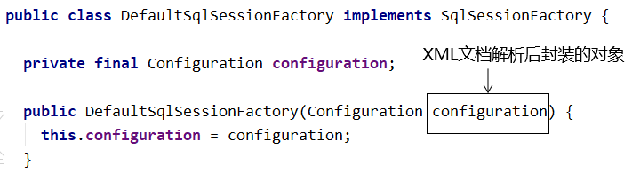

- 准备去获取已映射的指令

  所在类：org.apache.ibatis.session.defaults.DefaultSqlSession

  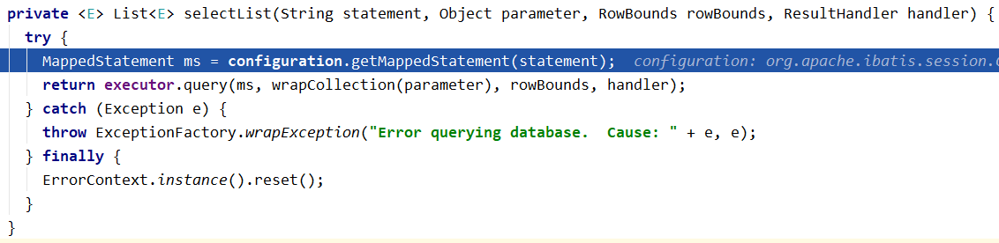

- 正式获取已映射的指令

  所在类：org.apache.ibatis.session.Configuration

  

- mappedStatements对象结构

  mappedStatements对象的类型：Configuration类中的一个静态内部类：StrictMap

  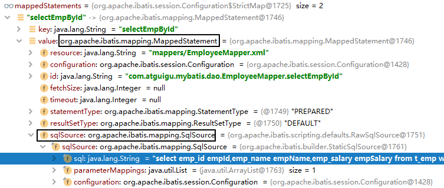

## 2.3.代码示例(HelloWorld)强化

### 加入日志

**1.目的**

在Mybatis工作过程中，通过打印日志的方式，将要执行的SQL语句打印出来。

**2.操作**

- 加入依赖

  ```xml
  <!-- log4j日志 -->
  <dependency>
      <groupId>log4j</groupId>
      <artifactId>log4j</artifactId>
      <version>1.2.17</version>
  </dependency>
  ```

- ###### 加入log4j的配置文件

  

  支持XML和properties属性文件两种形式。无论使用哪种形式，文件名是固定的：

  - log4j.xml

  - log4j.properties

  ```xml
  <?xml version="1.0" encoding="UTF-8" ?>
  <!DOCTYPE log4j:configuration SYSTEM "log4j.dtd">
      
  <log4j:configuration xmlns:log4j="http://jakarta.apache.org/log4j/">
      
      <appender name="STDOUT" class="org.apache.log4j.ConsoleAppender">
          <param name="Encoding" value="UTF-8" />
          <layout class="org.apache.log4j.PatternLayout">
              <param name="ConversionPattern" value="%-5p %d{MM-dd HH:mm:ss,SSS} %m  (%F:%L) \n" />
          </layout>
      </appender>
      <logger name="java.sql">
          <level value="debug" />
      </logger>
      <logger name="org.apache.ibatis">
          <level value="info" />
      </logger>
      <root>
          <level value="debug" />
          <appender-ref ref="STDOUT" />
      </root>
  </log4j:configuration>
  ```

**3.日志的级别**

FATAL(致命)>ERROR(错误)>WARN(警告)>INFO(信息)>DEBUG(调试)<br/>

从左到右打印的内容越来越详细

**4.STDOUT**

是standard output的缩写，意思是标准输出。对于Java程序来说，打印到标准输出就是打印到控制台。

**5.打印效果**

> DEBUG 05-24 18:51:13,331 \==>  Preparing: select emp_id empId,emp_name empName,emp_salary empSalary from t_emp where emp_id=?  (BaseJdbcLogger.java:137) 
> DEBUG 05-24 18:51:13,371 \==> Parameters: 1(Integer)  (BaseJdbcLogger.java:137) 
> DEBUG 05-24 18:51:13,391 <==      Total: 1  (BaseJdbcLogger.java:137) 
> o = Employee{empId=1, empName='tom', empSalary=200.33}

### 关联外部属性文件

**1.需求**

在实际开发时，同一套代码往往会对应多个不同的具体服务器环境。使用的数据库连接参数也不同。为了更好的维护这些信息，我们建议把数据库连接信息提取到Mybatis全局配置文件外边。

**2.做法**


创建jdbc.properties配置文件

```properties
sharehome.dev.driver=com.mysql.cj.jdbc.Driver
sharehome.dev.url=jdbc:mysql://localhost:3306/mybatis-example?useSSL=false&serverTimezone=UTC&characterEncoding=UTF-8
sharehome.dev.username=root
sharehome.dev.password=cry020114

sharehome.test.driver=com.mysql.cj.jdbc.Driver
sharehome.test.url=jdbc:mysql://localhost:3307/mybatis-example?useSSL=false&serverTimezone=UTC&characterEncoding=UTF-8
sharehome.test.username=root
sharehome.test.password=cry020114

sharehome.product.driver=com.mysql.cj.jdbc.Driver
sharehome.product.url=jdbc:mysql://localhost:3308/mybatis-example?useSSL=false&serverTimezone=UTC&characterEncoding=UTF-8
sharehome.product.username=root
sharehome.product.password=cry020114
```

在Mybatis全局配置文件中指定外部jdbc.properties文件的位置

```xml
<properties resource="jdbc.properties"/>
```

在需要具体属性值的时候使用${key}格式引用属性文件中的键，因为这是一个开发项配置文件，所以这里需要选取的是**sharehome.dev.\***

```xml
<dataSource type="POOLED">

    <!-- 建立数据库连接的具体信息 -->
    <property name="driver" value="${sharehome.dev.driver}"/>
    <property name="url" value="${sharehome.dev.url}"/>
    <property name="username" value="${sharehome.dev.username}"/>
    <property name="password" value="${sharehome.dev.password}"/>

</dataSource>
```

#### 用上Mapper接口

Mybatis中的Mapper接口相当于以前的Dao。但是区别在于，Mapper仅仅是接口，我们不需要提供实现类。

**1.思路**


**2.调整junit代码**

```java
package top.sharehome.test;

import org.apache.ibatis.io.Resources;
import org.apache.ibatis.session.SqlSession;
import org.apache.ibatis.session.SqlSessionFactoryBuilder;
import org.junit.After;
import org.junit.Before;

import java.io.IOException;

public class ImprovedMybatisTest {

    private SqlSession session;
    

    /**
     * Junit会在每个@Test方法前执行@Before方法
     */
    @Before
    public void init() throws IOException {
        session = new SqlSessionFactoryBuilder()
                .build(
                        Resources.getResourceAsStream("mybatis-config.xml"))
                .openSession();
    }

    /**
     * Junit会在每个@Test方法后执行@After方法
     */
    @After
    public void clear() {
        session.commit();
        session.close();
    }
}
```

**3.完成Mapper接口**

```java
package top.sharehome.mapper;

import top.sharehome.bean.Employee;

/**
 * 这个接口是为了方便上层代码调用Mybatis的具体功能
 * 接口的全类名要和Mapper配置文件的namespace属性一致，这样才能通过接口找到Mapper配置
 * 接口的方法名要和Mapper配置文件中SQL语句标签的id一致，这样才能通过方法名找到具体的SQL语句
 * 又因为Mapper配置文件中id属性的值不能是重复的，所以当前接口中的方法名不能重复即不能重载
 */
public interface EmployeeMapper {
    /**
     * 通过这个方法对Mapper配置文件中的SQL语句
     *
     * @param employeeId 当前方法的参数对应SQL语句中#{}生命的参数
     * @return 当前方法的返回值类型和resultType属性指定的类型一致
     */
    Employee selectEmployeeById(Long employeeId);
}
```

- 方法名和SQL的id一致
- 方法返回值和resultType一致
- 方法的参数和SQL的参数一致
- 接口的全类名和映射配置文件的名称空间一致

**4.最终的junit测试方法**

```java
package top.sharehome.test;

import org.apache.ibatis.io.Resources;
import org.apache.ibatis.session.SqlSession;
import org.apache.ibatis.session.SqlSessionFactoryBuilder;
import org.junit.After;
import org.junit.Before;
import org.junit.Test;
import top.sharehome.bean.Employee;
import top.sharehome.mapper.EmployeeMapper;

import java.io.IOException;

public class ImprovedMybatisTest {

    private SqlSession session;

    /**
     * 这是完善后的测试代码
     */
    @Test
    public void testUseMapperInterface() {
        //1.根据EmployeeMapper接口的Class对象获取Mapper接口类型的对象
        EmployeeMapper employeeMapper = session.getMapper(EmployeeMapper.class);
        //打印查看一下employMapper的类名
        System.out.println(employeeMapper.getClass().getName());
        //2.调用EmployeeMapper接口的方法完成对数据库的操作
        Employee employee = employeeMapper.selectEmployeeById(2L);
        //3.查看打印结果
        System.out.println(employee);
    }

    /**
     * Junit会在每个@Test方法前执行@Before方法
     */
    @Before
    public void init() throws IOException {
        session = new SqlSessionFactoryBuilder()
                .build(
                        Resources.getResourceAsStream("mybatis-config.xml"))
                .openSession();
    }

    /**
     * Junit会在每个@Test方法后执行@After方法
     */
    @After
    public void clear() {
        session.commit();
        session.close();
    }
}
```

### 增删改操作

**1.insert**

SQL语句

```xml
<insert id="insertEmployee">
    insert into t_emp(emp_name,emp_salary) values(#{empName},#{empSalary})
</insert>
```

Java代码中的Mapper接口：

```java
public interface EmployeeMapper {
    
    Employee selectEmployee(Integer empId);
    
    int insertEmployee(Employee employee);
}
```

Java代码中的junit测试：

```java
@Test
public void testSaveEmployee() {
    
    SqlSession session = sessionFactory.openSession();
    
    EmployeeMapper employeeMapper = session.getMapper(EmployeeMapper.class);
    
    // 创建要保存到数据库的对象
    Employee employee = new Employee();
    
    // 给实体类对象设置具体属性值
    employee.setEmpName("jerry");
    employee.setEmpSalary(5000.33);
    
    // 执行保存操作
    int result = employeeMapper.insertEmployee(employee);
    
    // 打印受影响的行数
    System.out.println("result = " + result);
    
    // 提交事务
    session.commit();
    
    session.close();
}
```

**2.delete**

SQL语句

```xml
    <delete id="deleteEmployee">
        delete from t_emp where emp_id=#{empId}
    </delete>
```

Java代码中的Mapper接口：

```java
public interface EmployeeMapper {
    
    Employee selectEmployee(Integer empId);
    
    int insertEmployee(Employee employee);
    
    int deleteEmployee(Integer empId);
}
```

Java代码中的junit测试：

```java
@Test
public void testRemoveEmployee() {
    SqlSession session = sessionFactory.openSession();
    
    EmployeeMapper employeeMapper = session.getMapper(EmployeeMapper.class);
    
    int result = employeeMapper.deleteEmployee(1);
    
    System.out.println("result = " + result);
    
    session.commit();
    
    session.close();
}
```

**3.update**

SQL语句：

```xml
<update id="updateEmployee">
    update t_emp set emp_name=#{empName},emp_salary=#{empSalary} where emp_id=#{empId}
</update>
```

Java代码中的Mapper接口：

```java
public interface EmployeeMapper {
    
    Employee selectEmployee(Integer empId);
    
    int insertEmployee(Employee employee);
    
    int deleteEmployee(Integer empId);
    
    int updateEmployee(Employee employee);
}
```

Java代码中的junit测试：

```java
@Test
public void testUpdateEmployee() {
    SqlSession session = sessionFactory.openSession();
    
    EmployeeMapper employeeMapper = session.getMapper(EmployeeMapper.class);
    
    Employee employee = new Employee(2, "AAAAAA", 6666.66);
    
    int result = employeeMapper.updateEmployee(employee);
    
    System.out.println("result = " + result);
    
    session.commit();
    
    session.close();
}
```

### 所有代码示例

**EmployeeMapper.xml：**

```xml
<?xml version="1.0" encoding="UTF-8" ?>
<!DOCTYPE mapper
        PUBLIC "-//mybatis.org//DTD Mapper 3.0//EN"
        "http://mybatis.org/dtd/mybatis-3-mapper.dtd">

<!-- mapper是根标签，namespace属性：在Mybatis全局范围内找到一个具体的Mapper配置 -->
<!-- 引入接口后，为了方便通过接口全类名来找到Mapper配置文件，所以通常将namespace属性设置为接口全类名 -->
<!-- 以前我们叫dao，现在叫mapper，仅仅是命名习惯的区别-->
<mapper namespace="top.sharehome.mapper.EmployeeMapper">
    <!-- 要写什么语句，就用什么标签，比如要做select操作，就用select标签 -->
    <!-- 编写具体的SQL语句，使用id属性唯一的标记一条SQL语句 -->
    <!-- resultType属性：指定封装查询结果的Java实体类的全类名 -->
    <select id="selectEmployeeById" resultType="top.sharehome.bean.Employee">
        <!-- Mybatis负责把SQL语句中的#{}部分替换成“?”占位符，在#{}内部还是要声明一个见名知意的名称 -->
        select emp_id empId,emp_name empName,emp_salary empSalary from t_emp where emp_id=#{empId}
    </select>
    <!-- int insertEmployee(Employee employee) -->
    <insert id="insertEmployee">
        <!-- 在这条SQL语句中#{}中的表达式需要被用来从Employee实体类中获取empName和empSalary的值 -->
        <!-- 而我们从实体类中获取值的方法都是调用getXXX()方法 -->
        <!-- 而getXXX()方法和setXXX()方法定义了实体类的属性 -->
        <!-- 定义属性的规则是：把get,set去掉，剩下部分小写即可 -->
        insert into t_emp values (null,#{empName},#{empSalary})
    </insert>
    <!-- int deleteEmployeeById(long employeeId) -->
    <delete id="deleteEmployeeById">
        delete from t_emp where emp_id = #{empId}
    </delete>
    <!-- int updateEmployeeById(Employee employee) -->
    <update id="updateEmployeeById">
        update t_emp set emp_name=#{empName},emp_salary=#{empSalary} where emp_id=#{empId}
    </update>
</mapper>
```

**EmployeeMapper.java：**

```java
package top.sharehome.mapper;

import top.sharehome.bean.Employee;

/**
 * 这个接口是为了方便上层代码调用Mybatis的具体功能
 * 接口的全类名要和Mapper配置文件的namespace属性一致，这样才能通过接口找到Mapper配置
 * 接口的方法名要和Mapper配置文件中SQL语句标签的id一致，这样才能通过方法名找到具体的SQL语句
 * 又因为Mapper配置文件中id属性的值不能是重复的，所以当前接口中的方法名不能重复即不能重载
 */
public interface EmployeeMapper {
    /**
     * 通过这个方法对Mapper配置文件中的SQL语句
     *
     * @param employeeId 当前方法的参数对应SQL语句中#{}生命的参数
     * @return 当前方法的返回值类型和resultType属性指定的类型一致
     */
    Employee selectEmployeeById(Long employeeId);

    /**
     * 通过这个方法执行插入语句
     *
     * @param employee
     * @return 返回受影响的行数
     */
    int insertEmployee(Employee employee);

    /**
     * 通过这个方法执行删除语句
     *
     * @param employeeId
     * @return 返回受影响的行数
     */
    int deleteEmployeeById(long employeeId);

    /**
     * 通过这个方法执行更新语句
     *
     * @param employee
     * @return 返回受影响的行数
     */
    int updateEmployeeById(Employee employee);
}
```

**ImprovedMybatisTest.java：**

```java
package top.sharehome.test;

import org.apache.ibatis.io.Resources;
import org.apache.ibatis.session.SqlSession;
import org.apache.ibatis.session.SqlSessionFactoryBuilder;
import org.junit.After;
import org.junit.Before;
import org.junit.Test;
import top.sharehome.bean.Employee;
import top.sharehome.mapper.EmployeeMapper;

import java.io.IOException;

public class ImprovedMybatisTest {

    private SqlSession session;

    /**
     * 这是完善后的测试代码
     */
    @Test
    public void testUseMapperInterface() {
        //1.根据EmployeeMapper接口的Class对象获取Mapper接口类型的对象
        EmployeeMapper employeeMapper = session.getMapper(EmployeeMapper.class);
        //打印查看一下employMapper的类名
        System.out.println(employeeMapper.getClass().getName());
        //2.调用EmployeeMapper接口的方法完成对数据库的操作
        Employee employee = employeeMapper.selectEmployeeById(2L);
        //3.查看打印结果
        System.out.println(employee);
    }

    /**
     * 测试插入代码
     */
    @Test
    public void testInsert() {
        EmployeeMapper employeeMapper = session.getMapper(EmployeeMapper.class);
        int rows = employeeMapper.insertEmployee(new Employee(null, "jerry", 1111.11));
        System.out.println("受影响行数：" + rows);
    }

    /**
     * 测试删除代码
     */
    @Test
    public void testDelete() {
        EmployeeMapper sessionMapper = session.getMapper(EmployeeMapper.class);
        int rows = sessionMapper.deleteEmployeeById(3L);
        System.out.println("受影响行数：" + rows);
    }

    /**
     * 测试更新代码
     */
    @Test
    public void testUpdate() {
        EmployeeMapper sessionMapper = session.getMapper(EmployeeMapper.class);
        int rows = sessionMapper.updateEmployeeById(new Employee(4L, "cat", 10d));
        System.out.println("受影响行数：" + rows);
    }

    /**
     * Junit会在每个@Test方法前执行@Before方法
     */
    @Before
    public void init() throws IOException {
        session = new SqlSessionFactoryBuilder()
                .build(
                        Resources.getResourceAsStream("mybatis-config.xml"))
                .openSession();
    }

    /**
     * Junit会在每个@Test方法后执行@After方法
     */
    @After
    public void clear() {
        session.commit();
        session.close();
    }
}
```

## 2.4.给SQL语句传参

### #{}方式

Mybatis会在运行过程中，把配置文件中的SQL语句里面的<span style="color:blue;font-weight:bold;">#{}</span>转换为“<span style="color:blue;font-weight:bold;">?</span>”占位符，发送给数据库执行。

配置文件中的SQL：

```xml
<delete id="deleteEmployeeById">
    delete from t_emp where emp_id=#{empId}
</delete>
```

实际执行的SQL：

```sql
delete from t_emp where emp_id=?
```

### ${}方式

将来会<span style="color:blue;font-weight:bold;">根据${}拼字符串</span>

**1.SQL语句**

```xml
<select id="selectEmployeeByName" resultType="com.atguigu.mybatis.entity.Employee">
    select emp_id empId,emp_name empName,emp_salary empSalary from t_emp where emp_name like '%${empName}%'
</select>
```

**2.Mapper接口**

注意：由于Mapper接口中方法名是作为SQL语句标签的id，不能重复，所以<span style="color:red;font-weight:bold;">Mapper接口中不能出现重名的方法</span>，<span style="color:blue;font-weight:bold;">不允许重载</span>！

```java
public interface EmployeeMapper {
    
    Employee selectEmployee(Integer empId);
    
    Employee selectEmployeeByName(@Param("empName") String empName);
    
    int insertEmployee(Employee employee);
    
    int deleteEmployee(Integer empId);
    
    int updateEmployee(Employee employee);
}
```

**3.junit测试**

```java
@Test
public void testDollar() {
    SqlSession session = sessionFactory.openSession();
    
    EmployeeMapper employeeMapper = session.getMapper(EmployeeMapper.class);
    
    Employee employee = employeeMapper.selectEmployeeByName("r");
    
    System.out.println("employee = " + employee);
    
    session.commit();
    
    session.close();
}
```

**4.实际打印的SQL**

```sql
select emp_id empId,emp_name empName,emp_salary empSalary from t_emp where emp_name like '%r%'
```

**5.应用场景举例**

在SQL语句中，数据库表的表名不确定，需要外部动态传入，此时不能使用#{}，因为数据库不允许表名位置使用问号占位符，此时只能使用${}。<br/>

其他情况，<span style="color:red;font-weight:bold;">只要能用#{}肯定不用${}</span>，避免SQL注入。

## 2.5.数据输入

### Mybatis总体机制概括


### 概念说明

这里数据输入具体是指上层方法（例如Service方法）调用Mapper接口时，数据传入的形式。

- 简单类型：只包含一个值的数据类型
  - 基本数据类型：int、byte、short、double、……
  - 基本数据类型的包装类型：Integer、Character、Double、……
  - 字符串类型：String
- 复杂类型：包含多个值的数据类型
  - 实体类类型：Employee、Department、……
  - 集合类型：List、Set、Map、……
  - 数组类型：int[]、String[]、……
  - 复合类型：List&lt;Employee&gt;、实体类中包含集合……

### 单个简单类型参数

**1.Mapper接口中抽象方法的声明**

```java
Employee selectEmployee(Integer empId);
```

**2.SQL语句**

```xml
<select id="selectEmployee" resultType="com.atguigu.mybatis.entity.Employee">
    select emp_id empId,emp_name empName,emp_salary empSalary from t_emp where emp_id=#{empId}
</select>
```

### 实体类类型参数

**1.Mapper接口中抽象方法的声明**

```java
int insertEmployee(Employee employee);
```

**2.SQL语句**

```xml
<insert id="insertEmployee">
    insert into t_emp(emp_name,emp_salary) values(#{empName},#{empSalary})
</insert>
```

**3.对应关系**


**4.结论**

Mybatis会根据#{}中传入的数据，加工成getXxx()方法，通过反射在实体类对象中调用这个方法，从而获取到对应的数据。填充到#{}这个位置。

### 零散的简单类型数据

**1.Mapper接口中抽象方法的声明**

```java
int updateEmployee(@Param("empId") Integer empId,@Param("empSalary") Double empSalary);
```

**2.SQL语句**

```xml
<update id="updateEmployee">
    update t_emp set emp_salary=#{empSalary} where emp_id=#{empId}
</update>
```

**3.对应关系**


### Map类型参数

**1.Mapper接口中抽象方法的声明**

```java
int updateEmployeeByMap(Map<String, Object> paramMap);
```

**2.SQL语句**

```xml
<update id="updateEmployeeByMap">
    update t_emp set emp_salary=#{empSalaryKey} where emp_id=#{empIdKey}
</update>
```

**3.junit测试**

```java
@Test
public void testUpdateEmpNameByMap() {
    SqlSession session = sessionFactory.openSession();
    
    EmployeeMapper mapper = session.getMapper(EmployeeMapper.class);
    
    Map<String, Object> paramMap = new HashMap<>();
    
    paramMap.put("empSalaryKey", 999.99);
    paramMap.put("empIdKey", 5);
    
    int result = mapper.updateEmployeeByMap(paramMap);
    
    System.out.println("result = " + result);
    
    session.commit();
    
    session.close();
}
```

**4.对应关系**

#{}中写Map中的key

**5.使用场景**

有很多零散的参数需要传递，但是没有对应的实体类类型可以使用。使用@Param注解一个一个传入又太麻烦了。所以都封装到Map中。

## 2.6.数据输出

### 返回单个简单类型数据

**1.Mapper接口中的抽象方法**

```java
int selectEmpCount();
```

**2.SQL语句**

```java
<select id="selectEmpCount" resultType="Integer">
    select count(*) from t_emp
</select>
```

**3.junit测试**

```java
@Test
public void testEmpCount() {

    SqlSession session = sessionFactory.openSession();

    EmployeeMapper employeeMapper = session.getMapper(EmployeeMapper.class);

    int count = employeeMapper.selectEmpCount();

    System.out.println("count = " + count);

    session.commit();

    session.close();
}
```

### 返回实体类对象

**1.Mapper接口的抽象方法**

```java
Employee selectEmployee(Integer empId);
```

**2.SQL语句**

```xml
<!-- 编写具体的SQL语句，使用id属性唯一的标记一条SQL语句 -->
<!-- resultType属性：指定封装查询结果的Java实体类的全类名 -->
<select id="selectEmployee" resultType="com.atguigu.mybatis.entity.Employee">
    <!-- Mybatis负责把SQL语句中的#{}部分替换成“?”占位符 -->
    <!-- 给每一个字段设置一个别名，让别名和Java实体类中属性名一致 -->
    select emp_id empId,emp_name empName,emp_salary empSalary from t_emp where emp_id=#{empId}
</select>
```

通过给数据库表字段加别名，让查询结果的每一列都和Java实体类中属性对应起来。

**3.增加全局配置自动识别对应关系**

做了下面的配置，select语句中可以不给字段设置别名

```xml
<!-- 在全局范围内对Mybatis进行配置 -->
<settings>
    <!-- 具体配置 -->
    <!-- 从org.apache.ibatis.session.Configuration类中可以查看能使用的配置项 -->
    <!-- 将mapUnderscoreToCamelCase属性配置为true，表示开启自动映射驼峰式命名规则 -->
    <!-- 规则要求数据库表字段命名方式：单词_单词 -->
    <!-- 规则要求Java实体类属性名命名方式：首字母小写的驼峰式命名 -->
    <setting name="mapUnderscoreToCamelCase" value="true"/>
</settings>
```

### 返回Map类型

适用于SQL查询返回的各个字段综合起来并不和任何一个现有的实体类对应，没法封装到实体类对象中。<span style="color:red;font-weight:bold;">能够封装成实体类类型的，就不使用Map类型</span>。

**1.Mapper接口的抽象方法**

```java
Map<String,Object> selectEmpNameAndMaxSalary();
```

**2.SQL语句**

```xml
<!-- Map<String,Object> selectEmpNameAndMaxSalary(); -->
<!-- 返回工资最高的员工的姓名和他的工资 -->
<select id="selectEmpNameAndMaxSalary" resultType="map">
        SELECT
            emp_name 员工姓名,
            emp_salary 员工工资,
            (SELECT AVG(emp_salary) FROM t_emp) 部门平均工资
        FROM t_emp WHERE emp_salary=(
            SELECT MAX(emp_salary) FROM t_emp
        )
</select>
```

**3.junit测试**

```java
    @Test
    public void testQueryEmpNameAndSalary() {
    
        SqlSession session = sessionFactory.openSession();
    
        EmployeeMapper employeeMapper = session.getMapper(EmployeeMapper.class);
    
        Map<String, Object> resultMap = employeeMapper.selectEmpNameAndMaxSalary();
    
        Set<Map.Entry<String, Object>> entrySet = resultMap.entrySet();
    
        for (Map.Entry<String, Object> entry : entrySet) {
            String key = entry.getKey();
            Object value = entry.getValue();
            System.out.println(key + "=" + value);
        }
    
        session.commit();
    
        session.close();
    }
```

### 返回List类型

查询结果返回多个实体类对象，希望把多个实体类对象放在List集合中返回。此时不需要任何特殊处理，在resultType属性中还是设置实体类类型即可。

**1.Mapper接口中抽象方法**

```java
List<Employee> selectAll();
```

**2.SQL语句**

```xml
<!-- List<Employee> selectAll(); -->
<select id="selectAll" resultType="com.atguigu.mybatis.entity.Employee">
    select emp_id empId,emp_name empName,emp_salary empSalary
    from t_emp
</select>
```

**3.junit测试**

```java
@Test
public void testSelectAll() {

    SqlSession session = sessionFactory.openSession();

    EmployeeMapper employeeMapper = session.getMapper(EmployeeMapper.class);

    List<Employee> employeeList = employeeMapper.selectAll();

    for (Employee employee : employeeList) {
        System.out.println("employee = " + employee);
    }

    session.commit();

    session.close();
}
```

### 返回自增主键

**1.使用场景**

例如：保存订单信息。需要保存Order对象和List&lt;OrderItem&gt;。其中，OrderItem对应的数据库表，包含一个外键，指向Order对应表的主键。<br/>

在保存List&lt;OrderItem&gt;的时候，需要使用下面的SQL：

```sql
insert into t_order_item(item_name,item_price,item_count,order_id) values(...)
```

这里需要用到的order_id，是在保存Order对象时，数据库表以自增方式产生的，需要特殊办法拿到这个自增的主键值。至于，为什么不能通过查询最大主键的方式解决这个问题，参考下图：


**2.在Mapper配置文件中设置方式**

- Mapper接口中的抽象方法

  ```java
  int insertEmployee(Employee employee);
  ```

- SQL语句

  ```xml
  <!-- int insertEmployee(Employee employee); -->
  <!-- useGeneratedKeys属性字面意思就是“使用生成的主键” -->
  <!-- keyProperty属性可以指定主键在实体类对象中对应的属性名，Mybatis会将拿到的主键值存入这个属性 -->
  <insert id="insertEmployee" useGeneratedKeys="true" keyProperty="empId">
      insert into t_emp(emp_name,emp_salary)
      values(#{empName},#{empSalary})
  </insert>
  ```

- junit测试

  ```java
  @Test
  public void testSaveEmp() {
      SqlSession session = sessionFactory.openSession();
      
      EmployeeMapper employeeMapper = session.getMapper(EmployeeMapper.class);
      
      Employee employee = new Employee();
          
      employee.setEmpName("john");
      employee.setEmpSalary(666.66);
      
      employeeMapper.insertEmployee(employee);
      
      System.out.println("employee.getEmpId() = " + employee.getEmpId());
      
      session.commit();
      session.close();
  }
  ```

**4.注意**

Mybatis是将自增主键的值设置到实体类对象中，而<span style="color:blue;font-weight:bold;">不是以Mapper接口方法返回值</span>的形式返回。

**5.不支持自增主键的数据库**

而对于不支持自增型主键的数据库（例如 Oracle），则可以使用 selectKey 子元素：selectKey  元素将会首先运行，id  会被设置，然后插入语句会被调用

```xml
<insert id="insertEmployee" 
		parameterType="com.atguigu.mybatis.beans.Employee"  
			databaseId="oracle">
		<selectKey order="BEFORE" keyProperty="id" 
                                       resultType="integer">
			select employee_seq.nextval from dual 
		</selectKey>	
		insert into orcl_employee(id,last_name,email,gender) values(#{id},#{lastName},#{email},#{gender})
</insert>
```

或者是

```xml
<insert id="insertEmployee" 
		parameterType="com.atguigu.mybatis.beans.Employee"  
			databaseId="oracle">
		<selectKey order="AFTER" keyProperty="id" 
                                         resultType="integer">
			select employee_seq.currval from dual 
		</selectKey>	
	insert into orcl_employee(id,last_name,email,gender) values(employee_seq.nextval,#{lastName},#{email},#{gender})
</insert>
```

### 数据库表字段和实体类属性对应关系

**1.别名**

将字段的别名设置成和实体类属性一致。

```xml
<!-- 编写具体的SQL语句，使用id属性唯一的标记一条SQL语句 -->
<!-- resultType属性：指定封装查询结果的Java实体类的全类名 -->
<select id="selectEmployee" resultType="com.atguigu.mybatis.entity.Employee">
    <!-- Mybatis负责把SQL语句中的#{}部分替换成“?”占位符 -->
    <!-- 给每一个字段设置一个别名，让别名和Java实体类中属性名一致 -->
    select emp_id empId,emp_name empName,emp_salary empSalary from t_emp where emp_id=#{maomi}
</select>
```

> 关于实体类属性的约定：
>
> getXxx()方法、setXxx()方法把方法名中的get或set去掉，首字母小写。

**2.全局配置自动识别驼峰式命名规则**

在Mybatis全局配置文件加入如下配置：

```xml
<!-- 使用settings对Mybatis全局进行设置 -->
<settings>
    <!-- 将xxx_xxx这样的列名自动映射到xxXxx这样驼峰式命名的属性名 -->
    <setting name="mapUnderscoreToCamelCase" value="true"/>
</settings>
```

SQL语句中可以不使用别名

```xml
<!-- Employee selectEmployee(Integer empId); -->
<select id="selectEmployee" resultType="com.atguigu.mybatis.entity.Employee">
    select emp_id,emp_name,emp_salary from t_emp where emp_id=#{empId}
</select>
```

**3.使用resultMap**

使用resultMap标签定义对应关系，再在后面的SQL语句中引用这个对应关系

```xml
<!-- 专门声明一个resultMap设定column到property之间的对应关系 -->
<resultMap id="selectEmployeeByRMResultMap" type="com.atguigu.mybatis.entity.Employee">
    
    <!-- 使用id标签设置主键列和主键属性之间的对应关系 -->
    <!-- column属性用于指定字段名；property属性用于指定Java实体类属性名 -->
    <id column="emp_id" property="empId"/>
    
    <!-- 使用result标签设置普通字段和Java实体类属性之间的关系 -->
    <result column="emp_name" property="empName"/>
    <result column="emp_salary" property="empSalary"/>
</resultMap>
    
<!-- Employee selectEmployeeByRM(Integer empId); -->
<select id="selectEmployeeByRM" resultMap="selectEmployeeByRMResultMap">
    select emp_id,emp_name,emp_salary from t_emp where emp_id=#{empId}
</select>
```

## 2.7.关联关系

### 概念

**1.关联关系概念说明**

**数量关系：**

主要体现在数据库表中：

- 一对一

  夫妻关系，人和身份证号

- 一对多

  用户和用户的订单，锁和钥匙

- 多对多

  老师和学生，部门和员工

**关联关系的方向：**

主要体现在Java实体类中

- 双向：从双方都可以访问到对方；
  - Customer：包含Order的集合属性
  - Order：包含单个customer的属性
- 单向：双方都只有一方能够访问到对方
  - Customer：不包含Order的集合属性，访问不到Order
  - Order：包含单个Customer的属性

**2.创建模型**

- 创建实体类

  ```java
  public class Customer {
      
      private Integer customerId;
      private String customerName;
      private List<Order> orderList;// 体现的是对多的关系
  ```

  ```java
  public class Order {
      
      private Integer orderId;
      private String orderName;
      private Customer customer;// 体现的是对一的关系
  ```

- 创建数据库表插入测试数据

  ```sql
  CREATE TABLE `t_customer` (
  	 `customer_id` INT NOT NULL AUTO_INCREMENT, 
  	 `customer_name` CHAR(100), 
  	 PRIMARY KEY (`customer_id`) 
   ); 
  
  CREATE TABLE `t_order` ( 
  	`order_id` INT NOT NULL AUTO_INCREMENT, 
  	`order_name` CHAR(100), 
  	`customer_id` INT, 
  	PRIMARY KEY (`order_id`) 
  ); 
  INSERT INTO `t_customer` (`customer_name`) VALUES ('c01');
  INSERT INTO `t_order` (`order_name`, `customer_id`) VALUES ('o1', '1'); 
  INSERT INTO `t_order` (`order_name`, `customer_id`) VALUES ('o2', '1'); 
  INSERT INTO `t_order` (`order_name`, `customer_id`) VALUES ('o3', '1'); 
  ```

  > 实际开发时，一般在开发过程中，不给数据库表设置外键约束。
  >
  > 原因是避免调试不方便。
  >
  > 一般是功能开发完成，再加外键约束检查是否有bug。

### 对一示例

**1.创建OrderMapper接口**

```java
public interface OrderMapper {
    /**
     * 根据订单号查询订单，同时获取到该订单对应的客户信息
     *
     * @param orderId
     * @return
     */
    Order selectOrderWithCustomer(Integer orderId);
    
}
```

**2.创建OrderMapper.xml配置文件**

```xml
<?xml version="1.0" encoding="UTF-8" ?>
<!DOCTYPE mapper
        PUBLIC "-//mybatis.org//DTD Mapper 3.0//EN"
        "http://mybatis.org/dtd/mybatis-3-mapper.dtd">

<!-- mapper是根标签，namespace属性：在Mybatis全局范围内找到一个具体的Mapper配置 -->
<!-- 引入接口后，为了方便通过接口全类名来找到Mapper配置文件，所以通常将namespace属性设置为接口全类名 -->
<!-- 以前我们叫dao，现在叫mapper，仅仅是命名习惯的区别-->
<mapper namespace="top.sharehome.mapper.OrderMapper">
    <!-- 要写什么语句，就用什么标签，比如要做select操作，就用select标签 -->
    <!-- 编写具体的SQL语句，使用id属性唯一的标记一条SQL语句，通常和方法名相同 -->
    <!-- resultType属性：指定封装查询结果的Java实体类的全类名 -->

    <!-- 使用resultMap标签声明关联关系映射方式 -->
    <!-- id属性就是给当前resultMap标签设定一个唯一的标识，便于在需要的地方引用 -->
    <!-- id通常就是给哪个SQL标签引用，就取名哪个标签的id+ResultMap -->
    <!-- type属性就是封装最终数据的实体类对象的全类名 -->
    <resultMap id="selectOrderWithCustomerResultMap" type="top.sharehome.bean.Order">
        <!-- 第一部分：映射type属性中对象本身的属性 -->
        <!-- id标签或result标签：设定对应关系，只不过id是主键的对应关系 -->
        <!-- column属性：指定数据库表字段名 -->
        <!-- property属性：指定Java实体类的属性名 -->
        <id column="order_id" property="orderId"/>
        <result column="order_name" property="orderName"/>
        <result column="customer_id" property="customerId"/>

        <!-- 第二部分：映射关联关系 -->
        <!-- association标签：映射了对一（对方是一的一端）的关联关系 -->
        <!-- property属性：当前实体类类型中用来建立关联关系的属性名 -->
        <!-- javaType属性：被关联的实体类类型全类名 -->
        <association property="customer" javaType="top.sharehome.bean.Customer">
            <!-- 在association标签的内部需要指定被关联的实体类的类型和表字段的对应关系 -->
            <!-- id标签或result标签：设定对应关系，只不过id是主键的对应关系 -->
            <!-- column属性：指定数据库表字段名 -->
            <!-- property属性：指定Java实体类的属性名 -->
            <id column="customer_id" property="customerId"/>
            <id column="customer_name" property="customerName"/>
        </association>
    </resultMap>
    <!-- Order selectOrderWithCustomer(Integer orderId);-->
    <select id="selectOrderWithCustomer" resultMap="selectOrderWithCustomerResultMap">
        select order_id,
               order_name,
               c.customer_id,
               c.customer_name
        from t_order o
                 left join t_customer c on
            o.customer_id = c.customer_id
        where order_id = #{orderId}
    </select>

</mapper>
```

**==注意：读取XXXMapper.xml配置文件后就会执行解析后的代码，执行时先会执行SQL语句，得到取执行后的虚拟表，而column属性就是从这一张虚拟表中取的字段，所以如果取了别名，那么column属性值就应该是别名；==**

对应关系可以参考下图：


**3.在Mybatis全局配置文件中注册Mapper配置文件**

```xml
<!-- 注册Mapper配置文件：告诉Mybatis我们的Mapper配置文件的位置 -->
<mappers>
    <!-- 在mapper标签的resource属性中指定Mapper配置文件以“类路径根目录”为基准的相对路径 -->
    <mapper resource="mappers/OrderMapper.xml"/>
</mappers>
```

**4.junit测试程序**

```java
/**
 * 测试根据Id查询订单并且打印该订单的用户
 */
@Test
public void testRelationshipToOne() {
    OrderMapper orderMapper = session.getMapper(OrderMapper.class);
    Integer orderId = 1;
    Order order = orderMapper.selectOrderWithCustomer(orderId);
    System.out.println(order);
    Customer customer = order.getCustomer();
    System.out.println(customer);
}
```

**5.关键词**

在“对一”关联关系中，我们的配置比较多，但是关键词就只有：<span style="color:blue;font-weight:bold;">association</span>和<span style="color:blue;font-weight:bold;">javaType</span>

### 对多示例

**1.创建Mapper接口**

```java
public interface CustomerMapper {
    /**
     * 根据Id查询用户并且打印该用户的订单
     *
     * @param customerId
     * @return
     */
    Customer selectCustomerWithOrderList(Integer customerId);
}
```

**2.创建CustomerMapper.xml配置文件**

注意：不要忘记在Mybatis全局配置文件中注册

**3.配置关联关系和SQL语句**

```xml
<?xml version="1.0" encoding="UTF-8" ?>
<!DOCTYPE mapper
        PUBLIC "-//mybatis.org//DTD Mapper 3.0//EN"
        "http://mybatis.org/dtd/mybatis-3-mapper.dtd">

<!-- mapper是根标签，namespace属性：在Mybatis全局范围内找到一个具体的Mapper配置 -->
<!-- 引入接口后，为了方便通过接口全类名来找到Mapper配置文件，所以通常将namespace属性设置为接口全类名 -->
<!-- 以前我们叫dao，现在叫mapper，仅仅是命名习惯的区别-->
<mapper namespace="top.sharehome.mapper.CustomerMapper">
    <!-- 要写什么语句，就用什么标签，比如要做select操作，就用select标签 -->
    <!-- 编写具体的SQL语句，使用id属性唯一的标记一条SQL语句，通常和方法名相同 -->
    <!-- resultType属性：指定封装查询结果的Java实体类的全类名 -->

    <!-- 使用resultMap标签声明关联关系映射方式 -->
    <!-- id属性就是给当前resultMap标签设定一个唯一的标识，便于在需要的地方引用 -->
    <!-- id通常就是给哪个SQL标签引用，就取名哪个标签的id+ResultMap -->
    <!-- type属性就是封装最终数据的实体类对象的全类名 -->
    <resultMap id="selectCustomerWithOrderListResultMap" type="top.sharehome.bean.Customer">
        <!-- 第一部分：映射type属性中对象本身的属性 -->
        <!-- id标签或result标签：设定对应关系，只不过id是主键的对应关系 -->
        <!-- column属性：执行完SQL语句后所得到的虚拟表格的字段名 -->
        <!-- property属性：指定Java实体类的属性名 -->
        <id column="customer_id" property="customerId"></id>
        <result column="customer_name" property="customerName"></result>

        <!-- 第二部分：映射关联关系 -->
        <!-- collection标签：映射了对多（对方是多的一端）的关联关系 -->
        <!-- property属性：当前实体类类型中用来建立关联关系的属性名 -->
        <!-- ofType属性：被关联的实体类的全类名 -->
        <collection property="orderList" ofType="top.sharehome.bean.Order">
            <!-- 在association标签的内部需要指定被关联的实体类的类型和表字段的对应关系 -->
            <!-- id标签或result标签：设定对应关系，只不过id是主键的对应关系 -->
            <!-- column属性：执行完SQL语句后所得到的虚拟表格的字段名 -->
            <!-- property属性：指定Java实体类的属性名 -->
            <id column="order_id" property="orderId"></id>
            <result column="order_name" property="orderName"></result>
        </collection>
    </resultMap>
    <!-- Customer selectCustomerWithOrderList(Integer customerId)-->
    <select id="selectCustomerWithOrderList" resultMap="selectCustomerWithOrderListResultMap">
        select c.customer_id, customer_name, order_id, order_name
        from t_customer c
                 left join t_order o on c.customer_id = o.customer_id
        where c.customer_id = #{customerId}
    </select>
</mapper>
```

对应关系可以参考下图：


**4.junit测试**

```java
/**
 * 测试根据Id查询用户并且打印该用户的订单
 */
@Test
public void testSelectCustomerWithOrderList() {
    CustomerMapper customerMapper = session.getMapper(CustomerMapper.class);
    Integer customerId = 1;
    Customer customer = customerMapper.selectCustomerWithOrderList(customerId);
    System.out.println(customer);
    List<Order> orderList = customer.getOrderList();
    orderList.forEach(c -> System.out.println(c));
}
```

**5.关键词**

在“对多”关联关系中，同样有很多配置，但是提炼出来最关键的就是：“<span style="color:blue;font-weight:bold;">collection</span>”和“<span style="color:blue;font-weight:bold;">ofType</span>”

### 分步查询示例

**1.概念和需求**

为了实现延迟加载，对Customer和Order的查询必须分开，分成两步来做，才能够实现。为此，我们需要单独查询Order，也就是需要在Mapper配置文件中，单独编写查询Order集合数据的SQL语句。

**2.具体操作**

- **对一分布查询**

  - 编写查询Order的SQL语句

    ```xml
    <!-- 使用resultMap标签声明关联关系映射方式 -->
    <!-- id属性就是给当前resultMap标签设定一个唯一的标识，便于在需要的地方引用 -->
    <!-- id通常就是给哪个SQL标签引用，就取名哪个标签的id+ResultMap -->
    <!-- type属性就是封装最终数据的实体类对象的全类名 -->
    <resultMap id="selectOrderWithCustomerTwoStepResultMap" type="sharehome.bean.Order">
    	<!-- 第一部分：映射type属性中对象本身的属性 -->
    	<!-- id标签或result标签：设定对应关系，只不过id是主键的对应关系 -->
    	<!-- column属性：执行完SQL语句后所得到的虚拟表格的字段名 -->
        <!-- property属性：指定Java实体类的属性名 -->
        <id column="order_id" property="orderId"></id>
        <result column="order_name" property="orderName"></result>
        <result column="customer_id" property="customerId"></result>
    
        <!-- 第二部分：映射关联关系 -->
        <!-- association标签：映射了对一（对方是一的一端）的关联关系 -->
        <!-- property属性：当前实体类类型中用来建立关联关系的属性名 -->
        <!-- column属性：传入下一步的字段名的值 -->
        <!-- select属性：下一步查询的具体位置：另一个Mapper.xml的某个namespace.id -->
        <association property="customer" column="customer_id" select="sharehome.mapper.CustomerMapper.selectCustomerById"></association>
    </resultMap>
    <!-- Order selectOrderWithCustomerTwoStep(Integer orderId);-->
    <select id="selectOrderWithCustomerTwoStep" resultMap="selectOrderWithCustomerTwoStepResultMap">
        select order_id, order_name, customer_id
        from t_order
        where order_id=#{orderId}
    </select>
    ```

  - 编写查询Customer的SQL语句

    ```xml
    <!-- Customer selectCustomerById(Integer customerId) -->
    <select id="selectCustomerById" resultType="sharehome.bean.Customer">
        select customer_id, customer_name
        from t_customer
        where customer_id = #{customerId}
    </select>
    ```

  - OrderMapper接口

    ```java
    public interface OrderMapper {
        /**
         * 分布查询订单以及其客户
         *
         * @param orderId
         * @return
         */
        Order selectOrderWithCustomerTwoStep(Integer orderId);
    }
    ```

  - 测试类

    ```java
    /**
     * 测试使用分步查询订单以及其客户
     */
    @Test
    public void testSelectOrderWithCustomerTwoStep() {
        OrderMapper orderMapper = session.getMapper(OrderMapper.class);
        Integer orderId = 1;
        Order order = orderMapper.selectOrderWithCustomerTwoStep(orderId);
        System.out.println(order);
        Customer customer = order.getCustomer();
        System.out.println(customer);
    }
    ```

- **对多分布查询**

  - 编写查询Customer的SQL语句

    ```xml
    <!-- 使用resultMap标签声明关联关系映射方式 -->
    <!-- id属性就是给当前resultMap标签设定一个唯一的标识，便于在需要的地方引用 -->
    <!-- id通常就是给哪个SQL标签引用，就取名哪个标签的id+ResultMap -->
    <!-- type属性就是封装最终数据的实体类对象的全类名 -->
    <resultMap id="selectCustomerWithOrderTwoStepResultMap" type="sharehome.bean.Customer">
        <!-- 第一部分：映射type属性中对象本身的属性 -->
        <!-- id标签或result标签：设定对应关系，只不过id是主键的对应关系 -->
        <!-- column属性：执行完SQL语句后所得到的虚拟表格的字段名 -->
        <!-- property属性：指定Java实体类的属性名 -->
        <id column="customer_id" property="customerId"></id>
        <result column="customer_name" property="customerName"></result>
    
        <!-- 第二部分：映射关联关系 -->
        <!-- collection标签：映射了对多（对方是多的一端）的关联关系 -->
        <!-- property属性：当前实体类类型中用来建立关联关系的属性名 -->
        <!-- column属性：下一步select需要的参数所在的字段名，该字段名 -->
        <!-- select属性：下一步查询的具体位置：另一个Mapper.xml的某个namespace.id -->
        <collection property="orderList" column="customer_id" select="sharehome.mapper.OrderMapper.selectOrderListByCustomerId"></collection>
    </resultMap>
    <!-- Customer selectCustomerWithOrderTwoStep(Integer customerId);-->
    <select id="selectCustomerWithOrderTwoStep" resultMap="selectCustomerWithOrderTwoStepResultMap">
        select customer_id, customer_name
        from t_customer
        where customer_id = #{customerId}
    </select>
    ```

  - 编写查询Order的SQL语句

    ```xml
    <!-- Order selectOrderListByCustomerId() -->
    <select id="selectOrderListByCustomerId" resultType="sharehome.bean.Order">
        select order_id, order_name, customer_id
        from t_order
        where customer_id = #{customerId}
    </select>
    ```

  - CustomerMapper接口

    ```java
    public interface CustomerMapper {
        /**
         * 使用分步查询客户以及其订单
         *
         * @param customerId
         * @return
         */
        Customer selectCustomerWithOrderTwoStep(Integer customerId);
    }
    ```

  - 测试类

    ```java
    /**
     * 测试使用分步查询客户以及其订单
     */
    @Test
    public void testSelectCustomerWithOrderTwoStep() {
        CustomerMapper customerMapper = session.getMapper(CustomerMapper.class);
        Integer customerId = 1;
        Customer customer = customerMapper.selectCustomerWithOrderTwoStep(customerId);
        System.out.println(customer);
        List<Order> orderList = customer.getOrderList();
        orderList.forEach(c -> System.out.println(c));
    }
    ```

**3.各个要素之间的对应关系**

==以对多关系为例==


### 延迟加载

**1.概念**

查询到Customer的时候，不一定会使用Order的List集合数据。如果Order的集合数据始终没有使用，那么这部分数据占用的内存就浪费了。对此，我们希望不一定会被用到的数据，能够在需要使用的时候再去查询。<br/>

例如：对Customer进行1000次查询中，其中只有15次会用到Order的集合数据，那么就在需要使用时才去查询能够大幅度节约内存空间。<br/>

<span style="color:blue;font-weight:bold;">延迟加载</span>的概念：对于实体类关联的属性到<span style="color:blue;font-weight:bold;">需要使用</span>时才查询。也叫<span style="color:blue;font-weight:bold;">懒加载</span>，==这是在分步查询的基础上所做到的==。

**2.配置**


**较低版本**

在Mybatis全局配置文件中配置settings

```xml
<!-- 使用settings对Mybatis全局进行设置 -->
<settings>
    <!-- 开启延迟加载功能：需要配置两个配置项 -->
    <!-- 1、将lazyLoadingEnabled设置为true，开启懒加载功能 -->
    <setting name="lazyLoadingEnabled" value="true"/>

    <!-- 2、将aggressiveLazyLoading设置为false，关闭“积极的懒加载” -->
    <setting name="aggressiveLazyLoading" value="false"/>
</settings>
```

> 官方文档中对aggressiveLazyLoading属性的解释：
>
> When enabled, an object with lazy loaded properties will be loaded entirely upon a call to any of the lazy properties.Otherwise, each property is loaded on demand.

**较高版本**

```xml
<!-- Mybatis全局配置 -->
<settings>
    <!-- 开启延迟加载功能 -->
    <setting name="lazyLoadingEnabled" value="true"/>
</settings>
```

**3.在分布查询的基础上修改junit测试**

```java
@Test
public void testSelectCustomerWithOrderList() throws InterruptedException {
    
    CustomerMapper mapper = session.getMapper(CustomerMapper.class);
    
    Customer customer = mapper.selectCustomerWithOrderList(1);
    
    // 这里必须只打印“customerId或customerName”这样已经加载的属性才能看到延迟加载的效果
    // 这里如果打印Customer对象整体则看不到效果
    System.out.println("customer = " + customer.getCustomerName());
    
    // 先指定具体的时间单位，然后再让线程睡一会儿
    TimeUnit.MILLISECONDS.sleep(5);
    
    List<Order> orderList = customer.getOrderList();
    
    for (Order order : orderList) {
        System.out.println("order = " + order);
    }
}
```

效果：刚开始先查询Customer本身，需要用到OrderList的时候才发送SQL语句去查询

```java
DEBUG 11-30 11:25:31,127 ==>  Preparing: select customer_id,customer_name from t_customer where customer_id=?   (BaseJdbcLogger.java:145) 
DEBUG 11-30 11:25:31,193 ==> Parameters: 1(Integer)  (BaseJdbcLogger.java:145) 
DEBUG 11-30 11:25:31,314 <==      Total: 1  (BaseJdbcLogger.java:145) 
customer = c01
DEBUG 11-30 11:25:36,316 ==>  Preparing: select order_id,order_name from t_order where customer_id=?   (BaseJdbcLogger.java:145) 
DEBUG 11-30 11:25:36,316 ==> Parameters: 1(Integer)  (BaseJdbcLogger.java:145) 
DEBUG 11-30 11:25:36,321 <==      Total: 3  (BaseJdbcLogger.java:145) 
order = Order{orderId=1, orderName='o1'}
order = Order{orderId=2, orderName='o2'}
order = Order{orderId=3, orderName='o3'}
```

### 关键词总结

我们是在“对多”关系中举例说明延迟加载的，在“对一”中配置方式基本一样。

| 关联关系         | 配置项关键词                                                 | 所在配置文件                    |
| ---------------- | ------------------------------------------------------------ | ------------------------------- |
| 对一             | association标签/javaType属性                                 | Mapper配置文件中的resultMap     |
| 对多             | collection标签/ofType属性                                    | Mapper配置文件中的resultMap     |
| 对一分步         | association标签/select属性                                   | Mapper配置文件中的resultMap     |
| 对多分步         | collection标签/select属性                                    | Mapper配置文件中的resultMap     |
| 延迟加载[低版本] | lazyLoadingEnabled设置为true<br />aggressiveLazyLoading设置为false | Mybatis全局配置文件中的settings |
| 延迟加载[高版本] | lazyLoadingEnabled设置为true                                 | Mybatis全局配置文件中的settings |

### 多对多关联关系需要只用中间表

**==多对多个概念并不存在于Mybatis，而存在于MySQL建表时所要注意的事项；==**

**1.如果不使用中间表**


在某一个表中，使用一个字段保存多个“外键”值，这将导致无法使用SQL语句进行关联查询。

**2.使用中间表**


这样就可以使用SQL进行关联查询了。只是有可能需要三张表进行关联。

**3.中间表设置主键**

**方案一：另外设置一个专门的主键字段**


**方案二：使用联合主键**


使用联合主键时，只要多个字段的组合不重复即可，单个字段内部是可以重复的。

## 2.8.动态SQL

### 简介

Mybatis框架的动态SQL技术是一种根据特定条件动态拼装SQL语句的功能，它存在的意义是为了解决拼接SQL语句字符串时的痛点问题。

> One of the most powerful features of MyBatis has always been its Dynamic SQL capabilities. If you have any experience with JDBC or any similar framework, you understand how painful it is to conditionally concatenate strings of SQL together, making sure not to forget spaces or to omit a comma at the end of a list of columns. Dynamic SQL can be downright painful to deal with.
>
> 
>
> MyBatis的一个强大的特性之一通常是它的动态SQL能力。如果你有使用JDBC或其他相似框架的经验，你就明白条件地串联SQL字符串在一起是多么的痛苦，确保不能忘了空格或在列表的最后省略逗号。动态SQL可以彻底处理这种痛苦。

### where和if标签

```xml
<!-- List<Employee> selectEmployeeByCondition(Employee employee); -->
<select id="selectEmployeeByCondition" resultType="top.sharehome.bean.Employee">
    select emp_id,emp_name,emp_salary from t_emp
    
    <!-- 使用where标签动态生成SQL语句中的where子句 -->
    <!-- where标签会自动去掉“标签体内前面、后面多余的and/or” -->
    <!-- where标签的效果一：如果where标签内没有有效的条件，那么最后的SQL语句中就不会出现where关键词 -->
    <!-- where标签的效果二：能够去除查询条件中前后多余的and或者or -->
    <where>
        <!-- 使用if标签，让我们可以有选择的加入SQL语句的片段。这个SQL语句片段是否要加入整个SQL语句，就看if标签判断的结果是否为true -->
        <!-- 在if标签的test属性中，可以访问实体类的属性，不可以访问数据库表的字段 -->
        <!-- 在if标签的test属性中的条件属性都来自于传入接口的参数，若是零散型的的参数还需使用@Param()注解 -->
        <if test="empName != null">
            <!-- 在if标签内部，需要访问接口的参数时还是正常写#{} -->
            or emp_name=#{empName}
        </if>
        <!-- 在条件判断中，需要将小于号和小于号转义成&lt;和&gt; -->
        <if test="empSalary &gt; 2000">
            or emp_salary>#{empSalary}
        </if>
        <!--
         第一种情况：所有条件都满足 WHERE emp_name=? or emp_salary>?
         第二种情况：部分条件满足 WHERE emp_salary>?
		 第三种情况：部分条件满足 WHERE emp_name=?
         第四种情况：所有条件都不满足 没有where子句
         -->
    </where>
</select>
```

### set和if标签

**1.相关业务需求举例**

实际开发时，对一个实体类对象进行更新。往往不是更新所有字段，而是更新一部分字段。此时页面上的表单往往不会给不修改的字段提供表单项。

```html
<form action="" method="">
    
	<input type="hidden" name="userId" value="5232" />
	
	年  龄：<input type="text" name="userAge" /><br/>
	性  别：<input type="text" name="userGender" /><br/>
	坐  标：<input type="text" name="userPosition" /><br/>
	<!-- 用户名：<input type="text" name="userName" /><br/>   -->
	<!-- 余  额：<input type="text" name="userBalance" /><br/>-->
	<!-- 等  级：<input type="text" name="userGrade" /><br/>  -->
	
	<button type="submit">修改</button>
	
</form>
```

例如上面的表单，如果服务器端接收表单时，使用的是User这个实体类，那么userName、userBalance、userGrade接收到的数据就是null。<br/>

如果不加判断，直接用User对象去更新数据库，在Mapper配置文件中又是每一个字段都更新，那就会把userName、userBalance、userGrade设置为null值，从而造成数据库表中对应数据被破坏。<br/>

此时需要我们在Mapper配置文件中，对update语句的set子句进行定制，此时就可以使用动态SQL的set标签。

**2.实际配置方式**

```xml
<!-- void updateEmployeeDynamic(Employee employee) -->
<update id="updateEmployeeDynamic">
    update t_emp
    <!-- set emp_name=#{empName},emp_salary=#{empSalary} -->
    <!-- 使用set标签动态管理set子句，并且动态去掉两端多余的逗号 -->
    <set>
        <!-- 使用if标签，让我们可以有选择的加入SQL语句的片段。这个SQL语句片段是否要加入整个SQL语句，就看if标签判断的结果是否为true -->
        <!-- 在if标签的test属性中，可以访问实体类的属性，不可以访问数据库表的字段 -->
        <!-- 在if标签的test属性中的条件属性都来自于传入接口的参数，若是零散型的的参数还需使用@Param()注解 -->
        <if test="empName != null">
            emp_name=#{empName},
        </if>
        <if test="empSalary &lt; 3000">
            emp_salary=#{empSalary},
        </if>
    </set>
    where emp_id=#{empId}
    <!--
         第一种情况：所有条件都满足 SET emp_name=?, emp_salary=?
         第二种情况：部分条件满足 SET emp_salary=?
		 第三种情况：部分条件满足 SET emp_name=?
         第三种情况：所有条件都不满足 update t_emp where emp_id=?
            没有set子句的update语句会导致SQL语法错误
     -->
</update>
```

### trim和if标签

使用trim标签控制条件部分两端是否包含某些字符

- prefix属性：指定要动态添加的前缀

- suffix属性：指定要动态添加的后缀

- prefixOverrides属性：指定要动态去掉的前缀，使用“|”分隔有可能的多个值

- suffixOverrides属性：指定要动态去掉的后缀，使用“|”分隔有可能的多个值

```xml
<!-- List<Employee> selectEmployeeByConditionByTrim(Employee employee) -->
<select id="selectEmployeeByConditionByTrim" resultType="top.sharehome.bean.Employee">
    select emp_id,emp_name,emp_age,emp_salary,emp_gender
    from t_emp
    
    <!-- prefix属性指定要动态添加的前缀 -->
    <!-- suffix属性指定要动态添加的后缀 -->
    <!-- prefixOverrides属性指定要动态去掉的前缀，使用“|”分隔有可能的多个值 -->
    <!-- suffixOverrides属性指定要动态去掉的后缀，使用“|”分隔有可能的多个值 -->
    <!-- 使用prefixOverrides和suffixOverrides时，需要注意if中的代码所指定值的位置-->
    <!-- 比如使用prefixOverrides=“and”，那么if标签里的and位置就应该放在最前面-->
    <!-- 当前例子用where标签实现更简洁，但是trim标签更灵活，可以用在任何有需要的地方 -->
    <!-- trim标签内部如果有条件，则where出现，否则where不出现 -->
    <trim prefix="where" suffixOverrides="and|or">
        <if test="empName != null">
            emp_name=#{empName} and
        </if>
        <if test="empSalary &gt; 3000">
            emp_salary>#{empSalary} and
        </if>
        <if test="empAge &lt;= 20">
            emp_age=#{empAge} or
        </if>
        <if test="empGender=='male'">
            emp_gender=#{empGender}
        </if>
    </trim>
</select>
```

### choose/when/otherwise标签

在多个分支条件中，仅执行一个。

- 从上到下依次执行条件判断
- 遇到的第一个满足条件的分支会被采纳
- 被采纳分支后面的分支都将不被考虑
- 如果所有的when分支都不满足，那么就执行otherwise分支

```xml
<!-- List<Employee> selectEmployeeByConditionByChoose(Employee employee) -->
<select id="selectEmployeeByConditionByChoose" resultType="top.sharehome.bean.Employee">
    select emp_id,emp_name,emp_salary from t_emp
    where
    <choose>
        <when test="empName != null">emp_name=#{empName}</when>
        <when test="empSalary &lt; 3000">emp_salary &lt; 3000</when>
        <otherwise>1=1</otherwise>
    </choose>
    
    <!--
     第一种情况：第一个when满足条件 where emp_name=?
     第二种情况：第二个when满足条件 where emp_salary < 3000
     第三种情况：两个when都不满足 where 1=1 执行了otherwise
     -->
</select>
```

### foreach标签

**1.基本用法**

用批量插入举例

```xml
<!-- collection属性：指定要遍历的集合，默认是list或者collection或者arg0，这里推荐在接口传参时使用@Param注解取别名 -->
<!-- item属性：给遍历出来的每一个对象起一个名字,将来通过这个名字引用遍历出来的对象 -->
<!-- index属性：获取遍历过程中每一个元素的索引值 -->
	<!-- 遍历List集合，这里能够得到List集合的索引值 -->
	<!-- 遍历Map集合，这里能够得到Map集合的key -->
<!-- separation属性：每个循环体生成的字符串之间的分隔符 -->
<!-- open属性：针对整个foreach标签生成的字符串整体，需要加在前面的字符串 -->
<!-- close属性：针对整个foreach标签生成的字符串整体，需要加在后面的字符串 -->
<foreach collection="employeeList" item="employee" index="" separator="," open="values" close="">
    <!-- 在foreach标签内部如果需要引用遍历得到的具体的一个对象，需要使用item属性声明的名称 -->
    (#{employee.empName},#{employee.empSalary})
</foreach>
```

**2.批量更新时需要注意**

上面批量插入的例子本质上是一条SQL语句，而实现批量更新则需要多条SQL语句拼起来，用分号分开。也就是一次性发送多条SQL语句让数据库执行。此时需要在<span style="color:blue;font-weight:bold;">数据库连接信息的URL地址</span>中设置：

```properties
atguigu.dev.url=jdbc:mysql://192.168.198.100:3306/mybatis-example?allowMultiQueries=true
```

对应的foreach标签如下：

```xml
<!-- int updateEmployeeBatch(@Param("empList") List<Employee> empList) -->
<update id="updateEmployeeBatch">
    <foreach collection="empList" item="emp" separator=";">
        update t_emp set emp_name=#{emp.empName} where emp_id=#{emp.empId}
    </foreach>
</update>
```

**3.关于foreach标签的collection属性**

如果没有给接口中List类型的参数使用@Param注解指定一个具体的名字，那么在collection属性中默认可以使用collection或list来引用这个list集合。这一点可以通过异常信息看出来：

```java
Parameter 'empList' not found. Available parameters are [collection, list]
```

在实际开发中，为了避免隐晦的表达造成一定的误会，建议使用@Param注解明确声明变量的名称，然后在foreach标签的collection属性中按照@Param注解指定的名称来引用传入的参数。

### sql标签

**1.抽取重复的SQL片段**

```xml
<!-- 使用sql标签抽取重复出现的SQL片段 -->
<sql id="mySelectSql">
    select emp_id,emp_name,emp_age,emp_salary,emp_gender from t_emp
</sql>
```

**2.引用已抽取的SQL片段**

```xml
<!-- 使用include标签引用声明的SQL片段 -->
<include refid="mySelectSql"/>
```

## 2.9.缓存机制

### 简介

理解缓存的工作机制和缓存的用途。

**1.缓存机制介绍**


**2.一级缓存和二级缓存**

- 使用顺序

  

  查询的顺序是：

  - 先查询二级缓存，因为二级缓存中可能会有其他程序已经查出来的数据，可以拿来直接使用。

  - 如果二级缓存没有命中，再查询一级缓存

  - 如果一级缓存也没有命中，则查询数据库

  - SqlSession关闭之前，一级缓存中的数据会写入二级缓存

- 效用范围

  - 一级缓存：SqlSession级别

  - 二级缓存：SqlSessionFactory级别

    

    它们之间范围的大小参考下面图：

    

### 一级缓存

**1.代码验证一级缓存**

```java
@Test
public void testFirstLevelCache() {
    
    EmployeeMapper mapper = session.getMapper(EmployeeMapper.class);
    
    // 1.第一次查询
    Employee employee1 = mapper.selectEmployeeById(2);
    
    System.out.println("employee1 = " + employee1);
    
    // 2.第二次查询
    Employee employee2 = mapper.selectEmployeeById(2);
    
    System.out.println("employee2 = " + employee2);
    
    // 3.经过验证发现，两次查询返回的其实是同一个对象
    System.out.println("(employee2 == employee1) = " + (employee2 == employee1));
    System.out.println("employee1.equals(employee2) = " + employee1.equals(employee2));
    System.out.println("employee1.hashCode() = " + employee1.hashCode());
    System.out.println("employee2.hashCode() = " + employee2.hashCode());
    
}
```

打印结果：

```java
DEBUG 12-01 09:14:48,760 ==>  Preparing: select emp_id,emp_name,emp_salary,emp_gender,emp_age from t_emp where emp_id=?   (BaseJdbcLogger.java:145) 
DEBUG 12-01 09:14:48,804 ==> Parameters: 2(Integer)  (BaseJdbcLogger.java:145) 
DEBUG 12-01 09:14:48,830 <==      Total: 1  (BaseJdbcLogger.java:145) 
employee1 = Employee{empId=2, empName='AAAAAA', empSalary=6666.66, empAge=20, empGender='male'}
employee2 = Employee{empId=2, empName='AAAAAA', empSalary=6666.66, empAge=20, empGender='male'}
(employee2 == employee1) = true
employee1.equals(employee2) = true
employee1.hashCode() = 1131645570
employee2.hashCode() = 1131645570
```

一共只打印了一条SQL语句，两个变量指向同一个对象。

**2.一级缓存失效的情况**

- 不是同一个SqlSession
- 同一个SqlSession但是查询条件发生了变化
- 同一个SqlSession两次查询期间执行了任何一次增删改操作
- 同一个SqlSession两次查询期间手动清空了缓存
- 同一个SqlSession两次查询期间提交了事务

**示例代码如下：**

```java
package top.sharehome.test;

import org.apache.ibatis.io.Resources;
import org.apache.ibatis.session.SqlSession;
import org.apache.ibatis.session.SqlSessionFactory;
import org.apache.ibatis.session.SqlSessionFactoryBuilder;
import org.junit.Before;
import org.junit.Test;
import top.sharehome.bean.Employee;
import top.sharehome.mapper.EmployeeMapper;

import java.io.IOException;

public class MybatisTest {
    private SqlSessionFactory factory;

    @Before
    public void init() throws IOException {
        factory = new SqlSessionFactoryBuilder().build(Resources.getResourceAsStream("mybatis-config.xml"));
    }

    /**
     * 测试验证一级缓存
     */
    @Test
    public void testFirstLevelCache() {
        SqlSession sqlSession = factory.openSession();
        EmployeeMapper employeeMapper = sqlSession.getMapper(EmployeeMapper.class);
        Integer employeeId = 6;
        //第一次查询：需要查询数据库
        Employee employee1 = employeeMapper.selectEmployeeId(employeeId);
        System.out.println(employee1);
        //第二次查询：没有发送SQL语句到数据库，说明数据是从缓存中获取到的
        Employee employee2 = employeeMapper.selectEmployeeId(employeeId);
        System.out.println(employee2);
        sqlSession.commit();
        sqlSession.close();
    }

    /**
     * 测试验证一级缓存失效的第一种情况
     * 不是同一个SqlSession
     */
    @Test
    public void testFirstLevelCacheNotWork01() {
        SqlSession sqlSession01 = factory.openSession();
        SqlSession sqlSession02 = factory.openSession();
        EmployeeMapper sqlSession01Mapper = sqlSession01.getMapper(EmployeeMapper.class);
        EmployeeMapper sqlSession02Mapper = sqlSession02.getMapper(EmployeeMapper.class);
        Integer employeeId = 5;
        //第一次查询
        Employee employee01 = sqlSession01Mapper.selectEmployeeId(employeeId);
        System.out.println(employee01);
        //第二次查询
        Employee employee02 = sqlSession02Mapper.selectEmployeeId(employeeId);
        System.out.println(employee02);
        sqlSession01.commit();
        sqlSession02.commit();
        sqlSession01.close();
        sqlSession02.close();
    }

    /**
     * 测试验证一级缓存失效的第二种情况
     * 同一个SqlSession但是查询条件发生了变化
     */
    @Test
    public void testFirstLevelCacheNotWork02() {
        SqlSession sqlSession = factory.openSession();
        EmployeeMapper sessionMapper = sqlSession.getMapper(EmployeeMapper.class);
        Integer employeeId01 = 5;
        Integer employeeId02 = 6;
        //第一次查询
        Employee employee01 = sessionMapper.selectEmployeeId(employeeId01);
        System.out.println(employee01);
        //第二次查询
        Employee employee02 = sessionMapper.selectEmployeeId(employeeId02);
        System.out.println(employee02);
        sqlSession.commit();
        sqlSession.close();
    }

    /**
     * 测试验证一级缓存失效的第三种情况
     * 同一个SqlSession两次查询期间执行了任何一次增删改操作
     */
    @Test
    public void testFirstLevelCacheNotWork03() {
        SqlSession sqlSession = factory.openSession();
        EmployeeMapper sessionMapper = sqlSession.getMapper(EmployeeMapper.class);
        Integer employeeId = 5;
        //第一次查询
        Employee employee01 = sessionMapper.selectEmployeeId(employeeId);
        System.out.println(employee01);
        //做一次更新操作
        sessionMapper.updateEmployee(new Employee(6L, "xiaoxiao", 9999.9d));
        //第二次查询
        Employee employee02 = sessionMapper.selectEmployeeId(5);
        System.out.println(employee02);
        sqlSession.commit();
        sqlSession.close();
    }

    /**
     * 测试验证一级缓存失效的第四种情况
     * 同一个SqlSession两次查询期间手动清空了缓存
     */
    @Test
    public void testFirstLevelCacheNotWork04() {
        SqlSession sqlSession = factory.openSession();
        EmployeeMapper sessionMapper = sqlSession.getMapper(EmployeeMapper.class);
        Integer employeeId = 5;
        //第一次查询
        Employee employee01 = sessionMapper.selectEmployeeId(employeeId);
        System.out.println(employee01);
        //手动清除缓存
        sqlSession.clearCache();
        //第二次查询
        Employee employee02 = sessionMapper.selectEmployeeId(employeeId);
        System.out.println(employee02);
        sqlSession.commit();
        sqlSession.close();
    }

    /**
     * 测试验证一级缓存失效的第五种情况
     * 同一个SqlSession两次查询期间手动清空了缓存
     */
    @Test
    public void testFirstLevelCacheNotWork05() {
        SqlSession sqlSession = factory.openSession();
        EmployeeMapper sessionMapper = sqlSession.getMapper(EmployeeMapper.class);
        Integer employeeId = 5;
        //第一次查询
        Employee employee01 = sessionMapper.selectEmployeeId(employeeId);
        System.out.println(employee01);
        //中途提交一次
        sqlSession.commit();
        //第二次查询
        Employee employee02 = sessionMapper.selectEmployeeId(employeeId);
        System.out.println(employee02);
        sqlSession.commit();
        sqlSession.close();
    }
}
```

### 二级缓存

这里我们使用的是Mybatis自带的二级缓存。

**1.代码测试二级缓存**

- 开启二级缓存功能

  在想要使用二级缓存的Mapper配置文件中加入cache标签

  ```xml
  <mapper namespace="com.atguigu.mybatis.EmployeeMapper">
  	<!-- 加入cache标签启用二级缓存功能 -->
      <cache/>
  ```

- 让实体类支持序列化

  ```java
  public class Employee implements Serializable {
  ```

- junit测试

  这个功能的测试操作需要将SqlSessionFactory对象设置为成员变量

  ```java
  /**
   * 测试验证二级缓存的存在
   * 由于二级缓存存在于SqlSessionFactory里，所以我们只需要保证每个sqlSession在同一个factory中就行
   * 验证方法就是第二次查询前关闭第一个sqlSession
   * 但这里要注意，存入二级缓存发生在提交事务之后
   */
  @Test
  public void testSecondLevelCache(){
      SqlSession sqlSession01 = factory.openSession();
      SqlSession sqlSession02 = factory.openSession();
      EmployeeMapper sqlSession01Mapper = sqlSession01.getMapper(EmployeeMapper.class);
      EmployeeMapper sqlSession02Mapper = sqlSession02.getMapper(EmployeeMapper.class);
      Integer employeeId = 5;
      //第一次查询
      Employee employee01 = sqlSession01Mapper.selectEmployeeId(employeeId);
      System.out.println(employee01);
      //提交以及关闭第一次的sqlSession
      sqlSession01.commit();
      sqlSession01.close();
      //第二次查询
      Employee employee02 = sqlSession02Mapper.selectEmployeeId(employeeId);
      System.out.println(employee02);
      sqlSession02.commit();
      sqlSession02.close();
  }
  ```

  打印效果：

  ```java
  DEBUG 08-07 22:15:44,577 Cache Hit Ratio [top.sharehome.mapper.EmployeeMapper]: 0.0  (LoggingCache.java:60) 
  DEBUG 08-07 22:15:44,787 ==>  Preparing: select emp_id, emp_name, emp_salary from t_emp where emp_id = ?  (BaseJdbcLogger.java:137) 
  DEBUG 08-07 22:15:44,822 ==> Parameters: 5(Integer)  (BaseJdbcLogger.java:137) 
  DEBUG 08-07 22:15:44,862 <==      Total: 1  (BaseJdbcLogger.java:137) 
  Employee{empId=5, empName='xiaowu', empSalary=1000.99999}
  WARN  08-07 22:15:44,878 As you are using functionality that deserializes object streams, it is recommended to define the JEP-290 serial filter. Please refer to https://docs.oracle.com/pls/topic/lookup?ctx=javase15&id=GUID-8296D8E8-2B93-4B9A-856E-0A65AF9B8C66  (SerialFilterChecker.java:45) 
  DEBUG 08-07 22:15:44,882 Cache Hit Ratio [top.sharehome.mapper.EmployeeMapper]: 0.5  (LoggingCache.java:60) 
  Employee{empId=5, empName='xiaowu', empSalary=1000.99999}
  ```

- 缓存命中率

  日志中打印的Cache Hit Ratio叫做缓存命中率

  ```java
  Cache Hit Ratio [com.atguigu.mybatis.EmployeeMapper]: 0.0（0/1)
  Cache Hit Ratio [com.atguigu.mybatis.EmployeeMapper]: 0.5（1/2）
  Cache Hit Ratio [com.atguigu.mybatis.EmployeeMapper]: 0.6666666666666666（2/3）
  Cache Hit Ratio [com.atguigu.mybatis.EmployeeMapper]: 0.75（3/4）
  Cache Hit Ratio [com.atguigu.mybatis.EmployeeMapper]: 0.8（4/5）
  ```

  缓存命中率=命中缓存的次数/查询的总次数

**2.查询结果存入二级缓存的时机**

结论：SqlSession关闭的时候，一级缓存中的内容会被存入二级缓存

```java
// 1.开启两个SqlSession
SqlSession session01 = factory.openSession();
SqlSession session02 = factory.openSession();
    
// 2.获取两个EmployeeMapper
EmployeeMapper employeeMapper01 = session01.getMapper(EmployeeMapper.class);
EmployeeMapper employeeMapper02 = session02.getMapper(EmployeeMapper.class);
    
// 3.使用两个EmployeeMapper做两次查询，返回两个Employee对象
Employee employee01 = employeeMapper01.selectEmployeeById(2);
Employee employee02 = employeeMapper02.selectEmployeeById(2);
    
// 4.比较两个Employee对象
System.out.println("employee02.equals(employee01) = " + employee02.equals(employee01));
```

上面代码打印的结果是：

```java
DEBUG 12-01 10:10:32,209 Cache Hit Ratio [com.atguigu.mybatis.EmployeeMapper]: 0.0  (LoggingCache.java:62) 
DEBUG 12-01 10:10:32,570 ==>  Preparing: select emp_id,emp_name,emp_salary,emp_gender,emp_age from t_emp where emp_id=?   (BaseJdbcLogger.java:145) 
DEBUG 12-01 10:10:32,624 ==> Parameters: 2(Integer)  (BaseJdbcLogger.java:145) 
DEBUG 12-01 10:10:32,643 <==      Total: 1  (BaseJdbcLogger.java:145) 
DEBUG 12-01 10:10:32,644 Cache Hit Ratio [com.atguigu.mybatis.EmployeeMapper]: 0.0  (LoggingCache.java:62) 
DEBUG 12-01 10:10:32,661 ==>  Preparing: select emp_id,emp_name,emp_salary,emp_gender,emp_age from t_emp where emp_id=?   (BaseJdbcLogger.java:145) 
DEBUG 12-01 10:10:32,662 ==> Parameters: 2(Integer)  (BaseJdbcLogger.java:145) 
DEBUG 12-01 10:10:32,665 <==      Total: 1  (BaseJdbcLogger.java:145) 
employee02.equals(employee01) = false
```

修改代码：

```java
// 1.开启两个SqlSession
SqlSession session01 = factory.openSession();
SqlSession session02 = factory.openSession();
    
// 2.获取两个EmployeeMapper
EmployeeMapper employeeMapper01 = session01.getMapper(EmployeeMapper.class);
EmployeeMapper employeeMapper02 = session02.getMapper(EmployeeMapper.class);
    
// 3.使用两个EmployeeMapper做两次查询，返回两个Employee对象
Employee employee01 = employeeMapper01.selectEmployeeById(2);
    
// ※第一次查询完成后，把所在的SqlSession关闭，使一级缓存中的数据存入二级缓存
session01.close();
Employee employee02 = employeeMapper02.selectEmployeeById(2);
    
// 4.比较两个Employee对象
System.out.println("employee02.equals(employee01) = " + employee02.equals(employee01));
    
// 5.另外一个SqlSession用完正常关闭
session02.close();
```

打印结果：

```java
DEBUG 12-01 10:14:06,804 Cache Hit Ratio [com.atguigu.mybatis.EmployeeMapper]: 0.0  (LoggingCache.java:62) 
DEBUG 12-01 10:14:07,135 ==>  Preparing: select emp_id,emp_name,emp_salary,emp_gender,emp_age from t_emp where emp_id=?   (BaseJdbcLogger.java:145) 
DEBUG 12-01 10:14:07,202 ==> Parameters: 2(Integer)  (BaseJdbcLogger.java:145) 
DEBUG 12-01 10:14:07,224 <==      Total: 1  (BaseJdbcLogger.java:145) 
DEBUG 12-01 10:14:07,308 Cache Hit Ratio [com.atguigu.mybatis.EmployeeMapper]: 0.5  (LoggingCache.java:62) 
employee02.equals(employee01) = false
```

**3.二级缓存相关配置**

在Mapper配置文件中添加的cache标签可以设置一些属性：

- eviction属性：缓存回收策略

  LRU（Least Recently Used） – 最近最少使用的：移除最长时间不被使用的对象。

  FIFO（First in First out） – 先进先出：按对象进入缓存的顺序来移除它们。

  SOFT – 软引用：移除基于垃圾回收器状态和软引用规则的对象。

  WEAK – 弱引用：更积极地移除基于垃圾收集器状态和弱引用规则的对象。

  默认的是 LRU。

- flushInterval属性：刷新间隔，单位毫秒

  默认情况是不设置，也就是没有刷新间隔，缓存仅仅调用语句时刷新

- size属性：引用数目，正整数

  代表缓存最多可以存储多少个对象，太大容易导致内存溢出

- readOnly属性：只读，true/false

  true：只读缓存；会给所有调用者返回缓存对象的相同实例。因此这些对象不能被修改。这提供了很重要的性能优势。

  false：读写缓存；会返回缓存对象的拷贝（通过序列化）。这会慢一些，但是安全，因此默认是 false。

### 整合EHCache

**1.EHCache简介**

官网地址：https://www.ehcache.org/


> Ehcache is an open source, standards-based cache that boosts performance, offloads your database, and simplifies scalability. <span style="color:blue;font-weight:bold;">It's the most widely-used Java-based cache because it's robust, proven, full-featured, and integrates with other popular libraries and frameworks</span>. Ehcache scales from in-process caching, all the way to mixed in-process/out-of-process deployments with terabyte-sized caches.

**2.整合操作**

- Mybatis环境

  在Mybatis环境下整合EHCache，<span style="color:blue;font-weight:bold;">前提</span>当然是要先准备好<span style="color:blue;font-weight:bold;">Mybatis的环境</span>。

- 添加依赖

  - 依赖信息

    ```xml
    <!-- Mybatis EHCache整合包 -->
    <dependency>
        <groupId>org.mybatis.caches</groupId>
        <artifactId>mybatis-ehcache</artifactId>
        <version>1.2.1</version>
    </dependency>
    <!-- slf4j日志门面的一个具体实现 -->
    <dependency>
        <groupId>ch.qos.logback</groupId>
        <artifactId>logback-classic</artifactId>
        <version>1.2.3</version>
    </dependency>
    ```

  - 依赖传递情况

    

  - 各主要jar包作用

    | jar包名称       | 作用                            |
    | --------------- | ------------------------------- |
    | mybatis-ehcache | Mybatis和EHCache的整合包        |
    | ehcache         | EHCache核心包                   |
    | slf4j-api       | SLF4J日志门面包                 |
    | logback-classic | 支持SLF4J门面接口的一个具体实现 |

**3.整合EHCache**

- 创建EHCache配置文件

  ehcache.xml

  

- 文件内容

  ```xml
  <?xml version="1.0" encoding="utf-8" ?>
  <ehcache xmlns:xsi="http://www.w3.org/2001/XMLSchema-instance"
           xsi:noNamespaceSchemaLocation="../config/ehcache.xsd">
      <!-- 磁盘保存路径 -->
      <diskStore path="D:\atguigu\ehcache"/>
      
      <defaultCache
              maxElementsInMemory="1000"
              maxElementsOnDisk="10000000"
              eternal="false"
              overflowToDisk="true"
              timeToIdleSeconds="120"
              timeToLiveSeconds="120"
              diskExpiryThreadIntervalSeconds="120"
              memoryStoreEvictionPolicy="LRU">
      </defaultCache>
  </ehcache>
  ```

  > 引入第三方框架或工具时，配置文件的文件名可以自定义吗？
  >
  > - 可以自定义：文件名是由我告诉其他环境
  > - 不能自定义：文件名是框架内置的、约定好的，就不能自定义，以避免框架无法加载这个文件

- 指定缓存管理器的具体类型

  还是到查询操作所的Mapper配置文件中，找到之前设置的cache标签：

  

  ```xml
  <cache type="org.mybatis.caches.ehcache.EhcacheCache"/>
  ```

**4.加入logback日志**

存在SLF4J时，作为简易日志的log4j将失效，此时我们需要借助SLF4J的具体实现logback来打印日志。

- 各种Java日志框架简介

  接口层：

  | 名称                                                         | 说明             |
  | ------------------------------------------------------------ | ---------------- |
  | JCL（Jakarta Commons Logging）                               | 陈旧             |
  | SLF4J（Simple Logging Facade for Java）<span style="color:blue;">★</span> | 适合             |
  | jboss-logging                                                | 特殊专业领域使用 |

  实现：

  | 名称                                      | 说明                                               |
  | ----------------------------------------- | -------------------------------------------------- |
  | log4j<span style="color:blue;">★</span>   | 最初版                                             |
  | JUL（java.util.logging）                  | JDK自带                                            |
  | log4j2                                    | Apache收购log4j后全面重构，内部实现和log4j完全不同 |
  | logback<span style="color:blue;">★</span> | 优雅、强大                                         |

  注：标记<span style="color:blue;">★</span>的技术是同一作者。

- logback配置文件

  

  ```xml
  <?xml version="1.0" encoding="UTF-8"?>
  <configuration debug="true">
  	<!-- 指定日志输出的位置 -->
  	<appender name="STDOUT"
  		class="ch.qos.logback.core.ConsoleAppender">
  		<encoder>
  			<!-- 日志输出的格式 -->
  			<!-- 按照顺序分别是：时间、日志级别、线程名称、打印日志的类、日志主体内容、换行 -->
  			<pattern>[%d{HH:mm:ss.SSS}] [%-5level] [%thread] [%logger] [%msg]%n</pattern>
  		</encoder>
  	</appender>
  	
  	<!-- 设置全局日志级别。日志级别按顺序分别是：DEBUG、INFO、WARN、ERROR -->
  	<!-- 指定任何一个日志级别都只打印当前级别和后面级别的日志。 -->
  	<root level="DEBUG">
  		<!-- 指定打印日志的appender，这里通过“STDOUT”引用了前面配置的appender -->
  		<appender-ref ref="STDOUT" />
  	</root>
      
  	<!-- 根据特殊需求指定局部日志级别 -->
  	<logger name="com.atguigu.crowd.mapper" level="DEBUG"/>
  	
  </configuration>
  ```

**5.junit测试**

正常按照二级缓存的方式测试即可。因为整合EHCache后，其实就是使用EHCache代替了Mybatis自带的二级缓存。

**6.EHCache配置文件说明**

当借助CacheManager.add("缓存名称")创建Cache时，EhCache便会采用&lt;defalutCache/&gt;指定的的管理策略。

defaultCache标签各属性说明：

| 属性名                          | 是否必须 | 作用                                                         |
| ------------------------------- | -------- | ------------------------------------------------------------ |
| maxElementsInMemory             | 是       | 在内存中缓存的element的最大数目                              |
| maxElementsOnDisk               | 是       | 在磁盘上缓存的element的最大数目，若是0表示无穷大             |
| eternal                         | 是       | 设定缓存的elements是否永远不过期。<br />如果为true，则缓存的数据始终有效，<br />如果为false那么还要根据timeToIdleSeconds、timeToLiveSeconds判断 |
| overflowToDisk                  | 是       | 设定当内存缓存溢出的时候是否将过期的element缓存到磁盘上      |
| timeToIdleSeconds               | 否       | 当缓存在EhCache中的数据前后两次访问的时间超过timeToIdleSeconds的属性取值时，<br />这些数据便会删除，默认值是0,也就是可闲置时间无穷大 |
| timeToLiveSeconds               | 否       | 缓存element的有效生命期，默认是0.,也就是element存活时间无穷大 |
| diskSpoolBufferSizeMB           | 否       | DiskStore(磁盘缓存)的缓存区大小。默认是30MB。每个Cache都应该有自己的一个缓冲区 |
| diskPersistent                  | 否       | 在VM重启的时候是否启用磁盘保存EhCache中的数据，默认是false。 |
| diskExpiryThreadIntervalSeconds | 否       | 磁盘缓存的清理线程运行间隔，默认是120秒。每个120s，<br />相应的线程会进行一次EhCache中数据的清理工作 |
| memoryStoreEvictionPolicy       | 否       | 当内存缓存达到最大，有新的element加入的时候， 移除缓存中element的策略。<br />默认是LRU（最近最少使用），可选的有LFU（最不常使用）和FIFO（先进先出） |

### 缓存的基本原理

**1.Cache接口**

- Cache接口的重要地位

  org.apache.ibatis.cache.Cache接口：所有缓存都必须实现的顶级接口

  

- Cache接口中的方法

  

  | 方法名         | 作用             |
  | -------------- | ---------------- |
  | putObject()    | 将对象存入缓存   |
  | getObject()    | 从缓存中取出对象 |
  | removeObject() | 从缓存中删除对象 |

- 缓存的本质

  根据Cache接口中方法的声明我们能够看到，缓存的本质是一个<span style="color:blue;font-weight:bold;">Map</span>。

**2.PerpetualCache**


org.apache.ibatis.cache.impl.PerpetualCache是Mybatis的默认缓存，也是Cache接口的默认实现。Mybatis一级缓存和自带的二级缓存都是通过PerpetualCache来操作缓存数据的。但是这就奇怪了，同样是PerpetualCache这个类，怎么能区分出来两种不同级别的缓存呢？

其实很简单，调用者不同。

- 一级缓存：由BaseExecutor调用PerpetualCache
- 二级缓存：由CachingExecutor调用PerpetualCache，而CachingExecutor可以看做是对BaseExecutor的装饰

**3.一级缓存机制**


org.apache.ibatis.executor.BaseExecutor类中的关键方法：

- query()方法

  ```java
  public <E> List<E> query(MappedStatement ms, Object parameter, RowBounds rowBounds, ResultHandler resultHandler, CacheKey key, BoundSql boundSql) throws SQLException {
      ErrorContext.instance().resource(ms.getResource()).activity("executing a query").object(ms.getId());
      if (closed) {
          throw new ExecutorException("Executor was closed.");
      }
      if (queryStack == 0 && ms.isFlushCacheRequired()) {
          clearLocalCache();
      }
      List<E> list;
      try {
          queryStack++;
          
          // 尝试从本地缓存中获取数据
          list = resultHandler == null ? (List<E>) localCache.getObject(key) : null;
          
          if (list != null) {
              handleLocallyCachedOutputParameters(ms, key, parameter, boundSql);
          } else {
              
              // 如果本地缓存中没有查询到数据，则查询数据库
              list = queryFromDatabase(ms, parameter, rowBounds, resultHandler, key, boundSql);
          }
      } finally {
          queryStack--;
      }
      if (queryStack == 0) {
          for (org.apache.ibatis.executor.BaseExecutor.DeferredLoad deferredLoad : deferredLoads) {
              deferredLoad.load();
          }
          // issue #601
          deferredLoads.clear();
          if (configuration.getLocalCacheScope() == LocalCacheScope.STATEMENT) {
              // issue #482
              clearLocalCache();
          }
      }
      return list;
  }
  ```

- queryFromDatabase()方法

  ```java
  private <E> List<E> queryFromDatabase(MappedStatement ms, Object parameter, RowBounds rowBounds, ResultHandler resultHandler, CacheKey key, BoundSql boundSql) throws SQLException {
      List<E> list;
      localCache.putObject(key, EXECUTION_PLACEHOLDER);
      try {
          
          // 从数据库中查询数据
          list = doQuery(ms, parameter, rowBounds, resultHandler, boundSql);
      } finally {
          localCache.removeObject(key);
      }
      
      // 将数据存入本地缓存
      localCache.putObject(key, list);
      if (ms.getStatementType() == StatementType.CALLABLE) {
          localOutputParameterCache.putObject(key, parameter);
      }
      return list;
  }
  ```

**4.二级缓存机制**


下面我们来看看CachingExecutor类中的query()方法在不同情况下使用的具体缓存对象：

- 未开启二级缓存

  

- 使用自带二级缓存

  

- 使用EHCache

  

## 2.10.逆向工程（MGB）

### 概念与机制

**1.概念**

- 正向工程：先创建Java实体类，由框架负责根据实体类生成数据库表。Hibernate是支持正向工程的。
- 逆向工程：先创建数据库表，由框架负责根据数据库表，反向生成如下资源：
  - Java实体类
  - Mapper接口
  - Mapper配置文件

**2.基本原理**


### 操作

**1.配置POM**

```xml
<!-- 依赖MyBatis核心包 -->
<dependencies>
	<dependency>
		<groupId>org.mybatis</groupId>
		<artifactId>mybatis</artifactId>
		<version>3.5.7</version>
	</dependency>
</dependencies>
	
<!-- 控制Maven在构建过程中相关配置 -->
<build>
		
	<!-- 构建过程中用到的插件 -->
	<plugins>
		
		<!-- 具体插件，逆向工程的操作是以构建过程中插件形式出现的 -->
		<plugin>
			<groupId>org.mybatis.generator</groupId>
			<artifactId>mybatis-generator-maven-plugin</artifactId>
			<version>1.3.0</version>
	
			<!-- 插件的依赖 -->
			<dependencies>
				
				<!-- 逆向工程的核心依赖 -->
				<dependency>
					<groupId>org.mybatis.generator</groupId>
					<artifactId>mybatis-generator-core</artifactId>
					<version>1.3.2</version>
				</dependency>
					
				<!-- 数据库连接池 -->
				<dependency>
					<groupId>com.mchange</groupId>
					<artifactId>c3p0</artifactId>
					<version>0.9.2</version>
				</dependency>
					
				<!-- MySQL驱动 -->
				<dependency>
					<groupId>mysql</groupId>
					<artifactId>mysql-connector-java</artifactId>
					<version>5.1.8</version>
				</dependency>
			</dependencies>
		</plugin>
	</plugins>
</build>
```

**2.MBG配置文件**

文件名必须是：generatorConfig.xml


```xml
<?xml version="1.0" encoding="UTF-8"?>
<!DOCTYPE generatorConfiguration
        PUBLIC "-//mybatis.org//DTD MyBatis Generator Configuration 1.0//EN"
        "http://mybatis.org/dtd/mybatis-generator-config_1_0.dtd">
<generatorConfiguration>
    <!--
            targetRuntime: 执行生成的逆向工程的版本
                    MyBatis3Simple: 生成基本的CRUD（清新简洁版）
                    MyBatis3: 生成带条件的CRUD（奢华尊享版）
     -->
    <context id="DB2Tables" targetRuntime="MyBatis3">
        <!-- 数据库的连接信息 -->
        <jdbcConnection driverClass="com.mysql.cj.jdbc.Driver"
                        connectionURL="jdbc:mysql://localhost:3306/mybatis-example?useSSL=false&amp;serverTimezone=UTC&amp;characterEncoding=UTF-8&amp;allowMultiQueries=true"
                        userId="root"
                        password="123456">
        </jdbcConnection>
        <!-- javaBean的生成策略-->
        <javaModelGenerator targetPackage="top.sharehome.bean" targetProject=".\src\main\java">
            <!-- enableSubPackages:是否让schema作为包的后缀 -->
            <property name="enableSubPackages" value="false" />
            <property name="trimStrings" value="true" />
        </javaModelGenerator>
        <!-- SQL映射文件的生成策略 -->
        <sqlMapGenerator targetPackage="mapper"  targetProject=".\src\main\resources">
            <!-- enableSubPackages:是否让schema作为包的后缀 -->
            <property name="enableSubPackages" value="false" />
        </sqlMapGenerator>
        <!-- Mapper接口的生成策略 -->
        <javaClientGenerator type="XMLMAPPER" targetPackage="top.sharehome.mapper"  targetProject=".\src\main\java">
            <!-- enableSubPackages:是否让schema作为包的后缀 -->
            <property name="enableSubPackages" value="false" />
        </javaClientGenerator>
        <!-- 逆向分析的表 -->
        <!-- tableName设置为*号，可以对应所有表，此时不写domainObjectName -->
        <!-- domainObjectName属性指定生成出来的实体类的类名 -->
        <table tableName="t_emp" domainObjectName="Employee"/>
        <table tableName="t_customer" domainObjectName="Customer"/>
        <table tableName="t_order" domainObjectName="Order"/>
    </context>
</generatorConfiguration>
```

**3.执行MBG插件的generate目标**


**4.效果**


### QBC查询

==将逆向工程和QBC查询相结合，就相当于将我们以前所学的知识点再次封装成一个更加自动化的框架，可以直接拿来就用的一个数据库操作的框架结构；==

**1.概念**

QBC：Query By Criteria


QBC查询最大的特点就是将SQL语句中的WHERE子句进行了组件化的封装，让我们可以通过调用Criteria对象的方法自由的拼装查询条件。

**2.例子**

```java
// 1.创建EmployeeExample对象
EmployeeExample example = new EmployeeExample();

// 2.通过example对象创建Criteria对象
EmployeeExample.Criteria criteria01 = example.createCriteria();
EmployeeExample.Criteria criteria02 = example.or();

// 3.在Criteria对象中封装查询条件
criteria01
    .andEmpAgeBetween(9, 99)
    .andEmpNameLike("%o%")
    .andEmpGenderEqualTo("male")
    .andEmpSalaryGreaterThan(500.55);

criteria02
    .andEmpAgeBetween(9, 99)
    .andEmpNameLike("%o%")
    .andEmpGenderEqualTo("male")
    .andEmpSalaryGreaterThan(500.55);

SqlSession session = factory.openSession();

EmployeeMapper mapper = session.getMapper(EmployeeMapper.class);

// 4.基于Criteria对象进行查询
List<Employee> employeeList = mapper.selectByExample(example);

for (Employee employee : employeeList) {
    System.out.println("employee = " + employee);
}

session.close();

// 最终SQL的效果：
// WHERE ( emp_age between ? and ? and emp_name like ? and emp_gender = ? and emp_salary > ? ) or( emp_age between ? and ? and emp_name like ? and emp_gender = ? and emp_salary > ? )
```

## 2.11.其他注意点

### 实体类类型别名

**1.目标**

让Mapper配置文件中使用的实体类类型名称更简洁。

**2.操作**

- Mybatis全局配置文件

  ```xml
  <!-- 配置类型的别名 -->
  <typeAliases>
      <!-- 声明了实体类所在的包之后，在Mapper配置文件中，只需要指定这个包下的简单类名即可 -->
      <package name="com.atguigu.mybatis.entity"/>
  </typeAliases>
  ```

- Mapper配置文件

  ```xml
  <!-- Employee selectEmployeeById(Integer empId); -->
  <select id="selectEmployeeById" resultType="Employee">
      select emp_id,emp_name,emp_salary,emp_gender,emp_age from t_emp
      where emp_id=#{empId}
  </select>
  ```

**3.Mybatis内置的类型别名**


### 类型处理器

**1.Mybatis内置类型处理器**

无论是 MyBatis 在预处理语句（PreparedStatement）中设置一个参数时，还是从结果集中取出一个值时，都会用类型处理器将获取的值以合适的方式转换成 Java 类型。

Mybatis提供的内置类型处理器：


**2.日期时间处理**

日期和时间的处理，JDK1.8以前一直是个头疼的问题。我们通常使用 JSR310 规范领导者 Stephen Colebourne 创建的 Joda-Time 来操作。JDK1.8已经实现全部的JSR310 规范了。

Mybatis在日期时间处理的问题上，提供了基于 JSR310（Date and Time API）编写的各种日期时间类型处理器。

MyBatis3.4以前的版本需要我们手动注册这些处理器，以后的版本都是自动注册的。

如需注册，需要下载mybatistypehandlers-jsr310，并通过如下方式注册

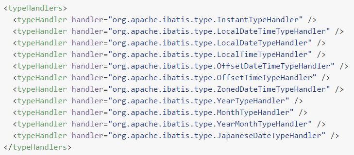

**3.自定义类型处理器**

当某个具体类型Mybatis靠内置的类型处理器无法识别时，可以使用Mybatis提供的自定义类型处理器机制。

1. 第一步：实现 org.apache.ibatis.type.TypeHandler 接口或者继承 org.apache.ibatis.type.BaseTypeHandler 类。
2. 第二步：指定其映射某个JDBC类型（可选操作）。
3. 第三步：在Mybatis全局配置文件中注册。

- 创建自定义类型转换器类

  ```java
  @MappedTypes(value = Address.class)
  @MappedJdbcTypes(JdbcType.CHAR)
  public class AddressTypeHandler extends BaseTypeHandler<Address> {
      @Override
      public void setNonNullParameter(PreparedStatement preparedStatement, int i, Address address, JdbcType jdbcType) throws SQLException {
  
      }
  
      @Override
      public Address getNullableResult(ResultSet resultSet, String columnName) throws SQLException {
  
          // 1.从结果集中获取原始的地址数据
          String addressOriginalValue = resultSet.getString(columnName);
  
          // 2.判断原始数据是否有效
          if (addressOriginalValue == null || "".equals(addressOriginalValue))
              return null;
  
          // 3.如果原始数据有效则执行拆分
          String[] split = addressOriginalValue.split(",");
          String province = split[0];
          String city = split[1];
          String street = split[2];
  
          // 4.创建Address对象
          Address address = new Address();
          address.setCity(city);
          address.setProvince(province);
          address.setStreet(street);
  
          return address;
      }
  
      @Override
      public Address getNullableResult(ResultSet resultSet, int i) throws SQLException {
          return null;
      }
  
      @Override
      public Address getNullableResult(CallableStatement callableStatement, int i) throws SQLException {
          return null;
      }
  }
  ```

- 注册自定义类型转换器

  在Mybatis全局配置文件中配置：

  ```xml
  <!-- 注册自定义类型转换器 -->
  <typeHandlers>
      <typeHandler 
                   jdbcType="CHAR" 
                   javaType="com.atguigu.mybatis.entity.Address" 
                   handler="com.atguigu.mybatis.type.handler.AddressTypeHandler"/>
  </typeHandlers>
  ```

### Mapper映射

Mybatis允许在指定Mapper映射文件时，只指定其所在的包：

```xml
<mappers>
		<package name="top.sharehome.mapper"/>
</mappers>
```

此时这个包下的所有Mapper配置文件将被自动加载、注册，比较方便。

但是，要求是：

- Mapper接口和Mapper配置文件名称一致
- Mapper配置文件放在Mapper接口所在的包内

如果工程是Maven工程，那么Mapper配置文件还是要放在resources目录下：


==而且Maven创建新文件夹时，不能用全类名格式（top.sharehome.mapper）创建文件夹，只能用文件夹格式（**top/sharehome/mapper**）创建文件夹；==

### 插件机制

**1.Mybatis四大对象**

- Executor

  

- ParameterHandler

  

- ResultSetHandler

  

- StatementHandler

  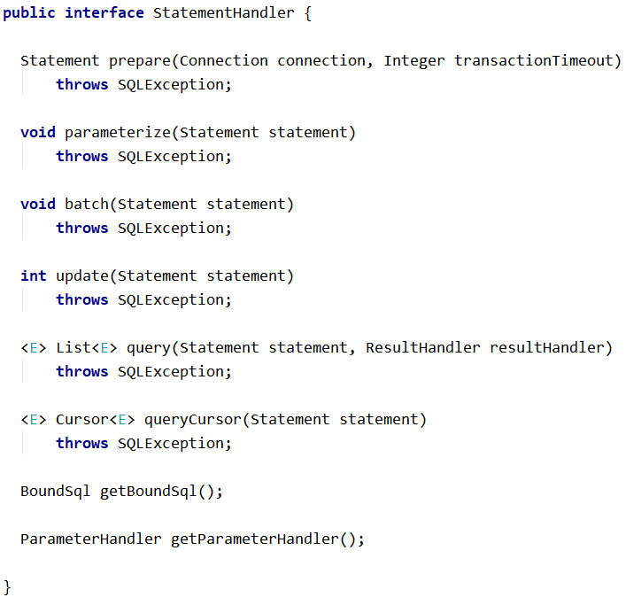

**2.Mybatis插件机制**

插件是MyBatis提供的一个非常强大的机制，我们可以通过插件来修改MyBatis的一些核心行为。插件通过<span style="color:blue;font-weight:bold;">动态代理</span>机制，可以介入四大对象的任何一个方法的执行。著名的Mybatis插件包括 PageHelper（分页插件）、通用 Mapper（SQL生成插件）等。

如果想编写自己的Mybatis插件可以通过实现org.apache.ibatis.plugin.Interceptor接口来完成，表示对Mybatis常规操作进行拦截，加入自定义逻辑。


但是由于插件涉及到Mybatis底层工作机制，在没有足够把握时不要轻易尝试。

### Mybatis底层的JDBC封装

org.apache.ibatis.executor.statement.PreparedStatementHandler类：


查找上面目标时，Debug查看源码的切入点是：

org.apache.ibatis.session.defaults.DefaultSqlSession类的update()方法


## 2.12.大纲总结


- Mybatis环境所需依赖 ★
- 配置
  - Mybatis全局配置
  - Mapper配置 ★
- Mapper接口 ★
- API
  - SqlSessionFactory
  - SqlSession
- MBG ★
- 缓存
  - 一级缓存
  - 二级缓存
    - 自带
    - EHCache ☆
- 原理
  - 把配置文件信息封装到Java对象中
  - 缓存底层机制
  - 四大接口
  - Mybatis底层是JDBC


# 3.Spring

## 3.1.Spring简介

### 一家公司


官网地址：https://spring.io/

### Spring旗下的众多项目

> From configuration to security, web apps to big data—whatever the infrastructure needs of your application may be, there is a Spring Project to help you build it. Start small and use just what you need—Spring is modular by design.

项目列表：https://spring.io/projects

### Spring Framework

Spring 基础框架，可以视为 Spring 基础设施，基本上任何其他 Spring 项目都是以 Spring Framework 为基础的。

**1.Spring Framework优良特性**

- 非侵入式：使用 Spring Framework 开发应用程序时，Spring 对应用程序本身的结构影响非常小。对领域模型可以做到零污染；对功能性组件也只需要使用几个简单的注解进行标记，完全不会破坏原有结构，反而能将组件结构进一步简化。这就使得基于 Spring Framework 开发应用程序时结构清晰、简洁优雅。
- 控制反转：IOC——Inversion of Control，翻转资源获取方向。把自己创建资源、向环境索取资源变成环境将资源准备好，我们享受资源注入。
- 面向切面编程：AOP——Aspect Oriented Programming，在不修改源代码的基础上增强代码功能。
- 容器：Spring IOC 是一个容器，因为它包含并且管理组件对象的生命周期。组件享受到了容器化的管理，替程序员屏蔽了组件创建过程中的大量细节，极大的降低了使用门槛，大幅度提高了开发效率。
- 组件化：Spring 实现了使用简单的组件配置组合成一个复杂的应用。在 Spring 中可以使用 XML 和 Java 注解组合这些对象。这使得我们可以基于一个个功能明确、边界清晰的组件有条不紊的搭建超大型复杂应用系统。
- 声明式：很多以前需要编写代码才能实现的功能，现在只需要声明需求即可由框架代为实现。
- 一站式：在 IOC 和 AOP 的基础上可以整合各种企业应用的开源框架和优秀的第三方类库。而且 Spring 旗下的项目已经覆盖了广泛领域，很多方面的功能性需求可以在 Spring Framework 的基础上全部使用 Spring 来实现。

**2.Spring Framework五大功能模块**

| 功能模块                | 功能介绍                                                    |
| ----------------------- | ----------------------------------------------------------- |
| Core Container          | 核心容器，在 Spring 环境下使用任何功能都必须基于 IOC 容器。 |
| AOP&Aspects             | 面向切面编程                                                |
| Testing                 | 提供了对 junit 或 TestNG 测试框架的整合。                   |
| Data Access/Integration | 提供了对数据访问/集成的功能。                               |
| Spring MVC              | 提供了面向Web应用程序的集成功能。                           |

## 3.2.IOC容器概念

### 普通容器

**1.生活中的普通容器**


普通容器只能用来存储，没有更多功能。

**2.程序中的普通容器**

- 数组
- 集合：List
- 集合：Set

### 复杂容器

**1.生活中的复杂容器**


政府管理我们的一生，生老病死都和政府有关。

**2.程序中的复杂容器**

Servlet 容器能够管理 Servlet、Filter、Listener 这样的组件的一生，所以它是一个复杂容器。我们即将要学习的 IOC 容器也是一个复杂容器。它们不仅要负责<span style="color:blue;font-weight:bold;">创建</span>组件的对象、<span style="color:blue;font-weight:bold;">存储</span>组件的对象，还要负责<span style="color:blue;font-weight:bold;">调用</span>组件的方法让它们工作，最终在特定情况下<span style="color:blue;font-weight:bold;">销毁</span>组件。

- Servlet生命周期

  | 名称       | 时机                                                         | 次数 |
  | ---------- | ------------------------------------------------------------ | ---- |
  | 创建对象   | 默认情况：接收到第一次请求<br />修改启动顺序后：Web应用启动过程中 | 一次 |
  | 初始化操作 | 创建对象之后                                                 | 一次 |
  | 处理请求   | 接收到请求                                                   | 多次 |
  | 销毁操作   | Web应用卸载之前                                              | 一次 |

- Filter生命周期

  | 生命周期阶段 | 执行时机         | 执行次数 |
  | ------------ | ---------------- | -------- |
  | 创建对象     | Web应用启动时    | 一次     |
  | 初始化       | 创建对象后       | 一次     |
  | 拦截请求     | 接收到匹配的请求 | 多次     |
  | 销毁         | Web应用卸载前    | 一次     |

### IOC思想

IOC：Inversion of Control，翻译过来是<span style="color:blue;font-weight:bold;">反转控制</span>。

**1.获取资源的传统方式**

自己做饭：买菜、洗菜、择菜、改刀、炒菜，全过程参与，费时费力，必须清楚了解资源创建整个过程中的全部细节且熟练掌握。

在应用程序中的组件需要获取资源时，传统的方式是组件<span style="color:blue;font-weight:bold;">主动</span>的从容器中获取所需要的资源，在这样的模式下开发人员往往需要知道在具体容器中特定资源的获取方式，增加了学习成本，同时降低了开发效率。

**2.反转控制方式获取资源**

点外卖：下单、等、吃，省时省力，不必关心资源创建过程的所有细节。

反转控制的思想完全颠覆了应用程序组件获取资源的传统方式：反转了资源的获取方向——改由容器主动的将资源推送给需要的组件，开发人员不需要知道容器是如何创建资源对象的，只需要提供接收资源的方式即可，极大的降低了学习成本，提高了开发的效率。这种行为也称为查找的<span style="color:blue;font-weight:bold;">被动</span>形式。

**3.DI**

DI：Dependency Injection，翻译过来是<span style="color:blue;font-weight:bold;">依赖注入</span>。

DI 是 IOC 的另一种表述方式：即组件以一些预先定义好的方式（例如：setter 方法）接受来自于容器的资源注入。相对于IOC而言，这种表述更直接。

所以结论是：IOC 就是一种反转控制的思想， 而 DI 是对 IOC 的一种具体实现。

### IOC容器在Spring中的实现

Spring 的 IOC 容器就是 IOC 思想的一个落地的产品实现。IOC 容器中管理的组件也叫做 bean。在创建 bean 之前，首先需要创建 IOC 容器。Spring 提供了 IOC 容器的两种实现方式：

**1.BeanFactory**

这是 IOC 容器的基本实现，是 Spring 内部使用的接口。面向 Spring 本身，不提供给开发人员使用。

**2.ApplicationContext（指的就是IOC容器）**

BeanFactory 的子接口，提供了更多高级特性。面向 Spring 的使用者，几乎所有场合都使用 ApplicationContext 而不是底层的 BeanFactory。

> 以后在 Spring 环境下看到一个类或接口的名称中包含 ApplicationContext，那基本就可以断定，这个类或接口与 IOC 容器有关。

**3.ApplicationContext的主要实现类**


| 类型名                          | 简介                                                         |
| ------------------------------- | ------------------------------------------------------------ |
| ClassPathXmlApplicationContext  | 通过读取类路径下的 XML 格式的配置文件创建 IOC 容器对象       |
| FileSystemXmlApplicationContext | 通过文件系统路径读取 XML 格式的配置文件创建 IOC 容器对象     |
| ConfigurableApplicationContext  | ApplicationContext 的子接口，包含一些扩展方法 refresh() 和 close() ，让 ApplicationContext 具有启动、关闭和刷新上下文的能力。 |
| WebApplicationContext           | 专门为 Web 应用准备，基于 Web 环境创建 IOC 容器对象，并将对象引入存入 ServletContext 域中。 |

## 3.3.基于XML管理bean

### 实验一 [重要]创建bean

**1.实验目标和思路**

①目标

由 Spring 的 IOC 容器创建类的对象。

②思路


**2.创建Maven Module**

```xml
<dependencies>
    <!-- 基于Maven依赖传递性，导入spring-context依赖即可导入当前所需所有jar包 -->
    <dependency>
        <groupId>org.springframework</groupId>
        <artifactId>spring-context</artifactId>
        <version>5.3.1</version>
    </dependency>
    <!-- junit测试 -->
    <dependency>
        <groupId>junit</groupId>
        <artifactId>junit</artifactId>
        <version>4.12</version>
        <scope>test</scope>
    </dependency>
</dependencies>
```


**3.创建组件类**

```java
package top.sharehome.ioc.component;

public class HappyComponent {
    public void doWork() {
        System.out.println("component do work ...");
    }
}

```

**4.创建 Spring 配置文件**


**5.配置组件**

```xml
<!-- 实验一 [重要]创建bean -->
<bean id="happyComponent" class="com.atguigu.ioc.component.HappyComponent"/>
```

- bean标签：通过配置bean标签告诉IOC容器需要创建对象的组件是什么
- id属性：bean的唯一标识
- class属性：组件类的全类名

**6.创建测试类**

```java
package top.sharehome.ios.test;

import org.junit.Test;
import org.springframework.context.ApplicationContext;
import org.springframework.context.support.ClassPathXmlApplicationContext;
import top.sharehome.ioc.component.HappyComponent;

public class IOCTest {
    //创建IOC容器对象
    //为了各个实验测试方法方便使用这个对象，声明成成员变量
    private ApplicationContext iocContainer = new ClassPathXmlApplicationContext("applicationContext.xml");

    //简单的测试如何获取IOC容器
    @Test
    public void testExperiment01() {
        //1.从IOC容器中获取已配置的bean
        //既然bean的id属性是指定这个bean的唯一标识，那么就可以根据id属性来获取这个组件对象
        HappyComponent happyComponent01 = (HappyComponent) iocContainer.getBean("HappyComponent01");
        //2.调用这个组件对象的方法
        happyComponent01.doWork();
    }
}
```

**7.无参构造器**

Spring 底层默认通过反射技术调用组件类的无参构造器来创建组件对象，这一点需要注意。如果在需要无参构造器时，没有无参构造器，则会抛出下面的异常：

> org.springframework.beans.factory.BeanCreationException: Error creating bean with name 'happyComponent1' defined in class path resource [applicationContext.xml]: Instantiation of bean failed; 
>
> nested exception is org.springframework.beans.BeanInstantiationException: Failed to instantiate [com.atguigu.ioc.component.HappyComponent]: No default constructor found; 
>
> nested exception is java.lang.NoSuchMethodException: com.atguigu.ioc.component.HappyComponent.<init>()

所以对一个JavaBean来说，<span style="color:blue;font-weight:bold;">无参构造器</span>和<span style="color:blue;font-weight:bold;">属性的getXxx()、setXxx()方法</span>是<span style="color:blue;font-weight:bold;">必须存在</span>的，特别是在框架中。

**8.用IOC容器创建对象和自己建区别**


在Spring环境下能够享受到的所有福利，都必须通过 IOC 容器附加到组件类上，所以随着我们在 Spring 中学习的功能越来越多，IOC 容器创建的组件类的对象就会比自己 new 的对象强大的越来越多。

### 实验二 [重要]获取bean

**1、方式一：根据id获取**

由于 id 属性指定了 bean 的唯一标识，所以根据 bean 标签的 id 属性可以精确获取到一个组件对象。上个实验中我们使用的就是这种方式。

**2、方式二：根据类型获取（大部分情况）**

①指定类型的 bean 唯一

```java
//简单地测试通过类型获取IOC容器
@Test
public void testExperiment02() {
    HappyComponent happyComponent02 = iocContainer.getBean(HappyComponent.class);
    happyComponent02.doWork();
}
```

②指令类型的 bean 不唯一

相同类型的 bean 在IOC容器中一共配置了两个：

```xml
<!-- 实验一 [重要]创建bean -->
<bean id="happyComponent" class="com.atguigu.ioc.component.HappyComponent"/>

<!-- 实验二 [重要]获取bean -->
<bean id="happyComponent2" class="com.atguigu.ioc.component.HappyComponent"/>
```

根据类型获取时会抛出异常：

> org.springframework.beans.factory.<span style="color:blue;font-weight:bold;">NoUniqueBeanDefinitionException</span>: No qualifying bean of type 'com.atguigu.ioc.component.HappyComponent' available: expected single matching bean but found 2: happyComponent,happyComponent2

③思考

如果组件类实现了接口，根据接口类型可以获取 bean 吗？

> 可以，前提是bean唯一

如果一个接口有多个实现类，这些实现类都配置了 bean，根据接口类型可以获取 bean 吗？

> 不行，因为bean不唯一

④结论

==根据类型来获取bean时，在满足bean唯一性的前提下，其实只是看：『对象 <span style="color:blue;font-weight:bold;">instanceof</span> 指定的类型』的返回结果，只要返回的是true就可以认定为和类型匹配，能够获取到。==

### 实验三 [重要]给bean的属性赋值：setter注入

**1.给组件类添加一个属性**

```java
public class HappyComponent {
    
    private String componentName;
    
    public String getComponentName() {
        return componentName;
    }
    
    public void setComponentName(String componentName) {
        this.componentName = componentName;
    }
    
    public void doWork() {
        System.out.println("component do work ...");
    }
    
}
```

**2.在配置时给属性指定值**

通过property标签配置的属性值会通过setXxx()方法注入，大家可以通过debug方式验证一下

```xml
<!-- 实验三 [重要]给bean的属性赋值：setter注入 -->
<bean id="happyComponent3" class="com.atguigu.ioc.component.HappyComponent">
    
    <!-- property标签：通过组件类的setXxx()方法给组件对象设置属性 -->
    <!-- name属性：指定属性名（这个属性名是getXxx()、setXxx()方法定义的，和成员变量无关） -->
    <!-- value属性：指定属性值 -->
    <property name="componentName" value="veryHappy"/>
</bean>
```

**3.测试**

```java
@Test
public void testExperiment03() {
    
    HappyComponent happyComponent3 = (HappyComponent) iocContainer.getBean("happyComponent3");
    
    String componentName = happyComponent3.getComponentName();
    
    System.out.println("componentName = " + componentName);
    
}
```

### 实验四 [重要]给bean的属性赋值：引用外部已声明的bean（手动装配）

**1、声明新的组件类**

```java
public class HappyMachine {
    
    private String machineName;
    
    public String getMachineName() {
        return machineName;
    }
    
    public void setMachineName(String machineName) {
        this.machineName = machineName;
    }
}
```

**2.原组件引用新组件**


**3.配置新组件的 bean**

```xml
<bean id="happyMachine" class="com.atguigu.ioc.component.HappyMachine">
    <property name="machineName" value="makeHappy"/>
</bean>
```

**4.在原组件的 bean 中引用新组件的 bean**

```xml
<bean id="happyComponent4" class="com.atguigu.ioc.component.HappyComponent">
    <!-- ref 属性：通过 bean 的 id 引用另一个 bean -->
    <property name="happyMachine" ref="happyMachine"/>
</bean>
```

这个操作在 IDEA 中有提示：


**5.测试**

```java
@Test
public void testExperiment04() {
    HappyComponent happyComponent4 = (HappyComponent) iocContainer.getBean("happyComponent4");
    
    HappyMachine happyMachine = happyComponent4.getHappyMachine();
    
    String machineName = happyMachine.getMachineName();
    
    System.out.println("machineName = " + machineName);
}
```

**6.易错点**

> 如果错把ref属性写成了value属性，会抛出异常：
> Caused by: java.lang.IllegalStateException: Cannot convert value of type 'java.lang.String' to required type 'com.atguigu.ioc.component.HappyMachine' for property 'happyMachine': no matching editors or conversion strategy found
> 意思是不能把String类型转换成我们要的HappyMachine类型
> 说明我们使用value属性时，Spring只把这个属性看做一个普通的字符串，不会认为这是一个bean的id，更不会根据它去找到bean来赋值

### 实验五 [重要]给bean的属性赋值：内部bean

**1.重新配置原组件**

在bean里面配置的bean就是内部bean，内部bean只能在当前bean内部使用，在其他地方不能使用。

```xml
<!-- 实验五 [重要]给bean的属性赋值：内部bean -->
<bean id="happyComponent5" class="com.atguigu.ioc.component.HappyComponent">
    <property name="happyMachine">
        <!-- 在一个 bean 中再声明一个 bean 就是内部 bean -->
        <!-- 内部 bean 可以直接用于给属性赋值，可以省略 id 属性 -->
        <bean class="com.atguigu.ioc.component.HappyMachine">
            <property name="machineName" value="makeHappy"/>
        </bean>
    </property>
</bean>
```

**2.测试**

```java
@Test
public void testExperiment04() {
    HappyComponent happyComponent4 = (HappyComponent) iocContainer.getBean("happyComponent4");
    
    HappyMachine happyMachine = happyComponent4.getHappyMachine();
    
    String machineName = happyMachine.getMachineName();
    
    System.out.println("machineName = " + machineName);
}
```

### 实验六 [重要]给bean的属性赋值：引入外部属性文件

**1.加入依赖**

```xml
<!-- MySQL驱动 -->
<dependency>
    <groupId>mysql</groupId>
    <artifactId>mysql-connector-java</artifactId>
    <version>5.1.3</version>
</dependency>
<!-- 数据源 -->
<dependency>
    <groupId>com.alibaba</groupId>
    <artifactId>druid</artifactId>
    <version>1.0.31</version>
</dependency>
```

**2.创建外部属性文件**

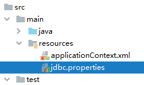

```properties
jdbc.user=root
jdbc.password=atguigu
jdbc.url=jdbc:mysql://192.168.198.100:3306/mybatis-example
jdbc.driver=com.mysql.jdbc.Driver
```

**3.引入**

```xml
<!-- 引入外部属性文件 -->
<context:property-placeholder location="classpath:jdbc.properties"/>
```

**4.使用**

```xml
<!-- 实验六 [重要]给bean的属性赋值：引入外部属性文件 -->
<bean id="druidDataSource" class="com.alibaba.druid.pool.DruidDataSource">
    <property name="url" value="${jdbc.url}"/>
    <property name="driverClassName" value="${jdbc.driver}"/>
    <property name="username" value="${jdbc.user}"/>
    <property name="password" value="${jdbc.password}"/>
</bean>
```

**5.测试**

```java
@Test
public void testExperiment06() throws SQLException {
    DataSource dataSource = iocContainer.getBean(DataSource.class);

    Connection connection = dataSource.getConnection();

    System.out.println("connection = " + connection);
}
```

### 实验七 给bean的属性赋值：级联属性赋值

**1.配置关联对象的 bean**

```xml
<bean id="happyMachine2" class="com.atguigu.ioc.component.HappyMachine"/>
```

**2.装配关联对象并赋值级联属性**

关联对象：happyMachine

级联属性：happyMachine.machineName

```xml
<!-- 实验七 给bean的属性赋值：级联属性赋值 -->
<bean id="happyComponent6" class="com.atguigu.ioc.component.HappyComponent">
    <!-- 装配关联对象 -->
    <property name="happyMachine" ref="happyMachine2"/>
    <!-- 对HappyComponent来说，happyMachine的machineName属性就是级联属性 -->
    <property name="happyMachine.machineName" value="cascadeValue"/>
</bean>
```

**3.测试**

```java
@Test
public void testExperiment07() {
    
    HappyComponent happyComponent6 = (HappyComponent) iocContainer.getBean("happyComponent6");
    
    String machineName = happyComponent6.getHappyMachine().getMachineName();
    
    System.out.println("machineName = " + machineName);

}
```

### 实验八 给bean的属性赋值：构造器注入

**1.声明组件类**

```java
package com.atguigu.ioc.component;
    
public class HappyTeam {
        
    private String teamName;
    private Integer memberCount;
    private Double memberSalary;
    
    public String getTeamName() {
        return teamName;
    }
    
    public void setTeamName(String teamName) {
        this.teamName = teamName;
    }
    
    public Integer getMemberCount() {
        return memberCount;
    }
    
    public void setMemberCount(Integer memberCount) {
        this.memberCount = memberCount;
    }
    
    public Double getMemberSalary() {
        return memberSalary;
    }
    
    public void setMemberSalary(Double memberSalary) {
        this.memberSalary = memberSalary;
    }
    
    @Override
    public String toString() {
        return "HappyTeam{" +
                "teamName='" + teamName + '\'' +
                ", memberCount=" + memberCount +
                ", memberSalary=" + memberSalary +
                '}';
    }
    
    public HappyTeam(String teamName, Integer memberCount, Double memberSalary) {
        this.teamName = teamName;
        this.memberCount = memberCount;
        this.memberSalary = memberSalary;
    }
    
    public HappyTeam() {
    }
}
```

**2.配置**

```xml
<!-- 实验八 给bean的属性赋值：构造器注入 -->
<bean id="happyTeam" class="com.atguigu.ioc.component.HappyTeam">
    <constructor-arg value="happyCorps"/>
    <constructor-arg value="10"/>
    <constructor-arg value="1000.55"/>
</bean>
```

**3.测试**

```java
@Test
public void testExperiment08() {
    
    HappyTeam happyTeam = iocContainer.getBean(HappyTeam.class);
    
    System.out.println("happyTeam = " + happyTeam);
    
}
```

**4.补充**

constructor-arg标签还有两个属性可以进一步描述构造器参数：

- index属性：指定参数所在位置的索引（从0开始）
- name属性：指定参数名

### 实验九 给bean的属性赋值：特殊值处理

**1.声明一个类用于测试**

```java
package com.atguigu.ioc.component;
    
public class PropValue {
    
    private String commonValue;
    private String expression;
    
    public String getCommonValue() {
        return commonValue;
    }
    
    public void setCommonValue(String commonValue) {
        this.commonValue = commonValue;
    }
    
    public String getExpression() {
        return expression;
    }
    
    public void setExpression(String expression) {
        this.expression = expression;
    }
    
    @Override
    public String toString() {
        return "PropValue{" +
                "commonValue='" + commonValue + '\'' +
                ", expression='" + expression + '\'' +
                '}';
    }

    public PropValue(String commonValue, String expression) {
        this.commonValue = commonValue;
        this.expression = expression;
    }

    public PropValue() {
    }
}
```

**2.字面量**

- 用Java代码举例说明

  字面量是相对于变量来说的。看下面的代码：

  ```java
  int a = 10;
  ```

  声明一个变量a，初始化为10，此时a就不代表字母a了，而是作为一个变量的名字。当我们引用a的时候，我们实际上拿到的值是10。

  而如果a是带引号的：'a'，那么它现在不是一个变量，它就是代表a这个字母本身，这就是字面量。所以字面量没有引申含义，就是我们看到的这个数据本身。

- Spring配置文件中举例

  字面量举例：

  ```xml
  <!-- 使用value属性给bean的属性赋值时，Spring会把value属性的值看做字面量 -->
  <property name="commonValue" value="hello"/>
  ```

- 类似变量举例

  ```xml
  <!-- 使用ref属性给bean的属性复制是，Spring会把ref属性的值作为一个bean的id来处理 -->
  <!-- 此时ref属性的值就不是一个普通的字符串了，它应该是一个bean的id -->
  <property name="happyMachine" ref="happyMachine"/>
  ```

**3.null值**

```xml
<property name="commonValue">
    <!-- null标签：将一个属性值明确设置为null -->
    <null/>
</property>
```

**4.XML实体**

```xml
<!-- 实验九 给bean的属性赋值：特殊值处理 -->
<bean id="propValue" class="com.atguigu.ioc.component.PropValue">
    <!-- 小于号在XML文档中用来定义标签的开始，不能随便使用 -->
    <!-- 解决方案一：使用XML实体来代替 -->
    <property name="expression" value="a &lt; b"/>
</bean>
```

**5.CDATA节**

```xml
<!-- 实验九 给bean的属性赋值：特殊值处理 -->
<bean id="propValue" class="com.atguigu.ioc.component.PropValue">
    <property name="expression">
        <!-- 解决方案二：使用CDATA节 -->
        <!-- CDATA中的C代表Character，是文本、字符的含义，CDATA就表示纯文本数据 -->
        <!-- XML解析器看到CDATA节就知道这里是纯文本，就不会当作XML标签或属性来解析 -->
        <!-- 所以CDATA节中写什么符号都随意 -->
        <value><![CDATA[a < b]]></value>
    </property>
</bean>
```

**6.总结**

也就是说 value 处的值写什么就是什么，不会有任何的引申；而 ref 属性的值写什么会引申到一个具体的类；

### 实验十 给bean的属性赋值：使用p名称空间

**1.配置**

使用 p 名称空间的方式可以省略子标签 property，将组件属性的设置作为 bean 标签的属性来完成。

```xml
<!-- 实验十 给bean的属性赋值：使用p名称空间 -->
<bean id="happyMachine3"
      class="com.atguigu.ioc.component.HappyMachine"
      p:machineName="goodMachine"
/>
```

使用 p 名称空间需要导入相关的 XML 约束，在 IDEA 的协助下导入即可：

```xml
<?xml version="1.0" encoding="UTF-8"?>
<beans xmlns="http://www.springframework.org/schema/beans"
       xmlns:xsi="http://www.w3.org/2001/XMLSchema-instance"
       xmlns:context="http://www.springframework.org/schema/context" xmlns:p="http://www.springframework.org/schema/p"
       xsi:schemaLocation="http://www.springframework.org/schema/beans http://www.springframework.org/schema/beans/spring-beans.xsd http://www.springframework.org/schema/context https://www.springframework.org/schema/context/spring-context.xsd">
```

具体操作时，输入p:稍微等一下，等IDEA弹出下面的提示：


按Alt+Enter即可导入。

**2.测试**

```java
@Test
public void testExperiment10() {
    HappyMachine happyMachine3 = (HappyMachine) iocContainer.getBean("happyMachine3");
    
    String machineName = happyMachine3.getMachineName();
    
    System.out.println("machineName = " + machineName);
}
```

### 实验十一 给bean的属性赋值：集合属性

**1.给组件类添加属性**


**2.配置**

```xml
<!-- 实验十三 集合类型的bean -->
<bean id="happyTeam2" class="com.atguigu.ioc.component.HappyTeam">
    <property name="memberList">
        <list>
            <value>member01</value>
            <value>member02</value>
            <value>member03</value>
        </list>
    </property>
</bean>
```

**3.测试**

```java
@Test
public void testExperiment13() {
    
    HappyTeam happyTeam2 = (HappyTeam) iocContainer.getBean("happyTeam2");
    
    List<String> memberList = happyTeam2.getMemberList();
    
    for (String member : memberList) {
        System.out.println("member = " + member);
    }
    
}
```

**4.其他变化形式**

```xml
<!-- 实验十一 给bean的属性赋值：集合属性 -->
<bean id="happyTeam2" class="com.atguigu.ioc.component.HappyTeam">
    <property name="memberNameList">
        <!-- list标签：准备一组集合类型的数据，给集合属性赋值 -->
        <!--<list>
            <value>member01</value>
            <value>member02</value>
            <value>member03</value>
        </list>-->
        <!-- 使用set标签也能实现相同效果，只是附带了去重功能 -->
        <!--<set>
            <value>member01</value>
            <value>member02</value>
            <value>member02</value>
        </set>-->
        <!-- array也同样兼容 -->
        <array>
            <value>member01</value>
            <value>member02</value>
            <value>member02</value>
        </array>
    </property>
    <property name="managerList">
        <!-- 给Map类型的属性赋值 -->
        <!--<map>
            <entry key="财务部" value="张三"/>
            <entry key="行政部" value="李四"/>
            <entry key="销售部" value="王五"/>
        </map>-->
        <!-- 也可以使用props标签 -->
        <props>
            <prop key="财务部">张三2</prop>
            <prop key="行政部">李四2</prop>
            <prop key="销售部">王五2</prop>
        </props>
    </property>
</bean>
```

### 实验十二 自动装配

**1.声明组件类**

其中HappyController需要用到HappyService。所谓自动装配就是一个组件需要其他组件时，由 IOC 容器负责找到那个需要的组件，并装配进去。

```java
public class HappyController {
        
    private HappyService happyService;
    
    public HappyService getHappyService() {
        return happyService;
    }
    
    public void setHappyService(HappyService happyService) {
        this.happyService = happyService;
    }
}
```

```java
public class HappyService {
}
```

**2.配置**

```xml
<!-- 实验十二 自动装配 -->
<bean id="happyService3" class="com.atguigu.ioc.component.HappyService"/>
<bean id="happyService2" class="com.atguigu.ioc.component.HappyService"/>

<!-- 使用bean标签的autowire属性设置自动装配效果 -->
<!-- byType表示根据类型进行装配，此时如果类型匹配的bean不止一个，那么会抛NoUniqueBeanDefinitionException -->
<!-- byName表示根据bean的id进行匹配。而bean的id是根据需要装配组件的属性的属性名来确定的 -->
<bean id="happyController"
      class="com.atguigu.ioc.component.HappyController"
      autowire="byName"
>
    <!-- 手动装配：在property标签中使用ref属性明确指定要装配的bean -->
    <!--<property name="happyService" ref="happyService"/>-->
</bean>
```

**3.测试**

```java
@Test
public void testExperiment12() {
    HappyController happyController = iocContainer.getBean(HappyController.class);
    
    HappyService happyService = happyController.getHappyService();
    
    System.out.println("happyService = " + happyService);
}
```

### 实验十三 集合类型的bean

**1.配置**

```xml
<!-- 实验十一 给bean的属性赋值：集合属性 -->
<util:list id="machineList">
    <bean class="com.atguigu.ioc.component.HappyMachine">
        <property name="machineName" value="machineOne"/>
    </bean>
    <bean class="com.atguigu.ioc.component.HappyMachine">
        <property name="machineName" value="machineTwo"/>
    </bean>
    <bean class="com.atguigu.ioc.component.HappyMachine">
        <property name="machineName" value="machineThree"/>
    </bean>
</util:list>
```

**2.测试**

```java
@Test
public void testExperiment11() {
    List<HappyMachine> machineList = (List<HappyMachine>) iocContainer.getBean("machineList");
    for (HappyMachine happyMachine : machineList) {
        System.out.println("happyMachine = " + happyMachine);
    }
}
```

### 实验十四 FactoryBean机制

**1.简介**

FactoryBean是Spring提供的一种整合第三方框架的常用机制。和普通的bean不同，配置一个FactoryBean类型的bean，在获取bean的时候得到的并不是class属性中配置的这个类的对象，而是getObject()方法的返回值。通过这种机制，Spring可以帮我们把复杂组件创建的详细过程和繁琐细节都屏蔽起来，只把最简洁的使用界面展示给我们。

将来我们整合Mybatis时，Spring就是通过FactoryBean机制来帮我们创建SqlSessionFactory对象的。

```java
/*
 * Copyright 2002-2020 the original author or authors.
 *
 * Licensed under the Apache License, Version 2.0 (the "License");
 * you may not use this file except in compliance with the License.
 * You may obtain a copy of the License at
 *
 *      https://www.apache.org/licenses/LICENSE-2.0
 *
 * Unless required by applicable law or agreed to in writing, software
 * distributed under the License is distributed on an "AS IS" BASIS,
 * WITHOUT WARRANTIES OR CONDITIONS OF ANY KIND, either express or implied.
 * See the License for the specific language governing permissions and
 * limitations under the License.
 */

package org.springframework.beans.factory;

import org.springframework.lang.Nullable;

/**
 * Interface to be implemented by objects used within a {@link BeanFactory} which
 * are themselves factories for individual objects. If a bean implements this
 * interface, it is used as a factory for an object to expose, not directly as a
 * bean instance that will be exposed itself.
 *
 * <p><b>NB: A bean that implements this interface cannot be used as a normal bean.</b>
 * A FactoryBean is defined in a bean style, but the object exposed for bean
 * references ({@link #getObject()}) is always the object that it creates.
 *
 * <p>FactoryBeans can support singletons and prototypes, and can either create
 * objects lazily on demand or eagerly on startup. The {@link SmartFactoryBean}
 * interface allows for exposing more fine-grained behavioral metadata.
 *
 * <p>This interface is heavily used within the framework itself, for example for
 * the AOP {@link org.springframework.aop.framework.ProxyFactoryBean} or the
 * {@link org.springframework.jndi.JndiObjectFactoryBean}. It can be used for
 * custom components as well; however, this is only common for infrastructure code.
 *
 * <p><b>{@code FactoryBean} is a programmatic contract. Implementations are not
 * supposed to rely on annotation-driven injection or other reflective facilities.</b>
 * {@link #getObjectType()} {@link #getObject()} invocations may arrive early in the
 * bootstrap process, even ahead of any post-processor setup. If you need access to
 * other beans, implement {@link BeanFactoryAware} and obtain them programmatically.
 *
 * <p><b>The container is only responsible for managing the lifecycle of the FactoryBean
 * instance, not the lifecycle of the objects created by the FactoryBean.</b> Therefore,
 * a destroy method on an exposed bean object (such as {@link java.io.Closeable#close()}
 * will <i>not</i> be called automatically. Instead, a FactoryBean should implement
 * {@link DisposableBean} and delegate any such close call to the underlying object.
 *
 * <p>Finally, FactoryBean objects participate in the containing BeanFactory's
 * synchronization of bean creation. There is usually no need for internal
 * synchronization other than for purposes of lazy initialization within the
 * FactoryBean itself (or the like).
 *
 * @author Rod Johnson
 * @author Juergen Hoeller
 * @since 08.03.2003
 * @param <T> the bean type
 * @see org.springframework.beans.factory.BeanFactory
 * @see org.springframework.aop.framework.ProxyFactoryBean
 * @see org.springframework.jndi.JndiObjectFactoryBean
 */
public interface FactoryBean<T> {

	/**
	 * The name of an attribute that can be
	 * {@link org.springframework.core.AttributeAccessor#setAttribute set} on a
	 * {@link org.springframework.beans.factory.config.BeanDefinition} so that
	 * factory beans can signal their object type when it can't be deduced from
	 * the factory bean class.
	 * @since 5.2
	 */
	String OBJECT_TYPE_ATTRIBUTE = "factoryBeanObjectType";


	/**
	 * Return an instance (possibly shared or independent) of the object
	 * managed by this factory.
	 * <p>As with a {@link BeanFactory}, this allows support for both the
	 * Singleton and Prototype design pattern.
	 * <p>If this FactoryBean is not fully initialized yet at the time of
	 * the call (for example because it is involved in a circular reference),
	 * throw a corresponding {@link FactoryBeanNotInitializedException}.
	 * <p>As of Spring 2.0, FactoryBeans are allowed to return {@code null}
	 * objects. The factory will consider this as normal value to be used; it
	 * will not throw a FactoryBeanNotInitializedException in this case anymore.
	 * FactoryBean implementations are encouraged to throw
	 * FactoryBeanNotInitializedException themselves now, as appropriate.
	 * @return an instance of the bean (can be {@code null})
	 * @throws Exception in case of creation errors
	 * @see FactoryBeanNotInitializedException
	 */
	@Nullable
	T getObject() throws Exception;

	/**
	 * Return the type of object that this FactoryBean creates,
	 * or {@code null} if not known in advance.
	 * <p>This allows one to check for specific types of beans without
	 * instantiating objects, for example on autowiring.
	 * <p>In the case of implementations that are creating a singleton object,
	 * this method should try to avoid singleton creation as far as possible;
	 * it should rather estimate the type in advance.
	 * For prototypes, returning a meaningful type here is advisable too.
	 * <p>This method can be called <i>before</i> this FactoryBean has
	 * been fully initialized. It must not rely on state created during
	 * initialization; of course, it can still use such state if available.
	 * <p><b>NOTE:</b> Autowiring will simply ignore FactoryBeans that return
	 * {@code null} here. Therefore it is highly recommended to implement
	 * this method properly, using the current state of the FactoryBean.
	 * @return the type of object that this FactoryBean creates,
	 * or {@code null} if not known at the time of the call
	 * @see ListableBeanFactory#getBeansOfType
	 */
	@Nullable
	Class<?> getObjectType();

	/**
	 * Is the object managed by this factory a singleton? That is,
	 * will {@link #getObject()} always return the same object
	 * (a reference that can be cached)?
	 * <p><b>NOTE:</b> If a FactoryBean indicates to hold a singleton object,
	 * the object returned from {@code getObject()} might get cached
	 * by the owning BeanFactory. Hence, do not return {@code true}
	 * unless the FactoryBean always exposes the same reference.
	 * <p>The singleton status of the FactoryBean itself will generally
	 * be provided by the owning BeanFactory; usually, it has to be
	 * defined as singleton there.
	 * <p><b>NOTE:</b> This method returning {@code false} does not
	 * necessarily indicate that returned objects are independent instances.
	 * An implementation of the extended {@link SmartFactoryBean} interface
	 * may explicitly indicate independent instances through its
	 * {@link SmartFactoryBean#isPrototype()} method. Plain {@link FactoryBean}
	 * implementations which do not implement this extended interface are
	 * simply assumed to always return independent instances if the
	 * {@code isSingleton()} implementation returns {@code false}.
	 * <p>The default implementation returns {@code true}, since a
	 * {@code FactoryBean} typically manages a singleton instance.
	 * @return whether the exposed object is a singleton
	 * @see #getObject()
	 * @see SmartFactoryBean#isPrototype()
	 */
	default boolean isSingleton() {
		return true;
	}

}
```

**2.实现FactoryBean接口**

```java
package top.sharehome.ioc.factory;

import top.sharehome.ioc.component.HappyMachine;

//实现FactoryBean接口时需要指定泛型
//泛型类型就是当前工厂要生产的对象的类型
public class HappyFactoryBean implements org.springframework.beans.factory.FactoryBean<HappyMachine> {
    private String machineName;

    public String getMachineName() {
        return machineName;
    }

    public void setMachineName(String machineName) {
        this.machineName = machineName;
    }

    @Override
    public HappyMachine getObject() throws Exception {
        //方法内部模拟创建，设置一个对象的复杂过程
        HappyMachine happyMachine = new HappyMachine();
        happyMachine.setMachineName(this.machineName);
        return happyMachine;
    }

    @Override
    public Class<?> getObjectType() {
        //返回要生产的对象类型
        return HappyMachine.class;
    }
}
```

**3.配置bean**

```xml
<!--实验十四：FactoryBean机制-->
<!--这个bean标签中的class属性指定的是HappyFactoryBean，但是将来要从里面获取的bean是这个类接口的泛型类型-->
<bean id="happyMachine02" class="top.sharehome.ioc.factory.HappyFactoryBean">
    <property name="machineName" value="iceCream"></property>
</bean>
```

**4.测试获取bean**

上面配置bean的时候使用的是实现FactoryBean接口的HappyFactoryBean类；

下面测试得到的却是实现FactoryBean接口时使用的泛型HappyMachine类；

```java
//测试FactoryBean机制详情见
@Test
public void testExperiment14() {
    HappyMachine iocContainerBean = (HappyMachine) iocContainer.getBean("happyMachine02");
    System.out.println(iocContainerBean.getMachineName());
}
```

### 实验十五 bean的作用域

**1.概念**

在Spring中可以通过配置bean标签的scope属性来指定bean的作用域范围，各取值含义参加下表：

| 取值      | 含义                                    | 创建对象的时机  |
| --------- | --------------------------------------- | --------------- |
| singleton | 在IOC容器中，这个bean的对象始终为单实例 | IOC容器初始化时 |
| prototype | 这个bean在IOC容器中有多个实例           | 获取bean时      |

如果是在WebApplicationContext环境下还会有另外两个作用域（但不常用）：

| 取值    | 含义                 |
| ------- | -------------------- |
| request | 在一个请求范围内有效 |
| session | 在一个会话范围内有效 |

**2.配置**

```xml
<!-- 实验十五 bean的作用域 -->
<!-- scope属性：取值singleton（默认值），bean在IOC容器中只有一个实例，IOC容器初始化时创建对象 -->
<!-- scope属性：取值prototype，bean在IOC容器中可以有多个实例，getBean()时创建对象 -->
<bean id="happyMachine4" scope="prototype" class="com.atguigu.ioc.component.HappyMachine">
    <property name="machineName" value="iceCreamMachine"/>
</bean>
```

**3.测试**

```java
@Test
public void testExperiment15() {
    HappyMachine happyMachine01 = (HappyMachine) iocContainer.getBean("happyMachine4");
    HappyMachine happyMachine02 = (HappyMachine) iocContainer.getBean("happyMachine4");
    
    System.out.println(happyMachine01 == happyMachine02);
    
    System.out.println("happyMachine01.hashCode() = " + happyMachine01.hashCode());
    System.out.println("happyMachine02.hashCode() = " + happyMachine02.hashCode());
}
```

### 实验十六 bean的生命周期

**1.bean的生命周期清单**

- bean对象创建（调用无参构造器）
- 给bean对象设置属性
- bean对象初始化之前操作（由bean的后置处理器负责）
- bean对象初始化（需在配置bean时指定初始化方法）
- bean对象初始化之后操作（由bean的后置处理器负责）
- bean对象就绪可以使用
- bean对象销毁（需在配置bean时指定销毁方法）
- IOC容器关闭

**2.指定bean的初始化方法和销毁方法**

- 创建两个方法作为初始化和销毁方法

  用com.atguigu.ioc.component.HappyComponent类测试：

  ```java
  public void happyInitMethod() {
      System.out.println("HappyComponent初始化");
  }
      
  public void happyDestroyMethod() {
      System.out.println("HappyComponent销毁");
  }
  ```

- 配置bean时指定初始化和销毁方法

  ```xml
  <!-- 实验十六 bean的生命周期 -->
  <!-- 使用init-method属性指定初始化方法 -->
  <!-- 使用destroy-method属性指定销毁方法 -->
  <bean id="happyComponent"
        class="com.atguigu.ioc.component.HappyComponent"
        init-method="happyInitMethod"
        destroy-method="happyDestroyMethod"
  >
      <property name="happyName" value="uuu"/>
  </bean>
  ```

**3.bean的后置处理器**

- 创建后置处理器类

  ```java
  package com.atguigu.ioc.process;
      
  import org.springframework.beans.BeansException;
  import org.springframework.beans.factory.config.BeanPostProcessor;
      
  // 声明一个自定义的bean后置处理器，即实现BeanPostProcessor接口
  // 注意：bean后置处理器不是单独针对某一个bean生效，而是针对IOC容器中所有bean都会执行
  public class MyHappyBeanProcessor implements BeanPostProcessor {
      
      @Override
      public Object postProcessBeforeInitialization(Object bean, String beanName) throws BeansException {
      
          System.out.println("☆☆☆" + beanName + " = " + bean);
      
          return bean;
      }
      
      @Override
      public Object postProcessAfterInitialization(Object bean, String beanName) throws BeansException {
      
          System.out.println("★★★" + beanName + " = " + bean);
      
          return bean;
      }
  }
  ```

- 把bean的后置处理器放入IOC容器

  ```xml
  <!-- bean的后置处理器要放入IOC容器才能生效 -->
  <bean id="myHappyBeanProcessor" class="com.atguigu.ioc.process.MyHappyBeanProcessor"/>
  ```

- 执行效果示例

  > HappyComponent创建对象
  > HappyComponent要设置属性了
  > ☆☆☆happyComponent = com.atguigu.ioc.component.HappyComponent@ca263c2
  > HappyComponent初始化
  > ★★★happyComponent = com.atguigu.ioc.component.HappyComponent@ca263c2
  > HappyComponent销毁

### 实验代码总结

==JavaBean代码省略；==

**applicationContext.xml：**

```xml
<?xml version="1.0" encoding="UTF-8"?>
<beans xmlns="http://www.springframework.org/schema/beans"
       xmlns:xsi="http://www.w3.org/2001/XMLSchema-instance" xmlns:util="http://www.springframework.org/schema/util"
       xmlns:context="http://www.springframework.org/schema/context" xmlns:p="http://www.springframework.org/schema/p"
       xsi:schemaLocation="http://www.springframework.org/schema/beans http://www.springframework.org/schema/beans/spring-beans.xsd http://www.springframework.org/schema/util https://www.springframework.org/schema/util/spring-util.xsd http://www.springframework.org/schema/context https://www.springframework.org/schema/context/spring-context.xsd">
    <!--实验一：创建bean-->
    <!--bean标签：通过配置bean标签告诉IOC容器需要创建对象的组件是什么-->
    <!--id属性：当前bean的唯一标识，设定了这个唯一标识之后，在其他地方就可以引用这个bean-->
    <!--class属性：指定这个bean要配置的组件的全类名-->
    <bean id="happyComponent01" class="top.sharehome.ioc.component.HappyComponent"></bean>

    <!--实验二：获取bean-->
    <!--<bean id="happyComponent02" class="top.sharehome.ioc.component.HappyComponent"></bean>-->

    <!--实验三给bean的属性赋值：setter注入-->
    <bean id="happyComponent03" class="top.sharehome.ioc.component.HappyComponent">
        <!--property标签：通过组件类的setXXX()方法给组件对象设置属性-->
        <!--name属性：指定属性名（这个属性名是getXxx()，setXxx方法定义的，即是xxx）-->
        <!--value属性：指定属性值-->
        <property name="happyName" value="I am very happy"></property>
    </bean>

    <!--实验四给bean的属性赋值：引用外部已声明的bean（手动装配）-->
    <bean id="happyMachine01" class="top.sharehome.ioc.component.HappyMachine">
        <property name="machineName" value="Create happy"></property>
    </bean>
    <bean id="happyComponent04" class="top.sharehome.ioc.component.HappyComponent">
        <!--使用外部已经配置好的happyMachine这个bean来给当前组件的happyMachine属性赋值-->
        <!--引用另外一个bean不能再使用value属性，而要使用ref属性-->
        <!--
            如果错把ref属性写成了value属性，会抛出异常
            Caused by: org.springframework.beans.ConversionNotSupportedException: Failed to convert property value of type 'java.lang.String' to required type 'top.sharehome.ioc.component.HappyMachine' for property 'happyMachine'; nested exception is java.lang.IllegalStateException: Cannot convert value of type 'java.lang.String' to required type 'top.sharehome.ioc.component.HappyMachine' for property 'happyMachine': no matching editors or conversion strategy found
            意思是不能把String类型转换成我们要的类型
            说明我们使用value属性时，Spring把这个属性看成一个普通字符串，不会认为这个是一个bean的id，更不会取用这个去找到一个bean赋值
        -->
        <property name="happyMachine" ref="happyMachine01"></property>
    </bean>

    <!--实验五给bean的属性赋值：内部bean-->
    <bean id="happyComponent05" class="top.sharehome.ioc.component.HappyComponent">
        <property name="happyMachine">
            <!-- 在一个 bean 中再声明一个 bean 就是内部 bean -->
            <!-- 因为内部 bean 仅限于在本 bean 里使用，所以内部 bean 可以直接用于给属性赋值，可以省略 id 属性 -->
            <bean class="top.sharehome.ioc.component.HappyMachine">
                <property name="machineName" value="Create happy again"></property>
            </bean>
        </property>
    </bean>

    <!--实验六给bean的属性赋值：引入外部属性文件-->
    <!--使用context名称空间下的property-placeholder标签引入外部属性文件（本质上就是记录外部属性文件的位置）-->
    <!--location属性：指定外部属性文件的路径；-->
    <!--location属性中的classpath表示这个路径从类路径根目录开始-->
    <context:property-placeholder location="classpath:jdbc.properties"/>
    <bean id="druidDataSource" class="com.alibaba.druid.pool.DruidDataSource">
        <!--通过${key}的形式引用外部属性文件中的数据-->
        <property name="url" value="${sharehome.dev.url}"></property>
        <property name="driverClassName" value="${sharehome.dev.driver}"></property>
        <property name="username" value="${sharehome.dev.username}"></property>
        <property name="password" value="${sharehome.dev.password}"></property>
    </bean>

    <!--实验七给bean的属性赋值：级联属性赋值-->
    <bean id="happyComponent06" class="top.sharehome.ioc.component.HappyComponent">
        <property name="happyMachine">
            <!--在级联属性赋值前需要用bean标签创建一个HappyMachine初始化的空对象-->
            <bean class="top.sharehome.ioc.component.HappyMachine">
            </bean>
        </property>
        <!--如果happyMachine没有被初始化，那么直接访问级联属性会抛出异常-->
        <property name="happyMachine.machineName" value="Create again and again"></property>
    </bean>

    <!--实验八：注入构造器-->
    <bean id="happyTeam01" class="top.sharehome.ioc.component.HappyTeam">
        <!--调用类的构造器创建对象同时传入参数值-->
        <!--constructor-arg标签，给构造器对应位置传入参数-->
        <!--index属性：指定当前参数在构造器参数列表中的索引位置-->
        <!--name属性：指定当前参数的参数名-->
        <!--value属性：指定参数值-->
        <constructor-arg index="0" name="teamName" value="stuTeam"></constructor-arg>
        <constructor-arg index="1" name="memberCount" value="10"></constructor-arg>
        <constructor-arg index="2" name="memberSalary" value="66.56"></constructor-arg>
    </bean>

    <!--实验九给bean的属性赋值：特殊值处理-->
    <bean id="propValue" class="top.sharehome.ioc.component.PropValue">
        <!--使用value的属性赋值时，Spring会把value的值看成自变量-->
        <!--<property name="commonValue" value="ok"></property>-->
        <!--<property name="expression" value="1 &lt; 2"></property>-->

        <!--使用null标签可以将name属性设为空置-->
        <!--<property name="commonValue">-->
        <!--    <null></null>-->
        <!--</property>-->
        <!--<property name="expression">-->
        <!--    <null></null>-->
        <!--</property>-->

        <!--字面量中的大于号（可选）和小于号（必须）需要进行转义-->
        <property name="expression" value="1 &lt; 2"></property>
        <!--或者使用CDATA节-->
        <!-- CDATA中的C代表Character，是文本、字符的含义，CDATA就表示纯文本数据 -->
        <!-- XML解析器看到CDATA节就知道这里是纯文本，就不会当作XML标签或属性来解析 -->
        <!-- 所以CDATA节中写什么符号都随意 -->
        <property name="commonValue">
            <value>
                <![CDATA[
                    1<2
                ]]>
            </value>
        </property>
    </bean>

    <!--实验十给bean的属性赋值：使用p名称空间-->
    <bean id="happyComponent07" class="top.sharehome.ioc.component.HappyComponent" p:happyName="I am happy too"></bean>

    <!--实验十一给bean的属性赋值：集合属性-->
    <bean id="happyTeam02" class="top.sharehome.ioc.component.HappyTeam">
        <property name="memberNameList">
            <!--list标签：准备好一组List类型的数据给Java中集合Collection属性赋值-->
            <!--使用该标签会继承List的有序性等性质-->
            <!--<list>-->
            <!--    <value>member01</value>-->
            <!--    <value>member02</value>-->
            <!--    <value>member03</value>-->
            <!--</list>-->

            <!--set标签：准备好一组Set类型的数据给Java中集合Collection属性赋值-->
            <!--使用该标签会继承Set的无序性和无重复性等性质-->
            <!--<set>-->
            <!--    <value>member01</value>-->
            <!--    <value>member02</value>-->
            <!--    <value>member02</value>-->
            <!--</set>-->

            <!--array标签也同样兼容，这里和list标签效果相同-->
            <array>
                <value>member01</value>
                <value>member02</value>
                <value>member03</value>
            </array>
        </property>

        <property name="managerMap">
            <!--map标签：准备好一组Map类型的数据给Java中集合Collection属性赋值-->
            <!--<map>-->
            <!--    <entry key="财务部" value="张三"></entry>-->
            <!--    <entry key="行政部" value="李四"></entry>-->
            <!--    <entry key="销售部" value="王五"></entry>-->
            <!--</map>-->

            <!--props标签：准备好一组Properties类型的数据给Java中集合Collection属性赋值-->
            <props>
                <prop key="财务部">张三</prop>
                <prop key="行政部">李四</prop>
                <prop key="销售部">王五</prop>
            </props>
        </property>
    </bean>

    <!--实验十二：自动装配-->
    <bean id="happyService" class="top.sharehome.ioc.component.HappyService"></bean>
    <!--使用bean标签的autowire属性进行自动装配-->
    <!--autowire中的"byName"属性值指的是根据bean的id进行精确匹配-->
    <!--autowire中的"byType"属性值指的是根据bean的类型进行匹配，这种匹配不精确-->
    <bean id="happyController" class="top.sharehome.ioc.component.HappyController" autowire="byName"></bean>

    <!--实验十三：集合类型的bean-->
    <util:list id="machineList">
        <bean class="top.sharehome.ioc.component.HappyMachine" p:machineName="m01"></bean>
        <bean class="top.sharehome.ioc.component.HappyMachine" p:machineName="m02"></bean>
        <bean class="top.sharehome.ioc.component.HappyMachine" p:machineName="m03"></bean>
    </util:list>

    <!--实验十四：FactoryBean机制-->
    <!--这个bean标签中的class属性指定的是HappyFactoryBean，但是将来要从里面获取的bean是这个类接口的泛型类型-->
    <bean id="happyMachine02" class="top.sharehome.ioc.factory.HappyFactoryBean">
        <property name="machineName" value="iceCream"></property>
    </bean>

    <!--实验十五：bean的作用域-->
    <!--scope属性：取值为singleton时，bean在IOC容器中只有一个实例，IOC容器初始化时创建对象，这也是默认值-->
    <!--scope属性：取值为prototype时，bean在IOC容器中可以有多个实例，getBean()时创建对象-->
    <bean id="happyMachine03" class="top.sharehome.ioc.component.HappyMachine">
        <property name="machineName" value="HappyMachineName"></property>
    </bean>
    <bean id="happyMachine04" class="top.sharehome.ioc.component.HappyMachine" scope="prototype">
        <property name="machineName" value="HappyMachineName"></property>
    </bean>

    <!--实验十六：bean的生命周期-->
    <!--使用init-method属性指定初始化方法-->
    <!--使用destroy-method属性指定销毁方法-->
    <bean id="happyComponent08" class="top.sharehome.ioc.component.HappyComponent" init-method="happyInitMethod"
          destroy-method="happyDestroyMethod">
        <property name="happyName" value="I am happy again and again and again"></property>
    </bean>
    <!--配置后置处理器，以便于在Java代码中使用-->
    <bean id="myHappyBeanProcessor" class="top.sharehome.ioc.process.MyHappyBeanProcessor"></bean>
</beans>
```

**IOCTest.java：**

```java
package top.sharehome.ios.test;

import org.junit.Test;
import org.springframework.context.ApplicationContext;
import org.springframework.context.support.ClassPathXmlApplicationContext;
import top.sharehome.ioc.api.Happy;
import top.sharehome.ioc.component.HappyComponent;
import top.sharehome.ioc.component.HappyController;
import top.sharehome.ioc.component.HappyMachine;
import top.sharehome.ioc.component.HappyTeam;

import javax.sql.DataSource;
import java.sql.Connection;
import java.sql.SQLException;
import java.util.List;

public class IOCTest {
    //创建IOC容器对象
    //为了各个实验测试方法方便使用这个对象，声明成成员变量
    private ApplicationContext iocContainer = new ClassPathXmlApplicationContext("applicationContext.xml");

    //实验一：测试通过id获取IOC容器
    @Test
    public void testExperiment01() {
        //1.从IOC容器中获取已配置的bean
        //既然bean的id属性是指定这个bean的唯一标识，那么就可以根据id属性来获取这个组件对象
        HappyComponent happyComponent01 = (HappyComponent) iocContainer.getBean("happyComponent01");
        //2.调用这个组件对象的方法
        happyComponent01.doWork();
    }

    //实验二：测试通过类型获取IOC容器
    //根据类型获取bean直接能够得到bean本身的类型，无需Object的强转
    //这个要求applicationContext配置文件中不能存在多个class属性与该类型相同
    //开始测试时先要保证IOC配置中getBean中类型只配置了一个，原因在下面
    @Test
    public void testExperiment0201() {
        HappyComponent happyComponent02 = iocContainer.getBean(HappyComponent.class);
        happyComponent02.doWork();
    }

    @Test
    public void testExperiment0202() {
        //如果IOC容器中，接口类型的bean只有一个，那么这个接口类型的bean对象对这个接口类型执行instanceof判断能够返回true
        //这是面向对象中多态性的体现，所以根据类型获取bean的依据就是“对象instanceof指定的对象”返回true就能获取到
        //如果IOC容器中接口类型的bean不止一个，那还是会抛出NoUniqueBeanDefinitionException异常
        Happy iocContainerBean = iocContainer.getBean(Happy.class);
        iocContainerBean.doWork();
    }

    //实验三：测试setter注入
    @Test
    public void testExperiment03() {
        HappyComponent iocContainerBean = (HappyComponent) iocContainer.getBean("happyComponent03");
        String happyName = iocContainerBean.getHappyName();
        System.out.println(happyName);
    }

    //实验四：测试引用外部已声明的bean
    @Test
    public void testExperiment04() {
        HappyComponent iocContainerBean = (HappyComponent) iocContainer.getBean("happyComponent04");
        System.out.println(iocContainerBean.getHappyMachine().getMachineName());
    }

    //实验五：测试内部bean
    @Test
    public void testExperiment05() {
        HappyComponent iocContainerBean = (HappyComponent) iocContainer.getBean("happyComponent05");
        System.out.println(iocContainerBean.getHappyMachine().getMachineName());
    }

    //实验六：测试外部属性文件
    @Test
    public void testExperiment06() throws SQLException {
        DataSource iocContainerBean = iocContainer.getBean(DataSource.class);
        Connection connection = iocContainerBean.getConnection();
        System.out.println(connection);
        connection.close();
    }

    //实验七：测试级联属性赋值
    @Test
    public void testExperiment07() {
        HappyComponent iocContainerBean = (HappyComponent) iocContainer.getBean("happyComponent06");
        System.out.println(iocContainerBean.getHappyMachine().getMachineName());
    }

    //实验八：测试构造器注入
    @Test
    public void testExperiment08() {
        HappyTeam iocContainerBean = (HappyTeam) iocContainer.getBean("happyTeam01");
        System.out.println(iocContainerBean.toString());
    }

    //实验九：测试特殊值处理详情见applicationContext.xml相对应处
    //public void testExperiment09(){}

    //实验十：测试使用p名称空间
    @Test
    public void testExperiment10() {
        HappyComponent iocContainerBean = (HappyComponent) iocContainer.getBean("happyComponent07");
        System.out.println(iocContainerBean.getHappyName());
    }

    //实验十一：测试集合属性
    @Test
    public void testExperiment11() {
        HappyTeam iocContainerBean = (HappyTeam) iocContainer.getBean("happyTeam02");
        iocContainerBean.getMemberNameList().forEach(c -> System.out.println(c));
        iocContainerBean.getManagerMap().forEach((k, v) -> System.out.println(k + ":" + v));
    }

    //实验十二：测试自动装配
    @Test
    public void testExperiment12() {
        HappyController iocContainerBean = (HappyController) iocContainer.getBean("happyController");
        System.out.println(iocContainerBean.getHappyService());
    }

    //实验十三：测试集合类型的bean
    @Test
    public void testExperiment13() {
        List<HappyMachine> iocContainerBean = (List<HappyMachine>) iocContainer.getBean("machineList");
        iocContainerBean.forEach(c -> System.out.println(c));
    }

    //实验十四：测试FactoryBean机制详情见
    @Test
    public void testExperiment14() {
        HappyMachine iocContainerBean = (HappyMachine) iocContainer.getBean("happyMachine02");
        System.out.println(iocContainerBean.getMachineName());
    }

    //实验十五：测试bean的作用域
    //首先证明在applicationContext.xml配置文件中普通创建的bean是单实例的，即创建两个相同的bean，然后进行类型比较然后得true
    @Test
    public void testExperiment1501() {
        HappyMachine iocContainerBean = (HappyMachine) iocContainer.getBean("happyMachine03");
        HappyMachine iocContainerBeanCompare = (HappyMachine) iocContainer.getBean("happyMachine03");
        boolean result = iocContainerBean.equals(iocContainerBeanCompare);
        System.out.println(result);
    }

    //然后证明在applicationContext.xml配置文件中带有scope="prototype"属性的bean是多实例的，即创建两个相同的bean，然后进行类型比较然后得false
    @Test
    public void testExperiment1502() {
        HappyMachine iocContainerBean = (HappyMachine) iocContainer.getBean("happyMachine04");
        HappyMachine iocContainerBeanCompare = (HappyMachine) iocContainer.getBean("happyMachine04");
        boolean result = iocContainerBean.equals(iocContainerBeanCompare);
        System.out.println(result);
    }

    //实验十六：bean的生命周期
    //测试并观察生命周期
    @Test
    public void testExperiment1601() {
        //由于ApplicationContext接口没有close方法，所以这里需要转换类型成其实现类
        ((ClassPathXmlApplicationContext) iocContainer).close();
    }

    //测试bean的后置处理器
    @Test
    public void testExperiment1602() {
        //便于区分，这里加一句
        System.out.println("这是对象初始化后进入方法的第一个打印语句");
        //由于ApplicationContext接口没有close方法，所以这里需要转换类型成其实现类
        ((ClassPathXmlApplicationContext) iocContainer).close();
    }
}
```

## 3.4.基于注解管理bean

### 实验一 [重要]标记与扫描

**1.注解的作用**

- 注解：

  和 XML 配置文件一样，注解本身并不能执行，注解本身仅仅只是做一个标记，具体的功能是框架检测到注解标记的位置，然后针对这个位置按照注解标记的功能来执行具体操作。

  本质上：所有一切的操作都是Java代码来完成的，XML和注解只是告诉框架中的Java代码如何执行。

  举例：元旦联欢会要布置教室，蓝色的地方贴上元旦快乐四个字，红色的地方贴上拉花，黄色的地方贴上气球。

  

  班长做了所有标记，同学们来完成具体工作。墙上的标记相当于我们在代码中使用的注解，后面同学们做的工作，相当于框架的具体操作。

- 扫描：

  Spring 为了知道程序员在哪些地方标记了什么注解，就需要通过扫描的方式，来进行检测。然后根据注解进行后续操作。

**2.新建Module**

```xml
<dependencies>

    <!-- 基于Maven依赖传递性，导入spring-context依赖即可导入当前所需所有jar包 -->
    <dependency>
        <groupId>org.springframework</groupId>
        <artifactId>spring-context</artifactId>
        <version>5.3.1</version>
    </dependency>

    <!-- junit测试 -->
    <dependency>
        <groupId>junit</groupId>
        <artifactId>junit</artifactId>
        <version>4.12</version>
        <scope>test</scope>
    </dependency>

</dependencies>
```

**3.创建Spring配置文件**


**4.创建一组组件类**

- 使用@Component注解标记的普通组件

  ```java
  package com.atguigu.ioc.component;
  
  import org.springframework.stereotype.Component;
  
  @Component
  public class CommonComponent {
  }
  ```

- 使用@Controller注解标记的控制器组件

  这个组件就是我们在三层架构中表述层里面，使用的控制器。以前是Servlet，以后我们将会使用Controller来代替Servlet。

  ```java
  package com.atguigu.ioc.component;
  
  import org.springframework.stereotype.Controller;
  
  @Controller
  public class SoldierController {
  }
  ```

- 使用@Service注解标记的业务逻辑组件

  这个组件就是我们在三层架构中使用的业务逻辑组件。

  ```java
  package com.atguigu.ioc.component;
  
  import org.springframework.stereotype.Service;
  
  @Service
  public class SoldierService {
  
  }
  ```

- 使用@Repository注解标记的持久化层组件

  这个组件就是我们以前用的Dao类，但是以后我们整合了Mybatis，这里就变成了Mapper接口，而Mapper接口是由Mybatis和Spring的整合包负责扫描的。

  由于Mybatis整合包想要把Mapper接口背后的代理类加入Spring的IOC容器需要结合Mybatis对Mapper配置文件的解析，所以这个事情是Mybatis和Spring的整合包来完成，将来由Mybatis负责扫描，也不使用@Repository注解。

  ```java
  package com.atguigu.ioc.component;
  
  import org.springframework.stereotype.Repository;
  
  @Repository
  public class SoldierDao {
  }
  ```

**5.四个典型注解没有本质区别**


通过查看源码我们得知，@Controller、@Service、@Repository这三个注解只是在@Component注解的基础上起了三个新的名字。

对于Spring使用IOC容器管理这些组件来说没有区别。所以@Controller、@Service、@Repository这三个注解只是给开发人员看的，让我们能够便于分辨组件的作用。

注意：虽然它们本质上一样，但是为了代码的可读性，为了程序结构严谨我们肯定不能随便胡乱标记。

**6.扫描**

- 情况一：最基本的扫描方式[常用]

  ```xml
  <!-- 配置自动扫描的包 -->
  <!-- 最基本的扫描方式 -->
  <context:component-scan base-package="com.atguigu.ioc.component"/>
  ```

  从IOC容器中获取bean：

  ```java
  @Test
  public void testAnnotationcScanBean() {
      CommonComponent commonComponent = iocContainer.getBean(CommonComponent.class);
      
      SoldierController soldierController = iocContainer.getBean(SoldierController.class);
      
      SoldierService soldierService = iocContainer.getBean(SoldierService.class);
      
      SoldierDao soldierDao = iocContainer.getBean(SoldierDao.class);
      
      System.out.println("commonComponent = " + commonComponent);
      System.out.println("soldierController = " + soldierController);
      System.out.println("soldierService = " + soldierService);
      System.out.println("soldierDao = " + soldierDao);
  }
  ```

- 情况二：指定匹配模式

  ```xml
  <!-- 情况二：在指定扫描包的基础上指定匹配模式 -->
  <context:component-scan
                          base-package="com.atguigu.ioc.component"
                          resource-pattern="Soldier*.class"/>
  ```

- 情况三：指定要排除的组件

  或者也可以说指定不扫描的组件

  ```xml
  <!-- 情况三：指定不扫描的组件 -->
  <context:component-scan base-package="com.atguigu.ioc.component">
      
      <!-- context:exclude-filter标签：指定排除规则 -->
      <!-- type属性：指定根据什么来进行排除，annotation取值表示根据注解来排除 -->
      <!-- expression属性：指定排除规则的表达式，对于注解来说指定全类名即可 -->
      <context:exclude-filter type="annotation" expression="org.springframework.stereotype.Controller"/>
  </context:component-scan>
  ```

- 情况四：仅扫描指定组件

  ```xml
  <!-- 情况四：仅扫描指定的组件 -->
  <!-- 仅扫描 = 关闭默认规则 + 追加规则 -->
  <!-- use-default-filters属性：取值false表示关闭默认扫描规则 -->
  <context:component-scan base-package="com.atguigu.ioc.component" use-default-filters="false">
      
      <!-- context:include-filter标签：指定在原有扫描规则的基础上追加的规则 -->
      <context:include-filter type="annotation" expression="org.springframework.stereotype.Controller"/>
  </context:component-scan>
  ```

**7.组件的beanName**

在我们使用XML方式管理bean的时候，每个bean都有一个唯一标识，便于在其他地方引用。现在使用注解后，每个组件仍然应该有一个唯一标识。

- 默认情况

  类名首字母小写就是bean的id。例如：SoldierController类对应的bean的id就是soldierController。

- 使用value属性指定

  ```java
  @Controller(value = "tianDog")
  public class SoldierController {
  }
  ```

  当注解中只设置一个属性时，value属性的属性名可以省略：

  ```java
  @Service("smallDog")
  public class SoldierService {
  
  }
  ```

### 实验二 [重要]自动装配

**1.设定情景**

> SoldierController需要SoldierService
>
> SoldierService需要SoldierDao

同时在各个组件中声明要调用的方法。

- 在SoldierController中声明方法

  ```java
  package com.atguigu.ioc.component;
  
  import org.springframework.stereotype.Controller;
  
  @Controller(value = "tianDog")
  public class SoldierController {
  
      private SoldierService soldierService;
  
      public void getMessage() {
          soldierService.getMessage();
      }
  
  }
  ```

- 在SoldierService中声明方法

  ```java
  @Service("smallDog")
  public class SoldierService {
  
      private SoldierDao soldierDao;
  
      public void getMessage() {
          soldierDao.getMessage();
      }
  }
  ```

- 在SoldierDao中声明方法

  ```java
  @Repository
  public class SoldierDao {
  
      public void getMessage() {
          System.out.println("I am a soldier");
      }
  
  }
  ```

**2.自动装配的实现**

- 前提

  参与自动装配的组件（需要装配别人、被别人装配）全部都必须在IOC容器中。

- @Autowired注解

  在成员变量上直接标记@Autowired注解即可，不需要提供setXxx()方法。以后我们在项目中的正式用法就是这样。

  - 给Controller装配Service

    ```java
    @Controller(value = "tianDog")
    public class SoldierController {
        
        @Autowired
        private SoldierService soldierService;
        
        public void getMessage() {
            soldierService.getMessage();
        }
        
    }
    ```

  - 给Service装配Dao

    ```java
    @Service("smallDog")
    public class SoldierService {
        
        @Autowired
        private SoldierDao soldierDao;
        
        public void getMessage() {
            soldierDao.getMessage();
        }
    }
    ```

**3.@Autowired注解其他细节**

- 标记在其他位置

  - 构造器

    ```java
    @Controller(value = "tianDog")
    public class SoldierController {
        
        private SoldierService soldierService;
        
        @Autowired
        public SoldierController(SoldierService soldierService) {
            this.soldierService = soldierService;
        }
        ……
    ```

  - setXxx()方法

    ```java
    @Controller(value = "tianDog")
    public class SoldierController {
    
        private SoldierService soldierService;
    
        @Autowired
        public void setSoldierService(SoldierService soldierService) {
            this.soldierService = soldierService;
        }
        ……
    ```

- @Autowired工作流程

  

  - 首先根据所需要的组件类型到IOC容器中查找

    - 能够找到唯一的bean：直接执行装配
    - 如果完全找不到匹配这个类型的bean：装配失败
    - 和所需类型匹配的bean不止一个
      - 没有@Qualifier注解：根据@Autowired标记位置成员变量的变量名作为bean的id进行匹配
        - 能够找到：执行装配
        - 找不到：装配失败
      - 使用@Qualifier注解：根据@Qualifier注解中指定的名称作为bean的id进行匹配
        - 能够找到：执行装配
        - 找不到：装配失败

    ```java
    @Controller(value = "soldierServlet")
    public class SoldierController {
        
        @Autowired
        @Qualifier(value = "maomiService222")
        // 根据面向接口编程思想，使用接口类型引入Service组件
        private ISoldierService soldierService;
    ```

- 佛系装配

  给@Autowired注解设置required = false属性表示：能装就装，装不上就不装。但是实际开发时，基本上所有需要装配组件的地方都是必须装配的，用不上这个属性。

  ```java
  @Controller(value = "soldierServlet")
  public class SoldierController {
  
      // 给@Autowired注解设置required = false属性表示：能装就装，装不上就不装
      @Autowired(required = false)
      private ISoldierService soldierService;
  ```

### 实验三 完全注解开发

体验完全注解开发，是为了给将来学习SpringBoot打基础。因为在SpringBoot中，就是完全舍弃XML配置文件，全面使用注解来完成主要的配置。

**1.使用配置类取代配置文件**

- 创建配置类

  使用@Configuration注解将一个普通的类标记为Spring的配置类。

  ```java
  package com.atguigu.ioc.configuration;
      
  import org.springframework.context.annotation.Configuration;
      
  @Configuration
  public class MyConfiguration {
  }
  ```

- 根据配置类创建IOC容器对象

  ```java
  // ClassPathXmlApplicationContext根据XML配置文件创建IOC容器对象
  private ApplicationContext iocContainer = new ClassPathXmlApplicationContext("applicationContext.xml");
  
  // AnnotationConfigApplicationContext根据配置类创建IOC容器对象
  private ApplicationContext iocContainerAnnotation = new AnnotationConfigApplicationContext(MyConfiguration.class);
  ```

**2.在配置类中配置bean**

使用@Bean注解

```java
@Configuration
public class MyConfiguration {
    
    // @Bean注解相当于XML配置文件中的bean标签
    // @Bean注解标记的方法的返回值会被放入IOC容器
    @Bean
    public CommonComponent getComponent() {
    
        CommonComponent commonComponent = new CommonComponent();
    
        commonComponent.setComponentName("created by annotation config");
    
        return commonComponent;
    }
    
}
```

**3.在配置类中配置自动扫描的包**

```java
@Configuration
@ComponentScan("com.atguigu.ioc.component")
public class MyConfiguration {
    ……
```

### 实验四 整合junit4

**1.整合的好处**

- 好处1：不需要自己创建IOC容器对象了
- 好处2：任何需要的bean都可以在测试类中直接享受自动装配

**2.操作**

- 加入依赖

  ```xml
  <!-- Spring的测试包 -->
  <dependency>
      <groupId>org.springframework</groupId>
      <artifactId>spring-test</artifactId>
      <version>5.3.1</version>
  </dependency>
  ```

- 创建测试类

  ```java
  // junit的@RunWith注解：指定Spring为Junit提供的运行器
  @RunWith(SpringJUnit4ClassRunner.class)
  // Spring的@ContextConfiguration指定Spring配置文件的位置
  @ContextConfiguration(value = {"classpath:applicationContext.xml"})
  public class JunitIntegrationSpring {
      //没有和Spring整合的Junit测试类中不能直接装配IOC容器的对象
      //这里是整合过的，所以可以在测试类中使用@Autowired注解
      @Autowired
      private SoldierController soldierController;
      
      @Test
      public void testIntegration() {
          System.out.println("soldierController = " + soldierController);
      }
      
  }
  ```

## 3.5.AOP面向切面编程

### 情景设定

**1.声明接口**

```java
public interface Calculator {
    
    int add(int i, int j);
    
    int sub(int i, int j);
    
    int mul(int i, int j);
    
    int div(int i, int j);
    
}
```

**2.给接口声明一个纯净版实现**


没有额外功能

```java
package com.atguigu.proxy.imp;
    
import com.atguigu.proxy.api.Calculator;
    
public class CalculatorPureImpl implements Calculator {
    
    @Override
    public int add(int i, int j) {
    
        int result = i + j;
    
        System.out.println("方法内部 result = " + result);
    
        return result;
    }
    
    @Override
    public int sub(int i, int j) {
    
        int result = i - j;
    
        System.out.println("方法内部 result = " + result);
    
        return result;
    }
    
    @Override
    public int mul(int i, int j) {
    
        int result = i * j;
    
        System.out.println("方法内部 result = " + result);
    
        return result;
    }
    
    @Override
    public int div(int i, int j) {
    
        int result = i / j;
    
        System.out.println("方法内部 result = " + result);
    
        return result;
    }
}
```

**3.再声明一个带日志功能的实现**


```java
package com.atguigu.proxy.imp;

import com.atguigu.proxy.api.Calculator;

public class CalculatorLogImpl implements Calculator {
    
    @Override
    public int add(int i, int j) {
    
        System.out.println("[日志] add 方法开始了，参数是：" + i + "," + j);
    
        int result = i + j;
    
        System.out.println("方法内部 result = " + result);
    
        System.out.println("[日志] add 方法结束了，结果是：" + result);
    
        return result;
    }
    
    @Override
    public int sub(int i, int j) {
    
        System.out.println("[日志] sub 方法开始了，参数是：" + i + "," + j);
    
        int result = i - j;
    
        System.out.println("方法内部 result = " + result);
    
        System.out.println("[日志] sub 方法结束了，结果是：" + result);
    
        return result;
    }
    
    @Override
    public int mul(int i, int j) {
    
        System.out.println("[日志] mul 方法开始了，参数是：" + i + "," + j);
    
        int result = i * j;
    
        System.out.println("方法内部 result = " + result);
    
        System.out.println("[日志] mul 方法结束了，结果是：" + result);
    
        return result;
    }
    
    @Override
    public int div(int i, int j) {
    
        System.out.println("[日志] div 方法开始了，参数是：" + i + "," + j);
    
        int result = i / j;
    
        System.out.println("方法内部 result = " + result);
    
        System.out.println("[日志] div 方法结束了，结果是：" + result);
    
        return result;
    }
}
```

**4.提出问题**

- 现有代码缺陷

  针对带日志功能的实现类，我们发现有如下缺陷：

  - 对核心业务功能有干扰，导致程序员在开发核心业务功能时分散了精力

  - 附加功能分散在各个业务功能方法中，不利于统一维护

- 解决思路

  解决这两个问题，核心就是：==解耦==。我们需要把附加功能从业务功能代码中抽取出来。

- 困难

  解决问题的困难：要抽取的代码在方法内部，靠以前把子类中的重复代码抽取到父类的方式没法解决。所以需要引入新的技术。

### 代理模式

#### 概念

**介绍**

二十三种设计模式中的一种，属于结构型模式。它的作用就是通过提供一个代理类，让我们在调用目标方法的时候，不再是直接对目标方法进行调用，而是通过代理类<span style="color:blue;font-weight:bold;">间接</span>调用。让不属于目标方法核心逻辑的代码从目标方法中剥离出来——<span style="color:blue;font-weight:bold;">解耦</span>。调用目标方法时先调用代理对象的方法，减少对目标方法的调用和打扰，同时让附加功能能够集中在一起也有利于统一维护。


使用代理后：


**生活中的代理**

- 广告商找大明星拍广告需要经过经纪人

- 合作伙伴找大老板谈合作要约见面时间需要经过秘书

- 房产中介是买卖双方的代理

**相关术语**

- 代理：将非核心逻辑剥离出来以后，封装这些非核心逻辑的类、对象、方法。

- 目标：被代理“套用”了非核心逻辑代码的类、对象、方法。

  > 理解代理模式、AOP的核心关键词就一个字：<span style="color:blue;font-weight:bold;">套</span>

#### 静态代理

创建静态代理类：

```java
public class CalculatorStaticProxy implements Calculator {
    
    // 将被代理的目标对象声明为成员变量
    private Calculator target;
    
    public CalculatorStaticProxy(Calculator target) {
        this.target = target;
    }
    
    @Override
    public int add(int i, int j) {
    
        // 附加功能由代理类中的代理方法来实现
        System.out.println("[日志] add 方法开始了，参数是：" + i + "," + j);
    
        // 通过目标对象来实现核心业务逻辑
        int addResult = target.add(i, j);
    
        System.out.println("[日志] add 方法结束了，结果是：" + addResult);
    
        return addResult;
    }
    ……
```

静态代理确实实现了解耦，但是由于代码都写死了，完全不具备任何的灵活性。就拿日志功能来说，将来其他地方也需要附加日志，那还得再声明更多个静态代理类，那就产生了大量重复的代码，日志功能还是分散的，没有统一管理。

提出进一步的需求：将日志功能集中到一个代理类中，将来有任何日志需求，都通过这一个代理类来实现。这就需要使用动态代理技术了。

#### 动态代理

==动态代理的类必须有实现的接口==


- 生产代理对象的工厂类

  JDK本身就支持动态代理，这是反射技术的一部分。下面我们还是创建一个代理类（生产代理对象的工厂类）：

  ```java
  // 泛型T要求是目标对象实现的接口类型，本代理类根据这个接口来进行代理
  public class LogDynamicProxyFactory<T> {
      
      // 将被代理的目标对象声明为成员变量
      private T target;
      
      public LogDynamicProxyFactory(T target) {
          this.target = target;
      }
      
      public T getProxy() {
      
          // 创建代理对象所需参数一：加载目标对象的类的类加载器
          ClassLoader classLoader = target.getClass().getClassLoader();
      
          // 创建代理对象所需参数二：目标对象的类所实现的所有接口组成的数组
          Class<?>[] interfaces = target.getClass().getInterfaces();
      
          // 创建代理对象所需参数三：InvocationHandler对象
          // Lambda表达式口诀：
          // 1、复制小括号
          // 2、写死右箭头
          // 3、落地大括号
          InvocationHandler handler = (
                                      // 代理对象，当前方法用不上这个对象
                                      Object proxy,
      
                                       // method就是代表目标方法的Method对象
                                       Method method,
      
                                       // 外部调用目标方法时传入的实际参数
                                       Object[] args)->{
      
              // 我们对InvocationHandler接口中invoke()方法的实现就是在调用目标方法
              // 围绕目标方法的调用，就可以添加我们的附加功能
      
              // 声明一个局部变量，用来存储目标方法的返回值
              Object targetMethodReturnValue = null;
      
              // 通过method对象获取方法名
              String methodName = method.getName();
      
              // 为了便于在打印时看到数组中的数据，把参数数组转换为List
              List<Object> argumentList = Arrays.asList(args);
      
              try {
      
                  // 在目标方法执行前：打印方法开始的日志
                  System.out.println("[动态代理][日志] " + methodName + " 方法开始了，参数是：" + argumentList);
      
                  // 调用目标方法：需要传入两个参数
                  // 参数1：调用目标方法的目标对象
                  // 参数2：外部调用目标方法时传入的实际参数
                  // 调用后会返回目标方法的返回值
                  targetMethodReturnValue = method.invoke(target, args);
      
                  // 在目标方法成功后：打印方法成功结束的日志【寿终正寝】
                  System.out.println("[动态代理][日志] " + methodName + " 方法成功结束了，返回值是：" + targetMethodReturnValue);
      
              }catch (Exception e){
      
                  // 通过e对象获取异常类型的全类名
                  String exceptionName = e.getClass().getName();
      
                  // 通过e对象获取异常消息
                  String message = e.getMessage();
      
                  // 在目标方法失败后：打印方法抛出异常的日志【死于非命】
                  System.out.println("[动态代理][日志] " + methodName + " 方法抛异常了，异常信息是：" + exceptionName + "," + message);
      
              }finally {
      
                  // 在目标方法最终结束后：打印方法最终结束的日志【盖棺定论】
                  System.out.println("[动态代理][日志] " + methodName + " 方法最终结束了");
      
              }
      
              // 这里必须将目标方法的返回值返回给外界，如果没有返回，外界将无法拿到目标方法的返回值
              return targetMethodReturnValue;
          };
      
          // 创建代理对象
          T proxy = (T) Proxy.newProxyInstance(classLoader, interfaces, handler);
      
          // 返回代理对象
          return proxy;
      }
  }
  ```

- 测试

  ```java
  @Test
  public void testDynamicProxy() {
      
      // 1.创建被代理的目标对象
      Calculator target = new CalculatorPureImpl();
      
      // 2.创建能够生产代理对象的工厂对象
      LogDynamicProxyFactory<Calculator> factory = new LogDynamicProxyFactory<>(target);
      
      // 3.通过工厂对象生产目标对象的代理对象
      Calculator proxy = factory.getProxy();
      
      // 4.通过代理对象间接调用目标对象
      int addResult = proxy.add(10, 2);
      System.out.println("方法外部 addResult = " + addResult + "\n");
      
      int subResult = proxy.sub(10, 2);
      System.out.println("方法外部 subResult = " + subResult + "\n");
      
      int mulResult = proxy.mul(10, 2);
      System.out.println("方法外部 mulResult = " + mulResult + "\n");
      
      int divResult = proxy.div(10, 2);
      System.out.println("方法外部 divResult = " + divResult + "\n");
  }
  ```

- 练习

  动态代理的实现过程不重要，重要的是使用现成的动态代理类去<span style="color:blue;font-weight:bold;">套</span>用到其他目标对象上。

  声明另外一个接口：

  ```java
  public interface SoldierService {
      
      int saveSoldier(String soldierName);
      
      int removeSoldier(Integer soldierId);
      
      int updateSoldier(Integer soldierId, String soldierName);
      
      String getSoldierNameById(Integer soldierId);
      
  }
  ```

  给接口一个实现类：

  ```java
  public class SoldierServiceImpl implements SoldierService {
      
      @Override
      public int saveSoldier(String soldierName) {
      
          System.out.println("核心业务逻辑：保存到数据库……");
      
          return 1;
      }
      
      @Override
      public int removeSoldier(Integer soldierId) {
      
          System.out.println("核心业务逻辑：从数据库删除……");
      
          return 1;
      }
      
      @Override
      public int updateSoldier(Integer soldierId, String soldierName) {
      
          System.out.println("核心业务逻辑：更新……");
      
          return 1;
      }
  
      @Override
      public String getSoldierNameById(Integer soldierId) {
      
          System.out.println("核心业务逻辑：查询数据库……");
      
          return "good";
      }
  }
  ```

  测试：

  ```java
  @Test
  public void testSoldierServiceDynamicProxy() {
      
      // 1.创建被代理的目标对象
      SoldierService soldierService = new SoldierServiceImpl();
      
      // 2.创建生产代理对象的工厂对象
      LogDynamicProxyFactory<SoldierService> factory = new LogDynamicProxyFactory<>(soldierService);
      
      // 3.生产代理对象
      SoldierService proxy = factory.getProxy();
      
      // 4.通过代理对象调用目标方法
      String soldierName = proxy.getSoldierNameById(1);
      System.out.println("soldierName = " + soldierName);
      
  }
  ```

### 核心套路


### AOP术语

#### 横切关注点

从每个方法中抽取出来的同一类非核心业务。在同一个项目中，我们可以使用多个横切关注点对相关方法进行多个不同方面的增强。

这个概念不是语法层面天然存在的，而是根据附加功能的逻辑上的需要：有十个附加功能，就有十个横切关注点。


#### 通知[记住]

每一个横切关注点上要做的事情都需要写一个方法来实现，这样的方法就叫<span style="color:blue;font-weight:bold;">通知方法</span>。

- 前置通知：在被代理的目标方法<span style="color:blue;font-weight:bold;">前</span>执行
- 返回通知：在被代理的目标方法<span style="color:blue;font-weight:bold;">成功结束</span>后执行（<span style="color:blue;font-weight:bold;">寿终正寝</span>）
- 异常通知：在被代理的目标方法<span style="color:blue;font-weight:bold;">异常结束</span>后执行（<span style="color:blue;font-weight:bold;">死于非命</span>）
- 后置通知：在被代理的目标方法<span style="color:blue;font-weight:bold;">最终结束</span>后执行（<span style="color:blue;font-weight:bold;">盖棺定论</span>）
- 环绕通知：使用try...catch...finally结构围绕<span style="color:blue;font-weight:bold;">整个</span>被代理的目标方法，包括上面四种通知对应的所有位置


#### 切面[记住]

封装通知方法的类。

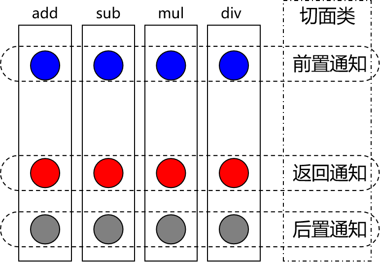

#### 目标

被代理的目标对象。

#### 代理

向目标对象应用通知之后创建的代理对象。

#### 连接点

这也是一个纯逻辑概念，不是语法定义的。

把方法排成一排，每一个横切位置看成x轴方向，把方法从上到下执行的顺序看成y轴，x轴和y轴的交叉点就是连接点。


#### 切入点[记住]

定位连接点的方式。

每个类的方法中都包含多个连接点，所以连接点是类中客观存在的事物（从逻辑上来说）。

如果把连接点看作数据库中的记录，那么切入点就是查询记录的 SQL 语句。

Spring 的 AOP 技术可以通过切入点定位到特定的连接点。

切点通过 org.springframework.aop.Pointcut 接口进行描述，它使用类和方法作为连接点的查询条件。

### 基于注解的AOP

#### AOP概念介绍

**名词解释：**

AOP：Aspect Orlented Programming 面向切面编程；

**AOP的作用：**

下面两点是同一件事的两面，好比硬币的两面；

- 简化代码：把方法中固定位置的重复的代码==抽取==出来，让被抽取的方法更专注于自己的核心功能，提高了内聚性；
- 代码增强：把特定的功能封装到切面类中，看哪里有需要就往上进行==套用==，被套用了切面逻辑的方法就被切面给增强了；

#### 基于注解的AOP用到的技术


- 动态代理（InvocationHandler）：JDK原生的实现方式，需要被代理的目标类必须实现接口。因为这个技术要求<span style="color:blue;font-weight:bold;">代理对象和目标对象实现同样的接口</span>（兄弟两个拜把子模式）。
- cglib：通过<span style="color:blue;font-weight:bold;">继承被代理的目标类</span>（认干爹模式）实现代理，所以不需要目标类实现接口。
- AspectJ：本质上是静态代理，<span style="color:blue;font-weight:bold;">将代理逻辑“织入”被代理的目标类编译得到的字节码文件</span>，所以最终效果是动态的。weaver就是织入器。Spring只是借用了AspectJ中的注解。

#### 初步实现

**加入依赖**

```xml
<dependencies>
    <!-- 基于Maven依赖传递性，导入spring-context依赖即可导入当前所需所有jar包 -->
    <dependency>
        <groupId>org.springframework</groupId>
        <artifactId>spring-context</artifactId>
        <version>5.3.1</version>
    </dependency>
    <!-- spring-aspects会帮我们传递过来aspectjweaver -->
    <dependency>
        <groupId>org.springframework</groupId>
        <artifactId>spring-aspects</artifactId>
        <version>5.3.1</version>
    </dependency>
    <!-- Spring的测试包 -->
    <dependency>
        <groupId>org.springframework</groupId>
        <artifactId>spring-test</artifactId>
        <version>5.3.1</version>
    </dependency>
    <!-- junit测试 -->
    <dependency>
        <groupId>junit</groupId>
        <artifactId>junit</artifactId>
        <version>4.12</version>
        <scope>test</scope>
    </dependency>
</dependencies>
```

**准备被代理的目标资源**

接口：

```java
public interface Calculator {
    
    int add(int i, int j);
    
    int sub(int i, int j);
    
    int mul(int i, int j);
    
    int div(int i, int j);
    
}
```

纯净的实现类：

在Spring环境下工作，所有的一切都必须放在IOC容器中。现在接口的实现类是AOP要代理的目标类，所以它也必须放入IOC容器。

```java
package com.atguigu.aop.imp;
    
import com.atguigu.aop.api.Calculator;
import org.springframework.stereotype.Component;
    
@Component
public class CalculatorPureImpl implements Calculator {
    
    @Override
    public int add(int i, int j) {
    
        int result = i + j;
    
        System.out.println("方法内部 result = " + result);
    
        return result;
    }
    
    @Override
    public int sub(int i, int j) {
    
        int result = i - j;
    
        System.out.println("方法内部 result = " + result);
    
        return result;
    }
    
    @Override
    public int mul(int i, int j) {
    
        int result = i * j;
    
        System.out.println("方法内部 result = " + result);
    
        return result;
    }
    
    @Override
    public int div(int i, int j) {
    
        int result = i / j;
    
        System.out.println("方法内部 result = " + result);
    
        return result;
    }
}
```

**创建切面类**

```java
// @Aspect表示这个类是一个切面类
@Aspect
// @Component注解保证这个切面类能够放入IOC容器
@Component
public class LogAspect {
    // @Before注解：声明当前方法是前置通知方法
    // value属性：指定切入点表达式，由切入点表达式控制当前通知方法要作用在哪一个目标方法上
    @Before(value = "execution(public int com.atguigu.aop.api.Calculator.add(int,int))")
    public void printLogBeforeCore() {
        System.out.println("[AOP前置通知] 方法开始了");
    }
    
    @AfterReturning(value = "execution(public int com.atguigu.aop.api.Calculator.add(int,int))")
    public void printLogAfterSuccess() {
        System.out.println("[AOP返回通知] 方法成功返回了");
    }
    
    @AfterThrowing(value = "execution(public int com.atguigu.aop.api.Calculator.add(int,int))")
    public void printLogAfterException() {
        System.out.println("[AOP异常通知] 方法抛异常了");
    }
    
    @After(value = "execution(public int com.atguigu.aop.api.Calculator.add(int,int))")
    public void printLogFinallyEnd() {
        System.out.println("[AOP后置通知] 方法最终了");
    }
    
}
```

**创建Spring的配置文件**

```xml
<?xml version="1.0" encoding="UTF-8"?>
<beans xmlns="http://www.springframework.org/schema/beans"
       xmlns:xsi="http://www.w3.org/2001/XMLSchema-instance" xmlns:aop="http://www.springframework.org/schema/aop"
       xmlns:context="http://www.springframework.org/schema/context"
       xsi:schemaLocation="http://www.springframework.org/schema/beans http://www.springframework.org/schema/beans/spring-beans.xsd http://www.springframework.org/schema/aop https://www.springframework.org/schema/aop/spring-aop.xsd http://www.springframework.org/schema/context https://www.springframework.org/schema/context/spring-context.xsd">
    
    <!-- 开启基于注解的AOP功能 -->
    <aop:aspectj-autoproxy/>
    
    <!-- 配置自动扫描的包 -->
    <context:component-scan base-package="com.atguigu.aop"/>
    
</beans>
```

**测试**

```java
@RunWith(SpringJUnit4ClassRunner.class)
@ContextConfiguration(value = {"classpath:applicationContext.xml"})
public class AOPTest {
    
    @Autowired
    private Calculator calculator;
    
    @Test
    public void testAnnotationAOP() {
        int add = calculator.add(10, 2);
        System.out.println("方法外部 add = " + add);
    }
}
```

打印效果如下：

> [AOP前置通知] 方法开始了
> 方法内部 result = 12
> [AOP返回通知] 方法成功返回了
> [AOP后置通知] 方法最终结束了
> 方法外部 add = 12

**通知执行顺序**

==这样的顺序上的改进类似于Mybatis中的懒加载的改进；==

- Spring版本5.3.x以前：
  - 前置通知
  - 目标操作
  - 后置通知
  - 返回通知或异常通知
- Spring版本5.3.x以后：
  - 前置通知
  - 目标操作
  - 返回通知或异常通知
  - 后置通知

#### 各个通知获取细节信息

**JoinPoint接口**

org.aspectj.lang.JoinPoint

- 要点1：JoinPoint接口通过getSignature()方法获取目标方法的签名

- 要点2：通过目标方法签名对象获取方法名

- 要点3：通过JoinPoint对象获取外界调用目标方法时传入的实参列表组成的数组

  ```java
  // @Before注解标记前置通知方法
  // value属性：切入点表达式，告诉Spring当前通知方法要套用到哪个目标方法上
  // 在前置通知方法形参位置声明一个JoinPoint类型的参数，Spring就会将这个对象传入
  // 根据JoinPoint对象就可以获取目标方法名称、实际参数列表
  @Before(value = "execution(public int com.atguigu.aop.api.Calculator.add(int,int))")
  public void printLogBeforeCore(JoinPoint joinPoint) {
      
      // 1.通过JoinPoint对象获取目标方法签名对象
      // 方法的签名：一个方法的全部声明信息
      Signature signature = joinPoint.getSignature();
      
      // 2.通过方法的签名对象获取目标方法的详细信息
      String methodName = signature.getName();
      System.out.println("methodName = " + methodName);
      
      int modifiers = signature.getModifiers();
      System.out.println("modifiers = " + modifiers);
      
      String declaringTypeName = signature.getDeclaringTypeName();
      System.out.println("declaringTypeName = " + declaringTypeName);
      
      // 3.通过JoinPoint对象获取外界调用目标方法时传入的实参列表
      Object[] args = joinPoint.getArgs();
      
      // 4.由于数组直接打印看不到具体数据，所以转换为List集合
      List<Object> argList = Arrays.asList(args);
      
      System.out.println("[AOP前置通知] " + methodName + "方法开始了，参数列表：" + argList);
  }
  ```

  需要获取方法签名、传入的实参等信息时，可以在通知方法声明JoinPoint类型的形参。

**方法返回值**


在返回通知中，通过@AfterReturning注解的returning属性获取目标方法的返回值

```java
// @AfterReturning注解标记返回通知方法
// 在返回通知中获取目标方法返回值分两步：
// 第一步：在@AfterReturning注解中通过returning属性设置一个名称
// 第二步：使用returning属性设置的名称在通知方法中声明一个对应的形参，由于此时不知道返回值类型，所以我们就返回一个Object类型
@AfterReturning(
        value = "execution(public int com.atguigu.aop.api.Calculator.add(int,int))",
        returning = "targetMethodReturnValue"
)
public void printLogAfterCoreSuccess(JoinPoint joinPoint, Object targetMethodReturnValue) {
    
    String methodName = joinPoint.getSignature().getName();
    
    System.out.println("[AOP返回通知] "+methodName+"方法成功结束了，返回值是：" + targetMethodReturnValue);
}
```

**目标方法抛出的异常**


在异常通知中，通过@AfterThrowing注解的throwing属性获取目标方法抛出的异常对象

```java
// @AfterThrowing注解标记异常通知方法
// 在异常通知中获取目标方法抛出的异常分两步：
// 第一步：在@AfterThrowing注解中声明一个throwing属性设定形参名称
// 第二步：使用throwing属性指定的名称在通知方法声明形参，Spring会将目标方法抛出的异常对象从这里传给我们，由于我们不知道异常对象的具体类型，所以我们就使用最大的异常实现类Throwable
@AfterThrowing(
        value = "execution(public int com.atguigu.aop.api.Calculator.add(int,int))",
        throwing = "targetMethodException"
)
public void printLogAfterCoreException(JoinPoint joinPoint, Throwable targetMethodException) {
    
    String methodName = joinPoint.getSignature().getName();
    
    System.out.println("[AOP异常通知] "+methodName+"方法抛异常了，异常类型是：" + targetMethodException.getClass().getName());
}
```

打印效果局部如下：

> [AOP异常通知] div方法抛异常了，异常类型是：java.lang.ArithmeticException
>
> java.lang.ArithmeticException: / by zero
>
> at com.atguigu.aop.imp.CalculatorPureImpl.div(CalculatorPureImpl.java:42)
> at sun.reflect.NativeMethodAccessorImpl.invoke0(Native Method)
> at sun.reflect.NativeMethodAccessorImpl.invoke(NativeMethodAccessorImpl.java:62)
> at sun.reflect.DelegatingMethodAccessorImpl.invoke(DelegatingMethodAccessorImpl.java:43)
> at java.lang.reflect.Method.invoke(Method.java:498)
> at org.springframework.aop.support.AopUtils.invokeJoinpointUsingReflection(AopUtils.java:344)

#### 重用切入点表达式

在一处声明切入点表达式之后，其他有需要的地方引用这个切入点表达式。易于维护，一处修改，处处生效。声明方式如下：

```java
// 切入点表达式重用
@Pointcut("execution(* *..*.add(..))")
public void declarPointCut() {}
```

同一个类内部引用时：

```java
@Before(value = "declarPointCut()")
public void printLogBeforeCoreOperation(JoinPoint joinPoint) {
```

在不同类中引用：

```java
@Around(value = "com.atguigu.spring.aop.aspect.LogAspect.declarPointCut()")
public Object roundAdvice(ProceedingJoinPoint joinPoint) {
```

而作为存放切入点表达式的类，可以把整个项目中所有切入点表达式全部集中过来，便于统一管理：

```java
@Component
public class AtguiguPointCut {
    
    @Pointcut(value = "execution(public int *..Calculator.sub(int,int))")
    public void atguiguGlobalPointCut(){}
    
    @Pointcut(value = "execution(public int *..Calculator.add(int,int))")
    public void atguiguSecondPointCut(){}
    
    @Pointcut(value = "execution(* *..*Service.*(..))")
    public void transactionPointCut(){}
}
```

#### 切入点表达式语法

**切入点表达式的作用**

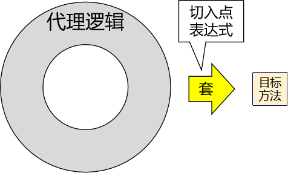

**语法细节**

- 用*号代替“权限修饰符”和“返回值”部分表示“权限修饰符”和“返回值”不限

- 在包名的部分，一个“*”号只能代表包的层次结构中的一层，表示这一层是任意的。

  - 例如：*.Hello匹配com.Hello，不匹配com.atguigu.Hello

- 在包名的部分，使用“*..”表示包名任意、包的层次深度任意

- 在类名的部分，类名部分整体用*号代替，表示类名任意

- 在类名的部分，可以使用*号代替类名的一部分

  ```java
  *Service
  ```

  上面例子表示匹配所有名称以Service结尾的类或接口

- 在方法名部分，可以使用*号表示方法名任意

- 在方法名部分，可以使用*号代替方法名的一部分

  ```java
  *Operation
  ```

  上面例子表示匹配所有方法名以Operation结尾的方法

- 在方法参数列表部分，使用(..)表示参数列表任意

- 在方法参数列表部分，使用(int,..)表示参数列表以一个int类型的参数开头

- 在方法参数列表部分，基本数据类型和对应的包装类型是不一样的

  - 切入点表达式中使用 int 和实际方法中 Integer 是不匹配的

- 在方法返回值部分，如果想要明确指定一个返回值类型，那么必须同时写明权限修饰符

  ```java
  execution(public int *..*Service.*(.., int))
  ```

  上面例子是对的，下面例子是错的：

  ```java
  execution(* int *..*Service.*(.., int))
  ```

  但是public *表示权限修饰符明确，返回值任意是可以的。

- 对于execution()表达式整体可以使用三个逻辑运算符号

  - execution() || execution()表示满足两个execution()中的任何一个即可

  - execution() && execution()表示两个execution()表达式必须都满足

  - !execution()表示不满足表达式的其他方法

    

#### 环绕通知

环绕通知对应整个try...catch...finally结构，包括前面四种通知的所有功能。

```java
// 使用@Around注解标明环绕通知方法
@Around(value = "com.atguigu.aop.aspect.AtguiguPointCut.transactionPointCut()")
public Object manageTransaction(
    
        // 通过在通知方法形参位置声明ProceedingJoinPoint类型的形参，
        // Spring会将这个类型的对象传给我们
        ProceedingJoinPoint joinPoint) {
    
    // 通过ProceedingJoinPoint对象获取外界调用目标方法时传入的实参数组
    Object[] args = joinPoint.getArgs();
    
    // 通过ProceedingJoinPoint对象获取目标方法的签名对象
    Signature signature = joinPoint.getSignature();
    
    // 通过签名对象获取目标方法的方法名
    String methodName = signature.getName();
    
    // 声明变量用来存储目标方法的返回值
    Object targetMethodReturnValue = null;
    
    try {
    
        // 在目标方法执行前：开启事务（模拟）
        System.out.println("[AOP 环绕通知] 开启事务，方法名：" + methodName + "，参数列表：" + Arrays.asList(args));
    
        // 过ProceedingJoinPoint对象调用目标方法
        // 目标方法的返回值一定要返回给外界调用者
        targetMethodReturnValue = joinPoint.proceed(args);
    
        // 在目标方法成功返回后：提交事务（模拟）
        System.out.println("[AOP 环绕通知] 提交事务，方法名：" + methodName + "，方法返回值：" + targetMethodReturnValue);
    
    }catch (Throwable e){
    
        // 在目标方法抛异常后：回滚事务（模拟）
        System.out.println("[AOP 环绕通知] 回滚事务，方法名：" + methodName + "，异常：" + e.getClass().getName());
    
    }finally {
    
        // 在目标方法最终结束后：释放数据库连接
        System.out.println("[AOP 环绕通知] 释放数据库连接，方法名：" + methodName);
    
    }
    
    return targetMethodReturnValue;
}
```

#### 切面的优先级

**概念**

- 相同目标方法上同时存在多个切面时，切面的优先级控制切面的<span style="color:blue;font-weight:bold;">内外嵌套</span>顺序。

  - 优先级高的切面：外面

  - 优先级低的切面：里面

- 使用@Order注解可以控制切面的优先级：

  - @Order(较小的数)：优先级高

  - @Order(较大的数)：优先级低


**实际意义**

实际开发时，如果有多个切面嵌套的情况，要慎重考虑。例如：如果事务切面优先级高，那么在缓存中命中数据的情况下，事务切面的操作都浪费了。


此时应该将缓存切面的优先级提高，在事务操作之前先检查缓存中是否存在目标数据。


#### 没有接口的情况

在目标类没有实现任何接口的情况下，Spring会自动使用cglib技术实现代理。为了证明这一点，我们做下面的测试：

- 创建目标类

  请确保这个类在自动扫描的包下，同时确保切面的切入点表达式能够覆盖到类中的方法。

  ```java
  @Service
  public class EmployeeService {
      
      public void getEmpList() {
          System.out.println("方法内部 com.atguigu.aop.imp.EmployeeService.getEmpList");
      }
      
  }
  ```

- 测试

  ```java
  @Autowired
  private EmployeeService employeeService;
  
  @Test
  public void testNoInterfaceProxy() {
      employeeService.getEmpList();
      System.out.println();
  }
  ```

- Debug查看

  - 没有实现接口情况

    

  - 有实现接口的情况

    

    同时我们发现：Mybatis调用的Mapper接口类型的对象其实也是动态代理机制

    

#### 小结


### 基于XML的AOP[了解]

**1.准备工作**

- 加入依赖

  和基于注解的AOP时一样。

- 准备代码

  把测试基于注解功能时的Java类复制到新module中，去除所有注解。

**2.配置Spring配置文件**

```xml
<!-- 配置目标类的bean -->
<bean id="calculatorPure" class="com.atguigu.aop.imp.CalculatorPureImpl"/>
    
<!-- 配置切面类的bean -->
<bean id="logAspect" class="com.atguigu.aop.aspect.LogAspect"/>
    
<!-- 配置AOP -->
<aop:config>
    
    <!-- 配置切入点表达式 -->
    <aop:pointcut id="logPointCut" expression="execution(* *..*.*(..))"/>
    
    <!-- aop:aspect标签：配置切面 -->
    <!-- ref属性：关联切面类的bean -->
    <aop:aspect ref="logAspect">
        <!-- aop:before标签：配置前置通知 -->
        <!-- method属性：指定前置通知的方法名 -->
        <!-- pointcut-ref属性：引用切入点表达式 -->
        <aop:before method="printLogBeforeCore" pointcut-ref="logPointCut"/>
    
        <!-- aop:after-returning标签：配置返回通知 -->
        <!-- returning属性：指定通知方法中用来接收目标方法返回值的参数名 -->
        <aop:after-returning
                method="printLogAfterCoreSuccess"
                pointcut-ref="logPointCut"
                returning="targetMethodReturnValue"/>
    
        <!-- aop:after-throwing标签：配置异常通知 -->
        <!-- throwing属性：指定通知方法中用来接收目标方法抛出异常的异常对象的参数名 -->
        <aop:after-throwing
                method="printLogAfterCoreException"
                pointcut-ref="logPointCut"
                throwing="targetMethodException"/>
    
        <!-- aop:after标签：配置后置通知 -->
        <aop:after method="printLogCoreFinallyEnd" pointcut-ref="logPointCut"/>
    
        <!-- aop:around标签：配置环绕通知 -->
        <!--<aop:around method="……" pointcut-ref="logPointCut"/>-->
    </aop:aspect>
    
</aop:config>
```

**3.测试**

```java
@RunWith(SpringJUnit4ClassRunner.class)
@ContextConfiguration(value = {"classpath:spring-context.xml"})
public class AOPTest {
    
    @Autowired
    private Calculator calculator;
    
    @Test
    public void testLogAspect() {
        int add = calculator.add(10, 2);
        System.out.println("add = " + add);
    }
}
```

### AOP对获取bean的影响

#### 根据类型获取bean

**1.情景一**

- bean对应的类没有实现任何接口

- 根据bean本身的类型获取bean

  - 测试：IOC容器中同类型的bean只有一个

    正常获取到IOC容器中的那个bean对象

  - 测试：IOC容器中同类型的bean有多个

    会抛出NoUniqueBeanDefinitionException异常，表示IOC容器中这个类型的bean有多个

**2.情景二**

- bean对应的类实现了接口，这个接口也只有这一个实现类
  - 测试：根据接口类型获取bean
  - 测试：根据类获取bean
  - 结论：上面两种情况其实都能够正常获取到bean，而且是同一个对象

**3.情景三**

- 声明一个接口

- 接口有多个实现类

- 接口所有实现类都放入IOC容器

  - 测试：根据接口类型获取bean

    会抛出NoUniqueBeanDefinitionException异常，表示IOC容器中这个类型的bean有多个

  - 测试：根据类获取bean

    正常

**4.情景四**

- 声明一个接口

- 接口有一个实现类

- 创建一个切面类，对上面接口的实现类应用通知

  - 测试：根据接口类型获取bean

    正常；

  - 测试：根据类获取bean

    抛出NoSuchBeanDefinitionException异常；

原因分析：

- 应用了切面后，真正放在IOC容器中的是代理类的对象
- 目标类并没有被放到IOC容器中，所以根据目标类的类型从IOC容器中是找不到的
- 又因为代理类和目标类都实现的是同一个接口，所以调用接口是可以获取的


从内存分析的角度来说，IOC容器中引用的是代理对象，代理对象引用的是目标对象。IOC容器并没有直接引用目标对象，所以根据目标类本身在IOC容器范围内查找不到。


debug查看代理类的类型：


**5.情景五**

- 声明一个类

- 创建一个切面类，对上面的类应用通知

  - 测试：根据类获取bean

    能获取到；

原因分析：无接口的情况下，Spring底层会调用cglib技术去实现代理，即代理类继承目标类，所以用目标父类拿代理子类是可以实现的，所以能够通过目标类去获取；


debug查看实际类型：


#### 自动装配

自动装配需先从IOC容器中获取到唯一的一个bean才能够执行装配。所以装配能否成功和装配底层的原理，和前面测试的获取bean的机制是一致的。

**1.情景一**

- 目标bean对应的类没有实现任何接口

- 根据bean本身的类型装配这个bean

  - 测试：IOC容器中同类型的bean只有一个

    正常装配

  - 测试：IOC容器中同类型的bean有多个

    会抛出NoUniqueBeanDefinitionException异常，表示IOC容器中这个类型的bean有多个

**2.情景二**

- 目标bean对应的类实现了接口，这个接口也只有这一个实现类

  - 测试：根据接口类型装配bean

    正常

  - 测试：根据类装配bean

    正常

**3.情景三**

- 声明一个接口

- 接口有多个实现类

- 接口所有实现类都放入IOC容器

  - 测试：根据接口类型装配bean

    @Autowired注解会先根据类型查找，此时会找到多个符合的bean，然后根据成员变量名作为bean的id进一步筛选，如果没有id匹配的，则会抛出NoUniqueBeanDefinitionException异常，表示IOC容器中这个类型的bean有多个

  - 测试：根据类装配bean

    正常

**4.情景四**

- 声明一个接口

- 接口有一个实现类

- 创建一个切面类，对上面接口的实现类应用通知

  - 测试：根据接口类型装配bean

    正常

  - 测试：根据类装配bean

    此时获取不到对应的bean，所以无法装配，抛出下面的异常：

> Caused by: org.springframework.beans.factory.BeanNotOfRequiredTypeException: Bean named 'fruitApple' is expected to be of type 'com.atguigu.bean.impl.FruitAppleImpl' but was actually of type 'com.sun.proxy.$Proxy15'

**5.情景五**

- 声明一个类

- 创建一个切面类，对上面的类应用通知

  - 测试：根据类装配bean

    正常

#### 总结

**1.对实现了接口的类应用切面**	==动态代理==


**2.对没实现接口的类应用切面**	==cglib代理==


## 3.6.声明式事务

### JdbcTemplate

#### 简介

为了在特定领域帮助我们简化代码，Spring 封装了很多 『Template』形式的模板类。例如：RedisTemplate、RestTemplate 等等，包括我们今天要学习的 JDBCTemplate。

#### 准备工作

**1.加入依赖**

```xml
<dependencies>

    <!-- 基于Maven依赖传递性，导入spring-context依赖即可导入当前所需所有jar包 -->
    <dependency>
        <groupId>org.springframework</groupId>
        <artifactId>spring-context</artifactId>
        <version>5.3.1</version>
    </dependency>

    <!-- Spring 持久化层支持 jar 包 -->
    <!-- Spring 在执行持久化层操作、与持久化层技术进行整合过程中，需要使用 orm、jdbc、tx 三个 jar 包 -->
    <!-- 导入 orm 包就可以通过 Maven 的依赖传递性把其他两个也导入 -->
    <dependency>
        <groupId>org.springframework</groupId>
        <artifactId>spring-orm</artifactId>
        <version>5.3.1</version>
    </dependency>

    <!-- Spring 测试相关 -->
    <dependency>
        <groupId>org.springframework</groupId>
        <artifactId>spring-test</artifactId>
        <version>5.3.1</version>
    </dependency>

    <!-- junit 测试 -->
    <dependency>
        <groupId>junit</groupId>
        <artifactId>junit</artifactId>
        <version>4.12</version>
        <scope>test</scope>
    </dependency>

    <!-- MySQL 驱动 -->
    <dependency>
        <groupId>mysql</groupId>
        <artifactId>mysql-connector-java</artifactId>
        <version>5.1.3</version>
    </dependency>
    <!-- 数据源 -->
    <dependency>
        <groupId>com.alibaba</groupId>
        <artifactId>druid</artifactId>
        <version>1.0.31</version>
    </dependency>

</dependencies>
```

**2.jdbc.properties**

```properties
atguigu.url=jdbc:mysql://192.168.198.100:3306/mybatis-example
atguigu.driver=com.mysql.jdbc.Driver
atguigu.username=root
atguigu.password=atguigu
```

**3.Spring 配置文件**

**配置数据源**

```xml
<!-- 导入外部属性文件 -->
<context:property-placeholder location="classpath:jdbc.properties" />
    
<!-- 配置数据源 -->
<bean id="druidDataSource" class="com.alibaba.druid.pool.DruidDataSource">
    <property name="url" value="${atguigu.url}"/>
    <property name="driverClassName" value="${atguigu.driver}"/>
    <property name="username" value="${atguigu.username}"/>
    <property name="password" value="${atguigu.password}"/>
</bean>
```

**配置 JDBCTemplate**

```xml
<!-- 配置 JdbcTemplate -->
<bean id="jdbcTemplate" class="org.springframework.jdbc.core.JdbcTemplate">
        
    <!-- 装配数据源 -->
    <property name="dataSource" ref="druidDataSource"/>
        
</bean>
```

**在测试类装配 JdbcTemplate**

```java
@RunWith(SpringJUnit4ClassRunner.class)
@ContextConfiguration(value = {"classpath:spring-context.xml"})
public class JDBCTest {
    
    @Autowired
    private DataSource dataSource;
    
    @Autowired
    private JdbcTemplate jdbcTemplate;
        
    @Test
    public void testJdbcTemplateUpdate() {
        
    }
    
    @Test
    public void testConnection() throws SQLException {
        Connection connection = dataSource.getConnection();
    
        System.out.println("connection = " + connection);
    }
    
}
```

#### 基本用法

**1.增删改操作**

```java
@Test
public void testJdbcTemplateUpdate() {
    
    // 1.编写 SQL 语句。需要传参的地方写问号占位符
    String sql = "update t_emp set emp_salary=? where emp_id=?";
    
    // 2.调用 jdbcTemplate 的 update() 方法执行 update 语句
    int count = jdbcTemplate.update(sql, 999.99, 3);
    
    System.out.println("count = " + count);
    
}
```

**2.查询：返回单个简单类型**

```java
@Test
public void testJdbcTemplateQueryForSingleValue() {
    
    // 1.编写 SQL 语句
    String sql = "select emp_name from t_emp where emp_id=?";
    
    // 2.调用 jdbcTemplate 的方法执行查询
    String empName = jdbcTemplate.queryForObject(sql, String.class, 6);
    
    System.out.println("empName = " + empName);
    
}
```

**3.查询：查询实体类类型**

**封装实体类类型**

```java
public class Emp {
    
    private Integer empId;
    private String empName;
    private Double empSalary;
    ……
```

**借助 RowMapper 完成查询**

```java
@Test
public void testJdbcTemplateQueryForEntity() {
    
    // 1.编写 SQL 语句
    String sql = "select emp_id,emp_name,emp_salary from t_emp where emp_id=?";
    
    // 2.准备 RowMapper 对象
    RowMapper<Emp> rowMapper = new BeanPropertyRowMapper<>(Emp.class);
    
    // 3.调用 jdbcTemplate 的方法执行查询
    Emp emp = jdbcTemplate.queryForObject(sql, rowMapper, 7);
    
    System.out.println("emp = " + emp);
    
}
```

### 声明式事务概念

#### 编程式事务

事务功能的相关操作全部通过自己编写代码来实现：

```java
Connection conn = ...;
	
try {
	
	// 开启事务：关闭事务的自动提交
	conn.setAutoCommit(false);
	
	// 核心操作
	
	// 提交事务
	conn.commit();
	
}catch(Exception e){
	
	// 回滚事务
	conn.rollBack();
	
}finally{
	
	// 释放数据库连接
	conn.close();
	
}
```

编程式的实现方式存在缺陷：

- 细节没有被屏蔽：具体操作过程中，所有细节都需要程序员自己来完成，比较繁琐。
- 代码复用性不高：如果没有有效抽取出来，每次实现功能都需要自己编写代码，代码就没有得到复用。

#### 声明式事务

既然事务控制的代码有规律可循，代码的结构基本是确定的，所以框架就可以将固定模式的代码抽取出来，进行相关的封装。

封装起来后，我们只需要在配置文件中进行简单的配置即可完成操作。

- 好处1：提高开发效率
- 好处2：消除了冗余的代码
- 好处3：框架会综合考虑相关领域中在实际开发环境下有可能遇到的各种问题，进行了健壮性、性能等各个方面的优化

所以，我们可以总结下面两个概念：

- <span style="color:blue;font-weight:bold;">编程式</span>：<span style="color:blue;font-weight:bold;">自己写代码</span>实现功能
- <span style="color:blue;font-weight:bold;">声明式</span>：通过<span style="color:blue;font-weight:bold;">配置</span>让<span style="color:blue;font-weight:bold;">框架</span>实现功能

#### 事务管理器

**1.顶级接口**

**Spring 5.2以前**

```java
public interface PlatformTransactionManager {

	TransactionStatus getTransaction(TransactionDefinition definition) throws TransactionException;

	void commit(TransactionStatus status) throws TransactionException;

	void rollback(TransactionStatus status) throws TransactionException;

}
```

**从 Spring 5.2开始**

PlatformTransactionManager 接口本身没有变化，它继承了 TransactionManager

```java
public interface TransactionManager {
    
}
```

> TransactionManager接口中什么都没有，但是它还是有存在的意义——定义一个技术体系。

**技术体系**


我们现在要使用的事务管理器是org.springframework.jdbc.datasource.<span style="color:blue;font-weight:bold;">DataSourceTransactionManager</span>，将来整合 Mybatis 用的也是这个类。

DataSourceTransactionManager类中的主要方法：

- doBegin()：开启事务
- doSuspend()：挂起事务
- doResume()：恢复挂起的事务
- doCommit()：提交事务
- doRollback()：回滚事务

### 基于注解的声明式事务

#### 实验一 准备工作

**1.加入依赖**

```xml
<dependencies>

    <!-- 基于Maven依赖传递性，导入spring-context依赖即可导入当前所需所有jar包 -->
    <dependency>
        <groupId>org.springframework</groupId>
        <artifactId>spring-context</artifactId>
        <version>5.3.1</version>
    </dependency>

    <!-- Spring 持久化层支持jar包 -->
    <!-- Spring 在执行持久化层操作、与持久化层技术进行整合过程中，需要使用 orm、jdbc、tx 三个jar包 -->
    <!-- 导入 orm 包就可以通过 Maven 的依赖传递性把其他两个也导入 -->
    <dependency>
        <groupId>org.springframework</groupId>
        <artifactId>spring-orm</artifactId>
        <version>5.3.1</version>
    </dependency>

    <!-- Spring 测试相关 -->
    <dependency>
        <groupId>org.springframework</groupId>
        <artifactId>spring-test</artifactId>
        <version>5.3.1</version>
    </dependency>

    <!-- junit测试 -->
    <dependency>
        <groupId>junit</groupId>
        <artifactId>junit</artifactId>
        <version>4.12</version>
        <scope>test</scope>
    </dependency>

    <!-- MySQL驱动 -->
    <dependency>
        <groupId>mysql</groupId>
        <artifactId>mysql-connector-java</artifactId>
        <version>5.1.3</version>
    </dependency>
    <!-- 数据源 -->
    <dependency>
        <groupId>com.alibaba</groupId>
        <artifactId>druid</artifactId>
        <version>1.0.31</version>
    </dependency>

</dependencies>
```

**2.外部属性文件**

```properties
atguigu.url=jdbc:mysql://192.168.198.100:3306/mybatis-example
atguigu.driver=com.mysql.jdbc.Driver
atguigu.username=root
atguigu.password=atguigu
```

**3.Spring 配置文件**

```xml
<!-- 配置自动扫描的包 -->
<context:component-scan base-package="com.atguigu.tx"/>

<!-- 导入外部属性文件 -->
<context:property-placeholder location="classpath:jdbc.properties" />
    
<!-- 配置数据源 -->
<bean id="druidDataSource" class="com.alibaba.druid.pool.DruidDataSource">
    <property name="url" value="${atguigu.url}"/>
    <property name="driverClassName" value="${atguigu.driver}"/>
    <property name="username" value="${atguigu.username}"/>
    <property name="password" value="${atguigu.password}"/>
</bean>
    
<!-- 配置 JdbcTemplate -->
<bean id="jdbcTemplate" class="org.springframework.jdbc.core.JdbcTemplate">
    
    <!-- 装配数据源 -->
    <property name="dataSource" ref="druidDataSource"/>
    
</bean>
```

**4.测试类**

```java
@RunWith(SpringJUnit4ClassRunner.class)
@ContextConfiguration(value = {"classpath:spring-context.xml"})
public class JDBCTest {
   
}
```

**5.创建组件**

**EmpDao**

```java
@Repository
public class EmpDao {
    
    @Autowired
    private JdbcTemplate jdbcTemplate;
        
    public void updateEmpNameById(Integer empId, String empName) {
        String sql = "update t_emp set emp_name=? where emp_id=?";
        jdbcTemplate.update(sql, empName, empId);
    }
        
    public void updateEmpSalaryById(Integer empId, Double salary) {
        String sql = "update t_emp set emp_salary=? where emp_id=?";
        jdbcTemplate.update(sql, salary, empId);
    }
        
    public String selectEmpNameById(Integer empId) {
        String sql = "select emp_name from t_emp where emp_id=?";
    
        String empName = jdbcTemplate.queryForObject(sql, String.class, empId);
    
        return empName;
    }
    
}
```

EmpDao 准备好之后最好测试一下，确认代码正确。养成随写随测的好习惯。

**EmpService**

==在三层结构中，事务通常都是加到业务逻辑层，针对Service类使用事务。==

```java
@Service
public class EmpService {
    
    @Autowired
    private EmpDao empDao;
    
    // 为了便于核对数据库操作结果，不要修改同一条记录
    public void updateTwice(
            // 修改员工姓名的一组参数
            Integer empId4EditName, String newName,

            // 修改员工工资的一组参数
            Integer empId4EditSalary, Double newSalary
            ) {
    
        // 为了测试事务是否生效，执行两个数据库操作，看它们是否会在某一个失败时一起回滚
        empDao.updateEmpNameById(empId4EditName, newName);
    
        empDao.updateEmpSalaryById(empId4EditSalary, newSalary);
    
    }
    
}
```

#### 实验二 应用最基本的事务控制

**1.加事务前状态**

**搞破坏**

修改 EmpDao 中的 updateEmpSalaryById()方法：

```java
public void updateEmpSalaryById(Integer empId, Double salary) {

    // 为了看到操作失败后的效果人为将 SQL 语句破坏
    String sql = "upd222ate t_emp set emp_salary=? where emp_id=?";
    jdbcTemplate.update(sql, salary, empId);
}
```

**执行Service方法**

```java
@Test
public void testBaseTransaction() {
    
    Integer empId4EditName = 2;
    String newName = "new-name";
    
    Integer empId4EditSalary = 3;
    Double newSalary = 444.44;
    
    empService.updateTwice(empId4EditName, newName, empId4EditSalary, newSalary);
    
}
```

效果：修改姓名的操作生效了，修改工资的操作没有生效。

**2.添加事务功能**

**配置事务管理器**


```xml
<!-- 配置事务管理器 -->
<bean id="transactionManager" class="org.springframework.jdbc.datasource.DataSourceTransactionManager">
   
    <!-- 事务管理器的bean只需要装配数据源，其他属性保持默认值即可 -->
    <property name="dataSource" ref="druidDataSource"/>
</bean>
```

**开启基于注解的声明式事务功能**


```xml
<!-- 开启基于注解的声明式事务功能 -->
<!-- 使用transaction-manager属性指定当前使用是事务管理器的bean -->
<!-- transaction-manager属性的默认值是transactionManager，如果事务管理器bean的id正好就是这个默认值，则可以省略这个属性 -->
<tx:annotation-driven transaction-manager="transactionManager"/>
```

注意：导入名称空间时有好几个重复的，我们需要的是<span style="color:blue;font-weight:bold;"> tx 结尾</span>的那个。


**在需要事务的方法上使用注解@Transactional**


```java
@Transactional
public void updateTwice(
        // 修改员工姓名的一组参数
        Integer empId4EditName, String newName,
 
        // 修改员工工资的一组参数
        Integer empId4EditSalary, Double newSalary
        ) {
 
    // 为了测试事务是否生效，执行两个数据库操作，看它们是否会在某一个失败时一起回滚
    empDao.updateEmpNameById(empId4EditName, newName);
 
    empDao.updateEmpSalaryById(empId4EditSalary, newSalary);
 
}
```

**测试**

junit测试方法不需要修改，执行后查看数据是否被修改。

**3.从日志内容角度查看事务效果**

**加入依赖**

```xml
<!-- 加入日志 -->
<dependency>
    <groupId>ch.qos.logback</groupId>
    <artifactId>logback-classic</artifactId>
    <version>1.2.3</version>
</dependency>
```

**加入logback的配置文件**

文件名：logback.xml

```xml
<?xml version="1.0" encoding="UTF-8"?>
<configuration debug="true">
    <!-- 指定日志输出的位置 -->
    <appender name="STDOUT"
              class="ch.qos.logback.core.ConsoleAppender">
        <encoder>
            <!-- 日志输出的格式 -->
            <!-- 按照顺序分别是：时间、日志级别、线程名称、打印日志的类、日志主体内容、换行 -->
            <pattern>[%d{HH:mm:ss.SSS}] [%-5level] [%thread] [%logger] [%msg]%n</pattern>
        </encoder>
    </appender>
 
    <!-- 设置全局日志级别。日志级别按顺序分别是：DEBUG、INFO、WARN、ERROR -->
    <!-- 指定任何一个日志级别都只打印当前级别和后面级别的日志。 -->
    <root level="INFO">
        <!-- 指定打印日志的appender，这里通过“STDOUT”引用了前面配置的appender -->
        <appender-ref ref="STDOUT" />
    </root>
 
    <!-- 根据特殊需求指定局部日志级别 -->
    <logger name="org.springframework.jdbc.datasource.DataSourceTransactionManager" level="DEBUG"/>
    <logger name="org.springframework.jdbc.core.JdbcTemplate" level="DEBUG" />
 
</configuration>
```

**日志中事务相关内容**

- 事务回滚时

  > [11:37:36.965] [DEBUG] [main] [org.springframework.jdbc.datasource.DataSourceTransactionManager] [<span style="color:blue;font-weight:bold;"> Creating new transaction</span> with name [com.atguigu.tx.service.EmpService.updateTwice]: PROPAGATION_REQUIRED,ISOLATION_DEFAULT]
  > [11:37:37.328] [INFO ] [main] [com.alibaba.druid.pool.DruidDataSource] [{dataSource-1} inited]
  > [11:37:37.815] [DEBUG] [main] [org.springframework.jdbc.datasource.DataSourceTransactionManager] [<span style="color:blue;font-weight:bold;"> Acquired Connection</span> [com.mysql.jdbc.JDBC4Connection@6b6776cb] for JDBC transaction]
  > [11:37:37.818] [DEBUG] [main] [org.springframework.jdbc.datasource.DataSourceTransactionManager] [<span style="color:blue;font-weight:bold;"> Switching JDBC Connection</span> [com.mysql.jdbc.JDBC4Connection@6b6776cb] to <span style="color:blue;font-weight:bold;"> manual commit</span>]
  >
  > [11:44:32.311] [DEBUG] [main] [org.springframework.jdbc.core.JdbcTemplate] [Executing prepared SQL update]
  > [11:44:32.312] [DEBUG] [main] [org.springframework.jdbc.core.JdbcTemplate] [Executing prepared SQL statement [<span style="color:blue;font-weight:bold;">update t_emp set emp_name=? where emp_id=?</span>]]
  > [11:44:32.339] [DEBUG] [main] [org.springframework.jdbc.core.JdbcTemplate] [Executing prepared SQL update]
  > [11:44:32.339] [DEBUG] [main] [org.springframework.jdbc.core.JdbcTemplate] [Executing prepared SQL statement [<span style="color:blue;font-weight:bold;"><span style="color:red;">upd222ate</span> t_emp set emp_salary=? where emp_id=?</span>]]
  >
  > [11:37:37.931] [DEBUG] [main] [org.springframework.jdbc.datasource.DataSourceTransactionManager] [<span style="color:blue;font-weight:bold;">Initiating transaction rollback</span>]
  > [11:37:37.931] [DEBUG] [main] [org.springframework.jdbc.datasource.DataSourceTransactionManager] [<span style="color:blue;font-weight:bold;">Rolling back</span> JDBC transaction on Connection [com.mysql.jdbc.JDBC4Connection@6b6776cb]]
  > [11:37:37.933] [DEBUG] [main] [org.springframework.jdbc.datasource.DataSourceTransactionManager] [Releasing JDBC Connection [com.mysql.jdbc.JDBC4Connection@6b6776cb] after transaction]

- 事务提交时

  > [11:42:40.093] [DEBUG] [main] [org.springframework.jdbc.datasource.DataSourceTransactionManager] [<span style="color:blue;font-weight:bold;">Creating new transaction</span> with name [com.atguigu.tx.service.EmpService.updateTwice]: PROPAGATION_REQUIRED,ISOLATION_DEFAULT]
  > [11:42:40.252] [INFO ] [main] [com.alibaba.druid.pool.DruidDataSource] [{dataSource-1} inited]
  > [11:42:40.655] [DEBUG] [main] [org.springframework.jdbc.datasource.DataSourceTransactionManager] [<span style="color:blue;font-weight:bold;">Acquired Connection</span> [com.mysql.jdbc.JDBC4Connection@6b6776cb] for JDBC transaction]
  > [11:42:40.661] [DEBUG] [main] [org.springframework.jdbc.datasource.DataSourceTransactionManager] [<span style="color:blue;font-weight:bold;">Switching JDBC Connection</span> [com.mysql.jdbc.JDBC4Connection@6b6776cb] to <span style="color:blue;font-weight:bold;">manual commit</span>]
  > [11:42:40.681] [DEBUG] [main] [org.springframework.jdbc.core.JdbcTemplate] [Executing prepared SQL update]
  > [11:42:40.682] [DEBUG] [main] [org.springframework.jdbc.core.JdbcTemplate] [Executing prepared SQL statement [<span style="color:blue;font-weight:bold;">update t_emp set emp_name=? where emp_id=?</span>]]
  > [11:42:40.710] [DEBUG] [main] [org.springframework.jdbc.core.JdbcTemplate] [Executing prepared SQL update]
  > [11:42:40.711] [DEBUG] [main] [org.springframework.jdbc.core.JdbcTemplate] [Executing prepared SQL statement [<span style="color:blue;font-weight:bold;">update t_emp set emp_salary=? where emp_id=?</span>]]
  > [11:42:40.712] [DEBUG] [main] [org.springframework.jdbc.datasource.DataSourceTransactionManager] [<span style="color:blue;font-weight:bold;">Initiating transaction commit</span>]
  > [11:42:40.712] [DEBUG] [main] [org.springframework.jdbc.datasource.DataSourceTransactionManager] [<span style="color:blue;font-weight:bold;">Committing JDBC transaction</span> on Connection [com.mysql.jdbc.JDBC4Connection@6b6776cb]]
  > [11:42:40.714] [DEBUG] [main] [org.springframework.jdbc.datasource.DataSourceTransactionManager] [<span style="color:blue;font-weight:bold;">Releasing JDBC Connection</span> [com.mysql.jdbc.JDBC4Connection@6b6776cb] after transaction]

**4.debug查看事务管理器中的关键方法**

类：org.springframework.jdbc.datasource.DataSourceTransactionManager

**开启事务的方法**


**提交事务的方法**

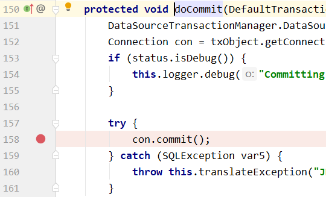

**回滚事务的方法**


#### 实验三 事务属性：只读readOnly

**1.介绍**

对一个查询操作来说，如果我们把它设置成只读，就能够明确告诉数据库，这个操作不涉及写操作。这样数据库就能够针对查询操作来进行优化。

**2.设置方式**

```java
// readOnly = true把当前事务设置为只读
@Transactional(readOnly = true)
public String getEmpName(Integer empId) {
      
    return empDao.selectEmpNameById(empId);
}
```

**3.针对增删改操作设置只读**

会抛出下面异常：

> Caused by: java.sql.SQLException: Connection is read-only. Queries leading to data modification are not allowed

**4.@Transactional注解放在类上**

**生效原则**

如果一个类中每一个方法上都使用了@Transactional注解，那么就可以将@Transactional注解提取到类上。反过来说：@Transactional注解在类级别标记，会影响到类中的每一个方法。同时，类级别标记的@Transactional注解中设置的事务属性也会延续影响到方法执行时的事务属性。除非在方法上又设置了@Transactional注解。

对一个方法来说，离它最近的@Transactional注解中的事务属性设置生效。

**用法举例**

在类级别@Transactional注解中设置只读，这样类中所有的查询方法都不需要设置@Transactional注解了。因为对查询操作来说，其他属性通常不需要设置，所以使用公共设置即可。

然后在这个基础上，对增删改方法设置@Transactional注解 readOnly 属性为 false。

```java
@Service
@Transactional(readOnly = true)
public class EmpService {
    
    // 为了便于核对数据库操作结果，不要修改同一条记录
    @Transactional(readOnly = false)
    public void updateTwice(……) {
		……
    }
    
    // readOnly = true把当前事务设置为只读
    // @Transactional(readOnly = true)
    public String getEmpName(Integer empId) {
		……
    }
    
}
```

> PS：Spring 环境下很多场合都有类似设定，一个注解如果标记了类的每一个方法那么通常就可以提取到类级别。

#### 实验四 事务属性：超时timeout

**1.需求**

事务在执行过程中，有可能因为遇到某些问题，导致程序卡住，从而长时间占用数据库资源。而长时间占用资源，大概率是因为程序运行出现了问题（可能是Java程序或MySQL数据库或网络连接等等）。

此时这个很可能出问题的程序应该被回滚，撤销它已做的操作，事务结束，把资源让出来，让其他正常程序可以执行。

概括来说就是一句话：超时回滚，释放资源。

**2.设置**

**@Transactional注解中的设置属性timeout**

```java
@Transactional(readOnly = false, timeout = 3)
public void updateTwice(
        // 修改员工姓名的一组参数
        Integer empId4EditName, String newName,

        // 修改员工工资的一组参数
        Integer empId4EditSalary, Double newSalary
        ) {

    // 为了测试事务是否生效，执行两个数据库操作，看它们是否会在某一个失败时一起回滚
    empDao.updateEmpNameById(empId4EditName, newName);

    empDao.updateEmpSalaryById(empId4EditSalary, newSalary);

}
```

**Dao方法中让线程睡眠**

```java
public void updateEmpSalaryById(Integer empId, Double salary) {

    try {
        TimeUnit.SECONDS.sleep(5);
    } catch (InterruptedException e) {
        e.printStackTrace();
    }

    // 为了看到操作失败后的效果人为将 SQL 语句破坏
    String sql = "update t_emp set emp_salary=? where emp_id=?";
    jdbcTemplate.update(sql, salary, empId);
}
```

> PS：注意：sleep操作如果放在执行 SQL 语句后面那就不起作用。

**执行效果**

执行过程中日志和抛出异常的情况：

> [16:25:41.706] [DEBUG] [main] [org.springframework.jdbc.datasource.DataSourceTransactionManager] [Initiating transaction rollback]
> [16:25:41.706] [DEBUG] [main] [org.springframework.jdbc.datasource.DataSourceTransactionManager] [Rolling back JDBC transaction on Connection [com.mysql.jdbc.JDBC4Connection@53b7f657]]
> [16:25:41.709] [DEBUG] [main] [org.springframework.jdbc.datasource.DataSourceTransactionManager] [Releasing JDBC Connection [com.mysql.jdbc.JDBC4Connection@53b7f657] after transaction]
>
> org.springframework.transaction.<span style="color:blue;font-weight:bold;">TransactionTimedOutException</span>: Transaction timed out: deadline was Fri Jun 04 16:25:39 CST 2021

#### 实验五 事务属性：需要回滚和不需要回滚的异常

**1.默认情况**

默认只针对运行时异常回滚，编译时异常不回滚。情景模拟代码如下：

```java
public void updateEmpSalaryById(Integer empId, Double salary) throws FileNotFoundException {
    
	// 为了看到操作失败后的效果人为将 SQL 语句破坏
	String sql = "update t_emp set emp_salary=? where emp_id=?";
	jdbcTemplate.update(sql, salary, empId);
    
//  抛出编译时异常测试是否回滚
	new FileInputStream("aaaa.aaa");
    
//  抛出运行时异常测试是否回滚
//  System.out.println(10 / 0);
}
```

默认情况是以下两个异常情况的前提条件，即设置异常都是在默认情况条件下而设置的；

**2.设置需要回滚的异常**

- rollbackFor属性：需要设置一个Class类型的对象

  ```java
  @Transactional(rollbackFor = Exception.class)
  ```

- rollbackForClassName属性：需要设置一个字符串类型的全类名

  ```java
  @Transactional(rollbackForClassName = “java.lang.Exception”)
  ```

**3.设置不需要不回滚的异常**

在默认设置和已有设置的基础上，再指定一个异常类型，碰到它不回滚。

```java
@Transactional(
    noRollbackFor = FileNotFoundException.class
)
//或者
@Transactional(
    norollbackForClassName = “java.io.FileNotFoundException”
)
```

**4.需要回滚异常和不需要回滚异常同时设置**

**范围不同**

不管是哪个设置范围大，都是在大范围内在排除小范围的设定。例如：

- rollbackFor = Exception.class
- noRollbackFor = FileNotFoundException.class

意思是除了 FileNotFoundException 之外，其他所有 Exception 范围的异常都回滚；但是碰到 FileNotFoundException 不回滚。

**范围一致**

回滚和不回滚的异常设置了相同范围（这是有多想不开）：

- noRollbackFor = FileNotFoundException.class
- rollbackFor = FileNotFoundException.class

此时 Spring 采纳了 rollbackFor 属性的设定：遇到 FileNotFoundException 异常会回滚。

#### 实验六 事务属性：事务隔离级别isolation

**1.事务隔离级别的简述**

**事务存在隔离性，发生于并发访问时；**

**并发的定义：**在同一时刻，有多个客户端在操作同一张表；

**一些问题的解释：**

- 脏读：当多个事务并发时，其中一些事务会读取到另一些事务未提交的数据操作；
- 不可重复读：就是不能重复的读取，一旦重复读取数据，数据的内容就会不一样；
- 幻读：在一个事务中，两次读到的数据记录的条数不一致；

**级别如下：**

1. **read uncommitted 读未提交**

   一个事务中读到了另一个事务并未提交的结果，这种隔离级别就会导致：脏读，不可重复读，幻读；

   **解决的问题：啥也解决不了；**

   

2. **read committed 读已提交** ==> 这就是 Oracle 的默认隔离级别

   一个事务能读到另一个事务已经提交的结果，但是不能读到另一个事务没有提交的结果；
   这种隔离级别解决了脏读问题，但是出现了不可重复读和幻读的问题；

   **解决的问题：脏读；**

   

3. **repeatable read 可重复读** ==>  这就是 MySQL 的默认隔离级别

   一个事务中可以重复的读，每一次读到的数据都是一样的，无论其他事务对数据进行怎么样的操作（添加数据，修改数据，提交数据），当前事务读到的数据内容都不会有变化；

   **解决的问题：脏读，不可重复读；**

   

4. **serlalize 串行化**  ==>  串行化

   最严格的隔离级别，取消了并发操作，只允许串行操作，即从允许多个事务同时操作数据库变成了每个时间段只允许一个事务操作数据库；

   **解决的问题：脏读，不可重复读，幻读；**

**2.视角需要提升**


**3.测试的准备工作**

**思路**


**EmpService中参与测试的方法**

```java
// readOnly = true把当前事务设置为只读
// @Transactional(readOnly = true)
public String getEmpName(Integer empId) {
    
    return empDao.selectEmpNameById(empId);
}
    
@Transactional(readOnly = false)
public void updateEmpName(Integer empId, String empName) {
    
    empDao.updateEmpNameById(empId, empName);
}
```

**junit中执行测试的方法**

```java
@Test
public void testTxReadOnly() {
    
    String empName = empService.getEmpName(3);
    
    System.out.println("empName = " + empName);
    
}

@Test
public void testIsolation() {
    
    Integer empId = 2;
    String empName = "aaaaaaaa";
    
    empService.updateEmpName(empId, empName);
    
}
```

**搞破坏**

为了让事务B（执行修改操作的事务）能够回滚，在EmpDao中的对应方法中人为抛出异常。

```java
public void updateEmpNameById(Integer empId, String empName) {
    String sql = "update t_emp set emp_name=? where emp_id=?";
    jdbcTemplate.update(sql, empName, empId);
    System.out.println(10 / 0);
}
```

**4.执行测试**

在 @Transactional 注解中使用 isolation 属性设置事务的隔离级别。 取值使用 org.springframework.transaction.annotation.Isolation 枚举类提供的数值。

**测试读未提交**

```java
@Transactional(isolation = Isolation.READ_UNCOMMITTED)
public String getEmpName(Integer empId) {
    
    return empDao.selectEmpNameById(empId);
}
    
@Transactional(isolation = Isolation.READ_UNCOMMITTED, readOnly = false)
public void updateEmpName(Integer empId, String empName) {
    
    empDao.updateEmpNameById(empId, empName);
}
```


测试结果：执行查询操作的事务读取了另一个尚未提交的修改。

**测试读已提交**

```java
@Transactional(isolation = Isolation.READ_COMMITTED)
public String getEmpName(Integer empId) {
    
    return empDao.selectEmpNameById(empId);
}
    
@Transactional(isolation = Isolation.READ_COMMITTED, readOnly = false)
public void updateEmpName(Integer empId, String empName) {
    
    empDao.updateEmpNameById(empId, empName);
}
```

测试结果：执行查询操作的事务读取的是数据库中正确的数据。

#### 实验七 事务属性：事务传播行为propagation

**1.事务传播行为要研究的问题**


**2.propagation属性**

**默认值**

@Transactional 注解通过 propagation 属性设置事务的传播行为。它的默认值是：

```java
Propagation propagation() default Propagation.REQUIRED;
```

**可选值说明**

propagation 属性的可选值由 org.springframework.transaction.annotation.Propagation 枚举类提供：

| 名称                                                         | 含义                                                         |
| ------------------------------------------------------------ | ------------------------------------------------------------ |
| REQUIRED<br />默认值                                         | 当前方法必须工作在事务中<br />如果当前线程上有已经开启的事务可用，那么就在这个事务中运行<br />如果当千纤草上没有已经开启的事务，那么就自己开启新事务，在新事务中运行<br />所以当前方法有可能和其他方法共用事务<br />在共用事务的情况下：当前方法会因为其他方法回滚而受连累 |
| <span style="color:blue;font-weight:bold;">REQUIRES_NEW</span><br />建议使用 | 当前方法必须工作在事务中<br />不管当前线程上是否有已经开启的事务，都要开启新事务<br />在新事务中运行<br />不会和其他方法共用事务，避免被其他方法连累 |

**3.测试**

**创建测试方法**

- 在EmpService中声明两个内层方法

  ```java
  @Transactional(readOnly = false, propagation = Propagation.REQUIRED)
  public void updateEmpNameInner(Integer empId, String empName) {
      
      empDao.updateEmpNameById(empId, empName);
  }
      
  @Transactional(readOnly = false, propagation = Propagation.REQUIRED)
  public void updateEmpSalaryInner(Integer empId, Double empSalary) {
      
      empDao.updateEmpSalaryById(empId, empSalary);
  }
  ```

- 创建TopService

  

  ```java
  @Service
  public class TopService {
      
      // 这里我们只是为了测试事务传播行为，临时在Service中装配另一个Service
      // 实际开发时非常不建议这么做，因为这样会严重破坏项目的结构
      @Autowired
      private EmpService empService;
      
      @Transactional
      public void topTxMethod() {
      
          // 在外层方法中调用两个内层方法
          empService.updateEmpNameInner(2, "aaa");
          
          empService.updateEmpSalaryInner(3, 666.66);
          
      }
      
  }
  ```

- junit测试方法

  ```java
  @Autowired
  private TopService topService;
      
  @Test
  public void testPropagation() {
      
      // 调用外层方法
      topService.topTxMethod();
      
  }
  ```

**测试 REQUIRED 模式**


效果：内层方法A、内层方法B所做的修改都没有生效，总事务回滚了。

**测试 REQUIRES_NEW 模式**

- 修改 EmpService 中内层方法

  ```java
  @Transactional(readOnly = false, propagation = Propagation.REQUIRES_NEW)
  public void updateEmpNameInner(Integer empId, String empName) {
      
      empDao.updateEmpNameById(empId, empName);
  }
      
  @Transactional(readOnly = false, propagation = Propagation.REQUIRES_NEW)
  public void updateEmpSalaryInner(Integer empId, Double empSalary) {
      
      empDao.updateEmpSalaryById(empId, empSalary);
  }
  ```

- 执行流程

  

**4.实际开发情景**

**Service方法应用了通知**


**过滤器或拦截器等类似组件**


**升华**

我们在事务传播行为这里，使用 REQUIRES_NEW 属性，也可以说是让不同事务方法从事务的使用上<span style="color:blue;font-weight:bold;">解耦合</span>，不要互相影响。

### 基于XML的声明式事务

**1.加入依赖**

相比于基于注解的声明式事务，基于 XML 的声明式事务需要一个额外的依赖：

```xml
<dependency>
    <groupId>org.springframework</groupId>
    <artifactId>spring-aspects</artifactId>
    <version>5.3.1</version>
</dependency>
```

**2.迁移代码**

将上一个基于注解的 module 中的代码转移到新module。去掉 @Transactional 注解。

**3.修改 Spring 配置文件**

去掉 tx:annotation-driven 标签，然后加入下面的配置：

```xml
<aop:config>
    <!-- 配置切入点表达式，将事务功能定位到具体方法上 -->
    <aop:pointcut id="txPoincut" expression="execution(* *..*Service.*(..))"/>
    
    <!-- 将事务通知和切入点表达式关联起来 -->
    <aop:advisor advice-ref="txAdvice" pointcut-ref="txPoincut"/>
    
</aop:config>
    
<!-- tx:advice标签：配置事务通知 -->
<!-- id属性：给事务通知标签设置唯一标识，便于引用 -->
<!-- transaction-manager属性：关联事务管理器 -->
<tx:advice id="txAdvice" transaction-manager="transactionManager">
    <tx:attributes>
    
        <!-- tx:method标签：配置具体的事务方法 -->
        <!-- name属性：指定方法名，可以使用星号代表多个字符 -->
        <tx:method name="get*" read-only="true"/>
        <tx:method name="query*" read-only="true"/>
        <tx:method name="find*" read-only="true"/>
    
        <!-- read-only属性：设置只读属性 -->
        <!-- rollback-for属性：设置回滚的异常 -->
        <!-- no-rollback-for属性：设置不回滚的异常 -->
        <!-- isolation属性：设置事务的隔离级别 -->
        <!-- timeout属性：设置事务的超时属性 -->
        <!-- propagation属性：设置事务的传播行为 -->
        <tx:method name="save*" read-only="false" rollback-for="java.lang.Exception" propagation="REQUIRES_NEW"/>
        <tx:method name="update*" read-only="false" rollback-for="java.lang.Exception" propagation="REQUIRES_NEW"/>
        <tx:method name="delete*" read-only="false" rollback-for="java.lang.Exception" propagation="REQUIRES_NEW"/>
    </tx:attributes>
</tx:advice>
```

**4.注意**

即使需要事务功能的目标方法已经被切入点表达式涵盖到了，但是如果没有给它配置事务属性，那么这个方法就还是没有事务。所以事务属性必须配置。

## 3.7.Spring5新特性

### JSR305标准相关注解

Spring Framework 从 2017 年 9 月推出了 5.0.0 正式版，在原来 4 版本基础上做出了大量新的改进。整个 Spring5 框架的代码<span style="color:blue;font-weight:bold;">基于 Java 8</span>，运行时<span style="color:blue;font-weight:bold;">兼容 JDK 9</span>，许多不建议使用的类和方法在代码库中删除。

#### 从JSR说起

**1.JCP**

JCP（Java Community Process) 是一个由SUN公司发起的，开放的国际组织。主要由Java开发者以及被授权者组成，负责Java技术规范维护，Java技术发展和更新。

JCP官网地址：https://jcp.org/en/home/index


**2.JSR**

JSR 的全称是：Java Specification Request，意思是 Java 规范提案。谁向谁提案呢？任何人都可以向 JCP (Java Community Process) 提出新增一个标准化技术规范的正式请求。JSR已成为Java界的一个重要标准。登录[ JCP 官网](https://jcp.org/en/home/index)可以查看[所有 JSR 标准](https://jcp.org/en/jsr/all)。

#### JSR 305

JSR 305: Annotations for Software Defect Detection

This JSR will work to develop standard annotations (such as @NonNull) that can be applied to Java programs to assist tools that detect software defects.

主要功能：使用注解（例如@NonNull等等）协助开发者侦测软件缺陷。


Spring 从 5.0 版本开始支持了 JSR 305 规范中涉及到的相关注解。

```java
package org.springframework.lang;

import java.lang.annotation.Documented;
import java.lang.annotation.ElementType;
import java.lang.annotation.Retention;
import java.lang.annotation.RetentionPolicy;
import java.lang.annotation.Target;

import javax.annotation.Nonnull;
import javax.annotation.meta.TypeQualifierNickname;

/**
 * A common Spring annotation to declare that annotated elements cannot be {@code null}.
 *
 * <p>Leverages JSR-305 meta-annotations to indicate nullability in Java to common
 * tools with JSR-305 support and used by Kotlin to infer nullability of Spring API.
 *
 * <p>Should be used at parameter, return value, and field level. Method overrides should
 * repeat parent {@code @NonNull} annotations unless they behave differently.
 *
 * <p>Use {@code @NonNullApi} (scope = parameters + return values) and/or {@code @NonNullFields}
 * (scope = fields) to set the default behavior to non-nullable in order to avoid annotating
 * your whole codebase with {@code @NonNull}.
 *
 * @author Sebastien Deleuze
 * @author Juergen Hoeller
 * @since 5.0
 * @see NonNullApi
 * @see NonNullFields
 * @see Nullable
 */
@Target({ElementType.METHOD, ElementType.PARAMETER, ElementType.FIELD})
@Retention(RetentionPolicy.RUNTIME)
@Documented
@Nonnull
@TypeQualifierNickname
public @interface NonNull {
}
```

#### 相关注解

| 注解名称       | 含义                     | 可标记位置                                                   |
| -------------- | ------------------------ | ------------------------------------------------------------ |
| @Nullable      | 可以为空                 | @Target({ElementType.<span style="color:blue;font-weight:bold;">METHOD</span>, ElementType.<span style="color:blue;font-weight:bold;">PARAMETER</span>, ElementType.<span style="color:blue;font-weight:bold;">FIELD</span>}) |
| @NonNull       | 不应为空                 | @Target({ElementType.<span style="color:blue;font-weight:bold;">METHOD</span>, ElementType.<span style="color:blue;font-weight:bold;">PARAMETER</span>, ElementType.<span style="color:blue;font-weight:bold;">FIELD</span>}) |
| @NonNullFields | 在特定包下的字段不应为空 | @Target(ElementType.<span style="color:blue;font-weight:bold;">PACKAGE</span>)<br />@TypeQualifierDefault(ElementType.<span style="color:blue;font-weight:bold;">FIELD</span>) |
| @NonNullApi    | 参数和方法返回值不应为空 | @Target(ElementType.<span style="color:blue;font-weight:bold;">PACKAGE</span>)<br />@TypeQualifierDefault({ElementType.<span style="color:blue;font-weight:bold;">METHOD</span>, ElementType.<span style="color:blue;font-weight:bold;">PARAMETER</span>}) |

### 整合junit5

#### 导入依赖

在原有环境基础上增加如下依赖：

```xml
<dependency>
    <groupId>org.junit.jupiter</groupId>
    <artifactId>junit-jupiter-api</artifactId>
    <version>5.7.0</version>
    <scope>test</scope>
</dependency>
<dependency>
    <groupId>org.springframework</groupId>
    <artifactId>spring-test</artifactId>
    <version>5.3.1</version>
</dependency>
```

**使用Junit5之前必要的一些操作：**

- 每个mapper接口上需要添加上@Mapper注解；
- 在spring配置文件中需要添加扫描上面注解的配置语句；

#### 创建测试类

- @ExtendWith(SpringExtension.class) 表示使用 Spring 提供的扩展功能。
- @ContextConfiguration(value = {"classpath:spring-context.xml"}) 还是用来指定 Spring 配置文件位置，和整合 junit4 一样。

```java
@ExtendWith(SpringExtension.class)
@ContextConfiguration(value = {"classpath:spring-context.xml"})
public class Junit5IntegrationTest {
    
    @Autowired
    private EmpDao empDao;
    
    @Test
    public void testJunit5() {
        System.out.println("empDao = " + empDao);
    }
    
}
```

#### 使用复合注解

@SpringJUnitConfig 注解综合了前面两个注解的功能，此时指定 Spring 配置文件位置即可。但是注意此时需要使用 locations 属性，不是 value 属性了。

```java
@SpringJUnitConfig(locations = {"classpath:spring-context.xml"})
public class Junit5IntegrationTest {
    
    @Autowired
    private EmpDao empDao;
    
    @Test
    public void testJunit5() {
        System.out.println("empDao = " + empDao);
    }
    
}
```

## 3.8.大纲总结


# 4.SpringMVC

## 4.1.SpringMVC概述

### SpringMVC 优势

SpringMVC 是 Spring 为表述层开发提供的一整套完备的解决方案。在表述层框架历经 Strust、WebWork、Strust2 等诸多产品的历代更迭之后，目前业界普遍选择了 SpringMVC 作为 Java EE 项目表述层开发的<span style="color:blue;font-weight:bold;">首选方案</span>。之所以能做到这一点，是因为 SpringMVC 具备如下显著优势：

- <span style="color:blue;font-weight:bold;">Spring 家族原生产品</span>，与 IOC 容器等基础设施无缝对接
- 表述层各细分领域需要解决的问题<span style="color:blue;font-weight:bold;">全方位覆盖</span>，提供<span style="color:blue;font-weight:bold;">全面解决方案</span>
- <span style="color:blue;font-weight:bold;">代码清新简洁</span>，大幅度提升开发效率
- 内部组件化程度高，可插拔式组件<span style="color:blue;font-weight:bold;">即插即用</span>，想要什么功能配置相应组件即可
- <span style="color:blue;font-weight:bold;">性能卓著</span>，尤其适合现代大型、超大型互联网项目要求

### 表述层框架要解决的基本问题

- 请求映射
- 数据输入
- 视图界面
- 请求分发
- 表单回显
- 会话控制
- 过滤拦截
- 异步交互
- 文件上传
- 文件下载
- 数据校验
- 类型转换

### SpringMVC 代码对比

#### 基于原生 Servlet API 开发代码片段

```java
protected void doGet(HttpServletRequest request, HttpServletResponse response) throws ServletException, IOException {   
    
    String userName = request.getParameter("userName");
    
    System.out.println("userName="+userName);
    
}
```

#### 基于 SpringMVC 开发代码片段

```java
@RequestMapping("/user/login")
public String login(@RequestParam("userName") String userName){
    
    System.out.println("userName="+userName);
    
    return "result";
}
```

## 4.2.HelloWorld

### 功能需求

**1.访问首页**


**2.在首页点超链接**


### 搭建环境

**1.导入依赖**

```xml
<dependencies>
    <!-- SpringMVC -->
    <dependency>
        <groupId>org.springframework</groupId>
        <artifactId>spring-webmvc</artifactId>
        <version>5.3.1</version>
    </dependency>
    
    <!-- 日志 -->
    <dependency>
        <groupId>ch.qos.logback</groupId>
        <artifactId>logback-classic</artifactId>
        <version>1.2.3</version>
    </dependency>
    
    <!-- ServletAPI -->
    <dependency>
        <groupId>javax.servlet</groupId>
        <artifactId>javax.servlet-api</artifactId>
        <version>3.1.0</version>
        <scope>provided</scope>
    </dependency>
    
    <!-- Spring5和Thymeleaf整合包 -->
    <dependency>
        <groupId>org.thymeleaf</groupId>
        <artifactId>thymeleaf-spring5</artifactId>
        <version>3.0.12.RELEASE</version>
    </dependency>
</dependencies>
```

由于 Maven 的传递性，我们不必将所有需要的包全部配置依赖，而是配置最顶端的依赖，其他靠传递性导入。


**2.日志配置文件**

```xml
<?xml version="1.0" encoding="UTF-8"?>
<configuration debug="true">
    <!-- 指定日志输出的位置 -->
    <appender name="STDOUT"
              class="ch.qos.logback.core.ConsoleAppender">
        <encoder>
            <!-- 日志输出的格式 -->
            <!-- 按照顺序分别是：时间、日志级别、线程名称、打印日志的类、日志主体内容、换行 -->
            <pattern>[%d{HH:mm:ss.SSS}] [%-5level] [%thread] [%logger] [%msg]%n</pattern>
        </encoder>
    </appender>
    
    <!-- 设置全局日志级别。日志级别按顺序分别是：DEBUG、INFO、WARN、ERROR -->
    <!-- 指定任何一个日志级别都只打印当前级别和后面级别的日志。 -->
    <root level="INFO">
        <!-- 指定打印日志的appender，这里通过“STDOUT”引用了前面配置的appender -->
        <appender-ref ref="STDOUT" />
    </root>
    
    <!-- 根据特殊需求指定局部日志级别 -->
    <logger name="org.springframework.web.servlet.DispatcherServlet" level="DEBUG" />
    
</configuration>
```

**3.web.xml**

```xml
<!-- 配置SpringMVC中负责处理请求的核心Servlet，也被称为SpringMVC的前端控制器 -->
<servlet>
    <servlet-name>DispatcherServlet</servlet-name>
    
    <!-- DispatcherServlet的全类名 -->
    <servlet-class>org.springframework.web.servlet.DispatcherServlet</servlet-class>
    
    <!-- 通过初始化参数指定SpringMVC配置文件位置 -->
    <init-param>
    
        <!-- 如果不记得contextConfigLocation配置项的名称，可以到DispatcherServlet的父类FrameworkServlet中查找 -->
        <param-name>contextConfigLocation</param-name>
    
        <!-- 使用classpath:说明这个路径从类路径的根目录开始才查找 -->
        <param-value>classpath:spring-mvc.xml</param-value>
    </init-param>
    
    <!-- 作为框架的核心组件，在启动过程中有大量的初始化操作要做，这些操作放在第一次请求时才执行非常不恰当 -->
    <!-- 我们应该将DispatcherServlet设置为随Web应用一起启动 -->
    <load-on-startup>1</load-on-startup>
    
</servlet>
    
<servlet-mapping>
    <servlet-name>DispatcherServlet</servlet-name>
    
    <!-- 对DispatcherServlet来说，url-pattern有两种方式配置 -->
    <!-- 方式一：配置“/”，表示匹配整个Web应用范围内所有请求。这里有一个硬性规定：不能写成“/*”。只有这一个地方有这个特殊要求，以后我们再配置Filter还是可以正常写“/*”。 -->
    <!-- 方式二：配置“*.扩展名”，表示匹配整个Web应用范围内部分请求 -->
    <url-pattern>/</url-pattern>
</servlet-mapping>
```

**4.Spring配置文件**

```xml
<!-- 自动扫描包 -->
<context:component-scan base-package="com.atguigu.mvc.handler"/>
    
<!-- Thymeleaf视图解析器 -->
<bean id="viewResolver" class="org.thymeleaf.spring5.view.ThymeleafViewResolver">
    <property name="order" value="1"/>
    <property name="characterEncoding" value="UTF-8"/>
    <property name="templateEngine">
        <bean class="org.thymeleaf.spring5.SpringTemplateEngine">
            <property name="templateResolver">
                <bean class="org.thymeleaf.spring5.templateresolver.SpringResourceTemplateResolver">
    				<!-- 物理视图=视图前缀+逻辑视图+视图后缀 -->
                    <!-- prefix属性：视图前缀 -->
                    <property name="prefix" value="/WEB-INF/templates/"/>
    
                    <!-- suffix属性：视图后缀 -->
                    <property name="suffix" value=".html"/>
                    
                    <property name="templateMode" value="HTML5"/>
                    <property name="characterEncoding" value="UTF-8" />
                </bean>
            </property>
        </bean>
    </property>
</bean>
```

### 代码实现

**1.创建请求处理器类**

**名称**

SpringMVC 对处理请求的类并没有特殊要求，只要是 POJO （普通的 Java 类）即可。我们自己习惯上有两种命名方式：

- XxxHandler：意思是 Xxx 处理器的意思
- XxxController：意思是 Xxx 控制器的意思

这只是一个命名的习惯，不是语法要求。所以往往把处理请求的类叫做『Handler类』，处理请求的方法叫做『Handler方法』。

**创建**


```java
@Controller
public class Demo01HelloHandler {
    
    
    
}
```

**2.实现访问首页**

**创建 handler 方法**

```java
@Controller
public class Demo01HelloHandler {

    // @RequestMapping注解在请求地址和Java方法之间建立映射关系
    // return返回的字符串会被直接拿来作为逻辑视图的名称去拼接前后缀
    // 这里就表示为前端访问index.html时，方法跳转到"前缀+portal+后缀"这个页面来
    // 显然index.html是默认的网页欢迎界面，所以一旦打开网页就执行这个方法
    @RequestMapping("/")
    public String showPortal() {
        return "portal";
    }

}
```

**在首页编写超链接**


```html
<!DOCTYPE html>
<html lang="en" xmlns:th="http://www.thymeleaf.org">
<head>
    <meta charset="UTF-8">
    <title>首页</title>
</head>
<body>
    
    <h1>首页</h1>
    
    <!-- 以后我们会越来越倾向于用一句话来作为请求的URL地址，在这样的一句话中使用“/”分隔各个单词 -->
    <!-- say hello to spring mvc -->
    <!-- /say/hello/to/spring/mvc -->
    <a th:href="@{/say/hello/to/spring/mvc}">HelloWorld</a><br/>
    
</body>
</html>
```

**3.实现点击超链接**

**加入日志记录仪**

在 handler 类中声明一个成员变量：

```java
private Logger logger = LoggerFactory.getLogger(this.getClass());
```

- Logger：org.slf4j.Logger
- LoggerFactory：org.slf4j.LoggerFactory

使用日志而不是 sysout 的方式在控制台打印，好处在于：根据日志的级别可以非常方便的控制某些日志是否打印。

不管 sysout 还是日志，只要是在控制台打印数据，底层都是 I/O 操作。在项目中，访问数据库和 I/O 都是典型的高消耗型的操作。

在控制台打印的数据，用户看不到，打印它肯定是为了调试程序等类似需求。所以在项目上线的时候，用于调试程序的控制台打印都应该去掉。

如果我们是通过 sysout 方式打印，那么它们会分散在项目中的各个地方，想要通过手动方式删除会很繁琐也可能会有遗漏。

而使用日志的方式，只要在配置文件中修改一下日志级别，就能全面控制某个级别的日志打印或者不打印。

而且日志框架通常都能够指定日志保存的位置，如果有需要可以将日志数据保存到数据库等位置。

**声明 handler 方法**

```java
// 以后我们会越来越倾向于用一句话来作为请求的URL地址
// 在这样的一句话中使用“/”分隔各个单词
@RequestMapping("/say/hello/to/spring/mvc")
public String sayHello() {
    
    // 方法内部打印日志，证明 SpringMVC 确实调用了这个方法来处理请求
    logger.debug("我是 SpringMVC 的 Hello world。");
    
    return "target";
}
```

**创建目标页面**


```html
<!DOCTYPE html>
<html lang="en" xmlns:th="http://www.thymeleaf.org">
<head>
    <meta charset="UTF-8">
    <title>目标页面</title>
</head>
<body>
    
    <h1>目标页面</h1>
    
    <a th:href="@{/}">回首页</a>
    
</body>
</html>
```

**4.整体流程解析**


## 4.3.@RequestMapping注解

从注解名称上我们可以看到，@RequestMapping注解的作用就是将请求的 URL 地址和处理请求的方式关联起来，建立映射关系。

SpringMVC 接收到指定的请求，就会来找到在映射关系中对应的方法来处理这个请求。

### 匹配方式说明

**1.精确匹配**

在@RequestMapping注解指定 URL 地址时，不使用任何通配符，按照请求地方进行精确匹配。

```html
<a th:href="@{/say/hello/to/spring/mvc}">HelloWorld</a><br/>
```

```java
@RequestMapping("/say/hello/to/spring/mvc")
```

**2.模糊匹配**

在@RequestMapping注解指定 URL 地址时，通过使用通配符，匹配多个类似的地址。

```html
<h3>测试@RequestMapping注解匹配方式</h3>
<a th:href="@{/fruit/apple}">@RequestMapping模糊匹配[apple]</a><br/>
<a th:href="@{/fruit/orange}">@RequestMapping模糊匹配[orange]</a><br/>
<a th:href="@{/fruit/banana}">@RequestMapping模糊匹配[banana]</a><br/>
```

```java
@RequestMapping("/fruit/*")
```

### 在类级别标记

**1.超链接的HTML标签**

```html
<h3>测试@RequestMapping注解标记在类上</h3>
<a th:href="@{/user/login}">用户登录</a><br/>
<a th:href="@{/user/register}">用户注册</a><br/>
<a th:href="@{/user/logout}">用户退出</a><br/>
```

**2.仅标记在方法上的@RequestMapping注解**

```java
@RequestMapping("/user/login")
@RequestMapping("/user/register")
@RequestMapping("/user/logout")
```

**3.分别标记在类和方法上的@RequestMapping注解**

在类级别：抽取各个方法上@RequestMapping注解地址中前面重复的部分

```java
@RequestMapping("/user")
```

在方法级别：省略被类级别抽取的部分

```java
@RequestMapping("/login")
@RequestMapping("/register")
@RequestMapping("/logout")
```

### 附加请求方式要求

**1.请求方式**

HTTP 协议定义了八种请求方式，在 SpringMVC 中封装到了下面这个枚举类：

```java
public enum RequestMethod {

	GET, HEAD, POST, PUT, PATCH, DELETE, OPTIONS, TRACE

}
```

==REST 语法（以后会学习）建议使用四种请求方式分别对应增删改查，即：PUT增，DELETE删，POST改，GET查；==

**2.@RequestMapping附加请求方式**

前面代码中，只要求请求地址匹配即可，现在附加了请求方式后，还要求请求方式也必须匹配才可以。

**HTML代码**

```html
<h3>测试@RequestMapping注解限定请求方式</h3>
<a th:href="@{/emp}">同地址GET请求</a><br/>
<form th:action="@{/emp}" method="post">
    <button type="submit">同地址POST请求</button>
</form>
<br/>
```

**handler方法**

处理 GET 请求：

```java
@RequestMapping(value = "/emp", method = RequestMethod.GET)
public String empGet() {
    
    logger.debug("GET 请求");
    
    return "target";
}
```

处理 POST 请求：

```java
@RequestMapping(value = "/emp", method = RequestMethod.POST)
public String empPost() {
    
    logger.debug("POST 请求");
    
    return "target";
}
```

**3.进阶版**

| 原版                                                         | 进阶版               |
| ------------------------------------------------------------ | -------------------- |
| @RequestMapping(value = "/emp", <br />method = RequestMethod.GET) | @GetMapping("/emp")  |
| @RequestMapping(value = "/emp", <br />method = RequestMethod.POST) | @PostMapping("/emp") |

除了 @GetMapping、@PostMapping 还有下面几个类似的注解：

- @see PutMapping
- @see DeleteMapping
- @see PatchMapping

另外需要注意：进阶版的这几个注解是从 4.3 版本才开始有，低于 4.3 版本无法使用。

### Ambiguous mapping异常

出现原因：多个 handler 方法映射了同一个地址，导致 SpringMVC 在接收到这个地址的请求时该找哪个 handler 方法处理。

> Caused by: java.lang.IllegalStateException: Ambiguous mapping. Cannot map 'demo03MappingMethodHandler' method 
> com.atguigu.mvc.handler.Demo03MappingMethodHandler#empPost()
> to { [/emp]}: <span style="color:blue;font-weight:bold;">There is already</span> 'demo03MappingMethodHandler' bean method
> com.atguigu.mvc.handler.Demo03MappingMethodHandler#empGet() <span style="color:blue;font-weight:bold;">mapped</span>.

## 4.4.获取请求参数

### 一名一值

**1.超链接**

```html
<a th:href="@{/param/one/name/one/value(userName='tom')}">一个名字一个值的情况</a><br/>
```

**2.@RequestParam注解**

**最基本的用法**

```java
@RequestMapping("/param/one/name/one/value")
public String oneNameOneValue(
        // 使用@RequestParam注解标记handler方法的形参
        // SpringMVC 会将获取到的请求参数从形参位置给我们传进来
        @RequestParam("userName") String userName
) {
    
    logger.debug("获取到请求参数：" + userName);
    
    return "target";
}
```

**@RequestParam注解省略的情况**

```java
@RequestMapping("/param/one/name/one/value")
public String oneNameOneValue(
        // 当请求参数名和形参名一致，可以省略@RequestParam("userName")注解
        // 但是，省略后代码可读性下降而且将来在SpringCloud中不能省略，所以建议还是不要省略
        String userName
) {
    
    logger.debug("★获取到请求参数：" + userName);
    
    return "target";
}
```

**必须的参数没有提供**


页面信息说明：

- ==响应状态码：400（在 SpringMVC 环境下，400通常和数据注入相关）==
- 说明信息：必需的 String 请求参数 'userName' 不存在

原因可以参考 @RequestParam 注解的 required 属性：默认值为true，表示请求参数默认必须提供；

```java
/**
 * Whether the parameter is required.
 * <p>Defaults to {@code true}, leading to an exception being thrown
 * if the parameter is missing in the request. Switch this to
 * {@code false} if you prefer a {@code null} value if the parameter is
 * not present in the request.
 * <p>Alternatively, provide a {@link #defaultValue}, which implicitly
 * sets this flag to {@code false}.
 */
boolean required() default true;
```

**关闭请求参数必需**

required 属性设置为 false 表示这个请求参数可有可无：

```java
@RequestParam(value = "userName", required = false)
```

**给请求参数设置默认值**

使用 defaultValue 属性给请求参数设置默认值：

```java
@RequestParam(value = "userName", required = false, defaultValue = "missing")
```

此时 required 属性可以继续保持默认值：

```java
@RequestParam(value = "userName", defaultValue = "missing")
```

### 一名多值

**1.表单**

```html
<form th:action="@{/param/one/name/multi/value}" method="post">
    请选择你最喜欢的球队：
    <input type="checkbox" name="team" value="Brazil"/>巴西
    <input type="checkbox" name="team" value="German"/>德国
    <input type="checkbox" name="team" value="French"/>法国
    <input type="checkbox" name="team" value="Holland"/>荷兰
    <input type="checkbox" name="team" value="Italian"/>意大利
    <input type="checkbox" name="team" value="China"/>中国
    <br/>
    <input type="submit" value="保存"/>
</form>
```

**2.handler方法**

```java
@RequestMapping("/param/one/name/multi/value")
public String oneNameMultiValue(
    
        // 在服务器端 handler 方法中，使用一个能够存储多个数据的容器就能接收一个名字对应的多个值请求参数
        @RequestParam("team") List<String> teamList
        ) {
    
    for (String team : teamList) {
        logger.debug("team = " + team);
    }
    
    return "target";
}
```

### 表单对应模型

**1.表单**

```html
<form th:action="@{/param/form/to/entity}" method="post">
    姓名：<input type="text" name="empName"/><br/>
    年龄：<input type="text" name="empAge"/><br/>
    工资：<input type="text" name="empSalary"/><br/>
    <input type="submit" value="保存"/>
</form>
```

**2.实体类**

```java
public class Employee {
    
    private Integer empId;
    private String empName;
    private int empAge;
    private double empSalary;
    ……
```

**3.handler方法**

```java
@RequestMapping("/param/form/to/entity")
public String formToEntity(
    
        // SpringMVC 会自动调用实体类中的 setXxx() 注入请求参数
        Employee employee) {
    
    logger.debug(employee.toString());
    
    return "target";
}
```

**4.POST请求的字符乱码问题**

到 web.xml 中配置 CharacterEncodingFilter 即可：

```xml
<!-- 配置过滤器解决 POST 请求的字符乱码问题 -->
<filter>
    <filter-name>CharacterEncodingFilter</filter-name>
    <filter-class>org.springframework.web.filter.CharacterEncodingFilter</filter-class>
    
    <!-- encoding参数指定要使用的字符集名称 -->
    <init-param>
        <param-name>encoding</param-name>
        <param-value>UTF-8</param-value>
    </init-param>
    
    <!-- 请求强制编码 -->
    <init-param>
        <param-name>forceRequestEncoding</param-name>
        <param-value>true</param-value>
    </init-param>
        
    <!-- 响应强制编码 -->
    <init-param>
        <param-name>forceResponseEncoding</param-name>
        <param-value>true</param-value>
    </init-param>
</filter>
<filter-mapping>
    <filter-name>CharacterEncodingFilter</filter-name>
    <url-pattern>/*</url-pattern>
</filter-mapping>
```

注1：在较低版本的 SpringMVC 中，forceRequestEncoding 属性、forceResponseEncoding 属性没有分开，它们是一个 forceEncoding 属性。这里需要注意一下。

注2：由于 CharacterEncodingFilter 是通过 request.setCharacterEncoding(encoding); 来设置请求字符集，所以在此操作前不能有任何的 request.getParameter() 操作。在设置字符集之前获取过请求参数，那么设置字符集的操作将无效。

### 表单对应实体类包含级联属性

**1.实体类**

```java
public class Student {
    
    private String stuName;
    private School school;
    private List<Subject> subjectList;
    private Subject[] subjectArray;
    private Set<Teacher> teacherSet;
    private Map<String, Double> scores;
    
    public Student() {
        //在各种常用数据类型中，只有Set类型需要提前初始化
        //并且要按照表单将要提交的对象数量进行初始化
        //Set类型使用非常不便，要尽可能避免使用Set
        teacherSet = new HashSet<Teacher>();
        teacherSet.add(new Teacher());
        teacherSet.add(new Teacher());
        teacherSet.add(new Teacher());
        teacherSet.add(new Teacher());
        teacherSet.add(new Teacher());
    }
    ……
```


```java
public class School {
    
    private String schoolName;
    ……
```


```java
public class Subject {
    
    private String subjectName;
    ……
```


```java
public class Teacher {
    
    private String teacherName;
    ……
```

**2.表单**

表单项中的 name 属性值必须严格按照级联对象的属性来设定：

```html
<!-- 提交数据的表单 -->
<form th:action="@{/param/form/to/nested/bean}" method="post">
    stuName：<input type="text" name="stuName" value="tom"/><br/>
    school.schoolName:<input type="text" name="school.schoolName" value="sharehome"/><br/>
    subjectList[0].subjectName:<input type="text" name="subjectList[0].subjectName" value="java"/><br/>
    subjectList[1].subjectName:<input type="text" name="subjectList[1].subjectName" value="php"/><br/>
    subjectList[2].subjectName:<input type="text" name="subjectList[2].subjectName" value="javascript"/><br/>
    subjectList[3].subjectName:<input type="text" name="subjectList[3].subjectName" value="css"/><br/>
    subjectList[4].subjectName:<input type="text" name="subjectList[4].subjectName" value="vue"/><br/>
    subjectArray[0].subjectName:<input type="text" name="subjectArray[0].subjectName" value="spring"/><br/>
    subjectArray[1].subjectName:<input type="text" name="subjectArray[1].subjectName" value="SpringMVC"/><br/>
    subjectArray[2].subjectName:<input type="text" name="subjectArray[2].subjectName" value="mybatis"/><br/>
    subjectArray[3].subjectName:<input type="text" name="subjectArray[3].subjectName" value="maven"/><br/>
    subjectArray[4].subjectName:<input type="text" name="subjectArray[4].subjectName" value="mysql"/><br/>
    tearcherSet[0].teacherName:<input type="text" name="tearcherSet[0].teacherName" value="t_one"/><br/>
    tearcherSet[1].teacherName:<input type="text" name="tearcherSet[1].teacherName" value="t_two"/><br/>
    tearcherSet[2].teacherName:<input type="text" name="tearcherSet[2].teacherName" value="t_three"/><br/>
    tearcherSet[3].teacherName:<input type="text" name="tearcherSet[3].teacherName" value="t_four"/><br/>
    tearcherSet[4].teacherName:<input type="text" name="tearcherSet[4].teacherName" value="t_five"/><br/>
    scores['Chinese']：<input type="text" name="scores['Chinese']" value="100"/><br/>
    scores['English']：<input type="text" name="scores['English']" value="95" /><br/>
    scores['Mathematics']：<input type="text" name="scores['Mathematics']" value="88"/><br/>
    scores['Chemistry']：<input type="text" name="scores['Chemistry']" value="63"/><br/>
    scores['Biology']：<input type="text" name="scores['Biology']" value="44"/><br/>
    <input type="submit" value="保存"/>
</form>
```

**3.handler方法**

```java
@RequestMapping("/param/form/to/nested/bean")
public String formToNestedEntity(
    
        // SpringMVC 自己懂得注入级联属性，只要属性名和对应的getXxx()、setXxx()匹配即可
        Student student) {
    
    logger.debug(student.toString());
    
    return "target";
}
```

### 要发送的数据是实体类 List

**1.额外封装一层**

```java
public class EmployeeParam {
    
    private List<Employee> employeeList;
    ……
```

**2.表单**

```html
直接发送 List&lt;Employee&gt;：<br/>
<form th:action="@{/param/list/emp}" method="post">
    1号员工姓名：<input type="text" name="employeeList[0].empName" /><br/>
    1号员工年龄：<input type="text" name="employeeList[0].empAge" /><br/>
    1号员工工资：<input type="text" name="employeeList[0].empSalary" /><br/>
    2号员工姓名：<input type="text" name="employeeList[1].empName" /><br/>
    2号员工年龄：<input type="text" name="employeeList[1].empAge" /><br/>
    2号员工工资：<input type="text" name="employeeList[1].empSalary" /><br/>
    <button type="submit">保存</button>
</form>
```

**3.handler方法**

```java
@RequestMapping("/param/list/emp")
public String saveEmpList(
        // SpringMVC 访问这里实体类的setEmployeeList()方法注入数据
        EmployeeParam employeeParam
) {
    
    List<Employee> employeeList = employeeParam.getEmployeeList();
    
    for (Employee employee : employeeList) {
        logger.debug(employee.toString());
    }
    
    return "target";
}
```

## 4.5.@RequestHeader注解

### 作用

通过这个注解获取请求消息头中的具体数据。

### 用法

```java
@RequestMapping("/request/header")
public String getRequestHeader(
    
        // 使用 @RequestHeader 注解获取请求消息头信息
        // name 或 value 属性：指定请求消息头名称
        // defaultValue 属性：设置默认值
        @RequestHeader(name = "Accept", defaultValue = "missing") String accept
) {
    
    logger.debug("accept = " +accept);
    
    return "target";
}
```

## 4.6.@CookieValue注解

### 作用

获取当前请求中的 Cookie 数据。

### 用法

```java
@RequestMapping("/request/cookie")
public String getCookie(
    
        // 使用 @CookieValue 注解获取指定名称的 Cookie 数据
        // name 或 value 属性：指定Cookie 名称
        // defaultValue 属性：设置默认值
        @CookieValue(value = "JSESSIONID", defaultValue = "missing") String cookieValue,
    
        // 形参位置声明 HttpSession 类型的参数即可获取 HttpSession 对象
        HttpSession session
) {
    
    logger.debug("cookieValue = " + cookieValue);
    
    return "target";
}
```

## 4.7.获取原生Servlet API对象

### 原生 Servlet API

- HttpServletRequest
- HttpServletResponse
- HttpSession
- ServletContext

原生：最原始的、本真的，没有经过任何的加工、包装和处理。

API：直接翻译过来是应用程序接口的意思。对我们来说，提到 API 这个词的时候，通常指的是在某个特定的领域，已经封装好可以直接使用的一套技术体系。很多时候，特定领域的技术规范都是对外暴露一组接口作为这个领域的技术标准，然后又在这个标准下有具体实现。

### 可以直接拿到的对象

**1.在 IDEA 中创建代码模板**

使用快捷键调出代码模板能够极大的提升开发效率


**1.测试获取三个可以直接得到的对象**

**创建超链接**


```html
<a th:href="@{/original/api/direct}">可以直接得到的三个</a><br/>
```

**声明 handler 方法**

```java
@RequestMapping("/original/api/direct")
public String getOriginalAPIDirect(
        
        // 有需要使用的 Servlet API 直接在形参位置声明即可。
        // 需要使用就写上，不用就不写，开发体验很好，这里给 SpringMVC 点赞
        HttpServletRequest request,
        HttpServletResponse response,
        HttpSession session
) {
    
    logger.debug(request.toString());
    logger.debug(response.toString());
    logger.debug(session.toString());
    
    return "target";
}
```

> ServletContext对象没法通过形参声明的方式直接获取，如果非要在形参位置声明ServletContext类型的变量，那么会抛出下面的异常：
>
> java.lang.IllegalStateException: No primary or single public constructor found for interface javax.servlet.ServletContext - and no default constructor found either

### 获取ServletContext

**1.方法一：通过HttpSession获取**

```java
@RequestMapping("/original/servlet/context/first/way")
public String originalServletContextFirstWay(HttpSession session) {
    
    // 获取ServletContext对象的方法一：通过HttpSession对象获取
    ServletContext servletContext = session.getServletContext();
    logger.debug(servletContext.toString());
    
    return "target";
}
```

**2.方法二：通过 IOC 容器注入**

```java
// 获取ServletContext对象的方法二：从 IOC 容器中直接注入
@Autowired
private ServletContext servletContext;
    
@RequestMapping("/original/servlet/context/second/way")
public String originalServletContextSecondWay() {
    
    logger.debug(this.servletContext.toString());
    
    return "target";
}
```

### 原生对象和 IOC 容器关系

==IOC容器、ServletContext之间看起来会存在toString方法循环引用的问题，但是这些都封装在了Spring中，架构师们自然而然就会想到一个类似的解决方法，比如ServletContext中toString方法仅仅存在一些关键要素，而不会涉及到IOC容器；==


## 4.8.属性域

### 在整个应用中属性域的重要作用


### 请求域操作方式（model）

**1.使用 Model 类型的形参**

```java
@RequestMapping("/attr/request/model")
public String testAttrRequestModel(
    
        // 在形参位置声明Model类型变量，用于存储模型数据
        Model model) {
    
    // 我们将数据存入模型，SpringMVC 会帮我们把模型数据存入请求域
    // 存入请求域这个动作也被称为暴露到请求域
    model.addAttribute("requestScopeMessageModel","i am very happy[model]");
    
    return "target";
}
```

**2.使用 ModelMap 类型的形参**

```java
@RequestMapping("/attr/request/model/map")
public String testAttrRequestModelMap(
    
        // 在形参位置声明ModelMap类型变量，用于存储模型数据
        ModelMap modelMap) {
    
    // 我们将数据存入模型，SpringMVC 会帮我们把模型数据存入请求域
    // 存入请求域这个动作也被称为暴露到请求域
    modelMap.addAttribute("requestScopeMessageModelMap","i am very happy[model map]");
    
    return "target";
}
```

**3.使用 Map 类型的形参**

```java
@RequestMapping("/attr/request/map")
public String testAttrRequestMap(
    
        // 在形参位置声明Map类型变量，用于存储模型数据
        Map<String, Object> map) {
    
    // 我们将数据存入模型，SpringMVC 会帮我们把模型数据存入请求域
    // 存入请求域这个动作也被称为暴露到请求域
    map.put("requestScopeMessageMap", "i am very happy[map]");
    
    return "target";
}
```

**4.使用原生 request 对象**

```java
@RequestMapping("/attr/request/original")
public String testAttrOriginalRequest(
    
        // 拿到原生对象，就可以调用原生方法执行各种操作
        HttpServletRequest request) {
    
    request.setAttribute("requestScopeMessageOriginal", "i am very happy[original]");
    
    return "target";
}
```

**5.使用 ModelAndView 对象**

==这个模型对象就很好的解释了 SpringMVC 中的 MVC ，Model 模型，View 视图以及整个 Controller 控制器；==

```java
@RequestMapping("/attr/request/mav")
public ModelAndView testAttrByModelAndView() {
    
    // 1.创建ModelAndView对象
    ModelAndView modelAndView = new ModelAndView();
    
    // 2.存入模型数据
    modelAndView.addObject("requestScopeMessageMAV", "i am very happy[mav]");
    
    // 3.设置视图名称
    modelAndView.setViewName("target");
    
    return modelAndView;
}
```

**6.目标页中的html代码**

```html
访问请求域Model：[[${requestScopeMessageModel}]]<br>
访问请求域ModelMap：[[${requestScopeMessageModelMap}]]<br>
访问请求域Map：[[${requestScopeMessageMap}]]<br>
访问请求域Original：[[${requestScopeMessageOriginal}]]<br>
访问请求域ModelAndView：[[${requestScopeMessageModelAndView}]]<br>
```

### 模型的本质

**1.BindingAwareModelMap**

SpringMVC 传入的 Model、ModelMap、Map类型的参数其实本质上都是 BindingAwareModelMap 类型的。

**2.它们之间的关系**


### 框架底层将模型存入请求域

**1.最终找到的源码位置**

所在类：org.thymeleaf.context.WebEngineContext

所在方法：setVariable()


**2.过程中值得关注的点**

==这里就反映了Thymeleaf服务器端渲染的过程；==


### 会话域（原生HttpSession）

使用会话域最简单直接的办法就是使用原生的 HttpSession 对象

```java
@RequestMapping("/attr/session")
public String attrSession(
        // 使用会话域最简单直接的办法就是使用原生的 HttpSession 对象
        HttpSession session) {
    
    session.setAttribute("sessionScopeMessage", "i am haha ...");
    
    return "target";
}
```

```html
访问会话域Original：[[${session.sessionScopeMessageOriginal}]]<br>
```

### 应用域（原生ServletContext）

应用域同样是使用原生对象来操作：

```java
@Autowired
private ServletContext servletContext;

@RequestMapping("/attr/application")
public String attrApplication() {
    
    servletContext.setAttribute("appScopeMsg", "i am hungry...");
    
    return "target";
}
```

```html
访问应用域Original：[[${application.appScopeMsg}]]<br>
```

## 4.9.静态资源访问

### 静态资源的概念

资源本身已经是可以直接拿到浏览器上使用的程度了，不需要在服务器端做任何运算、处理。典型的静态资源包括：

- 纯HTML文件
- 图片
- CSS文件
- JavaScript文件
- ……

==音频，视频需要另当别论，因为它们的数据并不能先加载后运行，需要运用到流媒体技术边加载边运行；==

### SpringMVC 环境下静态资源问题

**1.情况一：斜杠情况**

**情景描述**

DispatcherServlet 的 url-pattern 标签配置的是“/”。意味着整个 Web 应用范围内所有请求都由 SpringMVC 来处理。

**情景重现**

在 Web 应用中加入图片资源：


部署目录下不会自动加入，需要我们手动重新构建才行：


重新构建应用参考下面的操作步骤：


**访问静态资源**


**分析原因**

- DispatcherServlet 的 url-pattern 配置的是“/”
- url-pattern 配置“/”表示整个 Web 应用范围内所有请求都由 SpringMVC 来处理
- 对 SpringMVC 来说，必须有对应的 @RequestMapping 才能找到处理请求的方法
- 现在 images/mi.jpg 请求没有对应的 @RequestMapping 所以返回 404

**解决办法**

- 在 SpringMVC 配置文件中增加配置：

  ```xml
  <!-- 加入这个配置，SpringMVC 就会在遇到没有 @RequestMapping 的请求时放它过去 -->
  <!-- 所谓放它过去就是让这个请求去找它原本要访问的资源 -->
  <mvc:default-servlet-handler/>
  ```

- 再次测试访问图片：


- 新的问题：其他原本正常的请求访问不了了

- 进一步解决问题：再增加一个配置

  ```xml
  <!-- 开启 SpringMVC 的注解驱动功能。这个配置也被称为 SpringMVC 的标配。 -->
  <!-- 标配：因为 SpringMVC 环境下非常多的功能都要求必须打开注解驱动才能正常工作。 -->
  <mvc:annotation-driven/>
  ```

**default-servlet-handler底层[了解]**

所在类：org.springframework.web.servlet.resource.DefaultServletHttpRequestHandler

关键方法：handleRequest()方法

大体机制：SpringMVC 首先查找是否存在和当前请求对应的 @RequestMapping；如果没有，则调用handleRequest()方法转发到目标资源。

```java
@Override
public void handleRequest(HttpServletRequest request, HttpServletResponse response)
			throws ServletException, IOException {

	Assert.state(this.servletContext != null, "No ServletContext set");
	RequestDispatcher rd = this.servletContext.getNamedDispatcher(this.defaultServletName);
	if (rd == null) {
		throw new IllegalStateException("A RequestDispatcher could not be located for the default servlet '" +
		this.defaultServletName + "'");
	}
    
    // 这里执行请求转发操作
	rd.forward(request, response);
}
```

**前面两个配置对请求访问的影响[了解]**

我们在前面的操作中发现，使用了 mvc:default-servlet-handler 后必须使用 mvc:annotation-driven。那么这是为什么呢？关键原因是他们加载使用的 HandlerMapping 不同。

- 没有 default-servlet-handler 和 annotation-driven 时，SpringMVC 加载的 HandlerMapping 是：

  > org.springframework.web.servlet.handler.BeanNameUrlHandlerMapping
  > org.springframework.web.servlet.mvc.annotation.DefaultAnnotationHandlerMapping

  DefaultAnnotationHandlerMapping 负责把所有 handler 类中的 handler 方法收集起来。

- 加入 default-servlet-handler 时，SpringMVC 加载的 HandlerMapping 是：

  > org.springframework.web.servlet.handler.BeanNameUrlHandlerMapping
  > org.springframework.web.servlet.handler.SimpleUrlHandlerMapping

  很明显，DefaultAnnotationHandlerMapping 没了，而 SimpleUrlHandlerMapping 只能映射静态资源。所以我们通过 @RequestMapping 映射的 handler 方法无效了。

- 再加入 annotation-driven 时，SpringMVC 加载的 HandlerMapping 是：

  > org.springframework.web.servlet.mvc.method.annotation.RequestMappingHandlerMapping 
  > org.springframework.web.servlet.handler.BeanNameUrlHandlerMapping
  > org.springframework.web.servlet.handler.SimpleUrlHandlerMapping

  加入了 mvc:annotation-driven 后最关键的是增加了 RequestMappingHandlerMapping，从而可以映射我们的handler 方法。

**结论：**在配置不同的情况下，SpringMVC 底层加载的组件不同，特定功能需要特定组件的支持。当特定功能所需组件没有加入到 IOC 容器中的时候，对应的功能就无法使用了。

**2.情况二：扩展名情况**

**修改 url-pattern**

```xml
<servlet>
    <servlet-name>DispatcherServlet</servlet-name>
    <servlet-class>org.springframework.web.servlet.DispatcherServlet</servlet-class>
    <init-param>
        <param-name>contextConfigLocation</param-name>
        <param-value>classpath:spring-mvc.xml</param-value>
    </init-param>
    <load-on-startup>1</load-on-startup>
</servlet>
<servlet-mapping>
    <servlet-name>DispatcherServlet</servlet-name>
    <!--<url-pattern>/</url-pattern>-->
    
    <!-- 以扩展名方式匹配 SpringMVC 要处理的请求 -->
    <!-- 此时要求请求扩展名必须是 html，SpringMVC 才会处理这个请求 -->
    <url-pattern>*.html</url-pattern>
</servlet-mapping>
```

**效果**

- 图片直接就可以访问了。因为请求扩展名不是 html，不会受到 SpringMVC 影响。

- 其他请求：做下面两个操作才可以正常访问

  - 需要在前端页面的超链接地址后面附加 html 扩展名

    

  - 在 @RequestMapping 注解指定的 URL 地址中也附加 html 扩展名

    

## 4.10.mvc:view-controller

### 需求情景

在一个 handler 方法中，仅仅只是完成 @RequestMapping 映射，将请求转发到目标视图，除此之外没有任何其他代码。此时可以使用 SpringMVC 配置文件中的配置代替这样的 handler 方法。

例如这样的handler方法：

```java
@RequestMapping(value = "/")
public String showPortal() {
    return "portal";
}
```

### 具体操作

**1.配置**

在 SpringMVC 配置文件中使用 mvc:view-controller 配置：

```xml
<mvc:view-controller path="/index.html" view-name="portal"/>
```

同时，handler 类中就可以去掉被代替的方法。

**2.新的问题**

加入 mvc:view-controller 配置后，其他正常 @RequestMapping 将失效。此时还是需要加入 mvc:annotation-driven 来解决。

## 4.11.表单标签

主要的目的是在页面上实现表单回显。最典型的情况是在修改数据时，把之前旧的数据重新显示出来供用户参考。

### 回显简单标签

一个标签回显一个值的情况。

**1.创建用于测试的实体类**

```java
public class Tiger {

    private Integer tigerId;
    private String tigerName;
    private Double tigerSalary;
    ……
```

**2.创建 handler 方法**

```java
@RequestMapping("/form/redisplay/simple")
public String simpleTagRedisplay(Model model) {
    
    // 1.准备好用来回显表单的实体类对象
    // 在实际功能中，这里的对象应该是从数据库查询得到
    Tiger tiger = new Tiger();
    tiger.setTigerId(5);
    tiger.setTigerName("tomCat");
    tiger.setTigerSalary(666.66);
        
    // 2.将实体类数据存入模型
    model.addAttribute("tiger", tiger);
    
    return "form-simple";
}
```

**3.页面表单回显**


```html
<h3>回显Tiger数据</h3>
    
<form th:action="@{/save/tiger}" method="post">
    
    <!-- th:value 和 th:field 属性都可以 -->
    老虎的id：<input type="text" name="tigerId" th:value="${tiger.tigerId}" /><br/>
    老虎的名字：<input type="text" name="tigerName" th:field="${tiger.tigerName}" /><br/>
    老虎的工资：<input type="text" name="tigerSalary" th:field="${tiger.tigerSalary}" /><br/>
    
    <button type="submit">保存</button>
</form>
```

### 回显带选择功能的标签

**1.总体思路**

- 显示标签本身，需要用到一个集合对象来存储标签本身所需要的数据
- 对标签执行回显操作，需要用到另外的一个实体类

**2.创建实体类**

**用来显示标签的实体类**

```java
public class Season {
    
    // 提交给服务器的值
    private String submitValue;
    
    // 给用户看的值
    private String showForUserValue;
    ……
```

**用来回显数据的实体类**

```java
public class Paige {
    
    private Integer paigeId;
    private String paigeName;
    private Season season;
    ……
```

**3.handler 方法**

```java
@RequestMapping("/form/redisplay/choose")
public String chooseTagRedisplay(Model model) {
    
    // 1.准备用来显示标签的数据
    List<Season> seasonList = new ArrayList<>();
    seasonList.add(new Season("spring", "春天"));
    seasonList.add(new Season("summer", "夏天"));
    seasonList.add(new Season("autumn", "秋天"));
    seasonList.add(new Season("winter", "冬天"));
    
    model.addAttribute("seasonList", seasonList);
    
    // 2.准备用来回显表单的实体类数据
    Paige paige = new Paige();
    paige.setPaigeId(6);
    paige.setPaigeName("pig");
    paige.setSeason(new Season("summer", "夏天"));
    
    model.addAttribute("paige", paige);
    
    return "form-choose";
}
```

**4.页面表单回显**

**单选按钮**

```html
<!-- th:each属性：指定用来生成这一组标签的集合数据 -->
<!-- th:value属性：获取数据用来设置HTML标签的value属性，成为将来提交给服务器的值 -->
<!-- th:text属性：获取数据用来设置HTML标签旁边给用户看的名字 -->
<!-- th:checked属性：判断是否回显（把适合的标签设置为默认被选中） -->
<input type="radio" name="season.submitValue"
        th:each="season : ${seasonList}"
        th:value="${season.submitValue}"
        th:text="${season.showForUserValue}"
        th:checked="${season.submitValue == paige.season.submitValue}"
/>
```

**下拉列表**

```html
<select name="season.submitValue">
    <option th:each="season : ${seasonList}"
            th:value="${season.submitValue}"
            th:text="${season.showForUserValue}"
            th:selected="${season.submitValue == paige.season.submitValue}"/>
</select>
```

**多选框**

- 另外封装一个实体类

  ```java
  public class John {
      private String name;
      private Integer age;
      private List<Season> seasonList;
  
      @Override
      public boolean equals(Object o) {
          if (this == o) return true;
          if (o == null || getClass() != o.getClass()) return false;
          John john = (John) o;
          return Objects.equals(name, john.name) && Objects.equals(age, john.age) && Objects.equals(seasonList, john.seasonList);
      }
  
      @Override
      public int hashCode() {
          return Objects.hash(name, age, seasonList);
      }
  
      @Override
      public String toString() {
          return "John{" +
                  "name='" + name + '\'' +
                  ", age=" + age +
                  ", seasonList=" + seasonList +
                  '}';
      }
  
      public String getName() {
          return name;
      }
  
      public void setName(String name) {
          this.name = name;
      }
  
      public Integer getAge() {
          return age;
      }
  
      public void setAge(Integer age) {
          this.age = age;
      }
  
      public List<Season> getSeasonList() {
          return seasonList;
      }
  
      public void setSeasonList(List<Season> seasonList) {
          this.seasonList = seasonList;
      }
  
      public John(String name, Integer age, List<Season> seasonList) {
          this.name = name;
          this.age = age;
          this.seasonList = seasonList;
      }
  
      public John() {
      }
  }
  ```

- handler方法

  ```java
  @RequestMapping("/form/redisplay/choose/multi")
  public String chooseMulti(Model model) {
  
      // 1.准备用来显示标签的数据
      List<Season> seasonList = new ArrayList<>();
      seasonList.add(new Season("spring", "春天"));
      seasonList.add(new Season("summer", "夏天"));
      seasonList.add(new Season("autumn", "秋天"));
      seasonList.add(new Season("winter", "冬天"));
  
      model.addAttribute("seasonList", seasonList);
  
      // 2.准备用来回显表单的实体类数据
      John john = new John();
      List<Season> seasonListForRedisplay = new ArrayList<>();
      seasonListForRedisplay.add(new Season("summer", "夏天"));
      seasonListForRedisplay.add(new Season("winter", "冬天"));
      john.setSeasonList(seasonListForRedisplay);
      john.setName("John");
      john.setAge(21);
      model.addAttribute("john", john);
  
      return "form-multi";
  }
  ```

- 页面标签

  ```html
  <!--
      john.seasonList.contains(season)
      用包含回显数据的集合调用contains()方法判断是否应该被选中；
      传入contains()方法的是生成具体每一个标签时遍历得到的对象
   -->
  <form th:action="@{/save/john}">
      姓名：<input type="text" name="name" th:value="${john.name}"><br>
      年龄：<input type="text" name="age" th:value="${john.age}"><br>
      比较喜欢的季节：<input type="checkbox" name="john.seasonList"
             th:each="season:${seasonList}"
             th:value="${season.submitValue}"
             th:text="${season.showForUserValue}"
             th:checked="${john.seasonList.contains(season)}"
      >
  </form>
  ```

## 4.12.SpringMVC基础案例

### 准备工作

**1.创建实体类**

```java
public class Movie {
    
    private String movieId;
    private String movieName;
    private Double moviePrice;
    ……
```

**2.创建Service**

**接口**

```java
public interface MovieService {
    
    List<Movie> getAll();
    
    Movie getMovieById(String movieId);
    
    void saveMovie(Movie movie);
    
    void updateMovie(Movie movie);
    
    void removeMovieById(String movieId);
    
}
```

**接口的实现类**

```java
@Service
public class MovieServiceImpl implements MovieService {
    
    private static Map<String ,Movie> movieMap;
    
    static {
    
        movieMap = new HashMap<>();
    
        String movieId = null;
        Movie movie = null;
    
        movieId = UUID.randomUUID().toString().replace("-", "").toUpperCase();
        movie = new Movie(movieId, "肖申克救赎", 10.0);
        movieMap.put(movieId, movie);
    
        movieId = UUID.randomUUID().toString().replace("-", "").toUpperCase();
        movie = new Movie(movieId, "泰坦尼克号", 20.0);
        movieMap.put(movieId, movie);
    
        movieId = UUID.randomUUID().toString().replace("-", "").toUpperCase();
        movie = new Movie(movieId, "审死官", 30.0);
        movieMap.put(movieId, movie);
    
        movieId = UUID.randomUUID().toString().replace("-", "").toUpperCase();
        movie = new Movie(movieId, "大话西游之大圣娶亲", 40.0);
        movieMap.put(movieId, movie);
    
        movieId = UUID.randomUUID().toString().replace("-", "").toUpperCase();
        movie = new Movie(movieId, "大话西游之仙履奇缘", 50.0);
        movieMap.put(movieId, movie);
    
        movieId = UUID.randomUUID().toString().replace("-", "").toUpperCase();
        movie = new Movie(movieId, "功夫", 60.0);
        movieMap.put(movieId, movie);
    
        movieId = UUID.randomUUID().toString().replace("-", "").toUpperCase();
        movie = new Movie(movieId, "大内密探凌凌漆", 70.0);
        movieMap.put(movieId, movie);
    
        movieId = UUID.randomUUID().toString().replace("-", "").toUpperCase();
        movie = new Movie(movieId, "食神", 80.0);
        movieMap.put(movieId, movie);
    
        movieId = UUID.randomUUID().toString().replace("-", "").toUpperCase();
        movie = new Movie(movieId, "西游降魔篇", 90.0);
        movieMap.put(movieId, movie);
    
        movieId = UUID.randomUUID().toString().replace("-", "").toUpperCase();
        movie = new Movie(movieId, "西游伏妖篇", 11.0);
        movieMap.put(movieId, movie);
    
        movieId = UUID.randomUUID().toString().replace("-", "").toUpperCase();
        movie = new Movie(movieId, "三傻大闹宝莱坞", 12.0);
        movieMap.put(movieId, movie);
    
        movieId = UUID.randomUUID().toString().replace("-", "").toUpperCase();
        movie = new Movie(movieId, "唐人街探案", 13.0);
        movieMap.put(movieId, movie);
    
        movieId = UUID.randomUUID().toString().replace("-", "").toUpperCase();
        movie = new Movie(movieId, "一个人的武林", 14.0);
        movieMap.put(movieId, movie);
    
        movieId = UUID.randomUUID().toString().replace("-", "").toUpperCase();
        movie = new Movie(movieId, "罗马假日", 15.0);
        movieMap.put(movieId, movie);
    
        movieId = UUID.randomUUID().toString().replace("-", "").toUpperCase();
        movie = new Movie(movieId, "花季雨季", 16.0);
        movieMap.put(movieId, movie);
    
        movieId = UUID.randomUUID().toString().replace("-", "").toUpperCase();
        movie = new Movie(movieId, "夏洛特烦恼", 17.0);
        movieMap.put(movieId, movie);
    }
    
    @Override
    public List<Movie> getAll() {
        return new ArrayList<>(movieMap.values());
    }
    
    @Override
    public Movie getMovieById(String movieId) {
        return movieMap.get(movieId);
    }
    
    @Override
    public void saveMovie(Movie movie) {
        String movieId = UUID.randomUUID().toString().replace("-", "").toUpperCase();
    
        movie.setMovieId(movieId);
    
        movieMap.put(movieId, movie);
    }
    
    @Override
    public void updateMovie(Movie movie) {
    
        String movieId = movie.getMovieId();
    
        movieMap.put(movieId, movie);
    
    }
    
    @Override
    public void removeMovieById(String movieId) {
        movieMap.remove(movieId);
    }
}
```

**3.测试Service**

```java
@SpringJUnitConfig(locations = {"classpath:spring-mvc.xml"})
public class MovieTest {
        
    @Autowired
    private MovieService movieService;
        
    @Test
    public void testServiceGetAll() {
        List<Movie> list = movieService.getAll();
        for (Movie movie : list) {
            System.out.println("movie = " + movie);
        }
    }
    
    @Test
    public void testServiceGetById() {
        List<Movie> movieList = movieService.getAll();
        for (Movie movie : movieList) {
            String movieId = movie.getMovieId();
            Movie movieById = movieService.getMovieById(movieId);
            System.out.println("movieById = " + movieById);
        }
    }
    
    @Test
    public void testGetOne() {
        Movie movie = movieService.getMovieById("178E6B0B0DA14DC59141E06FFA620673");
        System.out.println("movie = " + movie);
    }
    
    @Test
    public void testServiceRemoveById() {
        List<Movie> movieList = movieService.getAll();
        for (Movie movie : movieList) {
            String movieId = movie.getMovieId();
            movieService.removeMovieById(movieId);
        }
    
        movieList = movieService.getAll();
        for (Movie movie : movieList) {
            System.out.println("movie = " + movie);
        }
    }
    
    @Test
    public void testServiceSave() {
        movieService.saveMovie(new Movie(null, "aa", 111.11));
    
        List<Movie> all = movieService.getAll();
        for (Movie movie : all) {
            System.out.println("movie = " + movie);
        }
    }
    
    @Test
    public void testServiceUpdate() {
        List<Movie> all = movieService.getAll();
        for (Movie movie : all) {
            String movieId = movie.getMovieId();
            String movieName = movie.getMovieName() + "~";
    
            Movie movieNew = new Movie(movieId, movieName, movie.getMoviePrice());
            movieService.updateMovie(movieNew);
        }
    
        List<Movie> movieList = movieService.getAll();
        for (Movie movie : movieList) {
            System.out.println("movie = " + movie);
        }
    }
    
}
```

### 搭建环境

**1.引入依赖**

```xml
<dependencies>
    <!-- SpringMVC -->
    <dependency>
        <groupId>org.springframework</groupId>
        <artifactId>spring-webmvc</artifactId>
        <version>5.3.1</version>
    </dependency>
    
    <!-- 日志 -->
    <dependency>
        <groupId>ch.qos.logback</groupId>
        <artifactId>logback-classic</artifactId>
        <version>1.2.3</version>
    </dependency>
    
    <!-- ServletAPI -->
    <dependency>
        <groupId>javax.servlet</groupId>
        <artifactId>javax.servlet-api</artifactId>
        <version>3.1.0</version>
        <scope>provided</scope>
    </dependency>
    
    <!-- Spring5和Thymeleaf整合包 -->
    <dependency>
        <groupId>org.thymeleaf</groupId>
        <artifactId>thymeleaf-spring5</artifactId>
        <version>3.0.12.RELEASE</version>
    </dependency>
    
    <dependency>
        <groupId>org.junit.jupiter</groupId>
        <artifactId>junit-jupiter-api</artifactId>
        <version>5.7.0</version>
        <scope>test</scope>
    </dependency>
    <dependency>
        <groupId>org.springframework</groupId>
        <artifactId>spring-test</artifactId>
        <version>5.3.1</version>
    </dependency>
</dependencies>
```

**2.加入配置文件**

**web.xml**

```xml
<servlet>
    <servlet-name>dispatcherServlet</servlet-name>
    <servlet-class>org.springframework.web.servlet.DispatcherServlet</servlet-class>
    <init-param>
        <param-name>contextConfigLocation</param-name>
        <param-value>classpath:spring-mvc.xml</param-value>
    </init-param>
    <load-on-startup>1</load-on-startup>
</servlet>
<servlet-mapping>
    <servlet-name>dispatcherServlet</servlet-name>
    <url-pattern>/</url-pattern>
</servlet-mapping>
    
<filter>
    <filter-name>characterEncodingFilter</filter-name>
    <filter-class>org.springframework.web.filter.CharacterEncodingFilter</filter-class>
    <init-param>
        <param-name>encoding</param-name>
        <param-value>UTF-8</param-value>
    </init-param>
    <init-param>
        <param-name>forceRequestEncoding</param-name>
        <param-value>true</param-value>
    </init-param>
    <init-param>
        <param-name>forceResponseEncoding</param-name>
        <param-value>true</param-value>
    </init-param>
</filter>
<filter-mapping>
    <filter-name>characterEncodingFilter</filter-name>
    <url-pattern>/*</url-pattern>
</filter-mapping>
```

**日志配置文件**

```xml
<?xml version="1.0" encoding="UTF-8"?>
<configuration debug="true">
    <!-- 指定日志输出的位置 -->
    <appender name="STDOUT"
              class="ch.qos.logback.core.ConsoleAppender">
        <encoder>
            <!-- 日志输出的格式 -->
            <!-- 按照顺序分别是：时间、日志级别、线程名称、打印日志的类、日志主体内容、换行 -->
            <pattern>[%d{HH:mm:ss.SSS}] [%-5level] [%thread] [%logger] [%msg]%n</pattern>
        </encoder>
    </appender>
    
    <!-- 设置全局日志级别。日志级别按顺序分别是：DEBUG、INFO、WARN、ERROR -->
    <!-- 指定任何一个日志级别都只打印当前级别和后面级别的日志。 -->
    <root level="INFO">
        <!-- 指定打印日志的appender，这里通过“STDOUT”引用了前面配置的appender -->
        <appender-ref ref="STDOUT" />
    </root>
    
    <!-- 根据特殊需求指定局部日志级别 -->
    <logger name="org.springframework.web.servlet.DispatcherServlet" level="DEBUG" />
    
</configuration>
```

**SpringMVC 配置文件**

```xml
<!-- 自动扫描的包 -->
<context:component-scan base-package="com.atguigu.demo"/>
    
<!-- 视图解析器 -->
<bean id="thymeleafViewResolver" class="org.thymeleaf.spring5.view.ThymeleafViewResolver">
    <property name="order" value="1"/>
    <property name="characterEncoding" value="UTF-8"/>
    <property name="templateEngine">
        <bean class="org.thymeleaf.spring5.SpringTemplateEngine">
            <property name="templateResolver">
                <bean class="org.thymeleaf.spring5.templateresolver.SpringResourceTemplateResolver">
                    <property name="prefix" value="/WEB-INF/templates/"/>
                    <property name="suffix" value=".html"/>
                    <property name="characterEncoding" value="UTF-8"/>
                    <property name="templateMode" value="HTML5"/>
                </bean>
            </property>
        </bean>
    </property>
</bean>
    
<!-- SpringMVC 标配：注解驱动 -->
<mvc:annotation-driven/>
    
<!-- 对于没有 @RequestMapping 的请求直接放行 -->
<mvc:default-servlet-handler/>
```

### 功能清单

- [x] [显示<span style="color:blue;font-weight:bold;">首页</span>](verse06/feature01.html)
- [x] [在<span style="color:blue;font-weight:bold;">首页</span>点击<span style="color:red;font-weight:bold;">超链接显示全部数据</span>](verse06/feature02.html)
- [x] [在<span style="color:blue;font-weight:bold;">列表页面</span>点击<span style="color:red;font-weight:bold;">删除超链接</span>执行删除操作](verse06/feature03.html)
- [x] [在<span style="color:blue;font-weight:bold;">列表页面</span>点击<span style="color:red;font-weight:bold;">添加新数据超链接</span>跳转到<span style="color:blue;font-weight:bold;">添加数据的表单页面</span>](verse06/feature04.html)
- [x] [在<span style="color:blue;font-weight:bold;">添加数据的表单页面</span>点击<span style="color:red;font-weight:bold;">提交按钮执行保存</span>操作](verse06/feature05.html)
- [x] [在<span style="color:blue;font-weight:bold;">列表页面</span>点击<span style="color:red;font-weight:bold;">更新超链接</span>跳转到<span style="color:blue;font-weight:bold;">更新数据的表单页面</span>并回显表单](verse06/feature06.html)
- [x] [在<span style="color:blue;font-weight:bold;">更新数据的表单页面</span>点击<span style="color:red;font-weight:bold;">提交按钮执行更新</span>操作](verse06/feature07.html)

#### 显示首页

**1.流程图**


**2.具体实现**

**配置 view-controller**

```xml
<!-- 使用 mvc:view-controller 功能就不必编写 handler 方法，直接跳转 -->
<mvc:view-controller path="/" view-name="portal"/>
<mvc:view-controller path="/index.html" view-name="portal"/>
```


**页面**


```html
<!DOCTYPE html>
<html lang="en" xmlns:th="http://www.thymeleaf.org">
<head>
    <meta charset="UTF-8">
    <title>Title</title>
</head>
<body style="text-align: center">
    
    <a th:href="@{/show/list}">显示电影列表</a>
    
</body>
</html>
```

#### 显示全部数据

**1.流程图**


**2.handler 方法**


```java
@Controller
public class MovieHandler {
    
    @Autowired
    private MovieService movieService;
    
    @RequestMapping("/show/list")
    public String showList(Model model) {
            
        // 1.调用 Service 方法查询数据
        List<Movie> movieList = movieService.getAll();
            
        // 2.将数据存入模型
        model.addAttribute("movieList", movieList);
    
        // 3.返回逻辑视图名称
        return "movie-list";
    }
        
}
```

**3.页面**

**样式部分**

```html
<style type="text/css">
    table {
        border-collapse: collapse;
        margin: 0px auto 0px auto;
    }
    table th,td {
        border: 1px solid black;
        text-align: center;
    }
</style>
```

**数据展示**

```html
<table>
    <tr>
        <th>电影ID</th>
        <th>电影名称</th>
        <th>电影票价格</th>
        <th>删除</th>
        <th>更新</th>
    </tr>
    <tbody th:if="${#lists.isEmpty(movieList)}">
        <tr>
            <td colspan="5">抱歉！没有查询到数据！</td>
        </tr>
    </tbody>
    <tbody th:if="${not #lists.isEmpty(movieList)}">
        <tr th:each="movie : ${movieList}">
            <td th:text="${movie.movieId}">这里显示电影ID</td>
            <td th:text="${movie.movieName}">这里显示电影名称</td>
            <td th:text="${movie.moviePrice}">这里显示电影价格</td>
            <td>删除</td>
            <td>更新</td>
        </tr>
        <tr>
            <td colspan="5">添加</td>
        </tr>
    </tbody>
</table>
```

#### 删除

**1.流程图**


**2.超链接**

```html
<a th:href="@{/remove/movie(movieId=${movie.movieId})}">删除</a>
```

**3.handler 方法**

```java
@RequestMapping("/remove/movie")
public String removeMovie(
        // 获取请求参数，从形参这里传进来
        @RequestParam("movieId") String movieId,
    
        Model model
) {
    
    // 1.根据 movieId 执行删除
    movieService.removeMovieById(movieId);
    
    // 方案一：直接使用列表页面的逻辑视图名称
    // 结果：无法显示数据
    // 原因：没有将列表数据存入模型，所以页面上无法从请求域获取数据来展示
    // return "movie-list";
    
    // 方案二：我们自己查数据，存入模型，然后返回列表页面的逻辑视图
    // 结果：能够显示数据
    // 建议：不要使用。因为代码重复了。
    // List<Movie> movieList = movieService.getAll();
    // model.addAttribute("movieList", movieList);
    // return "movie-list";
    
    // 方案三：调用那个返回列表页面的方法
    // 结果：能够显示数据
    // 建议：不要使用。破坏了程序的结构，同时浏览器地址栏显示的还是删除操作的地址，刷新浏览器会重复执行删除操作。
    // return showList(model);
    
    // 方案四：转发到显示列表页面功能的地址
    // 结果：能够显示数据
    // 建议：不要使用。浏览器地址栏显示的还是删除操作的地址，刷新浏览器会重复执行删除操作。
    // return "forward:/show/list";
    
    // 方案五：重定向到显示列表页面功能的地址
    // 结果：能够显示数据
    // 建议：建议使用。
    return "redirect:/show/list";
}
```

#### 添加的表单

**1.流程图**


**2.超链接**

在表格中判断列表数据是否存在有两个分支，这两个分支都应该有前往添加页面的超链接：

```html
<tbody th:if="${#lists.isEmpty(movieList)}">
    <tr>
        <td colspan="5">抱歉！没有查询到数据！</td>
    </tr>
    <tr>
        <td colspan="5">
            <a th:href="@{/add/movie/page}">跳转到添加数据的表单页面</a>
        </td>
    </tr>
</tbody>
<tbody th:if="${not #lists.isEmpty(movieList)}">
    <tr th:each="movie : ${movieList}">
        <td th:text="${movie.movieId}">这里显示电影ID</td>
        <td th:text="${movie.movieName}">这里显示电影名称</td>
        <td th:text="${movie.moviePrice}">这里显示电影价格</td>
        <td>
            <a th:href="@{/remove/movie(movieId=${movie.movieId})}">删除</a>
        </td>
        <td>更新</td>
    </tr>
    <tr>
        <td colspan="5">
            <a th:href="@{/add/movie/page}">跳转到添加数据的表单页面</a>
        </td>
    </tr>
</tbody>
```

**3.配置view-controller**

```xml
<mvc:view-controller path="/add/movie/page" view-name="movie-add"/>
```

**4.准备表单页面**

```html
<form th:action="@{/save/movie}" method="post">
    
    电影名称：<input type="text" name="movieName" /><br/>
    电影票价格：<input type="text" name="moviePrice" /><br/>
    
    <button type="submit">保存</button>
    
</form>
```

#### 执行保存

**1.流程图**


**2.handler 方法**

```java
@RequestMapping("/save/movie")
public String saveMovie(
        
        // 表单提交的请求参数会通过实体类的setXx()方法注入
        Movie movie) {
    
    movieService.saveMovie(movie);
        
    return "redirect:/show/list";
}
```

#### 更新的表单

**1.流程图**


**2.超链接**

```html
<a th:href="@{/edit/movie/page(movieId=${movie.movieId})}">更新</a>
```

**3.handler 方法**

```java
@RequestMapping("/edit/movie/page")
public String editMoviePage(
    
        // 获取请求参数
        @RequestParam("movieId") String movieId,
        
        Model model
) {
    
    // 1.根据id查询movie对象
    Movie movie = movieService.getMovieById(movieId);
        
    // 2.将movie对象存入模型
    model.addAttribute("movie", movie);
    
    // 3.返回逻辑视图
    return "movie-edit";
}
```

**4.准备表单页面并回显**

```html
<form th:action="@{/update/movie}" method="post">
    
    <input type="hidden" name="movieId" th:value="${movie.movieId}" />
    
    电影名称：<input type="text" name="movieName" th:value="${movie.movieName}" /><br/>
    电影票价格：<input type="text" name="moviePrice" th:value="${movie.moviePrice}" /><br/>
    
    <button type="submit">更新</button>
    
</form>
```

#### 执行更新

**1.流程图**


**2.handler 方法**

```java
@RequestMapping("/update/movie")
public String updateMovie(Movie movie) {
    
    movieService.updateMovie(movie);
    
    return "redirect:/show/list";
}
```

## 4.13.RESTFul风格交互方式

### RESTFul概述

#### REST 概念

REST：<span style="color:blue;font-weight:bold;">Re</span>presentational <span style="color:blue;font-weight:bold;">S</span>tate <span style="color:blue;font-weight:bold;">T</span>ransfer，表现层资源状态转移。

- 定位：互联网软件架构风格
- 倡导者：Roy Thomas Fielding
- 文献：Roy Thomas Fielding的博士论文

#### 挑战与应对

**1.一项技术标准规范一统天下**

端到端之间的交互协议、技术实现方案有多少种？

- SOAP
- WSDL
- XML-RPC
- socket
- SMTP
- POP3
- ……

面对各种不同领域的各种不同协议、技术标准、解决方案，我们程序员是真的头秃。增加学习成本不说，还复杂难以调试，再加上参考资料稀缺、晦涩难懂。于是 HTTP 协议来了，它来拯救我们了，它有什么优势呢？

- 在最广大的范围内，HTTP 协议拥有最广泛的共识。
- 报文结构清晰，简单明了。
- 无状态，消除了请求与请求之间的耦合关系
- 无类型，却能够展示丰富的数据类型
- 解耦合，双方一旦确定使用 HTTP 协议交互，那就不必关系对方采用什么技术、基于什么平台

**2.功能还是资源？**

传统的软件系统仅在本地工作，但随着项目规模的扩大和复杂化，不但整个项目会拓展为分布式架构，很多功能也会通过网络访问第三方接口来实现。在通过网络访问一个功能的情况下，我们不能轻易假设网络状况文档可靠。所以当一个请求发出后没有接收到对方的回应，那我们该如何判定本次操作成功与否？

下面以保存操作为例来说明一下针对功能和针对资源进行操作的区别：

- 针对功能设计系统

  例如保存一个 Employee 对象，没有接收到返回结果，判定操作失败，再保存一次。但是其实在服务器端保存操作已经成功了，只是返回结果在网络传输过程中丢失了。而第二次的补救行为则保存了重复、冗余但 id 不同的数据，这对整个系统数据来说是一种破坏。

- 针对资源设计系统

  例如针对 id 为 3278 的资源执行操作，服务器端会判断指定 id 的资源是否存在。如果不存在，则执行保存操作新建数据；如果存在，则执行更新操作。所以这个操作不论执行几次，对系统的影响都是一样的。在网络状态不可靠的情况下可以多次重试，不会破坏系统数据。

> 幂等性：如果一个操作执行一次和执行 N 次对系统的影响相同，那么我们就说这个操作满足幂等性。而幂等性正是 REST 规范所倡导的。

**3.无论内外一视同仁？**

确立 HTTP 协议作为项目架构设计规范和统一标准后，无论系统内部的远程方法还是系统外部的第三方接口，对我们当前所在模块来说都是网络上的资源，完全可以使用相同（或类似）的方式来访问和调用。这非常有利于我们建构大型、超大型互联网项目体系。

#### REST 规范的内涵

**1.资源**

URL：Uniform Resource Locator 统一资源定位器。意思是网络上的任何资源都可以通过 URL 来定位。但是在实际开发中，我们往往是使用 URL 来对应一个具体的功能，而不是资源本身。REST 规范则倡导使用 URL 对应网络上的各种资源，任何一个资源都可以通过一个 URL 访问到，为实现操作<span style="color:blue;font-weight:bold;">幂等性</span>奠定基础。

**2.状态转移**

REST 倡导针对资源本身操作，所以对资源的操作如果满足幂等性，那么操作只会导致资源本身的状态发生变化而不会破坏整个系统数据。

#### REST 规范具体要求

**1.四种请求方式对应四种常见操作**

REST 风格<span style="color:blue;font-weight:bold;">主张</span>在项目设计、开发过程中，具体的操作符合 HTTP 协议定义的请求方式的<span style="color:blue;font-weight:bold;">语义</span>。

| 操作     | 请求方式 |
| -------- | -------- |
| 查询操作 | GET      |
| 保存操作 | POST     |
| 删除操作 | DELETE   |
| 更新操作 | PUT      |

> 另有一种说法：
>
> - POST 操作针对功能执行，没有锁定资源 id，是非幂等性操作。
> - PUT 操作锁定资源 id，即使操作失败仍然可以针对原 id 重新执行，对整个系统来说满足幂等性。
>   - id 对应的资源不存在：执行保存操作
>   - id 对应的资源存在：执行更新操作
>
>
> 这个说法更加深刻

**2.URL 地址风格**

REST 风格提倡 URL 地址使用统一的风格设计，从前到后各个单词使用斜杠分开，不使用问号键值对方式携带请求参数，而是将要发送给服务器的数据作为 URL 地址的一部分，以保证整体风格的一致性。还有一点是不要使用请求扩展名。

| 传统 URL 地址    | REST 风格地址 |
| ---------------- | ------------- |
| /remove/emp?id=5 | /emp/5        |

#### REST 风格的好处

**1.含蓄，安全**

使用问号键值对的方式给服务器传递数据太明显，容易被人利用来对系统进行破坏。使用 REST 风格携带数据不再需要明显的暴露数据的名称。

**2.风格统一**

URL 地址整体格式统一，从前到后始终都使用斜杠划分各个内容部分，用简单一致的格式表达语义。

**3.无状态**

在调用一个接口（访问、操作资源）的时候，可以不用考虑上下文，不用考虑当前状态，极大的降低了系统设计的复杂度。

**4.严谨，规范**

严格按照 HTTP1.1 协议中定义的请求方式本身的语义进行操作。

**5.简洁，优雅**

过去做增删改查操作需要设计4个不同的URL，现在一个就够了。

| 操作             | 传统风格                | REST 风格                                   |
| ---------------- | ----------------------- | ------------------------------------------- |
| 保存             | /CRUD/saveEmp           | URL 地址：/CRUD/emp<br />请求方式：POST     |
| 删除             | /CRUD/removeEmp?empId=2 | URL 地址：/CRUD/emp/2<br />请求方式：DELETE |
| 更新             | /CRUD/updateEmp         | URL 地址：/CRUD/emp<br />请求方式：PUT      |
| 查询（表单回显） | /CRUD/editEmp?empId=2   | URL 地址：/CRUD/emp/2<br />请求方式：GET    |

**6.丰富的语义**

通过 URL 地址就可以知道资源之间的关系。它能够把一句话中的很多单词用斜杠连起来，反过来说就是可以在 URL 地址中用一句话来充分表达语义。

> http://localhost:8080/shop
>
> http://localhost:8080/shop/product
>
> http://localhost:8080/shop/product/cellPhone
>
> http://localhost:8080/shop/product/cellPhone/iPhone

### 四种请求方式映射

#### HiddenHttpMethodFilter 与装饰模式

**1.简介**

在 HTML 中，GET 和 POST 请求可以天然实现，但是 DELETE 和 PUT 请求无法直接做到。SpringMVC 提供了 <span style="color:blue;font-weight:bold;">HiddenHttpMethodFilter</span> 帮助我们<span style="color:blue;font-weight:bold;">将 POST 请求转换为 DELETE 或 PUT 请求</span>。

**2.HiddenHttpMethodFilter 源码要点**

**默认请求参数名常量**

```java
public static final String DEFAULT_METHOD_PARAM = "_method";
```

在 HiddenHttpMethodFilter 中，声明了一个常量：DEFAULT_METHOD_PARAM，常量值是"_method"。

**和常量配套的成员变量**

```java
private String methodParam = DEFAULT_METHOD_PARAM;
```

之所以会提供这个成员变量和配套的 setXxx() 方法，是允许我们在配置 Filter 时，通过初始化参数来修改这个变量。如果不修改，默认就是前面常量定义的值。

**以常量值为名称获取请求参数**


**2.原始请求对象的包装**

**困难**

- 包装对象必须和原始对象是同一个类型
- 保证同一个类型不能通过子类继承父类实现
  - 子类对象：希望改变行为、属性的对象
  - 父类对象：随着 Servlet 容器的不同，各个容器对 HttpServletRequest 接口给出的实现不同。如果继承了 A 容器给出的实现类，那么将来就不能再迁移到 B 容器。
- 只能让包装对象和被包装对象实现相同接口
  - 虽然使用动态代理技术大致上应该能实现，但是一旦应用代理就必须为被包装的对象的每一个方法都进行代理，操作过于繁琐。
- 如果我们自己创建一个类实现 HttpServletRequest 接口
  - 困难1：我们其实并不知道具体该怎么做
  - 困难2：抽象方法实在太多

**HttpServletRequestWrapper 类**

HttpServletRequestWrapper 类能够非常好的帮助我们对原始 request 对象进行包装。它为什么能帮我们解决上面的困难呢？

- HttpServletRequestWrapper  类替我们实现了HttpServletRequest 接口
- 为了让包装得到的新对象在任何 Servlet 容器平台上都能够正常工作，HttpServletRequestWrapper  类此处的设计非常巧妙：它借助原始的 request 对象本身来实现所有的具体功能
- 在我们想通过包装的方式来修改原始对象的行为或属性时，只需要在 HttpServletRequestWrapper  类的子类中重写对应的方法即可

**HttpMethodRequestWrapper 类**

HttpMethodRequestWrapper 类就是 HiddenHttpMethodFilter 的一个内部类，在 HttpMethodRequestWrapper 类中有如下行为实现了对原始对象的包装：

- 继承了官方包装类：HttpServletRequestWrapper
- 在构造器中将原始 request 对象传给了父类构造器
- 将我们指定的新请求方式传给了成员变量
- 重写了父类（官方包装类）的 getMethod() 方法
- 外界想知道新包装对象的请求方式时，会来调用被重写的 getMethod() 方法，从而得到我们指定的请求方式

```java
/**
 * Simple {@link HttpServletRequest} wrapper that returns the supplied method for
 * {@link HttpServletRequest#getMethod()}.
 */
private static class HttpMethodRequestWrapper extends HttpServletRequestWrapper {
	
	private final String method;
	
	public HttpMethodRequestWrapper(HttpServletRequest request, String method) {
        // 在构造器中将原始 request 对象传给了父类构造器
		super(request);
        
        // 将我们指定的新请求方式传给了成员变量
		this.method = method;
	}
	
	@Override
	public String getMethod() {
		return this.method;
	}
}
```

**4.装饰者模式**

装饰者模式也是二十三种设计模式之一，属于结构型模式，主要特点就是借助原始对象实现和原始对象一样的接口，同时通过重写父类方法修改被包装对象的行为。

#### PUT 请求

以下操作需要在已有的 SpringMVC 环境基础上执行：

**1.web.xml**

```xml
<filter>
    <filter-name>hiddenHttpMethodFilter</filter-name>
    <filter-class>org.springframework.web.filter.HiddenHttpMethodFilter</filter-class>
</filter>
<filter-mapping>
    <filter-name>hiddenHttpMethodFilter</filter-name>
    <url-pattern>/*</url-pattern>
</filter-mapping>
```

**2.表单**

- 要点1：原请求方式必须是 post
- 要点2：新的请求方式名称通过请求参数发送
- 要点3：请求参数名称必须是_method
- 要点4：请求参数的值就是要改成的请求方式

```html
<!-- 原请求方式必须是 post -->
<form th:action="@{/emp}" method="post">
    <!-- 通过表单隐藏域携带一个请求参数 -->
    <!-- 请求参数名：_method -->
    <!-- 请求参数值：put -->
    <input type="hidden" name="_method" value="put" />

    <button type="submit">更新</button>
</form>
```

**3.handler 方法**

```java
// 映射请求地址：URL + 请求方式
@RequestMapping(value = "/emp", method = RequestMethod.PUT)
public String updateEmp() {
    
    logger.debug("现在执行的是 updateEmp() 方法");
    
    return "target";
}
```

**4.请求方式 Filter 对字符集 Filter 的影响**

**结论**

当 web.xml 中两个 Filter 并存，<span style="color:blue;font-weight:bold;">一定要让 CharacterEncodingFilter 先执行</span>。

**原因**

- 在 CharacterEncodingFilter 中通过 request.setCharacterEncoding(encoding) 方法设置字符集的
- request.setCharacterEncoding(encoding) 方法要求前面不能有任何获取请求参数的操作
- 而 HiddenHttpMethodFilter 恰恰有一个获取请求方式的操作：

```java
String paramValue = request.getParameter(this.methodParam);
```

#### DELETE 请求

前面为了转换 PUT 请求所配置的环境仍然要继续使用。

**1.设定场景**

通常删除超链接会出现在列表页面：

```html
<h3>将XXX请求转换为DELETE请求</h3>
<table id="dataTable">
    <tr>
        <th>姓名</th>
        <th>年龄</th>
        <th>删除</th>
    </tr>
    <tr>
        <td>张三</td>
        <td>40</td>
        <td>
            <a th:href="@{/emp}" @click="doConvert">删除</a>
        </td>
    </tr>
    <tr>
        <td>李四</td>
        <td>30</td>
        <td>
            <a th:href="@{/emp}" @click="doConvert">删除</a>
        </td>
    </tr>
</table>
```

**2.创建负责转换的表单**

```html
<!-- 创建一个通用表单，在删除超链接的单击响应函数中通过这个表单把GET请求转换为POST，进而再转DELETE -->
<form method="post" id="convertForm">
    <input type="hidden" name="_method" value="delete" />
</form>
```

**3.给删除超链接绑定单击响应函数**

**引入Vue**


```html
<script type="text/javascript" th:src="@{/script/vue.js}"></script>
```

**绑定单击响应函数**

```javascript
new Vue({
    "el":"#dataTable",
    "methods":{
        "doConvert":function (event) {

            // 1.先根据id获取到表单的元素对象
            var formEle = document.getElementById("convertForm");

            // 2.将表单的action属性设置为当前超链接的href属性
            // ①之所以要这样赋值就是为了将来提交表单的时候访问的还是原超链接要访问的地址
            // ②event对象：当前事件对象
            // ③event.target对象：发生事件的元素对象，现在是我们点击的超链接
            // ④event.target.href属性：超链接的href属性值
            // ⑤formEle.action属性：表单的action属性的值
            formEle.action = event.target.href;

            // 3.提交表单
            formEle.submit();

            // 阻止超链接的默认行为（跳转页面）
            event.preventDefault();
        }
    }
});
```

**4.handler 方法**

```java
@RequestMapping(value = "/emp", method = RequestMethod.DELETE)
public String removeEmp() {
    
    logger.debug("现在执行的是 removeEmp() 方法");
    
    return "target";
}
```

### @PathVariable注解

#### REST 风格路径参数

请看下面链接：

> /emp/20
>
> /shop/product/iphone

如果我们想要获取链接地址中的某个部分的值，就可以使用 @PathVariable 注解，例如上面地址中的20、iphone部分。

#### 操作

**1.传一个值**

**超链接**

```html
<a th:href="@{/emp/20}">传一个值</a><br/>
```

**handler 方法**

```java
// 实际访问地址：/emp/20
// 映射地址：/emp/{empId}是把变量部分用大括号标记出来，写入变量名
@RequestMapping("/emp/{empId}")
public String getEmpById(@PathVariable("empId") Integer empId) {
    
    logger.debug("empId = " + empId);
    
    return "target";
}
```

**2.传多个值**

**超链接**

```html
<a th:href="@{/emp/tom/18/50}">传多个值</a><br/>
```

**handler 方法**

```java
// 实际地址：/emp/tom/18/50
@RequestMapping("/emp/{empName}/{empAge}/{empSalary}")
public String queryEmp(
        @PathVariable("empName") String empName,
        @PathVariable("empAge") Integer empAge,
        @PathVariable("empSalary") Double empSalary
) {
    
    logger.debug("empName = " + empName);
    logger.debug("empAge = " + empAge);
    logger.debug("empSalary = " + empSalary);
    
    return "target";
}
```

### REST基础案例

#### 准备工作

和传统 CRUD 一样。

- 搭建环境
- 准备实体类
- 准备Service接口和实现类

#### 功能清单

| 功能                  | URL 地址        | 请求方式 |
| --------------------- | --------------- | -------- |
| 访问首页√             | /               | GET      |
| 查询全部数据√         | /movie          | GET      |
| 删除√                 | /movie/2        | DELETE   |
| 跳转到添加数据的表单√ | /movie/add/page | GET      |
| 执行保存√             | /movie          | POST     |
| 跳转到更新数据的表单√ | /movie/2        | GET      |
| 执行更新√             | /movie          | PUT      |

#### 访问首页

**1.流程图**


**2.配置view-controller**


```xml
<mvc:view-controller path="/" view-name="portal"/>
```

**3.创建页面**


```html
<!DOCTYPE html>
<html lang="en" xmlns:th="http://www.thymeleaf.org">
<head>
    <meta charset="UTF-8">
    <title>首页</title>
</head>
<body style="text-align: center">
    <h1>首页</h1>
    
    <a th:href="@{/movie}">显示电影列表</a>
    
</body>
</html>
```

#### 查询全部数据

**1.流程图**


**2.handler** 方法

```java
@RequestMapping(value = "/movie", method = RequestMethod.GET)
public String getMovieList(Model model) {
        
    // 1.调用 Service 方法查询数据
    List<Movie> movieList = movieService.getAll();
        
    // 2.将数据存入模型
    model.addAttribute("movieList", movieList);
    
    // 3.返回逻辑视图
    return "movie-list";
}
```

**3.页面展示数据**

```html
<table>
    <tr>
        <th>电影ID</th>
        <th>电影名称</th>
        <th>电影票价格</th>
        <th>删除</th>
        <th>更新</th>
    </tr>
    <tbody th:if="${#lists.isEmpty(movieList)}">
    <tr>
        <td colspan="5">抱歉！没有查询到数据！</td>
    </tr>
    <tr>
        <td colspan="5">
            <a th:href="@{/movie/add/page}">跳转到添加数据的表单页面</a>
        </td>
    </tr>
    </tbody>
    <tbody th:if="${not #lists.isEmpty(movieList)}">
    <tr th:each="movie : ${movieList}">
        <td th:text="${movie.movieId}">这里显示电影ID</td>
        <td th:text="${movie.movieName}">这里显示电影名称</td>
        <td th:text="${movie.moviePrice}">这里显示电影价格</td>
        <td>
            <a th:href="@{/movie/}+${movie.movieId}">删除</a>
        </td>
        <td>
            <a th:href="@{/movie/}+${movie.movieId}">更新</a>
        </td>
    </tr>
    <tr>
        <td colspan="5">
            <a th:href="@{/movie/add/page}">跳转到添加数据的表单页面</a>
        </td>
    </tr>
    </tbody>
</table>
```

#### 删除


重点在于将 GET 请求转换为 DELETE。基本思路是：通过一个<span style="color:blue;font-weight:bold;">通用表单</span>，使用 <span style="color:blue;font-weight:bold;">Vue</span> 代码先把 GET 请求转换为 POST，然后再借助 <span style="color:blue;font-weight:bold;">hiddenHttpMethodFilter</span> 在服务器端把 POST 请求转为 DELETE。

**1.创建通用表单**

```html
<!-- 组件名称：通用表单 -->
<!-- 组件作用：把删除超链接的 GET 请求转换为 POST，并携带 _method 请求参数 -->
<form id="convertForm" method="post">
    
    <!-- 请求参数作用：告诉服务器端 hiddenHttpMethodFilter 要转换的目标请求方式 -->
    <!-- 请求参数名：_method，这是 hiddenHttpMethodFilter 中规定的 -->
    <!-- 请求参数值：delete，这是因为我们希望服务器端将请求方式最终转换为 delete -->
    <input type="hidden" name="_method" value="delete"/>
</form>
```

**2.删除超链接绑定单击响应函数**

在这个单击响应函数中完成转换

**引入 Vue**


```html
<script type="text/javascript" th:src="@{/script/vue.js}"></script>
```

**绑定单击响应函数**

删除超链接：

```html
<a @click="doConvert" th:href="@{/movie/}+${movie.movieId}">删除</a>
```

Vue代码：

```javascript
new Vue({
    "el":"#dataTable",
    "methods":{
        "doConvert":function () {
    
            // 1.根据 id 值查询到通用表单的元素对象
            var convertFormEle = document.getElementById("convertForm");
    
            // 2.将当前超链接的 href 属性值赋值给通用表单的元素对象的 action 属性
            // ①event：当前事件对象
            // ②event.target：当前点击的超链接对象
            // ③event.target.href：读取当前超链接对象的 href 属性
            // ④convertFormEle.action：给表单的 action 属性赋值
            convertFormEle.action = event.target.href;
    
            // 3.提交通用表单
            convertFormEle.submit();
    
            // 测试单击响应函数是否正确绑定
            // console.log("你点我了！！！");
    
            // 取消超链接控件的默认行为
            event.preventDefault();
        }
    }
});
```

**3.handler 方法**

```java
    // 实际访问地址举例：/movie/2345QEA
    // 想要把路径中代表 movieId 的部分给匹配出来
    // 所以在 @RequestMapping 注解中写 URL 地址的时候，把地址中动态的部分用大括号标记出来
    // 在大括号中声明变量名
    // 在 @PathVariable 注解中引用这个变量名
    // 使用 @PathVariable 注解修饰一个形参，SpringMVC 就会将匹配到的值从形参这里传入
    @RequestMapping(value = "/movie/{movieId}", method = RequestMethod.DELETE)
    public String removeMovie(
            @PathVariable("movieId") String movieId
    ) {
    
        // 1.执行删除
        movieService.removeMovieById(movieId);
    
        // 2.重定向到显示列表的页面
        return "redirect:/movie";
    }
```

#### 跳转到添加数据的表单

**1.流程图**


**2.配置view-controller**


```xml
<mvc:view-controller path="/movie/add/page" view-name="movie-add"/>
```

**3.创建页面**


```html
<form th:action="@{/movie}" method="post">
    
    电影名称：<input type="text" name="movieName" /><br/>
    电影票价格：<input type="text" name="moviePrice" /><br/>
    
    <button type="submit">保存</button>
    
</form>
```

#### 执行保存

**1.流程图**


**2.handler 方法**

```java
    @RequestMapping(value = "/movie", method = RequestMethod.POST)
    public String saveMovie(Movie movie) {
  
        movieService.saveMovie(movie);
  
        return "redirect:/movie";
    }
```

#### 跳转到更新数据的表单

**1.流程图**


**2.handler 方法**

```java
    @RequestMapping(value ="/movie/{movieId}", method = RequestMethod.GET)
    public String toEditPage(@PathVariable("movieId") String movieId, Model model) {
 
        Movie movie = movieService.getMovieById(movieId);
 
        model.addAttribute("movie", movie);
 
        return "movie-edit";
    }
```

**3.页面表单回显**

```html
<form th:action="@{/movie}" method="post">
 
    <input type="hidden" name="_method" value="PUT" />
    <input type="hidden" name="movieId" th:value="${movie.movieId}" />
 
    电影名称：<input type="text" name="movieName" th:value="${movie.movieName}" /><br/>
    电影票价格：<input type="text" name="moviePrice" th:value="${movie.moviePrice}" /><br/>

    <button type="submit">更新</button>
 
</form>
```

#### 执行更新

**1.流程图**


**2.handler 方法**

```java
@RequestMapping(value = "/movie", method = RequestMethod.PUT)
public String updateMovie(Movie movie) {
 
    movieService.updateMovie(movie);
 
    return "redirect:/movie";
}
```

## 4.14.特定功能单元

### Ajax

#### 实验一

请求：发送普通请求参数

handler 方法：使用 @RequestParam 注解接收请求参数

响应：服务器端返回普通文本

**1.引入 JavaScript 库**


```html
<script type="text/javascript" src="script/vue.js"></script>
<script type="text/javascript" src="script/axios.min.js"></script>
```

**2.前端代码**

```javascript
new Vue({
    "el":"#btnSpan",
    "methods":{
        "experimentOne":function () {
 
            // 请求：发送普通请求参数
            // 响应：普通文本
            axios({
                "method":"post",
                "url":"ajax/experiment/one",
                "params":{
                    "userName":"tom",
                    "password":"123456"
                }
            }).then(function (response) {
 
                // response接收服务器端返回的响应数据
                console.log(response);
            }).catch(function (response) {
                console.log(response);
            });
 
        }
    }
});
```

**3.后端代码**

```java
// 使用@ResponseBody注解告诉 SpringMVC：请你拿当前方法的返回值作为响应体，不要再找视图了
// 方法返回值类型有两种情况：
// 情况一：简单类型。SpringMVC 会直接作为响应体数据。
// 情况二：复杂类型。SpringMVC 会把它转换为 JSON 然后再作为响应体。此时需要 Jackson 的支持。
@ResponseBody
@RequestMapping("/ajax/experiment/one")
public String experimentOne(
 
        // Ajax请求发过来的请求参数，对服务器端来说没有区别，还是像以前一样正常接收
        @RequestParam("userName") String userName,
        @RequestParam("password") String password
) {
 
    logger.debug("userName = " + userName);
    logger.debug("password = " + password);
 
    // 服务器端给Ajax程序的响应数据通过handler方法的返回值提供
    return "message from handler as response[来自服务器的问候]";
}
```

#### 实验二

请求：让整个请求体就是一个 JSON 数据

handler 方法：使用 @RequestBody 标记的实体类接收请求体数据

响应：返回普通文本

**1.前端代码**

```javascript
"experimentTwo":function () {
 
    axios({
        "method":"post",
        "url":"ajax/experiment/two",
 
        // data属性中指定一个 JSON 数据作为请求体
        "data":{
            "stuId": 55,
            "stuName": "tom",
            "subjectList": [
                {
                    "subjectName": "java",
                    "subjectScore": 50.55
                },
                {
                    "subjectName": "php",
                    "subjectScore": 30.26
                }
            ],
            "teacherMap": {
                "one": {
                    "teacherName":"tom",
                    "teacherAge":23
                },
                "two": {
                    "teacherName":"jerry",
                    "teacherAge":31
                },
            },
            "school": {
                "schoolId": 23,
                "schoolName": "atguigu"
            }
        }
    }).then(function (response) {
        console.log(response);
    }).catch(function (error) {
        console.log(error);
    });
 
}
```

2.**后端代码**

**导入依赖**

```xml
<!-- https://mvnrepository.com/artifact/com.fasterxml.jackson.core/jackson-databind -->
<dependency>
    <groupId>com.fasterxml.jackson.core</groupId>
    <artifactId>jackson-databind</artifactId>
    <version>2.12.1</version>
</dependency>
```

如果忘记导入这个依赖，会看到下面的错误页面：


关于 SpringMVC 和 Jackson jar包之间的关系，需要注意：当 SpringMVC 需要解析 JSON 数据时就需要使用 Jackson 的支持。但是 SpringMVC 的 jar 包并没有依赖 Jackson，所以需要我们自己导入。

我们自己导入时需要注意：SpringMVC 和 Jackson 配合使用有版本的要求。二者中任何一个版本太高或太低都不行。

SpringMVC 解析 JSON 数据包括两个方向：

- 从 JSON 字符串到 Java 实体类。
- 从 Java 实体类到 JSON 字符串。

另外，如果导入了 Jackson 依赖，但是没有开启 mvc:annotation-driven 功能，那么仍然会返回上面的错误页面。

也就是说，我们可以这么总结 SpringMVC 想要解析 JSON 数据需要两方面支持：

- mvc:annotation-driven
- 引入 Jackson 依赖

还有一点，如果运行环境是Tomcat7及以下的版本，那么在web应用启动时会抛出下面的异常：

> org.apache.tomcat.util.bcel.classfile.ClassFormatException:Invalid byte tag in constant pool:19

解决办法是使用Tomcat8或者更高的版本；

**handler 方法**

```java
@ResponseBody
@RequestMapping("/ajax/experiment/two")
public String experimentTwo(

        // 使用 @RequestBody 注解将请求体 JSON 数据解析出来，注入到对应的实体类中
        @RequestBody Student student
        ) {
    
    logger.debug(student.toString());
    
    return "message from handler as response[来自服务器的问候]";
}
```

**@RequestBody注解**

适用 @RequestBody 注解的场景：请求体整个是一个 JSON 数据


Request Payload 翻译成中文大致可以说：请求负载。

#### 实验三

请求：发送普通的请求参数，请求参数整体正好对应实体类

handler 方法：使用普通实体类接收请求参数

响应：返回普通文本数据

**1.前端代码**

```javascript
"experimentThree":function () {
 
    axios({
        "method":"post",
        "url":"ajax/experimentThree",
 
        // 普通的请求参数正好对应服务器端的一个实体类
        "params":{
            "soldierId":"666",
            "soldierName":"tigerMan"
        }
    }).then(function (response) {
        console.log(response);
    }).catch(function (error) {
        console.log(error);
    });
 
}
```

**2.后端代码**

```java
@ResponseBody
@RequestMapping("/ajax/experimentThree")
public String experimentThree(
 
        // 请求参数名正好对这个实体类的属性名，可以通过 setXxx() 方法直接注入
        Soldier soldier) {
 
    logger.debug(soldier.toString());
 
    return "message from handler as response[来自服务器的问候]";
}
```

**3.常见错误**

如果前端程序使用 axios 的 params 属性发送请求参数，那么请求参数会附着在 URL 地址后面，此时当前请求没有请求体。同时服务器端 handler 方法使用了 @RequestBody 注解，会在日志中看到下面异常信息：

> HttpMessageNotReadableException: Required request body is missing:

意思是需要请求体，但是没有找到。

#### 实验四

请求：不需要发送任何数据

handler 方法：返回实体类

响应：服务器端返回由实体类生成的 JSON 数据

**1.前端代码**

```javascript
"experimentFour":function () {
 
    axios({
        "method":"post",
        "url":"ajax/experimentFour"
    }).then(function (response) {
        console.log(response);
 
        // 服务器返回的响应体数据被封装到了 data 属性中
        console.log(response.data);
        console.log("response.data.soldierId = " + response.data.soldierId);
        console.log("response.data.soldierName = " + response.data.soldierName);
    }).catch(function (error) {
        console.log(error);
    });
 
}
```

**2.后端代码**

```java
// 使用 @ResponseBody 注解标记的方法返回实体类数据时，
// SpringMVC 需要借助 Jackson 来将实体类转换为 JSON 数据
@ResponseBody
@RequestMapping("/ajax/experimentFour")
public Soldier experimentFour() {
 
    return new Soldier(333, "catMan");
}
```

浏览器控制台打印效果如下：


**3.常见错误**

**500 错误**


出现上面的错误页面，表示 SpringMVC 为了将 实体类对象转换为 JSON 数据，需要转换器。但是现在找不到转换器。它想要成功完成转换需要两方面支持：

- mvc:annotation-driven
- 引入 Jackson 依赖

**406 错误**


问题出现的原因：

- 请求地址扩展名：html
- 服务器端打算返回的数据格式：JSON

上面二者不一致。SpringMVC 要坚守一个商人的良心，不能干『挂羊头，卖狗肉』的事儿。解决办法有三种思路：

- 第一种方法：不使用请求扩展名

- 第二种方法：使用和实际返回的数据格式一致的扩展名

  ```xml
      <servlet-mapping>
          <servlet-name>dispatcherServlet</servlet-name>
          <url-pattern>*.html</url-pattern>
          <url-pattern>*.json</url-pattern>
      </servlet-mapping>
  ```

- 第三种方法：使用一个 HTTP 协议中没有被定义的扩展名，例如：*.atguigu

#### @RestController

**1.提取@ResponseBody**

如果类中每个方法上都标记了 @ResponseBody 注解，那么这些注解就可以提取到类上。

**2.合并**

类上的 @ResponseBody 注解可以和 @Controller 注解合并为 @RestController 注解。所以使用了 @RestController 注解就相当于给类中的每个方法都加了 @ResponseBody 注解。

**3.@RestController源码**

```java
@Target(ElementType.TYPE)
@Retention(RetentionPolicy.RUNTIME)
@Documented
@Controller
@ResponseBody
public @interface RestController {
 
	/**
	 * The value may indicate a suggestion for a logical component name,
	 * to be turned into a Spring bean in case of an autodetected component.
	 * @return the suggested component name, if any (or empty String otherwise)
	 * @since 4.0.1
	 */
	@AliasFor(annotation = Controller.class)
	String value() default "";
 
}
```

#### SpringMVC 4 版本响应体字符集设置

```java
// 当返回响应体数据包含乱码时，在@RequestMapping注解中设置
// produces属性给响应体设置内容类型
@ResponseBody
@RequestMapping(value = "/ajax/get/message", produces = "text/html;charset=UTF-8")
public String getMessage() {
    return "message from server:你好";
}
 
// 如果返回 JSON 数据时遇到乱码问题，那么内容类型应设置为：application/json;charset=UTF-8
// 这里需要注意：JSON 属于 application 这个大类，不属于 text
@ResponseBody
@RequestMapping(value = "/ajax/get/entity", produces = "application/json;charset=UTF-8")
public Emp getEntity() {
 
    Emp emp = new Emp();
 
    emp.setEmpName("舔狗");
 
    return emp;
}
```

### 拦截器

#### 概念

**1.拦截器和过滤器解决类似的问题**

**生活中坐地铁的场景**

为了提高乘车效率，在乘客进入站台前统一检票：

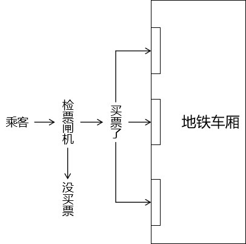


**程序中**

在程序中，使用拦截器在请求到达具体 handler 方法前，统一执行检测。


**2.拦截器 VS 过滤器**

**相似点**

三要素相同

- 拦截：必须先把请求拦住，才能执行后续操作
- 过滤：拦截器或过滤器存在的意义就是对请求进行统一处理
- 放行：对请求执行了必要操作后，放请求过去，让它访问原本想要访问的资源

**不同点**

- 工作平台不同
  - 过滤器工作在 Servlet 容器中
  - 拦截器工作在 SpringMVC 的基础上
- 拦截的范围
  - 过滤器：能够拦截到的最大范围是整个 Web 应用
  - 拦截器：能够拦截到的最大范围是整个 SpringMVC 负责的请求
- IOC 容器支持
  - 过滤器：想得到 IOC 容器需要调用专门的工具方法，是间接的
  - 拦截器：它自己就在 IOC 容器中，所以可以直接从 IOC 容器中装配组件，也就是可以直接得到 IOC 容器的支持

**选择**

功能需要如果用 SpringMVC 的拦截器能够实现，就不使用过滤器。

#### 使用

**1.创建拦截器类**

**实现接口**

```java
public class Process01Interceptor implements HandlerInterceptor {
 
    Logger logger = LoggerFactory.getLogger(this.getClass());
 
    // 在处理请求的目标 handler 方法前执行
    @Override
    public boolean preHandle(HttpServletRequest request, HttpServletResponse response, Object handler) throws Exception {
        
        logger.debug("Process01Interceptor preHandle方法");
         
        // 返回true：放行
        // 返回false：不放行
        return true;
    }
 
    // 在目标 handler 方法之后，渲染视图之前
    @Override
    public void postHandle(HttpServletRequest request, HttpServletResponse response, Object handler, ModelAndView modelAndView) throws Exception {
 
        logger.debug("Process01Interceptor postHandle方法");
        
    }
 
    // 渲染视图之后执行
    @Override
    public void afterCompletion(HttpServletRequest request, HttpServletResponse response, Object handler, Exception ex) throws Exception {
        
        logger.debug("Process01Interceptor afterCompletion方法");
        
    }
}
```

<span style="color:blue;font-weight:bold;">单个拦截器执行顺序</span>：

- preHandle() 方法
- 目标 handler 方法
- postHandle() 方法
- 渲染视图
- afterCompletion() 方法

**继承类**

在较低版本的 SpringMVC 中，实现 HandlerInterceptor 接口需要把所有抽象方法都实现。但是又不是每个方法都需要使用，导致代码比较繁琐。

此时可以通过继承 HandlerInterceptorAdapter 类同样可以创建拦截器类。HandlerInterceptorAdapter 类中已经给 HandlerInterceptor 接口提供了默认实现，我们继承后不需要把每个方法都实现，只需要把有用的方法重写即可。

在 SpringMVC 较高版本（例如：5.3版本以上）中，HandlerInterceptor 接口已经借助 ==JDK 1.8 新特性让接口中的每个抽象方法都给出了默认实现（默认实现表示不需要在实现类中重写接口中的方法）==，所以 HandlerInterceptorAdapter 这个类被标记为过时。

```java
@Deprecated
public abstract class HandlerInterceptorAdapter implements AsyncHandlerInterceptor {

}
```

**2.注册拦截器**

**默认拦截全部请求**

```xml
<!-- 注册拦截器 -->
<mvc:interceptors>
    <!-- 直接通过内部 bean 配置的拦截器默认拦截全部请求（SpringMVC 范围内） -->
    <bean class="com.atguigu.mvc.interceptor.Process01Interceptor"/>
</mvc:interceptors>
```

**配置拦截路径**

精确匹配

```xml
<!-- 具体配置拦截器可以指定拦截的请求地址 -->
<mvc:interceptor>
    <!-- 精确匹配 -->
    <mvc:mapping path="/common/request/one"/>
    <bean class="com.atguigu.mvc.interceptor.Process03Interceptor"/>
</mvc:interceptor>
```

模糊匹配：匹配单层路径

```xml
<mvc:interceptor>
    <!-- /*匹配路径中的一层 -->
    <mvc:mapping path="/common/request/*"/>
    <bean class="com.atguigu.mvc.interceptor.Process04Interceptor"/>
</mvc:interceptor>
```

模糊匹配：匹配多层路径

```xml
<mvc:interceptor>
    <!-- /**匹配路径中的多层 -->
    <mvc:mapping path="/common/request/**"/>
    <bean class="com.atguigu.mvc.interceptor.Process05Interceptor"/>
</mvc:interceptor>
```

**配置不拦截路径**

```xml
<mvc:interceptor>
    <!-- /**匹配路径中的多层 -->
    <mvc:mapping path="/common/request/**"/>

    <!-- 使用 mvc:exclude-mapping 标签配置不拦截的地址 -->
    <mvc:exclude-mapping path="/common/request/two/bbb"/>

    <bean class="com.atguigu.mvc.interceptor.Process05Interceptor"/>
</mvc:interceptor>
```

**3.多个拦截器执行顺序**

- 所有的preHandle()方法：和配置的顺序一样
- 目标handler方法
- 所有的postHandle()方法：和配置的顺序相反
- 渲染视图
- 所有的afterCompletion()方法：和配置的顺序相反

#### 案例

一个网站有 5 个资源，其中两个无须登录即可访问，另外三个需要登录后才能访问。如果不登录就访问那三个资源，会自动跳转到登录页面并给出提示：请登录后再操作。

提示：将数据存入请求域、转发或重定向请求都需要使用原生对象来完成，在拦截器中 SpringMVC 并没有提供 Model、ModelMap 等 API 供我们使用。

访问资源的请求地址可参考：

- 公共资源1：/public/resource/one
- 公共资源2：/public/resouce/two
- 私密资源1：/private/resouce/one
- 私密资源2：/private/resouce/two
- 私密资源3：/private/resouce/three

**1.准备工作**

- 搭建环境
- 创建首页
  - 首页超链接：公共资源
  - 首页超链接：三个私密资源
- 创建 DemoHandler

```java
@Controller
public class DemoHandler {
 
    @RequestMapping("/public/resource")
    public String publicResource() {

        return "public-res";
    }
 
    @RequestMapping("/private/resource/{path}")
    public String privateResource(@PathVariable String path) {

        return "private-"+path;
    }
 
}
```

**2.显示错误提示**

**需求点**

系统错误信息显示页面需要动态显示提示消息，这就需要 Thymeleaf 模板引擎的解析。

**创建视图页面**


```html
<!DOCTYPE html>
<html lang="en" xmlns:th="http://www.thymeleaf.org">
<head>
    <meta charset="UTF-8">
    <title>Title</title>
</head>
<body>
 
    <h1>系统消息</h1>
 
    <p th:text="${message}">在这里显示从请求域读取的消息</p>
 
    <a th:href="@{/}">回首页</a>
</body>
</html>
```

**创建 handler 方法**


```java
@Controller
public class SystemHandler {
 
    @RequestMapping("/feature/system/message")
    public String toSystemMessagePage(){
 
        return "system-message";
    }
 
}
```

注：在当前这个小练习中，这个 handler 方法里面没有具体代码，所以也可以用 view-controller 代替

**3.创建拦截器**

**创建拦截器类**


```java
public class LoginInterceptor implements HandlerInterceptor {
 
    @Override
    public boolean preHandle(HttpServletRequest request, HttpServletResponse response, Object handler) throws Exception {
 
        // 假设：请求参数中携带 token，且 token 值为 login 表示已登录
        // 1、获取请求参数
        String token = request.getParameter("token");
 
        // 2、检查 token 值
        if ("login".equals(token)) {
 
            // 3、对已经登录的请求执行放行操作
            return true;
 
        }
 
        // 4、对没有登录的请求跳转到错误信息提示页面
        // ①将提示消息存入请求域
        request.setAttribute("message",
                "私密资源需要登录后才可以访问");
 
        // ②执行转发
        request.getRequestDispatcher("/feature/system/message").forward(request, response);
 
        // 5、拦截器不放行，停止执行后续操作
        return false;
    }
}
```

**注册拦截器类**

```xml
<!-- 注册拦截器类 -->
<mvc:interceptors>
    <mvc:interceptor>
        <!-- 拦截所有匹配 /private/resource/* 路径的请求 -->
        <mvc:mapping path="/private/resource/*"/>
 
        <!-- 配置拦截器类 -->
        <bean class="com.atguigu.mvc.interceptor.LoginInterceptor"/>
    </mvc:interceptor>
</mvc:interceptors>
```

### 类型转换

SpringMVC 将『把请求参数注入到 POJO 对象』这个操作称为<span style="color:blue;font-weight:bold;">『数据绑定』</span>，英文单词是 binding。数据类型的转换和格式化就发生在数据绑定的过程中。 类型转换和格式化是密不可分的两个过程，很多带格式的数据必须明确指定格式之后才可以进行类型转换。最典型的就是日期类型。

#### 自动类型转换

HTTP 协议是一个无类型的协议，我们在服务器端接收到请求参数等形式的数据时，本质上都是字符串类型。请看 javax.servlet.ServletRequest 接口中获取全部请求参数的方法：

```java
public Map<String, String[]> getParameterMap();
```

而我们在实体类当中需要的类型是非常丰富的。对此，SpringMVC 对基本数据类型提供了自动的类型转换。例如：请求参数传入“100”字符串，我们实体类中需要的是 Integer 类型，那么 SpringMVC 会自动将字符串转换为 Integer 类型注入实体类。

#### 日期和数值类型

**1.通过注解设定数据格式**

```java
public class Product {

    @DateTimeFormat(pattern = "yyyy-MM-dd HH:mm:ss")
    private Date productDate;

    @NumberFormat(pattern = "###,###,###.###")
    private Double productPrice;
```

**2.表单**

```html
<form th:action="@{/save/product}" method="post">
    生产日期：<input type="text" name="productDate" value="1992-10-15 17:15:06" /><br/>
    产品价格：<input type="text" name="productPrice" value="111,222,333.444" /><br/>
    <button type="submit">保存</button>
</form>
```

**3.handler 方法**

```java
@RequestMapping("/save/product")
public String saveProduct(Product product) {
 
    logger.debug(product.toString());
 
    return "target";
}
```

#### 转换失败后处理方式

**1.默认结果**


**2.BindingResult 接口**


BindingResult 接口和它的父接口 Errors 中定义了很多和数据绑定相关的方法，如果在数据绑定过程中发生了错误，那么通过这个接口类型的对象就可以获取到相关错误信息。

**3.重构 handler 方法**

```java
@RequestMapping("/save/product")
public String saveProduct(
        Product product,
	    // 在实体类参数和 BindingResult 之间不能有任何其他参数，且需要放在实体类参数之后
        // 封装数据绑定结果的对象
        BindingResult bindingResult) {
 
    // 判断数据绑定过程中是否发生了错误
    if (bindingResult.hasErrors()) {
        // 如果发生了错误，则跳转到专门显示错误信息的页面
        // 相关错误信息会自动被放到请求域
        return "error";
    }
 
    logger.debug(product.toString());
 
    return "target";
}
```

**4.在页面上显示错误消息**

```html
	<!-- 从请求域获取实体类信息时，属性名是按照类名首字母小写的规则 -->
	<!-- ${注入请求参数的实体类.出问题的字段} -->
    <p th:errors="${product.productDate}">这里显示具体错误信息</p>
```

#### 自定义类型转换器

在实际开发过程中，难免会有某些情况需要使用自定义类型转换器。因为我们自己自定义的类型在 SpringMVC 中没有对应的内置类型转换器。此时需要我们提供自定义类型来执行转换。

> 我们学习的知识点可以分成：
>
> - 拼死学会
>
> - 以防万一
>
> - 增长见闻
>
>   自定义类型转换器的定位就是以防万一

**1.创建实体类**

**Address**

```java
public class Address {
 
    private String province;
    private String city;
    private String street;
    ……
```

**Student**

```java
public class Student {
 
    private Address address;
    ……
```

**2.表单**

现在我们希望通过一个文本框输入约定格式的字符串，然后转换为我们需要的类型，所以必须通过自定义类型转换器来实现，否则 SpringMVC 无法识别。

```html
<h3>自定义类型转换器</h3>
<form th:action="@{/save/student}" method="post">
    地址：<input type="text" name="address" value="aaa,bbb,ccc" /><br/>
</form>
```

**3.handler 方法**

```java
@RequestMapping("/save/student")
public String saveStudent(Student student) {
 
    logger.debug(student.getAddress().toString());
 
    return "target";
}
```

在目前代码的基础上，我们没有提供自定义类型转换器，所以处理请求时看到如下错误日志：

> Field error in object 'student' on field 'address': rejected value [aaa,bbb,ccc]; codes [typeMismatch.student.address,typeMismatch.address,typeMismatch.com.atguigu.mvc.entity.Address,typeMismatch]; arguments [org.springframework.context.support.DefaultMessageSourceResolvable: codes [student.address,address]; arguments []; default message [address]]; default message [Failed to convert property value of type 'java.lang.String' to required type 'com.atguigu.mvc.entity.Address' for property 'address'; nested exception is java.lang.IllegalStateException: Cannot convert value of type 'java.lang.String' to required type 'com.atguigu.mvc.entity.Address' for property 'address': no matching editors or conversion strategy found]]]

页面返回 400。

**4.创建自定义类型转换器类**

实现接口：org.springframework.core.convert.converter.Converter&lt;S,T&gt;

泛型 S：源类型（本例中是 String 类型）

泛型 T：目标类型（本例中是 Address 类型）

```java
public class AddressConverter implements Converter<String, Address> {
    @Override
    public Address convert(String source) {
  
        // 1.按照约定的规则拆分源字符串
        String[] split = source.split(",");
         
        String province = split[0];
        String city = split[1];
        String street = split[2];
 
        // 2.根据拆分结果创建 Address 对象
        Address address = new Address(province, city, street);
         
        // 3.返回转换得到的对象
        return address;
    }
}
```

**5.在 SpringMVC 中注册**

```xml
<!-- 在 mvc:annotation-driven 中注册 FormattingConversionServiceFactoryBean -->
<mvc:annotation-driven conversion-service="formattingConversionService"/>
 
<!-- 在 FormattingConversionServiceFactoryBean 中注册自定义类型转换器 -->
<bean id="formattingConversionService"
   class="org.springframework.format.support.FormattingConversionServiceFactoryBean">
    <!-- 在 converters 属性中指定自定义类型转换器 -->
    <property name="converters">
        <set>
            <bean class="com.atguigu.mvc.converter.AddressConverter"/>
        </set>
    </property>
</bean>
```

### 数据校验

在 Web 应用三层架构体系中，表述层负责接收浏览器提交的数据，业务逻辑层负责数据的处理。为了能够让业务逻辑层基于正确的数据进行处理，我们需要在表述层对数据进行检查，将错误的数据隔绝在业务逻辑层之外。

#### 校验概述

JSR 303 是 Java 为 Bean 数据合法性校验提供的标准框架，它已经包含在 JavaEE 6.0 标准中。JSR 303 通过在 Bean 属性上标注类似于 @NotNull、@Max 等标准的注解指定校验规则，并通过标准的验证接口对Bean进行验证。

| 注解                       | 规则                                           |
| -------------------------- | ---------------------------------------------- |
| @Null                      | 标注值必须为 null                              |
| @NotNull                   | 标注值不可为 null                              |
| @AssertTrue                | 标注值必须为 true                              |
| @AssertFalse               | 标注值必须为 false                             |
| @Min(value)                | 标注值必须大于或等于 value                     |
| @Max(value)                | 标注值必须小于或等于 value                     |
| @DecimalMin(value)         | 标注值必须大于或等于 value                     |
| @DecimalMax(value)         | 标注值必须小于或等于 value                     |
| @Size(max,min)             | 标注值大小必须在 max 和 min 限定的范围内       |
| @Digits(integer,fratction) | 标注值值必须是一个数字，且必须在可接受的范围内 |
| @Past                      | 标注值只能用于日期型，且必须是过去的日期       |
| @Future                    | 标注值只能用于日期型，且必须是将来的日期       |
| @Pattern(value)            | 标注值必须符合指定的正则表达式                 |

JSR 303 只是一套标准，需要提供其实现才可以使用。Hibernate Validator 是 JSR 303 的一个参考实现，除支持所有标准的校验注解外，它还支持以下的扩展注解：

| 注解      | 规则                               |
| --------- | ---------------------------------- |
| @Email    | 标注值必须是格式正确的 Email 地址  |
| @Length   | 标注值字符串大小必须在指定的范围内 |
| @NotEmpty | 标注值字符串不能是空字符串         |
| @Range    | 标注值必须在指定的范围内           |

Spring 4.0 版本已经拥有自己独立的数据校验框架，同时支持 JSR 303 标准的校验框架。Spring 在进行数据绑定时，可同时调用校验框架完成数据校验工作。在SpringMVC 中，可直接通过注解驱动 mvc:annotation-driven 的方式进行数据校验。Spring 的 LocalValidatorFactoryBean 既实现了 Spring 的 Validator 接口，也实现了 JSR 303 的 Validator 接口。只要在Spring容器中定义了一个LocalValidatorFactoryBean，即可将其注入到需要数据校验的 Bean中。Spring本身并没有提供JSR 303的实现，所以必须将JSR 303的实现者的jar包放到类路径下。

配置 mvc:annotation-driven 后，SpringMVC 会默认装配好一个 LocalValidatorFactoryBean，通过<span style="color:blue;font-weight:bold;">在处理方法的入参上标注 @Validated 注解</span>即可让 SpringMVC 在完成数据绑定后执行数据校验的工作。

#### 操作演示

请在 SpringMVC 环境基础上做下面的操作：

**1.导入依赖**

```xml
<!-- https://mvnrepository.com/artifact/org.hibernate.validator/hibernate-validator -->
<dependency>
    <groupId>org.hibernate.validator</groupId>
    <artifactId>hibernate-validator</artifactId>
    <version>6.0.22.Final</version>
</dependency>
<!-- https://mvnrepository.com/artifact/org.hibernate.validator/hibernate-validator-annotation-processor -->
<dependency>
    <groupId>org.hibernate.validator</groupId>
    <artifactId>hibernate-validator-annotation-processor</artifactId>
    <version>6.0.22.Final</version>
</dependency>
```

注：需要 Tomcat 版本至少是 8，这个版本不要进行改动，不然下面的校验工作会失效。

**2.应用校验规则**

**标记规则注解**

在实体类中需要附加校验规则的成员变量上标记校验规则注解：

```java
// 字符串长度：[3,6]
@Size(min = 3, max = 6)

// 字符串必须满足Email格式
@Email
private String email;
```

**在handler 方法形参标记注解**

```java
@RequestMapping("/save/president")
public String savePresident(@Validated President president) {
 
    logger.debug(president.getEmail());
 
    return "target";
}
```

**校验失败效果**

日志：

> Field error in object 'president' on field 'email': rejected value [aa]; codes [Email.president.email,Email.email,Email.java.lang.String,Email]; arguments [org.springframework.context.support.DefaultMessageSourceResolvable: codes [president.email,email]; arguments []; default message [email],[Ljavax.validation.constraints.Pattern$Flag;@4a6addb7,.*]; default message [不是一个合法的电子邮件地址]
> Field error in object 'president' on field 'email': rejected value [aa]; codes [Size.president.email,Size.email,Size.java.lang.String,Size]; arguments [org.springframework.context.support.DefaultMessageSourceResolvable: codes [president.email,email]; arguments []; default message [email],6,3]; default message [个数必须在3和6之间]]]

同时页面返回 400。

**3.显示友好的错误提示**

**重构 handler 方法**

```java
@RequestMapping("/save/president")
public String savePresident(
         
        // 在实体类参数和 BindingResult 之间不能有任何其他参数且需要写在实体类参数之后
        @Validated President president, BindingResult bindingResult) {
 
    if (bindingResult.hasErrors()) {
        return "error";
    }
     
    logger.debug(president.getEmail());
 
    return "target";
}
```

**准备错误信息页面**

```html
<h1>系统信息</h1>
<!-- 从请求域获取实体类信息时，属性名是按照类名首字母小写的规则 -->
<!-- ${注入请求参数的实体类.出问题的字段} -->
<p th:errors="${president.email}">这里显示系统提示消息</p>
```

### 异常映射

#### 概念

**1.微观**

将异常类型和某个具体的视图关联起来，建立映射关系。好处是可以通过 SpringMVC 框架来帮助我们管理异常。

- 声明式管理异常：在配置文件中指定异常类型和视图之间的对应关系。在配置文件或注解类中统一管理。
- 编程式管理异常：需要我们自己手动 try ... catch ... 捕获异常，然后再手动跳转到某个页面。

**2.宏观**

一个项目中会包含很多个模块，各个模块需要分工完成。如果张三负责的模块按照 A 方案处理异常，李四负责的模块按照 B 方法处理异常……各个模块处理异常的思路、代码、命名细节都不一样，那么就会让整个项目非常混乱。

#### 异常映射的好处

- 使用声明式代替编程式来实现异常管理
  - 让异常控制和核心业务解耦，二者各自维护，结构性更好
- 整个项目层面使用同一套规则来管理异常
  - 整个项目代码风格更加统一、简洁
  - 便于团队成员之间的彼此协作

#### 基于 XML 的异常映射

**1.配置**

SpringMVC 会根据异常映射信息，在捕获到指定异常对象后，将异常对象存入请求域，然后转发到和异常类型关联的视图。

```xml
<bean id="simpleMappingExceptionResolver"
      class="org.springframework.web.servlet.handler.SimpleMappingExceptionResolver">
 
    <!-- 配置异常映射关系 -->
    <property name="exceptionMappings">
        <props>
            <!-- key属性：指定异常类型 -->
            <!-- 文本标签体：和异常类型对应的逻辑视图 -->
            <prop key="java.lang.ArithmeticException">error-arith</prop>
        </props>
    </property>
 
    <!-- 使用 exceptionAttribute 属性配置将异常对象存入请求域时使用的属性名 -->
    <!-- 这个属性名默认是exception -->
    <property name="exceptionAttribute" value="atguiguException"/>
</bean>
```

**2.异常范围**

如果在配置文件中，发现有多个匹配的异常类型，那么 SpringMVC 会采纳范围上最接近的异常映射关系。

```xml
<prop key="java.lang.ArithmeticException">error-arith</prop>
<prop key="java.lang.RuntimeException">error-runtime</prop>
```

#### 基于注解的异常映射

**1.创建异常处理器类**


**2.异常处理器类加入 IOC 容器**

```xml
<context:component-scan base-package="com.atguigu.mvc.handler,com.atguigu.mvc.exception"/>
```

**3.给异常处理器类标记注解**

```java
// 异常处理器类需要使用 @ControllerAdvice 注解标记
@ControllerAdvice
public class MyExceptionHandler {
    
}
```

**4.声明处理异常的方法**

```java
// @ExceptionHandler注解：标记异常处理方法
// value属性：指定匹配的异常类型
// 异常类型的形参：SpringMVC 捕获到的异常对象
@ExceptionHandler(value = NullPointerException.class)
public String resolveNullPointerException(Exception e, Model model) {
 
    // 我们可以自己手动将异常对象存入模型
    model.addAttribute("atguiguException", e);
 
    // 返回逻辑视图名称
    return "error-nullpointer";
}
```

==当同一个异常类型在基于 XML 和注解的配置中都能够找到对应的映射，那么以注解为准。==

#### 区分请求类型

1.**分析**

异常处理机制和拦截器机制都面临这样的问题：


**2.判断依据**

查看请求消息头中是否包含 Ajax 请求独有的特征：

- Accept 请求消息头：包含 application/json
- X-Requested-With 请求消息头：包含 XMLHttpRequest

两个条件满足一个即可。

```java
/**
 * 判断当前请求是否为Ajax请求
 * @param request 请求对象
 * @return
 * 		true：当前请求是Ajax请求
 * 		false：当前请求不是Ajax请求
 */
public static boolean judgeRequestType(HttpServletRequest request) {
 	
	// 1.获取请求消息头
	String acceptHeader = request.getHeader("Accept");
	String xRequestHeader = request.getHeader("X-Requested-With");
 	
	// 2.判断
	return (acceptHeader != null && acceptHeader.contains("application/json"))
 			
			||
 			
			(xRequestHeader != null && xRequestHeader.equals("XMLHttpRequest"));
}
```

**3.兼容两种请求的处理方法**

```java
@ExceptionHandler(value = Exception.class)
public String resolveException(Exception e, HttpServletRequest request, HttpServletResponse response) throws IOException {
 
    // 调用工具方法判断当前请求是否是 Ajax 请求
    boolean judgeResult = MVCUtil.judgeRequestType(request);
 
    if (judgeResult) {
 
        // 对 Ajax 请求返回字符串作为响应体
        String message = e.getMessage();
 
        response.setContentType("text/html;charset=UTF-8");
        response.getWriter().write(message);
 
        // 上面已经使用原生 response 对象返回了响应，这里就不返回视图名称了
        return null;
    }
 
    // 对普通请求返回逻辑视图名称
    return "error-exception";
}
```

### 文件上传

#### 表单

- 第一点：请求方式必须是 POST
- 第二点：请求体的编码方式必须是 multipart/form-data（通过 form 标签的 enctype 属性设置）
- 第三点：使用 input 标签、type 属性设置为 file 来生成文件上传框

```html
<form th:action="@{/atguigu/upload}" method="post" enctype="multipart/form-data">
    
    <input type="file" name="picture" />
    <button type="submit">上传头像</button>
     
</form>
```

#### SpringMVC 环境要求

**1.依赖**

```xml
<!-- https://mvnrepository.com/artifact/commons-fileupload/commons-fileupload -->
<dependency>
    <groupId>commons-fileupload</groupId>
    <artifactId>commons-fileupload</artifactId>
    <version>1.3.1</version>
</dependency>
```

**2.配置**

在 SpringMVC 的配置文件中加入 multipart 类型数据的解析器：

```xml
<bean id="multipartResolver" 
      class="org.springframework.web.multipart.commons.CommonsMultipartResolver">
    
    <!-- 由于上传文件的表单请求体编码方式是 multipart/form-data 格式，所以要在解析器中指定字符集 -->
    <property name="defaultEncoding" value="UTF-8"/>
    
</bean>
```

#### handler 方法接收数据

```java
@RequestMapping("/simple/upload")
public String doUpload(
 
        // 表单提交的数据仍然是请求参数，所以使用 @RequestParam 注解接收
        @RequestParam("nickName") String nickName,
 
        // 对于上传的文件使用 MultipartFile 类型接收其相关数据
        @RequestParam("picture") MultipartFile picture
        ) throws IOException {
 
    String inputName = picture.getName();
    logger.debug("文件上传表单项的 name 属性值：" + inputName);
 
    // 获取这个数据通常都是为了获取文件本身的扩展名
    String originalFilename = picture.getOriginalFilename();
    logger.debug("文件在用户本地原始的文件名：" + originalFilename);
 
    String contentType = picture.getContentType();
    logger.debug("文件的内容类型：" + contentType);
 
    boolean empty = picture.isEmpty();
    logger.debug("文件是否为空：" + empty);
 
    long size = picture.getSize();
    logger.debug("文件大小：" + size);
 
    byte[] bytes = picture.getBytes();
    logger.debug("文件二进制数据的字节数组：" + Arrays.asList(bytes));
 
    InputStream inputStream = picture.getInputStream();
    logger.debug("读取文件数据的输入流对象：" + inputStream);
 
    Resource resource = picture.getResource();
    logger.debug("代表当前 MultiPartFile 对象的资源对象" + resource);
 
    return "target";
}
```

#### MultipartFile 接口


#### 文件转存

**1.底层机制**


**2.三种去向**

**本地转存**


##### (1)实现方式

<1>创建保存文件的目录


这个目录如果是空目录，那么服务器部署运行时很容易会忽略这个目录。为了避免这个问题，在这个目录下随便创建一个文件，随便写点内容即可。

<2>编写转存代码

下面是负责处理文件上传请求的 handler 方法的转存部分：

```java
……
 
// 1、准备好保存文件的目标目录
// ①File 对象要求目标路径是一个物理路径（在硬盘空间里能够直接找到文件的路径）
// ②项目在不同系统平台上运行，要求能够自动兼容、适配不同系统平台的路径格式
//      例如：Window系统平台的路径是 D:/aaa/bbb 格式
//      例如：Linux系统平台的路径是 /ttt/uuu/vvv 格式
//      所以我们需要根据『不会变的虚拟路径』作为基准动态获取『跨平台的物理路径』
// ③虚拟路径：浏览器通过 Tomcat 服务器访问 Web 应用中的资源时使用的路径
String destFileFolderVirtualPath = "/head-picture";
 
// ④调用 ServletContext 对象的方法将虚拟路径转换为真实物理路径
String destFileFolderRealPath = servletContext.getRealPath(destFileFolderVirtualPath);
 
// 2、生成保存文件的文件名
// ①为了避免同名的文件覆盖已有文件，不使用 originalFilename，所以需要我们生成文件名
// ②我们生成文件名包含两部分：文件名本身和扩展名
// ③声明变量生成文件名本身
String generatedFileName = UUID.randomUUID().toString().replace("-","");
 
// ④根据 originalFilename 获取文件的扩展名
String fileExtname = originalFilename.substring(originalFilename.lastIndexOf("."));
 
// ⑤拼装起来就是我们生成的整体文件名
String destFileName = generatedFileName + "" + fileExtname;
 
// 3、拼接保存文件的路径，由两部分组成
//      第一部分：文件所在目录
//      第二部分：文件名
String destFilePath = destFileFolderRealPath + "/" + destFileName;
 
// 4、创建 File 对象，对应文件具体保存的位置
File destFile = new File(destFilePath);
 
// 5、执行转存
picture.transferTo(destFile);
 
……
```

==由于文件转存的原理是先存入主机暂存区，需要时再从暂存区中拷贝至服务器文件夹中，同时需要将暂存区中的数据给删除掉，所以此处还要注意客户端上传文件至主机的暂存区文件夹权限问题，如果该文件夹权限要求过高，就可能会出现以下这一种报错，这也是为什么不建议使用该方法的原因之一；==


##### (2)缺陷

- Web 应用重新部署时通常都会清理旧的构建结果，此时用户以前上传的文件会被删除，导致数据丢失。

- 项目运行很长时间后，会导致上传的文件积累非常多，体积非常大，从而拖慢 Tomcat 运行速度。

- 当服务器以集群模式运行时，文件上传到集群中的某一个实例，其他实例中没有这个文件，就会造成数据不一致。
  负载均衡：即负载均衡服务器，负载均衡服务器（load-balancing server）是进行负载分配的服务器。通过负载均衡服务器，将服务请求均衡分配到实际执行的服务中，从而保证整个系统的响应速度。

  

- 不支持动态扩容，一旦系统增加了新的硬盘或新的服务器实例，那么上传、下载时使用的路径都需要跟着变化，导致 Java 代码需要重新编写、重新编译，进而导致整个项目重新部署。

#### 文件服务器（采纳）

##### (1)总体机制


##### (2)好处

- 不受 Web 应用重新部署影响
- 在应用服务器集群环境下不会导致数据不一致
- 针对文件读写进行专门的优化，性能有保障
- 能够实现动态扩容


##### (3)文件服务器类型

- 第三方平台：
  - 阿里的 OSS 对象存储服务
  - 七牛云
- 自己搭建服务器：FastDFS等

#### 上传到其他模块

这种情况肯定出现在分布式架构中，常规业务功能不会这么做，采用这个方案的一定的特殊情况。


在 MultipartFile 接口中有一个对应的方法：

```java
/**
 * Return a Resource representation of this MultipartFile. This can be used
 * as input to the {@code RestTemplate} or the {@code WebClient} to expose
 * content length and the filename along with the InputStream.
 * @return this MultipartFile adapted to the Resource contract
 * @since 5.1
 */
default Resource getResource() {
	return new MultipartFileResource(this);
}
```

注释中说：这个 Resource 对象代表当前 MultipartFile 对象，输入给 RestTemplate 或 WebClient。而 RestTemplate 或 WebClient 就是用来在 Java 程序中向服务器端发出请求的组件。

### 文件下载

#### 初始形态

使用链接地址指向要下载的文件。此时浏览器会尽可能解析对应的文件，只要是能够在浏览器窗口展示的，就都会直接显示，而不是提示下载。

```html
<a href="download/hello.sharehome">下载</a><br/>
<a href="download/ok.jpg">下载</a><br/>
<a href="download/chapter04.zip">下载</a><br/>
```

上面例子中，只有 chapter04.zip 文件是直接提示下载的，其他两个都是直接显示。

==关于Maven依赖，仅需要SpringMVC的基础依赖即可实现一个文件的下载功能；==

#### 明确要求浏览器提示下载

```java
@Autowired
private ServletContext servletContext;

@RequestMapping("/download/file")
public ResponseEntity<byte[]> downloadFile() {

    // 1.获取要下载的文件的输入流对象
    // 这里指定的路径以 Web 应用根目录为基准
    InputStream inputStream = servletContext.getResourceAsStream("/images/mi.jpg");

    try {
        // 2.将要下载的文件读取到字节数组中
        // ①获取目标文件的长度
        int len = inputStream.available();

        // ②根据目标文件长度创建字节数组
        byte[] buffer = new byte[len];

        // ③将目标文件读取到字节数组中
        inputStream.read(buffer);

        // 3.封装响应消息头
        // ①创建MultiValueMap接口类型的对象，实现类是HttpHeaders
        MultiValueMap responseHeaderMap = new HttpHeaders();

        // ②存入下载文件所需要的响应消息头
        responseHeaderMap.add("Content-Disposition", "attachment; filename=mi.jpg");

        // ③创建ResponseEntity对象
        ResponseEntity<byte[]> responseEntity = new ResponseEntity<>(buffer, responseHeaderMap, HttpStatus.OK);

        // 4.返回responseEntity对象
        return responseEntity;
    } catch (IOException e) {
        e.printStackTrace();
    } finally {

        if (inputStream != null) {
            try {
                inputStream.close();
            } catch (IOException e) {
                e.printStackTrace();
            }
        }

    }
    return null;
}
```

#### 典型应用场景举例

我们目前实现的是一个较为简单的下载，可以用在下面的一些场合：

- 零星小文件下载
- 将系统内部的数据导出为 Excel、PDF 等格式，然后以下载的方式返回给用户

### 其他不重要内容

#### SpringMVC 配置文件的默认位置

**1.配置要求**

- 配置文件存放目录：/WEB-INF 目录
- 文件名格式：[servlet-name]-servlet.xml
  - servlet-name 部分是在 web.xml 中配置 DispatcherServlet 时，servlet-name 标签的值
- 省略原理的 init-param

**2.为什么不建议**

除 web.xml 是 Tomcat 要求放在 WEB-INF 下，其他配置文件习惯上是放在类路径下。

#### 请求映射其他方式

**1.根据请求参数情况映射**

使用 @RequestMapping 注解的 params 参数实现，表达式语法参见下面的例子：

| 需求                                                         | 映射方式                                                     |
| ------------------------------------------------------------ | ------------------------------------------------------------ |
| 请求参数中必须包含userName                                   | @RequestMapping(value = "/xxx", <br />params="userName")     |
| 请求参数中不能包含userName                                   | @RequestMapping(value = "/xxx", <br />params="!userName")    |
| 请求参数中必须包含userName<br />且值必须为Tom2015            | @RequestMapping(value = "/xxx", <br />params="userName=Tom2015") |
| 请求参数中必须包含userName<br />但值不能为Tom2015            | @RequestMapping(value = "/xxx", <br />params="userName=!Tom2015") |
| 请求参数中必须包含userName<br />且值为Tom2015，<br />同时必须包含userPwd但值不限 | @RequestMapping(value = "/xxx", <br />params={"userName=Tom2015","userPwd"} ) |

**2.根据请求消息头内容映射**

使用 @RequestMapping 注解的 headers 参数实现，表达式语法参见下面的例子：

| 需求                                     | 映射方式                                                     |
| ---------------------------------------- | ------------------------------------------------------------ |
| 根据 Accept-Language:zh-CN,zh;q=0.8 映射 | @RequestMapping (<br />value="/xxx",<br />headers= "Accept-Language=zh-CN,en;q=0.8" ) |

**3.Ant 风格通配符**

- 英文问号：匹配一个字符
- 一个星号：匹配路径中的一层
- 两个连续星号：匹配路径中的多层

#### @ModelAttribute 注解

handler 类中，选定一个方法标记 @ModelAttribute 注解。

- 效果1：在每个 handler 方法前执行
- 效果2：可以将某些数据提前存入请求域

```java
@Controller
public class ModelAttrHandler {
 
    @ModelAttribute
    public void doSthBefore(Model model) {
        model.addAttribute("initAttr", "initValue");
    }
 
    @RequestMapping("/test/model/attr/one")
    public String testModelAttrOne(Model model) {
 
        Object modelAttribute = model.getAttribute("initAttr");
        System.out.println("modelAttribute = " + modelAttribute);
 
        return "target";
    }
 
    @RequestMapping("/test/model/attr/two")
    public String testModelAttrTwo(Model model) {
 
        Object modelAttribute = model.getAttribute("initAttr");
        System.out.println("modelAttribute = " + modelAttribute);
 
        return "target";
    }
 
    @RequestMapping("/test/model/attr/three")
    public String testModelAttrThree(Model model) {
 
        Object modelAttribute = model.getAttribute("initAttr");
        System.out.println("modelAttribute = " + modelAttribute);
 
        return "target";
    }
 
}
```

## 4.15.SpringMVC运行原理

### 启动过程

#### Servlet 生命周期回顾


| 生命周期环节 | 调用的方法                                                   | 时机                                                         | 次数 |
| ------------ | ------------------------------------------------------------ | ------------------------------------------------------------ | ---- |
| 创建对象     | 无参构造器                                                   | <span style="color:blue;font-weight:bold;">默认：第一次请求<br />修改：Web应用启动时</span> | 一次 |
| 初始化       | init(ServletConfig servletConfig)                            | 创建对象后                                                   | 一次 |
| 处理请求     | service(ServletRequest servletRequest, <br />ServletResponse servletResponse) | 接收到请求后                                                 | 多次 |
| 清理操作     | destroy()                                                    | Web应用卸载之前                                              | 一次 |

#### 初始化操作调用路线图


#### IOC容器创建

所在类：org.springframework.web.servlet.FrameworkServlet

```java
protected WebApplicationContext createWebApplicationContext(@Nullable ApplicationContext parent) {
	Class<?> contextClass = getContextClass();
	if (!ConfigurableWebApplicationContext.class.isAssignableFrom(contextClass)) {
		throw new ApplicationContextException(
				"Fatal initialization error in servlet with name '" + getServletName() +
				"': custom WebApplicationContext class [" + contextClass.getName() +
				"] is not of type ConfigurableWebApplicationContext");
	}
    
    // 通过反射创建 IOC 容器对象
	ConfigurableWebApplicationContext wac =
			(ConfigurableWebApplicationContext) BeanUtils.instantiateClass(contextClass);

	wac.setEnvironment(getEnvironment());
    
    // 设置父容器
	wac.setParent(parent);
	String configLocation = getContextConfigLocation();
	if (configLocation != null) {
		wac.setConfigLocation(configLocation);
	}
	configureAndRefreshWebApplicationContext(wac);

	return wac;
}
```

#### 将 IOC 容器对象存入应用域

所在类：org.springframework.web.servlet.FrameworkServlet

```java
protected WebApplicationContext initWebApplicationContext() {
	WebApplicationContext rootContext =
			WebApplicationContextUtils.getWebApplicationContext(getServletContext());
	WebApplicationContext wac = null;

	if (this.webApplicationContext != null) {
		wac = this.webApplicationContext;
		if (wac instanceof ConfigurableWebApplicationContext) {
			ConfigurableWebApplicationContext cwac = (ConfigurableWebApplicationContext) wac;
			if (!cwac.isActive()) {
				if (cwac.getParent() == null) {
					cwac.setParent(rootContext);
				}
				configureAndRefreshWebApplicationContext(cwac);
			}
		}
	}
	if (wac == null) {
		wac = findWebApplicationContext();
	}
	if (wac == null) {
        // 创建 IOC 容器
		wac = createWebApplicationContext(rootContext);
	}

	if (!this.refreshEventReceived) {
		synchronized (this.onRefreshMonitor) {
			onRefresh(wac);
		}
	}

	if (this.publishContext) {
		// 获取存入应用域时专用的属性名
		String attrName = getServletContextAttributeName();
        
        // 存入
		getServletContext().setAttribute(attrName, wac);
	}

	return wac;
}
```

看到这一点的意义：SpringMVC 有一个工具方法，可以从应用域获取 IOC 容器对象的引用。


工具类：org.springframework.web.context.support.WebApplicationContextUtils

工具方法：getWebApplicationContext()

```java
@Nullable
public static WebApplicationContext getWebApplicationContext(ServletContext sc) {
	return getWebApplicationContext(sc, WebApplicationContext.ROOT_WEB_APPLICATION_CONTEXT_ATTRIBUTE);
}
```

#### 请求映射初始化

FrameworkServlet.createWebApplicationContext()→configureAndRefreshWebApplicationContext()→wac.refresh()→触发刷新事件→org.springframework.web.servlet.DispatcherServlet.initStrategies()→org.springframework.web.servlet.DispatcherServlet.initHandlerMappings()


#### 小结

整个启动过程我们关心如下要点：

- DispatcherServlet 本质上是一个 Servlet，所以天然的遵循 Servlet 的生命周期。所以宏观上是 Servlet 生命周期来进行调度。
- DispatcherServlet 的父类是 FrameworkServlet。
  - FrameworkServlet 负责框架本身相关的创建和初始化。
  - DispatcherServlet 负责请求处理相关的初始化。
- FrameworkServlet 创建 IOC 容器对象之后会存入应用域。
- FrameworkServlet 完成初始化会调用 IOC 容器的刷新方法。
- 刷新方法完成触发刷新事件，在刷新事件的响应函数中，调用 DispatcherServlet 的初始化方法。
- 在 DispatcherServlet 的初始化方法中初始化了请求映射等。

### 请求处理过程

#### 总体阶段

**1.流程描述**

- 目标 handler 方法执行<span style="color:blue;font-weight:bold;">前</span>
  - 建立调用链，确定整个执行流程
  - 拦截器的 preHandle() 方法
  - 注入请求参数
  - 准备目标 handler 方法所需所有参数
- <span style="color:blue;font-weight:bold;">调用</span>目标 handler 方法
- 目标 handler 方法执行<span style="color:blue;font-weight:bold;">后</span>
  - 拦截器的 postHandle() 方法
  - 渲染视图
  - 拦截器的 afterCompletion() 方法

**2.核心代码**

整个请求处理过程都是 doDispatch() 方法在宏观上协调和调度，把握了这个方法就理解了 SpringMVC 总体上是如何处理请求的。

所在类：org.springframework.web.servlet.<span style="color:blue;font-weight:bold;">DispatcherServlet</span>

所在方法：doDispatch()

核心方法中的核心代码：

```java
// Actually invoke the handler.
mv = ha.handle(processedRequest, response, mappedHandler.getHandler());
```

#### 调用前阶段

**1.建立调用链**

**相关组件**

全类名：org.springframework.web.servlet.HandlerExecutionChain


拦截器索引默认是 -1，说明开始的时候，它指向第一个拦截器前面的位置。每执行一个拦截器，就把索引向前移动一个位置。所以这个索引每次都是指向当前拦截器。所以它相当于拦截器的<span style="color:blue;font-weight:bold;">指针</span>。

**对应操作**

所在类：org.springframework.web.servlet.handler.AbstractHandlerMapping


结论：调用链是由拦截器和目标 handler 对象组成的。

**2.调用拦截器 preHandle()**

所在类：org.springframework.web.servlet.DispatcherServlet

所在方法：doDispatch()


具体调用细节：正序调用

所在类：org.springframework.web.servlet.HandlerExecutionChain

所在方法：applyPreHandle


从这部分代码我们也能看到，为什么拦截器中的 preHandle() 方法通过返回布尔值能够控制是否放行。

- 每一个拦截器的 preHandle() 方法都返回 true：applyPreHandle() 方法返回 true，被取反就不执行 if 分支，继续执行后续操作，这就是放行。
- 任何一个拦截器的 preHandle() 方法返回 false：applyPreHandle() 方法返回 false，被取反执行 if 分支，return，导致 doDispatch() 方法结束，不执行后续操作，就是不放行。

**3.注入请求参数**

**相关组件**

接口：org.springframework.web.servlet.HandlerAdapter

作用：字面含义是适配器的意思，具体功能有三个

- 将请求参数绑定到实体类对象中
- 给目标 handler 方法准备所需的其他参数，例如：
  - Model、ModelMap、Map……
  - 原生 Servlet API：request、response、session……
  - BindingResult
  - @RequestParam 注解标记的零散请求参数
  - @PathVariable 注解标记的路径变量
- 调用目标 handler 方法

**创建并获取这个组件**

所在类：org.springframework.web.servlet.DispatcherServlet

所在方法：doDispatch()


**具体操作：调用目标 handler 方法**

所在类：org.springframework.web.servlet.DispatcherServlet

所在方法：doDispatch()


**具体操作：注入请求参数**


通过反射给对应属性注入请求参数应该是下面的过程：

- 获取请求参数名称
- 将请求参数名称首字母设定为大写
- 在首字母大写后的名称前附加 set，得到目标方法名
- 通过反射调用 setXxx() 方法

**4.准备其他参数**

以 Model 为例来进行说明。

**背景**

在 handler 方法中，如果需要 Model、ModelMap、Map 等对象用来存放模型数据，那么直接在 handler 方法中声明这些类型的形参即可。

而不管我们声明 Model、ModelMap、Map 三者中的任何一个，其实实际传入的对象都是 BindingAwareModelMap 类型的。

**相关组件**

组件类：org.springframework.web.method.support.ModelAndViewContainer

相关属性：defaultModel

```java
private final ModelMap defaultModel = new BindingAwareModelMap();
```

从这个属性的声明能够看出：defaultModel 直接就是用 BindingAwareModelMap 对象来初始化的。

**相关操作**

相关接口：org.springframework.web.servlet.HandlerAdapter

所在类：org.springframework.web.servlet.mvc.method.annotation.RequestMappingHandlerAdapter

所在方法：invokeHandlerMethod()

操作1：创建 ModelAndViewContainer 对象


操作2：把 ModelAndViewContainer 对象传给 invokeAndHandle() 方法


#### 调用后阶段

**1.调用拦截器的 postHandle() 方法**

所在类：org.springframework.web.servlet.DispatcherServlet

所在方法：doDispatch()


调用细节：从拦截器集合长度 - 1 开始循环，循环到 0 为止。所以是<span style="color:blue;font-weight:bold;">倒序</span>执行。


**2.渲染视图**

**所有后续操作的入口**

所在类：org.springframework.web.servlet.DispatcherServlet

所在方法：doDispatch()


**后续细节1：处理异常**

所在类：org.springframework.web.servlet.DispatcherServlet

所在方法：processDispatchResult()


**后续细节2：渲染视图**

所在类：org.springframework.web.servlet.DispatcherServlet

所在方法：processDispatchResult()


补充细节：模型数据存入请求域的具体位置

所在类：org.thymeleaf.context.WebEngineContext.RequestAttributesVariablesMap

所在方法：setVariable()


**3.调用拦截器的 afterCompletion() 方法**

所在类：org.springframework.web.servlet.DispatcherServlet

所在方法：processDispatchResult()


调用细节：从拦截器索引开始循环，直到循环变量 i 被减到 0 为止。这样的效果是前面执行拦截器到哪里，就从哪里倒回去执行；前面没有执行的拦截器，现在也不执行。


#### 所有断点总结

断点位置基准：SpringMVC 版本采用 5.3.1 且源码已经下载，包含注释。

| 所在类                                                       | 所在方法                   | 断点行数 | 作用                                                    |
| ------------------------------------------------------------ | -------------------------- | -------- | ------------------------------------------------------- |
| DispatcherServlet                                            | doDispatch()               | 1037     | 创建调用链对象                                          |
| DispatcherServlet                                            | doDispatch()               | 1044     | 创建 HandlerAdapter 对象                                |
| DispatcherServlet                                            | doDispatch()               | 1056     | 调用拦截器 preHandle()方法                              |
| DispatcherServlet                                            | doDispatch()               | 1061     | 执行目标 handler 方法                                   |
| DispatcherServlet                                            | doDispatch()               | 1068     | 调用拦截器 postHandle()方法                             |
| DispatcherServlet                                            | doDispatch()               | 1078     | 执行所有后续操作                                        |
| AbstractHandlerMapping                                       | getHandlerExecutionChain() | 592      | 创建调用链对象                                          |
| AbstractHandlerMapping                                       | getHandlerExecutionChain() | 599      | 在调用链中添加拦截器                                    |
| HandlerExecutionChain                                        | applyPreHandle()           | 146      | 调用拦截器 preHandle()方法                              |
| HandlerExecutionChain                                        | applyPostHandle()          | 163      | 调用拦截器 postHandle()方法                             |
| HandlerExecutionChain                                        | triggerAfterCompletion     | 175      | 调用拦截器 afterCompletion()方法                        |
| DataBinder                                                   | doBind()                   | 747      | 执行数据绑定                                            |
| RequestMappingHandlerAdapter                                 | invokeHandlerMethod()      | 868      | 创建 ModelAndViewContainer 对象                         |
| RequestMappingHandlerAdapter                                 | invokeHandlerMethod()      | 893      | 将ModelAndViewContainer 对象传入调用目标 handler 的方法 |
| DispatcherServlet                                            | processDispatchResult()    | 1125     | 处理异常                                                |
| DispatcherServlet                                            | processDispatchResult()    | 1139     | 渲染视图                                                |
| DispatcherServlet                                            | processDispatchResult()    | 1157     | 调用拦截器 afterCompletion()方法                        |
| WebEngineContext的内部类：<br />RequestAttributesVariablesMap | setVariable()              | 783      | 将模型数据存入请求域                                    |

### ContextLoaderListener

#### 提出问题

目前情况：DispatcherServlet 加载 spring-mvc.xml，此时整个 Web 应用中只创建一个 IOC 容器。将来整合Mybatis、配置声明式事务，全部在 spring-mvc.xml 配置文件中配置也是可以的。可是这样会导致配置文件太长，不容易维护。

所以想到把配置文件分开：

- 处理浏览器请求相关：spring-mvc.xml 配置文件
- 声明式事务和整合Mybatis相关：spring-persist.xml 配置文件

配置文件分开之后，可以让 DispatcherServlet 加载多个配置文件。例如：

```xml
<servlet>
    <servlet-name>dispatcherServlet</servlet-name>
    <servlet-class>org.springframework.web.servlet.DispatcherServlet</servlet-class>
    <init-param>
        <param-name>contextConfigLocation</param-name>
        <param-value>classpath:spring-*.xml</param-value>
    </init-param>
    <load-on-startup>1</load-on-startup>
</servlet>
```

如果希望这两个配置文件使用不同的机制来加载：

- DispatcherServlet 加载 spring-mvc.xml 配置文件：它们和处理浏览器请求相关
- ContextLoaderListener 加载 spring-persist.xml 配置文件：不需要处理浏览器请求，需要配置持久化层相关功能

此时会带来一个新的问题：在 Web 一个应用中就会出现两个 IOC 容器

- DispatcherServlet 创建一个 IOC 容器
- ContextLoaderListener 创建一个 IOC 容器

注意：本节我们探讨的这个技术方案并不是<span style="color:blue;font-weight:bold;">『必须』</span>这样做，而仅仅是<span style="color:blue;font-weight:bold;">『可以』</span>这样做。

#### 配置 ContextLoaderListener

**1.创建 spring-persist.xml**


**2.配置 ContextLoaderListener**

```xml
<!-- 通过全局初始化参数指定 Spring 配置文件的位置 -->
<context-param>
    <param-name>contextConfigLocation</param-name>
    <param-value>classpath:spring-persist.xml</param-value>
</context-param>
 
<listener>
    <!-- 指定全类名，配置监听器 -->
    <listener-class>org.springframework.web.context.ContextLoaderListener</listener-class>
</listener>
```

**3.ContextLoaderListeners**


| 方法名               | 执行时机           | 作用                  |
| -------------------- | ------------------ | --------------------- |
| contextInitialized() | Web 应用启动时执行 | 创建并初始化 IOC 容器 |
| contextDestroyed()   | Web 应用卸载时执行 | 关闭 IOC 容器         |

**4.ContextLoader**

**指定配置文件位置的参数名**

```java
/**
 * Name of servlet context parameter (i.e., {@value}) that can specify the
 * config location for the root context, falling back to the implementation's
 * default otherwise.
 * @see org.springframework.web.context.support.XmlWebApplicationContext#DEFAULT_CONFIG_LOCATION
 */
public static final String CONFIG_LOCATION_PARAM = "contextConfigLocation";
```

**初始化 IOC 容器**

方法名：initWebApplicationContext()

**创建 IOC 容器**

方法名：createWebApplicationContext()

#### 探讨两个IOC容器之间的关系

打印两个 IOC 容器对象的 toString() 方法：

```java
Object springIOC = servletContext.getAttribute("org.springframework.web.context.WebApplicationContext.ROOT");
logger.debug(springIOC.toString());

Object springMVCIOC = servletContext.getAttribute("org.springframework.web.servlet.FrameworkServlet.CONTEXT.dispatcherServlet");
logger.debug(springMVCIOC.toString());
```

打印效果是：

> <span style="color:blue;font-weight:bold;">Root</span> WebApplicationContext, started on Thu Jun 17 14:49:17 CST 2021
>
> WebApplicationContext for namespace 'dispatcherServlet-servlet', started on Thu Jun 17 14:49:18 CST 2021, <span style="color:blue;font-weight:bold;">parent</span>: Root WebApplicationContext

结论：两个组件分别创建的 IOC 容器是<span style="color:blue;font-weight:bold;">父子</span>关系。

- 父容器：ContextLoaderListener 创建的 IOC 容器
- 子容器：DispatcherServlet 创建的 IOC 容器

父子关系是如何决定的？

- ContextLoaderListener 初始化时如果检查到有已经存在的根级别 IOC 容器，那么会抛出异常。
- DispatcherServlet 创建的 IOC 容器会在初始化时先检查当前环境下是否存在已经创建好的 IOC 容器。
  - 如果有：则将已存在的这个 IOC 容器设置为自己的父容器
  - 如果没有：则将自己设置为 root 级别的 IOC 容器
- 同时 Tomcat 在读取 web.xml 之后，加载组件的顺序就是监听器、过滤器、Servlet。

DispatcherServlet 创建的 IOC 容器设置父容器的源码截图：

所在类：org.springframework.web.servlet.FrameworkServlet

所在方法：createWebApplicationContext()


#### 探讨两个 IOC 容器之间 bean 的互相访问


spring-mvc.xml配置方式：

```xml
<context:component-scan base-package="com.atguigu.spring.component.controller"/>
```

spring-persist.xml配置方式：

```xml
<context:component-scan base-package="com.atguigu.spring.component.service,com.atguigu.spring.component.dao"/>
```

所以bean所属IOC容器的关系：

- 父容器
  - EmpService
  - EmpDao
- 子容器
  - EmpController

结论：子容器中的 EmpController 装配父容器中的 EmpService 能够正常工作。说明子容器可以访问父容器中的bean。

分析：“子可用父，父不能用子”的根本原因是子容器中有一个属性 <span style="color:blue;font-weight:bold;">getParent()</span> 可以获取到父容器这个对象的引用。

源码依据：

- 在 AbstractApplicationContext 类中，有 parent 属性
- 在 AbstractApplicationContext 类中，有获取 parent 属性的 getParent() 方法
- 子容器可以通过 getParent() 方法获取到父容器对象的引用
- 进而调用父容器中类似 “getBean()” 这样的方法获取到需要的 bean 完成装配
- 而父容器中并没有类似 “getChildren()“ 这样的方法，所以没法拿到子容器对象的引用


#### 有可能重复创建对象


**1.查看日志确认是否重复创建了对象**

> Root WebApplicationContext: initialization started
>
> ……
>
> Creating shared instance of singleton bean 'helloDao'
> Creating shared instance of singleton bean 'helloHandler'
> Creating shared instance of singleton bean 'helloService'
>
> ……
>
> Root WebApplicationContext initialized in 1150 ms
>
> ……
>
> Refreshing WebApplicationContext for namespace 'dispatcherServlet-servlet'
>
> ……
>
> Creating shared instance of singleton bean 'helloDao'
>
> Creating shared instance of singleton bean 'helloHandler'
>
> Creating shared instance of singleton bean 'helloService'
>
> ……

**2.重复创建对象的问题**

- 浪费内存空间

- 两个 IOC 容器能力是不同的

  - spring-mvc.xml：仅配置和处理请求相关的功能。所以不能给 service 类附加声明式事务功能。

    结论：基于 spring-mvc.xml 配置文件创建的 EmpService 的 bean 不带有声明式事务的功能

    影响：DispatcherServlet 处理浏览器请求时会调用自己创建的 EmpController，然后再调用自己创建的EmpService，而这个 EmpService 是没有事务的，所以处理请求时<span style="color:blue;font-weight:bold;">没有事务功能的支持</span>。

  - spring-persist.xml：配置声明式事务。所以可以给 service 类附加声明式事务功能。

    结论：基于 spring-persist.xml 配置文件创建的 EmpService 有声明式事务的功能

    影响：由于 DispatcherServlet 的 IOC 容器会优先使用自己创建的 EmpController，进而装配自己创建的EmpService，所以基于 spring-persist.xml 配置文件创建的有声明式事务的 EmpService 用不上。

**3.解决重复创建对象的问题**

**解决方案一[建议使用]**

让两个配置文件配置自动扫描的包时，各自扫描各自的组件。

- SpringMVC 就扫描 XxxHandler
- Spring 扫描 XxxService 和 XxxDao

**解决方案二**

如果由于某种原因，必须扫描同一个包，确实存在重复创建对象的问题，可以采取下面的办法处理。

- spring-mvc.xml 配置文件在整体扫描的基础上进一步配置：仅包含被 @Controller 注解标记的类。
- spring-persist.xml 配置在整体扫描的基础上进一步配置：排除被 @Controller 注解标记的类。

具体spring-mvc.xml配置文件中的配置方式如下：

```xml
<!-- 两个Spring的配置文件扫描相同的包 -->
<!-- 为了解决重复创建对象的问题，需要进一步制定扫描组件时的规则 -->
<!-- 目标：『仅』包含@Controller注解标记的类 -->
<!-- use-default-filters="false"表示关闭默认规则，表示什么都不扫描，此时不会把任何组件加入IOC容器；
        再配合context:include-filter实现“『仅』包含”效果 -->
<context:component-scan base-package="com.atguigu.spring.component" use-default-filters="false">

    <!-- context:include-filter标签配置一个“扫描组件时要包含的类”的规则，追加到默认规则中 -->
    <!-- type属性：指定规则的类型，根据什么找到要包含的类，现在使用annotation表示基于注解来查找 -->
    <!-- expression属性：规则的表达式。如果type属性选择了annotation，那么expression属性配置注解的全类名 -->
    <context:include-filter type="annotation" expression="org.springframework.stereotype.Controller"/>
</context:component-scan>
```

具体spring-persist.xml配置文件中的配置方式如下：

```xml
<!-- 两个Spring的配置文件扫描相同的包 -->
<!-- 在默认规则的基础上排除标记了@Controller注解的类 -->
<context:component-scan base-package="com.atguigu.spring.component">

    <!-- 配置具体排除规则：把标记了@Controller注解的类排除在扫描范围之外 -->
    <context:exclude-filter type="annotation" expression="org.springframework.stereotype.Controller"/>
</context:component-scan>
```

#### 小结

DispatcherServlet 和 ContextLoaderListener 并存

- DispatcherServlet 负责加载 SpringMVC 的配置文件，例如：spring-mvc.xml
- ContextLoaderListener 负责加载 Spring 的配置文件，例如：spring-persist.xml

两个 IOC 容器的关系：

- ContextLoaderListener 创建的容器是父容器
- DispatcherServlet 创建的容器是子容器

bean 的装配

- 子容器可以访问父容器中的 bean
- 父容器不能访问子容器中的 bean

两个容器扫描同一个包会导致重复创建对象

- 解决办法一：各自扫描各自的包
- 解决办法二：
  - DispatcherServlet 创建的容器仅扫描 handler
  - ContextLoaderListener 创建的容器不扫描 handler

# 5.SSM整合

## 5.1.Spring和Mybatis整合

**==以下黄标的部分依次就是基础的顺序；==**

### 思路


### Mybatis-Spring技术

[官方介绍](http://mybatis.org/spring/zh/index.html)

相关技术之间版本匹配说明：


Mybatis-Spring 的依赖：

```xml
<!-- https://mvnrepository.com/artifact/org.mybatis/mybatis-spring -->
<dependency>
    <groupId>org.mybatis</groupId>
    <artifactId>mybatis-spring</artifactId>
    <version>2.0.6</version>
</dependency>
```

### ==总体 SSM 整合所需依赖==

```xml
<dependencies>
    <!-- SpringMVC -->
    <dependency>
        <groupId>org.springframework</groupId>
        <artifactId>spring-webmvc</artifactId>
        <version>5.3.22</version>
    </dependency>

    <!-- Spring 持久化层所需依赖 -->
    <dependency>
        <groupId>org.springframework</groupId>
        <artifactId>spring-orm</artifactId>
        <version>5.3.22</version>
    </dependency>

    <!-- 日志 -->
    <dependency>
        <groupId>ch.qos.logback</groupId>
        <artifactId>logback-classic</artifactId>
        <version>1.2.11</version>
    </dependency>

    <!-- ServletAPI -->
    <dependency>
        <groupId>javax.servlet</groupId>
        <artifactId>javax.servlet-api</artifactId>
        <version>4.0.1</version>
        <scope>provided</scope>
    </dependency>

    <!-- Spring5和Thymeleaf整合包 -->
    <dependency>
        <groupId>org.thymeleaf</groupId>
        <artifactId>thymeleaf-spring5</artifactId>
        <version>3.0.15.RELEASE</version>
    </dependency>

    <!-- Mybatis核心 -->
    <dependency>
        <groupId>org.mybatis</groupId>
        <artifactId>mybatis</artifactId>
        <version>3.5.10</version>
    </dependency>

    <!-- MySQL驱动 -->
    <dependency>
        <groupId>mysql</groupId>
        <artifactId>mysql-connector-java</artifactId>
        <version>8.0.30</version>
    </dependency>

    <!-- 数据源 -->
    <dependency>
        <groupId>com.alibaba</groupId>
        <artifactId>druid</artifactId>
        <version>1.2.11</version>
    </dependency>

    <!-- junit5 -->
    <dependency>
        <groupId>org.junit.jupiter</groupId>
        <artifactId>junit-jupiter-api</artifactId>
        <version>5.9.0</version>
        <scope>test</scope>
    </dependency>

    <!-- Spring 的测试功能 -->
    <dependency>
        <groupId>org.springframework</groupId>
        <artifactId>spring-test</artifactId>
        <version>5.3.22</version>
    </dependency>

    <!-- Mybatis 和 Spring 的整合包 -->
    <dependency>
        <groupId>org.mybatis</groupId>
        <artifactId>mybatis-spring</artifactId>
        <version>2.0.7</version>
    </dependency>
</dependencies>
```

### 配置数据源

#### ==创建 jdbc.properties==

```properties
jdbc.user=root
jdbc.password=atguigu
jdbc.url=jdbc:mysql://192.168.198.100:3306/mybatis-example
jdbc.driver=com.mysql.jdbc.Driver
```

#### ==加入日志配置文件==


#### ==创建 Spring 配置文件同时引入jdbc文件==


```xml
<!-- 加载外部属性文件 -->
<context:property-placeholder location="classpath:jdbc.properties"/>
 
<!-- 配置数据源 -->
<bean id="druidDataSource" class="com.alibaba.druid.pool.DruidDataSource">
    <property name="username" value="${jdbc.user}"/>
    <property name="password" value="${jdbc.password}"/>
    <property name="driverClassName" value="${jdbc.driver}"/>
    <property name="url" value="${jdbc.url}"/>
</bean>
```

#### ==创建 junit 测试类==

```java
@SpringJUnitConfig(locations = {"classpath:spring-persist.xml"})
public class SSMTest {
 
    @Autowired
    private DataSource dataSource;
 
    Logger logger = LoggerFactory.getLogger(getClass());
 
    @Test
    public void testConn() throws SQLException {
        Connection connection = dataSource.getConnection();
        logger.debug(connection.toString());
    }
 
}
```

### 配置 SqlSessionFactoryBean

#### 创建 Mybatis 全局配置文件


```xml
<?xml version="1.0" encoding="UTF-8" ?>
<!DOCTYPE configuration
        PUBLIC "-//mybatis.org//DTD Config 3.0//EN"
        "http://mybatis.org/dtd/mybatis-3-config.dtd">
<configuration>
 
    <!-- Mybatis全局配置 -->
    <settings>
        <!-- 将数据库表字段映射到驼峰式命名的Java实体类属性中 -->
        <!-- 数据库表字段格式：单词_单词 -->
        <!-- Java实体类属性：首字母小写的驼峰式命名 -->
        <setting name="mapUnderscoreToCamelCase" value="true"/>
    </settings>
 
</configuration>
```

#### ==创建模型==

```java
public class Emp {
 
    private Integer empId;
    private String empName;
    private Double empSalary;
```

#### ==创建Mapper接口==

```java
@Repository
public interface EmpMapper {
 
    List<Emp> selectAll();
 
}
```

#### ==创建Mapper配置文件==

```xml
<?xml version="1.0" encoding="UTF-8" ?>
<!DOCTYPE mapper
        PUBLIC "-//mybatis.org//DTD Mapper 3.0//EN"
        "http://mybatis.org/dtd/mybatis-3-mapper.dtd">
 
<!-- mapper是根标签。namespace属性是找到当前配置的依据 -->
<!-- 由于最理想的Mybatis使用方式是：通过Mapper接口调用接口方法，访问数据库 -->
<!-- 这样的理想方式要求：能够通过接口全类名找到Mapper配置 -->
<!-- 所以：我们就用Mapper接口的全类名来给namespace属性赋值 -->
<mapper namespace="com.atguigu.ssm.mapper.EmpMapper">
 
    <!-- List<Emp> selectAll(); -->
    <select id="selectAll" resultType="Emp">
        select emp_id,emp_name,emp_salary from t_emp
    </select>
 
</mapper>
```

#### ==配置 SqlSessionFactoryBean==

**风格一：保留 Mybatis 全局配置文件**

```xml
<!-- 配置 SqlSessionFactoryBean -->
<bean id="sqlSessionFactory" class="org.mybatis.spring.SqlSessionFactoryBean">
 
    <!-- 指定 Mybatis 全局配置文件位置 -->
    <property name="configLocation" value="classpath:mybatis-config.xml"/>
 
    <!-- 指定 Mapper 配置文件位置 -->
    <property name="mapperLocations" value="classpath:mappers/*Mapper.xml"/>
 
    <!-- 装配数据源 -->
    <property name="dataSource" ref="druidDataSource"/>
 
</bean>
```

**风格二：==彻底舍弃 Mybatis 全局配置文件==**

```xml
<!-- 配置 SqlSessionFactoryBean -->
<bean id="sqlSessionFactory" class="org.mybatis.spring.SqlSessionFactoryBean">
 
    <!-- 舍弃 Mybatis 全局配置文件，使用 configuration 属性 -->
    <property name="configuration">
        <bean class="org.apache.ibatis.session.Configuration">
            <property name="mapUnderscoreToCamelCase" value="true"/>
        </bean>
    </property>
 
    <!-- 舍弃 Mybatis 全局配置文件，使用 typeAliasesPackage 属性配置实体类所在包 -->
    <property name="typeAliasesPackage" value="com.atguigu.ssm.entity"/>
 
    <!-- 指定 Mapper 配置文件位置 -->
    <property name="mapperLocations" value="classpath:mappers/*Mapper.xml"/>
 
    <!-- 装配数据源 -->
    <property name="dataSource" ref="druidDataSource"/>
 
</bean>
```

注意：上面两种方式如果并存，会抛出异常：

> java.lang.IllegalStateException: Property 'configuration' and 'configLocation' can not specified with together

#### 配置 Mapper 接口扫描器

**方式一：使用扫描器**

```xml
<!-- 配置 Mapper 接口类型的bean的扫描器 -->
<bean id="mapperScannerConfigurer" class="org.mybatis.spring.mapper.MapperScannerConfigurer">
    <property name="basePackage" value="com.atguigu.ssm.mapper"/>
</bean>
```

**方式二：==使用 mybatis-spring 名称空间==**

```xml
<mybatis-spring:scan base-package="com.atguigu.ssm.mapper"/>
```

#### 测试

```java
@Autowired
private EmpMapper empMapper;
 
@Test
public void testMybatis() {
    List<Emp> empList = empMapper.selectAll();
 
    for (Emp emp : empList) {
        logger.debug(emp.toString());
    }
}
```

### 加入声明式事务

#### ==配置事务管理器==

```xml
<!-- 配置事务管理器 -->
<bean id="transactionManager" class="org.springframework.jdbc.datasource.DataSourceTransactionManager">
    <!-- 装配数据源 -->
    <property name="dataSource" ref="druidDataSource"/>
</bean>
 
<!-- 开启基于注解的声明式事务 -->
<tx:annotation-driven transaction-manager="transactionManager"/>
```

#### 测试

**创建 Service 组件**


```java
@Service
public class EmpServiceImpl implements EmpService {
 
    @Autowired
    private EmpMapper empMapper;
 
    @Override
    @Transactional(readOnly = true)
    public List<Emp> getAll() {
        return empMapper.selectAll();
    }
}
```

**==配置自动扫描的包==**


```xml
<context:component-scan base-package="com.atguigu.ssm.service"/>
```

**测试**

```java
@Autowired
private EmpService empService;
 
@Test
public void testTx() {
    List<Emp> empList = empService.getAll();
    for (Emp emp : empList) {
        System.out.println("emp = " + emp);
    }
}
```

## 5.2.Spring 和 SpringMVC 整合

### 本质

- ContextLoaderListener：读取 spring-persist.xml
- DispatcherServlet：读取 spring-mvc.xml

### web.xml配置

```xml
<!-- ContextLoaderListener -->
<!-- 通过 context-param 指定 Spring 框架的配置文件位置 -->
<context-param>
    <param-name>contextConfigLocation</param-name>
    <param-value>classpath:spring-persist.xml</param-value>
</context-param>
 
<!-- 配置 ContextLoaderListener 监听器 -->
<listener>
    <listener-class>org.springframework.web.context.ContextLoaderListener</listener-class>
</listener>
 
<!-- DispatcherServlet -->
<servlet>
    <servlet-name>dispatcherServlet</servlet-name>
    <servlet-class>org.springframework.web.servlet.DispatcherServlet</servlet-class>
    <init-param>
        <param-name>contextConfigLocation</param-name>
        <param-value>classpath:spring-mvc.xml</param-value>
    </init-param>
    <load-on-startup>1</load-on-startup>
</servlet>
<servlet-mapping>
    <servlet-name>dispatcherServlet</servlet-name>
    <url-pattern>/</url-pattern>
</servlet-mapping>
 
<!-- 需要注意两个 Filter 的顺序：字符集过滤器在前，转换请求方式过滤器在后 -->
<!-- CharacterEncodingFilter -->
<filter>
    <filter-name>characterEncodingFilter</filter-name>
    <filter-class>org.springframework.web.filter.CharacterEncodingFilter</filter-class>
    <init-param>
        <param-name>encoding</param-name>
        <param-value>UTF-8</param-value>
    </init-param>
    <init-param>
        <param-name>forceRequestEncoding</param-name>
        <param-value>true</param-value>
    </init-param>
    <init-param>
        <param-name>forceResponseEncoding</param-name>
        <param-value>true</param-value>
    </init-param>
</filter>
<filter-mapping>
    <filter-name>characterEncodingFilter</filter-name>
    <url-pattern>/*</url-pattern>
</filter-mapping>
 
<!-- HiddenHttpMethodFilter -->
<filter>
    <filter-name>hiddenHttpMethodFilter</filter-name>
    <filter-class>org.springframework.web.filter.HiddenHttpMethodFilter</filter-class>
</filter>
<filter-mapping>
    <filter-name>hiddenHttpMethodFilter</filter-name>
    <url-pattern>/*</url-pattern>
</filter-mapping>
```

### SpringMVC 配置

```xml
<!-- SpringMVC 只扫描 handler 类所在的包 -->
<!-- Spring 和 SpringMVC 扫描各自负责的组件，扫描的范围没有重合的部分，直接避免了重复创建对象 -->
<context:component-scan base-package="com.atguigu.ssm.handler"/>
 
<!-- 配置 Thymeleaf 的视图解析器 -->
<bean id="thymeleafViewResolver" class="org.thymeleaf.spring5.view.ThymeleafViewResolver">
    <property name="order" value="1"/>
    <property name="characterEncoding" value="UTF-8"/>
    <property name="templateEngine">
        <bean class="org.thymeleaf.spring5.SpringTemplateEngine">
            <property name="templateResolver">
                <bean class="org.thymeleaf.spring5.templateresolver.SpringResourceTemplateResolver">
                    <property name="prefix" value="/WEB-INF/templates/"/>
                    <property name="suffix" value=".html"/>
                    <property name="characterEncoding" value="UTF-8"/>
                    <property name="templateMode" value="HTML5"/>
                </bean>
            </property>
        </bean>
    </property>
</bean>
 
<!-- SpringMVC 注解驱动（标配） -->
<mvc:annotation-driven/>
 
<!-- 对于没有映射的请求直接转发放行，主要是静态资源 -->
<mvc:default-servlet-handler/>
 
<!-- 匹配请求路径直接前往视图，不经过 handler 方法 -->
<mvc:view-controller path="/" view-name="portal"/>
<mvc:view-controller path="/index.html" view-name="portal"/>
```

### 创建组件


```java
@Controller
public class EmpHandler {
 
    @Autowired
    private EmpService empService;
     
    @RequestMapping("/get/all")
    public String getAll(Model model) {
 
        // 1、查询数据
        List<Emp> empList = empService.getAll();
         
        // 2.存入模型
        model.addAttribute("empList", empList);
 
        return "emp-list";
    }
 
}
```

### 页面操作

#### 首页超链接


```html
<a th:href="@{/get/all}">显示全部数据</a>
```

#### 显示数据的页面


```html
<table>
    <tr>
        <th>ID</th>
        <th>NAME</th>
        <th>SALARY</th>
    </tr>
    <tbody th:if="${#lists.isEmpty(empList)}">
        <tr>
            <td colspan="3">抱歉！没有查询到数据！</td>
        </tr>
    </tbody>
    <tbody th:if="${not #lists.isEmpty(empList)}">
        <tr th:each="emp : ${empList}">
            <td th:text="${emp.empId}">这里显示员工ID</td>
            <td th:text="${emp.empName}">这里显示员工NAME</td>
            <td th:text="${emp.empSalary}">这里显示员工SALARY</td>
        </tr>
    </tbody>
</table>
 
<a th:href="@{/}">回首页</a>
```

## 5.3.分页

### 提出问题

如果应用程序显示数据不分页，会有三个问题：

- 用户查看数据非常不方便。
- 所有数据不分冷热全部显示出来，冷数据白白占用存储空间，浪费内存。
- 在服务器端查询全部数据占用内存很大，给整个系统增加了很大压力。

### 分页的概念

#### 分页本身的概念

把系统中要显示的数据分成较小的单元，每个单元作为『一页』显示给用户。每次访问服务器只查询一页数据。

分页的好处：

- 用户体验较好。
- 服务器端每次只查询一部分数据，内存压力减小。
- 对冷数据减少查询的次数，据此对系统性能进行优化。

#### 分页的细节


### 实现分页的基本逻辑

#### 物理分页

具体数据库不同，分页语法有区别。下面我们以 MySQL 为例来说明。MySQL 的分页需要借助 LIMIT 子句来完成。

```sql
select emp_id,emp_name,emp_salary from t_emp limit 0,5; # 查询第一页数据
select emp_id,emp_name,emp_salary from t_emp limit 5,5; # 查询第二页数据
select emp_id,emp_name,emp_salary from t_emp limit 10,5;# 查询第三页数据
```

LIMIT 子句的公式：

> limit (pageNo-1)*pageSize,pageSize

注意：在 SQL 的语法中，LIMIT 子句必须出现在 SQL 语句最后。

#### 逻辑分页

**需求**

为了能够在页面上全面显示分页相关的细节数据，总页数需要计算得到。

**总页数计算方式**


**页码的合理化**

页码的有效范围：1~总页数。修正方式：

- 用户输入的页码 < 1：将页码设定为第一页
- 用户输入的页码 > 总页数：将页码设定为最后一页

#### 分页执行流程

- 查询总记录数
- 查询当前页数据
- 根据总记录数和每页条数计算总页数
- 在1~总页数之间修正页码
- 封装上述所有数据，发送到页面显示

### Mybatis 的分页插件

具体使用细节可以参考：[官方文档](https://github.com/pagehelper/Mybatis-PageHelper/blob/master/wikis/zh/HowToUse.md)


#### 依赖

```xml
<!-- https://mvnrepository.com/artifact/com.github.pagehelper/pagehelper -->
<dependency>
    <groupId>com.github.pagehelper</groupId>
    <artifactId>pagehelper</artifactId>
    <version>5.2.0</version>
</dependency>
```

==这个依赖即使导入了maven也可能不会被build进程序包内，所以我们需要再三确认，保证以下两个jar包在其中；==


==如果没有，那么我们需要做以下的操作：==


==这两个jar包都put后，就rebuild工程或者模块即可；==

#### 配置

```xml
<!-- 配置 SqlSessionFactoryBean -->
<bean id="sqlSessionFactory" class="org.mybatis.spring.SqlSessionFactoryBean">
 
    ……
 
    <!-- 在 plugins 属性中配置 Mybatis 插件 -->
    <property name="plugins">
        <array>
            <bean class="com.github.pagehelper.PageInterceptor">
                <property name="properties">
                    <props>
                        <!-- 设置 reasonable 为 true 表示将页码进行合理化修正。页码的有效范围：1~总页数 -->
                        <prop key="reasonable">true</prop>
                        
                        <!-- 数据库方言：同样都是 SQL 语句，拿到不同数据库中，在语法上会有差异 -->
                        <!-- 默认情况下，按照 MySQL 作为数据库方言来运行 -->
                        <prop key="helperDialect">mysql</prop>
                    </props>
                </property>
            </bean>
        </array>
    </property>
 
</bean>
```

### 实现分页功能

#### 首页超链接

```html
<a th:href="@{/get/page/1}">显示分页数据</a>
```

#### handler 方法

```java
@RequestMapping("/get/page/{pageNo}")
public String getPage(
        @PathVariable("pageNo") Integer pageNo, 
        Model model) {
 
    // PageInfo 对象封装了和分页相关的所有信息
    PageInfo<Emp> pageInfo = empService.getPageInfo(pageNo);
    
    // 将 PageInfo 对象存入模型
    model.addAttribute("pageInfo", pageInfo);
    
    return "emp-page";
}
```

#### service 方法

```java
@Override
public PageInfo<Emp> getPageInfo(Integer pageNo) {
 
    // 1、确定每页显示数据的条数
    int pageSize = 5;
 
    // 2、设定分页数据：开启分页功能。开启后，后面执行的 SELECT 语句会自动被附加 LIMIT 子句，
    // 而且会自动查询总记录数
    PageHelper.startPage(pageNo, pageSize);
 
    // 3、正常执行查询
    List<Emp> empList = empMapper.selectAll();
 
    // 4、封装为 PageInfo 对象返回
    return new PageInfo<>(empList);
}
```

#### 页面展示

**显示数据**

```html
……
	<tr th:each="emp : ${pageInfo.list}">
……
```

**显示翻页导航栏**

```html
<tr>
    <td th:colspan="5">
        <span th:if="${pageInfo.hasPreviousPage}"><a th:href="@{/get/page/1}">首页</a><a th:href="@{/get/page/}+${pageInfo.prePage}">上一页</a></span>
        <span th:each="navigator : ${pageInfo.navigatepageNums}">
            <!-- th:if 判断当前标签是否是当前页 -->
            <!-- 如果不是当前页则显示超链接 -->
            <a th:if="${navigator != pageInfo.pageNum}" th:href="@{/get/page/}+${navigator}" th:text="'['+${navigator}+']'"></a>
            <!-- 如果是当前页则显示页码本身 -->
            <span th:if="${navigator == pageInfo.pageNum}" th:text="'['+${navigator}+']'"></span>
        </span>
        <span th:if="${pageInfo.hasNextPage}">
            <a th:href="@{/get/page/}+${pageInfo.nextPage}">下一页</a>
            <a th:href="@{/get/page/}+${pageInfo.pages}">最后一页</a>
        </span>
        <span th:text="${pageInfo.pageNum}+'/'+${pageInfo.pages}"></span>
    </td>
</tr>
```

#### 打印的 SQL 语句


### 为什么是 PageInfo 而不是 Page

#### List接口的具体实现

当我们开启了分页功能后，查询一个 List 集合，实际返回的是：com.github.pagehelper.Page 类型。这个 Page 类继承了 ArrayList，所以也兼容 List 接口类型。

#### 提出问题

如果我们将 Page 类型的对象存入模型，转发到视图模板上显示数据，会存在一个问题：视图模板技术只承认这个对象是一个 List 集合，不识别 List 集合之外的其它属性。

这一点在其他场合也需要注意：我们开发时尽量不要继承 ArrayList、HashMap 等类似的集合实现类。如果继承了，那么页面视图模板技术或其他表达式往往只能识别我们的对象是一个集合，而无法访问额外封装的其他属性。

所以 Page 对象需要封装为 PageInfo，让 list、pageNum 等等数据作为 PageInfo 对象的属性；PageInfo 本身并不是一个 List 类型的集合。

#### PageHelper 非侵入式的体现

```java
PageHelper.startPage(pageNo, pageSize);
```

开启分页功能，就在 SQL 语句后面附加 LIMIT 子句并查询总记录数；不开启就还是按照原样查询。分页功能对原有的 Mapper 接口、SQL 语句没有任何影响。这个效果可以称之为是非侵入式，也可以说是可插拔的。

## 5.4.增删查改操作

### 设计 URL 地址

| 功能         | 地址                  | 请求方式        |
| ------------ | --------------------- | --------------- |
| 删除         | /emp/{empId}/{pageNo} | DELETE          |
| 前往新增页面 | /emp/add              | view-controller |
| 提交新增表单 | /emp                  | POST            |
| 前往更新页面 | /emp/{empId}/{pageNo} | GET             |
| 提交更新表单 | /emp                  | PUT             |

### 删除操作

#### 创建超链接


```html
<a th:href="@{/emp/}+${emp.empId}+'/'+${pageInfo.pageNum}" @click="doConvert">删除</a>
```

#### handler 方法


```java
@DeleteMapping("/emp/{empId}/{pageNo}")
public String doRemove(
        @PathVariable("empId") Integer empId,
        @PathVariable("pageNo") Integer pageNo
) {
 
    // 执行删除
    empService.removeEmpById(empId);
 
    return "redirect:/get/page/" + pageNo;
}
```

#### service 方法


```java
@Transactional(
        readOnly = false,
        propagation = Propagation.REQUIRES_NEW,
        rollbackFor = Exception.class)
@Override
public void removeEmpById(Integer empId) {
 
    empMapper.deleteByPrimaryKey(empId);
 
}
```

#### mapper 方法


```java
void deleteByPrimaryKey(Integer empId);
```

#### SQL 语句


```xml
<!-- void deleteByPrimaryKey(Integer empId); -->
<delete id="deleteByPrimaryKey">
    delete from t_emp where emp_id=#{empId}
</delete>
```

### 保存操作：前往表单页面

#### 创建超链接


```html
    <tr>
        <td colspan="5">
            <a th:href="@{/emp/add}">前往添加数据的表单页面</a>
        </td>
    </tr>
</tbody>
```

#### 创建 view-controller


```xml
<mvc:view-controller path="/emp/add" view-name="emp-add-form"/>
```

#### 创建视图页面


```html
<form th:action="@{/emp}" method="post">
    员工姓名：<input type="text" name="empName" /><br/>
    员工工资：<input type="text" name="empSalary" /><br/>
    <button type="submit">保存</button>
</form>
```

### 保存操作：提交表单

#### handler 方法


```java
@PostMapping("/emp")
public String saveEmp(Emp emp) {
 
    // 执行保存
    empService.saveEmp(emp);
 
    // 为了在保存完成后直接显示新数据，直接前往最后一页
    // 通过 Integer.MAX_VALUE 获取一个非常大的数据，
    // 再结合配置 PageHelper 时指定的 reasonable 就可以直接前往最后一页
    return "redirect:/get/page/" + Integer.MAX_VALUE;
}
```

#### service 方法


```java
@Transactional(
        readOnly = false,
        propagation = Propagation.REQUIRES_NEW,
        rollbackFor = Exception.class)
@Override
public void saveEmp(Emp emp) {
    empMapper.insertEmp(emp);
}
```

#### mapper 方法


```java
void insertEmp(Emp emp);
```

#### SQL 语句


```xml
<!-- void insertEmp(Emp emp); -->
<insert id="insertEmp">
    insert into t_emp(emp_name,emp_salary) values(#{empName},#{empSalary})
</insert>
```

### 更新操作：前往表单页面

#### 创建超链接


```html
<a th:href="@{/emp/}+${emp.empId}+'/'+${pageInfo.pageNum}">更新</a>
```

#### handler 方法


```java
@GetMapping("/emp/{empId}/{pageNo}")
public String toEditPage(
        @PathVariable("empId") Integer empId,
            
        // @PathVariable 注解解析得到的数据会被自动存入模型，
        // 属性名就是注解中的变量名
        @PathVariable("pageNo") Integer pageNo,
        Model model
) {
 
    // 执行查询
    Emp emp = empService.getEmpById(empId);
 
    // 将实体类对象存入模型
    model.addAttribute("emp", emp);
 
    return "emp-edit-form";
}
```

#### service 方法


```java
@Override
@Transactional(readOnly = true)
public Emp getEmpById(Integer empId) {
 
    return empMapper.selectByPrimaryKey(empId);
}
```

#### mapper 方法


```java
Emp selectByPrimaryKey(Integer empId);
```

#### SQL 语句


```java
<!-- Emp selectByPrimaryKey(Integer empId); -->
<select id="selectByPrimaryKey" resultType="Emp">
    select emp_id,emp_name,emp_salary from t_emp where emp_id=#{empId}
</select>
```

#### 创建页面视图


```html
<form th:action="@{/emp}" method="post">
 
    <!-- 附带表单隐藏域：将 POST 请求转换为 PUT 请求 -->
    <input type="hidden" name="_method" value="PUT" />
 
    <!-- 附带表单隐藏域：实体类的 id -->
    <input type="hidden" name="empId" th:value="${emp.empId}" />
 
    <!-- 附带表单隐藏域：来源页的页码 -->
    <input type="hidden" name="pageNo" th:value="${pageNo}" />
 
    <!-- 常规表单项回显 -->
    员工姓名：<input type="text" name="empName" th:value="${emp.empName}" /><br/>
    员工工资：<input type="text" name="empSalary" th:value="${emp.empSalary}" /><br/>
    <button type="submit">更新</button>
</form>
```

### 更新操作：提交表单

#### handler 方法


```java
@PutMapping("/emp")
public String updateEmp(Emp emp, @RequestParam("pageNo") Integer pageNo) {
 
    // 执行更新
    empService.updateEmp(emp);
 
    // 重定向到分页页面
    return "redirect:/get/page/" + pageNo;
}
```

#### service 方法


```java
@Override
@Transactional(
        readOnly = false,
        propagation = Propagation.REQUIRES_NEW,
        rollbackFor = Exception.class)
public void updateEmp(Emp emp) {
    empMapper.updateEmpByPrimaryKey(emp);
}
```

#### mapper 方法


```java
void updateEmpByPrimaryKey(Emp emp);
```

#### SQL 语句


```xml
<!-- void updateEmpByPrimaryKey(Emp emp); -->
<update id="updateEmpByPrimaryKey">
    update t_emp set emp_name=#{empName},emp_salary=#{empSalary}
    where emp_id=#{empId}
</update>
```

# 6.SSM总结

## 6.1.思维导图


## 6.2.常用注解

### 6.2.1.核心注解

#### @Required

此注解用于bean的setter方法上。表示此属性是必须的，必须在配置阶段注入，否则会抛出BeanInitializationExcepion。

#### @Autowired

此注解用于bean的field、setter方法以及构造方法上，显式地声明依赖。根据type来autowiring。

当在field上使用此注解，并且使用属性来传递值时，Spring会自动把值赋给此field。也可以将此注解用于私有属性(不推荐)，如下：

```java
@Component

public class User {

	@Autowired

	private Address address;

}
```

最经常的用法是将此注解用于settter上，这样可以在setter方法中添加自定义代码。如下：

```java
@Component

public class User {

	private Address address;

	@AutoWired

	public setAddress(Address address) {

	// custom code

	this.address=address;

	}
}
```

当在构造方法上使用此注解的时候，需要注意的一点就是一个类中只允许有一个构造方法使用此注解。此外，在Spring4.3后，如果一个类仅仅只有一个构造方法，那么即使不使用此注解，那么Spring也会自动注入相关的bean。如下：

```java
@Component

public class User {

	private Address address;

	public User(Address address) {

		this.address=address;
	
	}

}

<bean id="user" class="xx.User"/>
```

#### @Qualifier

此注解是和@Autowired一起使用的。使用此注解可以让你对注入的过程有更多的控制。

@Qualifier可以被用在单个构造器或者方法的参数上。当上下文有几个相同类型的bean, 使用@Autowired则无法区分要绑定的bean，此时可以使用@Qualifier来指定名称。

```java
@Component

public class User {

	@Autowired

	@Qualifier("address1")

	private Address address;

	...

}
```

#### @Configuration

此注解用在class上来定义bean。其作用和xml配置文件相同，表示此bean是一个Spring配置。此外，此类可以使用@Bean注解来初始化定义bean。

```java
@Configuartion

public class SpringCoreConfig {

	@Bean

	public AdminUser adminUser() {

		AdminUser adminUser = new AdminUser();

		return adminUser;

	}

}
```

**@ComponentScan**

此注解一般和@Configuration注解一起使用，指定Spring扫描注解的package。如果没有指定包，那么默认会扫描此配置类所在的package。

**@Lazy**

此注解使用在Spring的组件类上。默认的，Spring中Bean的依赖一开始就被创建和配置。如果想要延迟初始化一个bean，那么可以在此类上使用Lazy注解，表示此bean只有在第一次被使用的时候才会被创建和初始化。此注解也可以使用在被@Configuration注解的类上，表示其中所有被@Bean注解的方法都会延迟初始化。

**@Value**

此注解使用在字段、构造器参数和方法参数上。@Value可以指定属性取值的表达式，支持通过#{}使用SpringEL来取值，也支持使用${}来将属性来源中(Properties文件、本地环境变量、系统属性等)的值注入到bean的属性中。此注解值的注入发生在AutowiredAnnotationBeanPostProcessor类中。

### 6.2.2.Spring MVC和REST注解

#### @Controller

此注解使用在class上声明此类是一个Spring controller，是@Component注解的一种具体形式。

#### @RequestMapping

此注解可以用在class和method上，用来映射web请求到某一个handler类或者handler方法上。当此注解用在Class上时，就创造了一个基础url，其所有的方法上的@RequestMapping都是在此url之上的。

可以使用其method属性来限制请求匹配的http method。

```java
@Controller

@RequestMapping("/users")

public class UserController {

	@RequestMapping(method = RequestMethod.GET)

	public String getUserList() {

		return "users";

	}

}
```

此外，Spring4.3之后引入了一系列@RequestMapping的变种。如下：

```java
@GetMapping

@PostMapping

@PutMapping

@PatchMapping

@DeleteMapping
```

分别对应了相应method的RequestMapping配置。

#### @CookieValue

此注解用在@RequestMapping声明的方法的参数上，可以把HTTP cookie中相应名称的cookie绑定上去。

```java
@ReuestMapping("/cookieValue")

public void getCookieValue(@CookieValue("JSESSIONID") String cookie){

}
```

cookie即http请求中name为JSESSIONID的cookie值。

#### @CrossOrigin

此注解用在class和method上用来支持跨域请求，是Spring 4.2后引入的。

```java
@CrossOrigin(maxAge = 3600)

@RestController

@RequestMapping("/users")

public class AccountController {

	@CrossOrigin(origins = "http://xx.com")

	@RequestMapping("/login")

	public Result userLogin() {

		// ...

	}

}
```

#### @ExceptionHandler

此注解使用在方法级别，声明对Exception的处理逻辑。可以指定目标Exception。

#### @InitBinder

此注解使用在方法上，声明对WebDataBinder的初始化(绑定请求参数到JavaBean上的DataBinder)。在controller上使用此注解可以自定义请求参数的绑定。

#### @MatrixVariable

此注解使用在请求handler方法的参数上，Spring可以注入matrix url中相关的值。这里的矩阵变量可以出现在url中的任何地方，变量之间用;分隔。如下：

```java
// GET /pets/42;q=11;r=22

@RequestMapping(value = "/pets/{petId}")

public void findPet(@PathVariable String petId, @MatrixVariable int q) {

	// petId == 42

	// q == 11

}
```

需要注意的是默认Spring mvc是不支持矩阵变量的，需要开启。

```xml
<mvc:annotation-driven enable-matrix-variables="true" />
```

注解配置则需要如下开启：

```java
@Configuration

public class WebConfig extends WebMvcConfigurerAdapter {

	@Override

	public void configurePathMatch(PathMatchConfigurer configurer) {

		UrlPathHelper urlPathHelper = new UrlPathHelper();

		urlPathHelper.setRemoveSemicolonContent(false);

		configurer.setUrlPathHelper(urlPathHelper);

	}

}
```

#### @PathVariable

此注解使用在请求handler方法的参数上。@RequestMapping可以定义动态路径，如:

```java
@RequestMapping("/users/{uid}")
```

可以使用@PathVariable将路径中的参数绑定到请求方法参数上。

```java
@RequestMapping("/users/{uid}")

public String execute(@PathVariable("uid") String uid){

}

@RequestAttribute
```

此注解用在请求handler方法的参数上，用于将web请求中的属性(request attributes，是服务器放入的属性值)绑定到方法参数上。

#### @RequestBody

此注解用在请求handler方法的参数上，用于将http请求的Body映射绑定到此参数上。HttpMessageConverter负责将对象转换为http请求。

#### @RequestHeader

此注解用在请求handler方法的参数上，用于将http请求头部的值绑定到参数上。

#### @RequestParam

此注解用在请求handler方法的参数上，用于将http请求参数的值绑定到参数上。

#### @RequestPart

此注解用在请求handler方法的参数上，用于将文件之类的multipart绑定到参数上。

#### @ResponseBody

此注解用在请求handler方法上。和@RequestBody作用类似，用于将方法的返回对象直接输出到http响应中。

#### @ResponseStatus

此注解用于方法和exception类上，声明此方法或者异常类返回的http状态码。可以在Controller上使用此注解，这样所有的@RequestMapping都会继承。

#### @ControllerAdvice

此注解用于class上。前面说过可以对每一个controller声明一个ExceptionMethod。这里可以使用@ControllerAdvice来声明一个类来统一对所有@RequestMapping方法来做@ExceptionHandler、@InitBinder以及@ModelAttribute处理。

#### @RestController

此注解用于class上，声明此controller返回的不是一个视图而是一个领域对象。其同时引入了@Controller和@ResponseBody两个注解。

#### @RestControllerAdvice

此注解用于class上，同时引入了@ControllerAdvice和@ResponseBody两个注解。

#### @SessionAttribute

此注解用于方法的参数上，用于将session中的属性绑定到参数。

#### @SessionAttributes

此注解用于type级别，用于将JavaBean对象存储到session中。一般和@ModelAttribute注解一起使用。如下：

```java
@ModelAttribute("user")

public PUser getUser() {}

// controller和上面的代码在同一controller中

@Controller

@SeesionAttributes(value = "user", types = {

User.class

})

public class UserController {}
```

#### @Bean

此注解用于方法上，它能够组件化这个方法的返回值；

### 6.2.3.SpringBoot注解

==springboot技术会在下一章节提到，因为注解不多，就一起总结在这里了；==

#### @EnableAutoConfiguration

此注解通常被用在主应用class上，告诉Spring Boot自动基于当前包添加Bean、对bean的属性进行设置等。

#### @SpringBootApplication

此注解用在Spring Boot项目的应用主类上（此类需要在base package中）。使用了此注解的类首先会让Spring Boot启动对base package以及其sub-pacakage下的类进行component scan。

此注解同时添加了以下几个注解：

```java
@Configuration

@EnableAutoConfiguration

@ComponentScan
```

### 6.2.4.Stereotype注解

==Stereotype直译是刻板印象的意思，这里可以引申为原始的，最基本的；==

#### @Component

此注解使用在class上来声明一个Spring组件(Bean), 将其加入到应用上下文中。

#### @Controller

前文已经提到过

#### @Service

此注解使用在class上，声明此类是一个服务类，执行业务逻辑、计算、调用内部api等。是@Component注解的一种具体形式。

#### @Repository

此类使用在class上声明此类用于访问数据库，一般作为DAO的角色。

此注解有自动翻译的特性，例如：当此种component抛出了一个异常，那么会有一个handler来处理此异常，无需使用try-catch块。

### 6.2.5.数据访问注解

#### @Transactional

此注解使用在接口定义、接口中的方法、类定义或者类中的public方法上。需要注意的是此注解并不激活事务行为，它仅仅是一个元数据，会被一些运行时基础设施来消费。

### 6.2.6.任务执行、调度注解

#### @Scheduled

此注解使用在方法上，声明此方法被定时调度。使用了此注解的方法返回类型需要是Void，并且不能接受任何参数。

```java
@Scheduled(fixedDelay=1000)

public void schedule() {

}

@Scheduled(fixedRate=1000)

public void schedulg() {

}
```

第二个与第一个不同之处在于其不会等待上一次的任务执行结束。

#### @Async

此注解使用在方法上，声明此方法会在一个单独的线程中执行。不同于Scheduled注解，此注解可以接受参数。

使用此注解的方法的返回类型可以是Void也可是返回值。但是返回值的类型必须是一个Future。

### 6.2.7.测试注解

#### @ContextConfiguration

此注解使用在Class上，声明测试使用的配置文件，此外，也可以指定加载上下文的类。

```java
@RunWith(SpringJUnit4ClassRunner.class)

@ContextConfiguration(classes = SpringCoreConfig.class)

public class UserServiceTest {

}
```

# 7.SpringBoot

## 7.1.概述

### 7.1.1.由来

SpringBoot是由Pivotal团队在2013年开始研发，2014年4月发布第一个版本的全新开源的轻量级框架。它基于Spring4.0的设计，不仅继承了Spring框架原有的优秀特性，而且还通过**简化配置**来进一步简化了Spring应用的整个搭建和开发过程。另外SpringBoot通过集成大量的框架使得依赖包的版本冲突，以及引用的不稳定性等问题得到了很好的解决；

### 7.1.2.特征

- 可以创建独立的Spring应用程序，并且基于其Maven或者Gradle插件，可以创建可执行的ARs和WARs；
- 内嵌Tomcat或Jetty等Servlet容器；
- 提供自动配置的“starter”项目对象模型（POMS）以简化Maven配置；
- 尽可能自动配置Spring容器；
- 完全不需要代码生成，也不需要XML配置；

## 7.2.入门程序

### 7.2.1.SpringBoot文档入门程序

项目结构如下：


首先在IDEA中创建一个Maven程序，写如下

```xml
<?xml version="1.0" encoding="UTF-8"?>
<project xmlns="http://maven.apache.org/POM/4.0.0"
         xmlns:xsi="http://www.w3.org/2001/XMLSchema-instance"
         xsi:schemaLocation="http://maven.apache.org/POM/4.0.0 http://maven.apache.org/xsd/maven-4.0.0.xsd">
    <modelVersion>4.0.0</modelVersion>
    <groupId>top.sharehome</groupId>
    <artifactId>ProSpringBoot</artifactId>
    <version>1.0-SNAPSHOT</version>
    <parent>
        <groupId>org.springframework.boot</groupId>
        <artifactId>spring-boot-starter-parent</artifactId>
        <version>2.7.5</version>
    </parent>
    <properties>
        <maven.compiler.source>17</maven.compiler.source>
        <maven.compiler.target>17</maven.compiler.target>
        <project.build.sourceEncoding>UTF-8</project.build.sourceEncoding>
    </properties>

    <dependencies>
        <dependency>
            <groupId>org.springframework.boot</groupId>
            <artifactId>spring-boot-starter-web</artifactId>
        </dependency>
    </dependencies>
</project>
```

然后创建一个Application类，这个类里写如下代码：

```java
package top.sharehome;

import org.springframework.boot.SpringApplication;
import org.springframework.boot.autoconfigure.SpringBootApplication;

/**
 * @Description 这个类作为整个SpringBoot项目的启动类
 * @Author:AntonyCheng
 * @CreateTime:2022/10/31 14:55
 */
@SpringBootApplication
public class Application {
    public static void main(String[] args) {
        SpringApplication.run(Application.class, args);
    }
}
```

然后在与Application同级别目录下创建我们以往handler，mapper，service包；

这里只演示了handler，和往常一样用就行；

```java
package top.sharehome.handler;

import org.springframework.stereotype.Controller;
import org.springframework.web.bind.annotation.GetMapping;
import org.springframework.web.bind.annotation.RequestMapping;
import org.springframework.web.bind.annotation.ResponseBody;

/**
 * @Description
 * @Author:AntonyCheng
 * @CreateTime:2022/10/31 15:02
 */
@Controller
public class HelloHandler {
    @GetMapping("/hello")
    @ResponseBody
    public String hello() {
        return "Hello SpringBoot";
    }
}
```

我们还可以创建一个http文件


在http文件中进行访问测试，我们启动SpringBoot项目之后，用http文件发送测试url即可：


启动SpringBoot项目成功，然后用http文件测试：


### 7.2.2.用IDEA创建SpringBoot程序

点击 `new project` 或者 `new module` ，选择 `Spring Initializr` 进行SpringBoot项目或者模块的创建：


然后选择SpringBoot创建后的组件，一般开发工具 Developer Tools 中的 Spring Boot DevTools 是必选项，其他的视情况而定，例如若是一个Web工程，那么在 Web 中还要 勾选 Spring Web；


然后创建即可，以下是创建好的项目结构：


## 7.3.核心配置文件

SpringBoot的核心配置文件是`application.properties`，但是相比于`.properties`文件来说，`.yml`文件更加适合来书写这个核心配置文件，因为`.yml`文件具有层次化，结构会更加清晰；

### 7.3.1.yml格式配置文件

YAML是专注于写配置文件的语言，只不过是更加聚焦于数据的标记语言；

**语法规则如下：**

- 大小写敏感
- 使用缩进表示层级关系
  - 这个缩进绝对不允许是tab键，只允许使用空格键
  - 这个缩进的空格数不重要，只要同一层次的元素能够对齐就可以了
  - 字符串可以不用引号进行标记
- 键值对格式为**`键: 值`**
  - 键和值之间不仅需要冒号，而且还至少要存在一个空格

**示例如下：**

```yaml
server:
 port: 8081 #配置服务器端口号
 servlet:
  context-path: /SpringBoot01 #配置访问的根路径
```

### 7.3.2.多配置切换

我们为了实现规范化编程，尽量就把一个配置文件文件名给固定下来，比如我们就用**`application.yml`**作为SpringBoot的核心配置文件，当我们针对不同环境下有不同配置文件的需求时，就需要实现多配置之间的切换，而其他配置文件的命名方式就应该是**`application-XXX.yml`**，然后我们需要在**`application.yml`**文件中进行配置

实现多配置切换的核心配置文件配置如下：

```yml
spring:
  profiles:
    active: XXX  #XXX就是其他环境下配置文件名"-"后的部分
```

如下图，此时激活的就是`application-dev,yml`这个配置文件；


### 7.3.3.自动配置

#### 7.3.3.1.@Value注入

这里的自动配置有别于@Autowired注解，因为这里的自动配置指的是将配置文件里的内容引入到我们的代码里，下面就演示一下过程，首先我们得准备一个配置文件，这个配置文件应该位于我们项目中的类目录下，又因为一个项目工程中肯定不止一个配置文件，所以我们用config目录来管理这些配置文件：


如上图所示，我们先创建一个配置文件student.prperties：

```properties
student.name = xiaoming
student.age = 21
```

这个配置文件所对应一个JavaBean：

```java
package top.sharehome.springboot01.config;

import org.springframework.beans.factory.annotation.Value;
import org.springframework.context.annotation.PropertySource;
import org.springframework.stereotype.Component;

/**
 * @Description
 * @Author:AntonyCheng
 * @CreateTime:2022/10/31 20:04
 */
@Component
@PropertySource("classpath:config/student.properties")
public class Student {
    @Value("${student.name}")
    private String name;
    @Value("${student.age}")
    private Integer age;

    public String getName() {
        return name;
    }

    public void setName(String name) {
        this.name = name;
    }

    public Integer getAge() {
        return age;
    }

    public void setAge(Integer age) {
        this.age = age;
    }
}
```

上面我们能明显看出和普通JavaBean的不同：

- 将JavaBean也组件化，即@Component注解

- 两个新注解：

  - @PropertySource：引入外部配置文件，常常用于引用类目录下的文件，所以经常能看见的搭配就是@PropertySource("classpath:XXX.XXX")

  - @Value：从引入的数据中提取具体元素，提取元素的方式和以前学过的一些方式相同，即`${元素名称}`

**我们做一下测试，测试如下：**

```java
package top.sharehome.springboot01.handler;

import org.springframework.beans.factory.annotation.Autowired;
import org.springframework.web.bind.annotation.GetMapping;
import org.springframework.web.bind.annotation.RestController;
import top.sharehome.springboot01.bean.Student;

/**
 * @Description
 * @Author:AntonyCheng
 * @CreateTime:2022/10/31 16:48
 */
@RestController
public class HelloHandler {
    @Autowired
    private Student student;

    @GetMapping(value = "/student")
    public Student getStudent() {
        return student;
    }
}
```

测试效果如下：


#### 7.3.3.2.@ConfigurationProperties注入

这是第二种配置方式，也是推荐的一种做法，它简化了注入步骤，具体方法如下；

我们结合多配置切换的特定，专门写一个包含配置的配置：

```yaml
#phone
phone:
  brand: iPhone
  price: 999
```


然后在主配置中启动它：

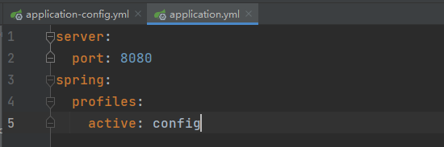

此时对于一个JavaBean来说，我们可以使用@ConfigurationProperties注入这个phone实体，此时就不需要再用@value注解来单独注入实体的属性，==但是要注意配置实体和实体类的属性一定是要相同的==：

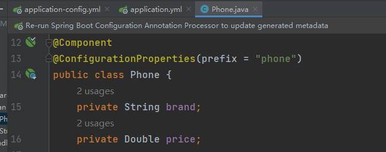

**==其实这个方法就是将实体类再次封装，可能这里就会认为再次封装实体类的意义并不大，如果涉及到一些类似于调制API，或者建立支付功能的时候，会涉及到非常多的原始参数，此时这个自动封装的功能就显得十分重要；==**

## 7.4.==整合SpringMVC==

### 7.4.1.简单介绍lombok

这里介绍一个关于简化JavaBean的插件，叫做lombok，他在2020年之前一直作为一个独立插件存在于IDEA中，但是之后就被Jetbrain整合在了IDEA里面，但是我们依旧需要导入他的依赖；

```java
<dependency>
    <groupId>org.projectlombok</groupId>
    <artifactId>lombok</artifactId>
</dependency>
```

导入之后我们创建一个Student对象：

```java
package top.sharehome.springboot02mvc.bean;

import lombok.AllArgsConstructor;
import lombok.Data;
import lombok.NoArgsConstructor;

/**
 * @Description
 * @Author:AntonyCheng
 * @CreateTime:2022/11/1 09:42
 * lombok常用注解:
 * 1.@Getter:自动创建getter方法
 * 2.@Setter:自动创建Setter方法
 * 3.@ToString:自动创建toString方法
 * 4.@EqualsAndHashCode:自动创建EqualsAndHashCode方法
 * ！！有一个注解可以将前四个全部包含 @Data ！！
 * 5.@AllArgsConstructor:自动创建全参构造器
 * 6.@NoArgsConstructor:自动创建无参构造器
 */
@Data
@AllArgsConstructor
@NoArgsConstructor
public class Student {
    private String name;
    private Integer age;
}
```

### 7.4.2.整合MVC

首先我们需要导入thymeleaf的依赖：

```xml
<!-- 在Web和DevTools的基础上我们还需要加入thymeleaf引擎驱动 -->
<dependency>
	<groupId>org.springframework.boot</groupId>
	<artifactId>spring-boot-starter-thymeleaf</artifactId>
</dependency>
```

然后我们确认一下有关于thymeleaf的默认配置（ThymeleafProperties.class）：

```java
@ConfigurationProperties(
    prefix = "spring.thymeleaf"
)
public class ThymeleafProperties {
    private static final Charset DEFAULT_ENCODING;
    public static final String DEFAULT_PREFIX = "classpath:/templates/";
    public static final String DEFAULT_SUFFIX = ".html";
    private boolean checkTemplate = true;
    private boolean checkTemplateLocation = true;
    private String prefix = "classpath:/templates/";
    private String suffix = ".html";
    private String mode = "HTML";
    private Charset encoding;
    private boolean cache;
    private Integer templateResolverOrder;
    private String[] viewNames;
    private String[] excludedViewNames;
    private boolean enableSpringElCompiler;
    private boolean renderHiddenMarkersBeforeCheckboxes;
    private boolean enabled;
    private final Servlet servlet;
    private final Reactive reactive;
    ...
```

我们直接使用它的默认配置即可，但是这里我们需要简单解读一下以上的内容：

- cache属性就是缓存，这个需要我们在application中手动更改为false

  ```yml
  spring:
    thymeleaf:
      cache: false
  ```

- prefix属性：链接的前缀，和以往不同的是，springboot中更愿意把html页面这样的静态文件放在类目录，而不是WEB-INF目录；

- suffix属性：链接的后缀；

- encoding属性：默认会是UTF-8，总之不再需要我们去纠结请求相应的编码问题；

- springboot中默认首页是`/index`和`/`，所以我们的首页需要有别于以前的`portal`

- springboot中已经就确定了静态资源的访问权限，也不需要我们再去纠结，==这一点下一小节会有解释==；

有了以上源码总结，我们需要改变一些以往的习惯，照常编写代码即可；

**引入后创建JavaBean：**

```java
package top.sharehome.springboot02mvc.bean;

import lombok.AllArgsConstructor;
import lombok.Data;
import lombok.NoArgsConstructor;

/**
 * @Description
 * @Author:AntonyCheng
 * @CreateTime:2022/11/1 09:42
 */
@Data
@AllArgsConstructor
@NoArgsConstructor
public class Student {
    private String name;
    private Integer age;
}
```

**创建Handler：**

```java
package top.sharehome.springboot02mvc.handler;

import org.springframework.stereotype.Controller;
import org.springframework.ui.Model;
import org.springframework.web.bind.annotation.GetMapping;
import top.sharehome.springboot02mvc.bean.Student;

/**
 * @Description
 * @Author:AntonyCheng
 * @CreateTime:2022/11/1 09:47
 */
@Controller
public class StudentHandler {

    @GetMapping("/getStudent")
    public String getStudent(Model model) {
        Student student = new Student();
        student.setName("小明");
        student.setAge(21);
        System.out.println(student.toString());
        model.addAttribute("student", student);
        return "result";
    }
}
```

**查看测试效果：**


## 7.5.访问静态资源

**上一小节我们提到一点，那就是我们的前端页面需要改变为静态资源，那么在SpringBoot框架下，如果进行静态资源的放行的呢？**

我们可以找到如下源码：

```java
@ConfigurationProperties("spring.web")
public class WebProperties {
    private Locale locale;
    private LocaleResolver localeResolver;
    private final Resources resources;

    public WebProperties() {
        this.localeResolver = WebProperties.LocaleResolver.ACCEPT_HEADER;
        this.resources = new Resources();
    }

    public Locale getLocale() {
        return this.locale;
    }

    public void setLocale(Locale locale) {
        this.locale = locale;
    }

    public LocaleResolver getLocaleResolver() {
        return this.localeResolver;
    }

    public void setLocaleResolver(LocaleResolver localeResolver) {
        this.localeResolver = localeResolver;
    }

    public Resources getResources() {
        return this.resources;
    }

    public static class Resources {
        private static final String[] CLASSPATH_RESOURCE_LOCATIONS = new String[]{"classpath:/META-INF/resources/", "classpath:/resources/", "classpath:/static/", "classpath:/public/"};
        private String[] staticLocations;
        private boolean addMappings;
        private boolean customized;
        private final Chain chain;
        private final Cache cache;

        public Resources() {
            this.staticLocations = CLASSPATH_RESOURCE_LOCATIONS;
            this.addMappings = true;
            this.customized = false;
            this.chain = new Chain();
            this.cache = new Cache();
        }
        ...
```

上面有一个**`private static final String[] CLASSPATH_RESOURCE_LOCATIONS = new String[]{"classpath:/META-INF/resources/", "classpath:/resources/", "classpath:/static/", "classpath:/public/"};`**，这个字符串数组中的内容就是SpringBoot放行的静态资源目录，在需要访问资源时会先扫描这些==放行目录==；

**放行这一功能完成了，那么我们需要将这些资源做路径映射，不然这些资源不能出现在浏览器访问栏中，那么SpringBoot是如何对静态资源做映射的呢？**

我们可以找到如下源码：

```java
@ConfigurationProperties(
    prefix = "spring.mvc"
)
public class WebMvcProperties {
    private DefaultMessageCodesResolver.Format messageCodesResolverFormat;
    private final Format format = new Format();
    private boolean dispatchTraceRequest = false;
    private boolean dispatchOptionsRequest = true;
    private boolean ignoreDefaultModelOnRedirect = true;
    private boolean publishRequestHandledEvents = true;
    private boolean throwExceptionIfNoHandlerFound = false;
    private boolean logRequestDetails;
    private boolean logResolvedException = false;
    private String staticPathPattern = "/**";
    private final Async async = new Async();
    private final Servlet servlet = new Servlet();
    private final View view = new View();
    private final Contentnegotiation contentnegotiation = new Contentnegotiation();
    private final Pathmatch pathmatch = new Pathmatch();
    ...
```

上面有一个`private String staticPathPattern = "/**";`，这个属性就是默认的映射路径，`/**`表示我们可以直接通过资源名来访问他们，比如我要访问一张图片`1.jpg`，那么我们可以直接通过`http://localhost:8080/1.jpg`就能够访问到，前提就是这张图片必须包含在放行目录中；

如果我们需要改变这些值，那么可以在application.yml文件中进行更改：

```yml
spring:
  web:
    resources:
      static-locations: /XXX #这里写放行路径
  mvc:
    static-path-pattern: /picture/** #这里写访问映射路径，这个路径就需要在资源名之前加上/picture/
```

但是我们能用框架默认的就好，非不得已不要进行对框架规则的修改；

**==也就是说静态资源实际上需要放在方形放行中，通过访问映射路径进行访问；==**

## 7.6.配置拦截器

### 7.6.1.简短介绍

配置拦截器之前我们需要明白SpringBoot的一个理念，那就是让开发者更加注重于代码本身，而不是复杂而又多样的配置文件，因此我们把这一理念贯穿至配置拦截中，我们就需要用Java代码去配置拦截器；

拦截器对象需要继承**HandlerInterceptor**类，并且重写三大拦截器方法：

preHandle会在控制器方法前执行；

```java
default boolean preHandle(HttpServletRequest request, HttpServletResponse response, Object handler) throws Exception {
    return true;
}
```

postHandle会在控制器方法执行后，且在解析视图之前执行；

```java
default void postHandle(HttpServletRequest request, HttpServletResponse response, Object handler, @Nullable ModelAndView modelAndView) throws Exception {
}
```

afterCompletion会在视图渲染结束后执行；

```java
default void afterCompletion(HttpServletRequest request, HttpServletResponse response, Object handler, @Nullable Exception ex) throws Exception {
}
```

**这里简单说一下拦截器工作原理：**

一个拦截器，只有preHandle方法返回true，postHandle、afterCompletion才有可能被执行；如果preHandle方法返回false，则该拦截器的postHandle、afterCompletion必然不会被执行。拦截器不是Filter，却实现了Filter的功能，其原理在于：

- 所有的拦截器(Interceptor)和处理器(Handler)都注册在HandlerMapping中。
- Spring MVC中所有的请求都是由DispatcherServlet分发的。
- 当请求进入DispatcherServlet.doDispatch()时候，首先会得到处理该请求的Handler（即Controller中对应的方法）以及所有拦截该请求的拦截器。拦截器就是在这里被调用开始工作的。

拦截器本质上是面向切面编程（AOP），符合横切关注点的功能都可以放在拦截器中来实现，主要的**应用场景**包括：

登录验证，判断用户是否登录。权限验证，判断用户是否有权限访问资源，如校验token日志记录，记录请求操作日志（用户ip，访问时间等），以便统计请求访问量。处理cookie、本地化、国际化、主题等。性能监控，监控请求处理时长等。

### 7.6.2.拦截器使用

首先和往常一样，我们需要一个拦截器的包：


然后创建一个继承了HandlerInterceptor接口的拦截器类；

```java
package top.sharehome.springboot02mvc.interceptor;

import org.springframework.core.annotation.Order;
import org.springframework.stereotype.Component;
import org.springframework.web.servlet.HandlerInterceptor;
import org.springframework.web.servlet.ModelAndView;

import javax.servlet.http.HttpServletRequest;
import javax.servlet.http.HttpServletResponse;

/**
 * @Description
 * @Author:AntonyCheng
 * @CreateTime:2022/11/1 14:09
 */
@Component
public class SpringBootInterceptor implements HandlerInterceptor {
    @Override
    public boolean preHandle(HttpServletRequest request, HttpServletResponse response, Object handler) throws Exception {
        System.out.println("___preHandle___");
        return true;
    }

    @Override
    public void postHandle(HttpServletRequest request, HttpServletResponse response, Object handler, ModelAndView modelAndView) throws Exception {
        System.out.println("___postHandle___");
    }

    @Override
    public void afterCompletion(HttpServletRequest request, HttpServletResponse response, Object handler, Exception ex) throws Exception {
        System.out.println("___afterCompletion___");
    }
}
```

和以往不同的是，我们需要创建一个配置类，专门来配置这个拦截器的拦截路径，为了方便，我们以后将所有的配置类放在一个配置包下：


这个配置类隶属于对SpringMVC的配置，所以需要实现一个WebMvcConfigurer/WebMvcConfigurationSupport接口（谁能起作用用谁），并且用@Configuration注解标记这个配置类，以便于组件化；

```java
package top.sharehome.springboot02mvc.config;

import org.springframework.beans.factory.annotation.Autowired;
import org.springframework.context.annotation.Configuration;
import org.springframework.web.servlet.config.annotation.InterceptorRegistry;
import org.springframework.web.servlet.config.annotation.WebMvcConfigurer;
import top.sharehome.springboot02mvc.interceptor.SpringBootInterceptor;

/**
 * @Description
 * @Author:AntonyCheng
 * @CreateTime:2022/11/1 14:13
 */
@Configuration
public class InterceptorConfig implements WebMvcConfigurer {
    @Autowired
    private SpringBootInterceptor interceptor;

    @Override
    public void addInterceptors(InterceptorRegistry registry) {
        // 下面就是向注册器中添加一个拦截器，并且添加拦截的路径
        // “/**”表示所有的路径
        registry.addInterceptor(interceptor).addPathPatterns("/**");
    }
}
```

拦截效果如下：


## 7.7.==整合JDBC==

当我们使用IDEA创建项目时就应该将JDBC勾上，

首先我们需要导入druid连接池的依赖：

```xml
<!-- 在JDBC和DevTools基础上我们还需要加入druid连接池 -->
<dependency>
    <groupId>com.alibaba</groupId>
    <artifactId>druid-spring-boot-starter</artifactId>
    <version>1.2.14</version>
</dependency>
```

以往的SSM项目中都是利用XML的配置文件进行单独的配置：

```properties
sharehome.dev.driverClassName=com.mysql.cj.jdbc.Driver
sharehome.dev.url=jdbc:mysql://localhost:3306/springboot?useSSL=false&serverTimezone=UTC&characterEncoding=UTF-8&allowMultiQueries=true&allowPublicKeyRetrieval=true
sharehome.dev.username=root
sharehome.dev.password=123456
```

```xml
<!-- 连接数据库 -->
<!-- 首先导入外部jdbc.properties文件数据 -->
<context:property-placeholder location="classpath:jdbc.properties"/>
<!-- 配置数据源 -->
<bean id="druidDataSource" class="com.alibaba.druid.pool.DruidDataSource">
    <property name="url" value="${sharehome.dev.url}"/>
    <property name="username" value="${sharehome.dev.username}"/>
    <property name="password" value="${sharehome.dev.password}"/>
    <property name="driverClassName" value="${sharehome.dev.driverClassName}"/>
</bean>
<!-- 配置JdbcTemplate -->
<bean id="jdbcTemplate" class="org.springframework.jdbc.core.JdbcTemplate">
    <!-- 装配数据源 -->
    <property name="dataSource" ref="druidDataSource"/>
</bean>
```

但是现在仅仅需要在application.yml中进行即可：

```yaml
spring:
  datasource:
    druid:
      username: root
      password: 123456
      url: jdbc:mysql://localhost:3306/springboot?useSSL=false&serverTimezone=UTC&characterEncoding=UTF-8&allowMultiQueries=true&allowPublicKeyRetrieval=true
      driver-class-name: com.mysql.cj.jdbc.Driver
      max-active: 20
      initial-size: 10
      min-idle: 2
      max-wait: 1000
```

然后进行建表：


随后我们测试即可：

```java
package com.example.springboot03jdbc;

import org.junit.jupiter.api.Test;
import org.springframework.beans.factory.annotation.Autowired;
import org.springframework.boot.test.context.SpringBootTest;
import org.springframework.jdbc.core.JdbcTemplate;

import javax.sql.DataSource;
import java.sql.SQLException;

@SpringBootTest
class SpringBoot03JdbcApplicationTests {
    @Autowired
    private JdbcTemplate jdbcTemplate;

    @Test
    void contextLoads() throws SQLException {
        jdbcTemplate.update("insert into t_user(username,password) values(?,?)", "1911261716", "123456");
    }

}
```

测试结果如下：


## 7.8.==整合Mybatis==

这里的整合Mybatis和以往不一样，为了搭配SpringBoot的方便，我们进一步简化咱们的操作，整合Mybatis的同时也将逆向工程整合进去；

首先是导入一些必要的依赖，在引入JDBC和DevTools以及导入连接池的基础上再添加Mybatis的相关依赖和逆向工程的插件：

```xml
<!-- 整合mybatis相关依赖 -->
<dependency>
    <groupId>org.mybatis.spring.boot</groupId>
    <artifactId>mybatis-spring-boot-starter</artifactId>
    <version>2.2.2</version>
</dependency>
<build>
    <plugins>
        <!-- 逆向生成条件插件 -->
        <plugin>
            <groupId>org.mybatis.generator</groupId>
            <artifactId>mybatis-generator-maven-plugin</artifactId>
            <version>1.4.0</version>
            <dependencies>
                <dependency>
                    <groupId>mysql</groupId>
                    <artifactId>mysql-connector-java</artifactId>
                    <version>8.0.30</version>
                </dependency>
            </dependencies>
        </plugin>
    </plugins>
</build>
```

随后需要建立一个逆向工程配置文件，名字必须是generatorConfig.xml：

```xml
<?xml version="1.0" encoding="UTF-8"?>
<!DOCTYPE generatorConfiguration
        PUBLIC "-//mybatis.org//DTD MyBatis Generator Configuration 1.0//EN"
        "http://mybatis.org/dtd/mybatis-generator-config_1_0.dtd">
<generatorConfiguration>
    <!--
            targetRuntime: 执行生成的逆向工程的版本
                    MyBatis3Simple: 生成基本的CRUD（清新简洁版）
                    MyBatis3: 生成带条件的CRUD（奢华尊享版）
     -->
    <context id="DB2Tables" targetRuntime="MyBatis3">
        <!-- 数据库的连接信息 -->
        <jdbcConnection driverClass="com.mysql.cj.jdbc.Driver"
                        connectionURL="jdbc:mysql://localhost:3306/XXX?useSSL=false&amp;serverTimezone=UTC&amp;characterEncoding=UTF-8&amp;allowMultiQueries=true"
                        userId="root"
                        password="">
        </jdbcConnection>
        <!-- javaBean的生成策略-->
        <javaModelGenerator targetPackage="XXX.XXX.bean" targetProject=".\src\main\java">
            <!-- enableSubPackages:是否让schema作为包的后缀 -->
            <property name="enableSubPackages" value="false"/>
            <property name="trimStrings" value="true"/>
        </javaModelGenerator>
        <!-- SQL映射文件的生成策略 -->
        <sqlMapGenerator targetPackage="mapper" targetProject=".\src\main\resources">
            <!-- enableSubPackages:是否让schema作为包的后缀 -->
            <property name="enableSubPackages" value="false"/>
        </sqlMapGenerator>
        <!-- Mapper接口的生成策略 -->
        <javaClientGenerator type="XMLMAPPER" targetPackage="XXX.XXX.mapper"
                             targetProject=".\src\main\java">
            <!-- enableSubPackages:是否让schema作为包的后缀 -->
            <property name="enableSubPackages" value="false"/>
        </javaClientGenerator>
        <!-- 逆向分析的表 -->
        <!-- tableName设置为*号，可以对应所有表，此时不写domainObjectName -->
        <!-- domainObjectName属性指定生成出来的实体类的类名 -->
        <!-- schema属性指定表所在的数据库名 -->
        <table tableName="t_user" schema="springboot" domainObjectName="User"/>
    </context>
</generatorConfiguration>
```

其次开始逆向工程：


逆向完成之后开始配置application.yml文件：

```yaml
#mybatis相关配置
mybatis:
  type-aliases-package: XXX.XXX.bean  #取别名，需要JavaBean的包路径
  mapper-locations: classpath:mapper/*.xml #指出mapper配置文件地址

#mybatis输出执行的sql语句
logging:
  level:
    com:
      example:
        springboot03jdbc:
          mapper: debug
```

以上工作都完成后，还要记得补充一个必要的注解，我们要谨记在SSM框架中扫描包的特性，一共有三个部分需要我们去扫描，第一个是表述层handler，第二个是业务逻辑层service，这两个包的扫描由SpringBoot完成，但是第三个持久层mapper需要我们手动去设置；

```java
package com.example.springboot03jdbc;

import org.mybatis.spring.annotation.MapperScan;
import org.springframework.boot.SpringApplication;
import org.springframework.boot.autoconfigure.SpringBootApplication;

@SpringBootApplication
//在启动类上进行Mapper的扫描；
@MapperScan("XXX.XXX.mapper")
public class SpringBoot03JdbcApplication {

   public static void main(String[] args) {
      SpringApplication.run(SpringBoot03JdbcApplication.class, args);
   }

}
```

此时此刻，就完成了SpringBoot对Mybatis以及逆向工程的整合，下面就进行类的测试：

```java
package com.example.springboot03jdbc.mapper;

import com.example.springboot03jdbc.bean.User;
import com.example.springboot03jdbc.bean.UserExample;
import org.junit.jupiter.api.Test;
import org.springframework.beans.factory.annotation.Autowired;
import org.springframework.boot.test.context.SpringBootTest;

@SpringBootTest
class UserMapperTest {
    @Autowired
    private UserMapper userMapper;

    @Test
    public void testInsert() {
        userMapper.insert(new User("3066170893", "123456"));
    }

    @Test
    public void testSelect() {
        //这里是逆向工程中的新东西，当需要条件查询时，就需要XXXExample对象
        UserExample userExample = new UserExample();
        //这里要创建XXXExample对象中的一个内部类对象，这个对象里有许许多多见名知意的方法可以直接使用，当然当没有合适的方法时，也可以手动去补充，这个是我们以前干的事情；
        UserExample.Criteria criteria = userExample.createCriteria();
        criteria.andUserNameEqualTo("3066170893");
        userMapper.selectByExample(userExample).forEach(c -> System.out.println(c.getUserName() + ":" + c.getUserPassword()));
    }
}
```

测试效果如下：


## 7.9.整合Redis

看看文件结构：


首先整合Redis需要相关的依赖，所以我们先要导入：

```xml
<!-- 整合Redis相关依赖 -->
<dependency>
    <groupId>org.springframework.boot</groupId>
    <artifactId>spring-boot-starter-data-redis</artifactId>
</dependency>
```

然后需要在application.yml配置文件中进行关于Redis的配置：

```yaml
#druid相关配置
spring:
  redis:
    database: 1  #Redis16个数据库（0-15）里选一个数
    host:   #主机端口
    jedis:
      pool:
        max-wait: 5000 #最大等待时长
    password:     #Redis访问密码
    port: 6379   #Redis端口号
```

做到这里，配置工作就告已结束，如果我们想提高我们的开发效率，应该要有一个处理Redis的工具类：

```java
package top.sharehome.consumer.utils;

import org.springframework.beans.factory.annotation.Autowired;
import org.springframework.data.redis.core.RedisTemplate;
import org.springframework.stereotype.Component;
import org.springframework.util.StringUtils;

import java.util.concurrent.TimeUnit;

/**
 * @Description Redis工具类，为了方便操作Redis
 * @Author:AntonyCheng
 * @CreateTime:2022/11/1 23:42
 */
@Component
public class RedisUtils {
    @Autowired
    private RedisTemplate<String, Object> redisTemplate;

    /**
     * 向Redis中存入String类型数据
     *
     * @param key
     * @param value
     * @return
     */
    public boolean set(String key, Object value) {
        try {
            redisTemplate.opsForValue().set(key, value);
        } catch (Exception e) {
            e.printStackTrace();
            return false;
        }
        return true;
    }

    /**
     * 根据key去除Redis中的String类型数据
     *
     * @param key
     * @return
     */
    public Object get(String key) {
        return StringUtils.isEmpty(key) ? null : redisTemplate.opsForValue().get(key);
    }

    /**
     * 向Redis中存入Hash类型数据
     *
     * @param key
     * @param field
     * @param value
     * @return
     */
    public boolean hset(String key, Object field, Object value) {
        try {
            redisTemplate.opsForHash().put(key, field, value);
        } catch (Exception e) {
            e.printStackTrace();
            return false;
        }
        return true;
    }

    /**
     * 根据key取出Redis中的Hash类型数据
     *
     * @param key
     * @param
     * @return
     */
    public Object hget(String key, Object field) {
        return StringUtils.isEmpty(key) ? null : redisTemplate.opsForHash().get(key, field);
    }

    /**
     * 根据key去删除对应的数据
     *
     * @param key
     */
    public void del(String key) {
        redisTemplate.delete(key);
    }

    /**
     * 判断key是否存在
     *
     * @param key
     * @return
     */
    public boolean exist(String key) {
        try {
            return redisTemplate.hasKey(key);
        } catch (Exception e) {
            e.printStackTrace();
            return false;
        }
    }

    /**
     * 为某个key设置过期时间
     *
     * @param key
     * @param timeout
     * @return
     */
    public boolean expire(String key, long timeout) {
        try {
            return redisTemplate.expire(key, timeout, TimeUnit.SECONDS);
        } catch (Exception e) {
            return false;
        }
    }

    /**
     * 查看key剩余的存活时间
     *
     * @param key
     * @return
     */
    public long ttl(String key) {
        return redisTemplate.getExpire(key, TimeUnit.SECONDS);
    }
}
```

为了扩展Redis的兼容性，我们需要写一个序列化数据的配置类，这个主要 解决了redis乱码问题：

```java
package com.example.springboot03jdbc.config;

import org.springframework.beans.factory.annotation.Autowired;
import org.springframework.context.annotation.Bean;
import org.springframework.context.annotation.Configuration;
import org.springframework.data.redis.connection.RedisConnectionFactory;
import org.springframework.data.redis.core.RedisTemplate;
import org.springframework.data.redis.serializer.RedisSerializer;
import org.springframework.data.redis.serializer.StringRedisSerializer;

import java.net.UnknownHostException;

/**
 * @Description 底层Redis的自动配置中 @ConditionalOnMissingBean(name = "redisTemplate")
 *              会检测Spring容器中是否有一个id为redisTemplate的Bean，如果有，那就用现成的，不
 *              使用默认配置去初始化，如果没有，就用默认配置初始化
 * @Author:AntonyCheng
 * @CreateTime:2022/11/2 00:18
 */
@Configuration
public class RedisConfig {
    @Autowired
    private RedisTemplate redisTemplate;

    @Bean
    public RedisTemplate<String, Object> stringSerializerRedisTemplate(){
        RedisSerializer<String> stringSerializer = new StringRedisSerializer();
        redisTemplate.setKeySerializer(stringSerializer);
        redisTemplate.setValueSerializer(stringSerializer);
        redisTemplate.setHashKeySerializer(stringSerializer);
        redisTemplate.setHashValueSerializer(stringSerializer);
        return redisTemplate;
    }
}

```

此时，我们就可以对工具类做测试：

```java
package com.example.springboot03jdbc.utils;

import org.junit.jupiter.api.Test;
import org.springframework.beans.factory.annotation.Autowired;
import org.springframework.boot.test.context.SpringBootTest;

@SpringBootTest
class RedisUtilsTest {
    @Autowired
    private RedisUtils redisUtils;

    @Test
    public void testSet() {
        redisUtils.set("gender", "female");
    }
}
```

测试效果如下：

测试之前：


测试之后：


## 7.10.上线CentOS

和以往一样将模块或者项目使用Maven进行打包操作，和以往不一样的就是打包后得到的是一个Jar包，但是这个Jar包是一个可执行的Jar包，所以i我们将其上传至服务器后，只需要该服务器上安装有Java环境，就能够使用 `java -jar 包名` 对其进行执行，届时我们就能够获取得到执行后的服务端口，访问即可；

# 8.Dubbo+Zookeeper（Apache版本）

**==注意：本次dubbo架构使用的是apache版本，而不是alibaba版本==**

## 8.1.系统架构

系统架构是指系统研发中，负责根据需求确定主要的技术选型，主要的开发工具，设计系统的整体框架结构；

### 8.1.1.单体式架构

单体式架构（All In One），一个程序就是一个项目，所有的功能都在这个程序中；

**优点：**结构简单，容易部署；

**缺点：**不利于协作开发，可拓展性极差，后期维护及其麻烦；

**总结：**适合于非常小的项目，后期也不做拓展的架构


### 8.1.2.垂直式架构

垂直式架构将整个系统模块化，相关联功能归类在一起，并且按模块进行部署；

**优点：**可以针对某一个或者某一块功能进行优化；

**缺点：**子系统之间可能会存在冗余代码，提高了耦合性；


### 8.1.3.SOA架构

SOA（Service Oriented Architecture）面向服务架构，见名知意，就是每一个具体的服务作为一个功能，上线不同的服务器，例如嘀嘀打车中用户管理服务，订单服务，支付服务等，当各个系统需要调用哪个服务时，直接去不同服务器调取即可；

**优点：**重复的功能抽取成了一个单独的服务，面向服务去构建每个系统；

**缺点：**服务之间界定较为困难；

**特点：**每个服务的抽取力度较大，这也区别于微服务；


### 8.1.4.微服务架构

2014年，Martin Fowler与 James Lewis共同提出了微服务的概念，**定义了微服务是由以单一应用程序构成的小服务，自己拥有自己的进程与轻量化处理，服务依业务功能设计，以全自动的方式部署，与其他服务使用HTTP API通信。**同时服务会使用最小的规模的集中管理 (例如 Docker) 能力，服务可以用不同的编程语言与数据库等组件实现；微服务讲究的是服务的高度独立性和衔接性，分工明确，针对性极强；

**优点：**目前最主流的架构之一，分工明确，高独立性；

**缺点：**由于语言和数据库可能不统一，数据库也更加细分，那么运维工作就大大增加；


## 8.2.Dubbo与Zookeeper

### 8.2.1.RPC概述

RPC（Remote Procedure Call）：远程过程调用，它是一种通过网络从远程计算机程序上请求服务，而不需要了解底层网络技术的思想，A服务器上的应用程序想调用B服务器上的方法，A如何告诉B？B又如何反馈给A结果？这个通信过程通常考虑使用RPC思想：

RPC是一种技术思想而非一种规范或协议，常见RPC技术和框架有如下：

- 应用级的服务框架：阿里的**Dubbo**/Dubbox，Google的gRPC，SpringBoot/**SpringCloud**
- 远程通信协议：RMI，Socket（套接字），SOAP（HTTP XML），**REST（HTTP JSON）**
- 通信框架：MINA和**Netty**


### 8.2.2.Dubbo概述

Dubbo是一款高性能，轻量级的开源Java RPC框架，其前身是阿里巴巴开源的一个高性能，轻量级的Java RPC框架，可以和Spring框架无缝集成；

它拥有了**三大核心能力：面向接口的远程方法调用，智能容错和负载均衡**（Nginx网页服务器也是一个负载均衡服务器），以及服务自动注册和发现；

### 8.2.3.Dubbo原理

**`init`:初始化**

**`async`:异步**

**`sync`:同步**

**`Consumer`:消费者**--------调用远程服务的服务消费方

**`Provider`:提供者**--------暴露服务的服务提供方

**`Register`:注册中心**--------服务注册和发现的注册中心

**`Container`:容器**--------服务运行容器

**`Monitor`:监管者**--------统计服务的调用次数和调用时间的监管者


原理就是容器先开启提供者（初始化操作），提供者去注册中心进行注册服务（初始化操作），此时注册中心的服务列表就有一个服务，消费者去注册中心描述自己的需求（初始化操作），注册中心就通知消费者说有这样一个服务（异步响应），消费者获得通知后进而让消费者执行这个服务（同步响应），监管者会监控服务的调度次数（异步响应）；

### 8.2.4.Zookeeper注册中心

#### 8.2.4.1.注册中心介绍

- zookeeper

  zookeeper是一个分布式服务框架，是Apache Hadoop的一个子项目，它主要是用来解决分布式应用中经常遇到的一些数据同意管理问题，简单来说zookeeper=文件系统+监听通知机制，常常用来作为Dubbo的注册中心；

- Eureka

  Eureka是Netflix开源的一款提供服务注册和发现的产品，它提供了完整的Service Register和Service Discovery实现。也是SpringCloud体系中最重要最核心的组件之一；

- Consul

  Consul是由HashCorp基于Go语言开发的支持多数据中心分布式高可用的服务发布和注册服务软件，采用Raft算法保证服务的一致性，且支持健康检查；

#### 8.2.4.2.Zookeeper的目录结构

Zookeeper的目录结构：


流程说明：

- 服务提供者（Provider）启动时：向/dubbo/com/foo/BarService/providers目录下写入自己的地址；
- 服务消费者（Consumer）启动时：订阅/dubbo/com/foo/BarService/providers目录下的提供者地址。并向/dubbo/com/foo/BarService/consumers目录下写入自己的地址；
- 监管者启动时：订阅/dubbo/com/foo/BarService目录下的所有提供者和消费者地址；

### 8.2.5.Zookeeper的安装与启动

https://zookeeper.apache.org/releases.html


尽量不要下载最新版本；

先下载到CentOS上，然后进行解压，随后进入解压后的目录，这里假设为/opt/zoo；

解压后我们需要完成如下操作：

首先在**/opt/zoo**下建立一个目录**data**，然后修改**/opt/zoo/bin**目录下的**zoo_example.cfg**文件名为**zoo.cfg**文件名，再修改**zoo.cfg**文件，让**dataDir=/opt/zoo/data**；

操作完之后，我们需要启动zookeeper注册中心；

进入到**/opt/zoo/bin**目录，启动**zkServer.sh**文件 **`./zkServer.sh start`** 即可；

当然关闭用 **`./zkServer.sh stop`**；

查看状态用 **`./zkServer.sh status`**；

**最后还要开放指定的端口：**

```
1、开启防火墙
systemctl start firewalld

2、开放指定端口6666
firewall-cmd --zone=public --add-port=6666/tcp --permanent
--add-port=portid[-portid]/protocol
命令含义：
--zone #作用域
--add-port=6666/tcp #添加端口，格式为：端口/通讯协议
--permanent #永久生效，没有此参数重启后失效

3、重启防火墙
firewall-cmd --reload

4、查看端口号
netstat -ntlp //查看当前所有tcp端口·
```

### 8.2.6.初次实现分布式

首先开启linux上的zookeeper注册中心，假设linux的ip地址为`1.2.3.4`，在此基础上使用IDEA初始化一个SpringBoot工程，工程的结构如下：


首先需要在 pom.xml 中添加有关于 dubbo 的依赖：

```xml
<?xml version="1.0" encoding="UTF-8"?>
<project xmlns="http://maven.apache.org/POM/4.0.0" xmlns:xsi="http://www.w3.org/2001/XMLSchema-instance"
         xsi:schemaLocation="http://maven.apache.org/POM/4.0.0 https://maven.apache.org/xsd/maven-4.0.0.xsd">
    <modelVersion>4.0.0</modelVersion>
    <parent>
        <groupId>org.springframework.boot</groupId>
        <artifactId>spring-boot-starter-parent</artifactId>
        <version>2.7.5</version>
        <relativePath/> <!-- lookup parent from repository -->
    </parent>
    <groupId>com.example</groupId>
    <artifactId>SpringDubbo</artifactId>
    <version>0.0.1-SNAPSHOT</version>
    <name>SpringDubbo</name>
    <description>SpringDubbo</description>
    <properties>
        <java.version>1.8</java.version>
    </properties>
    <dependencies>
        <dependency>
            <groupId>org.springframework.boot</groupId>
            <artifactId>spring-boot-starter-web</artifactId>
        </dependency>
        <dependency>
            <groupId>org.springframework.boot</groupId>
            <artifactId>spring-boot-starter-test</artifactId>
            <scope>test</scope>
        </dependency>
        
        <!-- dubbo依赖 -->
        <dependency>
            <groupId>org.apache.dubbo</groupId>
            <artifactId>dubbo-spring-boot-starter</artifactId>
            <version>3.1.1</version>
        </dependency>
        <dependency>
            <groupId>org.apache.dubbo</groupId>
            <artifactId>dubbo-registry-zookeeper</artifactId>
            <version>3.1.1</version>
        </dependency>
        
    </dependencies>
    <build>
        <plugins>
            <plugin>
                <groupId>org.springframework.boot</groupId>
                <artifactId>spring-boot-maven-plugin</artifactId>
            </plugin>
        </plugins>
    </build>
</project>
```

以后面向模块化建设项目时，这个文件将是父工程中的 pom.xml 文件的一部分，随后我们需要删除原有的 Application 启动类，同时建立消费者和提供者的两个包（对其进行区分），在包中创建各自的 Application 启动类：


**ProviderApplication类：**

```java
package com.example.springdubbo.provider;

import org.apache.dubbo.config.annotation.DubboService;
import org.apache.dubbo.config.spring.context.annotation.EnableDubbo;
import org.springframework.boot.SpringApplication;
import org.springframework.boot.autoconfigure.SpringBootApplication;

/**
 * @Description
 * @Author:AntonyCheng
 * @CreateTime:2022/11/3 18:55
 */
@SpringBootApplication
@EnableDubbo
public class ProviderApplication {
    public static void main(String[] args) {
        SpringApplication.run(ProviderApplication.class, args);
    }
}
```

提供者的启动类应该被 **==@EnableDubbo==** 注解所标记；

**ConsumerApplication类：**

```java
package com.example.springdubbo.comsumer;

import org.springframework.boot.SpringApplication;
import org.springframework.boot.autoconfigure.SpringBootApplication;

/**
 * @Description
 * @Author:AntonyCheng
 * @CreateTime:2022/11/3 18:52
 */
@SpringBootApplication
public class ConsumerApplication {
    public static void main(String[] args) {
        SpringApplication.run(ComsumerApplication.class, args);
    }
}
```

两个角色启动类创建好后，就去配置各自的application配置文件，这个配置文件名依旧需要**满足application配置名的要求，即使用 application-* 形式**，但是我们需要IDEA为我们自动匹配各自对应的配置文件（这里以提供者的启动类为例）：

首先右键启动类，选择如下图的选项：


然后写入如下图的配置，这里就体现了按照形式命名配置文件的优势，只需要填入 ***** 部分内容即可：


消费者的启动类也需要这么配置；

完成文件之间的匹配之后，我们需要进行application配置文件的书写，主要书写内容是本地服务器的端口号以及dubbo的程序名：

application-provider.yml：

```yaml
server:
  port: 8080
dubbo:
  application:
    name: provider-app
```

application-consumer.yml：

```java
server:
  port: 8081
dubbo:
  application:
    name: consumer-app
```

其实配置到这一步，我们就可以完成脱离zookeeper时项目单独的运行，所以下一步我们需要将每个角色绑定在zookeeper上，即为每个角色配置zookeeper的地址和端口：

继续在application配置文件中做配置：

application-provider.yml：

```yaml
server:
  port: 8080
dubbo:
  application:
    name: provider-app
  registry:
    address: zookeeper://1.2.3.4:2181
```

application-consumer.yml：

```yaml
server:
  port: 8081
dubbo:
  application:
    name: consumer-app
  registry:
    address: zookeeper://1.2.3.4:2181
```

以上准备工作完成以后，我们需要写一些Java代码去进行验证：

首先按设置一个api接口：


TimeService.java：

```java
package com.example.springdubbo.common.service.api;

import java.time.LocalDateTime;

/**
 * @Description
 * @Author:AntonyCheng
 * @CreateTime:2022/11/3 19:26
 */

public interface TimeService {
    LocalDateTime getTime();
}
```

然后用提供者去实现这个接口，形成服务并且向zookeeper注册这个服务：


TimeServiceImpl.java

```java
package com.example.springdubbo.provider.impl;

import com.example.springdubbo.common.service.api.TimeService;
import org.apache.dubbo.config.annotation.DubboService;

import java.time.LocalDateTime;

/**
 * @Description
 * @Author:AntonyCheng
 * @CreateTime:2022/11/3 19:27
 */
@DubboService
public class TimeServiceImpl implements TimeService {
    @Override
    public LocalDateTime getTime() {
        return LocalDateTime.now();
    }
}
```

==@DubboService== 注解作用就是初始化时将该服务类向zookeeper进行注册；

下面就要使用消费者去消费这个服务，所以创建一个 handler 去验证这个 service：


Timehandler.java：

```java
package com.example.springdubbo.consumer.handler;

import com.example.springdubbo.common.service.api.TimeService;
import org.apache.dubbo.config.annotation.DubboReference;
import org.springframework.web.bind.annotation.GetMapping;
import org.springframework.web.bind.annotation.RestController;

import java.time.format.DateTimeFormatter;

/**
 * @Description
 * @Author:AntonyCheng
 * @CreateTime:2022/11/3 19:30
 */
@RestController
public class TimeHandler {
    @DubboReference
    private TimeService timeService;

    @GetMapping("/time")
    public String getTime() {
        return timeService.getTime().format(DateTimeFormatter.ISO_DATE_TIME);
    }
}
```

**==@DubboReference==** 注解就是远程引用注册中心中已经注册了的服务；

到此为止，就完成了一个最基本的 Dubbo+zookeeper RPC 的过程，我们可以运行两角色的启动类来进行验证（首先得启动提供者，再启动消费者）：


此时就启动了起来，我们使用 HTTP Request 进行访问：


至此，初次实现了分布式的过程；我们也可以在 linux 系统上查看已经注册过的具体服务：

我们在zookeeper中bin目录下启动zookeeper客户端：


然后我们可以反复使用 ls 指令进行逐级查看：


下一节会有一个更加具体的 dubbo+zookeeper 项目雏形；

### 8.2.7.实现分布式

上面那个示例还不能算是一个完整的分布式，仅仅是在一个工程文件里使用不同进程去远程调用代码，所以看不出来分布式的样式；

所以下面我们分工程来具体说一下分布式项目的一个具体的结构模型；

#### 8.2.7.1.通用工程

这个项目来容纳一些公用的资源，这个项目搭建好之后需要把整个工程打包，安装到本地，下面直接来看项目结构：


**pom.xml文件：**

就是一个普通的maven工程，这个通用类是不需要进行依赖操作的；

```xml
<project xmlns="http://maven.apache.org/POM/4.0.0" xmlns:xsi="http://www.w3.org/2001/XMLSchema-instance"
  xsi:schemaLocation="http://maven.apache.org/POM/4.0.0 http://maven.apache.org/xsd/maven-4.0.0.xsd">
  <modelVersion>4.0.0</modelVersion>

  <groupId>org.example</groupId>
  <artifactId>dubbo-common</artifactId>
  <version>1.0-SNAPSHOT</version>
  <packaging>jar</packaging>

  <name>dubbo-common</name>
  <url>http://maven.apache.org</url>

  <properties>
    <project.build.sourceEncoding>UTF-8</project.build.sourceEncoding>
  </properties>
</project>
```

**Product类：**

其实就是一个JavaBean，但是和普通的相比较，这个JavaBean继承了一个序列化接口Serializable，实现这个接口可以让这个类在二进制和类之间进行相互的转换，具体的用处就是让其能够进行网络传输，以达到RPC的效果；

```java
package com.bigdata.model;

import java.io.Serializable;

/**
 * @Description 实现Serializable接口就是为了让这个类实现序列化和反序列化，就是让他在二进制和类之间转换
 * @Author:AntonyCheng
 * @CreateTime:2022/11/7 14:43
 */

public class Product implements Serializable {
    private String pname;
    private Double price;

    @Override
    public String toString() {
        return getClass().getName() + "{" +
                "pname='" + pname + '\'' +
                ", price=" + price +
                '}';
    }

    public String getPname() {
        return pname;
    }

    public void setPname(String pname) {
        this.pname = pname;
    }

    public Double getPrice() {
        return price;
    }

    public void setPrice(Double price) {
        this.price = price;
    }

    public Product() {
    }

    public Product(String pname, Double price) {
        this.pname = pname;
        this.price = price;
    }
}
```

**ProductService接口：**

仅仅就是一个service.api而已，只不过实现类在远程服务器上；

```java
package com.bigdata.service;

import com.bigdata.model.Product;

/**
 * @Description
 * @Author:AntonyCheng
 * @CreateTime:2022/11/7 14:46
 */

public interface ProductService {
    Product getProduct(Double money);
}
```

**打包操作：**

通用工程创建好之后需要进行安装，就是将它安装到依赖库里，以便于本地调用；

使用maven工具中的install工具就能够简单完成；


#### 8.2.7.2.dubbo远程工程

先看看项目结构：


**父类pom.xml文件：**

用父类的作用就是让服务提供者和服务消费者能够继承这个父类依赖，节省代码量，当然如果以后需要把提供者和服务者部署在不同服务器上，只需要分别添加依赖即可，所以这个就不影响；

```xml
<?xml version="1.0" encoding="UTF-8"?>
<project xmlns="http://maven.apache.org/POM/4.0.0" xmlns:xsi="http://www.w3.org/2001/XMLSchema-instance"
         xsi:schemaLocation="http://maven.apache.org/POM/4.0.0 https://maven.apache.org/xsd/maven-4.0.0.xsd">
    <modelVersion>4.0.0</modelVersion>
    <parent>
        <groupId>org.springframework.boot</groupId>
        <artifactId>spring-boot-starter-parent</artifactId>
        <version>2.7.5</version>
        <relativePath/> <!-- lookup parent from repository -->
    </parent>
    <groupId>com.example</groupId>
    <artifactId>dubbo-springboot</artifactId>
    <version>0.0.1-SNAPSHOT</version>
    <modules>
        <module>dubbo-springboot-provider</module>
        <module>dubbo-springboot-consumer</module>
    </modules>
    <name>dubbo-springboot</name>
    <description>dubbo-springboot</description>
    <packaging>pom</packaging>
    <properties>
        <java.version>1.8</java.version>
    </properties>
    <dependencies>
        <dependency>
            <groupId>org.springframework.boot</groupId>
            <artifactId>spring-boot-starter-web</artifactId>
        </dependency>

        <dependency>
            <groupId>org.springframework.boot</groupId>
            <artifactId>spring-boot-devtools</artifactId>
            <scope>runtime</scope>
            <optional>true</optional>
        </dependency>
        <dependency>
            <groupId>org.springframework.boot</groupId>
            <artifactId>spring-boot-starter-test</artifactId>
            <scope>test</scope>
            <exclusions>
                <exclusion>
                    <groupId>org.junit.vintage</groupId>
                    <artifactId>junit-vintage-engine</artifactId>
                </exclusion>
            </exclusions>
        </dependency>
        <!-- dubbo相关配置 -->
        <dependency>
            <groupId>org.apache.dubbo</groupId>
            <artifactId>dubbo-spring-boot-starter</artifactId>
            <version>3.1.1</version>
        </dependency>
        <dependency>
            <groupId>org.apache.dubbo</groupId>
            <artifactId>dubbo-registry-zookeeper</artifactId>
            <version>3.1.1</version>
        </dependency>
        <!-- 导入安装后的通用项目 -->
        <dependency>
            <groupId>org.example</groupId>
            <artifactId>dubbo-common</artifactId>
            <version>1.0-SNAPSHOT</version>
        </dependency>
    </dependencies>

    <build>
        <plugins>
            <plugin>
                <groupId>org.springframework.boot</groupId>
                <artifactId>spring-boot-maven-plugin</artifactId>
            </plugin>
        </plugins>
    </build>

</project>
```

**provider.pom文件：**

```xml
<?xml version="1.0" encoding="UTF-8"?>
<project xmlns="http://maven.apache.org/POM/4.0.0" xmlns:xsi="http://www.w3.org/2001/XMLSchema-instance"
   xsi:schemaLocation="http://maven.apache.org/POM/4.0.0 https://maven.apache.org/xsd/maven-4.0.0.xsd">
   <modelVersion>4.0.0</modelVersion>
   <parent>
      <groupId>com.example</groupId>
      <artifactId>dubbo-springboot</artifactId>
      <version>0.0.1-SNAPSHOT</version>
      <relativePath/> <!-- lookup parent from repository -->
   </parent>
   <groupId>com.example</groupId>
   <artifactId>dubbo-springboot-provider</artifactId>
   <version>0.0.1-SNAPSHOT</version>
   <name>dubbo-springboot-provider</name>
   <description>dubbo-springboot-provider</description>
   <properties>
      <java.version>1.8</java.version>
   </properties>

   <build>
      <plugins>
         <plugin>
            <groupId>org.springframework.boot</groupId>
            <artifactId>spring-boot-maven-plugin</artifactId>
         </plugin>
      </plugins>
   </build>

</project>
```

**consumer.pom文件：**

```xml
<?xml version="1.0" encoding="UTF-8"?>
<project xmlns="http://maven.apache.org/POM/4.0.0" xmlns:xsi="http://www.w3.org/2001/XMLSchema-instance"
   xsi:schemaLocation="http://maven.apache.org/POM/4.0.0 https://maven.apache.org/xsd/maven-4.0.0.xsd">
   <modelVersion>4.0.0</modelVersion>
   <parent>
      <groupId>com.example</groupId>
      <artifactId>dubbo-springboot</artifactId>
      <version>0.0.1-SNAPSHOT</version>
      <relativePath/> <!-- lookup parent from repository -->
   </parent>
   <groupId>com.example</groupId>
   <artifactId>dubbo-springboot-consumer</artifactId>
   <version>0.0.1-SNAPSHOT</version>
   <name>dubbo-springboot-consumer</name>
   <description>dubbo-springboot-consumer</description>
   <properties>
      <java.version>1.8</java.version>
   </properties>

   <build>
      <plugins>
         <plugin>
            <groupId>org.springframework.boot</groupId>
            <artifactId>spring-boot-maven-plugin</artifactId>
         </plugin>
      </plugins>
   </build>

</project>
```

**provider.application文件：**

和上一节里的差不多；

```yaml
dubbo:
  application:
    name: provider-app
  registry:
    address: zookeeper://192.168.112.100:2181
server:
  port: 8081
```

**consumer.application文件：**

```yaml
server:
  port: 8082
dubbo:
  application:
    name: consumer-app
  registry:
    address: zookeeper://192.168.112.100:2181
```

**上述就把所有配置文件配置成功了，下面来看Java代码：**

**provider.ProductServiceImpl实现类：**

这个实现的接口就是安装在本地的这个通用项目里的那个接口；

```java
package com.bigdata.service.impl;

import com.bigdata.model.Product;
import com.bigdata.service.ProductService;
import org.apache.dubbo.config.annotation.DubboService;

/**
 * @Description
 * @Author:AntonyCheng
 * @CreateTime:2022/11/7 15:00
 */
@DubboService
public class ProductServiceImpl implements ProductService {
    @Override
    public Product getProduct(Double money) {
        return new Product("iPhone", money);
    }
}
```

**consumer.ProductHandler类：**

这里DubboReference标记的就是Provider远程模块中的那个Service实现类；

```java
package com.bigdata.handler;

import com.bigdata.model.Product;
import com.bigdata.service.ProductService;
import org.apache.dubbo.config.annotation.DubboReference;
import org.springframework.web.bind.annotation.GetMapping;
import org.springframework.web.bind.annotation.PathVariable;
import org.springframework.web.bind.annotation.RestController;

/**
 * @Description
 * @Author:AntonyCheng
 * @CreateTime:2022/11/7 15:23
 */
@RestController
public class ProductHandler {
    @DubboReference
    private ProductService productService;

    @GetMapping("/getPhone/{params}")
    public Product getPhone(@PathVariable("params") Double params) {
        return productService.getProduct(params);
    }
}
```

**provider.application启动类：**

```java
package com.bigdata;

import org.apache.dubbo.config.spring.context.annotation.EnableDubbo;
import org.springframework.boot.SpringApplication;
import org.springframework.boot.autoconfigure.SpringBootApplication;

@SpringBootApplication
//EnableDubbo注解是将这个启动类纳入dubbo注册体系
@EnableDubbo
public class DubboSpringbootProviderApplication {

    public static void main(String[] args) {
        SpringApplication.run(DubboSpringbootProviderApplication.class, args);
    }

}
```

**consumer.application启动类：**

```java
package com.bigdata;

import org.apache.dubbo.config.spring.context.annotation.EnableDubbo;
import org.springframework.boot.SpringApplication;
import org.springframework.boot.autoconfigure.SpringBootApplication;

@SpringBootApplication
@EnableDubbo
public class DubboSpringbootConsumerApplication {

    public static void main(String[] args) {
        SpringApplication.run(DubboSpringbootConsumerApplication.class, args);
    }

}
```

**至此，分布式所有的基本模型就完成了；**

#### 8.2.7.3.测试代码


**显然测试成功！**

## 8.3.注意点

### 8.3.1.启动检查

这里主要是消费者的启动检查，这个指在消费者启动时会自动检查注册中心中有没有自己需要的一些方法，如果没有就会抛出异常，这个看似是一个安全检查的手段，但是它也阻碍了我们整个系统的整体启动，所以我们通常会把它给关闭；

```yaml
server:
  port: 8082
dubbo:
  application:
    name: consumer-app
  registry:
    address: zookeeper://192.168.112.100:2181
  consumer:
    check: false #通过将consumer.check设置成false可以关闭消费者的自动检查关闭，这个值默认为true
```

当然这样启动后，如果注册中心中没有整个消费者需要的方法，就会报错；


### 8.3.2.负载均衡

| 算法                        | 特性                    | 备注                                            |
| :-------------------------- | :---------------------- | :---------------------------------------------- |
| RandomLoadBalance           | 加权随机                | 默认算法，默认权重相同                          |
| RoundRobinLoadBalance       | 加权轮询                | 借鉴于 Nginx 的平滑加权轮询算法，默认权重相同， |
| LeastActiveLoadBalance      | 最少活跃优先 + 加权随机 | 背后是能者多劳的思想                            |
| ShortestResponseLoadBalance | 最短响应优先 + 加权随机 | 更加关注响应速度                                |
| ConsistentHashLoadBalance   | 一致性 Hash             | 确定的入参，确定的提供者，适用于有状态请求      |

#### 8.3.2.1.简介

**Random**

- **加权随机**，按权重设置随机概率。
- 在一个截面上碰撞的概率高，但调用量越大分布越均匀，而且按概率使用权重后也比较均匀，有利于动态调整提供者权重。
- 缺点：存在慢的提供者累积请求的问题，比如：第二台机器很慢，但没挂，当请求调到第二台时就卡在那，久而久之，所有请求都卡在调到第二台上。

**RoundRobin**

- **加权轮询**，按公约后的权重设置轮询比率，循环调用节点
- 缺点：同样存在慢的提供者累积请求的问题。

加权轮询过程过程中，如果某节点权重过大，会存在某段时间内调用过于集中的问题。
例如 ABC 三节点有如下权重：`{A: 3, B: 2, C: 1}`
那么按照最原始的轮询算法，调用过程将变成：`A A A B B C`

对此，Dubbo 借鉴 Nginx 的平滑加权轮询算法，对此做了优化，调用过程可抽象成下表:

| 轮前加和权重        | 本轮胜者 | 合计权重 | 轮后权重（胜者减去合计权重） |
| :------------------ | :------- | :------- | :--------------------------- |
| 起始轮              | \        | \        | `A(0), B(0), C(0)`           |
| `A(3), B(2), C(1)`  | A        | 6        | `A(-3), B(2), C(1)`          |
| `A(0), B(4), C(2)`  | B        | 6        | `A(0), B(-2), C(2)`          |
| `A(3), B(0), C(3)`  | A        | 6        | `A(-3), B(0), C(3)`          |
| `A(0), B(2), C(4)`  | C        | 6        | `A(0), B(2), C(-2)`          |
| `A(3), B(4), C(-1)` | B        | 6        | `A(3), B(-2), C(-1)`         |
| `A(6), B(0), C(0)`  | A        | 6        | `A(0), B(0), C(0)`           |

我们发现经过合计权重（3+2+1）轮次后，循环又回到了起点，整个过程中节点流量是平滑的，且哪怕在很短的时间周期内，概率都是按期望分布的。

如果用户有加权轮询的需求，可放心使用该算法。

**LeastActive**

- **加权最少活跃调用优先**，活跃数越低，越优先调用，相同活跃数的进行加权随机。活跃数指调用前后计数差（针对特定提供者：请求发送数 - 响应返回数），表示特定提供者的任务堆积量，活跃数越低，代表该提供者处理能力越强。
- 使慢的提供者收到更少请求，因为越慢的提供者的调用前后计数差会越大；相对的，处理能力越强的节点，处理更多的请求。

**ShortestResponse**

- **加权最短响应优先**，在最近一个滑动窗口中，响应时间越短，越优先调用。相同响应时间的进行加权随机。
- 使得响应时间越快的提供者，处理更多的请求。
- 缺点：可能会造成流量过于集中于高性能节点的问题。

这里的响应时间 = 某个提供者在窗口时间内的平均响应时间，窗口时间默认是 30s。

**ConsistentHash**

- **一致性 Hash**，相同参数的请求总是发到同一提供者。
- 当某一台提供者挂时，原本发往该提供者的请求，基于虚拟节点，平摊到其它提供者，不会引起剧烈变动。
- 算法参见：[Consistent Hashing | WIKIPEDIA](http://en.wikipedia.org/wiki/Consistent_hashing)
- 缺省只对第一个参数 Hash，如果要修改，请配置 `<dubbo:parameter key="hash.arguments" value="0,1" />`
- 缺省用 160 份虚拟节点，如果要修改，请配置 `<dubbo:parameter key="hash.nodes" value="320" />`

#### 8.3.2.2.配置

**服务端服务级别**

```yaml
dubbo:
  provider:
    loadbalance: roundrobin
```

**客户端服务级别**

```yaml
dubbo:
  consumer:
    loadbalance: roundrobin
```

**方法级别**

```java
@DubboReference(loadbalance = "roundrobin")
private ProductService productService;
```

# 9.RabbitMQ

## 9.1.消息中间件

**消息中间件（消息队列 Meesage Queue）**是指一种在需要进行网络通信的系统进行通道的建立，数据或文件发送的中间件。消息中间件的一个重要作用是可以跨平台操作，为不同操作系统上的应用软件集成提供便利；


### 9.1.1.优点

- 有利于系统与系统之间解耦

  

- **有利于进行异步通讯**

  同步通讯图示图下：

  

  异步通讯图示如下：

  

- **削弱访问峰值**

  没有使用MQ的情况：

  

  使用MQ的情况：

  

### 9.1.2.缺点

- **系统可用性降低**

  系统引入的外部依赖越多，后期的维护成本加大，虽然系统与系统之间进行了解耦，但是别忘了所有的系统都与MQ建立了联系，一旦MQ部署的服务器宕机，就会导致所有的系统无法正常通信，所以MQ的部署也需要使用到分布式，后期维护成本进一步加大；

- **系统复杂度提高**

  加入了MQ之后需要考虑信息的丢失问题，信息的顺序问题，信息的重复使用问题等等；

- **数据一致性问题**

  由于使用的是异步相应，那么如果过程中有一个节点写操作失败，就可能影响其他节点的响应成功与否，如果大面积的数据问题就可能导致后台的完全崩塌；

### 9.2.3.常见的消息中间件产品


## 9.2.RabbitMQ概述

**AMQP：高级消息队列协议（Advanced Message Queuing Protocol）**是面向消息中间件提供的开放的应用层协议，其设计目标是对于消息的排序，路由（包括点对点和订阅-发布），保持可靠性，保证安全性；

**RabbitMQ**是实现了高级消息队列协议的开源消息代理软件（AMQP）的开源消息代理软件（亦称面向消息的中间件）。RabbitMQ服务器是用Erlang语言编写的，这个语言专门为开发高并发和分布式系统的一种语言；

## 9.3.RabbitMQ原理图


- Broker：消息队列服务器实体；
- Producer：消息生产者，就是投递消息的程序；
- Consumer：消息消费者，就是接收消息的程序；
- Connection：一个网络连接，比如 TCP/IP 套接字连接；
- Channel：消息通道，是建立在真实的 TCP 连接内的虚拟连接（是我们与RabbitMQ打交道最重要的一个接口）。仅仅创建了客户端到Broker之间的连接后，客户端还是不能发送消息的，需要为每一个 Connection 创建 Channel，AMPQ 协议规定只有通过 Channel 才能执行 AMQP 的命令。AMQP 的命令都是通过信道发送出去的（我们大部分的业务操作是在Channel这个接口中完成的，包括定义Queue、定义Exchange、绑定Queue与Exchange、发布消息等。)每条信道都会被指派一个唯一ID，在客户端的每个Connection里，可建立多个channel，每个channel代表一个会话任务,理论上无限制，减少TCP创建和销毁的开销，实现共用TCP的效果。之所以需要Channel，是因为TCP连接的建立和释放都是十分昂贵的，如果一个客户端每一个线程都需要与Broker交互，如果每一个线程都建立个TCP连接，暂且不考虑TCP连接是否浪费，就算操作系统也无法承受每秒建立如此多的TCP连接。注1:一个生产者或一个消费者与MQ服务器之间只有一条TCP连接；注2: RabbitMQ建议客户线程之间不要共用Channel，至少要保证共用Channel的线程发送消息必须是串行的，但是建议尽量共用Connection；
- Exchange：消息交换机，生产者不是直接将消息投递到Queue中的，实际上是生产者将消息发送到Exchange （交换器）；由Exchange将消息路由到一个或多个Queue中（或者丢弃）；
- Binding：绑定，它的作用就是把 exchange 和 queue 按照路由规则绑定起来，这样 RabbitMQ 就知道如何正确地将消息路由到指定的 Queue 了；
- Queue：消息队列载体，每个消息都会被投入到一个或多个队列。
- Virtual Host：虚拟主机，一个broker里可以开设多个Virtual Host，用作权限分离，把不同的系统使用的RabbitMQ区分开，共用一个消息队列服务器，但看上去就像各自在用不用的RabbitMQ服务器一样。

**过程简述：**

**服务器**（Broker）由若干个**虚拟主机**（Virtual Host）组成，**虚拟主机**由若干个**交换机**（Exchange）和若干个**队列**（Queue）组成，**消息生产者**（Provider）和**消息消费者**（Consumer）都通过和**服务器**建立**消息连接**（Connection）进行通讯，但是真正建立数据连接的是**消息连接**中的**信息通道**（Channel），然而**消息生产者**和**消息消费者**由**信息通道**建立连接的服务端并不同；**消息生产者**连接**服务器**中的**交换机**，**交换机**进一步将数据和**队列**进行绑定；**消息生产者**直接连接**服务器**中的队列，这样的过程就完成了数据的分发和传递；

## 9.4.RabbitMQ安装与启动

首先获取RabbitMQ的下载链接：

https://packagecloud.io/app/rabbitmq/rabbitmq-server/search?dist=el%2F7&page=1


选择一个版本，然后进入找到wget链接：


键入代码之后就下载好了，然后进行安装：

```shell
yum -y install rabbitmq-server-3.8.6-1.el7.noarch.rpm
```

关于RabbitMQ的启动，关闭和查看：

```shell
#启动
service rabbitmq-server start
#查看
service rabbitmq-server status
#关闭
service rabbitmq-server stop
```

## 9.5.RabbitMQ图形化界面配置

开启RabbitMQ服务后，我们前往配置文件目录 `/etc/rabbitmq` ，这个目录通常是RabbitMQ安装完后自动创建的，然后在这个目录下启动插件：

```
rabbitmq-plugins enable rabbitmq_management
```

这一步完成后，我们就能够访问到我们的RabbitMQ管理界面了：


但是我们必须设置一个管理员，一共有以下的必要步骤：

- 第一步：添加用户；

  ```shell
  rabbitmqctl add_user  user_admin  passwd_admin  
  # demo示例
  rabbitmqctl add_user demo demo
  ```

- 第二步：赋予其administrator角色；

  ```shell
  rabbitmqctl set_user_tags user_admin administrator  
  # demo示例
  rabbitmqctl set_user_tags demo administrator
  ```

- 第三步：设置权限；

  ```shell
  rabbitmqctl set_permissions  user ".*" ".*" ".*"
  #demo示例
  rabbitmqctl set_permissions  demo ".*" ".*" ".*"
  ```

可以创建RabbitMQ监控用户，负责整个MQ的监控，例如：

```shell
rabbitmqctl add_user  user_monitoring  passwd_monitor 
```

赋予其monitoring角色：

```shell
sudo rabbitmqctl set_user_tags user_monitoring monitoring  
```

可以创建某个项目的专用用户，只能访问项目自己的virtual hosts

```shell
sudo rabbitmqctl  add_user  user_proj  passwd_proj 
```

赋予其monitoring角色：

```shell
sudo rabbitmqctl set_user_tags user_proj management
```

成功登陆后就是如下界面：


## 9.6.RabbitMQ主要工作模式

### 9.6.1.概述

https://www.rabbitmq.com/getstarted.html

- **Simple（简单模式）**
- **Work Queues（工作模式）**
- **Publish/Subcribe（发布订阅模式）**
- **Routing（路由模式）**
- **Topics（主题模式）**
- RPC（远程过程调用）
- Publish Confirms（发布者确认）


==**以下的模式都会写在一个父工程之下，区别就在位于不同的包下；**==

### 9.6.2.Simple模式

**概述（来自官网）**


**我们直接通过代码来建立并实现这个最基本的模式：**

**首先查看一下项目结构：**


我们依然使用子模块继承父模块的方式来简化代码；

**父模块pom.xml文件：**

```xml
<project xmlns="http://maven.apache.org/POM/4.0.0" xmlns:xsi="http://www.w3.org/2001/XMLSchema-instance"
         xsi:schemaLocation="http://maven.apache.org/POM/4.0.0 http://maven.apache.org/xsd/maven-4.0.0.xsd">
    <modelVersion>4.0.0</modelVersion>

    <groupId>top.sharehome</groupId>
    <artifactId>ProRabbitMQ</artifactId>
    <version>1.0-SNAPSHOT</version>
    <modules>
        <module>rabbitmq-producer</module>
        <module>rabbitmq-consumer</module>
    </modules>
    <packaging>pom</packaging>

    <name>ProRabbitMQ</name>
    <url>http://maven.apache.org</url>

    <properties>
        <project.build.sourceEncoding>UTF-8</project.build.sourceEncoding>
    </properties>

    <dependencies>
        <!-- 引入RabbitMQ的依赖 -->
        <dependency>
            <groupId>com.rabbitmq</groupId>
            <artifactId>amqp-client</artifactId>
            <version>5.16.0</version>
        </dependency>
    </dependencies>
</project>
```

**提供者pom.xml文件：**

```xml
<project xmlns="http://maven.apache.org/POM/4.0.0" xmlns:xsi="http://www.w3.org/2001/XMLSchema-instance"
         xsi:schemaLocation="http://maven.apache.org/POM/4.0.0 http://maven.apache.org/xsd/maven-4.0.0.xsd">
    <parent>
        <artifactId>ProRabbitMQ</artifactId>
        <groupId>top.sharehome</groupId>
        <version>1.0-SNAPSHOT</version>
    </parent>
    <modelVersion>4.0.0</modelVersion>

    <artifactId>rabbit-producer</artifactId>
    <packaging>jar</packaging>

    <name>rabbit-producer</name>
    <url>http://maven.apache.org</url>

    <properties>
        <project.build.sourceEncoding>UTF-8</project.build.sourceEncoding>
    </properties>

</project>
```

**提供者连接配置文件：**

```properties
rabbitmq.host=192.168.112.100
rabbitmq.port=5672
rabbitmq.username=AntonyCheng
rabbitmq.password=123456
rabbitmq.virtualhost=VHost
```

**提供者启动类：**

```java
package top.sharehome.simple;

import com.rabbitmq.client.Channel;
import com.rabbitmq.client.Connection;
import com.rabbitmq.client.ConnectionFactory;

import java.io.*;
import java.util.Properties;
import java.util.concurrent.TimeoutException;

/**
 * @Description
 * @Author:AntonyCheng
 * @CreateTime:2022/11/8 19:19
 */

public class SimpleProducer {
    public static void main(String[] args) throws IOException, TimeoutException {
        Properties properties = new Properties();
        InputStream resourceAsStream = SimpleProducer.class.getClassLoader().getResourceAsStream("provider.properties");
        properties.load(resourceAsStream);
        //1、首先创建连接，同时设置RabbitMQ相关的连接参数
        ConnectionFactory connectionFactory = new ConnectionFactory();
        //连接RabbitMQ的主机号，端口，用户名，密码，
        connectionFactory.setHost(properties.getProperty("rabbitmq.host"));
        connectionFactory.setPort(Integer.parseInt(properties.getProperty("rabbitmq.port")));
        connectionFactory.setUsername(properties.getProperty("rabbitmq.username"));
        connectionFactory.setPassword(properties.getProperty("rabbitmq.password"));
        connectionFactory.setVirtualHost(properties.getProperty("rabbitmq.virtualhost"));
        //2、再根据这个连接去创建Channel
        Connection connection = connectionFactory.newConnection();
        Channel channel = connection.createChannel();
        //由于在简单模式中，底层会为我们假设好交换机，所以我们就需要关注Queue就可
        //public AMQP.Queue.DeclareOk queueDeclare(
        //      String queue,
        //      boolean durable,
        //      boolean exclusive,
        //      boolean autoDelete,
        //      Map<String, Object> arguments) throws IOException
        //queue:队列名字，即自己取一个名字
        //durable：是否可持久化，true（是），false（否）
        //exclusive：是否为排他自动删除队列，即只能当前连接使用，对其他连接不可见，
        //           当前连接断开，队列就会被删除
        //autoDelete：是否在无消费者消费该队列时自动删除，通常我们不会让它自动删除
        //arguments：其他一些相关的属性和参数，例如消息的长度，最大存活时间
        channel.queueDeclare("simple", true, false, false, null);
        //3、最后来尝试发布一条消息
        //下面介绍一些常用的参数：
        //public void basicPublish(
        //      String exchange,
        //      String routingKey,
        //      boolean mandatory,
        //      boolean immediate,
        //      AMQP.BasicProperties props,
        //      byte[] body) throws IOException
        //exchange：接收消息的交换机名称，如果使用Simple模式，可以不手动定义交换机，即null
        //routingKey：通过routingKey来完成交换机向不同队列分发，对于Simple模式直接指定成队列名称即可
        //mandatory：不常用
        //immediate：不常用
        //props：设置一些信息的属性
        //body：其实就是消息内容
        channel.basicPublish("", "simple", null, "Hello World".getBytes());
        //4、释放资源(先释放channel，再释放connection)
        channel.close();
        connection.close();
    }
}
```

**消费者pom.xml文件：**

```xml
<project xmlns="http://maven.apache.org/POM/4.0.0" xmlns:xsi="http://www.w3.org/2001/XMLSchema-instance"
         xsi:schemaLocation="http://maven.apache.org/POM/4.0.0 http://maven.apache.org/xsd/maven-4.0.0.xsd">
    <parent>
        <artifactId>ProRabbitMQ</artifactId>
        <groupId>top.sharehome</groupId>
        <version>1.0-SNAPSHOT</version>
    </parent>
    <modelVersion>4.0.0</modelVersion>

    <artifactId>rabbitmq-consumer</artifactId>
    <packaging>jar</packaging>

    <name>rabbitmq-consumer</name>
    <url>http://maven.apache.org</url>

    <properties>
        <project.build.sourceEncoding>UTF-8</project.build.sourceEncoding>
    </properties>

</project>
```

**消费者连接配置文件：**

```properties
rabbitmq.host=192.168.112.100
rabbitmq.port=5672
rabbitmq.username=AntonyCheng
rabbitmq.password=123456
rabbitmq.virtualhost=VHost
```

**消费者启动类：**

```java
package top.sharehome.simple;

import com.rabbitmq.client.*;

import java.io.IOException;
import java.io.InputStream;
import java.util.Properties;
import java.util.concurrent.TimeoutException;

/**
 * @Description
 * @Author:AntonyCheng
 * @CreateTime:2022/11/8 20:39
 */

public class SimpleConsumer {
    public static void main(String[] args) throws IOException, TimeoutException {
        Properties properties = new Properties();
        InputStream resourceAsStream = SimpleConsumer.class.getClassLoader().getResourceAsStream("consumer.properties");
        properties.load(resourceAsStream);
        //1、首先创建连接，同时设置RabbitMQ相关的连接参数
        ConnectionFactory connectionFactory = new ConnectionFactory();
        //连接RabbitMQ的主机号，端口，用户名，密码，
        connectionFactory.setHost(properties.getProperty("rabbitmq.host"));
        connectionFactory.setPort(Integer.parseInt(properties.getProperty("rabbitmq.port")));
        connectionFactory.setUsername(properties.getProperty("rabbitmq.username"));
        connectionFactory.setPassword(properties.getProperty("rabbitmq.password"));
        connectionFactory.setVirtualHost(properties.getProperty("rabbitmq.virtualhost"));
        //2、再根据这个连接去创建Channel
        Connection connection = connectionFactory.newConnection();
        Channel channel = connection.createChannel();
        //这里需要注意一下Consumer和Provider的对于queue的对待区别
        //通常需要先至少启动一次Provider，将提供的方法挂在RabbitMQ上，才能启动Consumer
        //否则程序会报错，虽然说Consumer可以不用编写有关于队列的声明，
        //为了防止这样的报错，我们还是把queue给声明上，不用担心queue重复的问题，
        //底层的策略是有则用，没有则创建
        channel.queueDeclare("simple", true, false, false, null);
        //3、消费队列的信息
        //public String basicConsume(
        //      String queue,
        //      boolean autoAck,
        //      Consumer callback) throws IOException
        //queue：监听的队列名称
        //autoAck：是否自动应答，收到消息后会是否会显式地自动告诉RabbitMQ
        //callback：通过对象编写回调方法，一旦消费了队列中的消息，会自动调用回调方法
        channel.basicConsume("simple", true, new DefaultConsumer(channel) {
            /**
             *
             * @param consumerTag 与消费者相关的唯一标识，也就是对应的消费者id，但是底层会自动生成一个
             * @param envelope 获取交换机的信息，routingKey信息
             * @param properties 获取信息相关的属性，参见AMQP.BasicProperties
             * @param body 获取信息的内容
             * @throws IOException
             */
            @Override
            public void handleDelivery(String consumerTag, Envelope envelope, AMQP.BasicProperties properties, byte[] body) throws IOException {
                System.out.println("consumerTag = " + consumerTag);
                System.out.println("envelope.toString() = " + envelope.toString());
                System.out.println("properties = " + properties);
                System.out.println("body = " + new String(body));
            }
        });
        //一般不会让Consumer释放资源，因为想让Consumer一直监听队列，一旦有消息出现就会响应这个消息
    }
}
```

先启动提供者的启动类，将消息挂载在RabbitMQ上之后释放资源，再启动消费者启动类，消费者会在消息队列中取出消息，进行处理，因为不会释放资源，所以消费者会保持监听状态，当再次启动提供者的启动类时，消费者再一次获取消息，具体结果如下图所示：


### 9.6.3.WorkQueues模式

**概述（来自官网）**


功能：一个生产者对应多个消费者，但是只能有一个消费者获得消息；这个模式侧面也缓解了队列拥堵的现象；

**首先查看一下项目结构：**


**WorkQueueProducer：**

```java
package top.sharehome.workqueue;

import com.rabbitmq.client.Channel;
import com.rabbitmq.client.Connection;
import com.rabbitmq.client.ConnectionFactory;

import java.io.IOException;
import java.io.InputStream;
import java.util.Properties;
import java.util.concurrent.TimeoutException;

/**
 * @Description
 * @Author:AntonyCheng
 * @CreateTime:2022/11/8 19:19
 */

public class WorkQueueProducer {
    public static void main(String[] args) throws IOException, TimeoutException {
        Properties properties = new Properties();
        InputStream resourceAsStream = WorkQueueProducer.class.getClassLoader().getResourceAsStream("provider.properties");
        properties.load(resourceAsStream);
        //1、首先创建连接，同时设置RabbitMQ相关的连接参数
        ConnectionFactory connectionFactory = new ConnectionFactory();
        //连接RabbitMQ的主机号，端口，用户名，密码，
        connectionFactory.setHost(properties.getProperty("rabbitmq.host"));
        connectionFactory.setPort(Integer.parseInt(properties.getProperty("rabbitmq.port")));
        connectionFactory.setUsername(properties.getProperty("rabbitmq.username"));
        connectionFactory.setPassword(properties.getProperty("rabbitmq.password"));
        connectionFactory.setVirtualHost(properties.getProperty("rabbitmq.virtualhost"));
        //2、再根据这个连接去创建Channel
        Connection connection = connectionFactory.newConnection();
        Channel channel = connection.createChannel();
        //由于在简单模式中，底层会为我们假设好交换机，所以我们就需要关注Queue就可
        //public AMQP.Queue.DeclareOk queueDeclare(
        //      String queue,
        //      boolean durable,
        //      boolean exclusive,
        //      boolean autoDelete,
        //      Map<String, Object> arguments) throws IOException
        //queue:队列名字，即自己取一个名字
        //durable：是否可持久化，true（是），false（否）
        //exclusive：是否为排他自动删除队列，即只能当前连接使用，对其他连接不可见，
        //           当前连接断开，队列就会被删除
        //autoDelete：是否在无消费者消费该队列时自动删除，通常我们不会让它自动删除
        //arguments：其他一些相关的属性和参数，例如消息的长度，最大存活时间
        channel.queueDeclare("workQueue", true, false, false, null);
        //3、最后来尝试发布一条消息
        //下面介绍一些常用的参数：
        //public void basicPublish(
        //      String exchange,
        //      String routingKey,
        //      boolean mandatory,
        //      boolean immediate,
        //      AMQP.BasicProperties props,
        //      byte[] body) throws IOException
        //exchange：接收消息的交换机名称，如果使用Simple模式，可以不手动定义交换机，即null
        //routingKey：通过routingKey来完成交换机向不同队列分发，对于Simple模式直接指定成队列名称即可
        //mandatory：不常用
        //immediate：不常用
        //props：设置一些信息的属性
        //body：其实就是消息内容
        //发送五条信息，区别于Simple模式
        for (int i = 0; i < 5; i++) {
            channel.basicPublish("", "workQueue", null, ("Hello World " + i).getBytes());
        }
        //4、释放资源(先释放channel，再释放connection)
        channel.close();
        connection.close();
    }
}
```

**WorkQueueConsumer01：**

```java
package top.sharehome.workqueue;

import com.rabbitmq.client.*;

import java.io.IOException;
import java.io.InputStream;
import java.util.Properties;
import java.util.concurrent.TimeoutException;

/**
 * @Description
 * @Author:AntonyCheng
 * @CreateTime:2022/11/8 20:39
 */

public class WorkQueueConsumer01 {
    public static void main(String[] args) throws IOException, TimeoutException {
        Properties properties = new Properties();
        InputStream resourceAsStream = WorkQueueConsumer01.class.getClassLoader().getResourceAsStream("consumer.properties");
        properties.load(resourceAsStream);
        //1、首先创建连接，同时设置RabbitMQ相关的连接参数
        ConnectionFactory connectionFactory = new ConnectionFactory();
        //连接RabbitMQ的主机号，端口，用户名，密码，
        connectionFactory.setHost(properties.getProperty("rabbitmq.host"));
        connectionFactory.setPort(Integer.parseInt(properties.getProperty("rabbitmq.port")));
        connectionFactory.setUsername(properties.getProperty("rabbitmq.username"));
        connectionFactory.setPassword(properties.getProperty("rabbitmq.password"));
        connectionFactory.setVirtualHost(properties.getProperty("rabbitmq.virtualhost"));
        //2、再根据这个连接去创建Channel
        Connection connection = connectionFactory.newConnection();
        Channel channel = connection.createChannel();
        //这里需要注意一下Consumer和Provider的对于queue的对待区别
        //通常需要先至少启动一次Provider，将提供的方法挂在RabbitMQ上，才能启动Consumer
        //否则程序会报错，虽然说Consumer可以不用编写有关于队列的声明，
        //为了防止这样的报错，我们还是把queue给声明上，不用担心queue重复的问题，
        //底层的策略是有则用，没有则创建
        channel.queueDeclare("workQueue", true, false, false, null);
        //3、消费队列的信息
        //public String basicConsume(
        //      String queue,
        //      boolean autoAck,
        //      Consumer callback) throws IOException
        //queue：监听的队列名称
        //autoAck：是否自动应答，收到消息后会是否会显式地自动告诉RabbitMQ
        //callback：通过对象编写回调方法，一旦消费了队列中的消息，会自动调用回调方法
        channel.basicConsume("workQueue", true, new DefaultConsumer(channel) {
            /**
             *
             * @param consumerTag 与消费者相关的唯一标识，也就是对应的消费者id，但是底层会自动生成一个
             * @param envelope 获取交换机的信息，routingKey信息
             * @param properties 获取信息相关的属性，参见AMQP.BasicProperties
             * @param body 获取信息的内容
             * @throws IOException
             */
            @Override
            public void handleDelivery(String consumerTag, Envelope envelope, AMQP.BasicProperties properties, byte[] body) throws IOException {
                System.out.println("body = " + new String(body));
            }
        });
        //一般不会让Consumer释放资源，因为想让Consumer一直监听队列，一旦有消息出现就会响应这个消息
    }
}
```

**WorkQueueConsumer02：**

```java
package top.sharehome.workqueue;

import com.rabbitmq.client.*;

import java.io.IOException;
import java.io.InputStream;
import java.util.Properties;
import java.util.concurrent.TimeoutException;

/**
 * @Description
 * @Author:AntonyCheng
 * @CreateTime:2022/11/8 20:39
 */

public class WorkQueueConsumer02 {
    public static void main(String[] args) throws IOException, TimeoutException {
        Properties properties = new Properties();
        InputStream resourceAsStream = WorkQueueConsumer02.class.getClassLoader().getResourceAsStream("consumer.properties");
        properties.load(resourceAsStream);
        //1、首先创建连接，同时设置RabbitMQ相关的连接参数
        ConnectionFactory connectionFactory = new ConnectionFactory();
        //连接RabbitMQ的主机号，端口，用户名，密码，
        connectionFactory.setHost(properties.getProperty("rabbitmq.host"));
        connectionFactory.setPort(Integer.parseInt(properties.getProperty("rabbitmq.port")));
        connectionFactory.setUsername(properties.getProperty("rabbitmq.username"));
        connectionFactory.setPassword(properties.getProperty("rabbitmq.password"));
        connectionFactory.setVirtualHost(properties.getProperty("rabbitmq.virtualhost"));
        //2、再根据这个连接去创建Channel
        Connection connection = connectionFactory.newConnection();
        Channel channel = connection.createChannel();
        //这里需要注意一下Consumer和Provider的对于queue的对待区别
        //通常需要先至少启动一次Provider，将提供的方法挂在RabbitMQ上，才能启动Consumer
        //否则程序会报错，虽然说Consumer可以不用编写有关于队列的声明，
        //为了防止这样的报错，我们还是把queue给声明上，不用担心queue重复的问题，
        //底层的策略是有则用，没有则创建
        channel.queueDeclare("workQueue", true, false, false, null);
        //3、消费队列的信息
        //public String basicConsume(
        //      String queue,
        //      boolean autoAck,
        //      Consumer callback) throws IOException
        //queue：监听的队列名称
        //autoAck：是否自动应答，收到消息后会是否会显式地自动告诉RabbitMQ
        //callback：通过对象编写回调方法，一旦消费了队列中的消息，会自动调用回调方法
        channel.basicConsume("workQueue", true, new DefaultConsumer(channel) {
            /**
             *
             * @param consumerTag 与消费者相关的唯一标识，也就是对应的消费者id，但是底层会自动生成一个
             * @param envelope 获取交换机的信息，routingKey信息
             * @param properties 获取信息相关的属性，参见AMQP.BasicProperties
             * @param body 获取信息的内容
             * @throws IOException
             */
            @Override
            public void handleDelivery(String consumerTag, Envelope envelope, AMQP.BasicProperties properties, byte[] body) throws IOException {
                System.out.println("body = " + new String(body));
            }
        });
        //一般不会让Consumer释放资源，因为想让Consumer一直监听队列，一旦有消息出现就会响应这个消息
    }
}
```

### 抽取MQ工具类

==**浅写一个获取连接和释放连接的工具类，前提就是需要准备好provider.properties或者consumer。properties文件；**==

```java
package top.sharehome.utils;

import com.rabbitmq.client.Channel;
import com.rabbitmq.client.Connection;
import com.rabbitmq.client.ConnectionFactory;

import java.io.IOException;
import java.io.InputStream;
import java.util.Properties;
import java.util.concurrent.TimeoutException;

/**
 * @Description
 * @Author:AntonyCheng
 * @CreateTime:2022/11/9 21:33
 */

public class RabbitMQUtils {
    /**
     * 获取RabbitMQ连接
     *
     * @return
     * @Description 需要准备好provider.properties或者consumer。properties文件
     */
    public static Connection getConnection() {
        Properties properties = new Properties();
        InputStream resourceAsStream = RabbitMQUtils.class.getClassLoader().getResourceAsStream("consumer.properties");
        if (resourceAsStream == null) {
            resourceAsStream = RabbitMQUtils.class.getClassLoader().getResourceAsStream("provider.properties");
        }
        ConnectionFactory connectionFactory;
        Connection connection;
        try {
            properties.load(resourceAsStream);
            //1、首先创建连接，同时设置RabbitMQ相关的连接参数
            connectionFactory = new ConnectionFactory();
            //连接RabbitMQ的主机号，端口，用户名，密码
            connectionFactory.setHost(properties.getProperty("rabbitmq.host"));
            connectionFactory.setPort(Integer.parseInt(properties.getProperty("rabbitmq.port")));
            connectionFactory.setUsername(properties.getProperty("rabbitmq.username"));
            connectionFactory.setPassword(properties.getProperty("rabbitmq.password"));
            connectionFactory.setVirtualHost(properties.getProperty("rabbitmq.virtualhost"));
            //2、再根据这个连接去创建Channel
            connection = connectionFactory.newConnection();
        } catch (IOException | TimeoutException e) {
            throw new RuntimeException(e);
        }
        return connection;
    }

    /**
     * 释放连接资源
     *
     * @param channel
     * @param connection
     */
    public static void releaseConnection(Channel channel, Connection connection) {
        if (channel != null) {
            try {
                channel.close();
            } catch (IOException | TimeoutException e) {
                throw new RuntimeException(e);
            }
        }
        if (connection != null) {
            try {
                connection.close();
            } catch (IOException e) {
                throw new RuntimeException(e);
            }
        }
    }
}
```

### 9.6.4.publish/subscribe模式

**概述（来自官网）**


功能：一个生产者发送的消息会被多个消费者获取。一个生产者，一个交换机，多个队列，多个消费者；

Exchange：交换机（X），一方面，接收生产者发送的消息；另一方面，知道递交给某个特别的队列，递交给所有队列，或者将消息丢弃，到底如何操作，取决于Exchange的类型，类型有：

- **Fanout**：广播，把消息交给所有绑定到交换机的队列；
- **Direct**：定向，把消息交给符合指定routing key的队列，配合routing模式使用；
- **Topic**：通配符，把消息交给符合指定规则的队列，配合Topic模式使用；
- header：将消息交给匹配头部参数的队列上；

==publish/subscribe模式就是搭配Fanout交换机使用的；==

**Fanout交换机原理**


一个生产者可以分发多条消息给Fanout扇形交换机；一个交换机可以绑定多条队列，绑定后，交换机收到的消息只会发给这些队列；第一条队列可以被多个消费者消费；

因为分发不需要“思考”，所以Fanout扇形交换机是所有类型中最快的交换机；

**首先查看一下项目结构：**


**PublishProducer：**

```java
package top.sharehome.publishAndSubscribe;

import com.rabbitmq.client.AMQP;
import com.rabbitmq.client.BuiltinExchangeType;
import com.rabbitmq.client.Channel;
import com.rabbitmq.client.Connection;
import top.sharehome.utils.RabbitMQUtils;

import java.io.IOException;

/**
 * @Description
 * @Author:AntonyCheng
 * @CreateTime:2022/11/9 22:50
 */

public class PublishProducer {
    public static final String EXCHANGE_NAME = "fanoutExchange";
    public static final String QUEUE_NAME = "fanoutQueue";

    public static void main(String[] args) throws IOException {
        //1.获取连接
        Connection connection = RabbitMQUtils.getConnection();
        Channel channel = connection.createChannel();
        //2.创建交换机Exchange
        //public AMQP.Exchange.DeclareOk exchangeDeclare(
        //      String exchange,
        //      String type,
        //      boolean durable,
        //      boolean autoDelete,
        //      boolean internal,
        //      Map<String, Object> arguments) throws IOException {
        //exchange：交换机的名称
        //type：交换机的类型
        //      DIRECT（定向交换机）：将消息交给符合指定routing key的队列
        //      FANOUT（扇形交换机）：会把接收到的消息分发给与自己绑定的队列
        //      TOPIC（规则交换机）：会把接收到的消息交给匹配“某种规则”的队列
        //      HEADER（头部参数交换机）：会把收到的消息交给匹配“头部参数“（类似于HTTP里的请求头和响应头）的队列
        //durable：交换机是否可持久化，即重启RabbitMQ还可否存在
        //autoDelete：不再使用交换机时是否自动删除
        //internal：是否设置成内置的交换机
        //arguments：其他一些构造交换机的属性
        AMQP.Exchange.DeclareOk exchangeDeclare = channel.exchangeDeclare(EXCHANGE_NAME, BuiltinExchangeType.FANOUT, true, false, null);
        //3.创建多个队列（两个）
        for (int i = 1; i < 3; i++) {
            channel.queueDeclare(QUEUE_NAME + i, true, false, false, null);
            //4.将交换机绑定到想要分发消息的队列
            //public AMQP.Queue.BindOk queueBind(
            //      String queue,
            //      String exchange,
            //      String routingKey,
            //      Map<String, Object> arguments) throws IOException
            //queue：绑定的队列的名称
            //exchange：被绑定的交换机的名称
            //routingKey：如果使用扇形交换机，可以将其指定成空串
            //arguments：绑定一些其他参数
            channel.queueBind(QUEUE_NAME + i, EXCHANGE_NAME, "", null);
        }
        //5.发布信息,Producer给到交换机，交换机再进行发布
        channel.basicPublish(EXCHANGE_NAME, "", null, "deleteDatabase".getBytes());
        //6.释放资源
        RabbitMQUtils.releaseConnection(channel, connection);
    }
}
```

**SubScribeConsumer01：**

```java
package top.sharehome.publishAndSubscribe;

import com.rabbitmq.client.*;
import top.sharehome.utils.RabbitMQUtils;

import java.io.IOException;

/**
 * @Description
 * @Author:AntonyCheng
 * @CreateTime:2022/11/9 22:50
 */

public class SubScribeConsumer01 {
    public static final String EXCHANGE_NAME = "fanoutExchange";
    public static final String QUEUE_NAME = "fanoutQueue";

    public static void main(String[] args) throws IOException {
        //1.获取连接
        Connection connection = RabbitMQUtils.getConnection();
        Channel channel = connection.createChannel();
        //2.创建队列
        channel.queueDeclare(QUEUE_NAME + 1, true, false, false, null);
        //3、消费队列的信息
        //public String basicConsume(
        //      String queue,
        //      boolean autoAck,
        //      Consumer callback) throws IOException
        //queue：监听的队列名称
        //autoAck：是否自动应答，收到消息后会是否会显式地自动告诉RabbitMQ
        //callback：通过对象编写回调方法，一旦消费了队列中的消息，会自动调用回调方法
        channel.basicConsume(QUEUE_NAME + 1, true, new DefaultConsumer(channel) {
            /**
             *
             * @param consumerTag 与消费者相关的唯一标识，也就是对应的消费者id，但是底层会自动生成一个
             * @param envelope 获取交换机的信息，routingKey信息
             * @param properties 获取信息相关的属性，参见AMQP.BasicProperties
             * @param body 获取信息的内容
             * @throws IOException
             */
            @Override
            public void handleDelivery(String consumerTag, Envelope envelope, AMQP.BasicProperties properties, byte[] body) throws IOException {
                System.out.println("body = " + new String(body));
            }
        });
    }
}
```

**SubScribeConsumer02：**

```java
package top.sharehome.publishAndSubscribe;

import com.rabbitmq.client.*;
import top.sharehome.utils.RabbitMQUtils;

import java.io.IOException;

/**
 * @Description
 * @Author:AntonyCheng
 * @CreateTime:2022/11/9 22:50
 */

public class SubScribeConsumer02 {
    public static final String EXCHANGE_NAME = "fanoutExchange";
    public static final String QUEUE_NAME = "fanoutQueue";

    public static void main(String[] args) throws IOException {
        //1.获取连接
        Connection connection = RabbitMQUtils.getConnection();
        Channel channel = connection.createChannel();
        //2.创建队列
        channel.queueDeclare(QUEUE_NAME + 2, true, false, false, null);
        //3、消费队列的信息
        //public String basicConsume(
        //      String queue,
        //      boolean autoAck,
        //      Consumer callback) throws IOException
        //queue：监听的队列名称
        //autoAck：是否自动应答，收到消息后会是否会显式地自动告诉RabbitMQ
        //callback：通过对象编写回调方法，一旦消费了队列中的消息，会自动调用回调方法
        channel.basicConsume(QUEUE_NAME + 2, true, new DefaultConsumer(channel) {
            /**
             *
             * @param consumerTag 与消费者相关的唯一标识，也就是对应的消费者id，但是底层会自动生成一个
             * @param envelope 获取交换机的信息，routingKey信息
             * @param properties 获取信息相关的属性，参见AMQP.BasicProperties
             * @param body 获取信息的内容
             * @throws IOException
             */
            @Override
            public void handleDelivery(String consumerTag, Envelope envelope, AMQP.BasicProperties properties, byte[] body) throws IOException {
                System.out.println("body = " + new String(body));
            }
        });
    }
}
```

**测试结果：**


### 9.6.5.routing模式

**概述（来自官网）**


队列与交换机的绑定不能是任意绑定，而是要指定一个**routingKey**；

消息的发送方在向 Exchange 发送信息时，也必须指定消息的 **routingKey**；

**Direct交换机原理**


提供者发送一条带有指定routingKey的消息给定向交换机，交换机中需要绑定一条相同routingKey的队列，这条消息就会被存入该队列中，然后被消费；

**首先查看一下项目结构：**


**RoutingProducer：**

```java
package top.sharehome.routing;

import com.rabbitmq.client.BuiltinExchangeType;
import com.rabbitmq.client.Channel;
import com.rabbitmq.client.Connection;
import top.sharehome.utils.RabbitMQUtils;

import java.io.IOException;

/**
 * @Description
 * @Author:AntonyCheng
 * @CreateTime:2022/11/10 10:39
 */

public class RoutingProducer {
    public static final String EXCHANGE_NAME = "directExchange";
    public static final String QUEUE_NAME = "directQueue";

    public static void main(String[] args) throws IOException {
        //1.获取连接
        Connection connection = RabbitMQUtils.getConnection();
        Channel channel = connection.createChannel();
        //2.创建交换机Exchange
        //public AMQP.Exchange.DeclareOk exchangeDeclare(
        //      String exchange,
        //      String type,
        //      boolean durable,
        //      boolean autoDelete,
        //      boolean internal,
        //      Map<String, Object> arguments) throws IOException {
        //exchange：交换机的名称
        //type：交换机的类型
        //      DIRECT（定向交换机）：将消息交给符合指定routing key的队列
        //      FANOUT（扇形交换机）：会把接收到的消息分发给与自己绑定的队列
        //      TOPIC（规则交换机）：会把接收到的消息交给匹配“某种规则”的队列
        //      HEADER（头部参数交换机）：会把收到的消息交给匹配“头部参数“（类似于HTTP里的请求头和响应头）的队列
        //durable：交换机是否可持久化，即重启RabbitMQ还可否存在
        //autoDelete：不再使用交换机时是否自动删除
        //internal：是否设置成内置的交换机
        //arguments：其他一些构造交换机的属性
        channel.exchangeDeclare(EXCHANGE_NAME, BuiltinExchangeType.DIRECT, true, false, null);
        //3.创建多个队列（两个）
        for (int i = 1; i < 3; i++) {
            channel.queueDeclare(QUEUE_NAME + i, true, false, false, null);
        }
        //4.将定向交换机喝指定的routingKey绑定
        channel.queueBind(QUEUE_NAME + 1, EXCHANGE_NAME, "info", null);
        channel.queueBind(QUEUE_NAME + 1, EXCHANGE_NAME, "debug", null);

        channel.queueBind(QUEUE_NAME + 2, EXCHANGE_NAME, "warning", null);
        channel.queueBind(QUEUE_NAME + 2, EXCHANGE_NAME, "error", null);
        //5.发布信息
        channel.basicPublish(EXCHANGE_NAME, "info", null, "info".getBytes());
        channel.basicPublish(EXCHANGE_NAME, "debug", null, "debug".getBytes());
        channel.basicPublish(EXCHANGE_NAME, "warning", null, "warning".getBytes());
        channel.basicPublish(EXCHANGE_NAME, "error", null, "error".getBytes());
        //6.释放资源
        RabbitMQUtils.releaseConnection(channel, connection);
    }
}
```

**RoutingConsumer01：**

```java
package top.sharehome.routing;

import com.rabbitmq.client.*;
import top.sharehome.utils.RabbitMQUtils;

import java.io.IOException;

/**
 * @Description
 * @Author:AntonyCheng
 * @CreateTime:2022/11/10 10:54
 */

public class RoutingConsumer01 {
    public static final String QUEUE_NAME = "directQueue";

    public static void main(String[] args) throws IOException {
        //1.获取连接
        Connection connection = RabbitMQUtils.getConnection();
        Channel channel = connection.createChannel();
        //2.创建队列
        channel.queueDeclare(QUEUE_NAME + 2, true, false, false, null);
//3、消费队列的信息
        //public String basicConsume(
        //      String queue,
        //      boolean autoAck,
        //      Consumer callback) throws IOException
        //queue：监听的队列名称
        //autoAck：是否自动应答，收到消息后会是否会显式地自动告诉RabbitMQ
        //callback：通过对象编写回调方法，一旦消费了队列中的消息，会自动调用回调方法
        channel.basicConsume(QUEUE_NAME + 2, true, new DefaultConsumer(channel) {
            /**
             *
             * @param consumerTag 与消费者相关的唯一标识，也就是对应的消费者id，但是底层会自动生成一个
             * @param envelope 获取交换机的信息，routingKey信息
             * @param properties 获取信息相关的属性，参见AMQP.BasicProperties
             * @param body 获取信息的内容
             * @throws IOException
             */
            @Override
            public void handleDelivery(String consumerTag, Envelope envelope, AMQP.BasicProperties properties, byte[] body) throws IOException {
                System.out.println("body = " + new String(body));
            }
        });
    }
}
```

**RoutingConsumer02：**

```java
package top.sharehome.routing;

import com.rabbitmq.client.*;
import top.sharehome.utils.RabbitMQUtils;

import java.io.IOException;

/**
 * @Description
 * @Author:AntonyCheng
 * @CreateTime:2022/11/10 10:54
 */

public class RoutingConsumer02 {
    public static final String QUEUE_NAME = "directQueue";

    public static void main(String[] args) throws IOException {
        //1.获取连接
        Connection connection = RabbitMQUtils.getConnection();
        Channel channel = connection.createChannel();
        //2.创建队列
        channel.queueDeclare(QUEUE_NAME + 1, true, false, false, null);
		//3、消费队列的信息
        //public String basicConsume(
        //      String queue,
        //      boolean autoAck,
        //      Consumer callback) throws IOException
        //queue：监听的队列名称
        //autoAck：是否自动应答，收到消息后会是否会显式地自动告诉RabbitMQ
        //callback：通过对象编写回调方法，一旦消费了队列中的消息，会自动调用回调方法
        channel.basicConsume(QUEUE_NAME + 1, true, new DefaultConsumer(channel) {
            /**
             *
             * @param consumerTag 与消费者相关的唯一标识，也就是对应的消费者id，但是底层会自动生成一个
             * @param envelope 获取交换机的信息，routingKey信息
             * @param properties 获取信息相关的属性，参见AMQP.BasicProperties
             * @param body 获取信息的内容
             * @throws IOException
             */
            @Override
            public void handleDelivery(String consumerTag, Envelope envelope, AMQP.BasicProperties properties, byte[] body) throws IOException {
                System.out.println("body = " + new String(body));
            }
        });
    }
}
```

**测试结果：**


### 9.6.6.topics模式

**概述（来自官网）**


- **`*`**：匹配一个单词；
- `#`：匹配零个或多个单词

发送到规则交换机上的message需要携带指定规则的routingKey，规则交换机会根据这个规则发送到对应的一个或多个队列上；

**Topic交换机原理**


可以把这个模式看作routing模式的进阶版，即绑定队列的时候将routingKey定义成一个类似于正则表达的规则；

**首先查看一下项目结构：**


**TopicsProducer：**

```java
package top.sharehome.topics;

import com.rabbitmq.client.BuiltinExchangeType;
import com.rabbitmq.client.Channel;
import com.rabbitmq.client.Connection;
import top.sharehome.utils.RabbitMQUtils;

import java.io.IOException;

/**
 * @Description
 * @Author:AntonyCheng
 * @CreateTime:2022/11/10 11:37
 */

public class TopicsProducer {
    public static final String EXCHANGE_NAME = "topicsExchange";
    public static final String QUEUE_NAME = "topicsQueue";

    public static void main(String[] args) throws IOException {
        //1.获取连接
        Connection connection = RabbitMQUtils.getConnection();
        Channel channel = connection.createChannel();
        //2.创建交换机Exchange
        //public AMQP.Exchange.DeclareOk exchangeDeclare(
        //      String exchange,
        //      String type,
        //      boolean durable,
        //      boolean autoDelete,
        //      boolean internal,
        //      Map<String, Object> arguments) throws IOException {
        //exchange：交换机的名称
        //type：交换机的类型
        //      DIRECT（定向交换机）：将消息交给符合指定routing key的队列
        //      FANOUT（扇形交换机）：会把接收到的消息分发给与自己绑定的队列
        //      TOPIC（规则交换机）：会把接收到的消息交给匹配“某种规则”的队列
        //      HEADER（头部参数交换机）：会把收到的消息交给匹配“头部参数“（类似于HTTP里的请求头和响应头）的队列
        //durable：交换机是否可持久化，即重启RabbitMQ还可否存在
        //autoDelete：不再使用交换机时是否自动删除
        //internal：是否设置成内置的交换机
        //arguments：其他一些构造交换机的属性
        channel.exchangeDeclare(EXCHANGE_NAME, BuiltinExchangeType.TOPIC, true, false, null);
        //3.创建多个队列（两个）
        for (int i = 1; i < 3; i++) {
            channel.queueDeclare(QUEUE_NAME + i, true, false, false, null);
        }
        //4.将定向交换机喝指定的routingKey绑定
        channel.queueBind(QUEUE_NAME + 1, EXCHANGE_NAME, "user.*", null);
        channel.queueBind(QUEUE_NAME + 1, EXCHANGE_NAME, "pay.*", null);
        channel.queueBind(QUEUE_NAME + 2, EXCHANGE_NAME, "#.*", null);
        //5.发布信息
        channel.basicPublish(EXCHANGE_NAME, "user.info", null, "user.info".getBytes());
        channel.basicPublish(EXCHANGE_NAME, "user.warning", null, "user.warning".getBytes());
        channel.basicPublish(EXCHANGE_NAME, "pay.debug", null, "pay.debug".getBytes());
        channel.basicPublish(EXCHANGE_NAME, "#.*", null, "order.info".getBytes());
        //6.释放资源
        RabbitMQUtils.releaseConnection(channel, connection);
    }
}
```

**TopicsConsumer01：**

```java
package top.sharehome.topics;

import com.rabbitmq.client.*;
import top.sharehome.utils.RabbitMQUtils;

import java.io.IOException;

/**
 * @Description
 * @Author:AntonyCheng
 * @CreateTime:2022/11/10 11:42
 */

public class TopicsConsumer01 {
    public static final String QUEUE_NAME = "topicsQueue";

    public static void main(String[] args) throws IOException {
        //1.获取连接
        Connection connection = RabbitMQUtils.getConnection();
        Channel channel = connection.createChannel();
        //2.创建队列
        channel.queueDeclare(QUEUE_NAME + 1, true, false, false, null);
        //3、消费队列的信息
        //public String basicConsume(
        //      String queue,
        //      boolean autoAck,
        //      Consumer callback) throws IOException
        //queue：监听的队列名称
        //autoAck：是否自动应答，收到消息后会是否会显式地自动告诉RabbitMQ
        //callback：通过对象编写回调方法，一旦消费了队列中的消息，会自动调用回调方法
        channel.basicConsume(QUEUE_NAME + 1, true, new DefaultConsumer(channel) {
            /**
             *
             * @param consumerTag 与消费者相关的唯一标识，也就是对应的消费者id，但是底层会自动生成一个
             * @param envelope 获取交换机的信息，routingKey信息
             * @param properties 获取信息相关的属性，参见AMQP.BasicProperties
             * @param body 获取信息的内容
             * @throws IOException
             */
            @Override
            public void handleDelivery(String consumerTag, Envelope envelope, AMQP.BasicProperties properties, byte[] body) throws IOException {
                System.out.println("body = " + new String(body));
            }
        });
    }
}
```

**TopicsConsumer02：**

```java
package top.sharehome.topics;

import com.rabbitmq.client.*;
import top.sharehome.utils.RabbitMQUtils;

import java.io.IOException;

/**
 * @Description
 * @Author:AntonyCheng
 * @CreateTime:2022/11/10 11:42
 */

public class TopicsConsumer02 {
    public static final String QUEUE_NAME = "topicsQueue";

    public static void main(String[] args) throws IOException {
        //1.获取连接
        Connection connection = RabbitMQUtils.getConnection();
        Channel channel = connection.createChannel();
        //2.创建队列
        channel.queueDeclare(QUEUE_NAME + 2, true, false, false, null);
        //3、消费队列的信息
        //public String basicConsume(
        //      String queue,
        //      boolean autoAck,
        //      Consumer callback) throws IOException
        //queue：监听的队列名称
        //autoAck：是否自动应答，收到消息后会是否会显式地自动告诉RabbitMQ
        //callback：通过对象编写回调方法，一旦消费了队列中的消息，会自动调用回调方法
        channel.basicConsume(QUEUE_NAME + 2, true, new DefaultConsumer(channel) {
            /**
             *
             * @param consumerTag 与消费者相关的唯一标识，也就是对应的消费者id，但是底层会自动生成一个
             * @param envelope 获取交换机的信息，routingKey信息
             * @param properties 获取信息相关的属性，参见AMQP.BasicProperties
             * @param body 获取信息的内容
             * @throws IOException
             */
            @Override
            public void handleDelivery(String consumerTag, Envelope envelope, AMQP.BasicProperties properties, byte[] body) throws IOException {
                System.out.println("body = " + new String(body));
            }
        });
    }
}
```

**测试结果如下：**

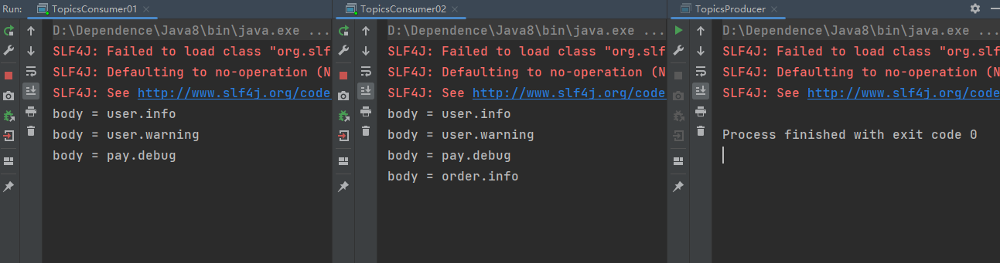

## 9.7.SpringBoot整合RabbitMQ

整合初始化操作很简单，在新建SpringBoot工程时勾选上RabbitMQ的初始化配置即可；

**==以Topics模式作为演示；==**


**父工程依赖：**

```xml
<?xml version="1.0" encoding="UTF-8"?>
<project xmlns="http://maven.apache.org/POM/4.0.0" xmlns:xsi="http://www.w3.org/2001/XMLSchema-instance"
         xsi:schemaLocation="http://maven.apache.org/POM/4.0.0 https://maven.apache.org/xsd/maven-4.0.0.xsd">
    <modelVersion>4.0.0</modelVersion>
    <parent>
        <groupId>org.springframework.boot</groupId>
        <artifactId>spring-boot-starter-parent</artifactId>
        <version>2.7.5</version>
        <relativePath/> <!-- lookup parent from repository -->
    </parent>
    <groupId>top.sharehome</groupId>
    <artifactId>ProSpringBootRabbitMQ</artifactId>
    <version>0.0.1-SNAPSHOT</version>
    <name>ProSpringBootRabbit</name>
    <description>ProSpringBootRabbit</description>
    <properties>
        <java.version>1.8</java.version>
    </properties>
    <packaging>pom</packaging>
    <modules>
        <module>rabbitmq-producer</module>
        <module>rabbitmq-consumer</module>
    </modules>
    <dependencies>
        <dependency>
            <groupId>org.springframework.boot</groupId>
            <artifactId>spring-boot-starter-amqp</artifactId>
        </dependency>

        <dependency>
            <groupId>org.springframework.boot</groupId>
            <artifactId>spring-boot-starter-test</artifactId>
            <scope>test</scope>
        </dependency>
        <dependency>
            <groupId>org.springframework.amqp</groupId>
            <artifactId>spring-rabbit-test</artifactId>
            <scope>test</scope>
        </dependency>
    </dependencies>

    <build>
        <plugins>
            <plugin>
                <groupId>org.springframework.boot</groupId>
                <artifactId>spring-boot-maven-plugin</artifactId>
            </plugin>
        </plugins>
    </build>

</project>
```

**提供者pom文件：**

```xml
<?xml version="1.0" encoding="UTF-8"?>
<project xmlns="http://maven.apache.org/POM/4.0.0" xmlns:xsi="http://www.w3.org/2001/XMLSchema-instance"
   xsi:schemaLocation="http://maven.apache.org/POM/4.0.0 https://maven.apache.org/xsd/maven-4.0.0.xsd">
   <modelVersion>4.0.0</modelVersion>
   <parent>
      <groupId>top.sharehome</groupId>
      <artifactId>ProSpringBootRabbitMQ</artifactId>
      <version>0.0.1-SNAPSHOT</version>
      <relativePath/> <!-- lookup parent from repository -->
   </parent>
   <artifactId>rabbitmq-producer</artifactId>
   <version>0.0.1-SNAPSHOT</version>
   <name>rabbitmq-producer</name>
   <description>rabbitmq-producer</description>
   <properties>
      <java.version>1.8</java.version>
   </properties>

   <build>
      <plugins>
         <plugin>
            <groupId>org.springframework.boot</groupId>
            <artifactId>spring-boot-maven-plugin</artifactId>
         </plugin>
      </plugins>
   </build>

</project>
```

**提供者application文件：**

```yaml
#RabbitMQ Configuration
spring:
  rabbitmq:
    host: 192.168.112.100
    virtual-host: VHost
    username: AntonyCheng
    password: 123456
    port: 5672
```

**提供者RabbitMQConfig：**

```java
package top.sharehome.rabbitmqproducer.config;

import org.springframework.amqp.core.*;
import org.springframework.context.annotation.Bean;
import org.springframework.context.annotation.Configuration;

/**
 * @Description
 * @Author:AntonyCheng
 * @CreateTime:2022/11/10 13:17
 */
@Configuration
public class RabbitMQConfig {
    public static final String EXCHANGE_NAME = "topicsExchange";
    public static final String QUEUE_USER_NAME = "topicsUserQueue";
    public static final String QUEUE_PAY_NAME = "topicsPayQueue";

    //1.定义交换机
    @Bean
    public Exchange topicsExchange() {
        return new TopicExchange(EXCHANGE_NAME, true, false, null);
    }

    //2.定义用户队列
    @Bean
    public Queue topicsUserQueue() {
        return new Queue(QUEUE_USER_NAME, true, false, false, null);
    }

    //3.定义支付队列
    @Bean
    public Queue topicsPayQueue() {
        return new Queue(QUEUE_PAY_NAME, true, false, false, null);
    }

    @Bean
    public Binding bindingTopicsUserBinding(Queue topicsUserQueue, Exchange topicsExchange) {
        return BindingBuilder.bind(topicsUserQueue).to(topicsExchange).with("user.*").noargs();
    }

    @Bean
    public Binding bindingTopicsPayBinding(Queue topicsPayQueue, Exchange topicsExchange) {
        return BindingBuilder.bind(topicsPayQueue).to(topicsExchange).with("pay.*").noargs();
    }
}
```

**提供者测试类：**

```java
package top.sharehome.rabbitmqproducer.config;

import org.junit.jupiter.api.Test;
import org.springframework.amqp.rabbit.core.RabbitTemplate;
import org.springframework.beans.factory.annotation.Autowired;
import org.springframework.boot.test.context.SpringBootTest;

import static org.junit.jupiter.api.Assertions.*;

@SpringBootTest
class RabbitMQConfigTest {
    @Autowired
    private RabbitTemplate rabbitTemplate;

    @Test
    public void publishMessages() throws Exception {
        rabbitTemplate.convertAndSend(RabbitMQConfig.EXCHANGE_NAME,"user.info","user.info日志");
        rabbitTemplate.convertAndSend(RabbitMQConfig.EXCHANGE_NAME,"user.warning","user.warning日志");
        rabbitTemplate.convertAndSend(RabbitMQConfig.EXCHANGE_NAME,"pay.info","pay.info日志");
        rabbitTemplate.convertAndSend(RabbitMQConfig.EXCHANGE_NAME,"pay.warning","pay.warning日志");
    }
}
```

**消费者pom文件：**

```xml
<?xml version="1.0" encoding="UTF-8"?>
<project xmlns="http://maven.apache.org/POM/4.0.0" xmlns:xsi="http://www.w3.org/2001/XMLSchema-instance"
         xsi:schemaLocation="http://maven.apache.org/POM/4.0.0 https://maven.apache.org/xsd/maven-4.0.0.xsd">
    <modelVersion>4.0.0</modelVersion>
    <parent>
        <groupId>top.sharehome</groupId>
        <artifactId>ProSpringBootRabbitMQ</artifactId>
        <version>0.0.1-SNAPSHOT</version>
        <relativePath/> <!-- lookup parent from repository -->
    </parent>
    <groupId>top.sharehome</groupId>
    <artifactId>rabbitmq-consumer</artifactId>
    <version>0.0.1-SNAPSHOT</version>
    <name>rabbitmq-consumer</name>
    <description>rabbitmq-consumer</description>
    <properties>
        <java.version>1.8</java.version>
    </properties>
    <dependencies>
        <dependency>
            <groupId>org.springframework.boot</groupId>
            <artifactId>spring-boot-starter</artifactId>
        </dependency>

        <dependency>
            <groupId>org.springframework.boot</groupId>
            <artifactId>spring-boot-starter-test</artifactId>
            <scope>test</scope>
        </dependency>
    </dependencies>

    <build>
        <plugins>
            <plugin>
                <groupId>org.springframework.boot</groupId>
                <artifactId>spring-boot-maven-plugin</artifactId>
            </plugin>
        </plugins>
    </build>

</project>
```

**消费者application文件：**

```yaml
#RabbitMQ Configuration
spring:
  rabbitmq:
    host: 192.168.112.100
    virtual-host: VHost
    username: AntonyCheng
    password: 123456
    port: 5672
```

**消费者RabbitMQListener：**

```java
package top.sharehome.rabbitmqconsumer.listener;

import org.springframework.amqp.core.Message;
import org.springframework.amqp.rabbit.annotation.RabbitListener;
import org.springframework.stereotype.Component;

import java.util.Arrays;

/**
 * @Description
 * @Author:AntonyCheng
 * @CreateTime:2022/11/10 15:06
 */
@Component
public class RabbitMQListener {
    public static final String QUEUE_USER_NAME = "topicsUserQueue";
    public static final String QUEUE_PAY_NAME = "topicsPayQueue";

    @RabbitListener(queues = RabbitMQListener.QUEUE_USER_NAME)
    public void userQueueListener(Message message) {
        System.out.println("userQueueListener.message.getBody() = " + new String(message.getBody()));
    }

    @RabbitListener(queues = RabbitMQListener.QUEUE_PAY_NAME)
    public void payQueueListener(Message message) {
        System.out.println("payQueueListener.message.getBody() = " + new String(message.getBody()));
    }
}
```

**测试整合效果**

整个代码准备好之后，我们需要先往RabbitMQ服务器上提供消息，所以需要先启动提供者RabbitMQConfigTest，然后再启动消费者Application启动类；


## 9.8.保证消息的可靠性

**==从9.8到9.13，所有代码演示都在一个父工程文件中进行展示；==**


消息的传递过程主要有以下三个阶段：

- 第一阶段：Producer ==> Exchange
- 第二阶段：Exchange ==> Queue
- 第三阶段：Queue ==> Consumer

三个阶段各自有自己保证消息可靠性的方式；

### 9.8.1.第一阶段

使用**”监听机制+回调函数“**的方式，来判定数据是否抵达目的地；


在Channel上会带有一个监听器，这个监听器主要作用就是确认消息是否抵达Exchange，不论Exchange收到消息与否，都会对结果进行一个判断，即Exchange向Producer回传一些参数，Producer根据这些参数调用回调函数（这个函数需要我们定义），然后判断信息的状态；

**具体实现如下：**

**文件目录如下：**


首先初始化SpringBoot项目时带着RabbitMQ配置，接下来就不演示pom.xml文件的内容；

**application.yml：**

```yaml
spring:
  rabbitmq:
    host: 192.168.112.100
    username: AntonyCheng
    password: cry020114
    virtual-host: VHost
    port: 5672
    # 开启Producer到Exchange的确认机制
    publisher-confirm-type: correlated
```

**ConfirmConfig.java：**

```java
package top.sharehome.producer.config;

import org.springframework.amqp.core.*;
import org.springframework.context.annotation.Bean;
import org.springframework.context.annotation.Configuration;

/**
 * @Description
 * @Author:AntonyCheng
 * @CreateTime:2022/11/11 20:33
 */
@Configuration
public class ConfirmConfig {
    public static final String EXCHANGE_CONFIRM_NAME = "confirmExchange";
    public static final String QUEUE_CONFIRM_NAME = "confirmQueue";

    //定义交换机
    @Bean
    public Exchange confirmExchange() {
        return ExchangeBuilder.directExchange(EXCHANGE_CONFIRM_NAME).durable(true).build();
    }

    //定义队列
    @Bean
    public Queue confirmQueue() {
        return QueueBuilder.durable(QUEUE_CONFIRM_NAME).build();
    }

    //绑定队列到交换机
    @Bean
    public Binding bindingConfirmQueue(Exchange confirmExchange, Queue confirmQueue) {
        return BindingBuilder.bind(confirmQueue).to(confirmExchange).with("info").noargs();
    }

}
```

**测试类：**

```java
package top.sharehome.producer.config;

import org.junit.jupiter.api.Test;
import org.springframework.amqp.rabbit.connection.CorrelationData;
import org.springframework.amqp.rabbit.core.RabbitTemplate;
import org.springframework.beans.factory.annotation.Autowired;
import org.springframework.boot.test.context.SpringBootTest;

@SpringBootTest
class ConfirmConfigTest {
    @Autowired
    private RabbitTemplate rabbitTemplate;

    @Test
    public void testConfirm() {
        //通过传入一个回调函数来实现confirm机制
        rabbitTemplate.setConfirmCallback(new RabbitTemplate.ConfirmCallback() {
            /**
             *
             * @param correlationData 与发消息时指定的correlationData相对应
             * @param ack 如果该参数的值为true，那么就表示收到消息，否则表示没受到
             * @param cause cause中存放到Exchange接受失败的原因
             */
            @Override
            public void confirm(CorrelationData correlationData, boolean ack, String cause) {
                System.out.println(correlationData);
                if (ack) {
                    System.out.println("交换机接收消息成功！");
                } else {
                    System.out.println("交换机接收消息失败:" + cause);
                }
            }
        });

        //发送消息
        rabbitTemplate.convertAndSend(ConfirmConfig.EXCHANGE_CONFIRM_NAME, "info", "记录info日志");

        try {
            Thread.sleep(2000);
        } catch (InterruptedException e) {
            throw new RuntimeException(e);
        }
    }
}
```

**运行测试类如下：**


**RabbitMQ控制台如下：**


### 9.8.2.第二阶段

主要使用**“回调函数”**的方式来查看消息是否从Exchange传递给Queue；


**具体实现如下：**

**文件目录如下：**


首先初始化SpringBoot项目时带着RabbitMQ配置，接下来就不演示pom.xml文件的内容；

**application.yml：**

```yaml
spring:
  rabbitmq:
    host: 192.168.112.100
    username: AntonyCheng
    password: cry020114
    virtual-host: VHost
    port: 5672
    # 开启Producer到Exchange的确认机制
    publisher-confirm-type: correlated
    # 开启Exchange到Queue的确认机制
    template:
      mandatory: true
```

**ReturnConfig类：**

```java
package top.sharehome.producer.config;

import org.springframework.amqp.core.*;
import org.springframework.context.annotation.Bean;
import org.springframework.context.annotation.Configuration;

/**
 * @Description
 * @Author:AntonyCheng
 * @CreateTime:2022/11/12 20:18
 */
@Configuration
public class ReturnConfig {
    public static final String EXCHANGE_RETURN_NAME = "returnExchange";
    public static final String QUEUE_RETURN_NAME = "returnQueue";

    //定义交换机
    @Bean
    public Exchange returnExchange() {
        return ExchangeBuilder.directExchange(EXCHANGE_RETURN_NAME).durable(true).build();
    }

    //定义队列
    @Bean
    public Queue returnQueue() {
        return QueueBuilder.durable(QUEUE_RETURN_NAME).build();
    }

    //绑定队列到交换机
    @Bean
    public Binding bindingReturnQueue(Exchange returnExchange, Queue returnQueue) {
        return BindingBuilder.bind(returnQueue).to(returnExchange).with("debug").noargs();
    }
}
```

**ReturnConfigTest类：**

```java
package top.sharehome.producer.config;

import org.junit.jupiter.api.Test;
import org.springframework.amqp.core.Message;
import org.springframework.amqp.core.ReturnedMessage;
import org.springframework.amqp.rabbit.core.RabbitTemplate;
import org.springframework.beans.factory.annotation.Autowired;
import org.springframework.boot.test.context.SpringBootTest;

@SpringBootTest
class ReturnConfigTest {
    @Autowired
    private RabbitTemplate rabbitTemplate;

    @Test
    public void testReturnConfig() {

        rabbitTemplate.setReturnsCallback(new RabbitTemplate.ReturnsCallback() {
            @Override
            //public ReturnedMessage(
            //      Message message,
            //      int replyCode,
            //      String replyText,
            //      String exchange,
            //      String routingKey)
            //message:返回的消息对象，发的时候封装的是什么参数，接受的还是什么参数
            //replyCode:响应状态码
            //replyText:响应状态码对应的文本描述信息
            //exchange:交换机名称
            //routingKey:routingKey的值
            //ReturnedMessage returnedMessage = new ReturnedMessage();
            public void returnedMessage(ReturnedMessage returnedMessage) {
                System.out.println("returnedMessage = " + returnedMessage);
            }
        });
        //我们故意将routingKey写错，让它找不到，看看returnedMessage里面包含什么
        rabbitTemplate.convertAndSend(ReturnConfig.EXCHANGE_RETURN_NAME, "debug123", "记录debug日志");

        try {
            Thread.sleep(2000);
        } catch (InterruptedException e) {
            throw new RuntimeException(e);
        }
    }
}
```

**测试结果如下：**

由于我们故意让他路由失败，根据原理图，他会执行回调函数，所以有如下图的控制台打印；


同时我们能够看到报错的信息：


### 9.8.3.第三阶段

主要使用**“ACK机制”**，ACK机制（Acknowledge(确认)）表示消费者消费后的确认方式，常用的确认方式主要有两种；

- 自动确认（acknowledge=“none”）：当消息一旦被Consumer接收到，则会自动确认收到，RabbitMQ收到应答后会将消息从队列中移除，有可能业务中出现异常导致信息丢失；
- 手动确认（acknowledge=“manual”）:如果设置了手动确认方式，则需要在业务处理成功后，调用方法来手动确认，如果出现异常，则调用方法，让其重新发送消息；

**具体实现如下：**

**项目结构如下：**


首先初始化SpringBoot项目时带着RabbitMQ配置，接下来就不演示pom.xml文件的内容；

**Producer中的application.yml：**

```yaml
spring:
  rabbitmq:
    host: 192.168.112.100
    username: AntonyCheng
    password: cry020114
    virtual-host: VHost
    port: 5672
    # 开启Producer到Exchange的确认机制
    publisher-confirm-type: correlated
```

**ConfirmConfig.java：**

```java
package top.sharehome.producer.config;

import org.springframework.amqp.core.*;
import org.springframework.context.annotation.Bean;
import org.springframework.context.annotation.Configuration;

/**
 * @Description
 * @Author:AntonyCheng
 * @CreateTime:2022/11/11 20:33
 */
@Configuration
public class ConfirmConfig {
    public static final String EXCHANGE_CONFIRM_NAME = "confirmExchange";
    public static final String QUEUE_CONFIRM_NAME = "confirmQueue";

    //定义交换机
    @Bean
    public Exchange confirmExchange() {
        return ExchangeBuilder.directExchange(EXCHANGE_CONFIRM_NAME).durable(true).build();
    }

    //定义队列
    @Bean
    public Queue confirmQueue() {
        return QueueBuilder.durable(QUEUE_CONFIRM_NAME).build();
    }

    //绑定队列到交换机
    @Bean
    public Binding bindingConfirmQueue(Exchange confirmExchange, Queue confirmQueue) {
        return BindingBuilder.bind(confirmQueue).to(confirmExchange).with("info").noargs();
    }

}
```

**测试类：**

```java
package top.sharehome.producer.config;

import org.junit.jupiter.api.Test;
import org.springframework.amqp.rabbit.connection.CorrelationData;
import org.springframework.amqp.rabbit.core.RabbitTemplate;
import org.springframework.beans.factory.annotation.Autowired;
import org.springframework.boot.test.context.SpringBootTest;

@SpringBootTest
class ConfirmConfigTest {
    @Autowired
    private RabbitTemplate rabbitTemplate;

    @Test
    public void testConfirm() {
        //通过传入一个回调函数来实现confirm机制
        rabbitTemplate.setConfirmCallback(new RabbitTemplate.ConfirmCallback() {
            /**
             *
             * @param correlationData 与发消息时指定的correlationData相对应
             * @param ack 如果该参数的值为true，那么就表示收到消息，否则表示没受到
             * @param cause cause中存放到Exchange接受失败的原因
             */
            @Override
            public void confirm(CorrelationData correlationData, boolean ack, String cause) {
                System.out.println(correlationData);
                if (ack) {
                    System.out.println("交换机接收消息成功！");
                } else {
                    System.out.println("交换机接收消息失败:" + cause);
                }
            }
        });

        //发送消息
        rabbitTemplate.convertAndSend(ConfirmConfig.EXCHANGE_CONFIRM_NAME, "info", "记录info日志");

        try {
            Thread.sleep(2000);
        } catch (InterruptedException e) {
            throw new RuntimeException(e);
        }
    }
}
```

**Consumer中的application.yml：**

```yaml
spring:
  rabbitmq:
    host: 192.168.112.100
    username: AntonyCheng
    password: cry020114
    virtual-host: VHost
    port: 5672
    # 开启Queue到Consumer的确认机制
    listener:
      simple:
        acknowledge-mode: manual
```

**AckListener类：**

```java
package top.sharehome.consumer.listener;

import com.rabbitmq.client.Channel;
import org.springframework.amqp.core.Message;
import org.springframework.amqp.rabbit.annotation.RabbitListener;
import org.springframework.stereotype.Component;

import java.io.IOException;

/**
 * @Description
 * @Author:AntonyCheng
 * @CreateTime:2022/11/12 21:09
 */
@Component
public class AckListener {
    @RabbitListener(queues = "confirmQueue")
    public void ackListener(Message message, Channel channel) {
        long deliveryTag = 0;
        try {
            //1.获取消息内容
            System.out.println(new String(message.getBody()));

            //2.模拟业务处理
            //模拟业务处理执行异常
            System.out.println("业务处理完毕");

            //3.手动确认
            //public void basicAck(
            //      long deliveryTag,
            //      boolean multiple) throws IOException
            //deliveryTag：消息的唯一标识，从1开始自增
            //multiple：如果设置为true，那就是批量处理消息，一般设置为true
            deliveryTag = message.getMessageProperties().getDeliveryTag();
            channel.basicAck(deliveryTag, true);
        } catch (IOException e) {
            System.out.println("发生异常");
            //4.如果消费失败就拒绝确认
            //public void basicNack(
            //      long deliveryTag,
            //      boolean multiple,
            //      boolean requeue) throws IOException {
            //deliveryTag：消息的唯一标识，从1开始自增
            //multiple：如果设置为true，那就是批量处理消息，一般设置为true
            //requeue：是否重新放回队列，true表示会被重新放回队列，消费者会重新消费；
            //                       false表示如果绑定了死信队列就会被发送到死信队列，如果没绑定死信队列就会被丢弃；
            try {
                channel.basicNack(deliveryTag, true, true);
            } catch (IOException ex) {
                ex.printStackTrace();
            }
        }
    }
}
```

也就是对于Consumer接收失败的消息，我们有两种对待方式，要么将这些消息丢弃（一是丢弃，二是放入死信队列），要么将这些消息放回Queue；

## 9.9.保障消息的幂等性

幂等（idempotent）是一个数学与计算机学的概念，常见于抽象代数中，在编程中一个幂等操作的特点是其任意多次执行所产生的影响均与依次执行的影响相同。幂等函数或者幂等方法，是指可以使用相同参数重复执行并且能够获得相同结果的函数；

消息的幂等性，其实就是保证同一个消息不被消费者重复消费两次，当消费者消费完消息之后，通常会发送一个ack应答确认信息给生产者，但是这中间有可能因为网络中断等原因，导致broker未能收到确认消息，由此这条消息将会被重复发送给其他消费者进行消费，最终导致相同消息被重复消费；

**解决方案：**

1. 生产者在发送消息时，给消息绑定一个唯一ID；
2. 消费者开始消费前，根据唯一ID去redis中查询；
   - 如果没有，就直接消费，并把id=消息内容，键值对形式写入redis；
   - 如果有，说明已经消费过了，就不要重复消费；

**方案图示如下：**


**代码实现如下：**

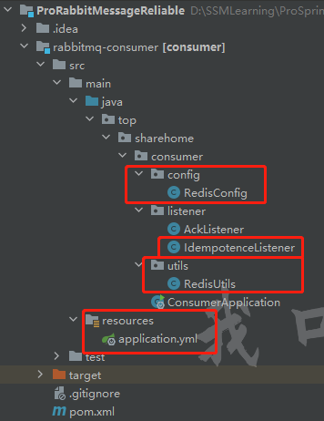

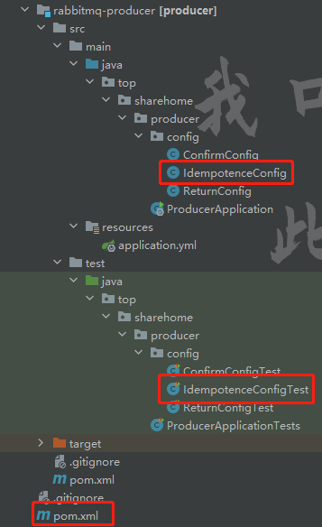

**父工程pom文件：**

添加Redis依赖；

```xml
<?xml version="1.0" encoding="UTF-8"?>
<project xmlns="http://maven.apache.org/POM/4.0.0" xmlns:xsi="http://www.w3.org/2001/XMLSchema-instance"
         xsi:schemaLocation="http://maven.apache.org/POM/4.0.0 https://maven.apache.org/xsd/maven-4.0.0.xsd">
    <modelVersion>4.0.0</modelVersion>
    <parent>
        <groupId>org.springframework.boot</groupId>
        <artifactId>spring-boot-starter-parent</artifactId>
        <version>2.7.5</version>
        <relativePath/> <!-- lookup parent from repository -->
    </parent>
    <packaging>pom</packaging>
    <groupId>top.sharehome</groupId>
    <artifactId>ProRabbitMessageReliable</artifactId>
    <version>0.0.1-SNAPSHOT</version>
    <name>ProRabbitMessageReliable</name>
    <description>ProRabbitMessageReliable</description>
    <properties>
        <java.version>1.8</java.version>
    </properties>
    <dependencies>
        <dependency>
            <groupId>org.springframework.boot</groupId>
            <artifactId>spring-boot-starter-amqp</artifactId>
        </dependency>
        <dependency>
            <groupId>org.springframework.boot</groupId>
            <artifactId>spring-boot-starter-test</artifactId>
            <scope>test</scope>
        </dependency>
        <dependency>
            <groupId>org.springframework.amqp</groupId>
            <artifactId>spring-rabbit-test</artifactId>
            <scope>test</scope>
        </dependency>
        <dependency>
            <groupId>org.springframework.boot</groupId>
            <artifactId>spring-boot-starter-data-redis</artifactId>
        </dependency>

    </dependencies>

    <build>
        <plugins>
            <plugin>
                <groupId>org.springframework.boot</groupId>
                <artifactId>spring-boot-maven-plugin</artifactId>
            </plugin>
        </plugins>
    </build>
</project>
```

**提供者IdempotenceConfig类：**

```java
package top.sharehome.producer.config;

import org.springframework.amqp.core.*;
import org.springframework.context.annotation.Bean;
import org.springframework.context.annotation.Configuration;

/**
 * @Description
 * @Author:AntonyCheng
 * @CreateTime:2022/11/13 20:48
 */
@Configuration
public class IdempotenceConfig {
    public static final String EXCHANGE_IDEMPOTENCE_NAME = "idempotenceExchange";
    public static final String QUEUE_IDEMPOTENCE_NAME = "idempotenceQueue";

    @Bean
    public Exchange idempotenceExchange() {
        return ExchangeBuilder.directExchange(EXCHANGE_IDEMPOTENCE_NAME).durable(true).build();
    }

    @Bean
    public Queue idempotenceQueue() {
        return QueueBuilder.durable(QUEUE_IDEMPOTENCE_NAME).build();
    }

    @Bean
    public Binding bindingIdempotenceQueue(Exchange idempotenceExchange, Queue idempotenceQueue) {
        return BindingBuilder.bind(idempotenceQueue).to(idempotenceExchange).with("reduceStock").noargs();
    }
}
```

**提供者IdempotenceConfigTest类：**

```java
package top.sharehome.producer.config;

import org.junit.jupiter.api.Test;
import org.springframework.amqp.rabbit.core.RabbitTemplate;
import org.springframework.beans.factory.annotation.Autowired;
import org.springframework.boot.test.context.SpringBootTest;

import java.util.UUID;

@SpringBootTest
class IdempotenceConfigTest {
    @Autowired
    private RabbitTemplate rabbitTemplate;

    @Test
    public void testIdempotenceConfig() {
        //在发送消息时，给消息绑定一个唯一的ID——UUID，所以先生成一个
        String uuid = UUID.randomUUID().toString();
        rabbitTemplate.convertAndSend(IdempotenceConfig.EXCHANGE_IDEMPOTENCE_NAME,
                "reduceStock",
                "{quantity:3}", message -> {
                    message.getMessageProperties().setMessageId(uuid);
                    return message;
                });
    }
}
```

**消费者application配置：**

```yaml
spring:
  rabbitmq:
    host: 192.168.112.100
    username: AntonyCheng
    password: 123456
    virtual-host: VHost
    port: 5672
    # 开启Queue到Consumer配置
    listener:
      simple:
        acknowledge-mode: manual
  redis:
    host: 192.168.112.100
    port: 6379
    password: 123456
```

**消费者Redis工具类：**

```java
package top.sharehome.consumer.utils;

import org.springframework.beans.factory.annotation.Autowired;
import org.springframework.data.redis.core.RedisTemplate;
import org.springframework.stereotype.Component;
import org.springframework.util.StringUtils;

import java.util.concurrent.TimeUnit;

/**
 * @Description Redis工具类，为了方便操作Redis
 * @Author:AntonyCheng
 * @CreateTime:2022/11/1 23:42
 */
@Component
public class RedisUtils {
    @Autowired
    private RedisTemplate<String, Object> redisTemplate;

    /**
     * 向Redis中存入String类型数据
     *
     * @param key
     * @param value
     * @return
     */
    public boolean set(String key, Object value) {
        try {
            redisTemplate.opsForValue().set(key, value);
        } catch (Exception e) {
            e.printStackTrace();
            return false;
        }
        return true;
    }

    /**
     * 根据key去除Redis中的String类型数据
     *
     * @param key
     * @return
     */
    public Object get(String key) {
        return StringUtils.isEmpty(key) ? null : redisTemplate.opsForValue().get(key);
    }

    /**
     * 向Redis中存入Hash类型数据
     *
     * @param key
     * @param field
     * @param value
     * @return
     */
    public boolean hset(String key, Object field, Object value) {
        try {
            redisTemplate.opsForHash().put(key, field, value);
        } catch (Exception e) {
            e.printStackTrace();
            return false;
        }
        return true;
    }

    /**
     * 根据key取出Redis中的Hash类型数据
     *
     * @param key
     * @param
     * @return
     */
    public Object hget(String key, Object field) {
        return StringUtils.isEmpty(key) ? null : redisTemplate.opsForHash().get(key, field);
    }

    /**
     * 根据key去删除对应的数据
     *
     * @param key
     */
    public void del(String key) {
        redisTemplate.delete(key);
    }

    /**
     * 判断key是否存在
     *
     * @param key
     * @return
     */
    public boolean exist(String key) {
        try {
            return redisTemplate.hasKey(key);
        } catch (Exception e) {
            e.printStackTrace();
            return false;
        }
    }

    /**
     * 为某个key设置过期时间
     *
     * @param key
     * @param timeout
     * @return
     */
    public boolean expire(String key, long timeout) {
        try {
            return redisTemplate.expire(key, timeout, TimeUnit.SECONDS);
        } catch (Exception e) {
            return false;
        }
    }

    /**
     * 查看key剩余的存活时间
     *
     * @param key
     * @return
     */
    public long ttl(String key) {
        return redisTemplate.getExpire(key, TimeUnit.SECONDS);
    }
}
```

**消费者RedisConfig类：**

```java
package top.sharehome.consumer.config;

import org.springframework.beans.factory.annotation.Autowired;
import org.springframework.context.annotation.Bean;
import org.springframework.context.annotation.Configuration;
import org.springframework.data.redis.core.RedisTemplate;
import org.springframework.data.redis.serializer.RedisSerializer;
import org.springframework.data.redis.serializer.StringRedisSerializer;

/**
 * @Description 底层Redis的自动配置中 @ConditionalOnMissingBean(name = "redisTemplate")
 *              会检测Spring容器中是否有一个id为redisTemplate的Bean，如果有，那就用现成的，不
 *              使用默认配置去初始化，如果没有，就用默认配置初始化
 * @Author:AntonyCheng
 * @CreateTime:2022/11/2 00:18
 */
@Configuration
public class RedisConfig {
    @Autowired
    private RedisTemplate redisTemplate;

    @Bean
    public RedisTemplate<String, Object> stringSerializerRedisTemplate(){
        RedisSerializer<String> stringSerializer = new StringRedisSerializer();
        redisTemplate.setKeySerializer(stringSerializer);
        redisTemplate.setValueSerializer(stringSerializer);
        redisTemplate.setHashKeySerializer(stringSerializer);
        redisTemplate.setHashValueSerializer(stringSerializer);
        return redisTemplate;
    }
}
```

**消费者IdempotenceListener类：**

```java
package top.sharehome.consumer.listener;

import com.rabbitmq.client.Channel;
import org.springframework.amqp.core.Message;
import org.springframework.amqp.rabbit.annotation.RabbitListener;
import org.springframework.beans.factory.annotation.Autowired;
import org.springframework.stereotype.Component;
import org.springframework.util.StringUtils;
import top.sharehome.consumer.utils.RedisUtils;

import java.io.IOException;

/**
 * @Description
 * @Author:AntonyCheng
 * @CreateTime:2022/11/13 21:49
 */
@Component
public class IdempotenceListener {
    @Autowired
    private RedisUtils redisUtils;

    @RabbitListener(queues = "idempotenceQueue")
    public void idempotenceQueue(Message message, Channel channel) {
        long deliveryTag = 0;
        try {
            //1.获取消息内容
            System.out.println(new String(message.getBody()));

            //2.模拟业务处理
            //首先根据messageId查询redis
            //如果redis中没有key，说明该消息没有被消费，继续消费即可
            //如果redis中有key，说明这个消息被消费了，需要被去丢弃
            String messageId = message.getMessageProperties().getMessageId();
            if (StringUtils.isEmpty(redisUtils.get(messageId))) {
                System.out.println("减少数据库的库存");
                redisUtils.set(messageId, new String(message.getBody()));
                //3.手动确认
                //public void basicAck(
                //      long deliveryTag,
                //      boolean multiple) throws IOException
                //deliveryTag：消息的唯一标识，从1开始自增
                //multiple：如果设置为true，那就是批量处理消息，一般设置为true
                deliveryTag = message.getMessageProperties().getDeliveryTag();
                channel.basicAck(deliveryTag, true);
            } else {
                //下面是没有key的情况
                System.out.println("消息已经被消费");
                channel.basicNack(deliveryTag, true, false);
            }
            System.out.println("业务处理完毕");

        } catch (IOException e) {
            System.out.println("发生异常");
            //4.如果消费失败就拒绝确认
            //public void basicNack(
            //      long deliveryTag,
            //      boolean multiple,
            //      boolean requeue) throws IOException {
            //deliveryTag：消息的唯一标识，从1开始自增
            //multiple：如果设置为true，那就是批量处理消息，一般设置为true
            //requeue：是否重新放回队列，true表示会被重新放回队列，消费者会重新消费；
            //                       false表示如果绑定了死信队列就会被发送到死信队列，如果没绑定死信队列就会被丢弃；
            try {
                channel.basicNack(deliveryTag, true, true);
            } catch (IOException ex) {
                ex.printStackTrace();
            }
        }
    }
}
```

**消费者启动类：**

```java
package top.sharehome.consumer;

import org.springframework.boot.SpringApplication;
import org.springframework.boot.autoconfigure.SpringBootApplication;

@SpringBootApplication
public class ConsumerApplication {

    public static void main(String[] args) {
        SpringApplication.run(ConsumerApplication.class, args);
    }

}
```

**准备测试：**

代码已经准备好了，首先启动提供者，给RabbitMQ发送一条消息，需要记录一下该消息的唯一id，再启动消费者去消费，然后修改代码，把记录的id硬编码进去，最后再启动一次消费者；

**测试效果如下：**


## 9.10.消费端限制消费信息数

**图示如下：**


限制消费信息数指的是A系统从MQ中每秒拉取多少个请求；

**代码实现如下：**


**提供者LimitConfig类：**

```java
package top.sharehome.producer.config;

import org.springframework.amqp.core.*;
import org.springframework.context.annotation.Bean;
import org.springframework.context.annotation.Configuration;

/**
 * @Description
 * @Author:AntonyCheng
 * @CreateTime:2022/11/13 23:38
 */
@Configuration
public class LimitConfig {
    public static final String EXCHANGE_LIMIT_NAME = "limitExchange";
    public static final String QUEUE_LIMIT_NAME = "limitQueue";

    @Bean
    public Exchange limitExchange() {
        return ExchangeBuilder.directExchange(EXCHANGE_LIMIT_NAME).durable(true).build();
    }

    @Bean
    public Queue limitQueue() {
        return QueueBuilder.durable(QUEUE_LIMIT_NAME).build();
    }

    @Bean
    public Binding bindingLimitQueue(Queue limitQueue,Exchange limitExchange) {
        return BindingBuilder.bind(limitQueue).to(limitExchange).with("warning").noargs();
    }
}
```

**提供者测试类：**

```java
package top.sharehome.producer.config;

import org.junit.jupiter.api.Test;
import org.springframework.amqp.rabbit.core.RabbitTemplate;
import org.springframework.beans.factory.annotation.Autowired;
import org.springframework.boot.test.context.SpringBootTest;

@SpringBootTest
class LimitConfigTest {
    @Autowired
    private RabbitTemplate rabbitTemplate;

    @Test
    public void testLimit() {
        for (int i = 0; i < 5; i++) {
            rabbitTemplate.convertAndSend(LimitConfig.EXCHANGE_LIMIT_NAME, "warning", "打印warning日志");
        }
    }
}
```

**消费者application配置文件：**

```yaml
spring:
  rabbitmq:
    host: 192.168.112.100
    username: AntonyCheng
    password: cry020114
    virtual-host: VHost
    port: 5672
    # 开启Queue到Consumer配置
    listener:
      simple:
        acknowledge-mode: manual
        # 限制流量
        prefetch: 2 #2表示消费者每次最多从RabbitMQ中拉取两条未确认信息，直到手动确认后，才会再次从RabbitMQ中再去拉取两条，以此类推 
  redis:
    host: 192.168.112.100
    port: 6379
    password: cry020114
```

主要是限制流量，这样的限制需要搭配手动确认来实现，先从RabbitMQ拉取对应数量的消息，再手动确认，然后再拉取，如果拉取之后没能手动确认，消息就会被标记成未确认状态，如果不确认关闭消费端，消息就会自动返回Queue；

**消费者LimitListener类：**

```java
package top.sharehome.consumer.listener;

import com.rabbitmq.client.Channel;
import org.springframework.amqp.core.Message;
import org.springframework.amqp.rabbit.annotation.RabbitListener;
import org.springframework.stereotype.Component;

import java.io.IOException;

/**
 * @Description
 * @Author:AntonyCheng
 * @CreateTime:2022/11/14 10:43
 */
@Component
public class LimitListener {
    @RabbitListener(queues = "limitQueue")
    public void limitQueueListener(Message message, Channel channel) {
        System.out.println(new String(message.getBody()));
//        try {
//            channel.basicAck(message.getMessageProperties().getDeliveryTag(), true);
//        } catch (IOException e) {
//            throw new RuntimeException(e);
//        }
    }
}
```

**测试准备：**

如果我们想看到消息被限制的状态，我们需要在LimitListener中不进行自动确认，这样我们发五条消息，消费者也只会消费两条；

**测试结果如下：**

提交消息后：


消费消息时：


消息消费后：


## 9.11.设置消息过期时间

消息过期（最大存活时间）时间（Time-To-Live）：是指消息超过指定时间后，会被RabbitMQ从队列中移除；

**代码实现如下：**

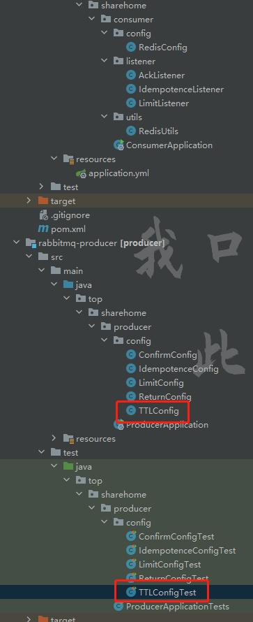

**TTLConfig类：**

```java
package top.sharehome.producer.config;

import org.springframework.amqp.core.*;
import org.springframework.context.annotation.Bean;
import org.springframework.context.annotation.Configuration;

/**
 * @Description
 * @Author:AntonyCheng
 * @CreateTime:2022/11/14 11:24
 */
@Configuration
public class TTLConfig {
    public static final String QUEUE_TTL_OF_QUEUE_NAME = "ttlOfQueue";
    public static final String QUEUE_TTL_OF_MESSAGE_NAME = "ttlOfMessage";
    public static final String EXCHANGE_TTL_NAME = "ttlExchange";

    @Bean
    public Exchange ttlExchange() {
        return ExchangeBuilder.directExchange(EXCHANGE_TTL_NAME).durable(true).build();
    }

    @Bean
    public Queue ttlOfQueue() {
        //针对队列设置TTL
        //设置TTL使用withArgument方法，该方法需要带着键值对参数，key值是固定的，可以在RabbitMQ控制台中看到
        //一旦设置TTL之后，该队列的TTL就被固定了，如果在代码层面修改了这个时间，就会报错，解决方法就是删除该队列，让其重新生成
        return QueueBuilder.durable(QUEUE_TTL_OF_QUEUE_NAME).withArgument("x-message-ttl", 5000).build();
    }

    @Bean
    public Queue ttlOfMessage() {
        //针对方法设置TTL所要用到的队列
        return QueueBuilder.durable(QUEUE_TTL_OF_MESSAGE_NAME).build();
    }

    //下面做队列的绑定
    @Bean
    public Binding bindingTTLOfQueue(Exchange ttlExchange, Queue ttlOfQueue) {
        return BindingBuilder.bind(ttlOfQueue).to(ttlExchange).with("error").noargs();
    }

    @Bean
    public Binding bindingTTLOfMessage(Exchange ttlExchange, Queue ttlOfMessage) {
        return BindingBuilder.bind(ttlOfMessage).to(ttlExchange).with("delay").noargs();
    }
}
```

==x-message-ttl==这个参数Key来源于RabbitMQ的控制台，RabbitMQ自身就定义很多参数，这个在控制台处能找到：


**TTLConfigTest类：**

```java
package top.sharehome.producer.config;

import org.junit.jupiter.api.Test;
import org.springframework.amqp.rabbit.core.RabbitTemplate;
import org.springframework.beans.factory.annotation.Autowired;
import org.springframework.boot.test.context.SpringBootTest;

@SpringBootTest
class TTLConfigTest {
    @Autowired
    private RabbitTemplate rabbitTemplate;

    @Test
    public void testTTLOfQueue() {
        for (int i = 0; i < 20; i++) {
            rabbitTemplate.convertAndSend(TTLConfig.EXCHANGE_TTL_NAME, "error", "这是一个错误" + i);
        }
    }

    /**
     * 如果在一个设置了TTL的队列中再写一个设置了TTL的方法，那么以TTL较小的那方为主
     */
    @Test
    public void testTTLOfMethod() {
        rabbitTemplate.convertAndSend(TTLConfig.EXCHANGE_TTL_NAME,
                "delay",
                "处理一个延迟（5000）",
                message -> {
                    //使用方法中的setExpiration方法设置消息的TTL
                    message.getMessageProperties().setExpiration("5000");
                    return message;
                });
        //再发送一个消息，不设置TTL进行观察
        rabbitTemplate.convertAndSend(TTLConfig.EXCHANGE_TTL_NAME,
                "delay",
                "处理一个延迟（永久）");
    }
}
```

**测试结果如下：**

设置队列TTL：


队列TTL结束后：


设置方法TTL：


方法TTL结束后：


## 9.12.死信交换机和死信队列

**概述：**


成为死信（Dead Letter）的必要条件：

- 在存储该消息的时候超过队列容纳的最大条数
- 消息被拒绝确认（channel.basicNack()/channel.basicReject()），都要设置requeue=false（失败不再返还给原队列）；
- 消息过期（超过消息TTL）

**具体代码实现：**


**DeadLetterConfig类：**

```java
package top.sharehome.producer.config;

import org.springframework.amqp.core.*;
import org.springframework.context.annotation.Bean;
import org.springframework.context.annotation.Configuration;

import java.util.HashMap;

/**
 * @Description
 * @Author:AntonyCheng
 * @CreateTime:2022/11/14 14:12
 */
@Configuration
public class DeadLetterConfig {
    public static final String EXCHANGE_DEAD_LETTER_NAME = "deadLetterExchange";
    public static final String EXCHANGE_NORMAL_NAME = "normalExchange";
    public static final String QUEUE_DEAD_LETTER_NAME = "deadLetterQueue";
    public static final String QUEUE_NORMAL_NAME = "normalQueue";

    /**
     * 定义死信交换机
     *
     * @return
     */
    @Bean
    public Exchange deadLetterExchange() {
        return ExchangeBuilder.topicExchange(EXCHANGE_DEAD_LETTER_NAME).durable(true).build();
    }

    /**
     * 定义普通交换机
     *
     * @return
     */
    @Bean
    public Exchange normalExchange() {
        return ExchangeBuilder.topicExchange(EXCHANGE_NORMAL_NAME).durable(true).build();
    }

    /**
     * 定义死信队列
     *
     * @return
     */
    @Bean
    public Queue deadLetterQueue() {
        return QueueBuilder.durable(QUEUE_DEAD_LETTER_NAME).build();
    }

    /**
     * 定义普通队列
     *
     * @return
     */
    @Bean
    public Queue normalQueue() {
        //为了将普通队列绑定在死信交换机上，所以在定义普通队列时就需要进行绑定
        HashMap<String, Object> map = new HashMap<String, Object>();
        //绑定参数，这个参数依旧需要到控制台去找
        map.put("x-dead-letter-exchange", EXCHANGE_DEAD_LETTER_NAME);
        //指定路由到死信交换机的routingKey
        map.put("x-dead-letter-routing-key", "order.status.error");
        //为了演示死信的结果，我们设置一些条件，为了单条测试，所以下面条件测试时尽量只开启其中国一个
        //1.最大容纳信息条数
//        map.put("x-max-length", 5);
        //2.设置TTL
        map.put("x-message-ttl", 10000);
        return QueueBuilder.durable(QUEUE_NORMAL_NAME).withArguments(map).build();
    }

    /**
     * 绑定死信队列
     *
     * @param deadLetterExchange
     * @param deadLetterQueue
     * @return
     */
    @Bean
    public Binding bindingDeadLetterQueue(Exchange deadLetterExchange, Queue deadLetterQueue) {
        return BindingBuilder.bind(deadLetterQueue).to(deadLetterExchange).with("order.status.#").noargs();
    }

    /**
     * 绑定普通队列
     *
     * @param normalExchange
     * @param normalQueue
     * @return
     */
    @Bean
    public Binding bindingNormalQueue(Exchange normalExchange, Queue normalQueue) {
        return BindingBuilder.bind(normalQueue).to(normalExchange).with("order.#").noargs();
    }
}
```

**DeadLetterConfigTest类：**

下面测试的是第一个和第三个必要条件，第二个必要条件需要触发ACK机制，进行拒绝消息应答才行，但是效果一样，为简化笔记，第二个必要条件就不在笔记中进行演示；

```java
package top.sharehome.producer.config;

import org.junit.jupiter.api.Test;
import org.springframework.amqp.rabbit.core.RabbitTemplate;
import org.springframework.beans.factory.annotation.Autowired;
import org.springframework.boot.test.context.SpringBootTest;

@SpringBootTest
class DeadLetterConfigTest {
    @Autowired
    private RabbitTemplate rabbitTemplate;

    /**
     * 测试最大容纳
     */
    @Test
    public void testMaxLength() {
        for (int i = 0; i < 10; i++) {
            rabbitTemplate.convertAndSend(DeadLetterConfig.EXCHANGE_NORMAL_NAME, "order.info", "打印订单日志");
        }
    }

    /**
     * 测试TTL
     */
    @Test
    public void testTTL() {
        rabbitTemplate.convertAndSend(DeadLetterConfig.EXCHANGE_NORMAL_NAME, "order.info", "打印订单日志");
    }
}
```

**测试准备：**

直接启动两个测试方法，然后观察控制台的变化即可；

**测试效果如下：**

测试最大容纳量：


测试TTL：


## 9.13.延时队列

**概述：**

延时队列，最重要的特性就体现在它的延时属性上，跟普通的队列不一样的是，普通队列中的元素总是等着希望被早点取出处理，而延时队列中的元素则是希望被在指定时间得到取出和处理，所以延时队列中的元素都是带有时间属性的，通常来说是需要被处理的消息或者任务，可以简单理解为延时队列中的消息不会立即被消费，而是到了设定的时间后，才会被消费；

延时队列应用场景：

- 订单在24小时之内未支付则自动取消；
- 用户注册成功后，如果三天内没有登录则进行短信提醒；
- 预定会议后，需要在预定的时间点前十分钟通知各个与会人员参加会议；

我们主要实现一下第一个应用场景；

**业务逻辑：**


**延时队列逻辑：**


**具体代码实现：**


**提供者config类：**

```java
package top.sharehome.producer.config;

import org.springframework.amqp.core.*;
import org.springframework.context.annotation.Bean;
import org.springframework.context.annotation.Configuration;

/**
 * @Description
 * @Author:AntonyCheng
 * @CreateTime:2022/11/14 22:46
 */
@Configuration
public class OrderConfig {
    public static final String EXCHANGE_DLX_NAME = "dlxExchange";
    public static final String EXCHANGE_ORDER_NAME = "orderExchange";
    public static final String QUEUE_DLX_NAME = "dlxQueue";
    public static final String QUEUE_ORDER_NAME = "orderQueue";

    /**
     * 定义死信交换机
     *
     * @return
     */
    @Bean
    public Exchange dlxExchange() {
        return ExchangeBuilder.topicExchange(EXCHANGE_DLX_NAME).durable(true).build();
    }

    /**
     * 定义普通交换机
     *
     * @return
     */
    @Bean
    public Exchange orderExchange() {
        return ExchangeBuilder.topicExchange(EXCHANGE_ORDER_NAME).durable(true).build();
    }

    /**
     * 定义死信队列
     *
     * @return
     */
    @Bean
    public Queue dlxQueue() {
        return QueueBuilder.durable(QUEUE_DLX_NAME).build();
    }

    /**
     * 定义普通队列
     *
     * @return
     */
    @Bean
    public Queue orderQueue() {
        return QueueBuilder.durable(QUEUE_ORDER_NAME)
                .withArgument("x-dead-letter-exchange", EXCHANGE_DLX_NAME)
                .withArgument("x-dead-letter-routing-key","order.delay.orderId")
                .withArgument("x-message-ttl",10000)
                .build();
    }

    /**
     * 绑定死信队列
     * @param dlxExchange
     * @param dlxQueue
     * @return
     */
    @Bean
    public Binding bindingDLQueue(Exchange dlxExchange, Queue dlxQueue) {
        return BindingBuilder.bind(dlxQueue).to(dlxExchange).with("order.delay.#").noargs();
    }

    /**
     * 绑定普通队列
     *
     * @param orderExchange
     * @param orderQueue
     * @return
     */
    @Bean
    public Binding bindingOrderQueue(Exchange orderExchange, Queue orderQueue) {
        return BindingBuilder.bind(orderQueue).to(orderExchange).with("order.#").noargs();
    }
}
```

**提供者测试类：**

```java
package top.sharehome.producer.config;

import org.junit.jupiter.api.Test;
import org.springframework.amqp.rabbit.core.RabbitTemplate;
import org.springframework.beans.factory.annotation.Autowired;
import org.springframework.boot.test.context.SpringBootTest;

@SpringBootTest
class OrderConfigTest {
    @Autowired
    private RabbitTemplate rabbitTemplate;

    @Test
    public void testOrder() {
        rabbitTemplate.convertAndSend(OrderConfig.EXCHANGE_ORDER_NAME, "order.orderId", "{orderId=123}");
    }
}
```

**消费者config类：**

```java
package top.sharehome.consumer.listener;

import com.rabbitmq.client.Channel;
import org.springframework.amqp.core.Message;
import org.springframework.amqp.rabbit.annotation.RabbitListener;
import org.springframework.stereotype.Component;

import java.io.IOException;

/**
 * @Description
 * @Author:AntonyCheng
 * @CreateTime:2022/11/12 21:09
 */
@Component
public class OrderDeadLetterListener {
    @RabbitListener(queues = "dlxQueue")
    public void ackListener(Message message, Channel channel) {
        long deliveryTag = 0;
        try {
            //1.获取消息内容
            System.out.println(new String(message.getBody()));

            //2.模拟业务处理
            System.out.println("根据orderId去数据库查询订单状态");
            System.out.println("查出是未支付状态");
            System.out.println("将数据库中OrderId=123的订单更新成已取消");
            System.out.println("还原库存");

            //3.手动确认
            //public void basicAck(
            //      long deliveryTag,
            //      boolean multiple) throws IOException
            //deliveryTag：消息的唯一标识，从1开始自增
            //multiple：如果设置为true，那就是批量处理消息，一般设置为true
            deliveryTag = message.getMessageProperties().getDeliveryTag();
            channel.basicAck(deliveryTag, true);
            
        } catch (IOException e) {
            System.out.println("发生异常");
            
            //4.如果消费失败就拒绝确认
            //public void basicNack(
            //      long deliveryTag,
            //      boolean multiple,
            //      boolean requeue) throws IOException {
            //deliveryTag：消息的唯一标识，从1开始自增
            //multiple：如果设置为true，那就是批量处理消息，一般设置为true
            //requeue：是否重新放回队列，true表示会被重新放回队列，消费者会重新消费；
            //                       false表示如果绑定了死信队列就会被发送到死信队列，如果没绑定死信队列就会被丢弃；
            try {
                channel.basicNack(deliveryTag, true, true);
            } catch (IOException ex) {
                ex.printStackTrace();
            }
        }
    }
}
```

先启动消费者启动类，让消费者去监控相对应的队列，再启动提供者测试类进行消息的投放，会看到的效果是，只要这条消息超过了TTL所设置的时间，就会被死信队列所接纳，进而让消费者的方法去处理，这样就实现了延时的操作；

## 9.14.RabbitMQ集群搭建

为了保证MQ中间件的可靠性、并发性、吞吐量，在生产环境上一般都会考虑使用RabbitMQ的集群方案；

### 9.14.1.利用虚拟机搭建


这里利用虚拟机模拟三台真实的机器：

|     IP地址      |   主机名   | 操作系统 |
| :-------------: | :--------: | :------: |
| 192.168.112.216 | rabbitmq01 | CentOS7  |
| 192.168.112.181 | rabbitmq02 | CentOS7  |
| 192.168.112.197 | rabbitmq03 | CentOS7  |

通过VMware软件对虚拟机进行克隆，克隆后的三台主机我们不需要对其进行软件安装：


修改所有主机的主机名**（以rabbitmq01为例）**：

```shell
#进入如下文件
vim /etc/hostname

#将内容修改为
rabbitmq01.localdomain
```

修改所有主机的主机映射：

```shell
#进入如下文件
vim /etc/hosts

#添加如下内容
192.168.112.216 rabbitmq01
192.168.112.181 rabbitmq02
192.168.112.197 rabbitmq03
```

做完以上操作之后，所有主机需要**重启**，主机名就已经发生了修改，下面我们需要修改主机的.erlang.cookie内容，要求就是三台主机一定要保证这个内容一致，这里假设修改为和rabbitmq01相同的值：

```shell
#首先查看rabbitmq01的cookie内容
cat /var/lib/rabbitmq/.erlang.cookie
#例如内容为：YEFZJGVYSZNJNXNPFGIV

#修改文件的操作权限
chmod u+w /var/lib/rabbitmq/.erlang.cookie

#修改文件内容，rabbitmq01不需要修改
vim /var/lib/rabbitmq/.erlang.cookie
```

然后开放每台主机的必要端口（如果防火墙关闭，就可以不用开放），主要思想是将rabbitmq02和rabbimq03作为节点加入rabbitmq01节点集群中；


```shell
#这里所有主机需要开放25672和4369端口
firewall-cmd --zone=public --add-port=25672/tcp --permanent
systemctl restart firewalld.service
firewall-cmd --reload

firewall-cmd --zone=public --add-port=4369/tcp --permanent
systemctl restart firewalld.service
firewall-cmd --reload
```

然后将rabbitmq02和rabbitmq03加入rabbitmq01的节点集群，此时需要被加入的主机rabbitmq处于关闭状态，最后启动：

```shell
#rabbitmq02主机操作：
rabbitmqctl stop_app #先关闭
rabbitmqctl join_cluster --ram rabbit@rabbitmq01 #再加入
rabbitmqctl start_app #最后开启

#rabbitmq03主机操作：
rabbitmqctl stop_app #先关闭
rabbitmqctl join_cluster --ram rabbit@rabbitmq01 #再加入
rabbitmqctl start_app #最后开启
```

还可以查看集群状态：

```shell
rabbitmqctl cluster_status
```

可视化页面如下：


### 9.14.2.镜像集群配置

上面已经完成了RabbitMQ默认集群模式，但并不保证队列的高可用性，尽管队列，交换机，绑定可以复制到集群中任何一个节点，但是队列的内容不会被复制，即如果一个节点挂了，队列可用，但是以往的数据就丢了；

为了保证队列中的内容也能做到复制，要使用镜像队列，镜像队列再添加一些策略：

**在可视化界面添加策略：**


**在命令行添加策略：**


```shell
rabbitmqctl set_policy ha-all "^t" '{"ha-mode":"all","ha-sync-mode":"automatic"}'
```

### 9.14.3.HAProxy实现负载均衡

HAProxy提供高可用性，负载均衡以及基于TCP和HTTP应用的代理，支持虚拟主机，它是免费的，快速并且可靠的一种解决方案；包括Twitter，Reddit，Stackoverflow，GitHub在内的多家知名互联网公司在使用。HAProxy实现了一种事件驱动、单一进程模型，此模型支持非常大的并发连接数。

**由集群搭建的图来看，HAProxy需要作为一台单独的服务器程序进行运行，所以我们还需要一台服务器，此时就需要我们再次进行克隆：**


**设置一下IPv4：**


**进行HAProxy的安装：**

```shell
#安装haproxy
yum -y install haproxy

#查看版本
haproxy -v
```

**修改/etc/haproxy/haproxy.cfg文件：**

```shell
#打开外部编辑器
gedit haproxy.cfg

#加入内容如下：
### haproxy 监控页面地址是: http://192.168.1.146:9188/haproxy_status
listen admin_stats
	bind *:9188
	mode http
	log 127.0.0.1 local3 err
	stats refresh 60s
	stats uri /haproxy_status
	stats realm welcome login\ Haproxy
	stats auth admin:123456
	stats hide-version
	stats admin if TRUE

### rabbitmg 集群配置，转发到
listen rabbitmq_cluster
	bind *:5672
	mode tcp
	balance roundrobin
	#下面需要编写自己的服务器集群的IP地址
	server rabbitnode1 192.168.112.216:5672 check inter 2000 rise 2 fall 3 weight 1
	server rabbitnode2 192.168.112.181:5672 check inter 2000 rise 2 fall 3 weight 1
	server rabbitnode3 192.168.112.197:5672 check inter 2000 rise 2 fall 3 weight 1
```

**开放端口9188：**

```
firewall-cmd --zone=public --add-port=9188/tcp --permanent
systemctl restart firewalld.service
firewall-cmd --reload
```

**启动HAProxy：**

```shell
haproxy -f /etc/haproxy/haproxy.cfg
```

**访问 http://192.168.1.146:9188/haproxy_status：**


**此时负载均衡服务器就已经监控到了我们的RabbitMQ集群，这也代表我们完成了RabbitMQ的可用性体现；**

# 10.SpringCloud（Netflix版本）

==复习SpringCloud时建议通篇依次复习；==

## 10.1.概述

微服务是一种思想，最终需要技术架构去实现。

**Spring Cloud是一系列框架的有序集合。**它利用**SpringBoot**的开发便利性巧妙地简化了分布式系统基础设施的开发，如**服务发现注册、配置中心、消息总线、负载均衡、断路器、数据监控**等，都可以用Spring Boot的开发风格做到一键启动和部署。Spring并没有重复制造轮子，它只是将目前各家公司开发的比较成熟、经得起实际考验的服务框架组合起来，通过Spring Boot风格进行再封装屏蔽掉了复杂的配置和实现原理，最终给开发者留出了一套简单易懂、易部署和易维护的分布式系统开发工具包。


### 10.1.1.SpringBoot和SpringCloud的关系

**SpringCloud的开发离不开SpringBoot，但是SpringBoot可以单独使用；SpringBoot可以整合其他技术完成微服务开发，只不过SpringCloud是为了解决我们在微服务开发中遇到的一些共同难题，而提出的一套完整的解决方案；**

SpringCloud和SpringBoot的版本对应：

| SpringCloud版本                    | SpringBoot版本 |
| ---------------------------------- | -------------- |
| 2021.0.5 **CURRENT** **GA**        | 2.6.13         |
| 2022.0.0-SNAPSHOT **SNAPSHOT**     | 3.0.0          |
| 2022.0.0-RC2 **PRE**               | 3.0.0-RC2      |
| 2021.0.6-SNAPSHOT **SNAPSHOT**     | 2.6.13         |
| 2020.0.7-SNAPSHOT **SNAPSHOT**     | 2.4.13         |
| 2020.0.6 **GA**                    | 2.3.12.RELEASE |
| Hoxton.SR12 **GA**                 | 2.3.12.RELEASE |
| Hoxton.BUILD-SNAPSHOT **SNAPSHOT** | 2.3.12.RELEASE |

**GA**：General Availability，正式发布的版本，官方推荐使用此版本。在国外都是用GA来说明release版本的；

**PRE**：预览版，内部测试版，主要是给发开人员和测试人员找BUG用的，不建议使用；

**SNAPSHOT**：快照版，可以稳定使用，且仍在继续改进版本；

**M**：指的是里程碑版本的意思；

### 10.1.2.Dubbo和Spring Cloud有什么区别

| 功能名称     | Dubbo     | Spring Cloud                 |
| ------------ | --------- | ---------------------------- |
| 服务注册中心 | ZooKeeper | Spring Cloud Netflix Eureka  |
| 服务调用方式 | RPC       | REST API                     |
| 服务网关     | 无        | Spring Cloud Netflix Zuul    |
| 断路器       | 不完善    | Spring Cloud Netflix Hystrix |
| 分布式配置   | 无        | Spring Cloud Config          |
| 服务跟踪     | 无        | Spring Cloud Sleuth          |
| 消息总线     | 无        | Spring Cloud Bus             |
| 数据流       | 无        | Spring Cloud Stream          |
| 批量任务     | 无        | Spring Cloud Task            |

Dubbo是一款高性能，轻量级的开源Java RPC框架，它提供了三大核心能力：面向接口的远程方法调用，只能容错和负载均衡，以及服务自动注册和发现；

Spring Cloud 抛弃了 Dubbo 的 RPC 通信，采用的是基于 HTTP 的 REST 方式。严格来说，这两种方式各有优劣。虽然从一定程度上来说，后者牺牲了服务调用的性能，但也避免了上面提到的原生 RPC 带来的问题。而且 REST 相比 RPC 更为灵活，服务提供方和调用方，不存在代码级别的强依赖，这在强调快速演化的微服务环境下显得更加合适。

很明显，Spring Cloud 的功能比 Dubbo 更加强大，涵盖面更广，而且作为 Spring 的拳头项目，它也能够与 Spring Framework、Spring Boot、Spring Data、Spring Batch 等其他 Spring 项目完美融合，这些对于微服务而言是至关重要的。

## 10.2.Spring Cloud 全家桶


- Spring Cloud Netflix OSS 开源组件集成，包括Eureka、Hystrix、Ribbon、Feign、Zuul 等核心组件；
  - Eureka：服务治理组件，包括服务端的注册中心和客户端的服务发现机制；
  - Ribbon：负载均衡的服务调用组件，具有多种负载均衡调用策略；
  - Hystrix：服务容错组件，实现了断路器模式，为依赖服务的出错和延迟提供了容错能力；
  - Feign：基于Ribbon和Hystrix的声明式服务调用组件；
  - Zuul：API网关组件，对请求提供路由及过滤功能；
- Spring Cloud Bus：用于传播集群状态变化的消息总线，使用轻量级消息代理链接分布式系统中的节点，可以用来动态刷新集群中的服务配置；
- Spring Cloud Consul：基于Hashicorp Consul的服务治理组件；
- Spring Cloud Security：安全工具包，对Zuul代理中的负载均衡OAuth2客户端及登录认证进行支持；
- Spring Cloud Sleuth：SpringCloud应用程序的分布式请求链路跟踪，支持使用Zipkin、HTrace和基于日志（例如ELK）的跟踪；
- Spring Cloud Stream：轻量级事件驱动微服务框架，可以使用简单的声明式模型来发送及接收消息，主要实现为Apache kafka及RabbitMQ；
- Spring Cloud Task：用于快速构建短暂、有限数据处理任务的微服务框架，用于向应用中添加功能性和非功能性的特性；
- Spring Cloud Zookeeper：基于Apache Zookeeper的服务治理组件；
- Spring cloud Gateway：API网关组件，对请求提供路由及过滤功能；
- Spring Cloud OpenFeign：基于Ribbon和Hystrix的声明式服务调用组件，可以动态创建基于Spring MVC注解的接口实现用于服务调用，在SpringCloud 2.0中已经取代Feign成为了一等公民。

## 10.3.Eureka服务注册中心

### 10.3.1.HTTP REST远程调用

**该调用是SpringBoot自带的功能，效果和Dubbo RPC相似，而且相比而言配置更加简单；**

**代码实现如下：**


父工程依赖：

```xml
<?xml version="1.0" encoding="UTF-8"?>
<project xmlns="http://maven.apache.org/POM/4.0.0" xmlns:xsi="http://www.w3.org/2001/XMLSchema-instance"
         xsi:schemaLocation="http://maven.apache.org/POM/4.0.0 https://maven.apache.org/xsd/maven-4.0.0.xsd">
    <modelVersion>4.0.0</modelVersion>
    <parent>
        <groupId>org.springframework.boot</groupId>
        <artifactId>spring-boot-starter-parent</artifactId>
        <version>2.7.5</version>
        <relativePath/> <!-- lookup parent from repository -->
    </parent>
    <packaging>pom</packaging>
    <groupId>top.sharehome</groupId>
    <artifactId>spring-cloud-rest</artifactId>
    <version>0.0.1-SNAPSHOT</version>
    <name>spring-cloud-rest</name>
    <description>spring-cloud-rest</description>
    <modules>
        <module>service-provider</module>
        <module>service-consumer</module>
    </modules>
    <properties>
        <java.version>17</java.version>
    </properties>
    <dependencies>
        <dependency>
            <groupId>org.springframework.boot</groupId>
            <artifactId>spring-boot-starter-web</artifactId>
        </dependency>

        <dependency>
            <groupId>org.springframework.boot</groupId>
            <artifactId>spring-boot-devtools</artifactId>
            <scope>runtime</scope>
            <optional>true</optional>
        </dependency>
        <dependency>
            <groupId>org.springframework.boot</groupId>
            <artifactId>spring-boot-starter-test</artifactId>
            <scope>test</scope>
        </dependency>
    </dependencies>

    <build>
        <plugins>
            <plugin>
                <groupId>org.springframework.boot</groupId>
                <artifactId>spring-boot-maven-plugin</artifactId>
            </plugin>
        </plugins>
    </build>

</project>
```

JavaBean:

```java
package top.sharehome.serviceprovider.bean;

/**
 * @Description
 * @Author:AntonyCheng
 * @CreateTime:2022/12/2 15:02
 */

public class Product {
    private Integer pid;
    private String pname;
    private double price;

    public Integer getPid() {
        return pid;
    }

    public void setPid(Integer pid) {
        this.pid = pid;
    }

    public String getPname() {
        return pname;
    }

    public void setPname(String pname) {
        this.pname = pname;
    }

    public double getPrice() {
        return price;
    }

    public void setPrice(double price) {
        this.price = price;
    }

    public Product(Integer pid, String pname, double price) {
        this.pid = pid;
        this.pname = pname;
        this.price = price;
    }

    public Product() {
    }
}
```

提供者yaml配置文件：

```yaml
server:
  port: 8080
```

提供者Handler：

```java
package top.sharehome.serviceprovider.handler;

import org.springframework.beans.factory.annotation.Autowired;
import org.springframework.web.bind.annotation.GetMapping;
import org.springframework.web.bind.annotation.PathVariable;
import org.springframework.web.bind.annotation.RequestMapping;
import org.springframework.web.bind.annotation.RestController;
import top.sharehome.serviceprovider.bean.Product;
import top.sharehome.serviceprovider.service.ProductService;

/**
 * @Description
 * @Author:AntonyCheng
 * @CreateTime:2022/12/2 15:08
 */
@RestController
@RequestMapping("/provider/product")
public class ProductHandler {
    @Autowired
    private ProductService productService;

    @GetMapping("/{pid}")
    public Product getProductById(@PathVariable("pid") Integer pid) {
        return productService.getProductById(pid);
    }
}
```

提供者服务接口：

```java
package top.sharehome.serviceprovider.service;

import top.sharehome.serviceprovider.bean.Product;

/**
 * @Description
 * @Author:AntonyCheng
 * @CreateTime:2022/12/2 15:03
 */

public interface ProductService {
    Product getProductById(Integer pid);
}
```

提供者服务实现类：

```java
package top.sharehome.serviceprovider.service.impl;

import org.springframework.stereotype.Service;
import top.sharehome.serviceprovider.bean.Product;
import top.sharehome.serviceprovider.service.ProductService;

/**
 * @Description
 * @Author:AntonyCheng
 * @CreateTime:2022/12/2 15:04
 */
@Service
public class ProductServiceImpl implements ProductService {
    @Override
    public Product getProductById(Integer pid) {
        return new Product(pid, "iPhone", 5000);
    }
}
```

消费者yaml配置文件：

```yaml
server:
  port: 8081
spring:
  devtools:
    livereload:
      port: 35730
```

**消费者RestTemplate配置类：**

==由于RestTemplate没有被底层所自动装配。这步主要是把远程调用的类给手动装配上；==

```java
package com.example.serviceconsumer.config;

import org.springframework.context.annotation.Bean;
import org.springframework.context.annotation.Configuration;
import org.springframework.web.client.RestTemplate;

/**
 * @Description
 * @Author:AntonyCheng
 * @CreateTime:2022/12/2 15:22
 */
@Configuration
public class RestConfig {
    @Bean
    public RestTemplate restTemplate() {
        return new RestTemplate();
    }
}
```

消费者Handler类：

```java
package com.example.serviceconsumer.handler;

import com.example.serviceconsumer.bean.Product;
import org.springframework.beans.factory.annotation.Autowired;
import org.springframework.web.bind.annotation.GetMapping;
import org.springframework.web.bind.annotation.PathVariable;
import org.springframework.web.bind.annotation.RequestMapping;
import org.springframework.web.bind.annotation.RestController;
import org.springframework.web.client.RestTemplate;

/**
 * @Description
 * @Author:AntonyCheng
 * @CreateTime:2022/12/2 15:17
 */
@RestController
@RequestMapping(value = "/consumer/product")
public class ConsumerHandler {
    /**
     * 通过restTemplate完成Restful接口的调用
     */
    @Autowired
    private RestTemplate restTemplate;

    @GetMapping("/{pid}")
    public Product getProductById(@PathVariable("pid") Integer pid) {
        /**
         * getForObject(String url,class<T> responseType)
         * url:访问restful的url
         * responseType:指定返回值的类型
         */
        return restTemplate.getForObject("http://localhost:8080/provider/product/" + pid, Product.class);
    }
}
```

使用http类进程测试：


### 10.3.2.Eureka概述

对于刚才的服务调用测试，我们发现如果，provider中的服务特别多，我们需要专门记录URL访问地址，而且如果某个服务的地址一旦改变我们还需要去手动改代码，复用性底，服务提供者和服务消费者合度高，那么有没有一种专门管理服务的组件呢，Eureka就是其中一款产品；

Spring Cloud Eureka 是一基于 REST 的服务，并提供了基于Java的客户端组件，能够非常方便地将服务注册到 Spring Cloud Eureka 中进行统一管理；

服务治理是微服务架构中必不可少的一部分，阿里开源的 Dubbo 框架就是针对服务治理的。服务治理必须要有一个注册中心，除了用 Eureka 作为注册中心外，我们还可以使用 Consul、Etcd、Zookeeper 等来作为服务的注册中心；


**角色总结：**

- Eureka Server：提供服务注册和发现，多个Eureka Server之间会同步数据，做到状态一致（最终一致性）；
- Service Provider：服务提供方，将自身服务注册到Eureka，从而使服务消费方能够找到；
- Service Consumer：服务消费方，从Eureka获取注册服务列表，从而能够消费服务；

**工作流程如下：**

1. 服务提供者将服务注册到Eureka注册中心；
2. 服务中心会记录服务的地址；
3. 消费者从注册中心获取到服务列表；
4. 根据需要选择相应的服务进行消费；
5. 在服务续约（renew）中，Eureka客户端会每隔30秒发送一次心跳来进行服务续约。通过续约来告知 Eureka 服务器，该客户端仍然存在，希望服务器不要剔除自己，在默认的情况下，当 Eureka 客户端连续90秒没有向Eureka服务器发送服务续约的心跳（Heartbeat），Eureka服务器就会将服务实例从服务注册列表中删除，即剔除该服务或者启用自我保护机制；
6. Eureka 客户端在程序关闭时，向 Eureka 服务器发送取消请求，发送请求后，该客户端示例信息将会从服务器的实例列表中删除；

==Eureka和Dubbo的形式上的区别就在于Dubbo需要下载二进制文件，随后在机器上启动服务，最后远程可视化界面操作或者命令行操作；而Eureka只需要将其当作一个web应用启动即可；==

### 10.3.3.单机实现Eureka

父工程依赖：

```xml
<?xml version="1.0" encoding="UTF-8"?>
<project xmlns="http://maven.apache.org/POM/4.0.0" xmlns:xsi="http://www.w3.org/2001/XMLSchema-instance"
         xsi:schemaLocation="http://maven.apache.org/POM/4.0.0 https://maven.apache.org/xsd/maven-4.0.0.xsd">
    <modelVersion>4.0.0</modelVersion>
    <parent>
        <groupId>org.springframework.boot</groupId>
        <artifactId>spring-boot-starter-parent</artifactId>
        <version>2.7.6</version>
        <relativePath/> <!-- lookup parent from repository -->
    </parent>
    <packaging>pom</packaging>
    <groupId>top.sharehome</groupId>
    <artifactId>spring-cloud-eureka-one</artifactId>
    <version>0.0.1-SNAPSHOT</version>
    <name>spring-cloud-eureka-one</name>
    <description>spring-cloud-eureka-one</description>
    <properties>
        <java.version>1.8</java.version>
        <spring-cloud.version>2021.0.5</spring-cloud.version>
    </properties>
    <!--
    dependencyManagement标签仅仅为了锁定版本，做好版本兼容性，并没有起引入依赖
    如果我们想用里面什么样的依赖，我们就单独去引入
    -->
    <dependencyManagement>
        <dependencies>
            <dependency>
                <groupId>org.springframework.cloud</groupId>
                <artifactId>spring-cloud-dependencies</artifactId>
                <version>${spring-cloud.version}</version>
                <type>pom</type>
                <scope>import</scope>
            </dependency>
        </dependencies>
    </dependencyManagement>
    <dependencies>
        <!-- web开发相关的（SpringMVC） -->
        <dependency>
            <groupId>org.springframework.boot</groupId>
            <artifactId>spring-boot-starter-web</artifactId>
        </dependency>
        <!--这个spring-cloud-starter一旦引入，所有的依赖都会引入，会显得臃肿，所以注释-->
        <!--<dependency>-->
        <!--    <groupId>org.springframework.cloud</groupId>-->
        <!--    <artifactId>spring-cloud-starter</artifactId>-->
        <!--</dependency>-->
        <!-- 开发工具 -->
        <dependency>
            <groupId>org.springframework.boot</groupId>
            <artifactId>spring-boot-devtools</artifactId>
            <scope>runtime</scope>
            <optional>true</optional>
        </dependency>
        <dependency>
            <groupId>org.springframework.boot</groupId>
            <artifactId>spring-boot-starter-test</artifactId>
            <scope>test</scope>
        </dependency>
    </dependencies>


    <build>
        <plugins>
            <plugin>
                <groupId>org.springframework.boot</groupId>
                <artifactId>spring-boot-maven-plugin</artifactId>
            </plugin>
        </plugins>
    </build>
</project>
```

JavaBean类：

```java
package top.sharehome.serviceprovider.bean;

/**
 * @Description
 * @Author:AntonyCheng
 * @CreateTime:2022/12/2 15:02
 */

public class Product {
    private Integer pid;
    private String pname;
    private double price;

    public Integer getPid() {
        return pid;
    }

    public void setPid(Integer pid) {
        this.pid = pid;
    }

    public String getPname() {
        return pname;
    }

    public void setPname(String pname) {
        this.pname = pname;
    }

    public double getPrice() {
        return price;
    }

    public void setPrice(double price) {
        this.price = price;
    }

    public Product(Integer pid, String pname, double price) {
        this.pid = pid;
        this.pname = pname;
        this.price = price;
    }

    public Product() {
    }
}
```

eureka注册中心依赖文件：

```xml
<?xml version="1.0" encoding="UTF-8"?>
<project xmlns="http://maven.apache.org/POM/4.0.0" xmlns:xsi="http://www.w3.org/2001/XMLSchema-instance"
         xsi:schemaLocation="http://maven.apache.org/POM/4.0.0 https://maven.apache.org/xsd/maven-4.0.0.xsd">
    <modelVersion>4.0.0</modelVersion>
    <parent>
        <groupId>top.sharehome</groupId>
        <artifactId>spring-cloud-eureka-one</artifactId>
        <version>0.0.1-SNAPSHOT</version>
    </parent>
    <artifactId>eureka-server</artifactId>
    <version>0.0.1-SNAPSHOT</version>
    <name>eureka-server</name>
    <description>eureka-server</description>
    <properties>
        <java.version>1.8</java.version>
    </properties>
    <dependencies>
        <!-- Eureka注册中心依赖 -->
        <dependency>
            <groupId>org.springframework.cloud</groupId>
            <artifactId>spring-cloud-starter-netflix-eureka-server</artifactId>
        </dependency>
    </dependencies>

    <build>
        <plugins>
            <plugin>
                <groupId>org.springframework.boot</groupId>
                <artifactId>spring-boot-maven-plugin</artifactId>
            </plugin>
        </plugins>
    </build>

</project>
```

eureka注册中心yaml配置文件：

```yaml
#Eureka注册中心使用的端口
server:
  port: 8000
#代表应用的标识
spring:
  application:
    name: eureka-server
eureka:
  client:
    #是否将当前服务注册到注册中心，默认值是true
    #true代表注册，false代表不注册，不把自己当成服务注册到注册中心中，即不把自己当作提供者
    register-with-eureka: false
    #是否获取服务列表，默认值是true
    #true代表抓取，false代表不抓取，即不把自己当作消费者
    fetch-registry: false
    #配置Eureka服务器的中心在http://localhost:8000（后面那个Eureka只是一个默认示例）
    serviceUrl:
      defaultZone: http://192.168.112.100:8000/eureka
```

eureka注册中心启动类：

```java
package top.sharehome.eurekaserver;

import org.springframework.boot.SpringApplication;
import org.springframework.boot.autoconfigure.SpringBootApplication;
import org.springframework.cloud.netflix.eureka.server.EnableEurekaServer;

@SpringBootApplication
//作为注册中心需要启用EurekaServer
@EnableEurekaServer
public class EurekaServerApplication {

    public static void main(String[] args) {
        SpringApplication.run(EurekaServerApplication.class, args);
    }
}
```

提供者依赖文件：

```xml
<?xml version="1.0" encoding="UTF-8"?>
<project xmlns="http://maven.apache.org/POM/4.0.0" xmlns:xsi="http://www.w3.org/2001/XMLSchema-instance"
         xsi:schemaLocation="http://maven.apache.org/POM/4.0.0 https://maven.apache.org/xsd/maven-4.0.0.xsd">
    <modelVersion>4.0.0</modelVersion>
    <parent>
        <groupId>top.sharehome</groupId>
        <artifactId>spring-cloud-eureka-one</artifactId>
        <version>0.0.1-SNAPSHOT</version>
    </parent>
    <artifactId>service-provider</artifactId>
    <version>0.0.1-SNAPSHOT</version>
    <name>service-provider</name>
    <description>service-provider</description>
    <properties>
        <java.version>17</java.version>
    </properties>

    <dependencies>
        <!-- 服务提供者的Eureka依赖 -->
        <dependency>
            <groupId>org.springframework.cloud</groupId>
            <artifactId>spring-cloud-starter-netflix-eureka-client</artifactId>
        </dependency>
    </dependencies>

    <build>
        <plugins>
            <plugin>
                <groupId>org.springframework.boot</groupId>
                <artifactId>spring-boot-maven-plugin</artifactId>
            </plugin>
        </plugins>
    </build>

</project>
```

提供者yaml配置文件：

```yaml
#服务提供者的端口
server:
  port: 8001
spring:
  application:
    name: service-provider
eureka:
  client:
  #这是提供者，所以register-with-eureka就让它默认为true即可
  #但是不能确定是否会作为消费者，所以fetch-registry也让它默认为true
    serviceUrl:
      defaultZone: http://192.168.112.100:8000/eureka
```

提供者Handler类：

```java
package top.sharehome.serviceprovider.handler;

import org.springframework.beans.factory.annotation.Autowired;
import org.springframework.web.bind.annotation.GetMapping;
import org.springframework.web.bind.annotation.PathVariable;
import org.springframework.web.bind.annotation.RequestMapping;
import org.springframework.web.bind.annotation.RestController;
import top.sharehome.serviceprovider.bean.Product;
import top.sharehome.serviceprovider.service.ProductService;

/**
 * @Description
 * @Author:AntonyCheng
 * @CreateTime:2022/12/2 15:08
 */
@RestController
@RequestMapping("/provider/product")
public class ProductHandler {
    @Autowired
    private ProductService productService;

    @GetMapping("/{pid}")
    public Product getProductById(@PathVariable("pid") Integer pid) {
        return productService.getProductById(pid);
    }
}
```

提供者接口类：

```java
package top.sharehome.serviceprovider.service;

import top.sharehome.serviceprovider.bean.Product;

/**
 * @Description
 * @Author:AntonyCheng
 * @CreateTime:2022/12/2 15:03
 */

public interface ProductService {
    Product getProductById(Integer pid);
}
```

提供者实现类：

```java
package top.sharehome.serviceprovider.service.impl;

import org.springframework.stereotype.Service;
import top.sharehome.serviceprovider.bean.Product;
import top.sharehome.serviceprovider.service.ProductService;

/**
 * @Description
 * @Author:AntonyCheng
 * @CreateTime:2022/12/2 15:04
 */
@Service
public class ProductServiceImpl implements ProductService {
    @Override
    public Product getProductById(Integer pid) {
        return new Product(pid, "iPhone", 5000);
    }
}
```

提供者启动类：

```java
package top.sharehome.serviceprovider;

import org.springframework.boot.SpringApplication;
import org.springframework.boot.autoconfigure.SpringBootApplication;
import org.springframework.cloud.netflix.eureka.EnableEurekaClient;

@SpringBootApplication
@EnableEurekaClient
public class ServiceProviderApplication {

    public static void main(String[] args) {
        SpringApplication.run(ServiceProviderApplication.class, args);
    }

}
```

消费者依赖文件：

```xml
<?xml version="1.0" encoding="UTF-8"?>
<project xmlns="http://maven.apache.org/POM/4.0.0" xmlns:xsi="http://www.w3.org/2001/XMLSchema-instance"
         xsi:schemaLocation="http://maven.apache.org/POM/4.0.0 https://maven.apache.org/xsd/maven-4.0.0.xsd">
    <modelVersion>4.0.0</modelVersion>
    <parent>
        <groupId>top.sharehome</groupId>
        <artifactId>spring-cloud-eureka-one</artifactId>
        <version>0.0.1-SNAPSHOT</version>
    </parent>
    <groupId>com.example</groupId>
    <artifactId>service-consumer</artifactId>
    <version>0.0.1-SNAPSHOT</version>
    <name>service-consumer</name>
    <description>service-consumer</description>
    <properties>
        <java.version>17</java.version>
    </properties>
<dependencies>
    <!-- 服务消费者的Eureka依赖 -->
    <dependency>
        <groupId>org.springframework.cloud</groupId>
        <artifactId>spring-cloud-starter-netflix-eureka-client</artifactId>
    </dependency>
</dependencies>
    <build>
        <plugins>
            <plugin>
                <groupId>org.springframework.boot</groupId>
                <artifactId>spring-boot-maven-plugin</artifactId>
            </plugin>
        </plugins>
    </build>

</project>
```

消费者yaml配置文件：

```yaml
#服务消费者的端口
server:
  port: 8002
spring:
  application:
    name: service-consumer
  devtools:
    livereload:
      port: 35730
eureka:
  client:
    #这是消费者，所以fetch-registry就让它默认为true即可
    #假设我们确定不将它作为提供者，我们需要阻止它向注册中心投递注册信息
    register-with-eureka: false
    serviceUrl:
      defaultZone: http://192.168.112.100:8000/eureka
```

**消费者RestTemplate配置类：**

==由于RestTemplate没有被底层所自动装配。这步主要是把远程调用的类给手动装配上；==

```java
package com.example.serviceconsumer.config;

import org.springframework.context.annotation.Bean;
import org.springframework.context.annotation.Configuration;
import org.springframework.web.client.RestTemplate;

/**
 * @Description
 * @Author:AntonyCheng
 * @CreateTime:2022/12/2 15:22
 */
@Configuration
public class RestConfig {
    @Bean
    public RestTemplate restTemplate() {
        return new RestTemplate();
    }
}
```

消费者Handler类：

```java
package com.example.serviceconsumer.handler;

import com.example.serviceconsumer.bean.Product;
import org.springframework.beans.factory.annotation.Autowired;
import org.springframework.cloud.client.ServiceInstance;
import org.springframework.cloud.client.discovery.DiscoveryClient;
import org.springframework.web.bind.annotation.GetMapping;
import org.springframework.web.bind.annotation.PathVariable;
import org.springframework.web.bind.annotation.RequestMapping;
import org.springframework.web.bind.annotation.RestController;
import org.springframework.web.client.RestTemplate;

import java.util.List;

/**
 * @Description
 * @Author:AntonyCheng
 * @CreateTime:2022/12/2 15:17
 */
@RestController
@RequestMapping(value = "/consumer/product")
public class ConsumerHandler {
    /**
     * 通过restTemplate完成Restful接口的调用
     */
    @Autowired
    private RestTemplate restTemplate;

    @Autowired
    private DiscoveryClient discoveryClient;

    @GetMapping("/{pid}")
    public Product getProductById(@PathVariable("pid") Integer pid) {
        /**
         * 通过discoveryClient发现服务
         * 由于一个提供者可以
         * getInstances(String serviceId) return List<ServiceInstance>
         * serviceId:指的就是提供者的spring.application.name
         * 一个服务提供者可以提供多项服务，所以返回值是一个包含服务的集合
         */
        List<ServiceInstance> serviceInstances = discoveryClient.getInstances("service-provider");
        //由于我们只有一个服务，所以我们就取第一个就行；
        ServiceInstance serviceInstance = serviceInstances.get(0);
        String host = serviceInstance.getHost();
        System.out.println(host);
        int port = serviceInstance.getPort();
        System.out.println(port);
        /**
         * getForObject(String url,class<T> responseType)
         * url:访问restful的url
         * responseType:指定返回值的类型
         */
        return restTemplate.getForObject("http://" + host + ":" + port + "/provider/product/" + pid, Product.class);
    }
}
```

消费者启动类：

```java
package com.example.serviceconsumer;

import org.springframework.boot.SpringApplication;
import org.springframework.boot.autoconfigure.SpringBootApplication;
import org.springframework.cloud.netflix.eureka.EnableEurekaClient;

@SpringBootApplication
@EnableEurekaClient
public class ServiceConsumerApplication {

    public static void main(String[] args) {
        SpringApplication.run(ServiceConsumerApplication.class, args);
    }
}
```

**测试前的准备：**

首先运行 Eureka 启动类，访问可视化界面，可以看到如下：


然后运行提供者启动类，启动成功后就代表注册成功了，可视化界面如下：


最后运行消费者，去http文件中去测试：


### 10.3.4.Eureka集群搭建

**集群配置**


**下面我们就以192.168.112.216注册中心和192.168.112.181注册中心搭建集群：**


父工程依赖文件：

```xml
<?xml version="1.0" encoding="UTF-8"?>
<project xmlns="http://maven.apache.org/POM/4.0.0" xmlns:xsi="http://www.w3.org/2001/XMLSchema-instance"
         xsi:schemaLocation="http://maven.apache.org/POM/4.0.0 https://maven.apache.org/xsd/maven-4.0.0.xsd">
    <modelVersion>4.0.0</modelVersion>
    <parent>
        <groupId>org.springframework.boot</groupId>
        <artifactId>spring-boot-starter-parent</artifactId>
        <version>2.7.6</version>
        <relativePath/> <!-- lookup parent from repository -->
    </parent>
    <packaging>pom</packaging>
    <groupId>top.sharehome</groupId>
    <artifactId>spring-cloud-eureka-one</artifactId>
    <version>0.0.1-SNAPSHOT</version>
    <name>spring-cloud-eureka-one</name>
    <description>spring-cloud-eureka-one</description>
    <properties>
        <java.version>1.8</java.version>
        <spring-cloud.version>2021.0.5</spring-cloud.version>
    </properties>
    <modules>
        <module>eureka-server</module>
        <module>service-provider</module>
        <module>service-consumer</module>
    </modules>
    <!--
    dependencyManagement标签仅仅为了锁定版本，做好版本兼容性，并没有起引入依赖
    如果我们想用里面什么样的依赖，我们就单独去引入
    -->
    <dependencyManagement>
        <dependencies>
            <dependency>
                <groupId>org.springframework.cloud</groupId>
                <artifactId>spring-cloud-dependencies</artifactId>
                <version>${spring-cloud.version}</version>
                <type>pom</type>
                <scope>import</scope>
            </dependency>
        </dependencies>
    </dependencyManagement>
    <dependencies>
        <!-- web开发相关的（SpringMVC） -->
        <dependency>
            <groupId>org.springframework.boot</groupId>
            <artifactId>spring-boot-starter-web</artifactId>
        </dependency>
        <!--这个spring-cloud-starter一旦引入，所有的依赖都会引入，会显得臃肿，所以注释-->
        <!--<dependency>-->
        <!--    <groupId>org.springframework.cloud</groupId>-->
        <!--    <artifactId>spring-cloud-starter</artifactId>-->
        <!--</dependency>-->
        <!-- 开发工具 -->
        <dependency>
            <groupId>org.springframework.boot</groupId>
            <artifactId>spring-boot-devtools</artifactId>
            <scope>runtime</scope>
            <optional>true</optional>
        </dependency>
        <dependency>
            <groupId>org.springframework.boot</groupId>
            <artifactId>spring-boot-starter-test</artifactId>
            <scope>test</scope>
        </dependency>
    </dependencies>

    <build>
        <plugins>
            <plugin>
                <groupId>org.springframework.boot</groupId>
                <artifactId>spring-boot-maven-plugin</artifactId>
            </plugin>
        </plugins>
    </build>

</project>
```

**集群配置：**

192.168.112.216和192.168.112.181的相同代码如下；

依赖配置文件：

```xml
<?xml version="1.0" encoding="UTF-8"?>
<project xmlns="http://maven.apache.org/POM/4.0.0" xmlns:xsi="http://www.w3.org/2001/XMLSchema-instance"
         xsi:schemaLocation="http://maven.apache.org/POM/4.0.0 https://maven.apache.org/xsd/maven-4.0.0.xsd">
    <modelVersion>4.0.0</modelVersion>
    <parent>
        <groupId>top.sharehome</groupId>
        <artifactId>spring-cloud-eureka-one</artifactId>
        <version>0.0.1-SNAPSHOT</version>
    </parent>
    <artifactId>eureka-server</artifactId>
    <version>0.0.1-SNAPSHOT</version>
    <name>eureka-server</name>
    <description>eureka-server</description>
    <properties>
        <java.version>1.8</java.version>
    </properties>
    <dependencies>
        <!-- Eureka注册中心依赖 -->
        <dependency>
            <groupId>org.springframework.cloud</groupId>
            <artifactId>spring-cloud-starter-netflix-eureka-server</artifactId>
        </dependency>
    </dependencies>

    <build>
        <plugins>
            <plugin>
                <groupId>org.springframework.boot</groupId>
                <artifactId>spring-boot-maven-plugin</artifactId>
            </plugin>
        </plugins>
    </build>

</project>
```

Eureka注册中心启动类：

```java
package top.sharehome.eurekaserver;

import org.springframework.boot.SpringApplication;
import org.springframework.boot.autoconfigure.SpringBootApplication;
import org.springframework.cloud.netflix.eureka.server.EnableEurekaServer;

@SpringBootApplication
//作为注册中心需要启用EurekaServer
@EnableEurekaServer
public class EurekaServerApplication {
    public static void main(String[] args) {
        SpringApplication.run(EurekaServerApplication.class, args);
    }
}
```

192.168.112.216和192.168.112.181的不同代码如下；

192.168.112.216注册中心yaml配置文件：

```yaml
#Eureka注册中心使用的端口
server:
  port: 8000
#代表应用的标识
spring:
  application:
    name: eureka-server
eureka:
  client:
    #我们需要将192.168.112.216注册中心注册到192.168.112.181注册中心上
    #同时要将自己作为方法源被抓取，所以以下两个属性都设置为true
    fetch-registry: true
    register-with-eureka: true
    serviceUrl:
      #因为需要将216注册到181上，所以默认访问181
      defaultZone: http://192.168.112.181:8000/eureka
```

192.168.112.181注册中心yaml配置文件：

```yaml
#Eureka注册中心使用的端口
server:
  port: 8000
#代表应用的标识
spring:
  application:
    name: eureka-server
eureka:
  client:
    #我们需要将192.168.112.181注册中心注册到192.168.112.216注册中心上
    #同时要将自己作为方法源被抓取，所以以下两个属性都设置为true
    fetch-registry: true
    register-with-eureka: true
    serviceUrl:
      #因为需要将181注册到216上，所以默认访问216
      defaultZone: http://192.168.112.216:8000/eureka
```

提供者依赖配置文件：

```xml
<?xml version="1.0" encoding="UTF-8"?>
<project xmlns="http://maven.apache.org/POM/4.0.0" xmlns:xsi="http://www.w3.org/2001/XMLSchema-instance"
         xsi:schemaLocation="http://maven.apache.org/POM/4.0.0 https://maven.apache.org/xsd/maven-4.0.0.xsd">
    <modelVersion>4.0.0</modelVersion>
    <parent>
        <groupId>top.sharehome</groupId>
        <artifactId>spring-cloud-eureka-one</artifactId>
        <version>0.0.1-SNAPSHOT</version>
    </parent>
    <artifactId>service-provider</artifactId>
    <version>0.0.1-SNAPSHOT</version>
    <name>service-provider</name>
    <description>service-provider</description>
    <properties>
        <java.version>17</java.version>
    </properties>

    <dependencies>
        <!-- 服务提供者的Eureka依赖 -->
        <dependency>
            <groupId>org.springframework.cloud</groupId>
            <artifactId>spring-cloud-starter-netflix-eureka-client</artifactId>
        </dependency>
    </dependencies>

    <build>
        <plugins>
            <plugin>
                <groupId>org.springframework.boot</groupId>
                <artifactId>spring-boot-maven-plugin</artifactId>
            </plugin>
        </plugins>
    </build>
</project>
```

提供者yaml配置文件：

```yaml
#服务提供者的端口
server:
  port: 8001
spring:
  application:
    name: service-provider
eureka:
  client:
  #这是提供者，所以register-with-eureka就让它默认为true即可
  #但是不能确定是否会作为消费者，所以fetch-registry也让它默认为true
    serviceUrl:
      #因为有一个包含两个注册中心的Eureka集群，提供者需要知道两个注册中心的地址
      defaultZone: http://192.168.112.216:8000/eureka,http://192.168.112.181:8000
```

提供者JavaBean：

```java
package top.sharehome.serviceprovider.bean;

/**
 * @Description
 * @Author:AntonyCheng
 * @CreateTime:2022/12/2 15:02
 */

public class Product {
    private Integer pid;
    private String pname;
    private double price;

    public Integer getPid() {
        return pid;
    }

    public void setPid(Integer pid) {
        this.pid = pid;
    }

    public String getPname() {
        return pname;
    }

    public void setPname(String pname) {
        this.pname = pname;
    }

    public double getPrice() {
        return price;
    }

    public void setPrice(double price) {
        this.price = price;
    }

    public Product(Integer pid, String pname, double price) {
        this.pid = pid;
        this.pname = pname;
        this.price = price;
    }

    public Product() {
    }
}
```

提供者Handler：

```java
package top.sharehome.serviceprovider.handler;

import org.springframework.beans.factory.annotation.Autowired;
import org.springframework.web.bind.annotation.GetMapping;
import org.springframework.web.bind.annotation.PathVariable;
import org.springframework.web.bind.annotation.RequestMapping;
import org.springframework.web.bind.annotation.RestController;
import top.sharehome.serviceprovider.bean.Product;
import top.sharehome.serviceprovider.service.ProductService;

/**
 * @Description
 * @Author:AntonyCheng
 * @CreateTime:2022/12/2 15:08
 */
@RestController
@RequestMapping("/provider/product")
public class ProductHandler {
    @Autowired
    private ProductService productService;

    @GetMapping("/{pid}")
    public Product getProductById(@PathVariable("pid") Integer pid) {
        return productService.getProductById(pid);
    }
}
```

提供者服务接口：

```java
package top.sharehome.serviceprovider.service;

import top.sharehome.serviceprovider.bean.Product;

/**
 * @Description
 * @Author:AntonyCheng
 * @CreateTime:2022/12/2 15:03
 */

public interface ProductService {
    Product getProductById(Integer pid);
}
```

提供者服务实现类：

```java
package top.sharehome.serviceprovider.service.impl;

import org.springframework.stereotype.Service;
import top.sharehome.serviceprovider.bean.Product;
import top.sharehome.serviceprovider.service.ProductService;

/**
 * @Description
 * @Author:AntonyCheng
 * @CreateTime:2022/12/2 15:04
 */
@Service
public class ProductServiceImpl implements ProductService {
    @Override
    public Product getProductById(Integer pid) {
        return new Product(pid, "iPhone", 5000);
    }
}
```

提供者启动类：

```java
package top.sharehome.serviceprovider;

import org.springframework.boot.SpringApplication;
import org.springframework.boot.autoconfigure.SpringBootApplication;
import org.springframework.cloud.netflix.eureka.EnableEurekaClient;

@SpringBootApplication
@EnableEurekaClient
public class ServiceProviderApplication {

    public static void main(String[] args) {
        SpringApplication.run(ServiceProviderApplication.class, args);
    }

}
```

消费者依赖配置文件：

```xml
<?xml version="1.0" encoding="UTF-8"?>
<project xmlns="http://maven.apache.org/POM/4.0.0" xmlns:xsi="http://www.w3.org/2001/XMLSchema-instance"
         xsi:schemaLocation="http://maven.apache.org/POM/4.0.0 https://maven.apache.org/xsd/maven-4.0.0.xsd">
    <modelVersion>4.0.0</modelVersion>
    <parent>
        <groupId>top.sharehome</groupId>
        <artifactId>spring-cloud-eureka-one</artifactId>
        <version>0.0.1-SNAPSHOT</version>
    </parent>
    <groupId>com.example</groupId>
    <artifactId>service-consumer</artifactId>
    <version>0.0.1-SNAPSHOT</version>
    <name>service-consumer</name>
    <description>service-consumer</description>
    <properties>
        <java.version>17</java.version>
    </properties>
<dependencies>
    <!-- 服务消费者的Eureka依赖 -->
    <dependency>
        <groupId>org.springframework.cloud</groupId>
        <artifactId>spring-cloud-starter-netflix-eureka-client</artifactId>
    </dependency>
</dependencies>
    <build>
        <plugins>
            <plugin>
                <groupId>org.springframework.boot</groupId>
                <artifactId>spring-boot-maven-plugin</artifactId>
            </plugin>
        </plugins>
    </build>

</project>
```

消费者yaml配置文件：

```
#服务消费者的端口
server:
  port: 8002
spring:
  application:
    name: service-consumer
  devtools:
    livereload:
      port: 35730
eureka:
  client:
    #这是消费者，所以fetch-registry就让它默认为true即可
    #假设我们确定不将它作为提供者，我们需要阻止它向注册中心投递注册信息
    register-with-eureka: false
    serviceUrl:
      #因为有一个包含两个注册中心的Eureka集群，消费者需要知道两个注册中心的地址
      defaultZone: http://192.168.112.216:8000/eureka,http://192.168.112.181:8000
```

消费者JavaBean：

```java
package com.example.serviceconsumer.bean;

/**
 * @Description
 * @Author:AntonyCheng
 * @CreateTime:2022/12/2 15:02
 */

public class Product {
    private Integer pid;
    private String pname;
    private double price;

    public Integer getPid() {
        return pid;
    }

    public void setPid(Integer pid) {
        this.pid = pid;
    }

    public String getPname() {
        return pname;
    }

    public void setPname(String pname) {
        this.pname = pname;
    }

    public double getPrice() {
        return price;
    }

    public void setPrice(double price) {
        this.price = price;
    }

    public Product(Integer pid, String pname, double price) {
        this.pid = pid;
        this.pname = pname;
        this.price = price;
    }

    public Product() {
    }
}
```

消费者Config类：

```java
package com.example.serviceconsumer.config;

import org.springframework.context.annotation.Bean;
import org.springframework.context.annotation.Configuration;
import org.springframework.web.client.RestTemplate;

/**
 * @Description
 * @Author:AntonyCheng
 * @CreateTime:2022/12/2 15:22
 */
@Configuration
public class RestConfig {
    @Bean
    public RestTemplate restTemplate() {
        return new RestTemplate();
    }
}
```

消费者Handler：

```java
package com.example.serviceconsumer.handler;

import com.example.serviceconsumer.bean.Product;
import org.springframework.beans.factory.annotation.Autowired;
import org.springframework.cloud.client.ServiceInstance;
import org.springframework.cloud.client.discovery.DiscoveryClient;
import org.springframework.web.bind.annotation.GetMapping;
import org.springframework.web.bind.annotation.PathVariable;
import org.springframework.web.bind.annotation.RequestMapping;
import org.springframework.web.bind.annotation.RestController;
import org.springframework.web.client.RestTemplate;

import java.util.List;

/**
 * @Description
 * @Author:AntonyCheng
 * @CreateTime:2022/12/2 15:17
 */
@RestController
@RequestMapping(value = "/consumer/product")
public class ConsumerHandler {
    /**
     * 通过restTemplate完成Restful接口的调用
     */
    @Autowired
    private RestTemplate restTemplate;

    @Autowired
    private DiscoveryClient discoveryClient;

    @GetMapping("/{pid}")
    public Product getProductById(@PathVariable("pid") Integer pid) {
        /**
         * 通过discoveryClient发现服务
         * 由于一个提供者可以
         * getInstances(String serviceId) return List<ServiceInstance>
         * serviceId:指的就是提供者的spring.application.name
         * 一个服务提供者可以提供多项服务，所以返回值是一个包含服务的集合
         */
        List<ServiceInstance> serviceInstances = discoveryClient.getInstances("service-provider");
        //由于我们只有一个服务，所以我们就取第一个就行；
        ServiceInstance serviceInstance = serviceInstances.get(0);
        String host = serviceInstance.getHost();
        System.out.println(host);
        int port = serviceInstance.getPort();
        System.out.println(port);
        /**
         * getForObject(String url,class<T> responseType)
         * url:访问restful的url
         * responseType:指定返回值的类型
         */
        return restTemplate.getForObject("http://" + host + ":" + port + "/provider/product/" + pid, Product.class);
    }
}
```

消费者启动类：

```java
package com.example.serviceconsumer;

import org.springframework.boot.SpringApplication;
import org.springframework.boot.autoconfigure.SpringBootApplication;
import org.springframework.cloud.netflix.eureka.EnableEurekaClient;

@SpringBootApplication
@EnableEurekaClient
public class ServiceConsumerApplication {

    public static void main(String[] args) {
        SpringApplication.run(ServiceConsumerApplication.class, args);
    }

}
```

**准备测试：**

首先将两个注册中心分别部署到对应的服务器上，然后运行提供者的启动类，再运行消费者的启动类；

**Eureka可视化界面如下：**

192.168.112.216：


192.168.112.181：


**测试如下：**


### 10.3.5.Eureka相关配置

==以下代码的修改都是在Eureka集群搭建的基础上进行的；==

#### getHost()返回值问题

问题如图所示：


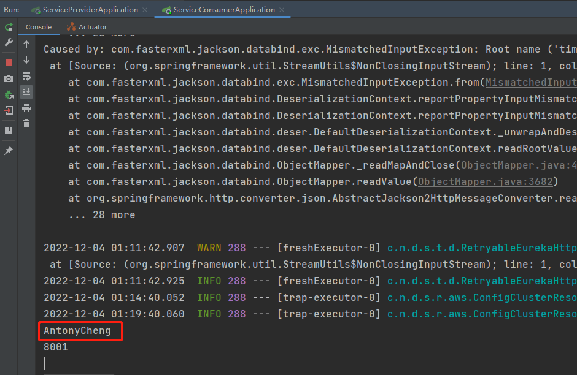

**这里需要对提供者yaml配置文件做如下修改：**

```yaml
#服务提供者的端口
server:
  port: 8001
spring:
  application:
    name: service-provider
eureka:
  client:
  #这是提供者，所以register-with-eureka就让它默认为true即可
  #但是不能确定是否会作为消费者，所以fetch-registry也让它默认为true
    serviceUrl:
      #因为有一个包含两个注册中心的Eureka集群，提供者需要知道两个注册中心的地址
      defaultZone: http://192.168.112.216:8000/eureka,http://192.168.112.181:8000
  instance:
    prefer-ip-address: true #如果是true，优先使用配置的ip地址作为getHost()的返回值
    ip-address: 127.0.0.1 #指定provider所在的主机的ip地址
```

修改后再次测试：


#### 心跳机制问题（提供者）

这是有关于提供者和注册中心之间的问题，注册中心需要收集提供者的“心跳”，以不断检测提供者是否存活；

完整的提供者yaml配置说明如下：

```yaml
#服务提供者的端口
server:
  port: 8001
spring:
  application:
    name: service-provider
eureka:
  client:
  #这是提供者，所以register-with-eureka就让它默认为true即可
  #但是不能确定是否会作为消费者，所以fetch-registry也让它默认为true
    serviceUrl:
      #因为有一个包含两个注册中心的Eureka集群，提供者需要知道两个注册中心的地址
      defaultZone: http://192.168.112.216:8000/eureka,http://192.168.112.181:8000
  instance:
    prefer-ip-address: true #如果是true，优先使用配置的ip地址作为getHost()的返回值
    ip-address: 127.0.0.1 #指定provider所在的主机的ip地址
    lease-expiration-duration-in-seconds: 90 #表示EurekaServer注册中心在收到上一个心跳之后，到等待下一个心跳的最大超时时间（单位是秒）
                                             #如果不能在指定的时间内收到心跳，Eureka注册中心认为实例不再存活
                                             #要么移除该实例，要么触发保护机制
    lease-renewal-interval-in-seconds: 30    #表示EurekaClient（Provider）向EurekaServer发送的心跳频率（默认30秒）
```

#### 服务列表抓取问题（消费者）

主要配置项就是消费者从注册中心抓取服务列表的时间间隔；

完整的消费者yaml配置说明如下：

```yaml
#服务消费者的端口
server:
  port: 8002
spring:
  application:
    name: service-consumer
  devtools:
    livereload:
      port: 35730
eureka:
  client:
    #这是消费者，所以fetch-registry就让它默认为true即可
    #假设我们确定不将它作为提供者，我们需要阻止它向注册中心投递注册信息
    register-with-eureka: false
    serviceUrl:
      #因为有一个包含两个注册中心的Eureka集群，消费者需要知道两个注册中心的地址
      defaultZone: http://192.168.112.216:8000/eureka,http://192.168.112.181:8000
    registry-fetch-interval-seconds: 30 #消费者从注册中心抓取服务列表的时间间隔
```

#### 注册中心配置

**服务下线：**

当服务进行正常关闭操作时，它会触发一个服务下线的REST请求给EurekaServer，告诉服务注册中心它要下线了，服务中心接到请求后将该服务设置为下线状态：


**服务剔除：**

如果服务注册中心并未收到”服务下线“的请求，服务注册中心在启动时会创建一个定时任务，默认每隔一段时间（默认为60秒）将当前服务列表中超时（90秒）没有续约的服务剔除，这个操作被称为失效；

**自我保护机制：**


自我保护机制的工作机制是**如果在15分钟内超过85%的客户端节点都没有正常的心跳**，那么Eureka就认为客户端与注册中心出现了网络故障，Eureka Server自动进入自我保护机制；

默认情况下，如果Eureka Server在一定时间内（默认90秒）没有接收到某个微服务实例的心跳，Eureka Server将会移除该实例。但是当网络分区故障发生时，微服务与Eureka Server之间无法正常通信，而微服务本身是正常运行的，此时不应该移除这微服务，所以引入了自我保护机制。

我们可以通过设置Eureka注册中心yaml配置文件中`eureka.server.enableselfPreservation=false` 关闭保护模式，那么一旦超时就会直接删除实例，一般开发中我们是不会关闭这个机制的；

## 10.4.Ribbon负载均衡

==主要配置在服务者==

### 10.4.1.概述

在微服务架构中，很多服务都会部署多个（多个实例），其他服务去调用该服务的时候，如何保证负载均衡是个不得不去考虑的问题。负载均衡可以增加系统的可用性和扩展性，当我们使用RestTemplate来调用其他服务时，Ribbon可以很方便的实现负载均衡功能；

Ribbon是Netflix发布的云中间层服务开源项目，其主要功能是提供客户端实现负载均衡算法。Ribbon客户端组件提供一系列完善的配置项如连接超时，重试等。简单的说，Ribbon是一个客户端负载均衡器，我们可以在配置文件中Load Balancer后面的所有机器，Ribbon会自动的帮助你基于某种负载均衡策略（如简单轮询，随机连接等）去连接这些机器，我们也很容易使用Ribbon实现自定义的负载均衡算法；


### 10.4.2.多服务实例测试

==以下配置均在Eureka集群搭建完成之后进行的修改配置；==

服务提供者的yaml配置文件（不变）：

```yaml
#服务提供者的端口
server:
  port: 8001 #此处稍后需要用Idea进行更改
spring:
  application:
    name: service-provider #这个Web应用名字会在后面用到
eureka:
  client:
  #这是提供者，所以register-with-eureka就让它默认为true即可
  #但是不能确定是否会作为消费者，所以fetch-registry也让它默认为true
    serviceUrl:
      #因为有一个包含两个注册中心的Eureka集群，提供者需要知道两个注册中心的地址
      defaultZone: http://192.168.112.216:8000/eureka,http://192.168.112.181:8000
  instance:
    prefer-ip-address: true #如果是true，优先使用配置的ip地址作为getHost()的返回值
    ip-address: 127.0.0.1 #指定provider所在的主机的ip地址
    lease-expiration-duration-in-seconds: 90 #表示EurekaServer注册中心在收到上一个心跳之后，到等待下一个心跳的最大超时时间（单位是秒）
                                             #如果不能在指定的时间内收到心跳，Eureka注册中心认为实例不再存活
                                             #要么移除该实例，要么触发保护机制
    lease-renewal-interval-in-seconds: 30    #表示EurekaClient（Provider）向EurekaServer发送的心跳频率（默认30秒）
```

但是提供者得多开端口，在Idea里面重新复制一份提供者很麻烦，我们可以进入Edit configuration...界面拷贝一份启动配置文件并且做出如下修改：


消费者需要在RestTemplate上标记负载均衡的注解@LoadBalanced；

```java
package com.example.serviceconsumer.config;

import org.springframework.cloud.client.loadbalancer.LoadBalanced;
import org.springframework.context.annotation.Bean;
import org.springframework.context.annotation.Configuration;
import org.springframework.web.client.RestTemplate;

/**
 * @Description
 * @Author:AntonyCheng
 * @CreateTime:2022/12/2 15:22
 */
@Configuration

public class RestConfig {
    @Bean
    @LoadBalanced
    public RestTemplate restTemplate() {
        return new RestTemplate();
    }
}
```

同时也要将消费者寻找服务的地址改成含有提供者Web应用名的地址 **http://${spring.application.name}……** 

```java
package com.example.serviceconsumer.handler;

import com.example.serviceconsumer.bean.Product;
import org.springframework.beans.factory.annotation.Autowired;
import org.springframework.cloud.client.ServiceInstance;
import org.springframework.cloud.client.discovery.DiscoveryClient;
import org.springframework.web.bind.annotation.GetMapping;
import org.springframework.web.bind.annotation.PathVariable;
import org.springframework.web.bind.annotation.RequestMapping;
import org.springframework.web.bind.annotation.RestController;
import org.springframework.web.client.RestTemplate;

import java.util.List;

/**
 * @Description
 * @Author:AntonyCheng
 * @CreateTime:2022/12/2 15:17
 */
@RestController
@RequestMapping(value = "/consumer/product")
public class ConsumerHandler {
    /**
     * 通过restTemplate完成Restful接口的调用
     */
    @Autowired
    private RestTemplate restTemplate;

    @Autowired
    private DiscoveryClient discoveryClient;

    @GetMapping("/{pid}")
    public Product getProductById(@PathVariable("pid") Integer pid) {
        /**
         * 使用负载均衡：Consumer通过Ribbon中的负载均衡策略获取到一个服务进行消费
         */
        return restTemplate.getForObject("http://service-provider/provider/product/" + pid, Product.class);
    }
}
```

然后我们直接去进行多次测试，查看控制台效果：


### 10.4.3.其他配置（了解）

**全局配置（配置在consumer端）**

```yaml
ribbon:
  ConnectTimeout: 1000 #服务请求连接超时时间 (毫秒)
  ReadTimeout: 3000 #服务请求处理超时时间 (毫秒)
  OkToRetryonA11operations: true #对超时请求启用重试机制
  MaxAutoRetriesNextserver: 1 #切换重试实例的最大个数
  MaxAutoRetries: 1 #切换实例后重试最大次数
  NFLoadBalancerRuleClassName: com.netflix.loadbalancer.RandomRule #修改负载均衡算法
```

**单实例配置**

```yaml
server-provider:
  ribbon:
    ConnectTimeout: 1000 #服务请求连接超时时间 (毫秒)
    ReadTimeout: 3000 #服务请求处理超时时间 (毫秒)
    OkToRetryOnAllOperations: true #对超时请求启用重试机制
    MaxAutoRetriesNextServer: 1 #切换重试实例的最大个数
    MaxAutoRetries: 1 #切换实例后重试最大次数
    NFLoadBalancerRuleClassName: com.netflix.loadbalancer.RandomRule #修改负载均衡算法
```

**负载均衡策略的配置选项**

```shell
com.netflix.loadbalancer.RandomRule: 从提供服务的实例中以随机的方式;
com.netf1ix.loadbalancer,RoundrobinRule: 以线性轮询的方式，就是维护一个计数器，从提供服务的实例中按顺序选取，第一次选第一个，第二次选第二个，以此类推，到最后一个以后再从头来过;
com.netf1ix.loadbalancer.RetryRule: 在RoundRobinRule的基础上添加重试机制，即在指定的重试时间内，反复使用线性轮询策略来选择可用实例;
com.netflix.loadbalancer,weightedResponseTimeRule: 对RoundrobinRule的扩展，响应速度越快的实例选择权重越大，越容易被选择;
com,netflix.loadbalancer,BestAvailableRule: 选择并发较小的实例;
com,netfTix.loadbalancer,AvailabilityFilteringRule: 先过滤掉故障实例，再选择并发较小的实例;
com.netf1ix,loadbalancer,ZoneAMareLoadBalancer:采用双重过滤，同时过滤不是同一区域的实例和故障实例，选择并发较小的实例。
```

## 10.5.Feign调用工具

==主要配置在消费者，而且已经自动集成Ribbon负载均衡；==

### 10.5.1.概述

Feign是声明式的服务调用工具（**作用于Consumer**），我们只需创建一个接口并用注解的方式来配置它，就可以实现对某个服务接口的调用，简化了直接使用RestTemplate来调用服务接口的开发量。Feign具备可插拔的注解支持，同时支持Feign注解及SpringMVC注解。当使用Feign时，Spring Cloud集成了Ribbon和Eureka以提供负载均衡的服务调用及基于Hystrix的服务容错保护功能。

### 10.5.2.代码实现


==该代码在Ribbon负载均衡的基础上进行改进，新建一个消费者模块进行测试；==

消费者依赖配置文件：

```xml
<?xml version="1.0" encoding="UTF-8"?>
<project xmlns="http://maven.apache.org/POM/4.0.0" xmlns:xsi="http://www.w3.org/2001/XMLSchema-instance"
         xsi:schemaLocation="http://maven.apache.org/POM/4.0.0 https://maven.apache.org/xsd/maven-4.0.0.xsd">
    <modelVersion>4.0.0</modelVersion>
    <parent>
        <groupId>top.sharehome</groupId>
        <artifactId>spring-cloud-eureka-one</artifactId>
        <version>0.0.1-SNAPSHOT</version>
    </parent>
    <artifactId>feign-service-consumer</artifactId>
    <version>0.0.1-SNAPSHOT</version>
    <name>feign-service-consumer</name>
    <description>feign-service-consumer</description>
    <properties>
        <java.version>1.8</java.version>
    </properties>

    <dependencies>
        <!-- 引入feign相关的配置 -->
        <dependency>
            <groupId>org.springframework.cloud</groupId>
            <artifactId>spring-cloud-starter-openfeign</artifactId>
        </dependency>
        <!-- Eureka客户端坐标 -->
        <dependency>
            <groupId>org.springframework.cloud</groupId>
            <artifactId>spring-cloud-starter-netflix-eureka-client</artifactId>
        </dependency>
    </dependencies>

    <build>
        <plugins>
            <plugin>
                <groupId>org.springframework.boot</groupId>
                <artifactId>spring-boot-maven-plugin</artifactId>
            </plugin>
        </plugins>
    </build>

</project>
```

消费者yaml配置文件：

```yaml
#服务消费者的端口
server:
  port: 8004
spring:
  application:
    name: service-consumer
  devtools:
    livereload:
      port: 35730
eureka:
  client:
    #这是消费者，所以fetch-registry就让它默认为true即可
    #假设我们确定不将它作为提供者，我们需要阻止它向注册中心投递注册信息
    register-with-eureka: false
    serviceUrl:
      #因为有一个包含两个注册中心的Eureka集群，消费者需要知道两个注册中心的地址
      defaultZone: http://192.168.112.216:8000/eureka,http://192.168.112.181:8000
#想要看到Feign的日志，就需要配置通用的日志信息记录
logging:
  level:
    top.sharehome.feignserviceconsumer.service: debug
```

消费者JavaBean：

```java
package top.sharehome.feignserviceconsumer.bean;

/**
 * @Description
 * @Author:AntonyCheng
 * @CreateTime:2022/12/2 15:02
 */

public class Product {
    private Integer pid;
    private String pname;
    private double price;

    public Integer getPid() {
        return pid;
    }

    public void setPid(Integer pid) {
        this.pid = pid;
    }

    public String getPname() {
        return pname;
    }

    public void setPname(String pname) {
        this.pname = pname;
    }

    public double getPrice() {
        return price;
    }

    public void setPrice(double price) {
        this.price = price;
    }

    public Product(Integer pid, String pname, double price) {
        this.pid = pid;
        this.pname = pname;
        this.price = price;
    }

    public Product() {
    }
}
```

消费者服务接口：

```java
package top.sharehome.feignserviceconsumer.service;

import org.springframework.cloud.openfeign.FeignClient;
import org.springframework.web.bind.annotation.GetMapping;
import org.springframework.web.bind.annotation.PathVariable;
import top.sharehome.feignserviceconsumer.bean.Product;

/**
 * @Description 在@FeignClient注解中指定提供者的application.name
 *              在接口定义的方法其实就是提供者者方法的抽象形式
 * @Author:AntonyCheng
 * @CreateTime:2022/12/4 23:14
 */
@FeignClient(name = "service-provider")
public interface ProductFeignService {
    /**
     * 对ProductHandler中的方法进行绑定
     * @param pid
     * @return
     */
    @GetMapping("/provider/product/{pid}")
    public Product getProductById(@PathVariable("pid") Integer pid);

}
```

消费者Handler：

```java
package top.sharehome.feignserviceconsumer.handler;

import org.springframework.beans.factory.annotation.Autowired;
import org.springframework.stereotype.Controller;
import org.springframework.web.bind.annotation.GetMapping;
import org.springframework.web.bind.annotation.PathVariable;
import org.springframework.web.bind.annotation.RequestMapping;
import org.springframework.web.bind.annotation.RestController;
import top.sharehome.feignserviceconsumer.bean.Product;
import top.sharehome.feignserviceconsumer.service.ProductFeignService;

/**
 * @Description
 * @Author:AntonyCheng
 * @CreateTime:2022/12/4 23:20
 */
@RestController
@RequestMapping("/consumer/product")
public class FeignHandler {
    @Autowired
    private ProductFeignService productFeignService;

    @GetMapping("/{pid}")
    public Product getProductById(@PathVariable("pid") Integer pid) {
        return productFeignService.getProductById(pid);
    }
}
```

消费者配置类：（Feign日志配置）

```java
package top.sharehome.feignserviceconsumer.config;

import feign.Logger;
import org.springframework.context.annotation.Bean;
import org.springframework.context.annotation.Configuration;

/**
 * @Description 配置Feign的日志级别
 * @Author:AntonyCheng
 * @CreateTime:2022/12/4 23:33
 */
@Configuration
public class FeignConfig {
    @Bean
    public Logger.Level level(){
        return Logger.Level.FULL;
    }
}

```

Feign日志级别：

- NONE：默认，不显示任何日志；
- BASIC：仅记录请求方法、URL、相应以及执行时间；
- HEADERS：除了BASIC中定义的信息以外，还有请求头和响应头；
- FULL：除了HEADERS中定义的信息之外，还有请求和响应的正文及元数据；

消费者启动类：

```java
package top.sharehome.feignserviceconsumer;

import org.springframework.boot.SpringApplication;
import org.springframework.boot.autoconfigure.SpringBootApplication;
import org.springframework.cloud.netflix.eureka.EnableEurekaClient;
import org.springframework.cloud.openfeign.EnableFeignClients;

@SpringBootApplication
@EnableFeignClients
public class FeignServiceConsumerApplication {

   public static void main(String[] args) {
      SpringApplication.run(FeignServiceConsumerApplication.class, args);
   }

}
```

**准备测试：**

默认Eureka集群和Ribbon负载均衡均已搭建，提供者已经被启动；

直接启动消费者启动类即可；

**测试结果如下：**


日志信息：


### 10.5.3.其他配置

==Feign的这些配置需要配置到consumer中：==

```yaml
feign:
  hystrix:
    enabled: true #在Feign中开启Hystrixcompression :
  request:
    enabled: false #是否对请求进行GZIP压缩
    mime-types: text/xml,application/xml,application/json #指定压缩的请求数据类型min-request-size: 2048 #超过该大小的请求会被压缩
  response:
    enabled: false #是否对响应进行GZIP压缩
```

## 10.6.Hystri熔断器

==主要配置在消费者中，当消费者远程调用生产者的方法时会判断调用成功与否，如果成功就顺利调用，如果不成功就熔断，执行调用失败的方法；==

### 10.6.1.雪崩效应

随着业务的不断扩展以及复杂度不断提升，服务的数量也会随之增多，逻辑变得越来越复杂，一个服务的某个逻辑需要依赖多个其他服务才能完成，一旦一个依赖不能提供服务，就很有可能产生雪崩效应，最后导致整个服务不可访问；

即使所有依赖项都表现良好，**如果您不为整个系统设计弹性**，即使 0.01% 的停机时间对几十个服务中的每一个的总影响也等同于每月潜在的几个小时的停机时间；

当一切正常时，请求流程可能如下所示：


当许多后端系统中的一个变成潜在故障的时候，它可以阻止整个用户请求：


在高流量的情况下，单个后端依赖性变得潜在可能会导致所有服务器上的所有资源在几秒钟内变得饱和，应用程序中通过网络延伸或进入可能导致网络请求的客户端库的每个点都是潜在故障的来源。比故障更糟糕的是，这些应用程序还可能导致服务之间的延迟增加，这会备份队列、线程和其他系统资源，从而导致整个系统发生更多的级联故障；


### 10.6.2.Hystrix概述

Hystrix是一个由Netflix发起的用于处理分布式系统的延迟和容错的开源库，在分布式系统中，许多依赖不可避免的会调用失败，比如超时和异常等，Hystrix能够保证在一个依赖出问题的情况下，不会导致整体服务失败，避免级联故障，以提高分布式系统的弹性；

Hystrix具备服务降级、服务熔断、线程隔离、请求缓存、请求合并以及服务监控等强大功能；

### 10.6.3.Hystrix降级

#### 概述

**熔断：**如果某个目标服务调用慢或者有大量超市，此时，熔断该服务的调用，对于后续调用求情，不再继续调用目标服务，直接返回，快速释放资源，如果目标服务好转再恢复调用；


**服务降级：**当某个服务熔断后，我们可以准备一个 fallback 的回调，返回一个自定义的值；

例如：对于一个查询操作，我们可以实现一个fallback的方法，当请求后端查询服务出现异常的时候，可以使用 fallback 方法返回的值，告知后面的请求服务不可用，不要再请求了；

#### Hystrix结合RestTemplate实现降级

下面代码运行环境是在Eureka注册中心集群配置好后的情况下：


父工程依赖文件：

```xml
<?xml version="1.0" encoding="UTF-8"?>
<project xmlns="http://maven.apache.org/POM/4.0.0" xmlns:xsi="http://www.w3.org/2001/XMLSchema-instance"
         xsi:schemaLocation="http://maven.apache.org/POM/4.0.0 https://maven.apache.org/xsd/maven-4.0.0.xsd">
    <modelVersion>4.0.0</modelVersion>
    <parent>
        <groupId>org.springframework.boot</groupId>
        <artifactId>spring-boot-starter-parent</artifactId>
        <version>2.7.6</version>
        <relativePath/> <!-- lookup parent from repository -->
    </parent>
    <packaging>pom</packaging>
    <groupId>top.sharehome</groupId>
    <artifactId>spring-cloud-hystrix</artifactId>
    <version>0.0.1-SNAPSHOT</version>
    <name>spring-cloud-hystrix</name>
    <description>spring-cloud-hystrix</description>
    <properties>
        <java.version>1.8</java.version>
        <spring-cloud.version>2021.0.5</spring-cloud.version>
    </properties>
    <modules>
        <module>eureka-server</module>
        <module>service-provider</module>
        <module>feign-service-consumer</module>
        <module>hystrix-service-consumer</module>
    </modules>
    <!--
    dependencyManagement标签仅仅为了锁定版本，做好版本兼容性，并没有起引入依赖
    如果我们想用里面什么样的依赖，我们就单独去引入
    -->
    <dependencyManagement>
        <dependencies>
            <dependency>
                <groupId>org.springframework.cloud</groupId>
                <artifactId>spring-cloud-dependencies</artifactId>
                <version>${spring-cloud.version}</version>
                <type>pom</type>
                <scope>import</scope>
            </dependency>
        </dependencies>
    </dependencyManagement>
    <dependencies>
        <!-- web开发相关的（SpringMVC） -->
        <dependency>
            <groupId>org.springframework.boot</groupId>
            <artifactId>spring-boot-starter-web</artifactId>
        </dependency>
        <!--这个spring-cloud-starter一旦引入，所有的依赖都会引入，会显得臃肿，所以注释-->
        <!--<dependency>-->
        <!--    <groupId>org.springframework.cloud</groupId>-->
        <!--    <artifactId>spring-cloud-starter</artifactId>-->
        <!--</dependency>-->
        <!-- 开发工具 -->
        <dependency>
            <groupId>org.springframework.boot</groupId>
            <artifactId>spring-boot-devtools</artifactId>
            <scope>runtime</scope>
            <optional>true</optional>
        </dependency>
        <dependency>
            <groupId>org.springframework.boot</groupId>
            <artifactId>spring-boot-starter-test</artifactId>
            <scope>test</scope>
        </dependency>
    </dependencies>

    <build>
        <plugins>
            <plugin>
                <groupId>org.springframework.boot</groupId>
                <artifactId>spring-boot-maven-plugin</artifactId>
            </plugin>
        </plugins>
    </build>

</project>
```

消费者依赖文件：

```xml
<?xml version="1.0" encoding="UTF-8"?>
<project xmlns="http://maven.apache.org/POM/4.0.0" xmlns:xsi="http://www.w3.org/2001/XMLSchema-instance"
   xsi:schemaLocation="http://maven.apache.org/POM/4.0.0 https://maven.apache.org/xsd/maven-4.0.0.xsd">
   <modelVersion>4.0.0</modelVersion>
   <parent>
      <groupId>top.sharehome</groupId>
      <artifactId>spring-cloud-hystrix</artifactId>
      <version>0.0.1-SNAPSHOT</version>
   </parent>
   <artifactId>hystrix-service-consumer</artifactId>
   <version>0.0.1-SNAPSHOT</version>
   <name>hystrix-service-consumer</name>
   <description>hystrix-service-consumer</description>
   <properties>
      <java.version>1.8</java.version>
   </properties>
   <dependencies>
      <dependency>
         <groupId>org.springframework.cloud</groupId>
         <artifactId>spring-cloud-starter-netflix-eureka-client</artifactId>
      </dependency>
      <!-- hystrix对应依赖文件 -->
      <dependency>
         <groupId>org.springframework.cloud</groupId>
         <artifactId>spring-cloud-starter-netflix-hystrix</artifactId>
         <version>2.2.10.RELEASE</version>
      </dependency>
   </dependencies>
   <build>
      <plugins>
         <plugin>
            <groupId>org.springframework.boot</groupId>
            <artifactId>spring-boot-maven-plugin</artifactId>
         </plugin>
      </plugins>
   </build>

</project>
```

**通用JavaBean：**

Product类：

```java
package top.sharehome.hystrixserviceconsumer.bean;

/**
 * @Description
 * @Author:AntonyCheng
 * @CreateTime:2022/12/2 15:02
 */

public class Product {
    private Integer pid;
    private String pname;
    private double price;

    public Integer getPid() {
        return pid;
    }

    public void setPid(Integer pid) {
        this.pid = pid;
    }

    public String getPname() {
        return pname;
    }

    public void setPname(String pname) {
        this.pname = pname;
    }

    public double getPrice() {
        return price;
    }

    public void setPrice(double price) {
        this.price = price;
    }

    public Product(Integer pid, String pname, double price) {
        this.pid = pid;
        this.pname = pname;
        this.price = price;
    }

    public Product() {
    }
}
```

Result类：

==给返回值在封装成结果集，即给返回值配上状态码和相应的提示信息，这个类似于网页的后台响应；==

```java
package top.sharehome.hystrixserviceconsumer.bean;

/**
 * @Description 定义返回数据的格式
 * @Author:AntonyCheng
 * @CreateTime:2022/12/6 21:01
 */

public class Result<T> {
    /**
     * 状态码
     */
    private int statusCode;

    /**
     * 状态码对应的提示信息
     */
    private String message;

    /**
     * 封装的数据
     */
    private T data;

    public Result() {
    }

    public Result(int statusCode, String message, T data) {
        this.statusCode = statusCode;
        this.message = message;
        this.data = data;
    }

    public int getStatusCode() {
        return statusCode;
    }

    public void setStatusCode(int statusCode) {
        this.statusCode = statusCode;
    }

    public String getMessage() {
        return message;
    }

    public void setMessage(String message) {
        this.message = message;
    }

    public T getData() {
        return data;
    }

    public void setData(T data) {
        this.data = data;
    }
}
```

提供者服务方法接口：

```java
package top.sharehome.serviceprovider.service;

import top.sharehome.serviceprovider.bean.Product;

import java.util.List;

/**
 * @Description
 * @Author:AntonyCheng
 * @CreateTime:2022/12/2 15:03
 */

public interface ProductService {
    Product getProductById(Integer pid);

    List<Product> findAll();
}
```

提供者服务方法实现类：

```java
package top.sharehome.serviceprovider.service.impl;

import org.springframework.stereotype.Service;
import top.sharehome.serviceprovider.bean.Product;
import top.sharehome.serviceprovider.service.ProductService;

import java.util.Arrays;
import java.util.List;

/**
 * @Description
 * @Author:AntonyCheng
 * @CreateTime:2022/12/2 15:04
 */
@Service
public class ProductServiceImpl implements ProductService {
    @Override
    public Product getProductById(Integer pid) {
        return new Product(pid, "iPhone", 5000);
    }

    @Override
    public List<Product> findAll() {
        return Arrays.asList(
                new Product(10, "iPhone", 5999),
                new Product(12, "Huawei", 5999)
        );
    }
}
```

提供者Handler：

```java
package top.sharehome.serviceprovider.handler;

import org.springframework.beans.factory.annotation.Autowired;
import org.springframework.beans.factory.annotation.Value;
import org.springframework.web.bind.annotation.GetMapping;
import org.springframework.web.bind.annotation.PathVariable;
import org.springframework.web.bind.annotation.RequestMapping;
import org.springframework.web.bind.annotation.RestController;
import top.sharehome.serviceprovider.bean.Product;
import top.sharehome.serviceprovider.bean.Result;
import top.sharehome.serviceprovider.service.ProductService;

import java.util.List;

/**
 * @Description
 * @Author:AntonyCheng
 * @CreateTime:2022/12/2 15:08
 */
@RestController
@RequestMapping("/provider/product")
public class ProductHandler {
    @Autowired
    private ProductService productService;

    @GetMapping("/{pid}")
    public Result<Product> getProductById(@PathVariable("pid") Integer pid) {
        //制造服务中断
        //System.out.println(1/0);
        return new Result<Product>(200, "OK", productService.getProductById(pid));
    }

    @GetMapping("/list")
    public Result<List<Product>> findAll() {
        //制造服务中断
        //System.out.println(1/0);
        return new Result<List<Product>>(200, "OK", productService.findAll());
    }
}
```

消费者Handler类：

```java
package top.sharehome.hystrixserviceconsumer.handler;

import com.netflix.hystrix.contrib.javanica.annotation.DefaultProperties;
import com.netflix.hystrix.contrib.javanica.annotation.HystrixCommand;
import org.springframework.beans.factory.annotation.Autowired;
import org.springframework.cloud.client.discovery.DiscoveryClient;
import org.springframework.web.bind.annotation.GetMapping;
import org.springframework.web.bind.annotation.PathVariable;
import org.springframework.web.bind.annotation.RequestMapping;
import org.springframework.web.bind.annotation.RestController;
import org.springframework.web.client.RestTemplate;
import top.sharehome.hystrixserviceconsumer.bean.Product;
import top.sharehome.hystrixserviceconsumer.bean.Result;

import java.util.List;

/**
 * @Description
 * @Author:AntonyCheng
 * @CreateTime:2022/12/2 15:17
 */
@RestController
@RequestMapping(value = "/consumer/product/")
@DefaultProperties(defaultFallback = "generalFallback") //@DefaultProperties注解指定统一降级方法
public class ConsumerHandler {
    /**
     * 通过restTemplate完成Restful接口的调用
     */
    @Autowired
    private RestTemplate restTemplate;

    @GetMapping("/{pid}")
    @HystrixCommand(fallbackMethod = "getProductByIdFallback") //@HystrixCommand注解指定对应降级方法
    public Result getProductById(@PathVariable("pid") Integer pid) {
        return restTemplate.getForObject("http://service-provider/provider/product/" + pid, Result.class);
    }

    /**
     * 在服务方法上绑定的降级方法，形参和返回值需要兼容
     */
    public Result<Product> getProductByIdFallback(Integer pid) {
        return new Result<Product>(500, "getProductById方法出现了错误！", null);
    }

    @GetMapping("/list")
    @HystrixCommand
    public Result findAll() {
        return restTemplate.getForObject("http://service-provider/provider/product/list", Result.class);
    }

    /**
     * 统一降级方法
     * @return
     */
    public Result generalFallback(){
        return new Result<Product>(500, "统一被降级！", null);
    }
}
```

消费者启动类：

```java
package top.sharehome.hystrixserviceconsumer;

import org.springframework.boot.SpringApplication;
import org.springframework.boot.autoconfigure.SpringBootApplication;
import org.springframework.cloud.client.circuitbreaker.EnableCircuitBreaker;
import org.springframework.cloud.netflix.hystrix.EnableHystrix;

@SpringBootApplication
//@EnableHystrix注解给该消费者类引入熔断机制
@EnableHystrix
public class HystrixServiceConsumerApplication {

	public static void main(String[] args) {
		SpringApplication.run(HystrixServiceConsumerApplication.class, args);
	}

}
```

**测试准备：**

启动Eureka集群，然后启动提供者启动类和消费者启动类；

**测试如下：**

当提供者Handler中不制造中断时，访问结果如下：


当提供者Handler中制造中断时，访问结果如下：


**从上面两张图可以看出，当统一降级方法和指定降级方法冲突时，以指定降级方法为准；**

#### Hystrix结合Feign实现降级

相比于Hystrix结合RestTemplate以方法对应方法的方式实现降级，这种方法更加简单和高内聚；

简而言之就是当服务正常提供时，以REST方式在Feign接口中调用远程的方法，当服务不能正常提供时，就在Feign接口的实现类中调用对应远程方法的fallback方法；

**代码实现如下：**


父工程依赖和Hystrix结合RestTemplate实现降级一样；

**通用JavaBean：**

Product类：

```java
package top.sharehome.hystrixserviceconsumer.bean;

/**
 * @Description
 * @Author:AntonyCheng
 * @CreateTime:2022/12/2 15:02
 */

public class Product {
    private Integer pid;
    private String pname;
    private double price;

    public Integer getPid() {
        return pid;
    }

    public void setPid(Integer pid) {
        this.pid = pid;
    }

    public String getPname() {
        return pname;
    }

    public void setPname(String pname) {
        this.pname = pname;
    }

    public double getPrice() {
        return price;
    }

    public void setPrice(double price) {
        this.price = price;
    }

    public Product(Integer pid, String pname, double price) {
        this.pid = pid;
        this.pname = pname;
        this.price = price;
    }

    public Product() {
    }
}
```

Result类：

==给返回值在封装成结果集，即给返回值配上状态码和相应的提示信息，这个类似于网页的后台响应；==

```java
package top.sharehome.hystrixserviceconsumer.bean;

/**
 * @Description 定义返回数据的格式
 * @Author:AntonyCheng
 * @CreateTime:2022/12/6 21:01
 */

public class Result<T> {
    /**
     * 状态码
     */
    private int statusCode;

    /**
     * 状态码对应的提示信息
     */
    private String message;

    /**
     * 封装的数据
     */
    private T data;

    public Result() {
    }

    public Result(int statusCode, String message, T data) {
        this.statusCode = statusCode;
        this.message = message;
        this.data = data;
    }

    public int getStatusCode() {
        return statusCode;
    }

    public void setStatusCode(int statusCode) {
        this.statusCode = statusCode;
    }

    public String getMessage() {
        return message;
    }

    public void setMessage(String message) {
        this.message = message;
    }

    public T getData() {
        return data;
    }

    public void setData(T data) {
        this.data = data;
    }
}
```

提供者服务接口：

```java
package top.sharehome.serviceprovider.service;

import top.sharehome.serviceprovider.bean.Product;

import java.util.List;

/**
 * @Description
 * @Author:AntonyCheng
 * @CreateTime:2022/12/2 15:03
 */

public interface ProductService {
    Product getProductById(Integer pid);

    List<Product> findAll();
}
```

提供者服务实现类：

```java
package top.sharehome.serviceprovider.service.impl;

import org.springframework.stereotype.Service;
import top.sharehome.serviceprovider.bean.Product;
import top.sharehome.serviceprovider.service.ProductService;

import java.util.Arrays;
import java.util.List;

/**
 * @Description
 * @Author:AntonyCheng
 * @CreateTime:2022/12/2 15:04
 */
@Service
public class ProductServiceImpl implements ProductService {
    @Override
    public Product getProductById(Integer pid) {
        return new Product(pid, "iPhone", 5000);
    }

    @Override
    public List<Product> findAll() {
        return Arrays.asList(
                new Product(10, "iPhone", 5999),
                new Product(12, "Huawei", 5999)
        );
    }
}
```

提供者Handler类：

```java
package top.sharehome.serviceprovider.handler;

import org.springframework.beans.factory.annotation.Autowired;
import org.springframework.beans.factory.annotation.Value;
import org.springframework.web.bind.annotation.GetMapping;
import org.springframework.web.bind.annotation.PathVariable;
import org.springframework.web.bind.annotation.RequestMapping;
import org.springframework.web.bind.annotation.RestController;
import top.sharehome.serviceprovider.bean.Product;
import top.sharehome.serviceprovider.bean.Result;
import top.sharehome.serviceprovider.service.ProductService;

import java.util.List;

/**
 * @Description
 * @Author:AntonyCheng
 * @CreateTime:2022/12/2 15:08
 */
@RestController
@RequestMapping("/provider/product")
public class ProductHandler {
    @Autowired
    private ProductService productService;

    @GetMapping("/{pid}")
    public Result<Product> getProductById(@PathVariable("pid") Integer pid) {
        //制造服务中断
        //System.out.println(1/0);
        return new Result<Product>(200, "OK", productService.getProductById(pid));
    }

    @GetMapping("/list")
    public Result<List<Product>> findAll() {
        //制造服务中断
        //System.out.println(1/0);
        return new Result<List<Product>>(200, "OK", productService.findAll());
    }
}
```

消费者依赖文件：

```xml
<?xml version="1.0" encoding="UTF-8"?>
<project xmlns="http://maven.apache.org/POM/4.0.0" xmlns:xsi="http://www.w3.org/2001/XMLSchema-instance"
         xsi:schemaLocation="http://maven.apache.org/POM/4.0.0 https://maven.apache.org/xsd/maven-4.0.0.xsd">
    <modelVersion>4.0.0</modelVersion>
    <parent>
        <groupId>top.sharehome</groupId>
        <artifactId>spring-cloud-hystrix</artifactId>
        <version>0.0.1-SNAPSHOT</version>
    </parent>
    <artifactId>hystrix-feign-service-consumer</artifactId>
    <version>0.0.1-SNAPSHOT</version>
    <name>hystrix-feign-service-consumer</name>
    <description>hystrix-feign-service-consumer</description>
    <properties>
        <java.version>1.8</java.version>
    </properties>
    <dependencies>
        <dependency>
            <groupId>org.springframework.cloud</groupId>
            <artifactId>spring-cloud-starter-netflix-eureka-client</artifactId>
        </dependency>
        <!-- hystrix对应依赖文件 -->
        <dependency>
            <groupId>org.springframework.cloud</groupId>
            <artifactId>spring-cloud-starter-netflix-hystrix</artifactId>
            <version>2.2.10.RELEASE</version>
        </dependency>
        <!-- 引入feign相关的配置 -->
        <dependency>
            <groupId>org.springframework.cloud</groupId>
            <artifactId>spring-cloud-starter-openfeign</artifactId>
        </dependency>
    </dependencies>

    <build>
        <plugins>
            <plugin>
                <groupId>org.springframework.boot</groupId>
                <artifactId>spring-boot-maven-plugin</artifactId>
            </plugin>
        </plugins>
    </build>

</project>
```

消费者yaml配置文件：

```yaml
server:
  port: 8004
spring:
  application:
    name: hystrix-feign-service-consumer
  devtools:
    livereload:
      port: 35730
eureka:
  client:
    serviceUrl:
      defaultZone: http://192.168.112.216:8000/eureka,http://192.168.112.181:8000
#启用feign的降级
#开启熔断，如果SpringBoot版本较低，请使用注释部分配置
feign:
#  httpclient:
#    enabled: true
  client:
    config:
      metaDataClient:
        connect-timeout: 10000
        read-timeout: 10000
  #  hystrix:
  #    enabled: true
  circuitBreaker:
    enabled: true
logging:
  level:
    top.sharehome.feignserviceconsumer.service: debug
```

消费者Feign服务接口：

```java
package top.sharehome.hystrixfeignserviceconsumer.service;

import org.springframework.cloud.openfeign.FeignClient;
import org.springframework.web.bind.annotation.GetMapping;
import org.springframework.web.bind.annotation.PathVariable;
import top.sharehome.hystrixfeignserviceconsumer.bean.Product;
import top.sharehome.hystrixfeignserviceconsumer.bean.Result;
import top.sharehome.hystrixfeignserviceconsumer.service.impl.ProductFeignServiceFallback;

/**
 * @Description 在@FeignClient注解中name值指定提供者的application.name
 *                                fallback值指定熔断fallback类的字节码文件
 *              在接口定义的方法其实就是提供者者方法的抽象形式
 * @Author:AntonyCheng
 * @CreateTime:2022/12/4 23:14
 */
@FeignClient(name = "service-provider", fallback = ProductFeignServiceFallback.class)
public interface ProductFeignService {
    /**
     * 对ProductHandler中的方法进行绑定
     *
     * @param pid
     * @return
     */
    @GetMapping("/provider/product/{pid}")
    Result getProductById(@PathVariable("pid") Integer pid);

    @GetMapping("/provider/product/list")
    Result findAll();
}
```

消费者Feign服务熔断实现类：

```java
package top.sharehome.hystrixfeignserviceconsumer.service.impl;

import org.springframework.stereotype.Component;
import top.sharehome.hystrixfeignserviceconsumer.bean.Result;
import top.sharehome.hystrixfeignserviceconsumer.service.ProductFeignService;

/**
 * @Description 这个类继承Feign的接口，当Feign调用服务出现问题时会调用里面对应的方法
 * @Author:AntonyCheng
 * @CreateTime:2022/12/7 00:47
 */
@Component
public class ProductFeignServiceFallback implements ProductFeignService {
    @Override
    public Result getProductById(Integer pid) {
        return new Result(500, "getProductById降级信息", null);
    }

    @Override
    public Result findAll() {
        return new Result(500, "findAll降级信息", null);
    }
}
```

消费者Handler类：

```java
package top.sharehome.hystrixfeignserviceconsumer.handler;

import org.springframework.beans.factory.annotation.Autowired;
import org.springframework.web.bind.annotation.GetMapping;
import org.springframework.web.bind.annotation.PathVariable;
import org.springframework.web.bind.annotation.RequestMapping;
import org.springframework.web.bind.annotation.RestController;
import top.sharehome.hystrixfeignserviceconsumer.bean.Result;
import top.sharehome.hystrixfeignserviceconsumer.service.ProductFeignService;

/**
 * @Description
 * @Author:AntonyCheng
 * @CreateTime:2022/12/4 23:20
 */
@RestController
@RequestMapping("/consumer/product")
public class FeignHandler {
    @Autowired
    private ProductFeignService productFeignService;

    @GetMapping("/{pid}")
    public Result getProductById(@PathVariable("pid") Integer pid) {
        return productFeignService.getProductById(pid);
    }

    @GetMapping("/list")
    public Result findAll() {
        return productFeignService.findAll();
    }
}
```

**准备测试：**

测试环境在Eureka集群下完成，启动提供者和消费者的启动类：

**测试如下：**

当提供者Handler中不制造中断时，访问结果如下：


当提供者Handler中制造中断时，访问结果如下：


### 10.6.4.Hystrix监控面板

Hystrix Dashboard 主要用来实现监控 Hystrix 相关工程的各项指标信息，通过Hystrix Dashboard 反馈的实时信息，可以帮助我们快速发现系统中存在的问题；

**实现如下：**


父工程依赖依旧不变，Hystrix控制面板页面依赖如下：

```java
<?xml version="1.0" encoding="UTF-8"?>
<project xmlns="http://maven.apache.org/POM/4.0.0" xmlns:xsi="http://www.w3.org/2001/XMLSchema-instance"
         xsi:schemaLocation="http://maven.apache.org/POM/4.0.0 https://maven.apache.org/xsd/maven-4.0.0.xsd">
    <modelVersion>4.0.0</modelVersion>
    <parent>
        <groupId>top.sharehome</groupId>
        <artifactId>spring-cloud-hystrix</artifactId>
        <version>0.0.1-SNAPSHOT</version>
    </parent>
    <artifactId>hystrix-dashboard</artifactId>
    <version>0.0.1-SNAPSHOT</version>
    <name>hystrix-dashboard</name>
    <description>hystrix-dashboard</description>
    <properties>
        <java.version>1.8</java.version>
    </properties>
    <dependencies>
        <!-- hystrix对应依赖文件 -->
        <dependency>
            <groupId>org.springframework.cloud</groupId>
            <artifactId>spring-cloud-starter-netflix-hystrix</artifactId>
            <version>2.2.10.RELEASE</version>
        </dependency>
        <!-- hystrix dashboard对应依赖文件 -->
        <dependency>
            <groupId>org.springframework.cloud</groupId>
            <artifactId>spring-cloud-starter-netflix-hystrix-dashboard</artifactId>
            <version>2.2.10.RELEASE</version>
        </dependency>
    </dependencies>

    <build>
        <plugins>
            <plugin>
                <groupId>org.springframework.boot</groupId>
                <artifactId>spring-boot-maven-plugin</artifactId>
            </plugin>
        </plugins>
    </build>

</project>
```

Hystrix控制面板yaml配置文件：

```yaml
#默认访问网址是http://localhost:9000/hystrix
server:
  port: 9000
#需要配置面板能够监控到的主机，"*"表示所有主机
hystrix:
  dashboard:
    proxyStreamAllowList: "*"
```

Hystrix控制面板启动类：

```java
package top.sharehome.hystrixdashboard;

import org.springframework.boot.SpringApplication;
import org.springframework.boot.autoconfigure.SpringBootApplication;
import org.springframework.cloud.netflix.hystrix.dashboard.EnableHystrixDashboard;

@SpringBootApplication
//启动Hystrix面板
@EnableHystrixDashboard
public class HystrixDashboardApplication {

    public static void main(String[] args) {
        SpringApplication.run(HystrixDashboardApplication.class, args);
    }

}
```

当我们配置好以上内容时，一个Hystrix控制面板我们也就配置完成了，但是我们需要对它和需要纳入控制面板的消费者进行双向授权，控制面板的yaml文件中已经允许控制面板对 "*" 的消费者地址进行访问；

下面需要让对应的消费者接受访问：

消费者依赖文件：

```xml
<?xml version="1.0" encoding="UTF-8"?>
<project xmlns="http://maven.apache.org/POM/4.0.0" xmlns:xsi="http://www.w3.org/2001/XMLSchema-instance"
         xsi:schemaLocation="http://maven.apache.org/POM/4.0.0 https://maven.apache.org/xsd/maven-4.0.0.xsd">
    <modelVersion>4.0.0</modelVersion>
    <parent>
        <groupId>top.sharehome</groupId>
        <artifactId>spring-cloud-hystrix</artifactId>
        <version>0.0.1-SNAPSHOT</version>
    </parent>
    <artifactId>hystrix-service-consumer</artifactId>
    <version>0.0.1-SNAPSHOT</version>
    <name>hystrix-service-consumer</name>
    <description>hystrix-service-consumer</description>
    <properties>
        <java.version>1.8</java.version>
    </properties>
    <dependencies>
        <dependency>
            <groupId>org.springframework.cloud</groupId>
            <artifactId>spring-cloud-starter-netflix-eureka-client</artifactId>
        </dependency>
        <!-- hystrix对应依赖文件 -->
        <dependency>
            <groupId>org.springframework.cloud</groupId>
            <artifactId>spring-cloud-starter-netflix-hystrix</artifactId>
            <version>2.2.10.RELEASE</version>
        </dependency>
        <!-- 纳入Hystrix控制面板的依赖 -->
        <dependency>
            <groupId>org.springframework.boot</groupId>
            <artifactId>spring-boot-starter-actuator</artifactId>
        </dependency>

    </dependencies>
    <build>
        <plugins>
            <plugin>
                <groupId>org.springframework.boot</groupId>
                <artifactId>spring-boot-maven-plugin</artifactId>
            </plugin>
        </plugins>
    </build>

</project>
```

消费者yaml配置文件：

```yaml
server:
  port: 8002
spring:
  application:
    name: hystrix-service-consumer
  devtools:
    livereload:
      port: 35730
eureka:
  client:
    serviceUrl:
      defaultZone: http://192.168.112.216:8000/eureka,http://192.168.112.181:8000
#想要该消费者被Hystrix所检测，需要暴露节点，"*"就代表所有节点
management:
  endpoints:
    web:
      exposure:
        include: "*"
```

**准备测试：**

这个测试在Eureka集群环境下进行，首先启动Hystrix控制面板启动类，然后访问如下：


然后按照红框内提示输入消费者的hystrix-app（主机地址）和port，其他部分不变（https改为http），然后监管这个网络数据流：


Hystrix面板搭建搭建单一服务检测的工作就完成了；

 **参数说明：**


#### 整合turbine

以上是对于单一服务的监控，下面整合turbine，用以拉取Eureka集群中的服务；

这里使用两个消费者来实现从集群中进行服务拉取，它们的 application.name 分别是 hystrix-feign-service-consumer 和 hystrix-service-consumer ，它们需要进行相同的修改，一个是依赖配置文件，另一个是yaml配置文件：

消费者依赖文件（dependence相同）：

```xml
<?xml version="1.0" encoding="UTF-8"?>
<project xmlns="http://maven.apache.org/POM/4.0.0" xmlns:xsi="http://www.w3.org/2001/XMLSchema-instance"
         xsi:schemaLocation="http://maven.apache.org/POM/4.0.0 https://maven.apache.org/xsd/maven-4.0.0.xsd">
    <modelVersion>4.0.0</modelVersion>
    <parent>
        <groupId>top.sharehome</groupId>
        <artifactId>spring-cloud-hystrix</artifactId>
        <version>0.0.1-SNAPSHOT</version>
    </parent>
    <artifactId>hystrix-service-consumer</artifactId>
    <version>0.0.1-SNAPSHOT</version>
    <name>hystrix-service-consumer</name>
    <description>hystrix-service-consumer</description>
    <properties>
        <java.version>1.8</java.version>
    </properties>
    <dependencies>
        <dependency>
            <groupId>org.springframework.cloud</groupId>
            <artifactId>spring-cloud-starter-netflix-eureka-client</artifactId>
        </dependency>
        <!-- hystrix对应依赖文件 -->
        <dependency>
            <groupId>org.springframework.cloud</groupId>
            <artifactId>spring-cloud-starter-netflix-hystrix</artifactId>
            <version>2.2.10.RELEASE</version>
        </dependency>
        <!-- 纳入Hystrix控制面板的依赖 -->
        <dependency>
            <groupId>org.springframework.boot</groupId>
            <artifactId>spring-boot-starter-actuator</artifactId>
        </dependency>

    </dependencies>
    <build>
        <plugins>
            <plugin>
                <groupId>org.springframework.boot</groupId>
                <artifactId>spring-boot-maven-plugin</artifactId>
            </plugin>
        </plugins>
    </build>

</project>
```

消费者yaml配置文件（management 属性相同）：

```yaml
server:
  port: 8002
spring:
  application:
    name: hystrix-service-consumer
  devtools:
    livereload:
      port: 35730
eureka:
  client:
    serviceUrl:
      defaultZone: http://192.168.112.216:8000/eureka,http://192.168.112.181:8000
#想要该消费者被Hystrix所检测，需要暴露节点，"*"就代表所有节点
management:
  endpoints:
    web:
      exposure:
        include: "*"
```

**Hystrix控制面板的配置和实现单一服务的配置内容相同：**

Hystrix控制面板页面依赖如下：

```java
<?xml version="1.0" encoding="UTF-8"?>
<project xmlns="http://maven.apache.org/POM/4.0.0" xmlns:xsi="http://www.w3.org/2001/XMLSchema-instance"
         xsi:schemaLocation="http://maven.apache.org/POM/4.0.0 https://maven.apache.org/xsd/maven-4.0.0.xsd">
    <modelVersion>4.0.0</modelVersion>
    <parent>
        <groupId>top.sharehome</groupId>
        <artifactId>spring-cloud-hystrix</artifactId>
        <version>0.0.1-SNAPSHOT</version>
    </parent>
    <artifactId>hystrix-dashboard</artifactId>
    <version>0.0.1-SNAPSHOT</version>
    <name>hystrix-dashboard</name>
    <description>hystrix-dashboard</description>
    <properties>
        <java.version>1.8</java.version>
    </properties>
    <dependencies>
        <!-- hystrix对应依赖文件 -->
        <dependency>
            <groupId>org.springframework.cloud</groupId>
            <artifactId>spring-cloud-starter-netflix-hystrix</artifactId>
            <version>2.2.10.RELEASE</version>
        </dependency>
        <!-- hystrix dashboard对应依赖文件 -->
        <dependency>
            <groupId>org.springframework.cloud</groupId>
            <artifactId>spring-cloud-starter-netflix-hystrix-dashboard</artifactId>
            <version>2.2.10.RELEASE</version>
        </dependency>
    </dependencies>

    <build>
        <plugins>
            <plugin>
                <groupId>org.springframework.boot</groupId>
                <artifactId>spring-boot-maven-plugin</artifactId>
            </plugin>
        </plugins>
    </build>

</project>
```

Hystrix控制面板yaml配置文件：

```yaml
#默认访问网址是http://localhost:9000/hystrix
server:
  port: 9000
#需要配置面板能够监控到的主机，"*"表示所有主机
hystrix:
  dashboard:
    proxyStreamAllowList: "*"
```

Hystrix控制面板启动类：

```java
package top.sharehome.hystrixdashboard;

import org.springframework.boot.SpringApplication;
import org.springframework.boot.autoconfigure.SpringBootApplication;
import org.springframework.cloud.netflix.hystrix.dashboard.EnableHystrixDashboard;

@SpringBootApplication
//启动Hystrix面板
@EnableHystrixDashboard
public class HystrixDashboardApplication {

    public static void main(String[] args) {
        SpringApplication.run(HystrixDashboardApplication.class, args);
    }
}
```

以上都和单一服务配置类似，接下来是配置单独的Turbine Web应用：


Turbine依赖文件如下：

```xml
<?xml version="1.0" encoding="UTF-8"?>
<project xmlns="http://maven.apache.org/POM/4.0.0" xmlns:xsi="http://www.w3.org/2001/XMLSchema-instance"
         xsi:schemaLocation="http://maven.apache.org/POM/4.0.0 https://maven.apache.org/xsd/maven-4.0.0.xsd">
    <modelVersion>4.0.0</modelVersion>
    <parent>
        <groupId>top.sharehome</groupId>
        <artifactId>spring-cloud-hystrix</artifactId>
        <version>0.0.1-SNAPSHOT</version>
    </parent>
    <artifactId>turbine-service</artifactId>
    <version>0.0.1-SNAPSHOT</version>
    <name>turbine-service</name>
    <description>turbine-service</description>
    <properties>
        <java.version>1.8</java.version>
        <spring-cloud.version>2021.0.5</spring-cloud.version>
    </properties>
    <dependencies>
        <!-- 由于需要向Eureka拉取服务，所以我们需要添置其为Eureka客户端 -->
        <dependency>
            <groupId>org.springframework.cloud</groupId>
            <artifactId>spring-cloud-starter-netflix-eureka-client</artifactId>
        </dependency>
        <!-- 纳入Hystrix控制面板的依赖 -->
        <dependency>
            <groupId>org.springframework.boot</groupId>
            <artifactId>spring-boot-starter-actuator</artifactId>
        </dependency>
        <!-- turbine对应的依赖文件 -->
        <dependency>
            <groupId>org.springframework.cloud</groupId>
            <artifactId>spring-cloud-starter-netflix-turbine</artifactId>
            <version>2.2.10.RELEASE</version>
        </dependency>
    </dependencies>

    <build>
        <plugins>
            <plugin>
                <groupId>org.springframework.boot</groupId>
                <artifactId>spring-boot-maven-plugin</artifactId>
            </plugin>
        </plugins>
    </build>

</project>
```

Turbine yaml文件如下：

```yaml
server:
  port: 9001
spring:
  application:
    name: turbine-service-consumer
  devtools:
    livereload:
      port: 35733
eureka:
  client:
    serviceUrl:
      defaultZone: http://192.168.112.216:8000/eureka,http://192.168.112.181:8000
turbine:
  #app-config就是要收集数据的微服务application.name
  app-config: hystrix-feign-service-consumer,hystrix-service-consumer
  cluster-name-expression: new String("default")
```

Turbine启动类如下：

```java
package top.sharehome.turbineservice;

import org.springframework.boot.SpringApplication;
import org.springframework.boot.autoconfigure.SpringBootApplication;
import org.springframework.cloud.netflix.turbine.EnableTurbine;

@SpringBootApplication
//添加Turbine的注解
@EnableTurbine
public class TurbineServiceApplication {

    public static void main(String[] args) {
        SpringApplication.run(TurbineServiceApplication.class, args);
    }

}
```

**准备测试：**

在Eureka集群状态下，分别启动提供者，两个消费者，Hystrix控制面板以及Turbine；

**测试效果如下：**

访问http://localhost:9000/hystrix；

首先按照圈画填入 Turbine Web应用的主机地址（turbine-hostname）和端口号（port），其他不变（https改为http），然后监管数据流；


进入后为以下页面，这是因为正在监听，但是还没有方法的调用：


我们调用方法查看页面变化：

```http
GET http://localhost:8002/consumer/product/1900
```

```http
GET http://localhost:8004/consumer/product/1900
```

```http
GET http://localhost:8002/consumer/product/list
```

```http
GET http://localhost:8004/consumer/product/list
```


### 10.6.5.Hystrix熔断

#### 熔断原理


熔断器一共有三种存在状态：关闭、打开和半开；默认情况下是关闭的状态，当调用方法成功或者**服务的健康状况**低于自行设定的开关阈值时，熔断器依旧保持关闭状态，但是如果**服务的健康状况**高于自行设定的开关阈值，那么熔断器就会处于打开状态，当处于打开状态时会自动生成一个熔断器时间窗，一旦时间窗结束，那么熔断器状态就会从打开状态转变为半开状态，此时熔断器可以看作处于测试状态，测试开始，一旦调用失败，继续回到打开状态，等候下一个时间窗的结束，一旦调用成功，就会将熔断器转变为关闭状态，自此熔断器的一个闭合周期就形成了；

**服务的健康状况** = 请求失败数 / 请求总数；

熔断器开关由关闭到打开的状态转换是通过当前服务健康状况和设定阈值比较决定的；

熔断器的开关能保证服务调用者在调用异常服务时，快速返回结果，避免大量的同步等待，并且熔断器能在一段时间后继续侦测请求执行结果，提供回复服务调用的可能；

#### 熔断相关配置

```yaml
#Hytrix其他配置
hystrix:
  command: #用于HystrixCommand的行为
    default: 
      circuitBreaker: #用于控制HystrixCircuitBreaker的行为
        enabled: true #用于控制熔断器是否跟踪健康状态以及熔断请求
        requestVolumeThreshold: 5 #熔断的最小请求数（默认值为20）
        sleepWindowInMilliseconds: 15000 #熔断后，在此设置的值的时间内，hystrix会拒绝新的请求，只有过了这个时间才会允许访问服务（默认5000）
        errorThresholdPercentage: 80 #服务的健康状况 = 请求失败数 / 请求总数 >= 80%触发熔断（默认50%）
```

### 10.6.6.Hystrix资源隔离

#### 隔离策略

**线程池策略：**

当用户请求服务A和服务B时，tomcat的线程会将请求的任务交给服务A和服务B的内部线程池里面的线程来执行，tomcat的线程就可以去干别的事情。当有大量并发的时候，服务内部的线程池的线程数量就决定了整个服务的并发度，例如服务A的线程池大小为10，当同时有12个请求时，只会允许10个任务执行，其他的任务被放在线程池队列中，或者是直接走降级服务B，此时，如果服务A挂了，就不会造成大量的tomcat线程被服务A拖死，服务B依然能够提供服务，整个系统不会受到太大的影响；

**信号量策略：**

信号量的资源隔离只是起到一个开关的作用，例如服务A的信号量大小为10，那么同时只允许10个tomcat的线程（此处是tomcat的线程，而不是服务地里的线程）来访问服务A，其他的请求就会被拒绝，从而达到限流保护的作用；

#### 策略对比

|          | 线程池隔离               | 信号量隔离             |
| -------- | ------------------------ | ---------------------- |
| 线程     | 与调用线程非同线程       | 与调用线程相同         |
| 开销     | 排队、调度、上下文开销等 | 无线程切换，低开销     |
| 异步     | 支持                     | 不支持                 |
| 并发支持 | 支持（最大线程池大小）   | 支持（最大信号量上线） |

当请求的服务网络开销比较大的时候，或者是请求比较耗时的时候，我们最好是使用线程隔离策略，这样的话，可以保证大量的容器（tomcat）线程可用，不会由于服务原因，一直处于阻塞或等待状态，快速失败返回。而当我们请求缓存这些服务的时候，我们可以使用信号量隔离策略，因为这类服务的返回通常会非常的快，不会占用容器线程大长时间，而且也减少了线程切换的一些开销，提高了缓存服务的效率。

#### 配置

```yaml
hystrix: 
  command: 
    default:
      execution:
        isolation:
          strategy: ExecutionIsolationStrategy.SEMAPHORE #信号量隔离
                   #ExecutionIsolationStrategy.THREAD 线程池隔离
```

## 10.7.Gateway网关

### 10.7.1.网关概述


API网关出现的原因是微服务架构的出现，不同的微服务一般会有不同的网络地址，而外部客户端可能需要调用多个服务的接口才能完成一个业务需求。如果让客户端直接与各个微服务通信，会有以下的问题：

- 客户端会多次请求不同的微服务，增加了客户端的复杂性；
- 存在跨域请求，在一定场景下处理相对复杂；

- 认证复杂，每个服务都需要独立认证；
- 难以重构，随着项目的迭代，可能需要重新划分微服务。例如，可能将多个服务合并成一个或者将一个服务拆分成多个。而划分出多个微服务就代表可能出现多个新的访问地址，如果客户端直接与微服务通信，那么重构将会很难实施；
- 某些微服务可能使用了防火墙/浏览器不友好的协议，直接访问会有一定的困难；

示例图如下：


**常见网关产品：**

Tyk：Tyk是一个开放源码的API网关，它是快速、可扩展和现代的。Tyk提供了一个API管理平台，其中包括API网关、API分析、开发人员门户和API管理面板。Try 是一个基于Go实现的网关服务；

Kong：Kong是一个可扩展的开放源码APILaver（也称为API网关或AP中间件）。Kong 在任何RESTful API的前面运行，通过插件扩展它提供了超越核心平台的额外功能和服务；

Orange：和Kong类似也是基于OpenResty的一个API网关程序，是由国人开发；

Netflix Zuul：Zuul是一种提供动态路由、监视、弹性、安全性等功能的边缘服务，Zuul是Netflix出品的一个基于]VM路由和服务端的负载均衡器；

Apiaxle：Nodejs 实现的一个 API 网关；

Api-umbrella：Ruby 实现的一个 API 网关；

==Spring Cloud Gateway==：Spring 官方提供的网关；

### 10.7.2.Spring Cloud Gateway


Spring Cloud Gateway是 Spring Cloud 的一个全新项目，该项目是基于 Spring 5.0，Spring Boot 2.0 和 Proiect Reactor 等技术开发的网关，它旨在为微服务架构提供一种简单有效的统一的 API 路由管理方式；

Spring Cloud Gateway 作为 Spring Cloud 生态系统中的网关，目标是替代 Netflix Zuul，其不仅提供统一的路由方式，并且基于 Filter 链的方式提供了网关基本的功能，例如: 安全，监控/指标，和限流

**路由(route)**：路由信息的组成:由一个ID，一个目的URL，一组断言工厂，一组Filter组成，如果路由断言为真，说明请求URL和配置路由匹配；

**断言 (Predicate)**：Spring Cloud Gateway 中的断言函数输入类型是 Spring 5.0 框架中的ServerWebExchange。==这里可以简单理解为网关所需要匹配的映射路径格式条件；==Spring Cloud Gateway 的断言函数允许开发者去定义匹配来自于 Http Request 中的任何信息比如请求头和参数。

**过滤器(Filter)**：一个标准的 Spring WebFilter。Spring Cloud Gateway 中的Filter分为两种类型的Filter，分别是Gateway Filter和Global Filter。过滤器Filter将会对请求和响应进行修改处理。

### 10.7.3.路由测试

Spring Cloud Gateway其实也是一个Web应用，和以往不同的是，Spring Cloud Gateway这个应用依赖会和Web MVC相互冲突，所以在创建Spring Cloud Gateway时需要创建一个原生的SpringBoot项目，不需要参与父工程的依赖；

**工程如下：**

网关路由的测试是在Euerka集群环境下进行的测试；


网关依赖文件：

```xml
<?xml version="1.0" encoding="UTF-8"?>
<project xmlns="http://maven.apache.org/POM/4.0.0" xmlns:xsi="http://www.w3.org/2001/XMLSchema-instance"
         xsi:schemaLocation="http://maven.apache.org/POM/4.0.0 https://maven.apache.org/xsd/maven-4.0.0.xsd">
    <modelVersion>4.0.0</modelVersion>
    <parent>
        <groupId>org.springframework.boot</groupId>
        <artifactId>spring-boot-starter-parent</artifactId>
        <version>2.7.6</version>
        <relativePath/> <!-- lookup parent from repository -->
    </parent>
    <groupId>com.example</groupId>
    <artifactId>spring-cloud-gateway</artifactId>
    <version>0.0.1-SNAPSHOT</version>
    <name>spring-cloud-gateway</name>
    <description>spring-cloud-gateway</description>
    <properties>
        <java.version>1.8</java.version>
        <spring-cloud.version>2021.0.5</spring-cloud.version>
    </properties>
    <dependencies>
        <!-- 网关的相关依赖 -->
        <dependency>
            <groupId>org.springframework.cloud</groupId>
            <artifactId>spring-cloud-starter-gateway</artifactId>
        </dependency>

        <!-- 由于要去Eureka集群中抓取，所以我们还需要配置一个Eureka客户端 -->
        <dependency>
            <groupId>org.springframework.cloud</groupId>
            <artifactId>spring-cloud-starter-netflix-eureka-client</artifactId>
        </dependency>

        <dependency>
            <groupId>org.springframework.boot</groupId>
            <artifactId>spring-boot-starter-test</artifactId>
            <scope>test</scope>
        </dependency>
    </dependencies>
    <dependencyManagement>
        <dependencies>
            <dependency>
                <groupId>org.springframework.cloud</groupId>
                <artifactId>spring-cloud-dependencies</artifactId>
                <version>${spring-cloud.version}</version>
                <type>pom</type>
                <scope>import</scope>
            </dependency>
        </dependencies>
    </dependencyManagement>

    <build>
        <plugins>
            <plugin>
                <groupId>org.springframework.boot</groupId>
                <artifactId>spring-boot-maven-plugin</artifactId>
            </plugin>
        </plugins>
    </build>

</project>
```

网关yaml配置文件：

```yaml
spring:
  application:
    name: spring-cloud-gateway
  cloud:
    gateway:
      #下面配置网关的路由表信息
      routes: #给List<RouteDefinition> routes注入数据
        #当我们要配置一个列表数据时，我们需要以 - 开头
        #若需要配置多个列表数据，那就用多个 - 开头
        - id: hystrix-service-consumer #路由服务的唯一名称
          uri: http://localhost:8003   #服务所在的地址
          predicates:
            - Path=/consumer/**  #匹配接收的映射路径，后来会和微服务的地址进行拼接，这里可以在后面加","指定多个映射路径
#端口号
server:
  port: 7999
#Eureka的集群地址
eureka:
  client:
    serviceUrl:
      defaultZone: http://192.168.112.216:8000/eureka,http://192.168.112.181:8000
```

网关启动类：

```java
package com.example.springcloudgateway;

import org.springframework.boot.SpringApplication;
import org.springframework.boot.autoconfigure.SpringBootApplication;
import org.springframework.cloud.netflix.eureka.EnableEurekaClient;

@SpringBootApplication
@EnableEurekaClient
public class SpringCloudGatewayApplication {

    public static void main(String[] args) {
        SpringApplication.run(SpringCloudGatewayApplication.class, args);
    }
}
```

**准备测试：**

首先需要确定Eureka集群处于打开状态，启动提供者的启动类，然后启动8003端口（yaml中的配置决定这里是8003）的消费者；

**测试结果如下：**


### 10.7.4.网关的常用断言（predicates）

#### After断言

`After`路由谓词工厂采用一个参数 a （`datetime`它是一个 java `ZonedDateTime`）。此谓词匹配指定日期时间之后发生的请求。下面的例子配置了一个路由谓词：

```yaml
spring:
  cloud:
    gateway:
      routes:
      - id: after_route
        uri: https://example.org
        predicates:
        - After=2017-01-20T17:42:47.789-07:00[America/Denver]
```

该路由匹配 2017 年 1 月 20 日 17:42 山地时间（丹佛）之后提出的任何请求。

#### Before断言

`Before`路由谓词工厂采用一个参数 a （`datetime`它是一个 java `ZonedDateTime`）。此谓词匹配在指定 之前发生的请求`datetime`。下面的例子配置了一个 before route predicate：

```yaml
spring:
  cloud:
    gateway:
      routes:
      - id: before_route
        uri: https://example.org
        predicates:
        - Before=2017-01-20T17:42:47.789-07:00[America/Denver]
```

这条路线与 2017 年 1 月 20 日 17:42 山地时间（丹佛）之前提出的任何请求相匹配。

#### Between断言

`Between`路由谓词工厂有两个参数，它们`datetime1`是`datetime2` java`ZonedDateTime`对象。`datetime1`此谓词匹配之前和之后发生的请求`datetime2`。`datetime2`参数必须在之后`datetime1`。以下示例配置路由谓词之间：

```yaml
spring:
  cloud:
    gateway:
      routes:
      - id: between_route
        uri: https://example.org
        predicates:
        - Between=2017-01-20T17:42:47.789-07:00[America/Denver], 2017-01-21T17:42:47.789-07:00[America/Denver]
```

该路由匹配 2017 年 1 月 20 日 17:42 山地时间（丹佛）之后和 2017 年 1 月 21 日 17:42 山地时间（丹佛）之前提出的任何请求。这可能对维护窗口有用。

#### Cookie断言

`Cookie`路由谓词工厂有两个参数，cookie和`name`a `regexp`（这是一个 Java 正则表达式）。此谓词匹配具有给定名称且其值与正则表达式匹配的 cookie。以下示例配置了一个 cookie 路由谓词工厂：

```yaml
spring:
  cloud:
    gateway:
      routes:
      - id: cookie_route
        uri: https://example.org
        predicates:
        - Cookie=chocolate, ch.p
```

此路由匹配具有名为 cookie`chocolate`且其值与`ch.p`正则表达式相匹配的 cookie 的请求。

#### Header断言

`Header`路由谓词工厂有两个参数，the和`header`a `regexp`（Java 正则表达式）。此谓词与具有给定名称且值与正则表达式相匹配的标头相匹配。以下示例配置标头路由谓词：

```yaml
spring:
  cloud:
    gateway:
      routes:
      - id: header_route
        uri: https://example.org
        predicates:
        - Header=X-Request-Id, \d+
```

`X-Request-Id`如果请求有一个标头 named其值与`\d+`正则表达式匹配（即，它具有一个或多个数字的值），则此路由匹配。

#### Host断言

路由谓词工厂采用`Host`一个参数：主机名列表`patterns`。该模式是 Ant 风格的模式，带有`.`分隔符。此谓词匹配`Host`匹配模式的标头。以下示例配置主机路由谓词：

```yaml
spring:
  cloud:
    gateway:
      routes:
      - id: host_route
        uri: https://example.org
        predicates:
        - Host=**.somehost.org,**.anotherhost.org
```

URI 模板变量（例如`{sub}.myhost.org`）也受支持。

如果请求的`Host`标头值为`www.somehost.org`or`beta.somehost.org`或，则此路由匹配`www.anotherhost.org`。

此谓词将 URI 模板变量（例如`sub`，在前面的示例中定义）提取为名称和值的映射，并将其放置在`ServerWebExchange.getAttributes()`具有定义在中的键中`ServerWebExchangeUtils.URI_TEMPLATE_VARIABLES_ATTRIBUTE`。然后这些值可供`GatewayFilter`工厂使用。

#### Method断言

`Method`Route Predicate Factory 采用一个参数`methods`，它是一个或多个参数：要匹配的 HTTP 方法。以下示例配置方法路由谓词：

```yaml
spring:
  cloud:
    gateway:
      routes:
      - id: method_route
        uri: https://example.org
        predicates:
        - Method=GET,POST
```

匹配请求方式：`get` 或者 `post`；

#### Path断言

Route Predicate Factory采用`Path`两个参数：一个 Spring 列表`PathMatcher` `patterns`和一个名为`matchTrailingSlash`（默认为`true`）的可选标志。以下示例配置路径路由谓词：

```yaml
spring:
  cloud:
    gateway:
      routes:
      - id: path_route
        uri: https://example.org
        predicates:
        - Path=/red/{segment},/blue/{segment}
```

如果请求路径是，则此路由匹配，例如：`/red/1`or `/red/1/`or `/red/blue`or `/blue/green`。

如果`matchTrailingSlash`设置为，则不会匹配`false`请求路径。`/red/1/`

此谓词将 URI 模板变量（例如`segment`，在前面的示例中定义）提取为名称和值的映射，并将其放置在`ServerWebExchange.getAttributes()`具有定义在中的键中`ServerWebExchangeUtils.URI_TEMPLATE_VARIABLES_ATTRIBUTE`。然后这些值可供`GatewayFilter`工厂使用。

#### Query断言

`Query`路由谓词工厂有两个参数：一个必需的`param`和一个可选的`regexp`（这是一个 Java 正则表达式）。以下示例配置查询路由谓词：

```yaml
spring:
  cloud:
    gateway:
      routes:
      - id: query_route
        uri: https://example.org
        predicates:
        - Query=green
```

如果请求包含`green`查询参数，则前面的路由匹配。

```yaml
spring:
  cloud:
    gateway:
      routes:
      - id: query_route
        uri: https://example.org
        predicates:
        - Query=red, gree.
```

如果请求包含`red`其值与正则`gree.`表达式匹配的查询参数，则前面的路由匹配，因此`green`和`greet`将匹配。

#### RemoteAddr断言

路由谓词工厂采用的`RemoteAddr`列表（最小大小为 1）`sources`，它们是 CIDR 表示法（IPv4 或 IPv6）字符串，例如`192.168.0.1/16`（其中`192.168.0.1`是 IP 地址，`16`是子网掩码）。以下示例配置 RemoteAddr 路由谓词：

```yaml
spring:
  cloud:
    gateway:
      routes:
      - id: remoteaddr_route
        uri: https://example.org
        predicates:
        - RemoteAddr=192.168.1.1/24
```

例如，如果请求的远程地址是`192.168.1.10`，则此路由匹配。

#### Weight断言

`Weight`路由谓词工厂有两个参数：和`group`（`weight`一个整数）。权重按组计算。以下示例配置权重路由谓词：

```yaml
spring:
  cloud:
    gateway:
      routes:
      - id: weight_high
        uri: https://weighthigh.org
        predicates:
        - Weight=group1, 8
      - id: weight_low
        uri: https://weightlow.org
        predicates:
        - Weight=group1, 2
```

这条路线会将约 80% 的流量转发到[weighthigh.org](https://weighthigh.org/)，将约 20% 的流量转发到[weightlow.org](https://weighlow.org/)

#### 断言使用实例

我们以Cookie断言为例做以下示例测试：

我们仅需要将路由测试中的示例yaml文件进行修改即可；

```yaml
spring:
  application:
    name: spring-cloud-gateway
  cloud:
    gateway:
      #下面配置网关的路由表信息
      routes: #给List<RouteDefinition> routes注入数据
        #当我们要配置一个列表数据时，我们需要以 - 开头
        #若需要配置多个列表数据，那就用多个 - 开头
        - id: hystrix-service-consumer #路由服务的唯一名称
          uri: http://localhost:8003   #服务所在的地址
          predicates:
            - Path=/consumer/**  #匹配接收的映射路径，后来会和微服务的地址进行拼接，这里可以在后面加","指定多个映射路径
            - Cookie=name,\w+  #这里匹配的是单词字符的name
#端口号
server:
  port: 7999
#Eureka的集群地址
eureka:
  client:
    serviceUrl:
      defaultZone: http://192.168.112.216:8000/eureka,http://192.168.112.181:8000
```

测试环境也一样，启动网关的启动类即可；

**测试如下：**

不带Cookie的请求结果：


带有正确Cookie的请求结果：


带有不正确Cookie的请求结果：


### 10.7.5.网关结合Ribbon

Spring Cloud Gateway在内部就已经集成了Ribbon和Hystrix，只需要在yaml配置文件中进行修改即可；我们接着上一节笔记的网关笔记进行配置；

网关yaml配置文件：

```yaml
spring:
  application:
    name: spring-cloud-gateway
  cloud:
    gateway:
      #下面配置网关的路由表信息
      routes: #给List<RouteDefinition> routes注入数据
        #当我们要配置一个列表数据时，我们需要以 - 开头
        #若需要配置多个列表数据，那就用多个 - 开头
        - id: hystrix-service-consumer #路由服务的唯一名称
          #uri: http://localhost:8003   #服务所在的地址
          #如果我们需要开启网关的Ribbon负载均衡功能，将uri进行修改
          uri: lb://hystrix-service-consumer #lb表示load-balance，后面跟上对应消费者的应用名即可，这个就类似于我们配置Ribbon负载均衡时所用到的风格
          predicates:
            - Path=/consumer/**  #匹配接收的映射路径，后来会和微服务的地址进行拼接，这里可以在后面加","指定多个映射路径
            - Cookie=name,\w+  #这里匹配的是单词字符的name
#端口号
server:
  port: 7999
#Eureka的集群地址
eureka:
  client:
    serviceUrl:
      defaultZone: http://192.168.112.216:8000/eureka,http://192.168.112.181:8000
```

测试环境和准备工作都雷同，测试结果也是和配置Ribbon负载均衡时相同；

### 10.7.6.过滤器


当客户端向 Spring Cloud Gateway 发出请求，如果 Gateway Handler Mapping 中找到与请求相匹配的路由，将其发送到 Gateway Web Handler。Handler 再通过指定的过滤器来将请求发送到我们实际的服务执行业务逻辑，然后返回，过滤器之间用虚线分开是因为过滤器可能会在发送代理请求之前 (“pre”) 或之后 (“post”) 执行业务逻辑；

从拦截范围可以分为：

- GatewayFilter（局部过滤器）：将应用到单个路由或者一个分组路由上；
- GlobalFilter（全局过滤器）：应用到所有路由上；

#### 内置的GatewayFilter使用

Spring Cloud Gateway 内置了多达 31 种 GatewayFilter（如果想看到全部，可以自行前往 https://spring.io），下表中列举了几种常用的网关过滤器及其使用示例。

| 路由过滤器             | 描述                                                         | 参数                                                         | 使用示例                                               |
| ---------------------- | ------------------------------------------------------------ | ------------------------------------------------------------ | ------------------------------------------------------ |
| AddRequestHeader       | 拦截传入的请求，并在请求上添加一个指定的请求头参数。         | name：需要添加的请求头参数的 key； value：需要添加的请求头参数的 value。 | - AddRequestHeader=my-request-header,1024              |
| AddRequestParameter    | 拦截传入的请求，并在请求上添加一个指定的请求参数。           | name：需要添加的请求参数的 key； value：需要添加的请求参数的 value。 | - AddRequestParameter=my-request-param,c.biancheng.net |
| AddResponseHeader      | 拦截响应，并在响应上添加一个指定的响应头参数。               | name：需要添加的响应头的 key； value：需要添加的响应头的 value。 | - AddResponseHeader=my-response-header,c.biancheng.net |
| PrefixPath             | 拦截传入的请求，并在请求路径增加一个指定的前缀。             | prefix：需要增加的路径前缀。                                 | - PrefixPath=/consumer                                 |
| PreserveHostHeader     | 转发请求时，保持客户端的 Host 信息不变，然后将它传递到提供具体服务的微服务中。 | 无                                                           | - PreserveHostHeader                                   |
| RemoveRequestHeader    | 移除请求头中指定的参数。                                     | name：需要移除的请求头的 key。                               | - RemoveRequestHeader=my-request-header                |
| RemoveResponseHeader   | 移除响应头中指定的参数。                                     | name：需要移除的响应头。                                     | - RemoveResponseHeader=my-response-header              |
| RemoveRequestParameter | 移除指定的请求参数。                                         | name：需要移除的请求参数。                                   | - RemoveRequestParameter=my-request-param              |
| RequestSize            | 配置请求体的大小，当请求体过大时，将会返回 413 Payload Too Large。 | maxSize：请求体的大小。                                      | - name: RequestSize   args:    maxSize: 5000000        |

**演示如下：**

PrefixPath过滤器演示；

yaml配置文件如下：

==配置后就是过滤predicates.Path是/product/**的请求，并且在前加上/consumer后一起转发给Gateway Web Handler；==

```yaml
spring:
  application:
    name: spring-cloud-gateway
  cloud:
    gateway:
      #下面配置网关的路由表信息
      routes: #给List<RouteDefinition> routes注入数据
        #当我们要配置一个列表数据时，我们需要以 - 开头
        #若需要配置多个列表数据，那就用多个 - 开头
        - id: hystrix-service-consumer #路由服务的唯一名称
          #uri: http://localhost:8003   #服务所在的地址
          #如果我们需要开启网关的Ribbon负载均衡功能，将uri进行修改
          uri: lb://hystrix-service-consumer #lb表示load-balance，后面跟上对应消费者的应用名即可，这个就类似于我们配置Ribbon负载均衡时所用到的风格
          predicates:
            - Path=/product/**  #匹配接收的映射路径，后来会和微服务的地址进行拼接，这里可以在后面加","指定多个映射路径
            - Cookie=name,\w+  #这里匹配的是单词字符的name
          filters:
            - PrefixPath=/consumer #该过滤器拦截传入的请求，并在请求路径增加一个指定的前缀。
#端口号
server:
  port: 7999
#Eureka的集群地址
eureka:
  client:
    serviceUrl:
      defaultZone: http://192.168.112.216:8000/eureka,http://192.168.112.181:8000
```

测试结果如下：

==正常来说 GET http://localhost:7999/consumer/product/1900 是正常的；==


#### 自定义过滤器使用

==自定义过滤器过程主要是参考内置的过滤器去自己写逻辑；==

这里就参考AddRequestHeader过滤器写一个能够在控制台打印指定Key参数的value值的过滤器；


首先我们需要学会读懂AddRequestHeader过滤器自身的类：

==过滤器命名要求就是用yaml配置文件中的配置项加上GatewayFilterFactory这样的命名方式；==

```java
public class AddResponseHeaderGatewayFilterFactory extends AbstractNameValueGatewayFilterFactory {
    ...
}
```

这个类又继承了一个AbstractNameValueGatewayFilterFactory，这个类主要作用是获取两个参数，一个name，一个value，但是我们的需求只需要获取一个参数，所以我们的参考对象就要发生改变，以AbstractNameValueGatewayFilterFactory类为参考对象：

```java
public abstract class AbstractNameValueGatewayFilterFactory extends AbstractGatewayFilterFactory<NameValueConfig> {
    public AbstractNameValueGatewayFilterFactory() {
        super(NameValueConfig.class);
    }

    public List<String> shortcutFieldOrder() {
        return Arrays.asList("name", "value");
    }
    
    @Validated
    public static class NameValueConfig {
        protected @NotEmpty String name;
        protected @NotEmpty String value;
		...
    }
    
    ...
}
```

没有猜错，我们参考的就是这个类，修改内部类，才返回到上个参考类将调用函数给重写了（因为这个参考类并没有重写方法），综合下来就是以下代码；

MyFilterGatewayFilterFactory类：

```java
package com.example.springcloudgateway.filter;

import org.springframework.cloud.gateway.filter.GatewayFilter;
import org.springframework.cloud.gateway.filter.GatewayFilterChain;
import org.springframework.cloud.gateway.filter.factory.AbstractGatewayFilterFactory;
import org.springframework.cloud.gateway.filter.factory.AbstractNameValueGatewayFilterFactory;
import org.springframework.stereotype.Component;
import org.springframework.util.MultiValueMap;
import org.springframework.web.server.ServerWebExchange;
import reactor.core.publisher.Mono;

import java.util.Arrays;
import java.util.List;
import java.util.function.Consumer;

/**
 * @Description
 * @Author:AntonyCheng
 * @CreateTime:2022/12/17 02:57
 */
@Component
public class MyFilterGatewayFilterFactory extends AbstractGatewayFilterFactory<MyFilterGatewayFilterFactory.MyFilter> {
    public static final String NAME_KEY = "paramName";  //这个名字需要跟MyFilter参数名保持一致

    public MyFilterGatewayFilterFactory() {
        super(MyFilter.class);
    }

    public List<String> shortcutFieldOrder() {
        return Arrays.asList(NAME_KEY);
    }

    /**
     * 自定义内置过滤器的逻辑
     * @param config
     * @return
     */
    @Override
    public GatewayFilter apply(MyFilter config) {
        return new GatewayFilter() {
            @Override
            public Mono<Void> filter(ServerWebExchange exchange, GatewayFilterChain chain) {
                //获取指定key为gender
                MultiValueMap<String, String> queryParams = exchange.getRequest().getQueryParams();
                //如果请求参数名成员匹配我们在配置文件中所指定的参数名（MyFilter: XX）
                if (queryParams.containsKey(config.paramName)) {
                    queryParams.get(config.getParamName()).forEach(System.out::println);
                }
                return chain.filter(exchange);
            }
        };
    }

    static class MyFilter {
        private String paramName;

        public String getParamName() {
            return paramName;
        }

        public void setParamName(String paramName) {
            this.paramName = paramName;
        }
    }
}
```

自定义过滤器yaml配置文件：

```yaml
spring:
  application:
    name: spring-cloud-gateway
  cloud:
    gateway:
      #下面配置网关的路由表信息
      routes: #给List<RouteDefinition> routes注入数据
        #当我们要配置一个列表数据时，我们需要以 - 开头
        #若需要配置多个列表数据，那就用多个 - 开头
        - id: hystrix-service-consumer #路由服务的唯一名称
          #uri: http://localhost:8003   #服务所在的地址
          #如果我们需要开启网关的Ribbon负载均衡功能，将uri进行修改
          uri: lb://hystrix-service-consumer #lb表示load-balance，后面跟上对应消费者的应用名即可，这个就类似于我们配置Ribbon负载均衡时所用到的风格
          predicates:
            - Path=/product/**  #匹配接收的映射路径，后来会和微服务的地址进行拼接，这里可以在后面加","指定多个映射路径
            - Cookie=name,\w+  #这里匹配的是单词字符的name
          filters:
            - PrefixPath=/consumer #该过滤器拦截传入的请求，并在请求路径增加一个指定的前缀。
            - MyFilter=name #自定义过滤器
#端口号
server:
  port: 7999
#Eureka的集群地址
eureka:
  client:
    serviceUrl:
      defaultZone: http://192.168.112.216:8000/eureka,http://192.168.112.181:8000
```

总结上述代码的作用就是在控制台打印请求中 name 属性的内容；测试环境和上一届测试环境一样，测试结果如下：


#### 自定义全局过滤器使用

在日常需求中，对于一个需要用户登录才能够访问的界面，我们都需要要求用户携带token（令牌），我们就来模拟所有界面都要求用户携带令牌的需求；


全局过滤器是不需要在yaml配置文件中进行配置的，只需要一个过滤器类实现GlobalFilter接口和Ordered接口即可：

```java
package com.example.springcloudgateway.filter;

import org.springframework.cloud.gateway.filter.GatewayFilterChain;
import org.springframework.cloud.gateway.filter.GlobalFilter;
import org.springframework.core.Ordered;
import org.springframework.http.HttpStatus;
import org.springframework.http.server.reactive.ServerHttpResponse;
import org.springframework.stereotype.Component;
import org.springframework.util.StringUtils;
import org.springframework.web.server.ServerWebExchange;
import reactor.core.publisher.Mono;

/**
 * @Description
 * @Author:AntonyCheng
 * @CreateTime:2022/12/17 03:38
 */
@Component
public class TokenGlobalFilter implements GlobalFilter, Ordered {

    @Override
    public Mono<Void> filter(ServerWebExchange exchange, GatewayFilterChain chain) {
        String token = exchange.getRequest().getQueryParams().getFirst("token");
        if (!StringUtils.hasLength(token)) {
            ServerHttpResponse response = exchange.getResponse();
            response.setStatusCode(HttpStatus.UNAUTHORIZED);  //设置没有登陆的状态码
            return response.setComplete(); //这个方法直接放行
        }
        return chain.filter(exchange);
    }

    /**
     * 这个方法主要是设置优先级（返回值越小，优先级越高），只需要了解即可
     *
     * @return
     */
    @Override
    public int getOrder() {
        return 0;
    }
}
```

总结上述代码的作用就是若请求没有携带token就不让放行并且报出相应错误码；测试环境和上一届测试环境一样，测试结果如下：


## 10.8.Stream消息队列

### 10.8.1.概述

在实际开发过程中，服务与服务之间通信经常会使用到消息中间件，而以往使用了哪个中间件比如RabbitMQ，那么该中间件和系统的合性就会非常高，如果我们要替换为Kafka那么变动会比较大，使用Spring Cloud Stream来整合我们的消息中间件，可以降低系统和中间件的耦合性。


- Application Core即核心的应用；
- Outputs输出，即消息的发送端；
- Inputs输入，即消息的接收端；
- Binder是协调者的角色，Spring cloud stream 的一个抽象概念，是应用与消息中间件之间的粘合剂；
- Binding主要用来绑定消息容器的生产者和消费者相关配置
- Middleware是消息中间件；
- Spring Cloud Stream构建在SpringBoot之上，提供了Kafka， RabbitMo等消息中间件的个性化配置，引入了发布订阅、消费组和分区的语义概念，有效的简化了上层研发人员对MQ使用的复杂度，让开发人员更多的精力投入到核心业务的处理。

==后面的演示需要提前准备好RabbitMQ服务器，并且启动相关服务；==

### 10.8.2.Spring Cloud Stream Producer


**工程目录如下：**


**依赖文件如下：**

在创建项目就可以选中Spring Cloud Stream，然后修改其为如下状态：

```xml
<?xml version="1.0" encoding="UTF-8"?>
<project xmlns="http://maven.apache.org/POM/4.0.0" xmlns:xsi="http://www.w3.org/2001/XMLSchema-instance"
   xsi:schemaLocation="http://maven.apache.org/POM/4.0.0 https://maven.apache.org/xsd/maven-4.0.0.xsd">
   <modelVersion>4.0.0</modelVersion>
   <parent>
      <groupId>org.springframework.boot</groupId>
      <artifactId>spring-boot-starter-parent</artifactId>
      <version>2.7.7</version>
      <relativePath/> <!-- lookup parent from repository -->
   </parent>
   <groupId>top.sharehome</groupId>
   <artifactId>spring-cloud-stream-producer</artifactId>
   <version>0.0.1-SNAPSHOT</version>
   <name>spring-cloud-stream-producer</name>
   <description>spring-cloud-stream-producer</description>
   <properties>
      <java.version>1.8</java.version>
      <spring-cloud.version>2021.0.5</spring-cloud.version>
   </properties>
   <dependencies>
      <!-- Spring Cloud Stream 整合 RabbitMQ -->
      <dependency>
         <groupId>org.springframework.cloud</groupId>
         <artifactId>spring-cloud-starter-stream-rabbit</artifactId>
      </dependency>

      <dependency>
         <groupId>org.springframework.boot</groupId>
         <artifactId>spring-boot-starter-test</artifactId>
         <scope>test</scope>
      </dependency>
   </dependencies>
   <dependencyManagement>
      <dependencies>
         <dependency>
            <groupId>org.springframework.cloud</groupId>
            <artifactId>spring-cloud-dependencies</artifactId>
            <version>${spring-cloud.version}</version>
            <type>pom</type>
            <scope>import</scope>
         </dependency>
      </dependencies>
   </dependencyManagement>

   <build>
      <plugins>
         <plugin>
            <groupId>org.springframework.boot</groupId>
            <artifactId>spring-boot-maven-plugin</artifactId>
         </plugin>
      </plugins>
   </build>
</project>
```

**yaml配置文件：**

```yaml
server:
  port: 8100
spring:
  rabbitmq:
    username: demo
    addresses: 192.168.112.181
    password: demo
    virtual-host: myVH
  cloud:
    stream:
      binders: #主要配置消息中间件的产品的相关信息，可以有多组配置（多个配置命名）
        myRabbitMQ: #binder的配置命名
          type: rabbit #该配置的消息中间件的产品
      bindings: #主要配置生产者和消费者的相关信息，可以有多个配置（配置名称有限制）
        output: #output给生产者做配置
          destination: exchange01 #指定交换机名称
          binder: myRabbitMQ #指定的binder名称
```

**提供者Service类：**

```java
package top.sharehome.springcloudstreamproducer.service;

import org.springframework.cloud.stream.annotation.EnableBinding;
import org.springframework.cloud.stream.messaging.Source;
import org.springframework.messaging.MessageChannel;
import org.springframework.messaging.support.MessageBuilder;

import javax.annotation.Resource;

/**
 * @Description
 * @Author:AntonyCheng
 * @CreateTime:2023/1/3 12:46
 */
//@EnableBinding启用一个具有输出通道（投递消息）的接口，Source.class是spring cloud自带的类似于模板的接口，我们所要用到的相关Bean注入就是来自于此；
@EnableBinding(Source.class)
public class ProducerService {
    @Resource(name = "output")
    private MessageChannel messageChannel;

    public void sendMessage(Object message) {
        messageChannel.send(MessageBuilder.withPayload(message).build());
    }
}
```

**测试类如下：**

```java
package top.sharehome.springcloudstreamproducer.service;

import org.junit.jupiter.api.Test;
import org.springframework.beans.factory.annotation.Autowired;
import org.springframework.boot.test.context.SpringBootTest;

import javax.annotation.Resource;

import static org.junit.jupiter.api.Assertions.*;

@SpringBootTest
class ProducerServiceTest {
    @Autowired
    ProducerService producerService;

    @Test
    void sendMessage() {
        producerService.sendMessage("hello spring cloud stream");
    }
}
```

**测试结果如下：**

因为没有消费者消费，所以这里能看到的效果只是创建了一个名为exchange01的交换机；


### 10.8.3.Spring Cloud Stream Consumer


**工程目录如下：**


**依赖文件如下：**

在创建项目就可以选中Spring Cloud Stream，然后修改其为如下状态：

```xml
<?xml version="1.0" encoding="UTF-8"?>
<project xmlns="http://maven.apache.org/POM/4.0.0" xmlns:xsi="http://www.w3.org/2001/XMLSchema-instance"
   xsi:schemaLocation="http://maven.apache.org/POM/4.0.0 https://maven.apache.org/xsd/maven-4.0.0.xsd">
   <modelVersion>4.0.0</modelVersion>
   <parent>
      <groupId>org.springframework.boot</groupId>
      <artifactId>spring-boot-starter-parent</artifactId>
      <version>2.7.7</version>
      <relativePath/> <!-- lookup parent from repository -->
   </parent>
   <groupId>top.sharehome</groupId>
   <artifactId>spring-cloud-stream-producer</artifactId>
   <version>0.0.1-SNAPSHOT</version>
   <name>spring-cloud-stream-producer</name>
   <description>spring-cloud-stream-producer</description>
   <properties>
      <java.version>1.8</java.version>
      <spring-cloud.version>2021.0.5</spring-cloud.version>
   </properties>
   <dependencies>
      <!-- Spring Cloud Stream 整合 RabbitMQ -->
      <dependency>
         <groupId>org.springframework.cloud</groupId>
         <artifactId>spring-cloud-starter-stream-rabbit</artifactId>
      </dependency>

      <dependency>
         <groupId>org.springframework.boot</groupId>
         <artifactId>spring-boot-starter-test</artifactId>
         <scope>test</scope>
      </dependency>
   </dependencies>
   <dependencyManagement>
      <dependencies>
         <dependency>
            <groupId>org.springframework.cloud</groupId>
            <artifactId>spring-cloud-dependencies</artifactId>
            <version>${spring-cloud.version}</version>
            <type>pom</type>
            <scope>import</scope>
         </dependency>
      </dependencies>
   </dependencyManagement>

   <build>
      <plugins>
         <plugin>
            <groupId>org.springframework.boot</groupId>
            <artifactId>spring-boot-maven-plugin</artifactId>
         </plugin>
      </plugins>
   </build>
</project>
```

**yaml配置文件：**

```yaml
server:
  port: 8101
spring:
  rabbitmq:
    username: demo
    addresses: 192.168.112.181
    password: demo
    virtual-host: myVH
  cloud:
    stream:
      binders: #主要配置消息中间件的产品的相关信息，可以有多组配置（多个配置命名）
        myRabbitMQ: #binder的配置命名
          type: rabbit #该配置的消息中间件的产品
      bindings: #主要配置生产者和消费者的相关信息，可以有多个配置（配置名称有限制）
        input: #input给消费者做配置
          destination: exchange01 #指定交换机名称
          binder: myRabbitMQ #指定的binder名称
```

**消费者Service类：**

```java
package top.sharehome.springcloudstreamconsumer.service;

import org.springframework.cloud.stream.annotation.EnableBinding;
import org.springframework.cloud.stream.annotation.StreamListener;
import org.springframework.cloud.stream.messaging.Sink;
import org.springframework.messaging.SubscribableChannel;

import javax.annotation.Resource;

/**
 * @Description
 * @Author:AntonyCheng
 * @CreateTime:2023/1/3 22:48
 */
//@EnableBinding启用一个具有输出通道（投递消息）的接口，Sink.class是spring cloud自带的类似于模板的接口，我们所要用到的相关Bean注入就是来自于此；
@EnableBinding(Sink.class)
public class ConsumerService {
    @StreamListener(Sink.INPUT)
    public void getMessage(String message) {
        System.out.println(message);
    }
}
```

**测试准备：**

消费者相当于一个监听器，随时去监听相关交换机和创建一个临时通道，所以其启动类应该处于持续打开状态才能起到监听作用，然后运行提供者测试类，向交换机投递相关方法，再由交换机路由到临时通道；

**测试结果如下：**


### 10.8.4.自定义通道

为了满足我们实际开发需求，我们可能需要更多的自定义通道来实现，下面就演示自定义通道的创建和使用，创建自定义通道核心就是仿写Source接口和Sink接口；

**工程目录如下：**


依赖文件和前两小节一模一样；

**提供者仿写通道接口：**

```java
package top.sharehome.springcloudstreamproducer.channel;

import org.springframework.cloud.stream.annotation.Output;
import org.springframework.messaging.MessageChannel;

/**
 * @Description
 * @Author:AntonyCheng
 * @CreateTime:2023/1/4 00:19
 */

public interface UserProcessor {
    String USER_OUTPUT = "userOutput";

    @Output(UserProcessor.USER_OUTPUT)
    MessageChannel userOutput();

}
```

**消费者仿写通道接口：**

```java
package top.sharehome.springcloudstreamconsumer.channel;

import org.springframework.cloud.stream.annotation.Input;
import org.springframework.cloud.stream.annotation.Output;
import org.springframework.messaging.MessageChannel;

/**
 * @Description
 * @Author:AntonyCheng
 * @CreateTime:2023/1/4 00:19
 */

public interface UserProcessor {
    String USER_INPUT = "userInput";

    @Input(UserProcessor.USER_INPUT)
    MessageChannel userInput();

}
```

**提供者yaml文件：**

```yaml
server:
  port: 8100
spring:
  rabbitmq:
    username: demo
    addresses: 192.168.112.181
    password: demo
    virtual-host: myVH
  cloud:
    stream:
      binders: #主要配置消息中间件的产品的相关信息，可以有多组配置（多个配置命名）
        myRabbitMQ: #binder的配置命名
          type: rabbit #该配置的消息中间件的产品
      bindings: #主要配置生产者和消费者的相关信息，可以有多个配置（配置名称有限制）
        output: #output给生产者做配置
          destination: exchange01 #指定交换机名称
          binder: myRabbitMQ #指定的binder名称
        #以下绑定信息为了演示自定义通道
        userOutput:
          destination: exchange02
          binder: myRabbitMQ
```

**消费者yaml文件：**

```yaml
server:
  port: 8101
spring:
  rabbitmq:
    username: demo
    addresses: 192.168.112.181
    password: demo
    virtual-host: myVH
  cloud:
    stream:
      binders: #主要配置消息中间件的产品的相关信息，可以有多组配置（多个配置命名）
        myRabbitMQ: #binder的配置命名
          type: rabbit #该配置的消息中间件的产品
      bindings: #主要配置生产者和消费者的相关信息，可以有多个配置（配置名称有限制）
        input: #input给生产者做配置
          destination: exchange01 #指定交换机名称
          binder: myRabbitMQ #指定的binder名称
        #以下绑定信息为了演示自定义通道
        userinput:
          destination: exchange02
          binder: myRabbitMQ
```

**提供者服务类：**

```java
package top.sharehome.springcloudstreamproducer.service;

import org.springframework.cloud.stream.annotation.EnableBinding;
import org.springframework.cloud.stream.messaging.Source;
import org.springframework.messaging.MessageChannel;
import org.springframework.messaging.support.MessageBuilder;
import top.sharehome.springcloudstreamproducer.channel.UserProcessor;

import javax.annotation.Resource;

/**
 * @Description
 * @Author:AntonyCheng
 * @CreateTime:2023/1/3 12:46
 */
//@EnableBinding启用一个具有输出通道（投递消息）的接口
@EnableBinding({UserProcessor.class, Source.class})
public class ProducerService {
    @Resource(name = "output")
    private MessageChannel messageChannel;

    public void sendMessage(Object message) {
        messageChannel.send(MessageBuilder.withPayload(message).build());
    }

    /**
     * 自定义通道接口注入
     */
    @Resource(name = "userOutput")
    private MessageChannel userChannel;

    public void userOutputSendMessage(Object message) {
        userChannel.send(MessageBuilder.withPayload(message).build());
    }
}
```

**消费者服务类：**

```java
package top.sharehome.springcloudstreamconsumer.service;

import org.springframework.cloud.stream.annotation.EnableBinding;
import org.springframework.cloud.stream.annotation.StreamListener;
import org.springframework.cloud.stream.messaging.Sink;
import top.sharehome.springcloudstreamconsumer.channel.UserProcessor;

/**
 * @Description
 * @Author:AntonyCheng
 * @CreateTime:2023/1/3 22:48
 */
@EnableBinding({Sink.class, UserProcessor.class})
public class ConsumerService {

    @StreamListener(Sink.INPUT)
    public void getMessage(String message) {
        System.out.println(message);
    }

    /**
     * 自定义通道接口使用
     * @param message
     */
    @StreamListener(UserProcessor.USER_INPUT)
    public void getMessageByUser(String message) {
        System.out.println(message);
    }
}
```

**测试流程和前两节相同，测试结果如下：**


### 10.8.5.Stream YAML相关配置属性

相关配置属性最权威的检索渠道就是官方的文档：https://spring.io/projects/spring-cloud-stream#learn

下面演示一下如何用yaml文件配置routingKey；

**提供者yaml文件：**

```yaml
server:
  port: 8100
spring:
  rabbitmq:
    username: demo
    addresses: 192.168.112.181
    password: demo
    virtual-host: myVH
  cloud:
    stream:
      binders: #主要配置消息中间件的产品的相关信息，可以有多组配置（多个配置命名）
        myRabbitMQ: #binder的配置命名
          type: rabbit #该配置的消息中间件的产品
      bindings: #主要配置生产者和消费者的相关信息，可以有多个配置（配置名称有限制）
        output: #output给生产者做配置
          destination: exchange01 #指定交换机名称
          binder: myRabbitMQ #指定的binder名称
        #以下绑定信息为了演示自定义通道
        userOutput:
          destination: exchange02
          binder: myRabbitMQ
      #下面就是配置某个消息队列产品的配置
      rabbit:
        bindings:
          userOutput: #这个属性需要时上面bindings中的一个通道名字
            producer: #这个属性应该是该通道的服务对象（producer还是consumer）
              routing-key-expression: '''user.info''' #消息发送的时候就会携带这个routingKey，三引号是格式要求
```

**消费者yaml文件：**

```yaml
server:
  port: 8101
spring:
  rabbitmq:
    username: demo
    addresses: 192.168.112.181
    password: demo
    virtual-host: myVH
  cloud:
    stream:
      binders: #主要配置消息中间件的产品的相关信息，可以有多组配置（多个配置命名）
        myRabbitMQ: #binder的配置命名
          type: rabbit #该配置的消息中间件的产品
      bindings: #主要配置生产者和消费者的相关信息，可以有多个配置（配置名称有限制）
        input: #input给生产者做配置
          destination: exchange01 #指定交换机名称
          binder: myRabbitMQ #指定的binder名称
        #以下绑定信息为了演示自定义通道
        userInput:
          destination: exchange02
          binder: myRabbitMQ
      #下面就是配置某个消息队列产品的配置
      rabbit:
        bindings:
          userInput: #这个属性需要时上面bindings中的一个通道名字
            consumer: #这个属性应该是该通道的服务对象（producer还是consumer）
              binding-routing-key: user.# #交换机路由的时候就会携带这个routingKey
```

### 10.8.6.消息分组

通常在生产环境，我们的每个服务都不会以单节点的方式运行在生产环境，当同一个服务启动多个实例的时候，这些实例都会绑定到同一个消息通道的目标主题（Topic）上，默认情况下，当生产者发出一条消息到绑定通道上，这条消息会产生多个副本被每个消费者实例接收和处理，但是有些业务场之下，我们希望生产者产生的消息只被其中一个实例消费，这人时候我们需要为这些消费者设置消费绍来实现这样的功能；


分组的表象就是将多个消费者的Stream创建的多个临时通道合并成一个持久化通道，即让两个消费者去监听同一个通道；

在上一节的yaml配置基础上，我们只需要添加上组属性就可以实现，因为需要多个消费者，我们就复制一份消费者修改端口启动即可；

**工程目录如下：**


**消费者1的yaml文件：**

```yaml
server:
  port: 8101
spring:
  rabbitmq:
    username: demo
    addresses: 192.168.112.181
    password: demo
    virtual-host: myVH
  cloud:
    stream:
      binders: #主要配置消息中间件的产品的相关信息，可以有多组配置（多个配置命名）
        myRabbitMQ: #binder的配置命名
          type: rabbit #该配置的消息中间件的产品
      bindings: #主要配置生产者和消费者的相关信息，可以有多个配置（配置名称有限制）
        input: #input给生产者做配置
          destination: exchange01 #指定交换机名称
          group: queue01 #指定为一个组，保持方法的唯一性
          binder: myRabbitMQ #指定的binder名称
        #以下绑定信息为了演示自定义通道
        userInput:
          destination: exchange02
          binder: myRabbitMQ
      #下面就是配置某个消息队列产品的配置
      rabbit:
        bindings:
          userInput: #这个属性需要时上面bindings中的一个通道名字
            consumer: #这个属性应该是该通道的服务对象（producer还是consumer）
              binding-routing-key: user.# #交换机路由的时候就会携带这个routingKey
```

**消费者2的yaml文件：**

```yaml
server:
  port: 8102
spring:
  rabbitmq:
    username: demo
    addresses: 192.168.112.181
    password: demo
    virtual-host: myVH
  cloud:
    stream:
      binders: #主要配置消息中间件的产品的相关信息，可以有多组配置（多个配置命名）
        myRabbitMQ: #binder的配置命名
          type: rabbit #该配置的消息中间件的产品
      bindings: #主要配置生产者和消费者的相关信息，可以有多个配置（配置名称有限制）
        input: #input给生产者做配置
          destination: exchange01 #指定交换机名称
          group: queue01 #指定为一个组，保持方法的唯一性
          binder: myRabbitMQ #指定的binder名称
        #以下绑定信息为了演示自定义通道
        userInput:
          destination: exchange02
          binder: myRabbitMQ
      #下面就是配置某个消息队列产品的配置
      rabbit:
        bindings:
          userInput: #这个属性需要时上面bindings中的一个通道名字
            consumer: #这个属性应该是该通道的服务对象（producer还是consumer）
              binding-routing-key: user.# #交换机路由的时候就会携带这个routingKey
```

**准备测试：**

测试流程和以往几节相同，不同就是需要同时启动两个消费者；

**测试结果如下：**


**注意点：**

从上图结果我们可以发现，通道名的格式是”交换机名.通道名“，如果我们只想显示我们的通道名（组名），需要修改该组名下消费者rabbit的属性queue-name-group-only为true（以消费者一为例）：

```yaml
server:
  port: 8101
spring:
  rabbitmq:
    username: demo
    addresses: 192.168.112.181
    password: demo
    virtual-host: myVH
  cloud:
    stream:
      binders: #主要配置消息中间件的产品的相关信息，可以有多组配置（多个配置命名）
        myRabbitMQ: #binder的配置命名
          type: rabbit #该配置的消息中间件的产品
      bindings: #主要配置生产者和消费者的相关信息，可以有多个配置（配置名称有限制）
        input: #input给生产者做配置
          destination: exchange01 #指定交换机名称
          group: queue01 #指定为一个组，保持方法的唯一性
          binder: myRabbitMQ #指定的binder名称
        #以下绑定信息为了演示自定义通道
        userInput:
          destination: exchange02
          binder: myRabbitMQ
      #下面就是配置某个消息队列产品的配置
      rabbit:
        bindings:
          input:
            consumer:
              queue-name-group-only: true #将组名（合二为一之后的通道）格式从”交换机名.通道名“更改为”通道名“
          userInput: #这个属性需要时上面bindings中的一个通道名字
            consumer: #这个属性应该是该通道的服务对象（producer还是consumer）
              binding-routing-key: user.# #交换机路由的时候就会携带这个routingKey
```

**再次测试结果如下：**


### 10.8.7.消息分区


有一些场景需要满足，同一个特征的数据被同一个consumer消费，比如同一个id的监测数据必须被同一个实例统计计算分析,否则可能无法获取全部的数据；

分区也是仅需要修改yaml文件即可；

**工程目录如下：**


**提供者yaml文件：**

```yaml
server:
  port: 8100
spring:
  rabbitmq:
    username: demo
    addresses: 192.168.112.181
    password: demo
    virtual-host: myVH
  cloud:
    stream:
      binders: #主要配置消息中间件的产品的相关信息，可以有多组配置（多个配置命名）
        myRabbitMQ: #binder的配置命名
          type: rabbit #该配置的消息中间件的产品
      bindings: #主要配置生产者和消费者的相关信息，可以有多个配置（配置名称有限制）
        output: #output给生产者做配置
          destination: exchange01 #指定交换机名称
          binder: myRabbitMQ #指定的binder名称
          #下面是分区的配置
          producer:
            partition-key-expression: payload #该规则会让所有消息被一个消费者消费
            partition-count: 2 #分区总数，对应两个消费者
        #以下绑定信息为了演示自定义通道
        userOutput:
          destination: exchange02
          binder: myRabbitMQ
      #下面就是配置某个消息队列产品的配置
      rabbit:
        bindings:
          userOutput: #这个属性需要时上面bindings中的一个通道名字
            producer: #这个属性应该是该通道的服务对象（producer还是consumer）
              routing-key-expression: '''user.info''' #消息发送的时候就会携带这个routingKey，三引号是格式要求
```

**消费者1yaml文件：**

```yaml
server:
  port: 8101
spring:
  rabbitmq:
    username: demo
    addresses: 192.168.112.181
    password: demo
    virtual-host: myVH
  cloud:
    stream:
      instance-index: 0 #0号索引的实例，即0号分区
      instance-count: 2 #实例的总数
      binders: #主要配置消息中间件的产品的相关信息，可以有多组配置（多个配置命名）
        myRabbitMQ: #binder的配置命名
          type: rabbit #该配置的消息中间件的产品
      bindings: #主要配置生产者和消费者的相关信息，可以有多个配置（配置名称有限制）
        input: #input给生产者做配置
          destination: exchange01 #指定交换机名称
          group: queue01 #指定为一个组，保持方法的唯一性
          binder: myRabbitMQ #指定的binder名称
          consumer:
            partitioned: true #启用分区
        #以下绑定信息为了演示自定义通道
        userInput:
          destination: exchange02
          binder: myRabbitMQ
      #下面就是配置某个消息队列产品的配置
      rabbit:
        bindings:
          input:
            consumer:
              queue-name-group-only: true #将组名（合二为一之后的通道）格式从”交换机名.通道名“更改为”通道名“
          userInput: #这个属性需要时上面bindings中的一个通道名字
            consumer: #这个属性应该是该通道的服务对象（producer还是consumer）
              binding-routing-key: user.# #交换机路由的时候就会携带这个routingKey
```

**消费者2yaml文件：**

```yaml
server:
  port: 8102
spring:
  rabbitmq:
    username: demo
    addresses: 192.168.112.181
    password: demo
    virtual-host: myVH
  cloud:
    stream:
      instance-index: 1 #1号索引的实例，即1号分区
      instance-count: 2 #实例的总数
      binders: #主要配置消息中间件的产品的相关信息，可以有多组配置（多个配置命名）
        myRabbitMQ: #binder的配置命名
          type: rabbit #该配置的消息中间件的产品
      bindings: #主要配置生产者和消费者的相关信息，可以有多个配置（配置名称有限制）
        input: #input给生产者做配置
          destination: exchange01 #指定交换机名称
          group: queue01 #指定为一个组，保持方法的唯一性
          binder: myRabbitMQ #指定的binder名称
          consumer:
            partitioned: true #启用分区
        #以下绑定信息为了演示自定义通道
        userInput:
          destination: exchange02
          binder: myRabbitMQ
      #下面就是配置某个消息队列产品的配置
      rabbit:
        bindings:
          input:
            consumer:
              queue-name-group-only: true #将组名（合二为一之后的通道）格式从”交换机名.通道名“更改为”通道名“
          userInput: #这个属性需要时上面bindings中的一个通道名字
            consumer: #这个属性应该是该通道的服务对象（producer还是consumer）
              binding-routing-key: user.# #交换机路由的时候就会携带这个routingKey
```

**准备测试：**

分区选择的原理就是将message的哈希值取模实例的总数，最后再求绝对值，这样依赖就完成了实例的索引计算，这里可以看出如果message内容相同，那么一定会去同一个实例，但是如果内容不同就不一定了；

计算公式如下：
$$
instanceIndex=Math.abs(message.hashcode()\ \%\ instanceCount)
$$
**测试结果如下：**


## 10.9.Config配置

### 2.9.1.概述

在微服务架构中，往往需要维护大量的配置文件，在开发、测试、生产环境，这些配置文件又有所不同，同时还希望能做到修改配置文件时，微服务能够不停止服务。也就是说在微服务架构中，对于配置文件，通常有如下的需求：

- 配置文件集中管理
- 不同环境不同配置
- 运行期间可动态调整配置

Spring Cloud Config正是解决以上问题而诞生的组件：


**Spring Cloud Config：**

- 提供**服务者**和**客户端**支持；
- 集中式管理分布式环境下的应用配置；
- 可用于任何语言开发的程序；
- 默认实现基于git仓库，可以进行版本管理；

**Spring Cloud Config Server作为配置中心服务端：**

- 拉取配置时更新 git 仓库副本，保证是最新结果；
- 支持数据结构丰富，yml,ison,properties 等；
- 配合 eureke 可实现服务发现，配合 spring cloud bus 可实现配置推送更新；
- 配置存储基于 git 仓库，可进行版本管理；
- 简单可靠，有丰富的配套方案；

**Spring Cloud Config Client默认客户端实现：**

- SpringBoot 项目不需要改动任何代码，加入一个启动配置文件指明使用ConfigServer上某个配置文件即可；

### 2.9.2.上传配置文件至git

==这里就以gitee为版本控制库平台进行演示；==

**以hystrix-service-consumer工程为例：**


**本模块原application：**

```yaml
server:
  port: 8003
spring:
  application:
    name: hystrix-service-consumer
  devtools:
    livereload:
      port: 35730
eureka:
  client:
    serviceUrl:
      defaultZone: http://192.168.112.216:8000/eureka,http://192.168.112.181:8000
#想要该消费者被Hystrix所检测，需要暴露节点，"*"就代表所有节点
management:
  endpoints:
    web:
      exposure:
        include: "*"
```

**application-dev：**

```yaml
server:
  port: 9003
spring:
  application:
    name: hystrix-service-consumer
  devtools:
    livereload:
      port: 35731
eureka:
  client:
    serviceUrl:
      defaultZone: http://192.168.112.216:8000/eureka,http://192.168.112.181:8000
#想要该消费者被Hystrix所检测，需要暴露节点，"*"就代表所有节点
management:
  endpoints:
    web:
      exposure:
        include: "*"
#自定义配置
myConfig:
  name: dev
```

**application-pro：**

```yaml
server:
  port: 10003
spring:
  application:
    name: hystrix-service-consumer
  devtools:
    livereload:
      port: 35732
eureka:
  client:
    serviceUrl:
      defaultZone: http://192.168.112.216:8000/eureka,http://192.168.112.181:8000
#想要该消费者被Hystrix所检测，需要暴露节点，"*"就代表所有节点
management:
  endpoints:
    web:
      exposure:
        include: "*"
#自定义配置
myConfig:
  name: pro
```

**application-test：**

```yaml
server:
  port: 11003
spring:
  application:
    name: hystrix-service-consumer
  devtools:
    livereload:
      port: 35733
eureka:
  client:
    serviceUrl:
      defaultZone: http://192.168.112.216:8000/eureka,http://192.168.112.181:8000
#想要该消费者被Hystrix所检测，需要暴露节点，"*"就代表所有节点
management:
  endpoints:
    web:
      exposure:
        include: "*"
#自定义配置
myConfig:
  name: test
```

**上传结果如下：**


==上传完毕后，本地文件就可以删除了；==

### 2.9.3.Spring Cloud Config Server

部署好远程配置文件后，就需要一个模块来和远程仓库相连接，这个模块就是Spring Cloud Config Server；

**工程目录如下：**


**依赖文件：**

```xml
<?xml version="1.0" encoding="UTF-8"?>
<project xmlns="http://maven.apache.org/POM/4.0.0" xmlns:xsi="http://www.w3.org/2001/XMLSchema-instance"
   xsi:schemaLocation="http://maven.apache.org/POM/4.0.0 https://maven.apache.org/xsd/maven-4.0.0.xsd">
   <modelVersion>4.0.0</modelVersion>
   <parent>
      <groupId>org.springframework.boot</groupId>
      <artifactId>spring-boot-starter-parent</artifactId>
      <version>2.7.7</version>
      <relativePath/> <!-- lookup parent from repository -->
   </parent>
   <groupId>top.sharehome</groupId>
   <artifactId>spring-cloud-config-server</artifactId>
   <version>0.0.1-SNAPSHOT</version>
   <name>spring-cloud-config-server</name>
   <description>spring-cloud-config-server</description>
   <properties>
      <java.version>1.8</java.version>
      <spring-cloud.version>2021.0.5</spring-cloud.version>
   </properties>
   <dependencies>
      <!-- Spring Cloud Config Server 端的依赖 -->
      <dependency>
         <groupId>org.springframework.cloud</groupId>
         <artifactId>spring-cloud-config-server</artifactId>
      </dependency>

      <dependency>
         <groupId>org.springframework.boot</groupId>
         <artifactId>spring-boot-starter-test</artifactId>
         <scope>test</scope>
      </dependency>
   </dependencies>
   <dependencyManagement>
      <dependencies>
         <dependency>
            <groupId>org.springframework.cloud</groupId>
            <artifactId>spring-cloud-dependencies</artifactId>
            <version>${spring-cloud.version}</version>
            <type>pom</type>
            <scope>import</scope>
         </dependency>
      </dependencies>
   </dependencyManagement>

   <build>
      <plugins>
         <plugin>
            <groupId>org.springframework.boot</groupId>
            <artifactId>spring-boot-maven-plugin</artifactId>
         </plugin>
      </plugins>
   </build>

</project>
```

**yaml配置文件：**

```yaml
server:
  port: 7000
spring:
  application:
    name: spring-cloud-config-server
  #spring cloud config server git仓库相关配置
  cloud:
    config:
      server:
        git:
          uri: https://gitee.com/XXX/XXX
          username: gitee的username
          password: gitee的password
```

**启动类：**

```java
package top.sharehome.springcloudconfigserver;

import org.springframework.boot.SpringApplication;
import org.springframework.boot.autoconfigure.SpringBootApplication;
import org.springframework.cloud.config.server.EnableConfigServer;

@SpringBootApplication
//@EnableConfigServer注解是Spring Cloud Config Server启动注解
@EnableConfigServer
public class SpringCloudConfigServerApplication {

    public static void main(String[] args) {
        SpringApplication.run(SpringCloudConfigServerApplication.class, args);
    }

}
```

**测试如下：**


### 2.9.4.Spring Cloud Config client

当Config Server配置好之后，就需要有另外的模块借助这个Server去加载远程仓库中的配置文件，这个另外的模块可以是任何SpringBoot模块，只要配置文件满足即可，这里演示就按照上传时使用的hystrix-service-consumer模块的副本模块spring-cloud-config-client进行修改；

**工程目录如下：**


**yaml配置文件：**

只要是使用远程仓库，那么配置文件名字就需要从application.yaml改成bootstrap.yaml；

```yaml
server:
  port: 6000
spring:
  application:
    name: spring-cloud-config-client
  cloud:
    config:
      label: master #远程Git仓库的分支
      name: application #配置文件的前缀
      profile: dev #配置文件的后缀
      uri: http://localhost:7000 #Spring Cloud Config Server地址
#暴露refresh端点，刷新git配置使用
management:
  endpoints:
    web:
      exposure:
        include: 'refresh'
#配置好之后，刷新的地址为"远程仓库中对应配置的访问地址:端口/actuator/refresh"
```

**Handler类：**

```java
package top.sharehome.springcloudconfigclient.handler;

import com.netflix.hystrix.contrib.javanica.annotation.DefaultProperties;
import com.netflix.hystrix.contrib.javanica.annotation.HystrixCommand;
import org.springframework.beans.factory.annotation.Autowired;
import org.springframework.beans.factory.annotation.Value;
import org.springframework.cloud.context.config.annotation.RefreshScope;
import org.springframework.web.bind.annotation.GetMapping;
import org.springframework.web.bind.annotation.PathVariable;
import org.springframework.web.bind.annotation.RequestMapping;
import org.springframework.web.bind.annotation.RestController;
import org.springframework.web.client.RestTemplate;
import top.sharehome.springcloudconfigclient.bean.Product;
import top.sharehome.springcloudconfigclient.bean.Result;

/**
 * @Description
 * @Author:AntonyCheng
 * @CreateTime:2022/12/2 15:17
 */
@RestController
@RequestMapping(value = "/consumer/product/")
@DefaultProperties(defaultFallback = "generalFallback") //@DefaultProperties注解指定统一降级方法
@RefreshScope //@RefreshScope搭配刷新配置使用
public class ConsumerHandler {
    /**
     * 通过restTemplate完成Restful接口的调用
     */
    @Autowired
    private RestTemplate restTemplate;

    @Value("${myConfig.name}")
    String myConfigName;

    @GetMapping("/{pid}")
    @HystrixCommand(fallbackMethod = "getProductByIdFallback") //@HystrixCommand注解指定对应降级方法
    public Result getProductById(@PathVariable("pid") Integer pid) {
        //验证配置更改时观察控制台使用
        System.out.println(myConfigName);
        return restTemplate.getForObject("http://service-provider/provider/product/" + pid, Result.class);
    }

    /**
     * 在服务方法上绑定的降级方法，形参和返回值需要兼容
     */
    public Result<Product> getProductByIdFallback(Integer pid) {
        return new Result<Product>(500, "getProductById方法出现了错误！", new Product(pid,null,0));
    }

    @GetMapping("/list")
    @HystrixCommand
    public Result findAll() {
        return restTemplate.getForObject("http://service-provider/provider/product/list", Result.class);
    }

    /**
     * 统一降级方法
     *
     * @return
     */
    public Result generalFallback() {
        return new Result<Product>(500, "统一被降级！", null);
    }
}
```

**微服务启动类：**

```java
package top.sharehome.springcloudconfigclient;

import org.springframework.boot.SpringApplication;
import org.springframework.boot.autoconfigure.SpringBootApplication;
import org.springframework.cloud.netflix.hystrix.EnableHystrix;

@SpringBootApplication
//@EnableHystrix注解把该消费者类引入熔断机制
@EnableHystrix
public class SpringCloudConfigClientApplication {

    public static void main(String[] args) {
        SpringApplication.run(SpringCloudConfigClientApplication.class, args);
    }

}
```

**准备测试：**

首先保证Eureka注册中心启动，然后启动Config  Server模块，再启动服务提供者模块（这里没有展示，包括模块的父依赖文件之类的，以前笔记里写过，不是这里的重点），最后启动Config Client模块；

**测试结果如下：**


访问无误，看看控制台打印；


自定义配置内容打印成功，接下来修改远程仓库的配置；


访问刷新配置连接；


然后再访问原连接，进行控制台查看，结果如下：


## 10.10.Bus消息总线

### 10.10.1.概述

消息总线是结合Spring Cloud Config配置使用的，它主要起到统一刷新微服务的配置；


就可以看作开发者访问/bus/refresh链接之后，Config Server从git远程仓库拉取所有新的配置信息，然后通过消息队列给Bus，Bus再把这些新的配置信息分发给每个微服务（Config Client），微服务再通过各自的消息去获取新的配置；

==这一小节的配置文件和Spring Cloud Config中关联度很大；==

### 10.10.2.Config Client配置

从原理图来看需要多个Config Client微服务模块来参与演示，所以我们将上一节的Config Client做两份来修改，进行演示：

**工程目录如下：**


**依赖文件相同：**

```xml
<?xml version="1.0" encoding="UTF-8"?>
<project xmlns="http://maven.apache.org/POM/4.0.0" xmlns:xsi="http://www.w3.org/2001/XMLSchema-instance"
         xsi:schemaLocation="http://maven.apache.org/POM/4.0.0 https://maven.apache.org/xsd/maven-4.0.0.xsd">
    <modelVersion>4.0.0</modelVersion>
    <parent>
        <groupId>top.sharehome</groupId>
        <artifactId>spring-cloud-hystrix</artifactId>
        <version>0.0.1-SNAPSHOT</version>
    </parent>
    <groupId>top.sharehome</groupId>
    <artifactId>spring-cloud-config-client-bus</artifactId>
    <version>0.0.1-SNAPSHOT</version>
    <name>spring-cloud-config-client-bus</name>
    <description>spring-cloud-config-client-bus</description>
    <properties>
        <java.version>1.8</java.version>
    </properties>
    <dependencies>
        <!-- eureka 相关配置 -->
        <dependency>
            <groupId>org.springframework.cloud</groupId>
            <artifactId>spring-cloud-starter-netflix-eureka-client</artifactId>
        </dependency>
        <!-- hystrix对应依赖文件 -->
        <dependency>
            <groupId>org.springframework.cloud</groupId>
            <artifactId>spring-cloud-starter-netflix-hystrix</artifactId>
            <version>2.2.10.RELEASE</version>
        </dependency>
        <!-- 纳入Hystrix控制面板的依赖 -->
        <dependency>
            <groupId>org.springframework.boot</groupId>
            <artifactId>spring-boot-starter-actuator</artifactId>
        </dependency>
        <!-- spring cloud config 依赖 -->
        <dependency>
            <groupId>org.springframework.cloud</groupId>
            <artifactId>spring-cloud-starter-config</artifactId>
        </dependency>

        <!-- 为了spring cloud config实时生效，即能够监控我们所要暴露的端点，需要一个监听器 -->
        <!-- 如果使用Bus，就没必要再进行端点的暴露，所以就没必要进行端点的监控 -->
        <!--        <dependency>-->
        <!--            <groupId>org.springframework.boot</groupId>-->
        <!--            <artifactId>spring-boot-starter-actuator</artifactId>-->
        <!--        </dependency>-->

        <!-- 官方在SpringCloud2020版本把spring cloud config所需要的bootstrap依赖给禁用了，需要手动引入 -->
        <dependency>
            <groupId>org.springframework.cloud</groupId>
            <artifactId>spring-cloud-starter-bootstrap</artifactId>
        </dependency>
        <!--spring cloud Bus 整合RabbitMQ-->
        <dependency>
            <groupId>org.springframework.cloud</groupId>
            <artifactId>spring-cloud-starter-bus-amqp</artifactId>
        </dependency>

        <dependency>
            <groupId>org.springframework.boot</groupId>
            <artifactId>spring-boot-starter-test</artifactId>
            <scope>test</scope>
        </dependency>
    </dependencies>

    <build>
        <plugins>
            <plugin>
                <groupId>org.springframework.boot</groupId>
                <artifactId>spring-boot-maven-plugin</artifactId>
            </plugin>
        </plugins>
    </build>

</project>
```

**第一个yaml配置文件如下：**

```yaml
server:
  port: 6000
spring:
  application:
    name: spring-cloud-config-client
  cloud:
    config:
      label: master #远程Git仓库的分支
      name: application #配置文件的前缀
      profile: dev #配置文件的后缀
      uri: http://localhost:7000 #Spring Cloud Config Server地址
  rabbitmq:
    virtual-host: myVH
    username: demo
    password: demo
    addresses: 192.168.112.181
  #rabbitmq配置好后，刷新链接就成了"远程仓库中对应配置的访问地址:端口/bus/refresh"

#暴露refresh端点，刷新git配置使用（使用了Bus之后，client的端点就没必要暴露了）
#management:
#  endpoints:
#    web:
#      exposure:
#        include: 'refresh'
#配置好之后，刷新的地址为"远程仓库中对应配置的访问地址:端口/actuator/refresh"
```

**第二个yaml配置文件如下：**

```yaml
server:
  port: 6001
spring:
  application:
    name: spring-cloud-config-client
  cloud:
    config:
      label: master #远程Git仓库的分支
      name: application #配置文件的前缀
      profile: pro #配置文件的后缀
      uri: http://localhost:7000 #Spring Cloud Config Server地址
  rabbitmq:
    virtual-host: myVH
    username: demo
    password: demo
    addresses: 192.168.112.181
  #rabbitmq配置好后，刷新链接就成了"远程仓库中对应配置的访问地址:端口/bus/refresh"

#暴露refresh端点，刷新git配置使用（使用了Bus之后，client的端点就没必要暴露了）
#management:
#  endpoints:
#    web:
#      exposure:
#        include: 'refresh'
#配置好之后，刷新的地址为"远程仓库中对应配置的访问地址:端口/actuator/refresh"
```

这样配置完毕后即可，接下来配置Config Server；

### 10.10.3.Config Server配置

我们照样使用上一小节的Config Server进行修改；

**工程目录如下：**


**依赖文件如下：**

```xml
<?xml version="1.0" encoding="UTF-8"?>
<project xmlns="http://maven.apache.org/POM/4.0.0" xmlns:xsi="http://www.w3.org/2001/XMLSchema-instance"
         xsi:schemaLocation="http://maven.apache.org/POM/4.0.0 https://maven.apache.org/xsd/maven-4.0.0.xsd">
    <modelVersion>4.0.0</modelVersion>
    <parent>
        <groupId>org.springframework.boot</groupId>
        <artifactId>spring-boot-starter-parent</artifactId>
        <version>2.7.7</version>
        <relativePath/> <!-- lookup parent from repository -->
    </parent>
    <groupId>top.sharehome</groupId>
    <artifactId>spring-cloud-config-server</artifactId>
    <version>0.0.1-SNAPSHOT</version>
    <name>spring-cloud-config-server</name>
    <description>spring-cloud-config-server</description>
    <properties>
        <java.version>1.8</java.version>
        <spring-cloud.version>2021.0.5</spring-cloud.version>
    </properties>
    <dependencies>
        <!-- Spring Cloud Config Server 端的依赖 -->
        <dependency>
            <groupId>org.springframework.cloud</groupId>
            <artifactId>spring-cloud-config-server</artifactId>
        </dependency>
        <!--spring cloud Bus 整合RabbitMQ-->
        <dependency>
            <groupId>org.springframework.cloud</groupId>
            <artifactId>spring-cloud-starter-bus-amqp</artifactId>
        </dependency>
        <!-- 因为使用了Bus，按照原理在client端就不需要暴露端点，但是server端需要 -->
        <!-- 所以需要一个监听器 -->
        <dependency>
            <groupId>org.springframework.boot</groupId>
            <artifactId>spring-boot-starter-actuator</artifactId>
        </dependency>

        <dependency>
            <groupId>org.springframework.boot</groupId>
            <artifactId>spring-boot-starter-test</artifactId>
            <scope>test</scope>
        </dependency>
    </dependencies>
    <dependencyManagement>
        <dependencies>
            <dependency>
                <groupId>org.springframework.cloud</groupId>
                <artifactId>spring-cloud-dependencies</artifactId>
                <version>${spring-cloud.version}</version>
                <type>pom</type>
                <scope>import</scope>
            </dependency>
        </dependencies>
    </dependencyManagement>

    <build>
        <plugins>
            <plugin>
                <groupId>org.springframework.boot</groupId>
                <artifactId>spring-boot-maven-plugin</artifactId>
            </plugin>
        </plugins>
    </build>

</project>
```

**yaml配置文件如下：**

```yaml
server:
  port: 7000
spring:
  application:
    name: spring-cloud-config-server
  #spring cloud config server git仓库相关配置
  cloud:
    config:
      server:
        git:
          uri: https://gitee.com/XXX/XXX
          username: gitee的username
          password: gitee的password
  rabbitmq:
    virtual-host: myVH
    username: demo
    password: demo
    addresses: 192.168.112.181
  #rabbitmq配置好后，刷新链接就成了"http://localhost:7000/actuator/busrefresh"

#暴露bus-refresh端点，刷新git配置使用
management:
  endpoints:
    web:
      exposure:
        # 刷新只能设置为这个，因为需要传POST请求，详情查询http://localhost:7000/actuator/
        include: "busrefresh"
#配置好之后，刷新的地址为"http://localhost:7000/actuator/busrefresh"
```

**测试结果如下：**

刷新前：


刷新时：


刷新后：


# 11.ElasticSearch

==版本是ES 7.9.3==

## 11.1.概述

Lucene是apache软件基金会4 jakarta项目组的一个子项目，是一个开放源代码的全文检索引擎工具包，但它不是一个完整的全文检索引擎，而是一个全文检索引擎的架构，提供了完整的查询引擎和索引引擎，部分文本分析引擎；

ElasticSearch是一个基于Lucene的搜索服务器。它提供了一个**分布式**多用户能力的全文搜索引警，基于RESTful web接口，ElasticSearch是用Java语言开发的，并作为Apache许可条款下的开放源码发布，是一种流行的企业级博索引擎；

Elasticsearch用于云计算中，能够达到实时搜索，稳定，可靠，快速，安装使用方便。官方客户端在Java、.NET(C#)、PHP、Python、Apache Groow、Ruby和许多其他语言中都是可用的。根据DB-Engines的排名显示，Elasticsearch是最受欢迎的企业搜索引擎，其次是Apache Solr，也是基于Lucene；

## 11.2.安装与启动

### 11.2.1.安装

ElasticSearch有各个平台的版本，我们这里主要使用Linux的 **7** 版本，直接解压缩即可；

https://www.elastic.co/cn/downloads/elasticsearch


或者使用wget命令行下载；

```shell
#下载
wget https://artifacts.elastic.co/downloads/elasticsearch/elasticsearch-7.9.3-linux-x86_64.tar.gz

#解压
tar -zxvf elasticsearch-7.9.3-linux-x86_64.tar.gz
```

解压完之后我们就算是安装完成了，我们来看一下它的目录：


- **bin**目录存放ES相关的二进制文件；
- **config**目录存放ES的配置文件，里面最重要的一个文件就是elasticsearch.yml文件；
- **jdk**目录存放Java环境，7版本环境是Java14，而8版本环境是Java19，关于执行相关的ES项目，我们就需要用到ES自带的JDK；
- **lib**目录存放ES的外部工具包；
- **logs**目录存放ES的运行日志；
- **modules**目录存放ES自己集成的模块；
- **plugins**目录存放ES的插件；

### 11.2.2.启动

#### 启动前的问题

按照以往软件启动模式来看，ES二进制启动文件应该在bin中，这一点没错，但是ES麻烦的点在于：

1. **JDK版本的兼容情况**，总结如下：
   - ES `7.x` 及之前版本，选择 Java 8；
   - Java 9、Java 10、Java 12 和 Java 13 均为短期版本，不推荐使用；
   - 对于`ES 8.x` ，支持 Java 17 和 Java 18，推荐版本：
     - 对于`ES 8.0`：Java版本仅支持 Java 17，别无选择；
     - 对于`ES 8.1及以上版本`：支持Java 17 以及 Java 18，**建议 Java 17**，因为对应版本的 Logstash 不支持 Java 18；
     - `ES 8.5.3` 更青睐于**Java19**；
   - M1（Arm） 系列 Mac 用户建议选择 **ES 7.8.x 以上**版本，因为考虑到 ELK 不同产品自身兼容性，7.8.x以上版本原生支持 Arm 原生 JDK
2. **ES启动不能使用root权限；**
3. **需要配置软硬件参数；**

#### 解决方案

**JDK版本解决方案（修改/${ES_HOME}/bin/elasticsearch-env环境文件）:**

```shell
#使用vim编辑elasticsearch-env
vim elasticsearch-env
```

内容如下：

找到设置Java环境部分，仅保留如下内容，其他部分注释；

```shell
# now set the path to java
#if [ ! -z "$JAVA_HOME" ]; then
#  JAVA="$JAVA_HOME/bin/java"
#  JAVA_TYPE="JAVA_HOME"
#else
  if [ "$(uname -s)" = "Darwin" ]; then
    # macOS has a different structure
    JAVA="$ES_HOME/jdk.app/Contents/Home/bin/java"
  else
    JAVA="$ES_HOME/jdk/bin/java"
  fi
  JAVA_TYPE="bundled jdk"
#fi
```

**ES启动不能使用root权限解决方案（新创建一个用户来启动）：**

```shell
#创建用户（elasticsearch是用户名）
adduser elasticsearch

#创建密码
passwd elasticsearch
#后面两行会让你输入并确认密码

#由于安装目录目前属于root权限，我们需要修改目录的拥有权限
chown -R elasticsearch:elasticsearch elasticsearch-8.5.3/
#修改后ll命令就能看到修改的效果

#然后切换用户，验证创建是否成功
su elasticsearch
```

**配置ES需要的软件和硬件参数：**

```shell
#先切换到root权限进行修改
su root

#修改打开的最大文件数和最大进程数
vim /etc/security/limits.conf
#在文件末尾添加如下内容
* soft nofile 65535
* hard nofile 65535
* soft nproc 4096
* hard nproc 4096

#修改ES拥有的内存数（调大）
vim /etc/sysctl.conf
#在文件末尾添加如下内容
vm.max_map_count=655360
#检查是否生效
sysctl -p
```

==启动前的问题就已经全部解决，但是刚才我们设置了不同的用户权限，sudo权限可以让普通用户执行某些需要权限的命令时升级成root命令，但是每次每个会话升级时就会要求输入密码，我们通过修改某些配置将这个麻烦点去掉；==

```shell
#先授予/etc/sudoers写权限
chmod +w /etc/sudoers

#在进行修改
vim /etc/sudoers
#在文件末尾添加如下内容
elasticsearch ALL=(ALL) NOPASSWD: ALL
%admin ALL=(ALL) NOPASSWD: ALL
```

==至此所有配置修改完毕，现在可以切换用户权限启动看看效果；==


==启动成功！==

### 11.2.3.优化访问

ES启动，如果不修改原本的配置文件，那么只能在本地访问，但是我们肯定想让ES在外网也能访问到，所以要对ES自带的那个elasticsearch.yml做修改：

```shell
#编辑目标文件
vim /opt/elasticsearch-7.9.3/config/elasticsearch.yml

#从该文件中我们可以看到默认的访问端口是9200，可以不用取消注释http.port属性，我们需要做的是开放这个软件访问权限
#找到“#network.host: 192.168.0.1”，取消注释并且修改为如下内容：
network.host: 0.0.0.0
#再找到注释的ES集群部分“#cluster.initial_master_nodes: ["node-1", "node-2"]”
#修改为如下内容：
node.name: node-1
cluster.initial_master_nodes: ["node-1"]
```

开放防火墙端口（若防火墙关闭，这一步请忽略）：

```shell
#打开9200端口
firewall-cmd --zone=public --add-port=9200/tcp --permanent
systemctl restart firewalld.service
firewall-cmd -reload

#打开9300端口
firewall-cmd --zone=public --add-port=9300/tcp --permanent
systemctl restart firewalld.service
firewall-cmd -reload
```

然后让其ES启动：

```shell
#转换用户权限
su elasticsearch
#普通方式启动elasticsearch
/opt/elasticsearch-7.9.3/bin/elasticsearch
#以后台方式启动elasticsearch
/opt/elasticsearch-7.9.3/bin/elasticsearch -d
```

验证启动结果就是访问9200端口：


关闭ES就是直接kill掉它的进程：

```shell
#首先查看ES进程
ps -ef | grep elastic

#杀死最长的那个进程即可
kill 3646
```


## 11.3.Kibana可视化界面

### 11.3.1.概述

Kibana是一个开源的分析现化平台，设计用于和Easticsearch-起作，你用Kibana来搜索，查看，并和存诸在Easticsearch索中的数据进行交互。你可以轻松地执行高级数据分析，并且以各种图标、表格和地图的形式可视化数据。Kibana使得理解大量数据变得很容易。它简单的、基于浏览器的界面使你能够快速创建和共享动态仪表板，实时显示Elasticsearch查询的变化；

### 11.3.2.安装与启动

使用curl命令进行下载并解压：

```shell
#下载指令
curl -O https://artifacts.elastic.co/downloads/kibana/kibana-7.9.3-linux-x86_64.tar.gz

#解压指令
tar -zxvf kibana-7.9.3-linux-x86_64.tar.gz
```

更改用户授权和操作权限，和ES配置修改一样：

```shell
#由于安装目录目前属于root权限，我们需要修改目录的拥有权限
chown -R elasticsearch:elasticsearch kibana-7.9.3/

#先切换至普通用户权限
su elasticsearch
#修改操作权限
sudo chmod 777 kibana-7.9.3/
```

优化访问权限：

```shell
#用vim打开配置文件，打开可以发现默认端口是5601
vim kibana-7.9.3/config/kibana.yml

#修改server.host从server.host: "localhost"到server.host: "0.0.0.0"
server.host: "0.0.0.0"
```

打开防火墙端口：

```shell
#打开9200端口
firewall-cmd --zone=public --add-port=5601/tcp --permanent
systemctl restart firewalld.service
firewall-cmd -reload
```

启动kibana：

```shell
#正常启动
/opt/kibana-7.9.3/bin/kibana

#以挂载后台方式启动，将日志写入kibana.log文件中
nohup /opt/kibana-7.9.3/bin/kibana > /opt/kibana-7.9.3/kibana.log 2>&1 &
```

访问界面如下：


实际开发中我们常操作的界面：


## 11.4.ES基本概念

### 11.4.1.Document(文档)

#### 特征

- document是es可以存储数据（json）的最小单元，可以将其类比为mysql中某张表的一条数据；
- document包含多个（Field）字段，每个字段都有类型（字符串，数值布尔，日期等）；
- document数据以json格式存储在ES中；
- 每个document对应一个唯一id（类似于mysql中的主键），可以自定指定或者由ES自动生成；

#### 元数据

下面展示了一个文件的元数据查找；


- **_index：** Document的索引；
- **_type：** Document所属类型名；
- **_id：** Document的主键，在写入时可以指定该Document的ID值，如果不指定，则系统会自动生成一个唯一的UUID值；
- **_version：** Document的版本信息，ES通过使用version来保证Document的变更能以正确的顺序执行，避免乱序造成的数据丢失；
- **found：** 标识查询的ID是否正确，如果为ture，就代表查询正确；如果为false，就代表查不到数据；
- **_source：** Document的原始JSON数据；

### 11.4.2.Index(索引)

Index，索引，是文档（Document）的容器，是一类文档的集合；

Elasticsearch将它的数据存储在一个或多个索引 (index) 中。索引就像数据库，可以向索写入文档或者从索引中读取文档索引这个词在 ElasticSearch 会有两种意思：

- 索引（名词）
  - 类比传统的关系型数据库领域来说，**索引相当于SQL中的一个数据库（Database）**，索引由其名称（**字母必须为全小写字母，不能以下划线开头，不能包含逗号**）进行标识；
- 索引（动词）
  - 报错一个Document到索引的过程，这非常类似于SQL语句中的INSERT关键字，如果该Document已存在时，那就相当于数据库的UPDATE；

### 11.4.3.Type(类型)

在ES中，在一个Index中，可以定义一种或者多种Type，一个Type是你的索引的一个逻辑上的分类/分区，其语句完全由你来定义。通常，会为具有一组共同字段的Document定义一个Type，比如我们假设药运营一个电商平台，并且将所有的数据存储到一个Index中，这个Index中，你可以为用户的数据定义一个Type，为订单数据定义另一个Type；

**但是从ES 6.0开始，Type已经过时了，7.0开始一个Index只有创建一个Type:"_doc"**

### 11.4.4.Mapping(映射)

mapping是处理数据的方式和规则方面做一些限制，如某个字段的数据类型、默认值、分析器、是否被索引等等，这些都是映射里面可以设置的，其它就是处理es里面数据的一些使用规则设置也叫做映射.类比字段约束；

### 11.4.5.概念类比

| MySQL               | ElasticSearch           |
| ------------------- | ----------------------- |
| Database            | Index                   |
| Table               | Type（_doc）            |
| Row                 | Document                |
| Column              | Field                   |
| Schema（约束/模式） | Mapping                 |
| SQL语句             | Query DSL（查询表达式） |

## 11.5.ES中增删查改

==在ES控制台界面内，光标定位到Query DSL，按下快捷键 `Ctrl+/` ，就能跳转到该表达式的官方文档；==

### 11.5.1.增加文档

#### 方式一：Type（PUT、POST）

```shell
#Type方式创建文档（PUT，POST）
#   PUT http://ES主机IP:端口号/Index/Type（只能是_doc）/id（可要可不要）
#   {
#      键值对...
#   }
#   在Kibana中“http://ES主机IP:端口号/”是可以省略的
PUT phone/_doc/1
{
  "brand_name" : "iPhone",
  "product_name" : "iPhone14",
  "price" : 5299.00
}
#   这种方式创建文档，首次创建结果会是created，如果重复创建同id文档，那么会先将原有的文档删除，版本号自增，创建结果会是updated
PUT phone/_doc/1
{
  "brand_name" : "iPhone",
  "product_name" : "iPhone14pro",
  "price" : 7299.00
}
#   如果我们不带，那么就需要使用POST请求，id也会被ES随机定义
POST phone/_doc
{
  "brand_name" : "iPhone",
  "product_name" : "iPhone14promax",
  "price" : 10299.00
}
```

增加文档：


重复增加同id文档：


不带id增加文档：


#### 方式二：Create（PUT）

```shell
#create方式创建文档（PUT）
#   PUT http://ES主机IP:端口号/Index/_create/id
#   {
#      键值对...
#   }
#   在Kibana中“http://ES主机IP:端口号/”是可以省略的
PUT users/_create/1
{
  "user_name" : "Antony",
  "user_age" : 21,
  "user_gender" : "male"
}
#   这种方式创建文档，首次创建结果会是created，如果重复创建同id文档，那么就会报错（版本冲突的错误）
PUT users/_create/1
{
  "user_name" : "Sam",
  "user_age" : 22,
  "user_gender" : "male"
}
```

增加文档：


重复增加同id文档：


### 11.5.2.查询文档

#### 方式一：Type（GET）

```shell
#Type方式查询文档（GET）
#   GET http://ES主机IP:端口号/Index/Type（只能是_doc）/id（可要可不要）
#   在Kibana中“http://ES主机IP:端口号/”是可以省略的
GET phone/_doc/1
```

查询结果如下：


#### 方式二：search（GET）

```shell
#search方式查询文档（GET）
#   GET http://ES主机IP:端口号/Index/_search
#   在Kibana中“http://ES主机IP:端口号/”是可以省略的
GET phone/_search
#   这种查询方式能够查到该Index下所有的Document
```

查询结果如下：


### 11.5.3.更新文档

我们就更新上面查询到的索引phone；

#### 方式一：doc（POST）

```shell
#doc方式更新文档
#当然新增文档的方式也可以起到相同的效果
#   POST http://ES主机IP:端口号/Index/_update/id
#   {
#     "doc" : {
#       键值对...(原文档没有就新增，有就更改)
#     }
#   }
#   在Kibana中“http://ES主机IP:端口号/”是可以省略的
POST phone/_update/1
{
  "doc": {
    "price" : 8299.0,
    "product_stock" : 10000
  }
}
#   这种更新方式会让版本自增
```

更新反馈结果如下：


查询结果如下：

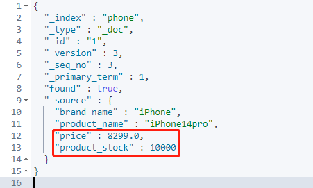

#### 方式二：script脚本（POST）

```shell
#script脚本方式更新文档
#   POST http://ES主机IP:端口号/Index/_update/id
#   {
#     "script" : {
#       "source": 表达式，例如"ctx._source.文档某个Field += params.自定义字段",
#       "lang": "painless",
#       "params" : {
#         "自定义字段" : 4
#       }
#     }  
#   }
#   "lang"表示一种脚本语言
#   在Kibana中“http://ES主机IP:端口号/”是可以省略的
#下面我们将phone.id为1的存量提高5000
POST phone/_update/1
{
  "script": {
    "source": "ctx._source.product_stock += params.myField",
    "lang": "painless",
    "params": {
      "myField" : 5000
    }
  }
}
#   这种更新方式会让版本自增
```

更新反馈结果如下：


查询结果如下：


### 11.5.4.删除文档或者索引

我们依旧删除上面查询到的索引phone；

#### 删文档（DELETE）

```shell
#删除文档
#   DELETE http://ES主机IP:端口号/Index/_doc/id
#   在Kibana中“http://ES主机IP:端口号/”是可以省略的
DELETE phone/_doc/ZRWQfoUBrhfJaqzmloMW
```

删除反馈如下：


删除结果如下：


#### 删索引（DELETE）

```shell
#删除索引
#   DELETE http://ES主机IP:端口号/Index
#   在Kibana中“http://ES主机IP:端口号/”是可以省略的
DELETE phone
#	删除后再查索引就会报错（找不到该索引异常，状态码404）
```

删除反馈如下：


删除结果如下：


### 11.5.5批量操作

#### 批量增删改

```shell
#批量增删改
#   POST /_bulk
#   {增加文档操作 : {"_index" : 索引名,"_id" : 文档id}}
#   {"doc" : {文档内容}}
#   {更新文档操作 : {"_index" : 索引名,"_id" : 文档id}}
#   {"doc" : {文档内容}}
#   {删除文档操作: {"_index" : 索引名,"_id" : 文档id}}
#   ...
#
#   能看出增改都需要指明文档内容，删不需要指明
POST /_bulk
{"create" : {"_index":"website","_id" : "1"}}
{"title"  : "My first blog post"            }
{"index"  : {"_index":"website","_id" : "2"}}
{"title"  : "My seconde blog post"          }
{"update" : {"_index":"website","_id" : "1"}}
{"doc"    : {"title":"My updated blog post"}}
{"delete" : {"_index":"website","_id" : "1"}}
{"create" : {"_index":"website","_id" : "3"}}
{"title"  : "My third blog post"            }
```

批量操作结果如下：

```shell
{
  "took" : 160,
  "errors" : false,
  "items" : [
    {
      "create" : {
        "_index" : "website",
        "_type" : "_doc",
        "_id" : "1",
        "_version" : 1,
        "result" : "created",
        "_shards" : {
          "total" : 2,
          "successful" : 1,
          "failed" : 0
        },
        "_seq_no" : 0,
        "_primary_term" : 1,
        "status" : 201
      }
    },
    {
      "index" : {
        "_index" : "website",
        "_type" : "_doc",
        "_id" : "2",
        "_version" : 1,
        "result" : "created",
        "_shards" : {
          "total" : 2,
          "successful" : 1,
          "failed" : 0
        },
        "_seq_no" : 1,
        "_primary_term" : 1,
        "status" : 201
      }
    },
    {
      "update" : {
        "_index" : "website",
        "_type" : "_doc",
        "_id" : "1",
        "_version" : 2,
        "result" : "updated",
        "_shards" : {
          "total" : 2,
          "successful" : 1,
          "failed" : 0
        },
        "_seq_no" : 2,
        "_primary_term" : 1,
        "status" : 200
      }
    },
    {
      "delete" : {
        "_index" : "website",
        "_type" : "_doc",
        "_id" : "1",
        "_version" : 3,
        "result" : "deleted",
        "_shards" : {
          "total" : 2,
          "successful" : 1,
          "failed" : 0
        },
        "_seq_no" : 3,
        "_primary_term" : 1,
        "status" : 200
      }
    },
    {
      "create" : {
        "_index" : "website",
        "_type" : "_doc",
        "_id" : "3",
        "_version" : 1,
        "result" : "created",
        "_shards" : {
          "total" : 2,
          "successful" : 1,
          "failed" : 0
        },
        "_seq_no" : 4,
        "_primary_term" : 1,
        "status" : 201
      }
    }
  ]
}
```

#### 批量查询

```shell
#批量查询
#   GET /_mget
#   {
#     "docs" :[
#       {
#         "_index" : 索引名,
#         "_id" : 文档id      
#       },
#       {
#         "_index" : 索引名,
#         "_id" : 文档id
#       }
#     ]
#   }
GET /_mget
{
  "docs" : [
    {
      "_index" : "website",
      "_id" : "2"
    },
    {
      "_index" : "website",
      "_id" : "3"
    }
  ]
}
```

批量查询结果如下：

```shell
{
  "docs" : [
    {
      "_index" : "website",
      "_type" : "_doc",
      "_id" : "2",
      "_version" : 1,
      "_seq_no" : 1,
      "_primary_term" : 1,
      "found" : true,
      "_source" : {
        "title" : "My seconde blog post"
      }
    },
    {
      "_index" : "website",
      "_type" : "_doc",
      "_id" : "3",
      "_version" : 1,
      "_seq_no" : 4,
      "_primary_term" : 1,
      "found" : true,
      "_source" : {
        "title" : "My third blog post"
      }
    }
  ]
}
```

## 11.6.分词与查询

### 11.6.1.概述

分词是将文本转换成一系列单词（Term or Token）的过程，也可以叫文本分析，在ES里面称为Analysis；


分词器是ES中专门处理分词的组件，英文为Analyzer，它的组成如下：

- Character Filters：针对原始文本进行处理，比如去除html标签；
- Tokenizer：将原始文本按照一定规则切分为单词；
- Token Filters：针对Tokenizer处理的单词进行再加工，比如转小写、删除或增新等处理；

### 11.6.2.ES内置分词器

**启用分词器的格式：**

```shell
GET _analyze
{
	"analyzer": "分词器名称",
	"text": "被分词内容"
}
```

**下面进行常用的分词器演示：**

- **Standard Analyzer：** 默认分词器，按词切分，小写处理，停用词（无意义的词）会被保留；

  ```shell
  GET _analyze
  {
    "analyzer": "standard",
    "text": "hello java AND Go"
  }
  ```

  分词结果如下：

  ```shell
  {
    "tokens" : [
      {
        "token" : "hello",
        "start_offset" : 0,
        "end_offset" : 5,
        "type" : "<ALPHANUM>",
        "position" : 0
      },
      {
        "token" : "java",
        "start_offset" : 6,
        "end_offset" : 10,
        "type" : "<ALPHANUM>",
        "position" : 1
      },
      {
        "token" : "and",
        "start_offset" : 11,
        "end_offset" : 14,
        "type" : "<ALPHANUM>",
        "position" : 2
      },
      {
        "token" : "go",
        "start_offset" : 15,
        "end_offset" : 17,
        "type" : "<ALPHANUM>",
        "position" : 3
      }
    ]
  }
  ```

- **Simple Analyzer：** 按照非字母切分（非字母会被过滤），小写处理；

  ```shell
  GET _analyze
  {
    "analyzer": "simple",
    "text": "I'm 21 now"
  }
  ```

  分词结果如下：

  ```shell
  {
    "tokens" : [
      {
        "token" : "i",
        "start_offset" : 0,
        "end_offset" : 1,
        "type" : "word",
        "position" : 0
      },
      {
        "token" : "m",
        "start_offset" : 2,
        "end_offset" : 3,
        "type" : "word",
        "position" : 1
      },
      {
        "token" : "now",
        "start_offset" : 7,
        "end_offset" : 10,
        "type" : "word",
        "position" : 2
      }
    ]
  }
  ```

- **Stop Analyzer：** 小写处理，停用词过滤（the，a，is）；

  ```shell
  GET _analyze
  {
    "analyzer": "stop",
    "text": "JAVA is the BEst"
  }
  ```

  分词结果如下：

  ```shell
  {
    "tokens" : [
      {
        "token" : "java",
        "start_offset" : 0,
        "end_offset" : 4,
        "type" : "word",
        "position" : 0
      },
      {
        "token" : "best",
        "start_offset" : 12,
        "end_offset" : 16,
        "type" : "word",
        "position" : 3
      }
    ]
  }
  ```

- **Whitespace Analyzer：** 按照空格切分，不转小写；

  ```shell
  GET _analyze
  {
    "analyzer": "whitespace",
    "text": "1A 2B3 4C56 7D890"
  }
  ```

  分词结果如下：

  ```shell
  {
    "tokens" : [
      {
        "token" : "1A",
        "start_offset" : 0,
        "end_offset" : 2,
        "type" : "word",
        "position" : 0
      },
      {
        "token" : "2B3",
        "start_offset" : 3,
        "end_offset" : 6,
        "type" : "word",
        "position" : 1
      },
      {
        "token" : "4C56",
        "start_offset" : 7,
        "end_offset" : 11,
        "type" : "word",
        "position" : 2
      },
      {
        "token" : "7D890",
        "start_offset" : 12,
        "end_offset" : 17,
        "type" : "word",
        "position" : 3
      }
    ]
  }
  ```

- **Keyword Analyzer：** 不分词，直接将输入当做输出；

  ```shell
  GET _analyze
  {
    "analyzer": "keyword",
    "text": "This is My Word"
  }
  ```

  分词结果如下：

  ```shell
  {
    "tokens" : [
      {
        "token" : "This is My Word",
        "start_offset" : 0,
        "end_offset" : 15,
        "type" : "word",
        "position" : 0
      }
    ]
  }
  ```

- **Pattern Analyzer：** 正则表达式，默认 \W+，；

- **Language：** 提供了 30 多种常见语言的分词器，自带分词器中没有中文；

- **Customer Analyzer：** 自定义分词器；

### 11.6.3.ES Search查询

**数据准备：**

```shell
POST /_bulk
{"create": {"_index": "books","_id": "100"}}
{"title": "Java编程思想(第4版)","comment": "就这个快递，我就想给满星，京东快递就是不一样，我在村里，直接给我送到村里，别的还得去，镇里去拿，书我还没看，包装的很好，非常适合提升技术"}
{"create": {"_index": "books","_id": "101"}}
{"title": "python网络爬虫权威指南 第2版(图灵出品)","comment": "非常棒的一本书，很适合初学者!"}
{"create": {"_index": "books","_id": "102"}}
{"title": "effective java", "comment": "书不错，是正版，对技术提升很有帮助，需要耐心的把这本书给读透"}
```

#### 方式一：uri查询（GET）

```shell
#uri常见参数：
#   q:即query，查询的内容，ES会将内容进行分词，然后再用分词结果去查询
#   df:即需要查询的Field
#   from:从第from个查询结果开始响应，索引从0开始
#   size:响应size个查询结果，常与from搭配使用，可以分页查询，相当于MySQL当中的Limit
GET books/_search?q=java编程思想&df=title&from=0&size=3
```

查询结果如下：

```shell
{
  "took" : 1,
  "timed_out" : false,
  "_shards" : {
    "total" : 1,
    "successful" : 1,
    "skipped" : 0,
    "failed" : 0
  },
  "hits" : {
    "total" : {
      "value" : 2,
      "relation" : "eq"
    },
    "max_score" : 4.536063,
    "hits" : [
      {
        "_index" : "books",
        "_type" : "_doc",
        "_id" : "100",
        "_score" : 4.536063,
        "_source" : {
          "title" : "Java编程思想(第4版)",
          "comment" : "就这个快递，我就想给满星，京东快递就是不一样，我在村里，直接给我送到村里，别的还得去，镇里去拿，书我还没看，包装的很好，非常适合提升技术"
        }
      },
      {
        "_index" : "books",
        "_type" : "_doc",
        "_id" : "102",
        "_score" : 0.68582165,
        "_source" : {
          "title" : "effective java",
          "comment" : "书不错，是正版，对技术提升很有帮助，需要耐心的把这本书给读透"
        }
      }
    ]
  }
}
```

#### 方式二：JSON查询（POST）

**term查询：**

```shell
#term查询：按照指定内容查询，不会对查询内容进行分词
#POST Index名/_search
#{
#  "query": {
#    "term": {
#      "Field名": "查询内容"
#    }
#  }
#}
POST books/_search
{
  "query": {
    "term": {
      "title": "java"
    }
  }
}
#但是下面这个示例可能会出乎意外，按理说在数据库中应该有一条"Java编程思想(第4版)"，这个应该可以命中，但是实际结果确实没有查询到任何数据，这是因为查询内容并不会进行分词，但是查询的对象内部已经做了标准分词，即[java,编,程,思,想,第,4,版]，此时"编程"就没能有命中对象，如果我们查询内容换做"编"，就能够查询到数据；
POST books/_search
{
  "query": {
    "term": {
      "title": "编程"
    }
  }
}
```

第一次查询结果如下：

```shell
{
  "took" : 0,
  "timed_out" : false,
  "_shards" : {
    "total" : 1,
    "successful" : 1,
    "skipped" : 0,
    "failed" : 0
  },
  "hits" : {
    "total" : {
      "value" : 2,
      "relation" : "eq"
    },
    "max_score" : 0.68582165,
    "hits" : [
      {
        "_index" : "books",
        "_type" : "_doc",
        "_id" : "102",
        "_score" : 0.68582165,
        "_source" : {
          "title" : "effective java",
          "comment" : "书不错，是正版，对技术提升很有帮助，需要耐心的把这本书给读透"
        }
      },
      {
        "_index" : "books",
        "_type" : "_doc",
        "_id" : "100",
        "_score" : 0.4852745,
        "_source" : {
          "title" : "Java编程思想(第4版)",
          "comment" : "就这个快递，我就想给满星，京东快递就是不一样，我在村里，直接给我送到村里，别的还得去，镇里去拿，书我还没看，包装的很好，非常适合提升技术"
        }
      }
    ]
  }
}
```

第二次查询结果如下：

```shell
{
  "took" : 0,
  "timed_out" : false,
  "_shards" : {
    "total" : 1,
    "successful" : 1,
    "skipped" : 0,
    "failed" : 0
  },
  "hits" : {
    "total" : {
      "value" : 0,
      "relation" : "eq"
    },
    "max_score" : null,
    "hits" : [ ]
  }
}
```

**query_string查询：**

```shell
#query_string查询：首先对查询内容进行分词，然后按照分词结果进行查询
#POST Index名/_search
#{
#  "query": {
#     "query_string": {
#       "default_field": "Field名",
#     #下面这个query还能够加以条件，例如OR（大写）或者AND（大写）
#      "query": "查询内容"
#     }
#  }
#}
POST books/_search
{
  "query": {
    "query_string": {
      "default_field": "title",
      "query": "Java编程"
    }
  }
}
#按照原理，下面的查询内容被分词也能够查到内容
POST books/_search
{
  "query": {
    "query_string": {
      "default_field": "title",
      "query": "程程 AND java" 
    }
  }
}
```

第一次查询结果如下：

```shell
{
  "took" : 0,
  "timed_out" : false,
  "_shards" : {
    "total" : 1,
    "successful" : 1,
    "skipped" : 0,
    "failed" : 0
  },
  "hits" : {
    "total" : {
      "value" : 2,
      "relation" : "eq"
    },
    "max_score" : 2.510669,
    "hits" : [
      {
        "_index" : "books",
        "_type" : "_doc",
        "_id" : "100",
        "_score" : 2.510669,
        "_source" : {
          "title" : "Java编程思想(第4版)",
          "comment" : "就这个快递，我就想给满星，京东快递就是不一样，我在村里，直接给我送到村里，别的还得去，镇里去拿，书我还没看，包装的很好，非常适合提升技术"
        }
      },
      {
        "_index" : "books",
        "_type" : "_doc",
        "_id" : "102",
        "_score" : 0.68582165,
        "_source" : {
          "title" : "effective java",
          "comment" : "书不错，是正版，对技术提升很有帮助，需要耐心的把这本书给读透"
        }
      }
    ]
  }
}
```

第二次查询结果如下：

```shell
{
  "took" : 1,
  "timed_out" : false,
  "_shards" : {
    "total" : 1,
    "successful" : 1,
    "skipped" : 0,
    "failed" : 0
  },
  "hits" : {
    "total" : {
      "value" : 1,
      "relation" : "eq"
    },
    "max_score" : 2.510669,
    "hits" : [
      {
        "_index" : "books",
        "_type" : "_doc",
        "_id" : "100",
        "_score" : 2.510669,
        "_source" : {
          "title" : "Java编程思想(第4版)",
          "comment" : "就这个快递，我就想给满星，京东快递就是不一样，我在村里，直接给我送到村里，别的还得去，镇里去拿，书我还没看，包装的很好，非常适合提升技术"
        }
      }
    ]
  }
}
```

### 11.6.4.IK中文分词器

#### 下载和安装

由于ES自带的分词器不能很好的支持中文的分词，所以我们考虑集成一款强大的中文分词器**IK分词器**来优化我们中文的查询，而且可以自定义词典；

| IK version | ES version       |
| ---------- | ---------------- |
| master     | 7.x -> master    |
| 6.x        | 6.x              |
| 5.x        | 5.x              |
| 1.10.6     | 2.4.6            |
| 1.9.5      | 2.3.5            |
| 1.8.1      | 2.2.1            |
| 1.7.0      | 2.1.1            |
| 1.5.0      | 2.0.0            |
| 1.2.6      | 1.0.0            |
| 1.2.5      | 0.90.x           |
| 1.1.3      | 0.20.x           |
| 1.0.0      | 0.16.2 -> 0.19.0 |

进入ES插件目录，下载并解压安装包：

```shell
#进入ES插件目录
cd /opt/elasticsearch-7.9.3/plugins/

#下载安装包
wget https://github.com/medcl/elasticsearch-analysis-ik/releases/download/v7.9.3/elasticsearch-analysis-ik-7.9.3.zip

#解压安装包
unzip elasticsearch-analysis-ik-7.9.3.zip -d IK-7.9.0

#删除安装包
rm -rf elasticsearch-analysis-ik-7.9.3.zip
```

操作完成后目录如下：


我们主要操作config配置目录：


如果想让这个插件启动，那么就需要停用ES，重新启动ES；

```shell
#查找进程
ps -ef | grep elastic

#杀死kibana和ES的进程
kill -9 3646 4111

#切换用户
su elasticsearch
#再次启动ES和Kibana
/opt/elasticsearch-7.9.3/bin/elasticsearch -d
nohup /opt/kibana-7.9.3/bin/kibana > /opt/kibana-7.9.3/kibana.log 2>&1 &
```

重启完毕后，插件就安装成功并且跟着启动了；

#### 测试IK分词器分词

IK分词器提供两种分词方法：一种是ik_smart，还有一种时ik_max_word；

- ik_max_word 会将文本做最细粒度的拆分；

  ```shell
  GET _analyze
  {
    "analyzer": "ik_max_word",
    "text": "Java是世界上最好的语言！"
  }
  ```

  分词结果如下：

  ```shell
  {
    "tokens" : [
      {
        "token" : "java",
        "start_offset" : 0,
        "end_offset" : 4,
        "type" : "ENGLISH",
        "position" : 0
      },
      {
        "token" : "是",
        "start_offset" : 4,
        "end_offset" : 5,
        "type" : "CN_CHAR",
        "position" : 1
      },
      {
        "token" : "世界上",
        "start_offset" : 5,
        "end_offset" : 8,
        "type" : "CN_WORD",
        "position" : 2
      },
      {
        "token" : "世界",
        "start_offset" : 5,
        "end_offset" : 7,
        "type" : "CN_WORD",
        "position" : 3
      },
      {
        "token" : "上",
        "start_offset" : 7,
        "end_offset" : 8,
        "type" : "CN_CHAR",
        "position" : 4
      },
      {
        "token" : "最好",
        "start_offset" : 8,
        "end_offset" : 10,
        "type" : "CN_WORD",
        "position" : 5
      },
      {
        "token" : "的",
        "start_offset" : 10,
        "end_offset" : 11,
        "type" : "CN_CHAR",
        "position" : 6
      },
      {
        "token" : "语言",
        "start_offset" : 11,
        "end_offset" : 13,
        "type" : "CN_WORD",
        "position" : 7
      }
    ]
  }
  ```

- ik_smart 最粗粒度的拆分；

  ```shell
  GET _analyze
  {
    "analyzer": "ik_smart",
    "text": "Java是世界上最好的语言！"
  }
  ```

  分词结果如下：

  ```shell
  {
    "tokens" : [
      {
        "token" : "java",
        "start_offset" : 0,
        "end_offset" : 4,
        "type" : "ENGLISH",
        "position" : 0
      },
      {
        "token" : "是",
        "start_offset" : 4,
        "end_offset" : 5,
        "type" : "CN_CHAR",
        "position" : 1
      },
      {
        "token" : "世界上",
        "start_offset" : 5,
        "end_offset" : 8,
        "type" : "CN_WORD",
        "position" : 2
      },
      {
        "token" : "最好",
        "start_offset" : 8,
        "end_offset" : 10,
        "type" : "CN_WORD",
        "position" : 3
      },
      {
        "token" : "的",
        "start_offset" : 10,
        "end_offset" : 11,
        "type" : "CN_CHAR",
        "position" : 4
      },
      {
        "token" : "语言",
        "start_offset" : 11,
        "end_offset" : 13,
        "type" : "CN_WORD",
        "position" : 5
      }
    ]
  }
  ```

#### 搭配IK分词器搜索

```shell
#因为我们创建books的时候没有指定分词器，所以我们先删除这个索引
DELETE books

#创建books索引，指定使用的分词器
PUT books
{
  "mappings": {
    "properties": {
      "title":{
        "type":"text",
        "analyzer": "ik_smart"
      },
      "comment":{
        "type": "text",
        "analyzer": "ik_smart"
      }
    }
  }
}

#依旧使用批量操作添加文档
POST /_bulk
{"create": {"_index": "books","_id": "100"}}
{"title": "Java编程思想(第4版)","comment": "就这个快递，我就想给满星，京东快递就是不一样，我在村里，直接给我送到村里，别的还得去，镇里去拿，书我还没看，包装的很好，非常适合提升技术"}
{"create": {"_index": "books","_id": "101"}}
{"title": "python网络爬虫权威指南 第2版(图灵出品)","comment": "非常棒的一本书，很适合初学者!"}
{"create": {"_index": "books","_id": "102"}}
{"title": "effective java", "comment": "书不错，是正版，对技术提升很有帮助，需要耐心的把这本书给读透"}
```

创建好Index反馈如下：

```shell
{
  "took" : 9,
  "errors" : false,
  "items" : [
    {
      "create" : {
        "_index" : "books",
        "_type" : "_doc",
        "_id" : "100",
        "_version" : 1,
        "result" : "created",
        "_shards" : {
          "total" : 2,
          "successful" : 1,
          "failed" : 0
        },
        "_seq_no" : 0,
        "_primary_term" : 1,
        "status" : 201
      }
    },
    {
      "create" : {
        "_index" : "books",
        "_type" : "_doc",
        "_id" : "101",
        "_version" : 1,
        "result" : "created",
        "_shards" : {
          "total" : 2,
          "successful" : 1,
          "failed" : 0
        },
        "_seq_no" : 1,
        "_primary_term" : 1,
        "status" : 201
      }
    },
    {
      "create" : {
        "_index" : "books",
        "_type" : "_doc",
        "_id" : "102",
        "_version" : 1,
        "result" : "created",
        "_shards" : {
          "total" : 2,
          "successful" : 1,
          "failed" : 0
        },
        "_seq_no" : 2,
        "_primary_term" : 1,
        "status" : 201
      }
    }
  ]
}
```

再查询一下数据确保我们添加数据成功：

```shell
#再查询一下数据确保我们添加数据成功
GET books/_search
```

查询内容如下：

```shell
{
  "took" : 216,
  "timed_out" : false,
  "_shards" : {
    "total" : 1,
    "successful" : 1,
    "skipped" : 0,
    "failed" : 0
  },
  "hits" : {
    "total" : {
      "value" : 3,
      "relation" : "eq"
    },
    "max_score" : 1.0,
    "hits" : [
      {
        "_index" : "books",
        "_type" : "_doc",
        "_id" : "100",
        "_score" : 1.0,
        "_source" : {
          "title" : "Java编程思想(第4版)",
          "comment" : "就这个快递，我就想给满星，京东快递就是不一样，我在村里，直接给我送到村里，别的还得去，镇里去拿，书我还没看，包装的很好，非常适合提升技术"
        }
      },
      {
        "_index" : "books",
        "_type" : "_doc",
        "_id" : "101",
        "_score" : 1.0,
        "_source" : {
          "title" : "python网络爬虫权威指南 第2版(图灵出品)",
          "comment" : "非常棒的一本书，很适合初学者!"
        }
      },
      {
        "_index" : "books",
        "_type" : "_doc",
        "_id" : "102",
        "_score" : 1.0,
        "_source" : {
          "title" : "effective java",
          "comment" : "书不错，是正版，对技术提升很有帮助，需要耐心的把这本书给读透"
        }
      }
    ]
  }
}
```

我们查询一下“编程”：

```shell
#查询一下“编程”
POST books/_search
{
  "query": {
    "term": {
      "title": "编程"
    }
  }
}
```

查询结果如下：

```shell
{
  "took" : 1,
  "timed_out" : false,
  "_shards" : {
    "total" : 1,
    "successful" : 1,
    "skipped" : 0,
    "failed" : 0
  },
  "hits" : {
    "total" : {
      "value" : 1,
      "relation" : "eq"
    },
    "max_score" : 1.0065652,
    "hits" : [
      {
        "_index" : "books",
        "_type" : "_doc",
        "_id" : "100",
        "_score" : 1.0065652,
        "_source" : {
          "title" : "Java编程思想(第4版)",
          "comment" : "就这个快递，我就想给满星，京东快递就是不一样，我在村里，直接给我送到村里，别的还得去，镇里去拿，书我还没看，包装的很好，非常适合提升技术"
        }
      }
    ]
  }
}
```

#### 自定义词典和停用词

##### 流程

我们需要找到IK分词器的配置文件目录：


首先创建一个自定义字典的目录，目录的内容仿造原有的config目录新建main.dic和stopword.dic即可，其他的按需配置：

```shell
mkdir myconfig

cd myconfig

touch main.dic

touch stopword.dic
```

操作完成后得到如下目录：


接下来编辑两个dic文件，main.dic中存放我们会遇到的词组，stopword.dic中存放停用词：

```shell
vim main.dic
#示例内容如下：
java编程
python网络爬虫

vim stopword.dic
#示例内容如下：
了
的
哈
嘻
嘿
```

自定义配置修改后在config/IKAnalyzer.cfg.xml里面进行操作：

```shell
#vim进入编辑该文件
vim /opt/elasticsearch-7.9.3/plugins/IK-7.9.3/config/IKAnalyzer.cfg.xml
```

打开后源文件如下：

```xml
<?xml version="1.0" encoding="UTF-8"?>
<!DOCTYPE properties SYSTEM "http://java.sun.com/dtd/properties.dtd">
<properties>
        <comment>IK Analyzer 扩展配置</comment>
        <!--用户可以在这里配置自己的扩展字典 -->
        <entry key="ext_dict"></entry>
         <!--用户可以在这里配置自己的扩展停止词字典-->
        <entry key="ext_stopwords"></entry>
        <!--用户可以在这里配置远程扩展字典 -->
        <!-- <entry key="remote_ext_dict">words_location</entry> -->
        <!--用户可以在这里配置远程扩展停止词字典-->
        <!-- <entry key="remote_ext_stopwords">words_location</entry> -->
</properties>
```

使用相对路径修改为如下内容：

```xml
<?xml version="1.0" encoding="UTF-8"?>
<!DOCTYPE properties SYSTEM "http://java.sun.com/dtd/properties.dtd">
<properties>
        <comment>IK Analyzer 扩展配置</comment>
        <!--用户可以在这里配置自己的扩展字典 -->
        <entry key="ext_dict">myconfig/main.dic</entry>
         <!--用户可以在这里配置自己的扩展停止词字典-->
        <entry key="ext_stopwords">myconfig/stopword.dic</entry>
        <!--用户可以在这里配置远程扩展字典 -->
        <!-- <entry key="remote_ext_dict">words_location</entry> -->
        <!--用户可以在这里配置远程扩展停止词字典-->
        <!-- <entry key="remote_ext_stopwords">words_location</entry> -->
</properties>
```

然后重启ES以及Kibana即可生效；

##### 测试

```shell
#因为我们创建books的时候指定分词器以及失效，所以我们先删除这个索引
DELETE books

#创建books索引，指定使用的分词器
PUT books
{
  "mappings": {
    "properties": {
      "title":{
        "type":"text",
        "analyzer": "ik_smart"
      },
      "comment":{
        "type": "text",
        "analyzer": "ik_smart"
      }
    }
  }
}

#依旧使用批量操作添加文档
POST /_bulk
{"create": {"_index": "books","_id": "100"}}
{"title": "Java编程思想(第4版)","comment": "就这个快递，我就想给满星，京东快递就是不一样，我在村里，直接给我送到村里，别的还得去，镇里去拿，书我还没看，包装的很好，非常适合提升技术"}
{"create": {"_index": "books","_id": "101"}}
{"title": "python网络爬虫权威指南 第2版(图灵出品)","comment": "非常棒的一本书，很适合初学者!"}
{"create": {"_index": "books","_id": "102"}}
{"title": "effective java", "comment": "书不错，是正版，对技术提升很有帮助，需要耐心的把这本书给读透"}

#再查询一下数据确保我们添加数据成功
GET books/_search

#查询一下“java编程”
POST books/_search
{
  "query": {
    "term": {
      "title": "java编程"
    }
  }
}
```

最终的查询结果为：

```shell
{
  "took" : 1,
  "timed_out" : false,
  "_shards" : {
    "total" : 1,
    "successful" : 1,
    "skipped" : 0,
    "failed" : 0
  },
  "hits" : {
    "total" : {
      "value" : 1,
      "relation" : "eq"
    },
    "max_score" : 1.0126972,
    "hits" : [
      {
        "_index" : "books",
        "_type" : "_doc",
        "_id" : "100",
        "_score" : 1.0126972,
        "_source" : {
          "title" : "Java编程思想(第4版)",
          "comment" : "就这个快递，我就想给满星，京东快递就是不一样，我在村里，直接给我送到村里，别的还得去，镇里去拿，书我还没看，包装的很好，非常适合提升技术"
        }
      }
    ]
  }
}
```

## 11.7.ES集群搭建

### 11.7.1.分片(shards)与副本(replicas)

索引可以存储大量的数据，这些数据可能超过单个节点的硬件限制。例如，十亿个文件占用磁盘空间1TB的单指标可能不适合对单个节点的磁盘或可能太慢服务仅从单个节点的搜索请求。为了解决这一问题，Elasticsearch提供细分你的指标分成多个块称为分片的能力。当你创建一个索引，你可以简单地定义你想要的分片数量。每个分片本身是一个全功能的、独立的"指数”，可以托管在集群中的任何节点。

在同一个集群网络或云环境上，故是任何时候都会出现的，拥有一个故转移机制以防分片和结点因为某些原因离线或消失是非常有用的，并且被强烈推荐。为此，Elastisearch允许你创建一个或多个堵贝，你的索引分片进入所置的副本或称作复制品的分片，简称Replicas。

==即一个索引可以被分为多个分片，分布式搭建在多个主机上，一个主机上可以不止搭建一个分片，一个分片可以有多个副本；==


### 11.7.2.配置并启动三台ES节点

准备三台虚拟主机（这是根据以往演示主机的拷贝主机），ip地址如下图所示：


确保每台主机的elasticsearch文件夹中的data目录不存在，即每台主机都先删除这个目录：

```shell
#进入ES目录
cd /opt/elasticsearch-7.9.3/

#删除data目录
rm -rf data/
```

每个elasticsearch的相关操作：

- 192.168.112.101主机：

  ```shell
  vim /opt/elasticsearch-7.9.3/config/elasticsearch.yml
  
  #注释掉原内容之后，修改成如下内容：
  #集群名字：
  cluster.name: es
  #节点名字：
  node.name: es-01
  #数据存放路径：
  path.data: /opt/elasticsearch/data
  #日志存放路径：
  path.logs: /opt/elasticsearch/logs
  #主机ip地址：
  network.host: 192.168.112.101
  #集群中所有节点的seed_hosts：
  discovery.seed_hosts: ["192.168.112.101:9300","192.168.112.102:9300","192.168.112.103:9300"]
  #集群中所有节点的名称：
  cluster.initial_master_nodes: ["es-01","es-02","es-03"]
  #允许控制台连接：
  xpack.monitoring.collection.enabled: true
  
  #由于上面的配置中涉及到两个路径，我们需要手动将它们创建出来
  mkdir elasticsearch/
  cd elasticsearch/
  mkdir data
  mkdir logs
  su elasticsearch
  sudo chown -R elasticsearch:elasticsearch data/
  sudo chown -R elasticsearch:elasticsearch logs/
  
  #最后我们启动ES
  /opt/elasticsearch-7.9.3/bin/elasticsearch -d
  ```

- 192.168.112.102主机：

  ```shell
  vim /opt/elasticsearch-7.9.3/config/elasticsearch.yml
  
  #注释掉原内容之后，修改成如下内容：
  #集群名字：
  cluster.name: es
  #节点名字：
  node.name: es-02
  #数据存放路径：
  path.data: /opt/elasticsearch/data
  #日志存放路径：
  path.logs: /opt/elasticsearch/logs
  #主机ip地址：
  network.host: 192.168.112.102
  #集群中所有节点的seed_hosts：
  discovery.seed_hosts: ["192.168.112.101:9300","192.168.112.102:9300","192.168.112.103:9300"]
  #集群中所有节点的名称：
  cluster.initial_master_nodes: ["es-01","es-02","es-03"]
  #允许控制台连接：
  xpack.monitoring.collection.enabled: true
  
  #由于上面的配置中涉及到两个路径，我们需要手动将它们创建出来
  mkdir elasticsearch/
  cd elasticsearch/
  mkdir data
  mkdir logs
  su elasticsearch
  sudo chown -R elasticsearch:elasticsearch data/
  sudo chown -R elasticsearch:elasticsearch logs/
  
  #最后我们启动ES
  /opt/elasticsearch-7.9.3/bin/elasticsearch -d
  ```

- 192.168.112.103主机：

  ```shell
  vim /opt/elasticsearch-7.9.3/config/elasticsearch.yml
  
  #注释掉原内容之后，修改成如下内容：
  #集群名字：
  cluster.name: es
  #节点名字：
  node.name: es-03
  #数据存放路径：
  path.data: /opt/elasticsearch/data
  #日志存放路径：
  path.logs: /opt/elasticsearch/logs
  #主机ip地址：
  network.host: 192.168.112.103
  #集群中所有节点的seed_hosts：
  discovery.seed_hosts: ["192.168.112.101:9300","192.168.112.102:9300","192.168.112.103:9300"]
  #集群中所有节点的名称：
  cluster.initial_master_nodes: ["es-01","es-02","es-03"]
  #允许控制台连接：
  xpack.monitoring.collection.enabled: true
  
  #由于上面的配置中涉及到两个路径，我们需要手动将它们创建出来
  mkdir elasticsearch/
  cd elasticsearch/
  mkdir data
  mkdir logs
  su elasticsearch
  sudo chown -R elasticsearch:elasticsearch data/
  sudo chown -R elasticsearch:elasticsearch logs/
  
  #最后我们启动ES
  /opt/elasticsearch-7.9.3/bin/elasticsearch -d
  ```

### 11.7.3.集群整合cerebro

cerebro是一个开源（MIT许可）elasticsearch web管理工具，使用Scala、 Play Framework、AngularJS和Bootstrap构建，cerebro的运行需要Java8-Java11。

在192.168.112.101主机上进行如下操作：

```shell
#为了方便，先给/opt文件进行授权
sudo chmod 777 /opt

#再进入/opt下载cerebro安装包并解压
cd /opt
wget https://github.com/lmenezes/cerebro/releases/download/v0.9.2/cerebro-0.9.2.tgz
tar -zxvf cerebro-0.9.2.tgz

#以后台方式启动
nohup /opt/cerebro-0.9.2/bin/cerebro > /opt/cerebro-0.9.2/cerebro.log 2>&1 &

#开放9000端口（如果防火墙关闭，那么就跳过）
firewall-cmd --zone=public --add-port=9000/tcp --permanent
systemctl restart firewalld.service
firewall-cmd -reload
```

启动之后去访问，界面如下：


这里是在192.168.112.101上部署的，这个节点地址不能是192.168.112.101，如果是在单独的一台主机或者另外俩台节点主机上部署，就能够访问192.168.112.101，其他两台节点主机同理，访问节点后的界面如下：


我们将.special勾选上，就能看到如下内容：


绿色实线框代表Index的分片，绿色虚线框代表Index的副本，节点前的★代表当前节点，☆代表从节点，如果想查看每台机器的详情，就需要点击菜单栏上的nodes：


如果想在cerebro中进行查询，就需要点击菜单栏上的rest：


### 11.7.4.集群整合Kibana

#### 集群搭建

Kibana监控集群也需要有一个主机进行部署，这里也不开另外的主机，直接部署到192.168.112.101上，此时需要修改192.168.112.101主机上的kibana配置文件，即kibana-7.9.3/config/kibana.yml：

```shell
#先确认部署主机的kibana没有启动，如果启动，那就kill kibana进程
ps -ef | grep kibana

#用vim打开该文件进行修改
vim /opt/kibana-7.9.3/config/kibana.yml

#打开之后，需要保证文件中非注释内容如下：
...
# server.host: "localhost" 这里填写kibana主机IP地址
server.host: "192.168.112.101"
...
# The URLs of the Elasticsearch instances to use for all your queries. 这里填写ES集群中所有实例的ES访问地址
elasticsearch.hosts: ["http://192.168.112.101:9200","http://192.168.112.102:9200","http://192.168.112.103:9200"]
...

#修改完后，以后台方式启动kibana
nohup /opt/kibana-7.9.3/bin/kibana > /opt/kibana-7.9.3/kibana.log 2>&1 &
```

启动完之后我们可以访问kibana的地址，启动控制台输入以下内容进行集群状态的查看：

```shell
#查看集群的健康状态
GET _cluster/health

#查看集群的分片状态
GET _cat/shards
```

健康状态如下：

```shell
{
  "cluster_name" : "es",
  "status" : "green",
  "timed_out" : false,
  "number_of_nodes" : 3,
  "number_of_data_nodes" : 3,
  "active_primary_shards" : 9,
  "active_shards" : 18,
  "relocating_shards" : 2,
  "initializing_shards" : 0,
  "unassigned_shards" : 0,
  "delayed_unassigned_shards" : 0,
  "number_of_pending_tasks" : 4,
  "number_of_in_flight_fetch" : 0,
  "task_max_waiting_in_queue_millis" : 35,
  "active_shards_percent_as_number" : 100.0
}
```

分片状态如下：

```shell
#          分片名字    r/p代表副本/主本  状态             所占大小   所在IP地址和节点名字
.monitoring-es-7-2023.01.06     0 r STARTED                  192.168.112.102 es-02
.monitoring-es-7-2023.01.06     0 p STARTED    17264     7mb 192.168.112.103 es-03
.monitoring-kibana-7-2023.01.06 0 p STARTED       66  62.8kb 192.168.112.102 es-02
.monitoring-kibana-7-2023.01.06 0 r STARTED                  192.168.112.103 es-03
.apm-custom-link                0 p STARTED        0    208b 192.168.112.102 es-02
.apm-custom-link                0 r STARTED        0    208b 192.168.112.103 es-03
.kibana_task_manager_1          0 p STARTED        6  73.6kb 192.168.112.102 es-02
.kibana_task_manager_1          0 r STARTED        6  41.1kb 192.168.112.103 es-03
.kibana_1                       0 r STARTED       16  10.4mb 192.168.112.102 es-02
.kibana_1                       0 p STARTED       16  10.4mb 192.168.112.103 es-03
.kibana-event-log-7.9.3-000001  0 p STARTED        1   5.5kb 192.168.112.102 es-02
.kibana-event-log-7.9.3-000001  0 r RELOCATING               192.168.112.103 es-03 -> 192.168.112.101 PokPSAsgSOO0-2aM5y6xaA es-01
ilm-history-2-000001            0 p STARTED                  192.168.112.102 es-02
ilm-history-2-000001            0 r STARTED                  192.168.112.103 es-03
.apm-agent-configuration        0 p RELOCATING               192.168.112.102 es-02 -> 192.168.112.101 PokPSAsgSOO0-2aM5y6xaA es-01
.apm-agent-configuration        0 r STARTED        0    208b 192.168.112.103 es-03
.monitoring-es-7-2023.01.05     0 p STARTED       31 386.9kb 192.168.112.102 es-02
.monitoring-es-7-2023.01.05     0 r STARTED       31 386.9kb 192.168.112.103 es-03
```

#### 创建分片&副本

创建分片和副本的前提是需要有索引，那么我们在创建索引的时候就把分片和副本的相关参数设置进去：

```shell
#自定义索引指定分片数和副本数
#下面的设置，就是创建三个分片，每一个分片两个副本，直观点来说就是3分片+2副本+2副本+2副本
PUT /books
{
  "settings": {
    "number_of_shards": 3,
    "number_of_replicas": 2
  }
}

#我们通过指令去查看分片状况
GET _cat/shards
```

分片状况如下：

```shell
.kibana_1                       0 r STARTED       23  10.4mb 192.168.112.102 es-02
.kibana_1                       0 p STARTED       23  10.4mb 192.168.112.103 es-03
ilm-history-2-000001            0 p STARTED                  192.168.112.102 es-02
ilm-history-2-000001            0 r STARTED                  192.168.112.103 es-03
.monitoring-es-7-2023.01.06     0 r STARTED    33899    13mb 192.168.112.102 es-02
.monitoring-es-7-2023.01.06     0 p STARTED    17264  10.1mb 192.168.112.103 es-03
.monitoring-es-7-2023.01.05     0 p STARTED       31 386.9kb 192.168.112.102 es-02
.monitoring-es-7-2023.01.05     0 r STARTED       31 386.9kb 192.168.112.103 es-03
books                           1 r STARTED        0    208b 192.168.112.102 es-02
books                           1 p STARTED        0    208b 192.168.112.103 es-03
books                           1 r UNASSIGNED                               
books                           2 p STARTED        0    208b 192.168.112.102 es-02
books                           2 r STARTED        0    208b 192.168.112.103 es-03
books                           2 r UNASSIGNED                               
books                           0 p STARTED        0    208b 192.168.112.102 es-02
books                           0 r STARTED        0    208b 192.168.112.103 es-03
books                           0 r UNASSIGNED                               
.monitoring-kibana-7-2023.01.06 0 p STARTED       66 111.1kb 192.168.112.102 es-02
.monitoring-kibana-7-2023.01.06 0 r STARTED        8 118.2kb 192.168.112.103 es-03
.apm-agent-configuration        0 p STARTED        0    208b 192.168.112.102 es-02
.apm-agent-configuration        0 r STARTED        0    208b 192.168.112.103 es-03
.kibana_task_manager_1          0 p STARTED        6 133.8kb 192.168.112.102 es-02
.kibana_task_manager_1          0 r STARTED        6 146.5kb 192.168.112.103 es-03
.apm-custom-link                0 p STARTED        0    208b 192.168.112.102 es-02
.apm-custom-link                0 r STARTED        0    208b 192.168.112.103 es-03
.kibana-event-log-7.9.3-000001  0 p STARTED        1   5.5kb 192.168.112.102 es-02
.kibana-event-log-7.9.3-000001  0 r STARTED        1   5.5kb 192.168.112.103 es-03
```

至此ES集群搭建工作就初具成型；

## 11.8.ES复杂查询

### 11.8.1.多字段查询

**数据准备**

```shell
PUT books
{
  "mappings": {
    "properties": {
      "title":{
        "type": "text",
        "analyzer": "ik_smart"
      },
      "comment":{
        "type": "text",
        "analyzer": "ik_smart"
      }
    }
  }
}
POST /_bulk
{"create": {"_index": "books","_id": "100"}}
{"title": "Java编程思想(第4版)","comment": "就这个快递，我就想给满星，京东快递就是不一样，我在村里，直接给我送到村里，别的还得去，镇里去拿，书我还没看，包装的很好，非常适合提升技术"}
{"create": {"_index": "books","_id": "101"}}
{"title": "python网络爬虫权威指南 第2版(图灵出品)","comment": "非常棒的一本书，很适合初学者!"}
{"create": {"_index": "books","_id": "102"}}
{"title": "effective java", "comment": "书不错，是正版，对技术提升很有帮助，需要耐心的把这本书给读透"}
```

**多字段查询示例：**

可以看作将一个文档中的这些字段的内容看成一个整体进行查询，==多字段查询使用的查询方式是**POST查询方式**；==

```shell
#多字段查询
#下例相当于在（title和comment）下去找Java编程
POST /books/_search
{
  "query": {
    "query_string": {
      "fields": ["title","comment"],
      "query": "Java编程"
    }
  }
}
#那如果查询内容也有逻辑限制就会出现如下含义：
#相当于在（title和comment）下去找Java编程和技术
POST /books/_search
{
  "query": {
    "query_string": {
      "fields": ["title","comment"],
      "query": "Java编程 AND 技术"
    }
  }
}
#同理可以实现如下含义：
#相当于在（title和comment）下去找Java编程或魑魅魍魉
POST /books/_search
{
  "query": {
    "query_string": {
      "fields": ["title","comment"],
      "query": "Java编程 OR 魑魅魍魉"
    }
  }
}
```

查询结果都如下：

```shell
{
  "took" : 1,
  "timed_out" : false,
  "_shards" : {
    "total" : 1,
    "successful" : 1,
    "skipped" : 0,
    "failed" : 0
  },
  "hits" : {
    "total" : {
      "value" : 1,
      "relation" : "eq"
    },
    "max_score" : 1.0126972,
    "hits" : [
      {
        "_index" : "books",
        "_type" : "_doc",
        "_id" : "100",
        "_score" : 1.0126972,
        "_source" : {
          "title" : "Java编程思想(第4版)",
          "comment" : "就这个快递，我就想给满星，京东快递就是不一样，我在村里，直接给我送到村里，别的还得去，镇里去拿，书我还没看，包装的很好，非常适合提升技术"
        }
      }
    ]
  }
}
```

### 11.8.2.多条件组合查询

多条件组合查询被官方描述为Boolean Query（布尔查询）；

布尔查询是最常用的组合查询，不仅将多个查询条件组合在一起，并且将查询的结果和结果的评分（score）组合在一起。当查询条件是多个表达式的组合时，布尔查询非常有用，实际上，布尔查询把多个子查询组合（combine）成一个布尔表达式，所有子查询之间的逻辑关系是与（and）；**只有当一个文档满足布尔查询中的所有子查询条件时，Elasticsearch引擎才认为该文档满足查询条件。**布尔查询支持的子查询类型共有四种，分别是：must，should，must_not 和 filter；

- **must**子句：文档必须匹配must查询条件，会影响score；
- **should**子句：文档应该匹配should子句查询的一个或多个，会影响score；当没有指定must子句的时候，should至少满足一个条件；
- **must_not**子句：文档不能匹配该查询条件，不影响score；
- **filter**子句：过滤器，文档必须匹配该过滤条件，跟must子句的唯一区别是，filter不影响查询的score；
- 每个子句中可以包含多个查询条件；
- must，should，must_not，filter之间可以相互嵌套；

**数据准备**

```shell
POST /_bulk
{"create":{"_index":"products","_id":"300"}}
{"name":"小米手机","brand":"小米","price":"3000","status":"0"}
{"create":{"_index":"products","_id":"400"}}
{"name":"松下洗衣机","brand":"松下","price":"3999","status":"1"}
{"create":{"_index":"products","_id":"500"}}
{"name":"华为手机","brand":"华为","price":"5999","status":"1"}
{"create":{"_index":"products","_id":"600"}}
{"name":"松下电饭煲","brand":"松下","price":"1999","status":"0"}
{"create":{"_index":"products","_id":"700"}}
{"name":"索尼手机","brand":"索尼","price":"7999","status":"1"}
```

**多条件组合查询示例：**

```shell
#多条件组合查询
#下面这个示例就是一定要在品牌为[松,下]，并且状态要为"1"
POST products/_search
{
  "query": {
    "bool": {
      "must": {
        "query_string":{
          "default_field":"brand",
          "query":"松下"
        }
      },
      "filter": {
        "term": {
          "status": "1"
        }
      }
    }
  }
}
#下面这个示例就是一定不要找名字为[松,下]，且价格区间3000-6000，且状态要为"0"
POST products/_search
{
  "query": {
    "bool": {
      "must_not": {
        "query_string":{
          "default_field":"name",
          "query": "松下"
        }
      },
      "should": [
        {
          "range": {
            "price": {
              "gte": 3000,
              "lte": 6000
            }
          }
        },
        {
          "term": {
            "status": "0"
          }
        }
      ]
    }
  }
}
```

第一个查询结果如下：

```shell
{
  "took" : 2,
  "timed_out" : false,
  "_shards" : {
    "total" : 1,
    "successful" : 1,
    "skipped" : 0,
    "failed" : 0
  },
  "hits" : {
    "total" : {
      "value" : 1,
      "relation" : "eq"
    },
    "max_score" : 1.7509375,
    "hits" : [
      {
        "_index" : "products",
        "_type" : "_doc",
        "_id" : "400",
        "_score" : 1.7509375,
        "_source" : {
          "name" : "松下洗衣机",
          "brand" : "松下",
          "price" : "3999",
          "status" : "1"
        }
      }
    ]
  }
}
```

第二个查询结果如下：

```shell
{
  "took" : 1,
  "timed_out" : false,
  "_shards" : {
    "total" : 1,
    "successful" : 1,
    "skipped" : 0,
    "failed" : 0
  },
  "hits" : {
    "total" : {
      "value" : 2,
      "relation" : "eq"
    },
    "max_score" : 1.8754687,
    "hits" : [
      {
        "_index" : "products",
        "_type" : "_doc",
        "_id" : "300",
        "_score" : 1.8754687,
        "_source" : {
          "name" : "小米手机",
          "brand" : "小米",
          "price" : "3000",
          "status" : "0"
        }
      },
      {
        "_index" : "products",
        "_type" : "_doc",
        "_id" : "500",
        "_score" : 1.0,
        "_source" : {
          "name" : "华为手机",
          "brand" : "华为",
          "price" : "5999",
          "status" : "1"
        }
      }
    ]
  }
}
```

## 11.9.logstash数据采集

==logstash适配Java8版本，整合mysql的话需要；==

### 11.9.1.概述

**logstash**作为Elasicsearch常用的实时数据采集引擎，可以采集来自不同数据源的数据，并对数据进行处理后输出到多种输出源，是Elastic Stack 的重要组成部分；


logstash的数据处理过程主要包括：**lnputs**，**Filters**，**Outputs** 三部分，另外在Inputs和Outputs中可以使用**Codecs**对数据格式进行处理，这四个部分均以插件形式存在，用户通过定义pipeline配置文件，设置需要使用的lnputs，Filters，Outputs，Codecs插件，以实现特定的数据采集，数据处理，数据输出等功能；

- **Inputs：**用于从数据源获取数据，例如：MySQL，Redis，RabbitMQ……
- **Filters：**用于处理数据，例如格式转换等；
- **Outputs：**用于数据输出，例如：MongoDB，HDFS，ElasticSearch……

### 11.9.2.安装与测试

```shell
#切换用户
su elasticsearch

#首先来到安装文件夹
cd /opt

#然后下载安装包
sudo wget https://artifacts.elastic.co/downloads/logstash/logstash-7.9.3.tar.gz

#解压安装包
sudo tar -zxvf logstash-7.9.3.tar.gz

#授权
sudo chown -R elasticsearch:elasticsearch logstash-7.9.3/

#授权好后进行测试，-e 是临时配置的意思，后面跟着的就是从控制台输入，然后由logstash从控制台输出
/opt/logstash-7.9.3/bin/logstash -e 'input { stdin { } } output { stdout { } }'
```

测试结果如下：


### 11.9.3.将MySQL中的数据导入ES中

#### 准备配置文件

**/opt/logstash_conf/config/logstash-mysql.conf**

```conf
input {
	jdbc {
		jdbc_driver_library => "/opt/logstash_conf/jar/mysql-connector-java-8.0.17.jar"
		
		jdbc_driver_class => "com.mysql.cj.jdbc.Driver"
		
		jdbc_connection_string => "jdbc:mysql://192.168.112.100/es_test"
		
		jdbc_user => "root"
		
		jdbc_password => "123456"
		
		statement => "SELECT * FROM t_book"
	}
}

output {
	elasticsearch {
		index => "t_books"
		
		hosts => ["192.168.112.100:9200"]
		
		document_id => "%{book_id}"
		
		template_name => "logstash"
		
		template => "/opt/logstash_conf/template/logstash.json"
	}
}
```

**/opt/logstash_conf/template/logstash.json**

==写入时要将注释去掉；==

```json
{
    //动态索引匹配器
    "index_patterns": ["t_books"],
    "mappings": {
        //日期解析器
        "date_detection": true,
        //数字解析器
        "numeric_detection": true,
        //动态模板
        "dynamic_templates": [
            {
                //字段配置
                "string_fields": {
                    //匹配内容任意
                    "match": "*",
                    //匹配到string字段时做如mapping属性的处理
                    "match_mapping_type": "string",
                    "mapping": {
                        //mysql中的string类型字段自动解析成ES中的text类型
                        "type": "text",
                        "norms": false,
                        //指定分词器
                        "analyzer": "ik_smart",
                        "fields": {
                            "keyword": {
                                "type": "keyword"
                            }
                        }
                    }
                }
            }
        ]
    }
}
```

**SQL存储**

```sql
DROP TABLE IF EXISTS `t_book`;
CREATE TABLE `t_book`  (
  `book_id` int NOT NULL,
  `book_name` varchar(255) CHARACTER SET utf8mb4 COLLATE utf8mb4_general_ci NULL DEFAULT NULL,
  `book_price` decimal(10, 2) NULL DEFAULT NULL,
  `book_stock` int NULL DEFAULT NULL,
  `book_description` varchar(255) CHARACTER SET utf8mb4 COLLATE utf8mb4_general_ci NULL DEFAULT NULL,
  PRIMARY KEY (`book_id`) USING BTREE
) ENGINE = InnoDB CHARACTER SET = utf8mb4 COLLATE = utf8mb4_general_ci ROW_FORMAT = Dynamic;

-- ----------------------------
-- Records of t_book
-- ----------------------------
INSERT INTO `t_book` VALUES (1, 'book1', 197.00, 300, 'description1');
INSERT INTO `t_book` VALUES (2, 'book2', 54.00, 100, 'description2');
INSERT INTO `t_book` VALUES (3, 'book3', 72.70, 50, 'description3');
INSERT INTO `t_book` VALUES (6, 'book4', 85.70, 30, 'description4');
INSERT INTO `t_book` VALUES (13, 'book5', 65.90, 40, 'description5');
INSERT INTO `t_book` VALUES (14, 'book6', 67.00, 67, 'description6');
INSERT INTO `t_book` VALUES (15, 'book7', 41.00, 21, 'description7');
INSERT INTO `t_book` VALUES (16, 'book8', 54.00, 300, NULL);
INSERT INTO `t_book` VALUES (17, 'book9', 148.00, 520, 'description9');
INSERT INTO `t_book` VALUES (18, 'book10', 58.70, 134, 'description10');

SET FOREIGN_KEY_CHECKS = 1;
```

#### 创建目录和上传/编辑文件

```shell
#切换用户
su elasticsearch

#创建相关目录
sudo mkdir /opt/logstash_conf/
sudo mkdir /opt/logstash_conf/jar/
#这里通过xftp上传mysql-connector-java-8.0.17.jar
sudo mkdir /opt/logstash_conf/template/
#进入template/创建logstash.json
cd /opt/logstash_conf/template/
#然后将上面准备好的配置文件写入logstash.json
sudo vim logstash.json
#写入/opt/logstash-7.9.3/config/logstash-mysql.conf
sudo vim /opt/logstash-7.9.3/config/logstash-mysql.conf
#更改（刷新）权限
sudo chown -R elasticsearch:elasticsearch /opt/logstash-7.9.3/
sudo chown -R elasticsearch:elasticsearch /opt/logstash_conf/
```

#### 运行logstash

```shell
#启动格式：.../logstash-X.X.X/bin/logstash -f .conf文件路径
/opt/logstash-7.9.3/bin/logstash -f /opt/logstash-7.9.3/config/logstash-mysql.conf
```

运行成功界面如下：


#### 验证数据

在Kibana中运行查询代码：

```shell
GET /t_books/_search
```

查询结果如下：

```shell
{
  "took" : 3,
  "timed_out" : false,
  "_shards" : {
    "total" : 1,
    "successful" : 1,
    "skipped" : 0,
    "failed" : 0
  },
  "hits" : {
    "total" : {
      "value" : 10,
      "relation" : "eq"
    },
    "max_score" : 1.0,
    "hits" : [
      {
        "_index" : "t_books",
        "_type" : "_doc",
        "_id" : "18",
        "_score" : 1.0,
        "_source" : {
          "book_stock" : 134,
          "book_description" : "description10",
          "book_name" : "book10",
          "book_price" : 58.7,
          "book_id" : 18,
          "@version" : "1",
          "@timestamp" : "2023-01-07T04:29:44.717Z"
        }
      },
      {
        "_index" : "t_books",
        "_type" : "_doc",
        "_id" : "13",
        "_score" : 1.0,
        "_source" : {
          "book_stock" : 40,
          "book_description" : "description5",
          "book_name" : "book5",
          "book_price" : 65.9,
          "book_id" : 13,
          "@version" : "1",
          "@timestamp" : "2023-01-07T04:29:44.711Z"
        }
      },
      {
        "_index" : "t_books",
        "_type" : "_doc",
        "_id" : "16",
        "_score" : 1.0,
        "_source" : {
          "book_stock" : 300,
          "book_description" : null,
          "book_name" : "book8",
          "book_price" : 54.0,
          "book_id" : 16,
          "@version" : "1",
          "@timestamp" : "2023-01-07T04:29:44.716Z"
        }
      },
      {
        "_index" : "t_books",
        "_type" : "_doc",
        "_id" : "6",
        "_score" : 1.0,
        "_source" : {
          "book_stock" : 30,
          "book_description" : "description4",
          "book_name" : "book4",
          "book_price" : 85.7,
          "book_id" : 6,
          "@version" : "1",
          "@timestamp" : "2023-01-07T04:29:44.710Z"
        }
      },
      {
        "_index" : "t_books",
        "_type" : "_doc",
        "_id" : "17",
        "_score" : 1.0,
        "_source" : {
          "book_stock" : 520,
          "book_description" : "description9",
          "book_name" : "book9",
          "book_price" : 148.0,
          "book_id" : 17,
          "@version" : "1",
          "@timestamp" : "2023-01-07T04:29:44.717Z"
        }
      },
      {
        "_index" : "t_books",
        "_type" : "_doc",
        "_id" : "2",
        "_score" : 1.0,
        "_source" : {
          "book_stock" : 100,
          "book_description" : "description2",
          "book_name" : "book2",
          "book_price" : 54.0,
          "book_id" : 2,
          "@version" : "1",
          "@timestamp" : "2023-01-07T04:29:44.709Z"
        }
      },
      {
        "_index" : "t_books",
        "_type" : "_doc",
        "_id" : "1",
        "_score" : 1.0,
        "_source" : {
          "book_stock" : 300,
          "book_description" : "description1",
          "book_name" : "book1",
          "book_price" : 197.0,
          "book_id" : 1,
          "@version" : "1",
          "@timestamp" : "2023-01-07T04:29:44.697Z"
        }
      },
      {
        "_index" : "t_books",
        "_type" : "_doc",
        "_id" : "15",
        "_score" : 1.0,
        "_source" : {
          "book_stock" : 21,
          "book_description" : "description7",
          "book_name" : "book7",
          "book_price" : 41.0,
          "book_id" : 15,
          "@version" : "1",
          "@timestamp" : "2023-01-07T04:29:44.712Z"
        }
      },
      {
        "_index" : "t_books",
        "_type" : "_doc",
        "_id" : "3",
        "_score" : 1.0,
        "_source" : {
          "book_stock" : 50,
          "book_description" : "description3",
          "book_name" : "book3",
          "book_price" : 72.7,
          "book_id" : 3,
          "@version" : "1",
          "@timestamp" : "2023-01-07T04:29:44.710Z"
        }
      },
      {
        "_index" : "t_books",
        "_type" : "_doc",
        "_id" : "14",
        "_score" : 1.0,
        "_source" : {
          "book_stock" : 67,
          "book_description" : "description6",
          "book_name" : "book6",
          "book_price" : 67.0,
          "book_id" : 14,
          "@version" : "1",
          "@timestamp" : "2023-01-07T04:29:44.711Z"
        }
      }
    ]
  }
}
```

## 11.10.ES整合SpringBoot

ES整合SpringBoot需要注意两者的版本对应问题；


我们SpringBoot原本可以使用2.7.7，版本匹配ES的7.16.6，但是由于我们安装的ES版本是7.9.3，所以这里将会让SpringBoot降级；

### 11.10.1.SpringData概述

对于数据访问层，无论是SQL（关系型数据库）还是NOSQL（非关系型数据库），5pringBoot底层都是采用SpringData的方式进行统一处理；

SpringBoot添加了大量自动配置，屏蔽了很多设置，引入各种XxxTemplate，XxxRepository来简化程员对数据访问层的操作。对程序员来说只需要进行简单的配置即可使用；

SpringData是一个用于简化数据库访问的开源框架，支持访问关系型数据库、非关系型数据库云计算服务等；

主要包含的模块：

- Spring Data JPA
- Spring Data Redis
- Spring Data Elasticsearch
- ……

### 11.10.2.整合过程&文档的增删改

此处是SpringBoot 2.4.7 和 Elasticsearch 7.9.3 的整合，其他的组合整合过程大同小异；

**首先确保 ES 和 logstash 能够连通，然后进入IDEA进行工程文件的创建：**


**依赖文件如下：（此处需要给SpringBoot降级至2.4.X）**

```xml
<?xml version="1.0" encoding="UTF-8"?>
<project xmlns="http://maven.apache.org/POM/4.0.0" xmlns:xsi="http://www.w3.org/2001/XMLSchema-instance"
         xsi:schemaLocation="http://maven.apache.org/POM/4.0.0 https://maven.apache.org/xsd/maven-4.0.0.xsd">
    <modelVersion>4.0.0</modelVersion>
    <parent>
        <groupId>org.springframework.boot</groupId>
        <artifactId>spring-boot-starter-parent</artifactId>
        <version>2.4.7</version>
        <relativePath/> <!-- lookup parent from repository -->
    </parent>
    <groupId>top.sharehome</groupId>
    <artifactId>springboot-elasticsearch</artifactId>
    <version>0.0.1-SNAPSHOT</version>
    <name>springboot-elasticsearch</name>
    <description>springboot-elasticsearch</description>
    <properties>
        <java.version>1.8</java.version>
    </properties>
    <dependencies>
        <!-- spring boot 整合 ES 的依赖 -->
        <dependency>
            <groupId>org.springframework.boot</groupId>
            <artifactId>spring-boot-starter-data-elasticsearch</artifactId>
        </dependency>

        <dependency>
            <groupId>org.springframework.boot</groupId>
            <artifactId>spring-boot-starter-test</artifactId>
            <scope>test</scope>
        </dependency>
		<!-- lombok JavaBean构建工具 -->
        <dependency>
            <groupId>org.projectlombok</groupId>
            <artifactId>lombok</artifactId>
        </dependency>
    </dependencies>

    <build>
        <plugins>
            <plugin>
                <groupId>org.springframework.boot</groupId>
                <artifactId>spring-boot-maven-plugin</artifactId>
            </plugin>
        </plugins>
    </build>

</project>
```

**yaml配置文件：**

```yaml
server:
  port: 8080
spring:
  application:
    name: springboot-elasticsearch
  elasticsearch:
    rest:
      uris: http://192.168.112.100:9200
```

**JavaBean实体类：**

```java
package top.sharehome.springbootelasticsearch.bean;

import lombok.*;
import org.springframework.data.annotation.Id;
import org.springframework.data.elasticsearch.annotations.Document;
import org.springframework.data.elasticsearch.annotations.Field;
import org.springframework.data.elasticsearch.annotations.FieldType;

/**
 * @Description 通过这个实体类和ES中的索引进行绑定
 * @Author:AntonyCheng
 * @CreateTime:2023/1/7 14:54
 */
//通过 lombok 实现JavaBean的创建
@Data
@AllArgsConstructor
@NoArgsConstructor
//通过@Document注解关联ES的users索引
@Document(indexName = "users")
public class User {
    /**
     * Id注解绑定ES中文档的id字段
     */
    @Id
    private Integer id;

    /**
     * Field注解绑定ES中文档的普通字段，并且指明这个字段在ES中的类型
     */
    @Field(type = FieldType.Text)
    private String username;
}
```

**mapper代理类：**

```java
package top.sharehome.springbootelasticsearch.mapper;

import org.springframework.data.elasticsearch.repository.ElasticsearchRepository;
import top.sharehome.springbootelasticsearch.bean.User;

/**
 * @Description 如果需要mapper接口和ES进行通信，我们需要创建一个空的代理类（这里类似于MybatisPlus中的Mapper接口）
 *              这个代理类需要继承一个ElasticsearchRepository<T,ID>接口
 *              T表示通信的实体类，ID表示实体类中标记@Id注释字段的类型封装类
 * @Author:AntonyCheng
 * @CreateTime:2023/1/7 15:07
 */
public interface UserRepository extends ElasticsearchRepository<User, Integer> {

}
```

**测试类：**

```java
package top.sharehome.springbootelasticsearch.mapper;

import org.junit.jupiter.api.Test;
import org.springframework.beans.factory.annotation.Autowired;
import org.springframework.boot.test.context.SpringBootTest;
import org.springframework.data.elasticsearch.core.ElasticsearchRestTemplate;
import top.sharehome.springbootelasticsearch.bean.User;

@SpringBootTest
class UserRepositoryTest {
    @Autowired
    private UserRepository userRepository;

    @Autowired
    private ElasticsearchRestTemplate elasticsearchRestTemplate;

    /**
     * 创建索引
     */
    @Test
    public void testCreateIndex() {
        elasticsearchRestTemplate.indexOps(User.class).create();
    }

    /**
     * 删除索引
     */
    @Test
    public void testDeleteIndex() {
        elasticsearchRestTemplate.indexOps(User.class).delete();
    }

    /**
     * 向索引中添加一个Document
     */
    @Test
    public void testAddDocument() {
        User userOfTemplate = new User(123, "张三");
        elasticsearchRestTemplate.save(userOfTemplate);

        User userOfInterface = new User(456, "李四");
        userRepository.save(userOfInterface);
    }

    /**
     * 更新索引中的一个Document
     */
    @Test
    public void testUpdateDocument() {
        User userOfTemplate = new User(123, "张三");
        //更新一个Document直接使用代理接口中的save方法即可，因为添加时我们带着id进去，所以只要id不变，那么就能改变这个文档
        userRepository.save(userOfTemplate);
    }

    /**
     * 删除索引中的一个Document
     */
    @Test
    public void testDeleteDocument() {
        User userOfTemplate = new User(123, "张三");
        elasticsearchRestTemplate.delete(userOfTemplate);

        User userOfInterface = new User(456, "李四");
        userRepository.delete(userOfInterface);
    }
}
```

### 11.10.3.基本查询

承接上一小节的工程新创建一个JavaBean方便我们进行查询；

**工程目录如下：**


**此时ES中对应的索引内容如下：**


**JavaBean实体类：**

```java
package top.sharehome.springbootelasticsearch.bean;

import java.math.BigDecimal;

import lombok.AllArgsConstructor;
import lombok.Data;
import lombok.NoArgsConstructor;
import org.springframework.data.annotation.Id;
import org.springframework.data.elasticsearch.annotations.Document;
import org.springframework.data.elasticsearch.annotations.Field;
import org.springframework.data.elasticsearch.annotations.FieldType;

@Data
@NoArgsConstructor
@AllArgsConstructor
@Document(indexName = "t_books")
public class Book {
    /**
     * 书编号
     */
    @Id
    private Integer bookId;

    /**
     * 书名称
     *
     * @Field注释 type指定ES中转换后的类型，analyzer指定Index创建时指定的分词器，name表示ES中映射的字段名
     */
    @Field(type = FieldType.Text, analyzer = "ik_smart", name = "book_name")
    private String bookName;

    /**
     * 单价
     */
    @Field(type = FieldType.Double, name = "book_price")
    private BigDecimal bookPrice;

    /**
     * 库存
     */
    @Field(type = FieldType.Integer, name = "book_stock")
    private Integer bookStock;

    /**
     * 描述
     */
    @Field(type = FieldType.Text, analyzer = "ik_smart", name = "book_description")
    private String bookDescription;
}
```

**mapper代理类：**

```java
package top.sharehome.springbootelasticsearch.mapper;

import org.springframework.data.elasticsearch.repository.ElasticsearchRepository;
import top.sharehome.springbootelasticsearch.bean.Book;

/**
 * @Description
 * @Author:AntonyCheng
 * @CreateTime:2023/1/7 19:38
 */
public interface BookRepository extends ElasticsearchRepository<Book,Integer> {

}
```

**测试类：**

```java
package top.sharehome.springbootelasticsearch.mapper;

import org.junit.jupiter.api.Test;
import org.springframework.beans.factory.annotation.Autowired;
import org.springframework.boot.test.context.SpringBootTest;
import org.springframework.data.elasticsearch.core.ElasticsearchRestTemplate;
import top.sharehome.springbootelasticsearch.bean.Book;

import java.util.Optional;

@SpringBootTest
class BookRepositoryTest {
    @Autowired
    private ElasticsearchRestTemplate elasticsearchRestTemplate;

    @Autowired
    private BookRepository bookRepository;

    /**
     * 查询索引中所有文档
     */
    @Test
    public void testFindAll() {
        bookRepository.findAll().forEach(c -> System.out.println(c.toString()));
    }

    /**
     * 根据文档id查询
     */
    @Test
    public void testFindById() {
        Optional<Book> optional = bookRepository.findById(1);
        Book book = optional.get();
        System.out.println(book.toString());
    }
}
```

**测试结果如下：**

查询索引中所有文档


根据文档id查询结果


### 11.10.4.模板方法查询

我们需要在空代理类中使用继承的方法写一些方法属于我们的自己的方法；

| Keyword                                       | Sample                                     | Elasticsearch Query String                                   |
| :-------------------------------------------- | :----------------------------------------- | :----------------------------------------------------------- |
| `And`                                         | `findByNameAndPrice`                       | `{ "query" : { "bool" : { "must" : [ { "query_string" : { "query" : "?", "fields" : [ "name" ] } }, { "query_string" : { "query" : "?", "fields" : [ "price" ] } } ] } }}` |
| `Or`                                          | `findByNameOrPrice`                        | `{ "query" : { "bool" : { "should" : [ { "query_string" : { "query" : "?", "fields" : [ "name" ] } }, { "query_string" : { "query" : "?", "fields" : [ "price" ] } } ] } }}` |
| `Is`                                          | `findByName`                               | `{ "query" : { "bool" : { "must" : [ { "query_string" : { "query" : "?", "fields" : [ "name" ] } } ] } }}` |
| `Not`                                         | `findByNameNot`                            | `{ "query" : { "bool" : { "must_not" : [ { "query_string" : { "query" : "?", "fields" : [ "name" ] } } ] } }}` |
| `Between`                                     | `findByPriceBetween`                       | `{ "query" : { "bool" : { "must" : [ {"range" : {"price" : {"from" : ?, "to" : ?, "include_lower" : true, "include_upper" : true } } } ] } }}` |
| `LessThan`                                    | `findByPriceLessThan`                      | `{ "query" : { "bool" : { "must" : [ {"range" : {"price" : {"from" : null, "to" : ?, "include_lower" : true, "include_upper" : false } } } ] } }}` |
| `LessThanEqual`                               | `findByPriceLessThanEqual`                 | `{ "query" : { "bool" : { "must" : [ {"range" : {"price" : {"from" : null, "to" : ?, "include_lower" : true, "include_upper" : true } } } ] } }}` |
| `GreaterThan`                                 | `findByPriceGreaterThan`                   | `{ "query" : { "bool" : { "must" : [ {"range" : {"price" : {"from" : ?, "to" : null, "include_lower" : false, "include_upper" : true } } } ] } }}` |
| `GreaterThanEqual`                            | `findByPriceGreaterThan`                   | `{ "query" : { "bool" : { "must" : [ {"range" : {"price" : {"from" : ?, "to" : null, "include_lower" : true, "include_upper" : true } } } ] } }}` |
| `Before`                                      | `findByPriceBefore`                        | `{ "query" : { "bool" : { "must" : [ {"range" : {"price" : {"from" : null, "to" : ?, "include_lower" : true, "include_upper" : true } } } ] } }}` |
| `After`                                       | `findByPriceAfter`                         | `{ "query" : { "bool" : { "must" : [ {"range" : {"price" : {"from" : ?, "to" : null, "include_lower" : true, "include_upper" : true } } } ] } }}` |
| `Like`                                        | `findByNameLike`                           | `{ "query" : { "bool" : { "must" : [ { "query_string" : { "query" : "?*", "fields" : [ "name" ] }, "analyze_wildcard": true } ] } }}` |
| `StartingWith`                                | `findByNameStartingWith`                   | `{ "query" : { "bool" : { "must" : [ { "query_string" : { "query" : "?*", "fields" : [ "name" ] }, "analyze_wildcard": true } ] } }}` |
| `EndingWith`                                  | `findByNameEndingWith`                     | `{ "query" : { "bool" : { "must" : [ { "query_string" : { "query" : "*?", "fields" : [ "name" ] }, "analyze_wildcard": true } ] } }}` |
| `Contains/Containing`                         | `findByNameContaining`                     | `{ "query" : { "bool" : { "must" : [ { "query_string" : { "query" : "*?*", "fields" : [ "name" ] }, "analyze_wildcard": true } ] } }}` |
| `In` (when annotated as FieldType.Keyword)    | `findByNameIn(Collection<String>names)`    | `{ "query" : { "bool" : { "must" : [ {"bool" : {"must" : [ {"terms" : {"name" : ["?","?"]}} ] } } ] } }}` |
| `In`                                          | `findByNameIn(Collection<String>names)`    | `{ "query": {"bool": {"must": [{"query_string":{"query": "\"?\" \"?\"", "fields": ["name"]}}]}}}` |
| `NotIn` (when annotated as FieldType.Keyword) | `findByNameNotIn(Collection<String>names)` | `{ "query" : { "bool" : { "must" : [ {"bool" : {"must_not" : [ {"terms" : {"name" : ["?","?"]}} ] } } ] } }}` |
| `NotIn`                                       | `findByNameNotIn(Collection<String>names)` | `{"query": {"bool": {"must": [{"query_string": {"query": "NOT(\"?\" \"?\")", "fields": ["name"]}}]}}}` |
| `True`                                        | `findByAvailableTrue`                      | `{ "query" : { "bool" : { "must" : [ { "query_string" : { "query" : "true", "fields" : [ "available" ] } } ] } }}` |
| `False`                                       | `findByAvailableFalse`                     | `{ "query" : { "bool" : { "must" : [ { "query_string" : { "query" : "false", "fields" : [ "available" ] } } ] } }}` |
| `OrderBy`                                     | `findByAvailableTrueOrderByNameDesc`       | `{ "query" : { "bool" : { "must" : [ { "query_string" : { "query" : "true", "fields" : [ "available" ] } } ] } }, "sort":[{"name":{"order":"desc"}}] }` |
| `Exists`                                      | `findByNameExists`                         | `{"query":{"bool":{"must":[{"exists":{"field":"name"}}]}}}`  |
| `IsNull`                                      | `findByNameIsNull`                         | `{"query":{"bool":{"must_not":[{"exists":{"field":"name"}}]}}}` |
| `IsNotNull`                                   | `findByNameIsNotNull`                      | `{"query":{"bool":{"must":[{"exists":{"field":"name"}}]}}}`  |
| `IsEmpty`                                     | `findByNameIsEmpty`                        | `{"query":{"bool":{"must":[{"bool":{"must":[{"exists":{"field":"name"}}],"must_not":[{"wildcard":{"name":{"wildcard":"*"}}}]}}]}}}` |
| `IsNotEmpty`                                  | `findByNameIsNotEmpty`                     | `{"query":{"bool":{"must":[{"wildcard":{"name":{"wildcard":"*"}}}]}}}` |

项目工程沿用上一小节；

**用法示例一：查价格大于等于100元的书籍**

代理类如下：

```java
package top.sharehome.springbootelasticsearch.mapper;

import org.springframework.data.elasticsearch.repository.ElasticsearchRepository;
import top.sharehome.springbootelasticsearch.bean.Book;

import java.math.BigDecimal;
import java.util.List;

/**
 * @Description
 * @Author:AntonyCheng
 * @CreateTime:2023/1/7 19:38
 */
public interface BookRepository extends ElasticsearchRepository<Book, Integer> {
    /**
     * 查询书籍价格大于等于某个数的书籍信息
     *
     * @param bookPrice
     * @return
     */
    List<Book> findByBookPriceGreaterThanEqual(BigDecimal bookPrice);
}
```

测试类如下：

```java
package top.sharehome.springbootelasticsearch.mapper;

import org.junit.jupiter.api.Test;
import org.springframework.beans.factory.annotation.Autowired;
import org.springframework.boot.test.context.SpringBootTest;
import org.springframework.data.elasticsearch.core.ElasticsearchRestTemplate;
import top.sharehome.springbootelasticsearch.bean.Book;

import java.math.BigDecimal;
import java.util.List;
import java.util.Optional;

@SpringBootTest
class BookRepositoryTest {
    @Autowired
    private ElasticsearchRestTemplate elasticsearchRestTemplate;

    @Autowired
    private BookRepository bookRepository;

    /**
     * 查询索引中所有文档
     */
    @Test
    public void testFindAll() {
        bookRepository.findAll().forEach(c -> System.out.println(c.toString()));
    }

    /**
     * 根据文档id查询
     */
    @Test
    public void testFindById() {
        Optional<Book> optional = bookRepository.findById(1);
        Book book = optional.get();
        System.out.println(book.toString());
    }

    /**
     * 查询价格大于100元的书籍
     */
    @Test
    public void testFindSpecialPrice() {
        List<Book> books = bookRepository.findByBookPriceGreaterThanEqual(new BigDecimal(100));
        books.forEach(System.out::println);
    }
    
}
```

查询信息如下：


**方法示例二：查询价格大于100且数量大于等于300的书籍信息**

代理类如下：

```java
package top.sharehome.springbootelasticsearch.mapper;

import org.springframework.data.elasticsearch.repository.ElasticsearchRepository;
import top.sharehome.springbootelasticsearch.bean.Book;

import java.math.BigDecimal;
import java.util.List;

/**
 * @Description
 * @Author:AntonyCheng
 * @CreateTime:2023/1/7 19:38
 */
public interface BookRepository extends ElasticsearchRepository<Book, Integer> {
    /**
     * 查询书籍价格大于等于某个数的书籍信息
     *
     * @param bookPrice
     * @return
     */
    List<Book> findByBookPriceGreaterThanEqual(BigDecimal bookPrice);

    /**
     * 查询价格大于100且数量大于等于300的书籍信息
     *
     * @param bookPrice
     * @param bookStock
     * @return
     */
    List<Book> findByBookPriceGreaterThanAndBookStockGreaterThanEqual(BigDecimal bookPrice, Integer bookStock);
}
```

测试类如下：

```java
package top.sharehome.springbootelasticsearch.mapper;

import org.junit.jupiter.api.Test;
import org.springframework.beans.factory.annotation.Autowired;
import org.springframework.boot.test.context.SpringBootTest;
import org.springframework.data.elasticsearch.core.ElasticsearchRestTemplate;
import top.sharehome.springbootelasticsearch.bean.Book;

import java.math.BigDecimal;
import java.util.List;
import java.util.Optional;

@SpringBootTest
class BookRepositoryTest {
    @Autowired
    private ElasticsearchRestTemplate elasticsearchRestTemplate;

    @Autowired
    private BookRepository bookRepository;

    /**
     * 查询索引中所有文档
     */
    @Test
    public void testFindAll() {
        bookRepository.findAll().forEach(c -> System.out.println(c.toString()));
    }

    /**
     * 根据文档id查询
     */
    @Test
    public void testFindById() {
        Optional<Book> optional = bookRepository.findById(1);
        Book book = optional.get();
        System.out.println(book.toString());
    }

    /**
     * 查询价格大于100元的书籍
     */
    @Test
    public void testFindSpecialPrice() {
        List<Book> books = bookRepository.findByBookPriceGreaterThanEqual(new BigDecimal(100));
        books.forEach(System.out::println);
    }

    /**
     * 查询价格大于100且数量大于等于300的书籍信息
     */
    @Test
    void testFindSpecialPriceAndStock() {
        List<Book> books = bookRepository.findByBookPriceGreaterThanAndBookStockGreaterThanEqual(new BigDecimal(100), 300);
        books.forEach(System.out::println);
    }
}
```

查询结果如下：

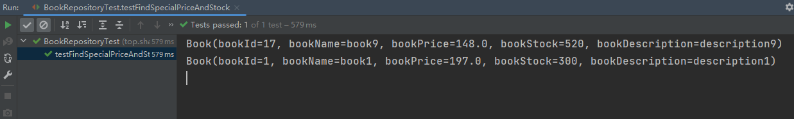

### 11.10.5.分页查询

ES中数据更新如下：


**根据书名分页查询：**

mapper代理类

```java
package top.sharehome.springbootelasticsearch.mapper;

import org.springframework.data.domain.Pageable;
import org.springframework.data.elasticsearch.repository.ElasticsearchRepository;
import top.sharehome.springbootelasticsearch.bean.Book;

import java.math.BigDecimal;
import java.util.Collection;
import java.util.List;

/**
 * @Description
 * @Author:AntonyCheng
 * @CreateTime:2023/1/7 19:38
 */
public interface BookRepository extends ElasticsearchRepository<Book, Integer> {
    /**
     * 查询书籍价格大于等于某个数的书籍信息
     *
     * @param bookPrice
     * @return
     */
    List<Book> findByBookPriceGreaterThanEqual(BigDecimal bookPrice);

    /**
     * 查询价格大于100且数量大于等于300的书籍信息
     *
     * @param bookPrice
     * @param bookStock
     * @return
     */
    List<Book> findByBookPriceGreaterThanAndBookStockGreaterThanEqual(BigDecimal bookPrice, Integer bookStock);

    /**
     * 分页查询，一定要加一个Pageable形参，这个实参由PageRequest.of()进行构造
     *
     * @param bookNames
     * @param pageable
     * @return
     */
    List<Book> findByBookNameIn(Collection<String> bookNames, Pageable pageable);
}
```

测试类如下

```java
package top.sharehome.springbootelasticsearch.mapper;

import org.junit.jupiter.api.Test;
import org.springframework.beans.factory.annotation.Autowired;
import org.springframework.boot.test.context.SpringBootTest;
import org.springframework.data.domain.PageImpl;
import org.springframework.data.domain.PageRequest;
import org.springframework.data.elasticsearch.core.ElasticsearchRestTemplate;
import top.sharehome.springbootelasticsearch.bean.Book;

import java.math.BigDecimal;
import java.util.*;

@SpringBootTest
class BookRepositoryTest {
    @Autowired
    private ElasticsearchRestTemplate elasticsearchRestTemplate;

    @Autowired
    private BookRepository bookRepository;

    /**
     * 查询索引中所有文档
     */
    @Test
    public void testFindAll() {
        bookRepository.findAll().forEach(c -> System.out.println(c.toString()));
    }

    /**
     * 根据文档id查询
     */
    @Test
    public void testFindById() {
        Optional<Book> optional = bookRepository.findById(1);
        Book book = optional.get();
        System.out.println(book.toString());
    }

    /**
     * 查询价格大于100元的书籍
     */
    @Test
    public void testFindSpecialPrice() {
        List<Book> books = bookRepository.findByBookPriceGreaterThanEqual(new BigDecimal(100));
        books.forEach(System.out::println);
    }

    /**
     * 查询价格大于100且数量大于等于300的书籍信息
     */
    @Test
    void testFindSpecialPriceAndStock() {
        List<Book> books = bookRepository.findByBookPriceGreaterThanAndBookStockGreaterThanEqual(new BigDecimal(100), 300);
        books.forEach(System.out::println);
    }

    /**
     * 根据书名分页查询
     */
    @Test
    void testFindPage() {
        List<Book> books = bookRepository.findByBookNameIn(Arrays.asList("java", "python"), PageRequest.of(0, 3));
        books.forEach(System.out::println);
    }
}
```

搜索结果如下


**根据价格范围分页查询：**

mapper代理类

```java
package top.sharehome.springbootelasticsearch.mapper;

import org.springframework.data.domain.Pageable;
import org.springframework.data.elasticsearch.repository.ElasticsearchRepository;
import top.sharehome.springbootelasticsearch.bean.Book;

import java.math.BigDecimal;
import java.util.Collection;
import java.util.List;

/**
 * @Description
 * @Author:AntonyCheng
 * @CreateTime:2023/1/7 19:38
 */
public interface BookRepository extends ElasticsearchRepository<Book, Integer> {
    /**
     * 查询书籍价格大于等于某个数的书籍信息
     *
     * @param bookPrice
     * @return
     */
    List<Book> findByBookPriceGreaterThanEqual(BigDecimal bookPrice);

    /**
     * 查询价格大于100且数量大于等于300的书籍信息
     *
     * @param bookPrice
     * @param bookStock
     * @return
     */
    List<Book> findByBookPriceGreaterThanAndBookStockGreaterThanEqual(BigDecimal bookPrice, Integer bookStock);

    /**
     * 根据书名分页查询，一定要加一个Pageable形参，这个实参由PageRequest.of()进行构造
     *
     * @param bookNames
     * @param pageable
     * @return
     */
    List<Book> findByBookNameIn(Collection<String> bookNames, Pageable pageable);

    /**
     * 根据价格范围分页查询
     *
     * @param minPrice
     * @param maxPrice
     * @param pageable
     * @return
     */
    List<Book> findByBookPriceGreaterThanAndBookPriceLessThan(BigDecimal minPrice, BigDecimal maxPrice, Pageable pageable);
}
```

测试类

```java
package top.sharehome.springbootelasticsearch.mapper;

import org.junit.jupiter.api.Test;
import org.springframework.beans.factory.annotation.Autowired;
import org.springframework.boot.test.context.SpringBootTest;
import org.springframework.data.domain.PageImpl;
import org.springframework.data.domain.PageRequest;
import org.springframework.data.elasticsearch.core.ElasticsearchRestTemplate;
import top.sharehome.springbootelasticsearch.bean.Book;

import java.math.BigDecimal;
import java.util.*;

@SpringBootTest
class BookRepositoryTest {
    @Autowired
    private ElasticsearchRestTemplate elasticsearchRestTemplate;

    @Autowired
    private BookRepository bookRepository;

    /**
     * 查询索引中所有文档
     */
    @Test
    public void testFindAll() {
        bookRepository.findAll().forEach(c -> System.out.println(c.toString()));
    }

    /**
     * 根据文档id查询
     */
    @Test
    public void testFindById() {
        Optional<Book> optional = bookRepository.findById(1);
        Book book = optional.get();
        System.out.println(book.toString());
    }

    /**
     * 查询价格大于100元的书籍
     */
    @Test
    public void testFindSpecialPrice() {
        List<Book> books = bookRepository.findByBookPriceGreaterThanEqual(new BigDecimal(100));
        books.forEach(System.out::println);
    }

    /**
     * 查询价格大于100且数量大于等于300的书籍信息
     */
    @Test
    void testFindSpecialPriceAndStock() {
        List<Book> books = bookRepository.findByBookPriceGreaterThanAndBookStockGreaterThanEqual(new BigDecimal(100), 300);
        books.forEach(System.out::println);
    }

    /**
     * 根据书名分页查询
     */
    @Test
    void testFindPage1() {
        List<Book> books = bookRepository.findByBookNameIn(Arrays.asList("java", "python"), PageRequest.of(0, 3));
        books.forEach(System.out::println);
    }

    /**
     * 根据价格范围分页查询
     */
    @Test
    void testFindPage2() {
        bookRepository.findByBookPriceGreaterThanAndBookPriceLessThan(new BigDecimal(0), new BigDecimal(100), PageRequest.of(0, 5)).forEach(System.out::println);
    }

}
```

查询结果如下：


### 11.10.6.原始查询

当模板中没有自己需要的方法时，我们就需要用最原始的方法去自定义查询模板进行查询，自定义模板仅需要在测试类中进行，代理类与此无关；

**测试类：**

```java
package top.sharehome.springbootelasticsearch.mapper;

import org.elasticsearch.index.query.QueryBuilders;
import org.elasticsearch.search.sort.SortBuilders;
import org.elasticsearch.search.sort.SortOrder;
import org.junit.jupiter.api.Test;
import org.springframework.beans.factory.annotation.Autowired;
import org.springframework.boot.test.context.SpringBootTest;
import org.springframework.data.domain.PageRequest;
import org.springframework.data.elasticsearch.core.ElasticsearchRestTemplate;
import org.springframework.data.elasticsearch.core.SearchHits;
import org.springframework.data.elasticsearch.core.query.NativeSearchQuery;
import org.springframework.data.elasticsearch.core.query.NativeSearchQueryBuilder;
import top.sharehome.springbootelasticsearch.bean.Book;

@SpringBootTest
class CustomizationTest {
    @Autowired
    private BookRepository bookRepository;
    @Autowired
    private ElasticsearchRestTemplate elasticsearchRestTemplate;

    /**
     * 进行QueryString查询，根据内容为"Java和Python"，并且结果按照书的价格降序排列，分页查询（一页俩结果）
     */
    @Test
    public void testQueryString() {
        NativeSearchQuery searchQuery = new NativeSearchQueryBuilder()
                //withQuery指定使用的查询方式，形参是QueryBuilder，需要用QueryBuilders进行构建
                .withQuery(QueryBuilders.queryStringQuery("Java和Python"))
                //withSort指定排序的字段以及排序的方式（升序ESC/降序DESC）
                .withSort(SortBuilders.fieldSort("book_price").order(SortOrder.DESC))//降序
                //withPageable指定分页的方式
                .withPageable(PageRequest.of(0, 2))
                //build进行构造
                .build();
        //使用ElasticsearchRestTemplate.search()进行查询
        //得到的SearchHits可以看成List类型，进行遍历，使用getContent()获取内容
        SearchHits<Book> books = elasticsearchRestTemplate.search(searchQuery, Book.class);
        books.forEach(bookSearchHit -> {
            System.out.println(bookSearchHit.getContent().toString());
        });
    }
}
```

查询结果如下：


### 11.10.7.高亮查询

#### Kibana高亮查询

**在ES中可以直接进行高亮查询，我们需要借助Kibana进行查询测试：**

```shell
#高亮查询
POST products/_search
{
  "query": {
    "bool": {
      "must": {
        "query_string":{
          "default_field":"name",
          "query":"松下"
        }
      }
    }
  },
  "highlight": {
    "fields": {
      "name": {}
    }
  }
}
```

查询结果如下：

```shell
{
  "took" : 3,
  "timed_out" : false,
  "_shards" : {
    "total" : 1,
    "successful" : 1,
    "skipped" : 0,
    "failed" : 0
  },
  "hits" : {
    "total" : {
      "value" : 2,
      "relation" : "eq"
    },
    "max_score" : 1.658422,
    "hits" : [
      {
        "_index" : "products",
        "_type" : "_doc",
        "_id" : "400",
        "_score" : 1.658422,
        "_source" : {
          "name" : "松下洗衣机",
          "brand" : "松下",
          "price" : "3999",
          "status" : "1"
        },
        "highlight" : {
          "name" : [
            "<em>松</em><em>下</em>洗衣机"
          ]
        }
      },
      {
        "_index" : "products",
        "_type" : "_doc",
        "_id" : "600",
        "_score" : 1.658422,
        "_source" : {
          "name" : "松下电饭煲",
          "brand" : "松下",
          "price" : "1999",
          "status" : "0"
        },
        "highlight" : {
          "name" : [
            "<em>松</em><em>下</em>电饭煲"
          ]
        }
      }
    ]
  }
}
```

能看出来上面只是做到了倾斜，如果我们要自定义样式的话，我们需要做如下修改；

```shell
#高亮查询
POST products/_search
{
  "query": {
    "bool": {
      "must": {
        "query_string":{
          "default_field":"name",
          "query":"松下"
        }
      }
    }
  },
  "highlight": {
    "fields": {
      "name": {
        "pre_tags": "<font style='color:red'",
        "post_tags": "</font>"
      }
    }
  }
}
```

查询结果如下：

```shell
{
  "took" : 3,
  "timed_out" : false,
  "_shards" : {
    "total" : 1,
    "successful" : 1,
    "skipped" : 0,
    "failed" : 0
  },
  "hits" : {
    "total" : {
      "value" : 2,
      "relation" : "eq"
    },
    "max_score" : 1.658422,
    "hits" : [
      {
        "_index" : "products",
        "_type" : "_doc",
        "_id" : "400",
        "_score" : 1.658422,
        "_source" : {
          "name" : "松下洗衣机",
          "brand" : "松下",
          "price" : "3999",
          "status" : "1"
        },
        "highlight" : {
          "name" : [
            "<font style='color:red'松</font><font style='color:red'下</font>洗衣机"
          ]
        }
      },
      {
        "_index" : "products",
        "_type" : "_doc",
        "_id" : "600",
        "_score" : 1.658422,
        "_source" : {
          "name" : "松下电饭煲",
          "brand" : "松下",
          "price" : "1999",
          "status" : "0"
        },
        "highlight" : {
          "name" : [
            "<font style='color:red'松</font><font style='color:red'下</font>电饭煲"
          ]
        }
      }
    ]
  }
}
```

#### SpringData高亮查询

要求查询内容为“Java”，并且把“Java”高亮；

**代理类：**

```Java
package top.sharehome.springbootelasticsearch.mapper;

import org.springframework.data.domain.Pageable;
import org.springframework.data.elasticsearch.annotations.Highlight;
import org.springframework.data.elasticsearch.annotations.HighlightField;
import org.springframework.data.elasticsearch.annotations.HighlightParameters;
import org.springframework.data.elasticsearch.core.SearchHit;
import org.springframework.data.elasticsearch.core.SearchHits;
import org.springframework.data.elasticsearch.repository.ElasticsearchRepository;
import top.sharehome.springbootelasticsearch.bean.Book;

import java.math.BigDecimal;
import java.util.Collection;
import java.util.List;

/**
 * @Description
 * @Author:AntonyCheng
 * @CreateTime:2023/1/7 19:38
 */
public interface BookRepository extends ElasticsearchRepository<Book, Integer> {
    /**
     * 查询书籍价格大于等于某个数的书籍信息
     *
     * @param bookPrice
     * @return
     */
    List<Book> findByBookPriceGreaterThanEqual(BigDecimal bookPrice);

    /**
     * 查询价格大于100且数量大于等于300的书籍信息
     *
     * @param bookPrice
     * @param bookStock
     * @return
     */
    List<Book> findByBookPriceGreaterThanAndBookStockGreaterThanEqual(BigDecimal bookPrice, Integer bookStock);

    /**
     * 根据书名分页查询，一定要加一个Pageable形参，这个实参由PageRequest.of()进行构造
     *
     * @param bookNames
     * @param pageable
     * @return
     */
    List<Book> findByBookNameIn(Collection<String> bookNames, Pageable pageable);

    /**
     * 根据价格范围分页查询
     *
     * @param minPrice
     * @param maxPrice
     * @param pageable
     * @return
     */
    List<Book> findByBookPriceGreaterThanAndBookPriceLessThan(BigDecimal minPrice, BigDecimal maxPrice, Pageable pageable);

    /**
     * 进行高亮显示
     * @param bookName
     * @return 返回值类型中的泛型需要是SearchHits<JavaBean>
     * @note @Highlight注解中的fields属性是一个@HighlightField注解的集合
     * @note @HighlightField注解中需要填写name属性，即需要高亮的JavaBean字段
     * @note @Highlight注解中的parameters属性是一个@HighlightParameters注解的集合
     * @note @HighlightParameters中的preTags属性指定高亮内容的标签前缀，postTags属性指定高亮内容的标签后缀
     */
    @Highlight(fields = {
            @HighlightField(name = "bookName")
    },parameters = @HighlightParameters(preTags = "<font style='color:red'>",postTags = "</font>")
    )
    List<SearchHit<Book>> findByBookName(String bookName);
}
```

**测试类：**

```java
package top.sharehome.springbootelasticsearch.mapper;

import org.junit.jupiter.api.Test;
import org.springframework.beans.factory.annotation.Autowired;
import org.springframework.boot.test.context.SpringBootTest;
import org.springframework.data.elasticsearch.core.ElasticsearchRestTemplate;
import org.springframework.data.elasticsearch.core.SearchHit;
import top.sharehome.springbootelasticsearch.bean.Book;

import java.util.List;
import java.util.Map;

@SpringBootTest
class HighlightQueryTest {
    @Autowired
    private BookRepository bookRepository;
    @Autowired
    private ElasticsearchRestTemplate elasticsearchRestTemplate;

    @Test
    public void testHighlightQuery() {
        //1.指定书名中含有java
        List<SearchHit<Book>> books = bookRepository.findByBookName("java");
        //2.遍历查询结果
        books.forEach(book -> {
            System.out.println("bookId = " + book.getId()); //获取查询结果中document的id
            List<String> bookName = book.getHighlightField("bookName");//bookName里面保存的就是所有关于bookName的高亮信息
            bookName.forEach(System.out::println);//遍历高亮内容
        });
        //3.如果查询的内容涉及到有多个字段，获取高亮信息就可以使用getHighlightFields()方法
        books.forEach(book -> {
            System.out.println("bookId = " + book.getId()); //获取查询结果中document的id
            Map<String, List<String>> highlightFields = book.getHighlightFields();
            highlightFields.forEach((k, v) -> {
                System.out.println("IndexField = " + k);
                v.forEach(System.out::println);
            });
        });
    }
}
```

查询结果如下：


# 12.Docker

## 12.1.概述

Docker是一个开源项目，诞生于 2013 年初，最初是 dotCloud 公司内部的一个业余项目。它基于 Google 公司推出的 GO 语言实现。项目后来加入了 Linux 基金会，遵从了 Apache 2.0 协议，项目代码在 GitHub 上进行维护；

Docker自开源后受到广泛的关注和讨论，以至于 dotCloud 公司后来都改名为 Docker Inc。Redhat 已经在其 RHEL6.5 中集中支持Docker，Google 也在其 Paas 产品中广泛应用；

Docker 是一个开源的应用**容器**引擎，让开发者可以打包他们的应用以及依赖包到一个可移植的**镜像**中，然后发布到任何流行的 Linux或Windows 机器上，也可以实现**虚拟化**。容器是完全使用沙箱机制，相互之间不会有任何接口；

## 12.2.Docker架构


**镜像（Image）：**Docker镜像（Image），就相当于一个root系统文件，比如官方镜像Ubuntu就包含了完整的一套Ubuntu最小系统的root文件系统；

**容器（Container）：**镜像（Image）和容器（Container）的关系，就像是面向对象程序设计中的类和实例一样，镜像是静态的定义，容器是镜像运行时的实体，可以呗创建，启动，停止，删除和暂停等

**仓库（Register/Repository）：**仓库可以看成一个代码控制中心，用来保存镜像；

## 12.3.Docker和VM

### 12.3.1.VM架构


- **基础设施（Infrastructure）**：它可以是你的**个人电脑**，数据中心的**服务器**或者是**云主机**；
- **主操作系统（Host Operating System）**：个人电脑上运行的可能是Windows，Linux，Unix操作系统；
- **虚拟机管理系统（Hypervisor）**：利用Hypervisor，可以在**主操作系统**之上运行多个不同的从操作系统，类型1的Hypervisor有支持MacOS的**HyperKit**，支持Windows的**Hyper-V**以及支持Linux的**KVM**，类型2的Hypervisor由VirtualBox和VMWare；
- **从操作系统（Guest Operating System）**：假设你需要运行3个相互隔离的应用，则需要使用Hypervisor启动3个**从操作系统**，也就是3个**虚拟机**。这些虚拟机都非常大，也许有700MB，这就意味着它们将占用2.1GB的磁盘空间。更糟糕的是，它们还会消耗很多CPU和内存；
- **各种依赖**：每一个从操作系统都需要安装许多依赖。如果你的的应用需要连接PostgresQL的话，则需要安装libpq-dev；如果你使用Ruby的话，应该需要安装gems；如果使用其他编程语言，比如Python或者Node.js，都会需要安装对应的依赖库；
- **应用**：安装依赖之后，就可以在各个从操作系统分别运行应用了，这样各个应用就是相互隔离的；

### 12.3.2.Docker架构

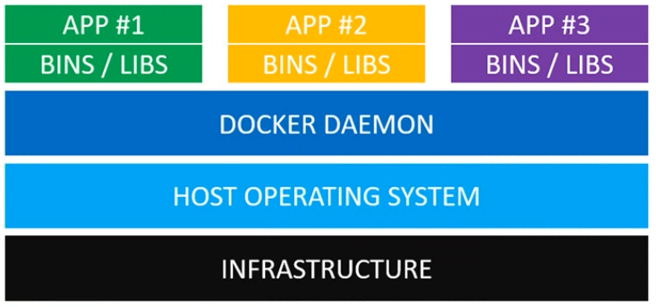

- **基础设施（Infrastructure）**：它可以是你的**个人电脑**，数据中心的**服务器**或者是**云主机**；
- **主操作系统（Host Operating System）**：所有主流的Linux发行版本都可以运行Docker，对于MacOS和Windows，也有一些办法可以运行Docker；
- **Docker守护进程（Docker Daemon）**：Docker守护进程取代了Hypervisor，它是运行在操作系统之上的后台进程，负载管理Docker容器；
- **各种依赖**：对于Docker来说，应用的所有依赖都打包在**Docker镜像**中，**Docker容器**是基于**Docker镜像**创建的；
- **应用**：应用的源代码与它的依赖都打包在**Docker镜像**中，不同的应用需要不同的**Docker镜像**，不同的应用运行在不同的**Docker容器**中，他们是相互隔离的；

### 12.3.3.对比

**Docker守护进程**可以直接与**主操作系统**进行通信，为各个**Docker容器**分配资源；它还可以将容器与**主操作系统**隔离，并将各个容器互相隔离。**虚拟机**启动需要数分钟，而**Docker容器**可以在数毫秒内启动。由于没有臃肿的**从操作系统**，Docker可以节省大量的磁盘空间以及其他系统资源。

## 12.4.安装与启动Docker

==这里使用的虚拟机版本是 CentOS 7 ，全新安装的，用于演示；==

```shell
#首先需要重新更新一下 yum 包管理器的内容
yum update

#安装依赖包
yum install -y yum-utils device-mapper-persistent-data lvm2

#设置docker的安装源
yum-config-manager --add-repo https://download.docker.com/linux/centos/docker-ce.repo

#安装docker
yum install -y docker-ce docker-ce-cli containerd.io

#验证docker的安装
docker -v
#Docker version 20.10.22, build 3a2c30b

#启动docker
systemctl start docker
#查看docker状态
systemctl status docker
#关闭docker
systemctl stop docker
```

## 12.5.配置阿里云镜像仓库

1. 访问阿里云官网： https://cn.aliyun.com/

2. 扫码登录/手机号登录

3. 在首页选择控制台 => 搜索容器 => 镜像加速器

4. 做如下操作即可：

   

## 12.6.docker命令

所有命令我们查询官方文档即可：https://docs.docker.com/engine/reference/commandline/cli/

### 12.6.1.基本命令

```shell
#启动docker
systemctl start docker
#查看docker状态
systemctl status docker
#关闭docker
systemctl stop docker
#重启docker
systemctl restart docker
```

### 12.6.2.镜像命令

docker官方提供了一个入门镜像可以进行测试：hello-world

```shell
#查看本地所有镜像
docker images
#会显示本地镜像的如下内容：
#REPOSITORY    TAG       IMAGE ID       CREATED         SIZE

#拉取镜像
docker pull <REPOSITORY> #拉取REPOSITORY镜像的latest版本
docker pull <REPOSITORY>:<TAG> #拉取REPOSITORY镜像的TAG版本

#搜索远程仓库内的镜像
docker search <REPOSITORY>

#删除镜像，删除的镜像没有对应的实例化容器
docker rmi <IMAGE ID>
docker rmi <REPOSITORY>
docker rmi <REPOSITORY>:<TAG>
#删除所有镜像，-q指的是返回查询到的IMAGE ID
docker rmi $(docker images -q)
```

### 12.6.3.容器命令

我们需要保证有镜像才能进行操作容器，所以我们需要先拉取一个镜像：ubuntu:16.04；

如果出现==docker: Error response from daemon: No command specified等关于命令或者参数的报错==，我们需要再命令后面添加/bin/bash

```shell
#docker创建并且启动容器，"..."是可执行的参数，-i -t指的是可进入该容器内部，-d指的是后台运行，--name指定该容器名字
docker run <...> --name=<ContainerName> <IMAGE ID>
docker run <...> --name=<ContainerName> <REPOSITORY>
docker run <...> --name=<ContainerName> <REPOSITORY>:<TAG>
#实例如下：
#docker运行ubuntu:16.04，-i -t指的是可进入该容器内部，--name指定该容器名字
docker run -i -t --name=ubuntu01 ubuntu:16.04 #使用exit退出该容器，退出后自动关闭该容器


#docker执行运行中的容器，一般针对于后台运行的容器，"..."是可执行的参数，-i -t指的是可进入该容器内部
docker exec <...> <ContainerName> /bin/bash
#示例如下：
#docker运行ubuntu:16.04，-i -t -d指的是可进入该容器内部且后台运行，--name指定该容器名字
docker run -i -t -d --name=ubuntu02 ubuntu:16.04
#docker执行运行中ubuntu:16.04，-i -t -d指的是可进入该容器内部且后台运行，--name指定该容器名字
docker exec -i -t ubuntu02 /bin/bash #使用exit退出该容器，退出后自动关闭该容器


#docker查看当前的容器，"..."是可执行的参数，-a指的是所有的容器（正在运行中和已经关闭的）
docker ps <...>
#会显示本地容器的如下内容：
#CONTAINER ID      IMAGE     COMMAND      CREATED     STATUS     PORTS     NAMES


#docker启动容器
docker start <ContainerName>
docker start <CONTAINER ID>


#docker停止容器
docker stop <ContainerName>
docker stop <CONTAINER ID>


#docker重启容器
docker restart <ContainerName>
docker restart <CONTAINER ID>


#docker删除容器，删除的容器状态一定要是停止的，"..."是可执行的参数，-f指的是强制删除
docker rm <...> <ContainerName>
docker rm <...> <CONTAINER ID>
#docker删除所有容器，"..."是可执行的参数，-f指的是强制删除
#-q指的是返回查询到的CONTAINER ID
docker rm <...> $(docker ps -a -q)

#docker容器日志
docker logs <ContainerName>
docker logs <CONTAINER ID>
```

### 12.6.4.容器的导入导出

```shell
#首先查看有哪些容器
docker ps -a
#CONTAINER ID   IMAGE          COMMAND       CREATED          STATUS          PORTS     NAMES
#d20921de1757   ubuntu:16.04   "/bin/bash"   14 minutes ago   Up 14 minutes             ubuntu01

#我们将这个容器导出到当前目录，命名为ubuntu01.tar
docker export ubuntu01 > ubuntu01.tar
#[root@192 ~]# ll
#总用量 88176
#-rw-------. 1 root root     1792 1月   8 15:33 anaconda-ks.cfg
#-rw-r--r--. 1 root root     1840 1月   8 15:35 initial-setup-ks.cfg
#-rw-r--r--. 1 root root 90244608 1月   8 23:15 ubuntu01.tar
#drwxr-xr-x. 2 root root     4096 1月   8 15:36 公共
#drwxr-xr-x. 2 root root     4096 1月   8 15:36 模板
#drwxr-xr-x. 2 root root     4096 1月   8 15:36 视频
#drwxr-xr-x. 2 root root     4096 1月   8 15:36 图片
#drwxr-xr-x. 2 root root     4096 1月   8 15:36 文档
#drwxr-xr-x. 2 root root     4096 1月   8 15:36 下载
#drwxr-xr-x. 2 root root     4096 1月   8 15:36 音乐
#drwxr-xr-x. 2 root root     4096 1月   8 15:36 桌面
#导出成功！

#我们再将容器删掉，做导入工作
docker rm -f ubuntu01
#导入时要注意这个容器是以镜像身份导入的，所以可以自定义导入镜像名
#docker import 导入文件名 导入镜像名
docker import ubuntu01.tar ubuntu-image-import:16.04
#[root@192 ~]# docker images
#REPOSITORY            TAG       IMAGE ID       CREATED          SIZE
#ubuntu-image-import   16.04     0c508624ae2c   58 seconds ago   86.2MB
#hello-world           latest    feb5d9fea6a5   15 months ago    13.3kB
#ubuntu                <none>    b6f507652425   16 months ago    135MB
#导入成功！

#下面来测试，先运行容器（此处运行会报错，所以添加/bin/bash），再验证
docker run -i -t -d --name=ubuntu02  ubuntu-image-import:16.04 /bin/bash
docker ps -a
#CONTAINER ID   IMAGE                       COMMAND       CREATED         STATUS         PORTS     NAMES
#d7323636df79   ubuntu-image-import:16.04   "/bin/bash"   7 seconds ago   Up 6 seconds             ubuntu02
```

### 12.6.5.宿主机和容器的文件拷贝

首先准备好文件：


```shell
#先从宿主机拷贝到容器
#docker cp 宿主机上的文件路径 容器名:容器中的文件路径
docker cp /root/1.txt ubuntu02:/home/
#然后进入运行时的容器
docker exec -it ubuntu02 /bin/bash
#root@d7323636df79:/# ls /home/
#1.txt
#拷贝成功！

#下面在容器中修改一下文件名字，再拷贝到宿主机
#root@d7323636df79:/# mv /home/1.txt /home/2.conf
#此时需要退出到宿主机进行操作
#docker cp 容器名:容器中的文件路径 宿主机上的文件路径
docker cp ubuntu02:/home/2.conf /root/
#[root@192 ~]# ll
#总用量 48
#-rw-r--r--. 1 root root    4 1月   8 23:37 1.txt
#-rw-r--r--. 1 root root    4 1月   8 23:37 2.conf
#-rw-------. 1 root root 1792 1月   8 15:33 anaconda-ks.cfg
#-rw-r--r--. 1 root root 1840 1月   8 15:35 initial-setup-ks.cfg
#drwxr-xr-x. 2 root root 4096 1月   8 15:36 公共
#drwxr-xr-x. 2 root root 4096 1月   8 15:36 模板
#drwxr-xr-x. 2 root root 4096 1月   8 15:36 视频
#drwxr-xr-x. 2 root root 4096 1月   8 15:36 图片
#drwxr-xr-x. 2 root root 4096 1月   8 15:36 文档
#drwxr-xr-x. 2 root root 4096 1月   8 15:36 下载
#drwxr-xr-x. 2 root root 4096 1月   8 15:36 音乐
#drwxr-xr-x. 2 root root 4096 1月   8 15:36 桌面
#拷贝成功！
```

### 12.6.6.目录挂载

目录挂载就是设置一个容器和宿主机共享的目录，思路就是在宿主机上开辟一个目录进行共享操作；

```shell
#在创建容器时挂载目录，差别就是需要 "-v 宿主机共享目录路径:容器共享目录路径" 参数
#这里不需要考虑-v的路径是否存在，执行命令后会自动生成
docker run -i -t -d --name=ubuntu01 -v /home/share:/home/share ubuntu:16.04
#我们可以来验证一下内容，现在在宿主机上添加一个文件，然后去容器里面查看
vim /home/share/hello.txt
docker exec -i -t ubuntu01 /bin/bash
#root@0101fa26b355:/# ll /home/share
#total 12
#drwxr-xr-x. 2 root root 4096 Jan  8 15:58 ./
#drwxr-xr-x. 1 root root 4096 Jan  8 15:57 ../
#-rw-r--r--. 1 root root    7 Jan  8 15:58 hello.txt
#共享成功！
```

## 12.7.docker常用环境部署

部署的具体官方过程在https://hub.docker.com/都能搜索到；

### 12.7.1.docker部署JDK

```shell
#首先下载镜像
docker pull java:8
#8: Pulling from library/java
#5040bd298390: Pull complete 
#fce5728aad85: Pull complete 
#76610ec20bf5: Pull complete 
#60170fec2151: Pull complete 
#e98f73de8f0d: Pull complete 
#11f7af24ed9c: Pull complete 
#49e2d6393f32: Pull complete 
#bb9cdec9c7f3: Pull complete 
#Digest: sha256:c1ff613e8ba25833d2e1940da0940c3824f03f802c449f3d1815a66b7f8c0e9d
#Status: Downloaded newer image for java:8
#docker.io/library/java:8

#然后我们启动这个镜像，创建容器
docker run -itd --name=jdk8 java:8

#进入容器，查看Java是否安装完成
docker exec -it jdk8 /bin/bash
#root@f512cd4d664f:/# java -version
#openjdk version "1.8.0_111"
#OpenJDK Runtime Environment (build 1.8.0_111-8u111-b14-2~bpo8+1-b14)
#OpenJDK 64-Bit Server VM (build 25.111-b14, mixed mode)
#部署完成！
```

### 12.7.2.docker部署Tomcat（8080）

```shell
#首先下载镜像
docker pull tomcat:9.0.37
#9.0.37: Pulling from library/tomcat
#57df1a1f1ad8: Pull complete 
#71e126169501: Pull complete 
#1af28a55c3f3: Pull complete 
#03f1c9932170: Pull complete 
#881ad7aafb13: Pull complete 
#9c0ffd4062f3: Pull complete 
#bd62e479351a: Pull complete 
#48ee8bc64dbc: Pull complete 
#6daad3485ea7: Pull complete 
#bc07a0199230: Pull complete 
#Digest: sha256:c2b033c9cee06d6a3eb5a4d082935bbb8afee7478e97dcd6bc452bb6ab28da4b
#Status: Downloaded newer image for tomcat:9.0.37
#docker.io/library/tomcat:9.0.37

#然后我们带着端口启动这个镜像，创建容器，-p参数相当于配置映射端口，外部访问宿主机端口，就能访问当容器内的端口
#docker run -itd -p 宿主机端口:容器内端口 --name=tomcat9 tomcat:9.0.37
docker run -itd -p 8080:8080 --name=tomcat9 tomcat:9.0.37

#查看端口的映射情况
docker ps -a
#CONTAINER ID   IMAGE           COMMAND             CREATED         STATUS         PORTS                                       NAMES
#e0e4601f76dd   tomcat:9.0.37   "catalina.sh run"   6 seconds ago   Up 5 seconds   0.0.0.0:8080->8080/tcp, :::8080->8080/tcp   tomcat9
#f512cd4d664f   java:8          "/bin/bash"         11 hours ago    Up 11 hours 
#映射成功！

#docker部署的tomcat9的默认页面不在webapps中，而在webapps.dist中，如果我们需要访问默认页面，我们进入容器做一个拷贝即可
docker exec -it tomcat9 /bin/bash
#root@e0e4601f76dd:/usr/local/tomcat# cp -r webapps.dist/* webapps/
#root@e0e4601f76dd:/usr/local/tomcat# ls webapps/
#ROOT  docs  examples  host-manager  manager
#拷贝成功！
#注意：宿主机需要开放8080端口
#现在在网页中访问http://192.168.112.200:8080/即可看见默认页面
```

### 12.7.3.docker部署MySQL（3306）

```shell
#首先下载镜像
docker pull mysql:8.0.17
#8.0.17: Pulling from library/mysql
#8f91359f1fff: Pull complete 
#6bbb1c853362: Pull complete 
#e6e554c0af6f: Pull complete 
#f391c1a77330: Pull complete 
#414a8a88eabc: Pull complete 
#fee78658f4dd: Pull complete 
#9568f6bff01b: Pull complete 
#5a026d8bbe50: Pull complete 
#07f193b54ae1: Pull complete 
#1e404375a275: Pull complete 
#b81b2ef0e430: Pull complete 
#2f499f36bd40: Pull complete 
#Digest: sha256:6d95fa56e008425121e24d2c01b76ebbf51ca1df0bafb1edbe1a46937f4a149d
#Status: Downloaded newer image for mysql:8.0.17
#docker.io/library/mysql:8.0.17

#然后我们带着端口启动这个镜像，创建容器，-p参数相当于配置映射端口，外部访问宿主机端口，就能访问当容器内的端口，-e MYSQL_ROOT_PASSWORD=mysql_password指定对应的MySQL密码
#docker run -itd --name=mysql-8.0.17 -p 宿主机端口:容器内端口 -e MYSQL_ROOT_PASSWORD=123456 mysql:8.0.17 
docker run -itd --name=mysql-8.0.17 -p 3306:3306 -e MYSQL_ROOT_PASSWORD=123456 mysql:8.0.17 

#查看端口的映射情况
docker ps -a
#CONTAINER ID   IMAGE           COMMAND                  CREATED          STATUS          PORTS                                                  NAMES
#88cf0bbb0965   mysql:8.0.17    "docker-entrypoint.s…"   5 seconds ago    Up 4 seconds    0.0.0.0:3306->3306/tcp, :::3306->3306/tcp, 33060/tcp   mysql-8.0.17
#e0e4601f76dd   tomcat:9.0.37   "catalina.sh run"        18 minutes ago   Up 18 minutes   0.0.0.0:8080->8080/tcp, :::8080->8080/tcp              tomcat9
#f512cd4d664f   java:8          "/bin/bash"              11 hours ago     Up 11 hours                                                            jdk8
#映射成功！

#注意：宿主机需要开放3306端口
#现在在Navicat中连接mysql即可；
```

### 12.7.4.docker部署Redis（6379）

```shell
#首先下载镜像
docker pull redis

#由于redis启动时需要相关的配置，所以我们在启动时挂载一个目录，以便于宿主机和容器进行文件的拷贝交互；
docker run -itd --name=redis -p 6379:6379 -v /home/share/redis:/etc/redis redis:latest

#查看启动状态
docker ps -a
#CONTAINER ID   IMAGE           COMMAND                  CREATED         STATUS         PORTS                                                  NAMES
#63a2e54da17d   redis:latest    "docker-entrypoint.s…"   5 seconds ago   Up 4 seconds   0.0.0.0:6379->6379/tcp, :::6379->6379/tcp              redis
#88cf0bbb0965   mysql:8.0.17    "docker-entrypoint.s…"   2 hours ago     Up 2 hours     0.0.0.0:3306->3306/tcp, :::3306->3306/tcp, 33060/tcp   mysql-8.0.17
#e0e4601f76dd   tomcat:9.0.37   "catalina.sh run"        3 hours ago     Up 3 hours     0.0.0.0:8080->8080/tcp, :::8080->8080/tcp              tomcat9
#f512cd4d664f   java:8          "/bin/bash"              13 hours ago    Up 13 hours                                                           jdk8

#将配置好的文件上传至宿主机的挂在文件中，如果涉及到修改配置文件，我们直接在宿主机的挂载目录进行修改即可
#[root@localhost ~]# ll /home/share/redis/
#总用量 108
#-rw-r--r--. 1 root root 106593 1月   9 13:46 redis.conf
#由于配置文件中redis的log自定义过目录，所以我们在容器中需要新建这个目录；
mkdir /var/logs
#上传并新建完毕之后进入容器，查找redis服务的位置
find / -name redis
#/usr/local/bin/redis-server
#find: '/proc/1/map_files': Operation not permitted
#find: '/proc/31/map_files': Operation not permitted
#find: '/proc/39/map_files': Operation not permitted
#进入找到的这个目录
cd /usr/local/bin/
#然后带着配置文件启动redis
./redis-server /etc/redis/redis.conf
#验证一下是否启动
./redis-cli
#127.0.0.1:6379>
#启动成功！
```

### 12.7.5.docker部署RabbitMQ（5672/15672）

```shell
#首先下载镜像
docker pull rabbitmq:management
#management: Pulling from library/rabbitmq
#7b1a6ab2e44d: Pull complete 
#37f453d83d8f: Pull complete 
#e64e769bc4fd: Pull complete 
#c288a913222f: Pull complete 
#12addf9c8bf9: Pull complete 
#eaeb088e057d: Pull complete 
#b63d48599313: Pull complete 
#05c99d3d2a57: Pull complete 
#43665bfbc3f9: Pull complete 
#f14c7d7911b1: Pull complete 
#Digest: sha256:4c4b66ad5ec40b2c27943b9804d307bf31c17c8537cd0cd107236200a9cd2814
#Status: Downloaded newer image for rabbitmq:management
#docker.io/library/rabbitmq:management

#由于rabbitmq启动时需要两个端口5672(工作端口)，15672(可视化端口)，所以我们需要带着这两个端口去启动它
docker run -itd -p 5672:5672 -p 15672:15672 --name=rabbimq rabbitmq:management

#查看启动状态
docker ps -a
#CONTAINER ID   IMAGE                 COMMAND                  CREATED          STATUS          PORTS                                                                                                                                                 NAMES
#3fd5e8cbc023   rabbitmq:management   "docker-entrypoint.s…"   2 minutes ago    Up 2 minutes    4369/tcp, 5671/tcp, 0.0.0.0:5672->5672/tcp, :::5672->5672/tcp, 15671/tcp, 15691-15692/tcp, 25672/tcp, 0.0.0.0:15672->15672/tcp, :::15672->15672/tcp   rabbimq
#63a2e54da17d   redis:latest          "docker-entrypoint.s…"   40 minutes ago   Up 40 minutes   0.0.0.0:6379->6379/tcp, :::6379->6379/tcp                                                                                                             redis
#88cf0bbb0965   mysql:8.0.17          "docker-entrypoint.s…"   3 hours ago      Up 3 hours      0.0.0.0:3306->3306/tcp, :::3306->3306/tcp, 33060/tcp                                                                                                  mysql-8.0.17
#e0e4601f76dd   tomcat:9.0.37         "catalina.sh run"        3 hours ago      Up 3 hours      0.0.0.0:8080->8080/tcp, :::8080->8080/tcp                                                                                                             tomcat9
#f512cd4d664f   java:8                "/bin/bash"              14 hours ago     Up 14 hours                                                                                                                                                           jdk8

#进入网页可视化界面看看rabbimq是否启动，使用默认的登录账号密码guest/guest进行登录即可
```

### 12.7.6.docker部署Elasticsearch（9200/9300）

9200是ES节点与节点之间的访问端口，9300是ES集群的访问端口；

```shell
#下载镜像，我们依旧使用7.9.3版本，下面是用ES官网库，也可以去docker官网进行拉取
docker pull docker.elastic.co/elasticsearch/elasticsearch:7.9.3

#启动镜像，创建容器，在配置文件没有修改之前创建需要-e "discovery.type=single-node"；
docker run -itd -p 9200:9200 -p 9300:9300 -e "discovery.type=single-node" --name=elasticsearch   docker.elastic.co/elasticsearch/elasticsearch:7.9.3

#完成之后我们先创建宿主机上的挂载目录，-p参数是创建多级目录
mkdir -p /home/share/elasticsearch/config

#查看容器中的配置文件路径，拷贝容器中的文件到宿主机的挂载目录
docker exec -it elasticsearch /bin/bash
#[root@54a7b8c6fc49 elasticsearch]# cd config/
#[root@54a7b8c6fc49 config]# pwd
#/usr/share/elasticsearch/config
#[root@54a7b8c6fc49 config]# ls
#elasticsearch.keystore  elasticsearch.yml  jvm.options  jvm.options.d  log4j2.properties  role_mapping.yml  roles.yml  users  users_roles
#找到配置文件夹！

#从容器退出，将容器这个目录中将所有的文件拷贝到宿主机的挂载目录上
docker cp elasticsearch:/usr/share/elasticsearch/config/. /home/share/elasticsearch/config/
#[root@localhost config]# ll /home/share/elasticsearch/config/
#总用量 32
#-rw-rw----. 1 root root  199 1月   9 16:31 elasticsearch.keystore
#-rw-rw----. 1 root root   53 10月 16 2020 elasticsearch.yml
#-rw-rw----. 1 root root 2301 10月 16 2020 jvm.options
#drwxrwxr-x. 2 root root 4096 10月 16 2020 jvm.options.d
#-rw-rw----. 1 root root 7734 10月 16 2020 log4j2.properties
#-rw-rw----. 1 root root  473 10月 16 2020 role_mapping.yml
#-rw-rw----. 1 root root  197 10月 16 2020 roles.yml
#-rw-rw----. 1 root root    0 10月 16 2020 users
#-rw-rw----. 1 root root    0 10月 16 2020 users_roles

#我们修改宿主机上的配置文件
vim /home/share/elasticsearch/config/elasticsearch.yml
#node.name: node-1
#cluster.initial_master_nodes: ["node-1"]
#network.host: 0.0.0.0

#我们还需要修改软硬件参数
vim /etc/security/limit.conf
#* soft nofile 65535
#* hard nofile 65535
#* soft nproc 4096
#* hard nproc 4096
vim /etc/sysctl.conf
#vm.max_map_count=655360
#查看文件是否写入
sysctl -p
#vm.max_map_count = 655360

#修改完之后我们需要删除ES的容器，然后以挂载目录的方式创建容器，此时创建就没必要使用-e "discovery.type=single-node"参数，因为它自己回去读取挂载目录中的内容，前提是容器的挂载目录就是ES配置文件的目录
docker rm -f elasticsearch 
docker run -itd --name=elasticsearch -p 9200:9200 -p 9300:9300 -v /home/share/elasticsearch/config/:/usr/share/elasticsearch/config/ docker.elastic.co/elasticsearch/elasticsearch:7.9.3
```

### 12.7.7.docker部署Kibana（5601）

```shell
#下载镜像，我们依旧使用7.9.3版本，下面是用ES官网库，也可以去docker官网进行拉取
docker pull docker.elastic.co/kibana/kibana:7.9.3
#7.9.3: Pulling from kibana/kibana
#f1feca467797: Already exists 
#f90682fcb094: Pull complete 
#517521bbcca8: Pull complete 
#8090a7d0ad89: Pull complete 
#89029827db01: Pull complete 
#26d07d22d187: Pull complete 
#fe836a16aee0: Pull complete 
#b7e955030225: Pull complete 
#86f74dd87ae1: Pull complete 
#1b618ee34a33: Pull complete 
#7cf6723ccb3f: Pull complete 
#Digest: sha256:75b917df52179cc29efbfe88159efbb186fd8697835b0849fde22f25ac74ac3b
#Status: Downloaded newer image for docker.elastic.co/kibana/kibana:7.9.3
#docker.elastic.co/kibana/kibana:7.9.3

#启动容器，此时Kibana需要和ES进行数据交互，所以需要--link=<ELASTICSEARCH_NAME_OR_ID>:elasticsearch参数指定对应的ES
#docker run -itd --name=kibana -p 5601:5601 --link=<ELASTICSEARCH_NAME_OR_ID>:elasticsearch docker.elastic.co/kibana/kibana:7.9.3 
docker run -itd --name=kibana -p 5601:5601 --link=elasticsearch:elasticsearch docker.elastic.co/kibana/kibana:7.9.3 

#启动后访问192.168.112.200:5601查看启动是否成功
```

### 12.7.8.docker部署logstash(9600)

## 1.下载镜像

老生常谈，没啥好说的。

```text
docker pull logstash:7.5.1
```

复制代码

## 2.新建挂载文件

此处不详谈，如果有疑问可以参考上文 redis 安装，有具体解释。

```text
mkdir -p /usr/local/logstash/conf.dmkdir -p /usr/local/logstash/configmkdir -p /usr/local/logstash/logs
```

复制代码

## 3.赋权

```text
chmod -777 /usr/local/logstash
```

复制代码

## 4.挂载配置文件

### 1.挂载配置文件


将 logstash.yml 放入/usr/local/logstash/config/中，在容器启动后，使用的就是该文件配置。**logstash.yml：**

```text
http.host: "0.0.0.0"xpack.monitoring.enabled: truexpack.monitoring.elasticsearch.hosts: "http://192.168.xx.xx:9200"  #es地址xpack.monitoring.elasticsearch.username: "elastic"  #es xpack账号密码xpack.monitoring.elasticsearch.password: "xxxx"     #es xpack账号密码path.config: /usr/share/logstash/config/conf.d/*.confpath.logs: /usr/share/logstash/logs
```

复制代码

> 注意 http.host: "0.0.0.0" 而不是指定 ip。

### 2.挂载日志收集文件

将 log_to_es.conf 放入/usr/local/logstash/conf.d/，在收集日志时，使用的就是该配置。

### 3.log_to_es.conf 配置

配置的含义下文解释。

**log_to_es.conf：**

```text
input{        tcp {          mode => "server"        host => "0.0.0.0"                port => 5000                codec => json_lines        type=> "datalog"        }    tcp {          mode => "server"        host => "0.0.0.0"                port => 4999                codec => json_lines        type=> "loginlog"         }}filter{      if[type] == "loginlog"{          grok {          match => {"message" => "|%{GREEDYDATA:loginMsg}|%{GREEDYDATA:timeFormat}|%{GREEDYDATA:userName}"}        }        if([message] =~  "^(?!.*?登录系统).*$") {          ### 丢弃          drop{}           }        }      if[type] == "datalog"{          grok {          match => {"message" => "|%{DATA:userName}|%{GREEDYDATA:operationName}|%{DATA:timeFormat}|%{DATA:ip}|%{DATA:systemType}|%{GREEDYDATA:logType}|%{GREEDYDATA:method}|%{GREEDYDATA:input}"}        }        }            ruby {        code => "event['time'] = event['@timestamp']"      }      mutate      {        add_field => ["time", "%{@timestamp}"]      }         }output{               if[type] == "datalog"{            elasticsearch{            hosts=>["192.168.xx.xx:9200"]            user => "elastic"            password => "xxxx"            index => "xxxx-%{+YYYY.MM.dd}"                }            }        if[type] == "loginlog"{            elasticsearch{            hosts=>["192.168.xx.xx:9200"]            user => "elastic"            password => "xxxx"            index => "xxxx-%{+YYYY.MM.dd}"                  }                                  }}
```

复制代码

## 5.启动

```text
docker run -p 5044:5044 -p 5000:5000-p 4999:4999--name=logstash \  --restart=always --privileged=true\  -e ES_JAVA_OPTS="-Xms1g -Xmx2g" \  -v /usr/local/logstash/config/logstash.yml:/usr/share/logstash/config/logstash.yml \  -v /usr/local/logstash/conf.d:/usr/share/logstash/config/conf.d \  -v /usr/local/logstash/logs:/usr/share/logstash/logs  \  -d logstash:7.5.1
```

复制代码

参数详解：

- -p 5044:5044 -p 5000:5000-p 4999:4999 ：映射的端口号 这里与上文 log_to_es.conf input 中一定要相同！！！！额外价格一个 5044 为 logstash 地址
- --name=logstash：容器名称
- --restart=always --privileged=true：启动配置
- -e ES_JAVA_OPTS="-Xms1g -Xmx2g"：指定内存
- -v /usr/local/logstash/config/logstash.yml:/usr/share/logstash/config/logstash.yml：配置文件挂载
- -v /usr/local/logstash/conf.d:/usr/share/logstash/config/conf.d：日志收集配置挂载位置
- -v /usr/local/logstash/logs:/usr/share/logstash/logs：日志挂载位置-d logstash:7.5.1：指定镜像

## 12.8.Docker File定制镜像

当仓库中已有的镜像不能满足我们的需求的时候，这时候我们就需要定制镜像；

Dockerfile是一个用来构建像的文本文件，文本内容包含了一条条构建镜像所需的指令和说明；

**需求：定制一个springboot项目镜像，启动容器可以直接访问；**

```shell
#先将jar包放入一个目录中（这里使用/home目录，jar包的启动端口改成了8081），在同一目录编写DockerFile文件：
vim /home/my-dockerfile
##指定FROM基础的镜像，运行一个springboot项目最基础的Java环境是必须的；
#FROM java:8
##以dockerfile所在路径为基础，COPY jar包路径 容器内路径；
#COPY springboot-hello-0.0.1-SNAPSHOT.jar /home
##CMD指定对应的操作指令，启动springboot项目就是Java -jar
#CMD java -jar /home/springboot-hello-0.0.1-SNAPSHOT.jar
#编辑完成！

#然后构建镜像
#docker build -f <DOCKERFILE的路径> -t <IMAGE_NAME> <构建镜像的上下文，即dockerfile和jar包在一起的那个目录名>
#docker build -f /home/my-dockerfile -t myspringboot /home/
#Sending build context to Docker daemon  21.71MB
#Step 1/3 : FROM java:8
# ---> d23bdf5b1b1b
#Step 2/3 : COPY springboot-hello-0.0.1-SNAPSHOT.jar /home
# ---> 0efed629d8b3
#Step 3/3 : CMD java -jar /home/springboot-hello-0.0.1-SNAPSHOT.jar
# ---> Running in e9ffc9b247ff
#Removing intermediate container e9ffc9b247ff
# ---> 02a94017ebb0
#Successfully built 02a94017ebb0
#Successfully tagged myspringboot:latest
#构建成功！

#接下来启动镜像，创建容器
docker run -itd --name=myspringboot -p 8081:8081 myspringboot:latest

#容器创建成功，springBoot就算是部署启动完成了！
```

# 13.MyBatis-Plus

## 13.1.简介

MyBatis-Plus（简称 MP）是一个 MyBatis的增强工具，在 MyBatis 的基础上只做增强不做改变，为简化开发、提高效率而生。我们的愿景是成为 MyBatis 最好的搭档，就像魂斗罗中的 1P、2P，基友搭配，效率翻倍。


### 13.1.2.特性

**无侵入**：只做增强不做改变，引入它不会对现有工程产生影响，如丝般顺滑；

**损耗小**：启动即会自动注入基本 CURD，性能基本无损耗，直接面向对象操作；

**强大的 CRUD 操作**：内置通用 Mapper、通用 Service，仅仅通过少量配置即可实现单表大部分 CRUD 操作，更有强大的条件构造器，满足各类使用需求；

**支持 Lambda 形式调用**：通过 Lambda 表达式，方便的编写各类查询条件，无需再担心字段写错；

**支持主键自动生成**：支持多达 4 种主键策略（内含分布式唯一 ID 生成器 - Sequence），可自由配置，完美解决主键问题；

**支持 ActiveRecord 模式**：支持 ActiveRecord 形式调用，实体类只需继承 Model 类即可进行强大的 CRUD 操作；

**支持自定义全局通用操作**：支持全局通用方法注入（ Write once, use anywhere ）；

**内置代码生成器**：采用代码或者 Maven 插件可快速生成 Mapper 、 Model 、 Service 、Controller 层代码，支持模板引擎，更有超多自定义配置等您来使用；

**内置分页插件**：基于 MyBatis 物理分页，开发者无需关心具体操作，配置好插件之后，写分页等同于普通 List 查询；

**分页插件支持多种数据库**：支持 MySQL、MariaDB、Oracle、DB2、H2、HSQL、SQLite、Postgre、SQLServer 等多种数据库；

**内置性能分析插件**：可输出 SQL 语句以及其执行时间，建议开发测试时启用该功能，能快速揪出慢查询；

**内置全局拦截插件**：提供全表 delete 、 update 操作智能分析阻断，也可自定义拦截规则，预防误操作；

### 13.1.3.支持数据库

MySQL，Oracle，DB2，H2，HSQL，SQLite，PostgreSQL，SQLServer，Phoenix，Gauss ，ClickHouse，Sybase，OceanBase，Firebird，Cubrid，Goldilocks，csiidb；

达梦数据库，虚谷数据库，人大金仓数据库，南大通用(华库)数据库，南大通用数据库，神通数据库，瀚高数据库；

### 13.1.4.接口框架


### 13.1.5.代码及文档地址

官方地址: http://mp.baomidou.com

代码发布地址:

Github: https://github.com/baomidou/mybatis-plus

Gitee: https://gitee.com/baomidou/mybatis-plus

文档发布地址: https://baomidou.com/pages/24112f

## 13.2.入门案例

### 13.2.1.创建数据库及表

```sql
CREATE DATABASE `mybatis_plus` /*!40100 DEFAULT CHARACTER SET utf8mb4 */;
use `mybatis_plus`;
CREATE TABLE `user`
(
    `id`    bigint(20) NOT NULL COMMENT '主键ID',
    `name`  varchar(30) DEFAULT NULL COMMENT '姓名',
    `age`   int(11)     DEFAULT NULL COMMENT '年龄',
    `email` varchar(50) DEFAULT NULL COMMENT '邮箱',
    PRIMARY KEY (`id`)
) ENGINE = InnoDB
  DEFAULT CHARSET = utf8;

INSERT INTO user (id, name, age, email)
VALUES (1, 'Jone', 18, 'test1@baomidou.com'),
       (2, 'Jack', 20, 'test2@baomidou.com'),
       (3, 'Tom', 28, 'test3@baomidou.com'),
       (4, 'Sandy', 21, 'test4@baomidou.com'),
       (5, 'Billie', 24, 'test5@baomidou.com');
```

### 13.2.2.创建SpringBoot工程

使用 Spring Initializr 快速初始化一个 Spring Boot 工程：


引入依赖：

```xml
<dependencies>
	<dependency>
		<groupId>org.springframework.boot</groupId>
		<artifactId>spring-boot-starter</artifactId>
	</dependency>
	<dependency>
		<groupId>org.springframework.boot</groupId>
		<artifactId>spring-boot-starter-test</artifactId>
		<scope>test</scope>
	</dependency>
	<dependency>
		<groupId>com.baomidou</groupId>
		<artifactId>mybatis-plus-boot-starter</artifactId>
		<version>3.5.1</version>
	</dependency>
	<dependency>
		<groupId>org.projectlombok</groupId>
		<artifactId>lombok</artifactId>
		<optional>true</optional>
	</dependency>
	<dependency>
		<groupId>mysql</groupId>
		<artifactId>mysql-connector-java</artifactId>
		<scope>runtime</scope>
	</dependency>
</dependencies>
```

### 13.2.3.编写代码

**application配置文件：**

```yaml
spring:
  # 配置数据源信息
  datasource:
    # 配置数据源类型
    type: com.zaxxer.hikari.HikariDataSource # 配置连接数据库信息
    driver-class-name: com.mysql.cj.jdbc.Driver
    url: jdbc:mysql://localhost:3306/mybatis_plus?characterEncoding=utf-8&useSSL=false&allowPublicKeyRetrieval=true
    username: root 
    password: 123456
```

**启动类：**

```java
@SpringBootApplication 
@MapperScan("top.sharehome.mybatisplus.mapper") 
public class MybatisplusApplication {
	public static void main(String[] args){
		SpringApplication.run(MybatisplusApplication.class, args);
	}
}
```

**JavaBean：**

```java
@Data //lombok注解
public class User {
	private Long id; 
	private String name; 
	private Integer age; 
	private String email;
}
```

**添加mapper：**

BaseMapper是MyBatis-Plus提供的模板mapper，其中包含了基本的CRUD方法，泛型为操作的实体类型：

```java
public interface UserMapper extends BaseMapper<User> {
}
```

**测试如下：**

```java
@SpringBootTest
public class MybatisPlusTest {
	@Autowired //如果这里引用报错，不要慌张，因为类是动态创建的，但是程序可以正确执行，如果想要避免报错，那就在mapper接口上添加@Repository注解
	private UserMapper userMapper;
    
	@Test
	public void testSelectList(){
		//selectList()根据MP内置的条件构造器查询一个list集合，null表示没有条件，即查询所有
		userMapper.selectList(null).forEach(System.out::println);
	}
}
```

**测试结果如下：**


**添加日志：**

```yaml
# 配置MyBatis日志
mybatis-plus: 
  configuration:
    log-impl: org.apache.ibatis.logging.stdout.StdOutImpl
```

**添加日志的效果如下：**


## 13.3.基本CRUD

MyBatis-Plus中的基本CRUD在内置的BaseMapper中都已得到了实现，我们可以直接使用，接口如下：

```java
package com.baomidou.mybatisplus.core.mapper;

import com.baomidou.mybatisplus.core.conditions.Wrapper;
import com.baomidou.mybatisplus.core.metadata.IPage;

import java.io.Serializable;
import java.util.Collection;
import java.util.List;
import java.util.Map;

import org.apache.ibatis.annotations.Param;

public interface BaseMapper<T> extends Mapper<T> {
    /**
     * 插入一条记录
     *
     * @param entity 实体对象
     * @return
     */
    int insert(T entity);

    /**
     * 根据ID删除
     *
     * @param id 主键ID
     * @return
     */
    int deleteById(Serializable id);

    /**
     * 根据columnMap条件删除记录
     *
     * @param columnMap 表字段 map 对象
     * @return
     */
    int deleteByMap(@Param("cm") Map<String, Object> columnMap);

    /**
     * 根据 entity 条件，删除记录
     *
     * @param queryWrapper 实体对象封装操作类（可以为 null,里面的 entity 用于生成 where 语句）
     * @return
     */
    int delete(@Param("ew") Wrapper<T> queryWrapper);

    /**
     * 删除（根据ID 批量删除）
     *
     * @param idList 主键ID列表(不能为 null 以及 empty)
     * @return
     */
    int deleteBatchIds(@Param("coll") Collection<? extends Serializable> idList);

    /**
     * 根据 ID 修改
     *
     * @param entity 实体对象
     * @return
     */
    int updateById(@Param("et") T entity);

    /**
     * 根据 whereEntity 条件，更新记录
     *
     * @param entity        实体对象 (set 条件值,可以为 null)
     * @param updateWrapper 实体对象封装操作类（可以为 null,里面的 entity 用于生成 where 语句）
     * @return
     */
    int update(@Param("et") T entity, @Param("ew") Wrapper<T> updateWrapper);

    /**
     * 根据 ID 查询
     *
     * @param id 主键ID
     * @return
     */
    T selectById(Serializable id);

    /**
     * 查询（根据ID 批量查询）
     *
     * @param idList 主键ID列表(不能为 null 以及 empty)
     * @return
     */
    List<T> selectBatchIds(@Param("coll") Collection<? extends Serializable> idList);

    /**
     * 查询（根据 columnMap 条件）
     *
     * @param columnMap columnMap 表字段 map 对象
     * @return
     */
    List<T> selectByMap(@Param("cm") Map<String, Object> columnMap);

    /**
     * 根据 entity 条件，查询一条记录
     * 查询一条记录，例如 qw.last("limit 1") 限制取一条记录, 注意：多条数据会报异常
     *
     * @param queryWrapper 实体对象封装操作类（可以为 null）
     * @return
     */
    T selectOne(@Param("ew") Wrapper<T> queryWrapper);

    /**
     * 根据 Wrapper 条件，查询总记录数
     *
     * @param queryWrapper 实体对象封装操作类（可以为 null）
     * @return
     */
    Integer selectCount(@Param("ew") Wrapper<T> queryWrapper);

    /**
     * 根据 entity 条件，查询全部记录
     *
     * @param queryWrapper 实体对象封装操作类（可以为 null）
     * @return
     */
    List<T> selectList(@Param("ew") Wrapper<T> queryWrapper);

    /**
     * 根据 Wrapper 条件，查询全部记录
     *
     * @param queryWrapper 实体对象封装操作类（可以为 null）
     * @return
     */
    List<Map<String, Object>> selectMaps(@Param("ew") Wrapper<T> queryWrapper);

    /**
     * 根据 Wrapper 条件，查询全部记录
     * 注意： 只返回第一个字段的值
     *
     * @param queryWrapper 实体对象封装操作类（可以为 null）
     * @return
     */
    List<Object> selectObjs(@Param("ew") Wrapper<T> queryWrapper);

    /**
     * 根据 entity 条件，查询全部记录（并翻页）
     *
     * @param page         分页查询条件（可以为 RowBounds.DEFAULT）
     * @param queryWrapper 实体对象封装操作类（可以为 null）
     * @return
     */
    <E extends IPage<T>> E selectPage(E page, @Param("ew") Wrapper<T> queryWrapper);

    /**
     * 根据 Wrapper 条件，查询全部记录（并翻页）
     *
     * @param page         分页查询条件
     * @param queryWrapper 实体对象封装操作类
     * @return
     */
    <E extends IPage<Map<String, Object>>> E selectMapsPage(E page, @Param("ew") Wrapper<T> queryWrapper);
}
```

### 13.3.1.增加

```java
@Test
public void testAddUser() {
    // DELETE FROM user WHERE id=?
    userMapper.insert(new User(6L, "Antony1", 21, "3066178928@qq.com"));
    userMapper.insert(new User(7L, "Antony2", 22, "3066178928@qq.com"));
    userMapper.insert(new User(8L, "Antony3", 23, "3066178928@qq.com"));
}
```

添加结果如下：


### 13.3.2.修改

```java
@Test
public void testUpdateUser() {
    //UPDATE user SET name=?, age=?, email=? WHERE id=?
    userMapper.updateById(new User(6L, "Andy1", 22, "email"));
    //UPDATE user SET age=? WHERE id=?
    userMapper.updateById(new User(7L, null,99,null));
}
```

修改结果如下：


### 13.3.3.查询

**根据id查询信息：**

```java
@Test
public void selectUserById() {
    //SELECT id,name,age,email FROM user WHERE id=? 
    System.out.println(userMapper.selectById(1L));
}
```

查询结果如下：


**根据id批量查询信息：**

```java
@Test
public void selectUserByIds() {
    // SELECT id,name,age,email FROM user WHERE id IN ( ? , ? , ? , ? , ? ) 
    userMapper.selectBatchIds(Arrays.asList(1L, 3L, 5L, 7L)).forEach(System.out::println);
}
```

查询结果如下：


**根据map条件进行查询：**

```java
@Test
public void selectUserByMap() {
    //SELECT id,name,age,email FROM user WHERE name = ? AND age = ?
    HashMap<String, Object> map = new HashMap<>();
    map.put("name", "Sandy");
    map.put("age", 21);
    userMapper.selectByMap(map).forEach(System.out::println);
}
```

查询效果如下：


**查询所有数据：**

```java
@Test
public void selectAllUser() {
	// SELECT id,name,age,email FROM user
    userMapper.selectList(null).forEach(System.out::println);
}
```

查询效果如下：


### 13.3.4.删除

**根据id删除用户：**

```java
@Test
public void deleteUserById(){
    // DELETE FROM user WHERE id=?
    userMapper.deleteById(8L);
    userMapper.deleteById(new User(7L,"Antony2",99,"3066178928@qq.com"));
}
```

删除结果如下：


**根据id批量删除记录：**

```java
@Test
public void deleteUserByIds() {
    // DELETE FROM user WHERE id IN ( ? , ? , ? )
    userMapper.deleteBatchIds(Arrays.asList(1L, 3L, 5L));
}
```

删除结果如下：


**根据map条件删除记录：**

```java
@Test
public void deleteUserByMap() {
    // DELETE FROM user WHERE id = ?
    HashMap<String, Object> map = new HashMap<>();
    map.put("id", 2L);
    userMapper.deleteByMap(map);
}
```

删除结果如下：

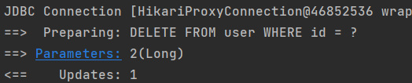

### 13.3.5.增删查改总结

通过观察BaseMapper中的方法，大多方法中都有Wrapper类型的形参，此为条件构造器，可针对于SQL语句设置不同的条件，若没有条件，则可以为该形参赋值null，即查询（删除/修改）所有数据；

### 13.3.6.通用Service

通用 Service CRUD 封装IService接口，进一步封装 CRUD 采用 get 查询单行， remove 删除， list 查询集合， page 分页， 前缀命名方式区分 Mapper 层避免混淆；

泛型 T 为任意实体对象；

建议如果存在自定义通用 Service 方法的可能，请创建自己的IBaseService 继承Mybatis-Plus 提供的基类

官网地址：https://baomidou.com/pages/49cc81/#service-crud-%E6%8E%A5%E5%8F%A3

#### IService

MyBatis-Plus中有一个接口 IService和其实现类 ServiceImpl，封装了常见的业务层逻辑；

详情查看源码IService和ServiceImpl；

#### 创建Service接口和实现类

**接口如下：**

```java
package top.sharehome.promybatisplus.service;

import com.baomidou.mybatisplus.extension.service.IService;
import top.sharehome.promybatisplus.entity.User;

/**
 * @Description
 * @Author:AntonyCheng
 * @CreateTime:2023/1/27 16:54
 */

public interface UserService extends IService<User> {
}
```

**实现类如下：**

```java
package top.sharehome.promybatisplus.service.impl;

import com.baomidou.mybatisplus.extension.service.impl.ServiceImpl;
import top.sharehome.promybatisplus.entity.User;
import top.sharehome.promybatisplus.mapper.UserMapper;
import top.sharehome.promybatisplus.service.UserService;

/**
 * @Description
 * @Author:AntonyCheng
 * @CreateTime:2023/1/27 16:55
 */

public class UserServiceImpl extends ServiceImpl<UserMapper, User> implements UserService {

}
```

**测试查询记录数：**

```java
@Test
public void getCount() {
    // 方式一
    System.out.println("userMapper.selectCount(null) = " + userMapper.selectCount(null));
    //方式二
    System.out.println("userService.count() = " + userService.count());
}
```

查询结果如下：


**测试批量插入：**

```java
@Test
public void getSaveBatch() {
    List<User> userList = new ArrayList<User>();
    for (int i = 100; i < 105; i++) {
        User user = new User((long) i, "User" + i, i - 80, i + "@qq.com");
        userList.add(user);
    }
    userService.saveBatch(userList);
}
```

测试结果如下：


## 13.4.常用注解

### 13.4.1.@TableName

经过以上的测试，在使用MyBatis-Plus实现基本的CRUD时，我们并没有指定要操作的表，只是在Mapper接口继承BaseMapper时，设置了泛型User，而操作的表为user表；

由此得出结论，MyBatis-Plus在确定操作的表时，由BaseMapper的泛型决定，即实体类型决定，且默认操作的表名和实体类型的类名一致

**出现问题：**

若实体类类型的类名和要操作的表的表名不一致，那么会出什么问题呢？

我们将表改成t_user后，测试查询功能，程序会抛出异常：Table 'mybatis_plus.user' doesn't exist；


**解决方案：**

我们可以通过@TableName注解标识实体类对应的表，即可成功执行SQL语句：

```java
package top.sharehome.promybatisplus.entity;

import java.io.Serializable;

import com.baomidou.mybatisplus.annotation.TableName;
import lombok.AllArgsConstructor;
import lombok.Data;
import lombok.NoArgsConstructor;
import org.springframework.context.annotation.Bean;
import org.springframework.stereotype.Repository;

@Data
@Repository
@NoArgsConstructor
@AllArgsConstructor
@TableName("t_user")
public class User implements Serializable {
    /**
     * 主键ID
     */
    private Long id;

    /**
     * 姓名
     */
    private String name;

    /**
     * 年龄
     */
    private Integer age;

    /**
     * 邮箱
     */
    private String email;

    private static final long serialVersionUID = 1L;
}
```

在实际开发中我们经常会遇到异常问题，即实体类对应的表都有固定的前缀，例如t\_或者tbl\_；

此时可以使用Mybatis-Plus提供的全局配置，为实体类所对应的表名设置默认的前缀，那么就不需要在每个实体类上通过@TableName标识实体类对应的表；

```yaml
mybatis-plus:
  configuration:
    log-impl: org.apache.ibatis.logging.stdout.StdOutImpl
  global-config:
    db-config:
      # 这个注解可以统一MP操作表的默认前缀
      table-prefix: t_
```

### 13.4.2.@TableId

经过以上的测试，MyBatis-Plus在实现CRUD时，会默认将id作为主键列，并在插入数据时，默认基于==雪花算法==的策略生成id；

**出现问题：**

若实体类和表中表示主键的不是id，而是其他字段，例如uid，MyBatis-Plus会自动识别uid为主键列吗？

我们实体类中的属性id改为uid，将表中的字段id也改为uid，测试添加功能；

程序抛出异常，Can not find table primary key in Class: "top.sharehome.promybatisplus.entity.User".Field 'uid' doesn't have a default value，说明MyBatis-Plus没有将uid作为主键赋值；


**解决方案：**

我们在实体类中uid属性上通过@TableId将其标识为主键，即可成功执行SQL语句；

```java
package top.sharehome.promybatisplus.entity;

import java.io.Serializable;

import com.baomidou.mybatisplus.annotation.TableId;
import com.baomidou.mybatisplus.annotation.TableName;
import lombok.AllArgsConstructor;
import lombok.Data;
import lombok.NoArgsConstructor;
import org.springframework.stereotype.Repository;

@Data
@Repository
@NoArgsConstructor
@AllArgsConstructor
@TableName("t_user")
public class User implements Serializable {
    /**
     * 主键ID
     */
    @TableId
    private Long uid;

    /**
     * 姓名
     */
    private String name;

    /**
     * 年龄
     */
    private Integer age;

    /**
     * 邮箱
     */
    private String email;

    private static final long serialVersionUID = 1L;
}
```

**扩展点：**

==**@TableId的value属性：**==

若实体类中主键对应的属性为id，而表中表示主键的字段为uid，此时若只在属性id上添加注解@TableId，则抛出异常Unknown column 'id' in 'field list'，即MyBatis-Plus仍然会将id作为表的主键操作，而表中表示主键的是字段uid；


此时需要通过@TableId注解的value属性，指定表中的主键字段，@TableId("uid")或@TableId(value="uid")

==**@TableId的type属性：**==

type属性用来定义主键策略；

常用的主键策略如下：

| **值**                   | **描述**                                                     |
| ------------------------ | ------------------------------------------------------------ |
| IdType.ASSIGN_ID（默认） | 基于雪花算法的策略生成数据id，与数据库id是否设置自增无关     |
| IdType.AUTO              | 使用数据库的自增策略，注意，该类型请确保数据库设置了id自增， 否则无效 |

配置全局主键策略：

```yaml
mybatis-plus:
  configuration:
    log-impl: org.apache.ibatis.logging.stdout.StdOutImpl
  global-config:
    db-config:
      #配置MP的主键策略
      id-type: auto
```

==**雪花算法：**==

背景：

需要选择合适的方案去应对数据规模的增长，以应对逐渐增长的访问压力和数据量。 数据库的扩展方式主要包括：业务分库、主从复制，数据库分表。

数据库分表：

将不同业务数据分散存储到不同的数据库服务器，能够支撑百万甚至千万用户规模的业务，但如果业务 继续发展，同一业务的单表数据也会达到单台数据库服务器的处理瓶颈。例如，淘宝的几亿用户数据， 如果全部存放在一台数据库服务器的一张表中，肯定是无法满足性能要求的，此时就需要对单表数据进行拆分。

单表数据拆分有两种方式：垂直分表和水平分表。示意图如下：


- 垂直分表：

  垂直分表适合将表中某些不常用且占了大量空间的列拆分出去。

  例如，前面示意图中的 nickname 和 description 字段，假设我们是一个婚恋网站，用户在筛选其他用户的时候，主要是用 age 和 sex 两个字段进行查询，而 nickname 和 description 两个字段主要用于展示，一般不会在业务查询中用到。description 本身又比较长，因此我们可以将这两个字段独立到另外一张表中，这样在查询 age 和 sex 时，就能带来一定的性能提升。

- 水平拆分：

  水平分表适合表行数特别大的表，有的公司要求单表行数超过 5000 万就必须进行分表，这个数字可以

  作为参考，但并不是绝对标准，关键还是要看表的访问性能。对于一些比较复杂的表，可能超过 1000

  万就要分表了；而对于一些简单的表，即使存储数据超过 1 亿行，也可以不分表。

  但不管怎样，当看到表的数据量达到千万级别时，作为架构师就要警觉起来，因为这很可能是架构的性 能瓶颈或者隐患。

  水平分表相比垂直分表，会引入更多的复杂性，例如==要求全局唯一的数据id该如何处理？==

  - 主键自增：

    ①以最常见的用户 ID 为例，可以按照 1000000 的范围大小进行分段，1 ~ 999999 放到表 1中， 1000000 ~ 1999999 放到表2中，以此类推。

    ②复杂点：分段大小的选取。分段太小会导致切分后子表数量过多，增加维护复杂度；分段太大可能会 导致单表依然存在性能问题，一般建议分段大小在 100 万至 2000 万之间，具体需要根据业务选取合适的分段大小。

    ③优点：可以随着数据的增加平滑地扩充新的表。例如，现在的用户是 100 万，如果增加到 1000 万， 只需要增加新的表就可以了，原有的数据不需要动。

    ④缺点：分布不均匀。假如按照 1000 万来进行分表，有可能某个分段实际存储的数据量只有 1 条，而另外一个分段实际存储的数据量有 1000 万条。

  - 取模：

    ①同样以用户 ID 为例，假如我们一开始就规划了 10 个数据库表，可以简单地用 user_id % 10 的值来表示数据所属的数据库表编号，ID 为 985 的用户放到编号为 5 的子表中，ID 为 10086 的用户放到编号

    为 6 的子表中。

    ②复杂点：初始表数量的确定。表数量太多维护比较麻烦，表数量太少又可能导致单表性能存在问题。

    ③优点：表分布比较均匀。

    ④缺点：扩充新的表很麻烦，所有数据都要重分布。

  - ==雪花算法：==

    雪花算法是由Twitter公布的分布式主键生成算法，它能够保证不同表的主键的不重复性，以及相同表的主键的有序性。

    ①核心思想：

    长度共64bit（一个long型）。

    首先是一个符号位，1bit标识，由于long基本类型在Java中是带符号的，最高位是符号位，正数是0，负    数是1，所以id一般是正数，最高位是0。

    41bit时间截(毫秒级)，存储的是时间截的差值（当前时间截 - 开始时间截)，结果约等于69.73年。

    10bit作为机器的ID（5个bit是数据中心，5个bit的机器ID，可以部署在1024个节点）。

    12bit作为毫秒内的流水号（意味着每个节点在每毫秒可以产生 4096 个 ID）。

    

    ②优点：整体上按照时间自增排序，并且整个分布式系统内不会产生ID碰撞，并且效率较高。

### 13.4.3.@TableField

经过以上的测试，我们可以发现，MyBatis-Plus在执行SQL语句时，要保证实体类中的属性名和   表中的字段名一致；

如果实体类中的属性名和字段名不一致的情况，会出现什么问题呢？

**情况一：**

若实体类中的属性使用的是驼峰命名风格，而表中的字段使用的是下划线命名风格 例如实体类属性userName，表中字段user_name；

此时MyBatis-Plus会自动将下划线命名风格转化为驼峰命名风格；

相当于在MyBatis中配置驼峰转换，当然在Mybatis-Plus中也有类似全局配置，这里建议还是像往常一样都进行配置：

```yaml
mybatis-plus:
  configuration:
    log-impl: org.apache.ibatis.logging.stdout.StdOutImpl
    map-underscore-to-camel-case: true
```

**情况二：**

若实体类中的属性和表中的字段不满足情况一，例如实体类属性name，表中字段username；

此时需要在实体类属性上使用@TableField("username")设置属性所对应的字段名；

```java
package top.sharehome.promybatisplus.entity;

import java.io.Serializable;

import com.baomidou.mybatisplus.annotation.TableField;
import com.baomidou.mybatisplus.annotation.TableId;
import com.baomidou.mybatisplus.annotation.TableName;
import lombok.AllArgsConstructor;
import lombok.Data;
import lombok.NoArgsConstructor;
import org.springframework.stereotype.Repository;

@Data
@Repository
@NoArgsConstructor
@AllArgsConstructor
@TableName("t_user")
public class User implements Serializable {
    /**
     * 主键ID
     */
    @TableId(value = "id")
    private Long id;

    /**
     * 姓名
     */
    @TableField("name")
    private String name;

    /**
     * 年龄
     */
    @TableField("age")
    private Integer age;

    /**
     * 邮箱
     */
    @TableField("email")
    private String email;

    private static final long serialVersionUID = 1L;
}
```

### 13.4.4.@TableLogic

**逻辑删除：**

物理删除：真实删除，将对应数据从数据库中删除，之后查询不到此条被删除的数据；

逻辑删除：假删除，将对应数据中代表是否被删除字段的状态修改为“被删除状态”，之后在数据库中仍旧能看到此条数据记录；

使用场景：可以进行数据恢复；

**实现逻辑删除：**

1. 数据库中创建逻辑删除状态列，通常字段名为is_deleted，设置默认值为0；

   

2. 实体类中添加逻辑删除属性；

   ```java
   package top.sharehome.promybatisplus.entity;
   
   import java.io.Serializable;
   
   import com.baomidou.mybatisplus.annotation.TableField;
   import com.baomidou.mybatisplus.annotation.TableId;
   import com.baomidou.mybatisplus.annotation.TableLogic;
   import com.baomidou.mybatisplus.annotation.TableName;
   import lombok.AllArgsConstructor;
   import lombok.Data;
   import lombok.NoArgsConstructor;
   import org.springframework.stereotype.Repository;
   
   @Data
   @Repository
   @NoArgsConstructor
   @AllArgsConstructor
   @TableName("t_user")
   public class User implements Serializable {
       /**
        * 主键ID
        */
       @TableId(value = "id")
       private Long id;
   
       /**
        * 姓名
        */
       @TableField("name")
       private String name;
   
       /**
        * 年龄
        */
       @TableField("age")
       private Integer age;
   
       /**
        * 邮箱
        */
       @TableField("email")
       private String email;
   
       /**
        * 逻辑删除
        */
       @TableField("is_deleted")
       @TableLogic
       private Integer isDeleted;
   
       private static final long serialVersionUID = 1L;
   }
   ```

3. 测试删除功能

   ```java
   @Test
   public void deleteUserByIds() {
      // UPDATE t_user SET is_deleted=1 WHERE id IN ( ? , ? ) AND is_deleted=0
       userMapper.deleteBatchIds(Arrays.asList(4L, 6L));
   }
   ```

   测试结果如下：

   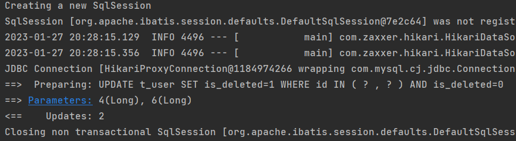

   

## 13.5.条件构造器和常用接口

### 13.5.1.wrapper介绍


Wrapper：条件构造器抽象类（最顶端的父类）：

- AbstractWrapper：用于条件封装，生成sql的where条件；
  - QueryWrapper：Select条件封装；
  - UpdateWrapper：Update条件封装；
  - AbstractLambdaWrapper：使用Lambda语法的条件封装：
    - LambdaQueryWrapper：基于Lambda语法使用的SelectWrapper；
    - LambdaUpdateWrapper：基于Lambda语法使用的UpdateWrapper；

**准备数据：**

```java
@Test
public void getSaveBatch() {
    List<User> userList = new ArrayList<User>();
    for (int i = 1; i < 100; i++) {
        User user = new User((long) i, "User" + i, i - 8, i + "@qq.com", 0);
        userList.add(user);
    }
    userService.saveBatch(userList);
}
```

### 13.5.2.QueryWrapper

#### 组装查询条件

使用条件构造器进行查询，查询用户名包含1，年龄30-70之间，并且邮箱不为空的用户信息；

```java
@Test
public void selectUserByWrapper() {
    QueryWrapper<User> queryWrapper = new QueryWrapper<User>();
    // Preparing: SELECT id,name,age,email,is_deleted FROM t_user WHERE is_deleted=0 AND (name LIKE ? AND age BETWEEN ? AND ? AND email IS NOT NULL)
    queryWrapper
            .like("name", "1")
            .between("age", 30, 70)
            .isNotNull("email");
    userMapper.selectList(queryWrapper).forEach(System.out::println);
}
```

查询结果如下：


#### 组装排序条件

使用条件构造器进行排序，查询20-30岁的人，并且按照年龄降序排序，同年龄则按照id升序排序；

```java
@Test
public void selectUserByOrderWrapper() {
    // Preparing: SELECT id,name,age,email,is_deleted FROM t_user WHERE is_deleted=0 AND (age BETWEEN ? AND ?) ORDER BY age DESC,id ASC
    QueryWrapper<User> queryWrapper = new QueryWrapper<>();
    queryWrapper
            .between("age", 20, 30)
            .orderByDesc("age")
            .orderByAsc("id");
    userMapper.selectList(queryWrapper).forEach(System.out::println);
}
```

查询结果如下：


#### 组装删除条件

使用条件构造器进行删除，删除90岁以上的人的信息；

```java
@Test
public void deleteUserByWrapper() {
    // UPDATE t_user SET is_deleted=1 WHERE is_deleted=0 AND (age > ?)
    QueryWrapper<User> queryWrapper = new QueryWrapper<>();
    queryWrapper
            .gt("age", 90);
    userMapper.delete(queryWrapper);
}
```

处理结果如下：


#### 条件的优先级

将（年龄大于80并且用户名中包含有1）或（年龄大于90并且邮箱不为null）的用户邮箱修改为123@qq.com；

```java
@Test
public void updateUserByWrapper() {
    // Preparing: UPDATE t_user SET email=? WHERE is_deleted=0 AND (age > ? AND name LIKE ? OR age >= ? AND email IS NOT NULL)
    QueryWrapper<User> queryWrapper = new QueryWrapper<User>();
    queryWrapper
            .gt("age", 80)
            .like("name", "1")
            .or()
            .ge("age", 90)
            .isNotNull("email");
    userMapper.update(new User(null, null, null, "123@qq.com", null), queryWrapper);
}
```

处理结果如下：


将用户名中包含有1并且（年龄小于70或邮箱为null）的用户邮箱修改成456@qq.com；

```java
@Test
public void updateUserByWrapper2() {
    // Preparing: UPDATE t_user SET email=? WHERE is_deleted=0 AND (name LIKE ? AND (age < ? OR email IS NULL))
    QueryWrapper<User> queryWrapper = new QueryWrapper<>();
    queryWrapper
            .like("name", 1)
            .and(qw -> qw
                    .lt("age", 70)
                    .or()
                    .isNull("email"));
    userMapper.update(new User(null,null,null,"456@qq.com",null),queryWrapper);
}
```

处理结果如下：


#### 组装查询子句

查询所有用户的名字和年龄；

```java
@Test
public void selectSonUserByWrapper() {
    // Preparing: SELECT name,age FROM t_user WHERE is_deleted=0
    QueryWrapper<User> queryWrapper = new QueryWrapper<>();
    queryWrapper.select("name", "age");
    // 可以使用selectList方法进行数据获取
    // userMapper.selectList(queryWrapper).forEach(System.out::println);
    // 但是为了避免user对象中没有查到的列值为null(出现NPE异常)，select常常结合selectMaps方法进行查询
    userMapper.selectMaps(queryWrapper).forEach(System.out::println);
}
```

查询结果如下：

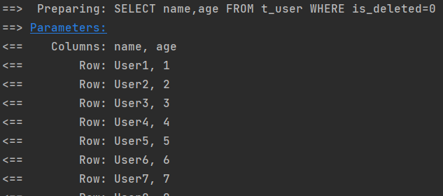


#### 实现子查询

查询id小于等于3的用户信息；

```java
@Test
public void selectSub() {
    // Preparing: SELECT id,name,age,email,is_deleted FROM t_user WHERE is_deleted=0 AND (id IN (select id from t_user where id <= 3))
    QueryWrapper<User> queryWrapper = new QueryWrapper<User>();
    queryWrapper.inSql("id", "select id from t_user where id <= 3");
    userMapper.selectList(queryWrapper).forEach(System.out::println);
}
```

查询结果如下：


### 13.5.3.UpdateWrapper

将（年龄大于20或邮箱为null）并且用户名中包含有2的用户姓名修改成update；

```java
@Test
public void updateByUpdateWrapper() {
    // Preparing: UPDATE t_user SET name=? WHERE is_deleted=0 AND (name LIKE ? AND (age > ? OR email IS NULL))
    UpdateWrapper<User> updateWrapper = new UpdateWrapper<User>();
    updateWrapper
            .set("name", "update")
            .like("name", 1)
            .and(uw -> uw
                    .gt("age", 20)
                    .or()
                    .isNull("email"));
    userMapper.update(null, updateWrapper);
}
```

修改结果如下：


### 13.5.4.condition

在真正开发的过程中，组装条件是常见的功能，而这些条件数据来源于用户输入，是可选的，因 此我们在组装这些条件时，必须先判断用户是否选择了这些条件，若选择则需要组装该条件，若 没有选择则一定不能组装，以免影响SQL执行的结果；

**需求：**从客户端传来name，ageBegin，ageEnd三个参数，三个参数都可能为空，要求找到如果name为空，那么就匹配name中包含1的，不为空那么就不做处理；若ageBegin和ageEnd都不为空，那么匹配10<=age<=24的，如果一方为空，那么就默认无穷大；

#### 思路一

在提交给Mybatis之前进行Java代码的判定；

```java
@Test
public void setCondition1() {
    //定义查询条件，有可能为null（用户未输入或未选择）
    String username = null;
    Integer ageBegin = 10;
    Integer ageEnd = 24;
    QueryWrapper<User> queryWrapper = new QueryWrapper<>();
    //StringUtils.isNotBlank()判断某字符串是否不为空且长度不为0且不由空白符(whitespace)构成
    if (StringUtils.isNotBlank(username)) {
        queryWrapper.like("username", "a");
    }
    if (ageBegin != null) {
        queryWrapper.ge("age", ageBegin);
    }
    if (ageEnd != null) {
        queryWrapper.le("age", ageEnd);
    }
    //SELECT id,username AS name,age,email,is_deleted FROM t_user WHERE (age >=? AND age <= ?)
    userMapper.selectList(queryWrapper).forEach(System.out::println);
}
```

查询结果如下：


#### 思路二

上面的实现方案没有问题，但是代码比较复杂，我们可以使用带condition参数的重载方法构建查询条件，简化代码的编写；

```java
public void setCondition2() {
    // Preparing: SELECT id,name,age,email,is_deleted FROM t_user WHERE is_deleted=0 AND (age >= ? AND age <= ?)
    //定义查询条件，有可能为null（用户未输入或未选择）
    String name = null;
    Integer ageBegin = 10;
    Integer ageEnd = 24;
    QueryWrapper<User> queryWrapper = new QueryWrapper<>();
    queryWrapper
            .like(StringUtils.isNotBlank(name), "name", "1")
            .ge(ageBegin != null, "age", ageBegin)
            .le(ageEnd != null, "age", ageEnd);
    userMapper.selectList(queryWrapper).forEach(System.out::println);
}
```

查询结果如下：


### 13.5.5.LambdaQueryWrapper

**需求：**从客户端传来name，ageBegin，ageEnd三个参数，三个参数都可能为空，要求找到如果name为空，那么就匹配name中包含1的，不为空那么就不做处理；若ageBegin和ageEnd都不为空，那么匹配10<=age<=24的，如果一方为空，那么就默认无穷大；

```java
@Test
public void selectByLambda() {
    // Preparing: SELECT id,name,age,email,is_deleted FROM t_user WHERE is_deleted=0 AND (age >= ? AND age <= ?)
    String name = null;
    Integer ageBegin = 10;
    Integer ageEnd = 24;
    LambdaQueryWrapper<User> queryWrapper = new LambdaQueryWrapper<User>();
    queryWrapper
            .like(StringUtils.isNotBlank(name), User::getName, name)
            .ge(ageBegin != null, User::getAge, ageBegin)
            .le(ageEnd != null, User::getAge, ageEnd);
    userMapper.selectList(queryWrapper).forEach(System.out::println);
}
```

查询结果如下：


### 13.5.6.LambdaUpdateWrapper

**需求：**年龄大于等于80的用户邮箱改成999@qq.com

```java
@Test
public void updateByLambda() {
    // Preparing: UPDATE t_user SET email=? WHERE is_deleted=0 AND (age >= ?)
    LambdaUpdateWrapper<User> updateWrapper = new LambdaUpdateWrapper<User>();
    updateWrapper
            .set(User::getEmail, "999@qq.com")
            .ge(User::getAge, 80);
    userMapper.update(null, updateWrapper);
}
```

修改结果如下：


## 13.6.插件

### 13.6.1.分页插件

MyBatis Plus自带分页插件，只要简单的配置即可实现分页功能

**添加配置类：**

```java
package top.sharehome.promybatisplus.config;

import com.baomidou.mybatisplus.annotation.DbType;
import com.baomidou.mybatisplus.extension.plugins.MybatisPlusInterceptor;
import com.baomidou.mybatisplus.extension.plugins.inner.PaginationInnerInterceptor;
import org.springframework.context.annotation.Bean;
import org.springframework.context.annotation.Configuration;

/**
 * @Description
 * @Author:AntonyCheng
 * @CreateTime:2023/1/28 11:10
 */
@Configuration
//@MapperScan("top.sharehome.promybatisplus.mapper") //可以将主类的MapperScan设置在该配置类中
public class MybatisPlusConfig {
    @Bean
    public MybatisPlusInterceptor mybatisPlusInterceptor() {
        MybatisPlusInterceptor interceptor = new MybatisPlusInterceptor();
        // 分页插件
        interceptor.addInnerInterceptor(new PaginationInnerInterceptor(DbType.MYSQL));
        return interceptor;
    }
}
```

**编写测试类：**

```java
@Test
public void testPage() {
    // Preparing: SELECT id,name,age,email,is_deleted FROM t_user WHERE is_deleted=0 LIMIT ?
    //设置分页参数
    Page<User> page = new Page<>(1, 5);
    userMapper.selectPage(page, null);
    //获取分页数据
    List<User> list = page.getRecords();
    list.forEach(System.out::println);
    System.out.println(" 当 前 页 ：" + page.getCurrent());
    System.out.println("每页显示的条数：" + page.getSize());
    // Preparing: SELECT COUNT(*) AS total FROM t_user WHERE is_deleted = 0
    System.out.println(" 总 记 录 数 ：" + page.getTotal());
    System.out.println(" 总 页 数 ：" + page.getPages());
    System.out.println("是否有上一页：" + page.hasPrevious());
    System.out.println("是否有下一页：" + page.hasNext());
}
```

测试结果如下：


### 13.6.2.xml自定义分页

**根据年龄查询用户列表，分页显示；**

在XxxMapper.java文件中定义接口方法：

```java
package top.sharehome.promybatisplus.mapper;

import com.baomidou.mybatisplus.core.mapper.BaseMapper;
import com.baomidou.mybatisplus.core.metadata.IPage;
import com.baomidou.mybatisplus.extension.plugins.pagination.Page;
import org.apache.ibatis.annotations.Mapper;
import org.apache.ibatis.annotations.Param;
import top.sharehome.promybatisplus.entity.User;

/**
 * @Description
 * @Author:AntonyCheng
 * @CreateTime:2023/1/27 10:20
 */
@Mapper
public interface UserMapper extends BaseMapper<User> {
    IPage<User> selectPageVo(@Param("page")Page<User> page,@Param("age")Integer age);
}
```

编写xml文件：

```java
<?xml version="1.0" encoding="UTF-8"?>
<!DOCTYPE mapper PUBLIC "-//mybatis.org//DTD Mapper 3.0//EN" "http://mybatis.org/dtd/mybatis-3-mapper.dtd">
<mapper namespace="top.sharehome.promybatisplus.mapper.UserMapper">
    <resultMap id="BaseResultMap" type="top.sharehome.promybatisplus.entity.User">
        <!--@mbg.generated-->
        <!--@Table t_user-->
        <id column="id" jdbcType="BIGINT" property="id"/>
        <result column="name" jdbcType="VARCHAR" property="name"/>
        <result column="age" jdbcType="INTEGER" property="age"/>
        <result column="email" jdbcType="VARCHAR" property="email"/>
        <result column="is_deleted" jdbcType="INTEGER" property="isDeleted"/>
    </resultMap>
    <sql id="Base_Column_List">
        <!--@mbg.generated-->
        id,
        `name`,
        age,
        email,
        is_deleted
    </sql>

    <select id="selectPageVo" resultMap="BaseResultMap">
        SELECT
        <include refid="Base_Column_List">
        </include>
        From t_user
        WHERE age > #{age}
    </select>
</mapper>
```

测试如下：

```java
@Test
public void customizationTestPage() {
    //设置分页参数
    Page<User> page = new Page<>(1, 5);
    userMapper.selectPageVo(page, 30);
    //获取分页数据
    List<User> list = page.getRecords();
    list.forEach(System.out::println);
    System.out.println(" 当 前 页 ：" + page.getCurrent());
    System.out.println("每页显示的条数：" + page.getSize());
    System.out.println(" 总 记 录 数 ：" + page.getTotal());
    System.out.println(" 总 页 数 ：" + page.getPages());
    System.out.println("是否有上一页：" + page.hasPrevious());
    System.out.println("是否有下一页：" + page.hasNext());
}
```

测试结果如下：


### 13.6.3.乐观锁

**场景：**

一件商品，成本价是80元，售价是100元。老板先是通知小李，说你去把商品价格增加50元。小李正在玩游戏，耽搁了一个小时。正好一个小时后，老板觉得商品价格增加到150元，价格太高，可能会影响销量。通知小王，你把商品价格降低30元。

此时，小李和小王同时操作商品后台系统。小李操作的时候，系统先取出商品价格100元；小王 也在操作，取出的商品价格也是100元。小李将价格加了50元，并将100+50=150元存入了数据库；小王将商品减了30元，并将100-30=70元存入了数据库。是的，如果没有锁，小李的操作就完全被小王的覆盖了。

现在商品价格是70元，比成本价低10元。几分钟后，这个商品很快出售了1千多件商品，老板亏1万多。

**乐观锁和悲观锁：**

上面的故事，如果是乐观锁，小王保存价格前，会检查下价格是否被人修改过了。如果被修改过 了，则重新取出的被修改后的价格，150元，这样他会将120元存入数据库；==可以看成异步任务轮询操作；==

如果是悲观锁，小李取出数据后，小王只能等小李操作完之后，才能对价格进行操作，也会保证最终的价格是120元；==可以看成同步任务操作；==

**数据准备：**

数据库中增加商品表；

```sql
CREATE TABLE t_product
(
    id      BIGINT(20)  NOT  NULL COMMENT '主键ID',
    name    VARCHAR(30) NULL DEFAULT NULL COMMENT '商品名称',
    price   INT(11)          DEFAULT 0 COMMENT '价格',
    version INT(11)          DEFAULT 0 COMMENT '乐观锁版本号',
    PRIMARY KEY (id)
);
```

添加数据；

```sql
INSERT INTO t_product (id, NAME, price) VALUES (1, '外星人笔记本', 100);
```

添加实体；

```java
package top.sharehome.promybatisplus.entity;

import java.io.Serializable;

import com.baomidou.mybatisplus.annotation.TableField;
import com.baomidou.mybatisplus.annotation.TableId;
import com.baomidou.mybatisplus.annotation.TableName;
import lombok.AllArgsConstructor;
import lombok.Data;
import lombok.NoArgsConstructor;

@Data
@AllArgsConstructor
@NoArgsConstructor
@TableName("t_product")
public class Product implements Serializable {
    /**
     * 主键ID
     */
    @TableId("id")
    private Long id;

    /**
     * 商品名称
     */
    @TableField("name")
    private String name;

    /**
     * 价格
     */
    @TableField("price")
    private Integer price;

    /**
     * 乐观锁版本号
     */
    @TableField("version")
    private Integer version;

    private static final long serialVersionUID = 1L;
}
```

添加Mapper；

```java
package top.sharehome.promybatisplus.mapper;

import com.baomidou.mybatisplus.core.mapper.BaseMapper;
import org.apache.ibatis.annotations.Mapper;

/**
 * @Description
 * @Author:AntonyCheng
 * @CreateTime:2023/1/28 13:52
 */
@Mapper
public interface ProductMapper extends BaseMapper<ProductMapper> {
}
```

模拟冲突测试：

```java
package top.sharehome.promybatisplus.mapper;

import lombok.extern.slf4j.Slf4j;
import org.junit.jupiter.api.Test;
import org.springframework.boot.test.context.SpringBootTest;
import top.sharehome.promybatisplus.entity.Product;

import javax.annotation.Resource;

@SpringBootTest
@Slf4j
class ProductMapperTest {
    @Resource
    private ProductMapper productMapper;

    @Test
    public void testProductMapper() {
        // 1、小李 ==> 100
        Product p1 = productMapper.selectById(1L);
        System.out.println("小李取出的价格：" + p1.getPrice());

        // 2、小王 ==> 100
        Product p2 = productMapper.selectById(1L);
        System.out.println("小王取出的价格：" + p2.getPrice());

        // 3、小李将价格上调50元，存入数据库 ==> 100+50 ==> 150
        p1.setPrice(p1.getPrice() + 50);
        int res1 = productMapper.updateById(p1);
        System.out.println("小李修改结果：" + res1);

        // 4、小王将价格下调30元，存入数据库 ==> 100-30 ==> 70
        p2.setPrice(p2.getPrice() - 30);
        int res2 = productMapper.updateById(p2);
        System.out.println("小王修改结果：" + res2);

        // 5、最后的结果 ==> 150 被 70 覆盖 ==> 70
        Product p3 = productMapper.selectById(1L);
        System.out.println("最终结果为：" + p3.getPrice());
    }
}
```

冲突测试结果如下：


乐观锁的实现流程：

我们注意到在数据库表中有一个version字段，这个version字段就是实现乐观锁的关键，当我们取出记录时就连带当前version一起取出：

```sql
SELECT id,`name`,price,`version` FROM product WHERE id=1
```

更新数据时，version+1，如果where语句中的version版本不对，则更新失败：

```sql
UPDATE product SET price=price+50, `version`=`version` + 1 WHERE id=1 AND `version`=1
```

Mybatis-Plus实现乐观锁，即在version属性上添加@version注解，同时进行乐观锁插件的配置：

```java
package top.sharehome.promybatisplus.entity;

import java.io.Serializable;

import com.baomidou.mybatisplus.annotation.TableField;
import com.baomidou.mybatisplus.annotation.TableId;
import com.baomidou.mybatisplus.annotation.TableName;
import com.baomidou.mybatisplus.annotation.Version;
import lombok.AllArgsConstructor;
import lombok.Data;
import lombok.NoArgsConstructor;

@Data
@AllArgsConstructor
@NoArgsConstructor
@TableName("t_product")
public class Product implements Serializable {
    /**
     * 主键ID
     */
    @TableId("id")
    private Long id;

    /**
     * 商品名称
     */
    @TableField("name")
    private String name;

    /**
     * 价格
     */
    @TableField("price")
    private Integer price;

    /**
     * 乐观锁版本号
     */
    @TableField("version")
    @Version
    private Integer version;

    private static final long serialVersionUID = 1L;
}
```

```java
package top.sharehome.promybatisplus.config;

import com.baomidou.mybatisplus.annotation.DbType;
import com.baomidou.mybatisplus.extension.plugins.MybatisPlusInterceptor;
import com.baomidou.mybatisplus.extension.plugins.inner.OptimisticLockerInnerInterceptor;
import com.baomidou.mybatisplus.extension.plugins.inner.PaginationInnerInterceptor;
import org.springframework.context.annotation.Bean;
import org.springframework.context.annotation.Configuration;

/**
 * @Description
 * @Author:AntonyCheng
 * @CreateTime:2023/1/28 11:10
 */
@Configuration
//@MapperScan("top.sharehome.promybatisplus.mapper") //可以将主类的MapperScan设置在该配置类中
public class MybatisPlusConfig {
    @Bean
    public MybatisPlusInterceptor mybatisPlusInterceptor() {
        MybatisPlusInterceptor interceptor = new MybatisPlusInterceptor();
        // 分页插件
        interceptor.addInnerInterceptor(new PaginationInnerInterceptor(DbType.MYSQL));
        // 乐观锁插件
        interceptor.addInnerInterceptor(new OptimisticLockerInnerInterceptor());
        return interceptor;
    }
}
```

再次运行冲突测试程序：


优化流程：

```java
@Test
public void testProductMapper2() {
    // 1、小李 ==> 100
    Product p1 = productMapper.selectById(1L);
    System.out.println("小李取出的价格：" + p1.getPrice());

    // 2、小王 ==> 100
    Product p2 = productMapper.selectById(1L);
    System.out.println("小王取出的价格：" + p2.getPrice());

    // 3、小李将价格上调50元，存入数据库 ==> 100+50 ==> 150
    p1.setPrice(p1.getPrice() + 50);
    int res1 = productMapper.updateById(p1);
    System.out.println("小李修改结果：" + res1);

    // 4、小王将价格下调30元，存入数据库，发现版本不对，对数据库进行轮询重试 ==> 150-30 ==> 120
    p2.setPrice(p2.getPrice() - 30);
    int res2 = productMapper.updateById(p2);
    if (res2==0){
        p2 = productMapper.selectById(1L);
        p2.setPrice(p2.getPrice() - 30);
        res2 = productMapper.updateById(p2);
    }
    System.out.println("小王修改结果：" + res2);

    // 5、最后的结果 ==> 120
    Product p3 = productMapper.selectById(1L);
    System.out.println("最终结果为：" + p3.getPrice());
}
```

测试结果如下：


## 13.7.通用枚举

表中的有些字段值是固定的，例如性别（男或女），此时我们可以使用MyBatis-Plus的通用枚举来实现；

**数据库表添加字段sex：**


**添加实体类字段：**

```java
package top.sharehome.promybatisplus.entity;

import java.io.Serializable;

import com.baomidou.mybatisplus.annotation.TableField;
import com.baomidou.mybatisplus.annotation.TableId;
import com.baomidou.mybatisplus.annotation.TableLogic;
import com.baomidou.mybatisplus.annotation.TableName;
import lombok.AllArgsConstructor;
import lombok.Data;
import lombok.NoArgsConstructor;
import org.springframework.stereotype.Repository;

@Data
@Repository
@NoArgsConstructor
@AllArgsConstructor
@TableName("t_user")
public class User implements Serializable {
    /**
     * 主键ID
     */
    @TableId(value = "id")
    private Long id;

    /**
     * 姓名
     */
    @TableField("name")
    private String name;

    /**
     * 年龄
     */
    @TableField("age")
    private Integer age;

    /**
     * 邮箱
     */
    @TableField("email")
    private String email;

    /**
     * 性别
     */
    @TableField("sex")
    private Integer sex;

    /**
     * 逻辑删除
     */
    @TableField("is_deleted")
    @TableLogic
    private Integer isDeleted;

    private static final long serialVersionUID = 1L;
}
```

**创建通用枚举类型：**

```java
package top.sharehome.promybatisplus.enums;

import com.baomidou.mybatisplus.annotation.EnumValue;
import lombok.Getter;

/**
 * @Description
 * @Author:AntonyCheng
 * @CreateTime:2023/1/28 23:51
 */
@Getter
public enum SexEnum {
    MALE(1,"男"),
    FEMALE(2,"女");

    @EnumValue
    private Integer sex;
    private String sexName;

    SexEnum(Integer sex,String sexName) {
        this.sex = sex;
        this.sexName = sexName;
    }
}
```

**配置扫描通用枚举：**

```yaml
mybatis-plus:
  configuration:
    log-impl: org.apache.ibatis.logging.stdout.StdOutImpl
    map-underscore-to-camel-case: true
  # 配置扫描通用枚举
  type-enums-package: top.sharehome.promybatisplus.enums
```

**测试如下：**

```java
@Test
public void testSexEnum() {
    // INSERT INTO t_user ( id, name, sex ) VALUES ( ?, ?, ? )
    User user = new User();
    user.setName("Enum");
    //设置性别信息为枚举项，会将@EnumValue注解所标识的属性值存储到数据库
    user.setSex(SexEnum.MALE.getSex());
    userMapper.insert(user);
}
```

**测试结果如下：**


## 13.8.代码生成器

**引入依赖：**

```xml
<dependency>
    <groupId>com.baomidou</groupId>
    <artifactId>mybatis-plus-generator</artifactId>
    <version>3.5.1</version>
</dependency>
<dependency>
    <groupId>org.freemarker</groupId>
    <artifactId>freemarker</artifactId>
    <version>2.3.31</version>
</dependency>
```

**快速生成：**

```java
package top.sharehome.promybatisplus;

import com.baomidou.mybatisplus.generator.FastAutoGenerator;
import com.baomidou.mybatisplus.generator.config.OutputFile;
import com.baomidou.mybatisplus.generator.engine.FreemarkerTemplateEngine;

import java.util.Collections;

/**
 * @Description
 * @Author:AntonyCheng
 * @CreateTime:2023/1/29 10:22
 */

public class FastAutoGeneratorTest {
    public static void main(String[] args) {
        FastAutoGenerator.create("jdbc:mysql://127.0.0.1:3306/mybatis_plus?characterEncoding=utf-8&userSSL=false", "root", "123456")
                .globalConfig(builder -> {
                    builder.author("AntonyCheng") // 设置作者
                            //.enableSwagger() // 开启 swagger 模式
                            .fileOverride() // 覆盖已生成文件
                            .outputDir("D://mybatis_plus"); // 指定输出目录
                })
                .packageConfig(builder -> {
                    builder.parent("top.sharehome") // 设置父包名
                            .moduleName("mybatisplus") // 设置父包模块名
                            .pathInfo(Collections.singletonMap(OutputFile.mapperXml, "D://mybatis_plus"));// 设置mapperXml生成路径
                })
                .strategyConfig(builder -> {
                    builder.addInclude("t_user") // 设置需要生成的表名
                            .addTablePrefix("t_", "c_"); // 设置过滤表前缀
                })
                .templateEngine(new FreemarkerTemplateEngine()) // 使用Freemarker 引擎模板，默认的是Velocity引擎模板
                .execute();
    }
}
```

生成结果如下：


## 13.9.多数据源

适用于多种场景：纯粹多库、 读写分离、 一主多从、 混合模式等目前我们就来模拟一个纯粹多库的一个场景，其他场景类似；

场景说明：

我们创建两个库，分别为：mybatis_plus（以前的库不动）与mybatis_plus_1（新建），将mybatis_plus库的t_product表移动到mybatis_plus_1库，这样每个库一张表，通过一个测试用例分别获取用户数据与商品数据，如果获取到说明多库模拟成功；

### 13.9.1.准备工作

**创建数据库和表：**

```sql
CREATE DATABASE `mybatis_plus_1` /*!40100 DEFAULT CHARACTER SET utf8mb4 */;
use `mybatis_plus_1`;
CREATE TABLE t_product
(
    id      BIGINT(20)  NOT NULL COMMENT '主键ID',
    name    VARCHAR(30) NULL DEFAULT NULL COMMENT '商品名称',
    price   INT(11)          DEFAULT 0 COMMENT '价格',
    version INT(11)          DEFAULT 0 COMMENT '乐观锁版本号',
    PRIMARY KEY (id)
);
```

**添加测试数据：**

```sql
INSERT INTO product (id, NAME, price) VALUES (1, '外星人笔记本', 100);
```

**然后删除mybatis_plus中的product表；**

### 13.9.2.引入依赖

```xml
<dependency>
    <groupId>com.baomidou</groupId>
    <artifactId>dynamic-datasource-spring-boot-starter</artifactId>
    <version>3.5.1</version>
</dependency>
```

### 13.9.3.配置多数据源

```yaml
spring:
  datasource:
    dynamic:
      primary: master
      strict: false
      datasource:
        master:
          driver-class-name: com.mysql.cj.jdbc.Driver
          url: jdbc:mysql://localhost:3306/mybatis_plus?characterEncoding=utf-8&useSSL=false&allowPublicKeyRetrieval=true
          username: root
          password: cry020114
        slave_1:
          driver-class-name: com.mysql.cj.jdbc.Driver
          url: jdbc:mysql://localhost:3306/mybatis_plus_1?characterEncoding=utf-8&useSSL=false&allowPublicKeyRetrieval=true
          username: root
          password: cry020114
```

### 13.9.4.@DS注解

在每个实体类所对应的Service层（Service实现类）上标记好在配置中写好的从属数据库关系；

```java
package top.sharehome.promybatisplus.service.impl;

import com.baomidou.dynamic.datasource.annotation.DS;
import com.baomidou.mybatisplus.extension.service.impl.ServiceImpl;
import org.springframework.stereotype.Service;
import top.sharehome.promybatisplus.entity.User;
import top.sharehome.promybatisplus.mapper.UserMapper;
import top.sharehome.promybatisplus.service.UserService;

/**
 * @Description
 * @Author:AntonyCheng
 * @CreateTime:2023/1/27 16:55
 */
@Service
@DS("master")
public class UserServiceImpl extends ServiceImpl<UserMapper, User> implements UserService {

}
```

```java
package top.sharehome.promybatisplus.service.impl;

import com.baomidou.dynamic.datasource.annotation.DS;
import com.baomidou.mybatisplus.extension.service.impl.ServiceImpl;
import org.springframework.stereotype.Service;
import top.sharehome.promybatisplus.entity.Product;
import top.sharehome.promybatisplus.mapper.ProductMapper;
import top.sharehome.promybatisplus.service.ProductService;

/**
 * @Description
 * @Author:AntonyCheng
 * @CreateTime:2023/1/29 10:47
 */
@DS("slave_1")
@Service
public class ProductServiceImpl extends ServiceImpl<ProductMapper, Product> implements ProductService {
}
```

**测试如下：**

```java
package top.sharehome.promybatisplus;

import org.junit.jupiter.api.Test;
import org.springframework.boot.test.context.SpringBootTest;
import top.sharehome.promybatisplus.service.ProductService;
import top.sharehome.promybatisplus.service.UserService;

import javax.annotation.Resource;

/**
 * @Description
 * @Author:AntonyCheng
 * @CreateTime:2023/1/29 10:50
 */
@SpringBootTest
public class DependencyTest {
    @Resource
    private UserService userService;
    @Resource
    private ProductService productService;

    @Test
    public void testDependency() {
        System.out.println(userService.getById(1L));
        System.out.println(productService.getById(1L));
    }
}
```

测试结果如下：


